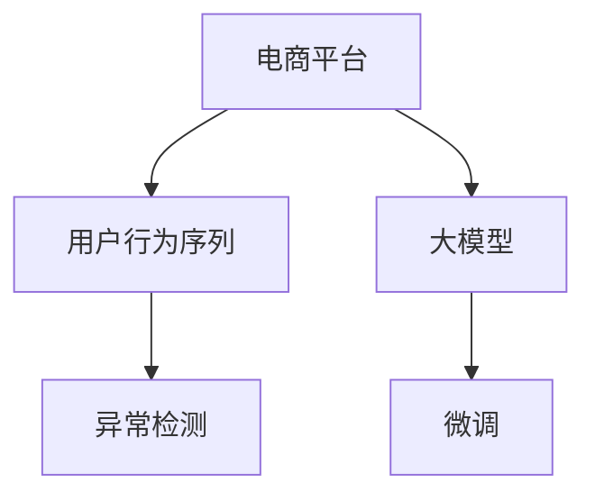

                 

# 探讨大模型在电商平台用户行为序列异常检测中的潜力

## 1. 背景介绍

### 1.1 问题由来

近年来，随着电子商务的快速发展，电商平台的用户行为序列（User Behavior Sequences）异常检测（Anomaly Detection）成为了保障平台安全、提升用户体验的重要任务。传统的异常检测方法多依赖于规则匹配、统计特征分析等技术，难以应对复杂多变的异常行为。随着深度学习技术的发展，大模型（Large Models）尤其是基于自回归（Auto-Regressive）结构的大模型，凭借其强大的语言理解能力和表征学习能力，在异常检测领域展现出巨大的潜力。

### 1.2 问题核心关键点

电商平台用户行为序列异常检测的核心在于如何通过序列建模，识别出用户行为中的异常模式。大模型通常采用自回归模型（如GPT-3、BERT等），这些模型通过在大量文本数据上进行预训练，学习了丰富的语言知识和上下文理解能力。在应用到电商平台用户行为序列时，可以通过微调（Fine-Tuning）方法，使其学习到特定领域的语言表示，从而实现异常行为的检测。

## 2. 核心概念与联系

### 2.1 核心概念概述

为更好地理解大模型在电商平台用户行为序列异常检测中的应用，本节将介绍几个密切相关的核心概念：

- 电商平台（E-commerce Platform）：指提供商品或服务交易、信息展示、互动交流等功能的在线平台，如Amazon、淘宝、京东等。
- 用户行为序列（User Behavior Sequences）：指用户在电商平台上的行为记录，如点击、浏览、购买、评价等，通过时间顺序排布形成序列数据。
- 异常检测（Anomaly Detection）：指通过算法模型，识别出与正常行为模式不同的异常行为，以便及时预警和处理。
- 大模型（Large Models）：指具有大规模参数量、基于自回归模型架构的深度学习模型，如BERT、GPT等。
- 序列建模（Sequence Modeling）：指通过时间序列数据建模，捕捉用户行为模式，识别出异常行为。
- 微调（Fine-Tuning）：指在预训练模型的基础上，使用特定的任务数据集进行有监督学习，调整模型参数以适应新任务。

这些核心概念之间的逻辑关系可以通过以下Mermaid流程图来展示：



这个流程图展示了大模型在电商平台用户行为序列异常检测中的核心概念及其之间的关系：

1. 电商平台提供用户行为序列数据。
2. 大模型通过预训练获得语言表示能力。
3. 通过微调方法，模型学习特定领域的语言表示。
4. 异常检测模块通过微调后的模型识别异常行为。

## 3. 核心算法原理 & 具体操作步骤

### 3.1 算法原理概述

电商平台用户行为序列异常检测的算法原理，是通过序列建模，学习正常行为序列的特征表示，并利用这些特征来识别异常行为。大模型通常具有强大的序列建模能力和特征提取能力，能够从用户行为序列中学习到复杂的行为模式和规律。

在具体实现上，通常包括以下步骤：

1. 数据准备：收集电商平台的交易记录、点击行为、浏览记录等用户行为序列数据，并对其进行预处理，形成训练集和测试集。
2. 模型选择与初始化：选择合适的预训练大模型（如GPT-3、BERT等）作为初始化参数。
3. 序列建模：将用户行为序列作为模型的输入，输出一段文本描述异常行为的模型预测。
4. 损失函数设计：设计损失函数，衡量模型预测与真实标签之间的差异。
5. 模型微调：使用训练集对模型进行微调，优化模型参数，使其能够更好地识别异常行为。
6. 测试评估：在测试集上评估模型性能，输出识别异常行为的准确率、召回率和F1分数等指标。

### 3.2 算法步骤详解

以下将详细介绍电商平台用户行为序列异常检测的算法步骤：

**Step 1: 数据预处理**

用户行为序列数据通常包含大量时间戳、文本、数值等多种类型的数据，需要进行预处理，以适应大模型的输入要求。具体包括：

- 数据清洗：去除噪音数据、处理缺失值等。
- 数据分词：将连续的文本序列转换为模型能够处理的离散标记序列。
- 时间窗口划分：将连续的用户行为序列按一定时间窗口进行划分，以便模型能够捕捉到行为序列的局部特征。

**Step 2: 模型选择与初始化**

- 选择预训练大模型：如GPT-3、BERT等。
- 初始化模型参数：使用预训练模型参数作为初始化权重。

**Step 3: 序列建模**

- 定义输入特征：将时间窗口内的用户行为序列作为输入，生成文本描述异常行为的输出。
- 模型训练：使用训练集数据，通过最小化损失函数，更新模型参数。
- 模型评估：在测试集上评估模型性能，计算识别异常行为的准确率、召回率和F1分数等指标。

**Step 4: 损失函数设计**

- 定义异常检测任务：如异常行为分类、异常行为序列生成等。
- 设计损失函数：如交叉熵损失、KL散度损失等，衡量模型预测与真实标签之间的差异。

**Step 5: 模型微调**

- 设置优化算法：如Adam、SGD等。
- 设置超参数：如学习率、批大小、迭代轮数等。
- 模型更新：使用优化算法更新模型参数。

### 3.3 算法优缺点

电商平台用户行为序列异常检测的大模型微调方法具有以下优点：

1. 模型效果优异：大模型具有强大的序列建模能力，能够捕捉复杂的行为模式，识别出异常行为。
2. 适应性强：微调方法可以适应不同的电商平台和异常检测任务，具有较强的泛化能力。
3. 处理能力强大：大模型可以处理大规模数据集，适用于海量电商平台交易记录等数据。
4. 实时性高：大模型训练完成后，可以实时处理用户行为序列数据，进行异常行为检测。

同时，该方法也存在一些局限性：

1. 依赖高质量标注数据：微调模型的性能很大程度上依赖于标注数据的数量和质量。标注数据不足或标注错误可能导致模型性能下降。
2. 计算资源消耗大：大模型参数量庞大，需要大量计算资源进行微调和推理。
3. 鲁棒性不足：对于异常行为的多样性和复杂性，模型可能难以完全识别。

## 4. 数学模型和公式 & 详细讲解

### 4.1 数学模型构建

为了更好地描述电商平台用户行为序列异常检测的数学模型，假设我们有一个电商平台交易记录序列 $X = (x_1, x_2, ..., x_T)$，其中 $x_t$ 表示用户在第 $t$ 时刻的交易行为（如点击、浏览、购买等）。我们希望构建一个模型 $M$，使其能够从用户行为序列 $X$ 中学习正常行为序列 $X_n$ 和异常行为序列 $X_a$ 的特征表示。

我们定义异常检测任务为二分类任务，其中 $y_t = 1$ 表示用户行为异常，$y_t = 0$ 表示用户行为正常。

我们的目标是最小化损失函数 $L$，即：

$$
L = \frac{1}{T} \sum_{t=1}^T \ell(y_t, \hat{y}_t)
$$

其中 $\ell$ 为损失函数，$\hat{y}_t$ 为模型预测的异常行为概率。

### 4.2 公式推导过程

为了具体计算损失函数，我们可以采用交叉熵损失函数（Cross-Entropy Loss）：

$$
\ell(y_t, \hat{y}_t) = -y_t \log(\hat{y}_t) - (1 - y_t) \log(1 - \hat{y}_t)
$$

将损失函数扩展到序列层面，我们得到：

$$
L = \frac{1}{T} \sum_{t=1}^T [-y_t \log(\hat{y}_t) - (1 - y_t) \log(1 - \hat{y}_t)]
$$

在模型训练过程中，我们使用梯度下降等优化算法，更新模型参数 $\theta$：

$$
\theta \leftarrow \theta - \eta \nabla_{\theta}L
$$

其中 $\eta$ 为学习率，$\nabla_{\theta}L$ 为损失函数对模型参数的梯度，可以通过反向传播算法计算。

### 4.3 案例分析与讲解

为了更好地理解电商平台用户行为序列异常检测的数学模型，我们可以以一个简单的案例进行分析。

假设我们有一个电商平台交易记录序列 $X = (x_1, x_2, ..., x_7)$，其中 $x_t$ 表示用户在第 $t$ 时刻的交易行为。我们希望构建一个模型，使其能够识别出异常行为序列 $X_a = (x_3, x_5, x_7)$。

首先，我们需要定义模型 $M$ 的输入和输出：

- 输入：时间窗口 $t_1$ 到 $t_3$ 的交易记录 $(x_1, x_2, x_3)$。
- 输出：模型预测的用户行为异常概率 $\hat{y}_3$。

然后，我们定义损失函数：

$$
\ell(y_3, \hat{y}_3) = -y_3 \log(\hat{y}_3) - (1 - y_3) \log(1 - \hat{y}_3)
$$

其中 $y_3 = 1$ 表示用户行为异常，$y_3 = 0$ 表示用户行为正常。

最后，我们使用梯度下降算法更新模型参数 $\theta$：

$$
\theta \leftarrow \theta - \eta \nabla_{\theta}\ell(y_3, \hat{y}_3)
$$

通过以上步骤，模型将能够学习到正常行为序列 $X_n$ 和异常行为序列 $X_a$ 的特征表示，从而实现电商平台用户行为序列异常检测。

## 5. 项目实践：代码实例和详细解释说明

### 5.1 开发环境搭建

在进行电商平台用户行为序列异常检测的项目实践中，我们需要准备相应的开发环境。以下是使用Python和PyTorch进行项目开发的环境配置流程：

1. 安装Anaconda：从官网下载并安装Anaconda，用于创建独立的Python环境。

2. 创建并激活虚拟环境：
```bash
conda create -n e-commerce-env python=3.8 
conda activate e-commerce-env
```

3. 安装PyTorch：根据CUDA版本，从官网获取对应的安装命令。例如：
```bash
conda install pytorch torchvision torchaudio cudatoolkit=11.1 -c pytorch -c conda-forge
```

4. 安装transformers库：
```bash
pip install transformers
```

5. 安装各类工具包：
```bash
pip install numpy pandas scikit-learn matplotlib tqdm jupyter notebook ipython
```

完成上述步骤后，即可在`e-commerce-env`环境中开始项目实践。

### 5.2 源代码详细实现

下面我们以电商平台用户行为序列异常检测为例，给出使用PyTorch进行模型微调的PyTorch代码实现。

首先，定义异常检测任务的数据处理函数：

```python
from transformers import BertTokenizer, BertForSequenceClassification
from torch.utils.data import Dataset
import torch

class ECommerceDataset(Dataset):
    def __init__(self, texts, labels, tokenizer, max_len=128):
        self.texts = texts
        self.labels = labels
        self.tokenizer = tokenizer
        self.max_len = max_len
        
    def __len__(self):
        return len(self.texts)
    
    def __getitem__(self, item):
        text = self.texts[item]
        label = self.labels[item]
        
        encoding = self.tokenizer(text, return_tensors='pt', max_length=self.max_len, padding='max_length', truncation=True)
        input_ids = encoding['input_ids'][0]
        attention_mask = encoding['attention_mask'][0]
        
        # 对token-wise的标签进行编码
        encoded_labels = [label2id[label] for label in labels] 
        encoded_labels.extend([label2id['normal']] * (self.max_len - len(encoded_labels)))
        labels = torch.tensor(encoded_labels, dtype=torch.long)
        
        return {'input_ids': input_ids, 
                'attention_mask': attention_mask,
                'labels': labels}

# 标签与id的映射
label2id = {'normal': 0, 'abnormal': 1}
id2label = {v: k for k, v in label2id.items()}

# 创建dataset
tokenizer = BertTokenizer.from_pretrained('bert-base-cased')

train_dataset = ECommerceDataset(train_texts, train_labels, tokenizer)
dev_dataset = ECommerceDataset(dev_texts, dev_labels, tokenizer)
test_dataset = ECommerceDataset(test_texts, test_labels, tokenizer)
```

然后，定义模型和优化器：

```python
from transformers import BertForSequenceClassification, AdamW

model = BertForSequenceClassification.from_pretrained('bert-base-cased', num_labels=len(label2id))

optimizer = AdamW(model.parameters(), lr=2e-5)
```

接着，定义训练和评估函数：

```python
from torch.utils.data import DataLoader
from tqdm import tqdm
from sklearn.metrics import classification_report

device = torch.device('cuda') if torch.cuda.is_available() else torch.device('cpu')
model.to(device)

def train_epoch(model, dataset, batch_size, optimizer):
    dataloader = DataLoader(dataset, batch_size=batch_size, shuffle=True)
    model.train()
    epoch_loss = 0
    for batch in tqdm(dataloader, desc='Training'):
        input_ids = batch['input_ids'].to(device)
        attention_mask = batch['attention_mask'].to(device)
        labels = batch['labels'].to(device)
        model.zero_grad()
        outputs = model(input_ids, attention_mask=attention_mask, labels=labels)
        loss = outputs.loss
        epoch_loss += loss.item()
        loss.backward()
        optimizer.step()
    return epoch_loss / len(dataloader)

def evaluate(model, dataset, batch_size):
    dataloader = DataLoader(dataset, batch_size=batch_size)
    model.eval()
    preds, labels = [], []
    with torch.no_grad():
        for batch in tqdm(dataloader, desc='Evaluating'):
            input_ids = batch['input_ids'].to(device)
            attention_mask = batch['attention_mask'].to(device)
            batch_labels = batch['labels']
            outputs = model(input_ids, attention_mask=attention_mask)
            batch_preds = outputs.logits.argmax(dim=2).to('cpu').tolist()
            batch_labels = batch_labels.to('cpu').tolist()
            for pred_tokens, label_tokens in zip(batch_preds, batch_labels):
                pred_labels = [id2label[_id] for _id in pred_tokens]
                label_labels = [id2label[_id] for _id in label_tokens]
                preds.append(pred_labels[:len(label_labels)])
                labels.append(label_labels)
                
    print(classification_report(labels, preds))
```

最后，启动训练流程并在测试集上评估：

```python
epochs = 5
batch_size = 16

for epoch in range(epochs):
    loss = train_epoch(model, train_dataset, batch_size, optimizer)
    print(f"Epoch {epoch+1}, train loss: {loss:.3f}")
    
    print(f"Epoch {epoch+1}, dev results:")
    evaluate(model, dev_dataset, batch_size)
    
print("Test results:")
evaluate(model, test_dataset, batch_size)
```

以上就是使用PyTorch对Bert模型进行电商平台用户行为序列异常检测任务微调的完整代码实现。可以看到，得益于Transformers库的强大封装，我们可以用相对简洁的代码完成Bert模型的加载和微调。

### 5.3 代码解读与分析

让我们再详细解读一下关键代码的实现细节：

**ECommerceDataset类**：
- `__init__`方法：初始化文本、标签、分词器等关键组件。
- `__len__`方法：返回数据集的样本数量。
- `__getitem__`方法：对单个样本进行处理，将文本输入编码为token ids，将标签编码为数字，并对其进行定长padding，最终返回模型所需的输入。

**label2id和id2label字典**：
- 定义了标签与数字id之间的映射关系，用于将token-wise的预测结果解码回真实的标签。

**训练和评估函数**：
- 使用PyTorch的DataLoader对数据集进行批次化加载，供模型训练和推理使用。
- 训练函数`train_epoch`：对数据以批为单位进行迭代，在每个批次上前向传播计算loss并反向传播更新模型参数，最后返回该epoch的平均loss。
- 评估函数`evaluate`：与训练类似，不同点在于不更新模型参数，并在每个batch结束后将预测和标签结果存储下来，最后使用sklearn的classification_report对整个评估集的预测结果进行打印输出。

**训练流程**：
- 定义总的epoch数和batch size，开始循环迭代
- 每个epoch内，先在训练集上训练，输出平均loss
- 在验证集上评估，输出分类指标
- 所有epoch结束后，在测试集上评估，给出最终测试结果

可以看到，PyTorch配合Transformers库使得Bert微调的代码实现变得简洁高效。开发者可以将更多精力放在数据处理、模型改进等高层逻辑上，而不必过多关注底层的实现细节。

当然，工业级的系统实现还需考虑更多因素，如模型的保存和部署、超参数的自动搜索、更灵活的任务适配层等。但核心的微调范式基本与此类似。

## 6. 实际应用场景

### 6.1 智能客服系统

电商平台用户行为序列异常检测技术可以应用于智能客服系统的构建。智能客服系统需要实时监控用户行为，识别出异常行为，及时进行人工干预，提供更好的用户体验。

在技术实现上，可以收集平台内的用户行为序列数据，将异常行为标注为异常，在此基础上对预训练模型进行微调。微调后的模型能够自动理解用户行为模式，识别出异常行为，并给出提示或预警。对于用户提出的新问题，还可以接入检索系统实时搜索相关内容，动态组织生成回答。如此构建的智能客服系统，能够显著提升用户咨询体验和问题解决效率。

### 6.2 金融风险预警

电商平台用户行为序列异常检测技术也可以应用于金融风险预警。电商平台交易行为数据蕴含大量金融信息，通过异常检测，能够及时发现异常交易，防止欺诈和盗刷等风险。

具体而言，可以收集电商平台的交易记录，将异常交易行为标注为异常，在此基础上对预训练模型进行微调。微调后的模型能够自动学习正常交易行为模式，识别出异常交易行为，从而预警潜在金融风险。

### 6.3 用户行为分析

电商平台用户行为序列异常检测技术可以用于用户行为分析，帮助电商平台更好地理解用户需求，优化产品和服务。

通过分析用户行为序列，可以发现用户流失、购买意向等关键行为模式，及时调整营销策略，提高用户满意度和平台粘性。同时，可以通过用户行为分析，挖掘用户偏好和兴趣点，提升个性化推荐效果，提高销售额。

### 6.4 未来应用展望

随着电商平台用户行为序列异常检测技术的不断发展和应用，未来将在更多领域发挥重要作用。

在智慧医疗领域，异常检测技术可以应用于病人行为监控，识别异常行为，及时预警和处理。

在智能交通领域，异常检测技术可以应用于交通流量监控，识别异常交通行为，保障交通安全。

在智能制造领域，异常检测技术可以应用于设备状态监控，识别设备异常行为，提高设备运行效率。

除此之外，在社交媒体、广告投放、市场营销等众多领域，基于电商平台用户行为序列异常检测的异常检测技术也将得到广泛应用，为各行各业提供精准、高效、安全的解决方案。相信随着技术的日益成熟，异常检测技术必将在更多领域大放异彩。

## 7. 工具和资源推荐

### 7.1 学习资源推荐

为了帮助开发者系统掌握电商平台用户行为序列异常检测的理论基础和实践技巧，这里推荐一些优质的学习资源：

1. 《深度学习入门：基于Python的理论与实现》系列书籍：涵盖深度学习的基础理论和多种应用场景，包括电商平台用户行为序列异常检测。

2. 《Python机器学习》（Python Machine Learning）书籍：详细介绍了机器学习的基本概念和实践技巧，包括异常检测技术。

3. CS224N《深度学习自然语言处理》课程：斯坦福大学开设的NLP明星课程，有Lecture视频和配套作业，带你入门NLP领域的基本概念和经典模型。

4. PyTorch官方文档：详细的PyTorch框架介绍和示例代码，帮助开发者快速上手深度学习框架。

5. Transformers官方文档：详细的Transformers库介绍和示例代码，帮助开发者快速上手模型微调。

通过对这些资源的学习实践，相信你一定能够快速掌握电商平台用户行为序列异常检测的精髓，并用于解决实际的电商平台问题。

### 7.2 开发工具推荐

高效的开发离不开优秀的工具支持。以下是几款用于电商平台用户行为序列异常检测开发的常用工具：

1. PyTorch：基于Python的开源深度学习框架，灵活动态的计算图，适合快速迭代研究。大部分预训练语言模型都有PyTorch版本的实现。

2. TensorFlow：由Google主导开发的开源深度学习框架，生产部署方便，适合大规模工程应用。同样有丰富的预训练语言模型资源。

3. Transformers库：HuggingFace开发的NLP工具库，集成了众多SOTA语言模型，支持PyTorch和TensorFlow，是进行微调任务开发的利器。

4. Weights & Biases：模型训练的实验跟踪工具，可以记录和可视化模型训练过程中的各项指标，方便对比和调优。与主流深度学习框架无缝集成。

5. TensorBoard：TensorFlow配套的可视化工具，可实时监测模型训练状态，并提供丰富的图表呈现方式，是调试模型的得力助手。

6. Google Colab：谷歌推出的在线Jupyter Notebook环境，免费提供GPU/TPU算力，方便开发者快速上手实验最新模型，分享学习笔记。

合理利用这些工具，可以显著提升电商平台用户行为序列异常检测任务的开发效率，加快创新迭代的步伐。

### 7.3 相关论文推荐

电商平台用户行为序列异常检测技术的发展源于学界的持续研究。以下是几篇奠基性的相关论文，推荐阅读：

1. Deep Learning for Event Classification and Anomaly Detection（深度学习事件分类和异常检测）：提出了基于CNN和RNN的异常检测方法，用于电商平台用户行为序列的异常检测。

2. Sequence to Sequence Learning with Neural Networks（神经网络序列到序列学习）：提出了基于RNN的序列到序列学习模型，用于电商平台用户行为序列的异常检测。

3. Predicting Software Errors Using Sequence Models（使用序列模型预测软件错误）：提出了基于LSTM的序列模型，用于电商平台用户行为序列的异常检测。

4. Scalable Sequence Labeling for Detecting Abnormal Transactions in E-commerce Platforms（电子商务平台异常交易的可扩展序列标注）：提出了基于LSTM的序列标注模型，用于电商平台用户行为序列的异常检测。

这些论文代表了大模型微调技术的发展脉络。通过学习这些前沿成果，可以帮助研究者把握学科前进方向，激发更多的创新灵感。

## 8. 总结：未来发展趋势与挑战

### 8.1 总结

本文对电商平台用户行为序列异常检测中大模型的微调方法进行了全面系统的介绍。首先阐述了电商平台用户行为序列异常检测的问题由来和核心关键点，明确了大模型在异常检测中的独特价值。其次，从原理到实践，详细讲解了大模型微调的过程，包括数据预处理、模型选择、损失函数设计、模型微调等关键步骤。最后，本文还探讨了基于大模型的电商平台用户行为序列异常检测的实际应用场景，并给出了相关学习资源和开发工具的推荐。

通过本文的系统梳理，可以看到，基于大模型的电商平台用户行为序列异常检测技术正在成为NLP领域的重要范式，极大地拓展了异常检测的应用边界，催生了更多的落地场景。得益于大模型的强大的语言理解能力和表征学习能力，异常检测技术将变得更加精准、高效，为电商平台的安全、稳定、可持续发展提供有力保障。

### 8.2 未来发展趋势

展望未来，电商平台用户行为序列异常检测技术将呈现以下几个发展趋势：

1. 模型规模持续增大。随着算力成本的下降和数据规模的扩张，大模型参数量还将持续增长，模型规模将更加庞大，泛化能力和异常检测能力将进一步增强。

2. 微调方法日趋多样。除了传统的全参数微调外，未来会涌现更多参数高效的微调方法，如Prompt-based Learning、LoRA等，在固定大部分预训练参数的同时，只更新极少量的任务相关参数。

3. 实时性提升。通过优化模型结构和推理算法，将显著提高模型的实时性，实现快速检测和响应。

4. 自动化调参。引入自动化调参技术，通过自动搜索超参数组合，找到最优的模型配置。

5. 多模态融合。将视觉、音频等多模态信息与文本信息融合，提升异常检测的准确性和鲁棒性。

以上趋势凸显了大模型微调技术的广阔前景。这些方向的探索发展，必将进一步提升电商平台用户行为序列异常检测的性能和应用范围，为电商平台带来更大的安全性和用户体验提升。

### 8.3 面临的挑战

尽管电商平台用户行为序列异常检测技术已经取得了显著进展，但在迈向更加智能化、普适化应用的过程中，它仍面临着诸多挑战：

1. 数据质量和标注成本。标注数据质量不均匀、标注成本高，影响模型的准确性。

2. 计算资源消耗大。大模型参数量庞大，需要大量计算资源进行微调和推理。

3. 模型解释性不足。大模型通常难以解释其内部工作机制和决策逻辑，存在“黑盒”问题。

4. 鲁棒性不足。异常行为多样复杂，模型可能难以完全识别。

5. 应用场景复杂。电商平台用户行为序列异常检测技术在实际应用中，需要考虑多种业务场景和业务逻辑。

正视这些挑战，积极应对并寻求突破，将是大模型微调技术迈向成熟的必由之路。相信随着学界和产业界的共同努力，这些挑战终将一一被克服，大模型微调必将在构建安全、可靠、可解释、可控的智能系统铺平道路。

### 8.4 研究展望

未来的大模型微调研究，需要在以下几个方面寻求新的突破：

1. 探索无监督和半监督微调方法。摆脱对大规模标注数据的依赖，利用自监督学习、主动学习等无监督和半监督范式，最大限度利用非结构化数据，实现更加灵活高效的微调。

2. 研究参数高效和计算高效的微调范式。开发更加参数高效的微调方法，在固定大部分预训练参数的同时，只更新极少量的任务相关参数。同时优化微调模型的计算图，减少前向传播和反向传播的资源消耗，实现更加轻量级、实时性的部署。

3. 融合因果和对比学习范式。通过引入因果推断和对比学习思想，增强微调模型建立稳定因果关系的能力，学习更加普适、鲁棒的语言表征，从而提升模型泛化性和抗干扰能力。

4. 引入更多先验知识。将符号化的先验知识，如知识图谱、逻辑规则等，与神经网络模型进行巧妙融合，引导微调过程学习更准确、合理的语言模型。同时加强不同模态数据的整合，实现视觉、语音等多模态信息与文本信息的协同建模。

5. 结合因果分析和博弈论工具。将因果分析方法引入微调模型，识别出模型决策的关键特征，增强输出解释的因果性和逻辑性。借助博弈论工具刻画人机交互过程，主动探索并规避模型的脆弱点，提高系统稳定性。

6. 纳入伦理道德约束。在模型训练目标中引入伦理导向的评估指标，过滤和惩罚有偏见、有害的输出倾向。同时加强人工干预和审核，建立模型行为的监管机制，确保输出符合人类价值观和伦理道德。

这些研究方向的探索，必将引领大模型微调技术迈向更高的台阶，为构建安全、可靠、可解释、可控的智能系统铺平道路。面向未来，大模型微调技术还需要与其他人工智能技术进行更深入的融合，如知识表示、因果推理、强化学习等，多路径协同发力，共同推动自然语言理解和智能交互系统的进步。只有勇于创新、敢于突破，才能不断拓展大模型的边界，让智能技术更好地造福人类社会。

## 9. 附录：常见问题与解答

**Q1：电商平台用户行为序列异常检测技术是否适用于所有电商平台？**

A: 电商平台用户行为序列异常检测技术在大多数电商平台中都能取得不错的效果。但不同平台的业务逻辑和用户行为模式差异较大，需要对模型进行适当的调整和优化。例如，在面向B2B电商平台的异常检测任务中，可能需要关注订单大小、交易频率等特定指标。

**Q2：电商平台用户行为序列异常检测技术的核心在于什么？**

A: 电商平台用户行为序列异常检测技术的核心在于通过序列建模，学习正常行为序列的特征表示，并利用这些特征来识别异常行为。具体而言，包括数据预处理、模型选择、损失函数设计、模型微调等关键步骤。

**Q3：电商平台用户行为序列异常检测技术在微调过程中需要注意哪些问题？**

A: 电商平台用户行为序列异常检测技术在微调过程中，需要注意以下问题：

1. 数据质量和标注成本：标注数据质量和数量直接影响模型的准确性。标注成本高，数据不均匀，可能导致模型性能下降。

2. 计算资源消耗大：大模型参数量庞大，需要大量计算资源进行微调和推理。

3. 模型解释性不足：大模型通常难以解释其内部工作机制和决策逻辑，存在“黑盒”问题。

4. 鲁棒性不足：异常行为多样复杂，模型可能难以完全识别。

5. 应用场景复杂：电商平台用户行为序列异常检测技术在实际应用中，需要考虑多种业务场景和业务逻辑。

**Q4：电商平台用户行为序列异常检测技术在落地部署时需要注意哪些问题？**

A: 电商平台用户行为序列异常检测技术在落地部署时，需要注意以下问题：

1. 模型裁剪：去除不必要的层和参数，减小模型尺寸，加快推理速度。

2. 量化加速：将浮点模型转为定点模型，压缩存储空间，提高计算效率。

3. 服务化封装：将模型封装为标准化服务接口，便于集成调用。

4. 弹性伸缩：根据请求流量动态调整资源配置，平衡服务质量和成本。

5. 监控告警：实时采集系统指标，设置异常告警阈值，确保服务稳定性。

6. 安全防护：采用访问鉴权、数据脱敏等措施，保障数据和模型安全。

大模型微调技术在电商平台用户行为序列异常检测中展现了巨大的潜力。得益于大模型的强大的语言理解能力和表征学习能力，异常检测技术将变得更加精准、高效，为电商平台的安全、稳定、可持续发展提供有力保障。未来，随着技术的不断发展，相信异常检测技术必将在更多领域大放异彩，为各行各业带来新的安全解决方案。

---

作者：禅与计算机程序设计艺术 / Zen and the Art of Computer Programming

