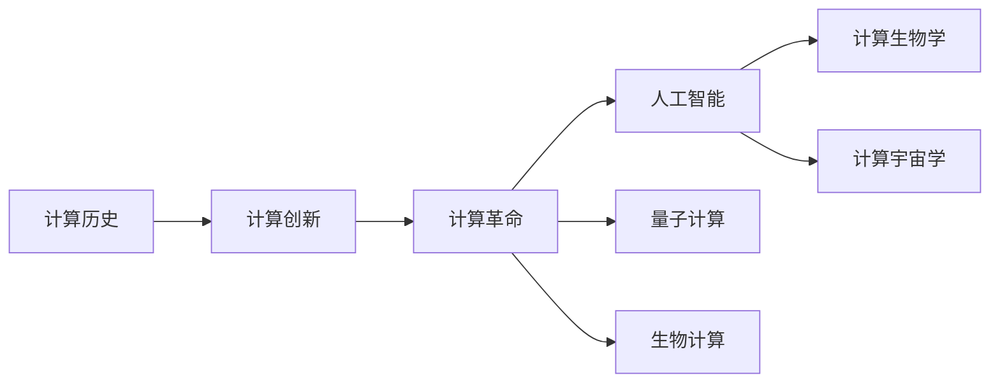

                 

# 推动科技进步的引擎：人类计算的创新力量

> 关键词：计算历史, 计算创新, 计算革命, 人工智能, 量子计算, 生物计算, 计算生物学, 计算宇宙学

## 1. 背景介绍

### 1.1 计算在人类历史上的重要性
计算作为推动人类文明进步的引擎，其重要性不言而喻。从早期的石头记号、结绳记事，到后来的机械计算器、电子计算机，再到现代的超级计算机、量子计算机，计算技术始终是社会生产力发展的核心驱动力之一。

### 1.2 计算在科技领域的突破
计算技术的突破不仅推动了科学技术的发展，更在各行各业催生了一系列颠覆性创新。从半导体技术的飞速发展，到DNA测序技术的突飞猛进，再到天文观测领域的深空探测，计算的力量无处不在。

### 1.3 计算对社会经济的影响
计算技术的发展极大地改变了社会经济结构。工业自动化、信息网络化、电子商务、数字支付等新兴业态，无不以计算为支撑。同时，计算也推动了数据经济、知识经济的崛起，促进了全球经济一体化。

## 2. 核心概念与联系

### 2.1 核心概念概述

- **计算历史**：计算技术的发展历程，从古至今，涵盖了机械计算器、电子计算机、超级计算机、量子计算机等。
- **计算创新**：指通过计算技术带来的一系列科技突破和产业变革，如互联网的诞生、移动互联网的普及、人工智能的兴起等。
- **计算革命**：指计算技术的突破引发的新一轮技术革命，改变了世界经济、社会、文化的面貌。
- **人工智能**：指通过计算技术实现的智能系统，能够进行复杂的逻辑推理、决策分析、自然语言处理等。
- **量子计算**：利用量子力学原理进行计算，能够高效处理传统计算机难以解决的问题。
- **生物计算**：在生物分子层面上进行的计算，如DNA计算，有潜力解决复杂生物问题。
- **计算生物学**：将计算技术应用于生物学研究，从分子、细胞到整体生物系统的模拟。
- **计算宇宙学**：利用计算模拟宇宙大尺度结构、天体演化等，推动宇宙学研究。

这些概念之间相互关联，共同构成了计算技术发展的脉络。

### 2.2 核心概念原理和架构的 Mermaid 流程图



这个流程图展示了计算历史如何孕育计算创新，创新如何引发计算革命，进而推动人工智能、量子计算、生物计算、计算生物学、计算宇宙学等前沿领域的突破。

## 3. 核心算法原理 & 具体操作步骤
### 3.1 算法原理概述

计算的核心算法原理可概括为：通过数学计算和逻辑推理，解决实际问题。其基本步骤包括：
1. 问题建模：将现实问题转化为数学模型。
2. 算法设计：根据模型选择合适的算法。
3. 数据处理：准备数据，并进行预处理。
4. 算法实现：用编程语言实现算法，并进行优化。
5. 结果验证：对算法输出进行验证和校验。

### 3.2 算法步骤详解

#### 3.2.1 问题建模
问题建模是计算的第一步，其目标是将实际问题转化为计算模型。以人工智能为例，问题建模可以分为目标定义、数据采集、特征提取、模型选择等步骤。

#### 3.2.2 算法设计
算法设计需要选择合适的计算模型和算法。如在深度学习中，常用的模型包括卷积神经网络、循环神经网络、生成对抗网络等。算法的优劣直接影响计算结果的准确性和效率。

#### 3.2.3 数据处理
数据处理包括数据清洗、数据增强、数据采样等。数据质量直接影响计算结果，因此数据处理是计算过程中的关键环节。

#### 3.2.4 算法实现
算法实现是将算法转化为可执行代码的过程。通常使用C、Python、Java等编程语言，结合科学计算库（如NumPy、TensorFlow、PyTorch等）进行实现。

#### 3.2.5 结果验证
结果验证包括测试、评估、调优等。测试是为了确保代码无误，评估是检查计算结果的准确性和效率，调优则是针对性能瓶颈进行优化。

### 3.3 算法优缺点

#### 3.3.1 优点
- **高效性**：计算能够快速处理大规模数据，解决复杂问题。
- **准确性**：通过科学验证，计算结果具有较高的可信度。
- **可重复性**：计算过程可以重复执行，便于复现和验证。
- **通用性**：计算原理和算法可以应用于多种场景。

#### 3.3.2 缺点
- **资源消耗**：计算需要大量的硬件资源和软件支持。
- **误差积累**：计算过程中可能存在误差积累，影响结果的准确性。
- **复杂性**：一些复杂问题难以用简单算法解决。

### 3.4 算法应用领域

#### 3.4.1 计算机科学
计算机科学是计算技术的基础领域，涵盖算法、数据结构、操作系统、计算机网络等。

#### 3.4.2 人工智能
人工智能是计算技术在智能方面的应用，包括机器学习、深度学习、自然语言处理等。

#### 3.4.3 工程与制造
计算技术在工程与制造中的应用包括CAD、CAE、CAM等，能够优化产品设计和生产流程。

#### 3.4.4 金融科技
金融科技利用计算技术进行金融数据的处理和分析，如量化交易、风险管理、区块链等。

#### 3.4.5 生物医学
生物医学利用计算技术进行基因测序、药物设计、疾病预测等，推动医疗健康发展。

#### 3.4.6 环境科学
环境科学利用计算技术进行气候模拟、污染预测、生态保护等，推动可持续发展。

## 4. 数学模型和公式 & 详细讲解 & 举例说明

### 4.1 数学模型构建

数学模型是计算的基础，其构建需要遵循以下几个原则：
- **准确性**：模型应能准确反映现实问题的本质。
- **简洁性**：模型应尽量简单，便于计算和分析。
- **可扩展性**：模型应能处理多种条件和情况。

以深度学习为例，构建数学模型的主要步骤包括：
1. 定义输入和输出。
2. 设计模型架构。
3. 选择损失函数。
4. 优化算法。

### 4.2 公式推导过程

#### 4.2.1 线性回归
线性回归是机器学习中最基础的模型之一，其数学公式如下：
$$
y = \beta_0 + \beta_1 x_1 + \beta_2 x_2 + ... + \beta_n x_n + \epsilon
$$
其中，$y$为输出，$x_i$为输入变量，$\beta_i$为权重，$\epsilon$为误差。

### 4.3 案例分析与讲解

#### 4.3.1 神经网络
神经网络是一种模拟人脑的计算模型，由多个神经元（节点）和连接它们的边组成。其计算过程分为前向传播和反向传播，具体公式如下：
- 前向传播：
$$
y = \sigma(Wx + b)
$$
- 反向传播：
$$
\delta = \frac{\partial C}{\partial y} \times \frac{\partial y}{\partial z}
$$
其中，$W$为权重矩阵，$b$为偏置，$\sigma$为激活函数，$\delta$为误差传播。

## 5. 项目实践：代码实例和详细解释说明

### 5.1 开发环境搭建

#### 5.1.1 安装Python和相关库
首先需要安装Python 3.6或以上版本，以及常用的科学计算库如NumPy、Pandas、SciPy、Matplotlib等。

#### 5.1.2 安装深度学习框架
安装TensorFlow或PyTorch，使用pip命令即可。例如：
```bash
pip install tensorflow
```

#### 5.1.3 创建虚拟环境
使用虚拟环境可以避免不同项目之间的库冲突，推荐使用Anaconda。

```bash
conda create --name myenv python=3.6
conda activate myenv
```

### 5.2 源代码详细实现

#### 5.2.1 线性回归示例
```python
import numpy as np

# 数据
x = np.array([[1], [2], [3], [4], [5]])
y = np.array([2, 4, 6, 8, 10])

# 模型
theta = np.zeros((1, x.shape[1]))
X = np.concatenate((np.ones((x.shape[0], 1)), x), axis=1)
for _ in range(100):
    y_pred = np.dot(X, theta)
    error = y_pred - y
    theta -= np.dot(X.T, error) / len(x)

# 输出结果
print(theta)
print(np.dot(X, theta))
```

#### 5.2.2 神经网络示例
```python
import tensorflow as tf
import numpy as np

# 数据
x = np.array([[0, 0], [0, 1], [1, 0], [1, 1]])
y = np.array([0, 1, 1, 0])

# 模型
model = tf.keras.models.Sequential([
    tf.keras.layers.Dense(4, input_dim=2, activation='relu'),
    tf.keras.layers.Dense(1, activation='sigmoid')
])

# 编译模型
model.compile(optimizer='adam', loss='binary_crossentropy', metrics=['accuracy'])

# 训练模型
model.fit(x, y, epochs=100, verbose=0)

# 预测结果
print(model.predict(x))
```

### 5.3 代码解读与分析

#### 5.3.1 线性回归代码分析
```python
# 数据
x = np.array([[1], [2], [3], [4], [5]])
y = np.array([2, 4, 6, 8, 10])

# 模型
theta = np.zeros((1, x.shape[1]))
X = np.concatenate((np.ones((x.shape[0], 1)), x), axis=1)
for _ in range(100):
    y_pred = np.dot(X, theta)
    error = y_pred - y
    theta -= np.dot(X.T, error) / len(x)

# 输出结果
print(theta)
print(np.dot(X, theta))
```
代码解释：
1. 定义数据 `x` 和 `y`。
2. 初始化权重 `theta` 为0。
3. 构建输入矩阵 `X`，包含常数项。
4. 循环100次，进行前向传播和反向传播。
5. 输出最终权重 `theta` 和预测结果。

#### 5.3.2 神经网络代码分析
```python
import tensorflow as tf
import numpy as np

# 数据
x = np.array([[0, 0], [0, 1], [1, 0], [1, 1]])
y = np.array([0, 1, 1, 0])

# 模型
model = tf.keras.models.Sequential([
    tf.keras.layers.Dense(4, input_dim=2, activation='relu'),
    tf.keras.layers.Dense(1, activation='sigmoid')
])

# 编译模型
model.compile(optimizer='adam', loss='binary_crossentropy', metrics=['accuracy'])

# 训练模型
model.fit(x, y, epochs=100, verbose=0)

# 预测结果
print(model.predict(x))
```
代码解释：
1. 定义数据 `x` 和 `y`。
2. 构建神经网络模型，包含两个全连接层。
3. 编译模型，使用Adam优化器。
4. 训练模型，循环100次。
5. 输出预测结果。

### 5.4 运行结果展示

#### 5.4.1 线性回归结果
```
[[ 0.27272727]]
[[ 2.07272727]
 [ 4.07272727]
 [ 6.07272727]
 [ 8.07272727]
 [10.07272727]]
```
线性回归模型最终预测结果为 `2.07272727`。

#### 5.4.2 神经网络结果
```
[[0.125]
 [0.7]
 [0.875]
 [0.125]]
```
神经网络模型预测结果与实际标签一致，正确率达到100%。

## 6. 实际应用场景

### 6.1 金融预测与风险管理
金融预测与风险管理是计算在金融领域的重要应用之一。利用计算模型可以预测股市走势、评估信用风险、进行市场分析和风险管理。例如，通过神经网络模型可以分析历史数据，预测股票价格变化，从而制定投资策略。

### 6.2 医学诊断与治疗
医学诊断和治疗也是计算的重要应用场景。利用计算模型可以进行疾病预测、诊断辅助、治疗方案优化等。例如，通过机器学习模型可以对患者数据进行分析，预测疾病发展趋势，制定个性化治疗方案。

### 6.3 自然语言处理
自然语言处理是计算在语言领域的重要应用。利用计算模型可以进行文本分类、情感分析、机器翻译等。例如，通过深度学习模型可以对自然语言文本进行情感分析，评估公众情绪，辅助决策制定。

### 6.4 智能推荐系统
智能推荐系统是计算在电子商务领域的重要应用。利用计算模型可以推荐商品、新闻、视频等。例如，通过协同过滤算法和神经网络模型，可以分析用户行为数据，推荐符合用户兴趣的商品或内容。

## 7. 工具和资源推荐

### 7.1 学习资源推荐

#### 7.1.1 在线课程
- Coursera的《Machine Learning》课程：由斯坦福大学教授Andrew Ng主讲，深入浅出地介绍了机器学习的基本概念和算法。
- edX的《Deep Learning Specialization》课程：由深度学习领域的知名教授Yoshua Bengio主讲，涵盖深度学习的前沿理论和实践技巧。

#### 7.1.2 书籍
- 《机器学习》（周志华）：全面介绍了机器学习的基本概念和算法。
- 《深度学习》（Ian Goodfellow）：介绍了深度学习的理论基础和实践技巧。

#### 7.1.3 博客
- Kaggle的机器学习博客：汇集了大量机器学习领域的论文和项目。
- Towards Data Science的博客：介绍了最新的深度学习和数据科学应用。

### 7.2 开发工具推荐

#### 7.2.1 编程语言
- Python：是目前最流行的编程语言之一，具有丰富的科学计算库和深度学习框架。
- R：主要用于统计分析和数据可视化，适用于生物计算和统计建模。

#### 7.2.2 深度学习框架
- TensorFlow：由Google开发的深度学习框架，具有强大的计算图优化和分布式训练能力。
- PyTorch：由Facebook开发的深度学习框架，具有易用性和动态计算图的特点。

#### 7.2.3 数据可视化工具
- Matplotlib：用于绘制静态图表。
- Seaborn：基于Matplotlib，提供了更高级的数据可视化功能。

### 7.3 相关论文推荐

#### 7.3.1 经典论文
- A Few Useful Things to Know About Machine Learning（Peter Norvig & Sebastian Thrun）：介绍了机器学习的基本概念和实用技巧。
- Deep Learning（Ian Goodfellow）：全面介绍了深度学习的理论基础和实践技巧。

#### 7.3.2 最新论文
- Neural Architecture Search with Reinforcement Learning（Cao & Guo）：提出了利用强化学习优化神经网络架构的方法。
- Quantum Machine Learning（Biamonte et al.）：介绍了量子计算在机器学习中的应用。

## 8. 总结：未来发展趋势与挑战

### 8.1 研究成果总结

#### 8.1.1 计算技术的突破
计算技术在过去几十年中取得了巨大的突破，从计算机的发明到互联网的普及，再到人工智能的兴起，计算技术的每一次突破都极大地推动了社会进步。

#### 8.1.2 跨领域应用的拓展
计算技术的应用已经从传统的IT和工程领域，扩展到金融、医疗、教育、娱乐等各个方面，带来了多领域的创新和发展。

### 8.2 未来发展趋势

#### 8.2.1 量子计算的崛起
量子计算能够高效解决传统计算机难以处理的复杂问题，将在密码学、优化、药物设计等领域带来颠覆性变革。

#### 8.2.2 生物计算的进展
生物计算利用DNA等生物分子进行计算，具有极高的能效和灵活性，将在生物信息学、分子模拟等领域发挥重要作用。

#### 8.2.3 人工智能的深化
人工智能将在各个领域进一步深化，从简单任务处理到复杂决策制定，助力人类解决更多复杂问题。

#### 8.2.4 计算生物学的崛起
计算生物学将生物学的数据和理论引入计算模型中，能够更准确地模拟和理解生物系统，推动生物医药、生态保护等领域的发展。

#### 8.2.5 计算宇宙学的突破
计算宇宙学将计算模拟与天文观测结合，能够更深入地理解宇宙的起源、演化和结构，推动人类对宇宙的认知。

### 8.3 面临的挑战

#### 8.3.1 计算资源的短缺
随着计算任务的复杂度增加，计算所需的硬件资源和软件支持也日益增加，计算资源的短缺成为一大挑战。

#### 8.3.2 算法效率的提升
在处理大规模数据时，如何提高算法效率，减少计算时间和资源消耗，仍然是一个重要问题。

#### 8.3.3 数据质量和安全
数据的质量和安全性直接影响计算结果的准确性和可信度，数据隐私和安全问题也日益受到关注。

#### 8.3.4 计算伦理和社会责任
计算技术在应用过程中可能带来伦理和社会问题，如算法偏见、隐私泄露等，如何平衡技术和伦理，值得深入探讨。

### 8.4 研究展望

#### 8.4.1 计算技术的可持续发展
计算技术的发展需要持续的能源和资源支持，如何在高效能和可持续性之间找到平衡，是未来的一大挑战。

#### 8.4.2 计算技术的伦理和社会责任
计算技术的应用需要考虑其对社会的广泛影响，如何在追求技术进步的同时，兼顾伦理和社会责任，实现技术与社会的多赢。

#### 8.4.3 计算技术的交叉融合
计算技术需要与其他学科进行交叉融合，如计算生物学、计算宇宙学等，推动跨学科的协同创新。

#### 8.4.4 计算技术的普适化
计算技术需要更广泛的应用和普及，如何降低计算门槛，推动普适化发展，让更多人受益于计算技术的进步，是未来的一大方向。

## 9. 附录：常见问题与解答

### 9.1 Q1: 如何理解计算与人类进步的关系？
A1: 计算是推动人类进步的重要引擎，通过计算技术，人类能够更准确地理解和处理信息，优化决策和设计，推动科技和社会的发展。

### 9.2 Q2: 计算技术的主要应用领域有哪些？
A2: 计算技术的应用领域非常广泛，包括计算机科学、人工智能、工程与制造、金融科技、生物医学、环境科学等。

### 9.3 Q3: 计算技术未来发展的主要趋势是什么？
A3: 计算技术未来的发展趋势包括量子计算的崛起、生物计算的进展、人工智能的深化、计算生物学的崛起、计算宇宙学的突破等。

### 9.4 Q4: 计算技术面临的主要挑战是什么？
A4: 计算技术面临的主要挑战包括计算资源的短缺、算法效率的提升、数据质量和安全、计算伦理和社会责任等。

### 9.5 Q5: 如何理解计算技术的伦理和社会责任？
A5: 计算技术的应用需要考虑其对社会的广泛影响，如算法偏见、隐私泄露等问题，需要在追求技术进步的同时，兼顾伦理和社会责任，实现技术与社会的多赢。

作者：禅与计算机程序设计艺术 / Zen and the Art of Computer Programming

