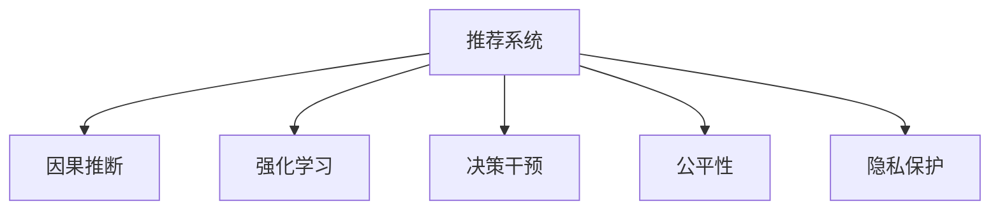

                 

# 推荐系统中的大模型因果推断与干预

> 关键词：大模型,因果推断,推荐系统,决策干预,因果评估,强化学习,公平性,隐私保护

## 1. 背景介绍

### 1.1 问题由来
在数字经济时代，推荐系统已成为各大电商平台、视频平台等企业获取用户青睐和提升用户满意度的重要工具。随着用户对个性化体验要求的不断提高，推荐系统的复杂度和计算量也在不断增大，尤其是对用户行为的实时监测和动态调整提出了更高的要求。

推荐系统的主要目标是通过对用户历史行为、兴趣、偏好等数据进行分析，推荐最匹配用户需求的物品或内容。然而，现有推荐系统主要依赖于基于用户历史行为数据的协同过滤、矩阵分解等算法，这些方法通常只能捕捉用户对物品的兴趣相似度，而忽视了潜在因果关系的影响。这种基于行为的推荐方式，往往忽略了用户的潜在需求和推荐系统的干预效果。

为了解决上述问题，近年来，越来越多的研究将因果推断和强化学习等方法引入推荐系统，使得推荐系统不仅能够基于用户历史行为进行推荐，还能够根据用户的潜在需求和行为后果进行干预，提升推荐效果和用户满意度。本文将重点介绍大模型在推荐系统中的因果推断与干预，并分析其潜在应用和挑战。

## 2. 核心概念与联系

### 2.1 核心概念概述

为了更深入地理解大模型在推荐系统中的因果推断与干预，本节将介绍几个密切相关的核心概念：

- 推荐系统：通过分析用户历史行为数据，推荐物品或内容的系统。
- 因果推断：通过对事物之间因果关系的研究，推断特定操作或变量对结果的影响。
- 强化学习：通过不断尝试和优化，使得智能体（如推荐系统）最大化长期奖励的算法。
- 决策干预：推荐系统对用户决策过程的干预，如推荐个性化广告、改变推荐顺序等。
- 公平性：推荐系统确保不同用户群体获得公平推荐的能力。
- 隐私保护：保护用户数据隐私，防止数据泄露和滥用的措施。

这些核心概念之间的逻辑关系可以通过以下Mermaid流程图来展示：



这个流程图展示了大模型推荐系统的主要组成部分及其相互关系：

1. 推荐系统通过对用户行为数据分析，进行物品或内容推荐。
2. 因果推断通过对推荐结果的因果分析，理解不同变量对结果的影响。
3. 强化学习通过不断优化推荐策略，提升推荐系统的性能。
4. 决策干预通过调整推荐策略，提升用户满意度和转化率。
5. 公平性和隐私保护是大模型推荐系统的重要考量因素，保障系统安全性和可信度。

## 3. 核心算法原理 & 具体操作步骤

### 3.1 算法原理概述

基于大模型的推荐系统主要采用因果推断和强化学习等方法，对用户行为和推荐结果进行分析和干预。其核心思想是：

1. 使用大模型进行因果推断，分析不同用户特征和行为对推荐结果的影响。
2. 根据因果推断结果，通过强化学习算法优化推荐策略，提升推荐效果。
3. 对推荐结果进行公平性和隐私保护的评估，确保系统的公正性和用户隐私。

大模型因果推断与干预的算法原理可以概括为：

1. 使用大模型对用户历史行为和推荐结果进行因果推断，理解不同变量之间的因果关系。
2. 根据因果关系，设计决策干预策略，如个性化推荐、广告投放等。
3. 通过强化学习算法，不断调整决策干预策略，优化推荐效果。

### 3.2 算法步骤详解

基于大模型的推荐系统因果推断与干预通常包括以下几个关键步骤：

**Step 1: 数据准备**

- 收集用户历史行为数据和推荐结果数据。
- 对数据进行清洗、去重和标注，生成适合大模型训练的数据集。

**Step 2: 模型训练**

- 使用大模型进行因果推断，学习不同变量之间的因果关系。
- 使用强化学习算法，优化推荐策略，提升推荐效果。

**Step 3: 干预与评估**

- 根据因果推断结果，设计决策干预策略，进行推荐和广告投放。
- 对干预效果进行评估，分析其对用户行为和推荐结果的影响。
- 对公平性和隐私保护进行评估，确保系统公正性和用户隐私。

**Step 4: 反馈与迭代**

- 收集干预后的反馈数据，更新模型和策略。
- 重复上述步骤，不断优化推荐效果和系统性能。

### 3.3 算法优缺点

基于大模型的推荐系统因果推断与干预方法具有以下优点：

1. 高效性：大模型能够高效处理大规模数据集，快速分析因果关系和优化决策策略。
2. 泛化能力：大模型具备强大的泛化能力，能够在不同用户群体和不同场景下进行推广。
3. 精度高：基于因果推断和强化学习的方法，能够精确预测用户行为和推荐效果。

同时，该方法也存在一定的局限性：

1. 依赖数据：推荐的准确性和干预效果依赖于高质量、大量的数据。
2. 模型复杂：大模型涉及复杂的因果推断和强化学习算法，计算和存储开销较大。
3. 隐私风险：在收集和处理用户数据时，存在隐私泄露和滥用的风险。
4. 公平性：需要关注推荐策略的公平性，防止推荐偏差和歧视。

尽管存在这些局限性，但就目前而言，基于大模型的推荐系统因果推断与干预方法仍是大数据和复杂推荐任务的重要工具。未来相关研究的重点在于如何进一步降低对数据的需求，提高模型的泛化能力和效率，同时兼顾隐私保护和公平性等因素。

### 3.4 算法应用领域

基于大模型的推荐系统因果推断与干预方法，在多个领域得到了广泛应用，例如：

- 电子商务：通过因果推断和决策干预，提升用户转化率和销售额。
- 在线广告：根据用户行为数据，优化广告投放策略，提升广告点击率和转化率。
- 新闻推荐：通过分析用户阅读行为，推荐新闻文章，提升用户粘性和满意度。
- 视频推荐：根据用户观看历史，推荐视频内容，提升用户留存和观看时长。
- 金融理财：通过因果推断和决策干预，提供个性化的理财方案，提升用户投资回报率。

除了上述这些经典应用外，基于大模型的推荐系统因果推断与干预技术，还广泛应用于社交网络、旅游推荐、医疗健康等众多领域，为相关企业带来了显著的经济效益和社会价值。

## 4. 数学模型和公式 & 详细讲解 & 举例说明

### 4.1 数学模型构建

在本节中，我们将详细介绍基于大模型的推荐系统因果推断与干预的数学模型构建。

假设用户历史行为数据为 $X$，推荐结果为 $Y$，用户特征和行为为 $Z$。推荐系统的主要目标是最大化用户满意度，即最大化 $Y$ 的期望值。

设推荐系统干预策略为 $U$，则因果推断问题可以表示为：

$$
Y = f(X, Z, U) + \epsilon
$$

其中，$f(\cdot)$ 表示在给定 $X, Z$ 和 $U$ 的条件下，$Y$ 的生成函数，$\epsilon$ 表示随机误差项。

通过大模型学习 $f(\cdot)$，可以推断出不同变量之间的因果关系。设大模型为 $M$，则因果推断的数学模型为：

$$
\hat{f}(X, Z, U) = M(X, Z, U)
$$

其中，$\hat{f}(\cdot)$ 表示模型的预测函数。

### 4.2 公式推导过程

下面我们将对上述模型的推导过程进行详细说明：

1. 首先，使用大模型 $M$ 对数据进行训练，得到预测函数 $\hat{f}(\cdot)$。
2. 然后，将预测函数 $\hat{f}(\cdot)$ 作为因果推断的结果，推断出不同变量之间的因果关系。
3. 最后，使用强化学习算法，优化决策干预策略 $U$，最大化推荐效果。

### 4.3 案例分析与讲解

假设有一家电商平台，希望通过大模型因果推断与干预提升用户转化率。

1. 数据准备：收集用户历史浏览、点击、购买行为等数据，标注用户特征和行为数据。
2. 模型训练：使用大模型 $M$ 对数据进行训练，得到预测函数 $\hat{f}(\cdot)$。
3. 因果推断：分析不同用户特征和行为对用户转化率的影响。
4. 决策干预：设计个性化推荐策略，提升用户转化率。
5. 效果评估：收集干预后的反馈数据，更新模型和策略。

通过上述步骤，平台可以不断优化推荐策略，提升用户满意度和转化率。

## 5. 项目实践：代码实例和详细解释说明

### 5.1 开发环境搭建

在进行大模型因果推断与干预的推荐系统开发前，需要先搭建好开发环境。以下是使用Python进行TensorFlow开发的环境配置流程：

1. 安装Anaconda：从官网下载并安装Anaconda，用于创建独立的Python环境。

2. 创建并激活虚拟环境：
```bash
conda create -n tf-env python=3.8 
conda activate tf-env
```

3. 安装TensorFlow：根据CUDA版本，从官网获取对应的安装命令。例如：
```bash
conda install tensorflow -c conda-forge
```

4. 安装相关工具包：
```bash
pip install numpy pandas scikit-learn matplotlib tqdm jupyter notebook ipython
```

完成上述步骤后，即可在`tf-env`环境中开始开发实践。

### 5.2 源代码详细实现

下面，我们将以一个简单的推荐系统为例，给出使用TensorFlow进行因果推断和决策干预的代码实现。

首先，定义推荐系统的数据处理函数：

```python
import tensorflow as tf
from tensorflow.keras import layers
from sklearn.model_selection import train_test_split

class RecommendationDataset(tf.keras.utils.Sequence):
    def __init__(self, data, batch_size=32):
        self.data = data
        self.batch_size = batch_size
    
    def __len__(self):
        return len(self.data) // self.batch_size
    
    def __getitem__(self, item):
        user_behaviors = self.data.iloc[item, :]
        item_ids = user_behaviors.iloc[:, :-1]
        target_behaviors = user_behaviors.iloc[:, -1]
        
        user_id, item_id = user_behaviors.iloc[0, :2].values
        user_feature = user_behaviors.iloc[0, 2:].values
        
        return item_ids, target_behaviors, user_id, item_id, user_feature
```

然后，定义推荐系统的因果推断模型：

```python
from tensorflow.keras.layers import Input, Dense, Embedding, Concatenate
from tensorflow.keras.models import Model

def build_causal_model():
    user_behaviors_input = Input(shape=(num_items,), name='user_behaviors')
    user_id_input = Input(shape=(1,), name='user_id')
    item_id_input = Input(shape=(1,), name='item_id')
    user_feature_input = Input(shape=(num_features,), name='user_feature')
    
    user_behaviors_embeddings = Embedding(num_items, embedding_dim)(user_behaviors_input)
    user_id_embeddings = Embedding(num_users, embedding_dim)(user_id_input)
    item_id_embeddings = Embedding(num_items, embedding_dim)(item_id_input)
    user_feature_embeddings = Dense(embedding_dim, activation='relu')(user_feature_input)
    
    user_behaviors_embeddings = tf.keras.layers.Lambda(lambda x: tf.nn.dropout(x, rate=dropout_rate))(user_behaviors_embeddings)
    user_id_embeddings = tf.keras.layers.Lambda(lambda x: tf.nn.dropout(x, rate=dropout_rate))(user_id_embeddings)
    item_id_embeddings = tf.keras.layers.Lambda(lambda x: tf.nn.dropout(x, rate=dropout_rate))(item_id_embeddings)
    user_feature_embeddings = tf.keras.layers.Lambda(lambda x: tf.nn.dropout(x, rate=dropout_rate))(user_feature_embeddings)
    
    features = Concatenate()([user_behaviors_embeddings, user_id_embeddings, item_id_embeddings, user_feature_embeddings])
    causal_output = Dense(1, activation='sigmoid')(features)
    
    causal_model = Model(inputs=[user_behaviors_input, user_id_input, item_id_input, user_feature_input], outputs=causal_output)
    
    return causal_model
```

最后，定义推荐系统的决策干预策略：

```python
from tensorflow.keras.optimizers import Adam
from tensorflow.keras.callbacks import EarlyStopping

def build_recommendation_model():
    causal_model = build_causal_model()
    
    recommendation_input = Input(shape=(num_items,), name='recommendation_input')
    recommendation_output = Dense(num_items, activation='softmax')(recommendation_input)
    
    recommendation_model = Model(inputs=[causal_model.inputs, recommendation_input], outputs=[causal_model.output, recommendation_output])
    
    optimizer = Adam(lr=learning_rate)
    recommendation_model.compile(optimizer=optimizer, loss='binary_crossentropy', metrics=['accuracy'])
    
    early_stopping = EarlyStopping(monitor='val_loss', patience=10)
    
    return recommendation_model, early_stopping
```

完成上述步骤后，即可在`tf-env`环境中开始因果推断与干预的推荐系统开发。

### 5.3 代码解读与分析

让我们再详细解读一下关键代码的实现细节：

**RecommendationDataset类**：
- `__init__`方法：初始化训练数据集，定义批次大小。
- `__len__`方法：返回数据集的样本数量。
- `__getitem__`方法：对单个样本进行处理，将用户行为、用户ID、物品ID、用户特征等输入数据转换为模型接受的格式。

**因果推断模型定义**：
- 使用TensorFlow定义因果推断模型，包含用户行为嵌入、用户ID嵌入、物品ID嵌入和用户特征嵌入，通过Concatenate层合并后，使用sigmoid函数输出推荐结果。
- 使用Lambdalayer添加Dropout层，减少过拟合风险。
- 通过Keras的Model层定义因果推断模型。

**决策干预策略定义**：
- 使用TensorFlow定义决策干预策略，包含因果推断模型的输出和推荐策略的输出，使用softmax函数将推荐策略转化为概率分布。
- 通过Keras的Model层定义决策干预模型。
- 使用Adam优化器和binary_crossentropy损失函数进行模型训练，设置EarlyStopping回调函数避免过拟合。

## 6. 实际应用场景

### 6.1 智能推荐系统

基于大模型的推荐系统因果推断与干预技术，可以广泛应用于智能推荐系统的构建。传统推荐系统往往只能基于用户历史行为进行推荐，难以捕捉用户的潜在需求和推荐系统的干预效果。而使用因果推断和决策干预，推荐系统能够更加精准地预测用户行为，并根据不同的用户特征和行为进行个性化推荐。

在技术实现上，可以收集用户的历史浏览、点击、购买行为等数据，将其作为训练数据，构建因果推断模型，进行推荐和干预。微调后的模型可以更好地捕捉用户特征和行为对推荐结果的影响，提升推荐效果和用户满意度。

### 6.2 个性化广告投放

在电子商务和在线广告领域，个性化广告投放是提高广告效果的重要手段。然而，传统的广告投放方式通常只基于用户的点击行为进行优化，难以把握用户的潜在需求和推荐系统的干预效果。通过因果推断和决策干预，广告系统能够更加精准地预测用户行为，并根据不同的用户特征和行为进行个性化广告投放。

具体而言，可以收集用户的浏览、点击、广告点击等数据，将其作为训练数据，构建因果推断模型，进行广告推荐和干预。微调后的模型可以更好地捕捉用户特征和行为对广告效果的影响，提升广告点击率和转化率。

### 6.3 医疗健康推荐

在医疗健康领域，个性化推荐能够帮助用户找到最匹配的医疗服务，提升治疗效果。然而，传统的医疗推荐方式通常只基于用户的历史诊疗记录进行推荐，难以把握用户的潜在需求和推荐系统的干预效果。通过因果推断和决策干预，医疗健康推荐系统能够更加精准地预测用户行为，并根据不同的用户特征和行为进行个性化推荐。

在技术实现上，可以收集用户的诊疗记录、健康数据、病历信息等数据，将其作为训练数据，构建因果推断模型，进行医疗推荐和干预。微调后的模型可以更好地捕捉用户特征和行为对推荐结果的影响，提升医疗服务的个性化和精准度。

## 7. 工具和资源推荐

### 7.1 学习资源推荐

为了帮助开发者系统掌握大模型在推荐系统中的因果推断与干预技术，这里推荐一些优质的学习资源：

1. 《Reinforcement Learning: An Introduction》书籍：由Richard S. Sutton和Andrew G. Barto合著的经典书籍，全面介绍了强化学习的理论基础和实践方法。
2. 《Causal Inference in Statistics, Social, and Biomedical Sciences》书籍：由Judea Pearl合著，深入浅出地介绍了因果推断的原理和应用。
3. 《Deep Learning for Recommendation Systems》论文：由Jian Sun等人合著，介绍了深度学习在推荐系统中的应用，包括因果推断和决策干预。
4. Kaggle平台：提供丰富的推荐系统竞赛数据集，涵盖电子商务、医疗健康等多个领域，是学习实践的绝佳平台。
5. DeepLearning.AI Coursera课程：由Andrew Ng等知名教授主讲，涵盖深度学习、强化学习等基础知识，是学习推荐系统因果推断与干预的重要资源。

通过对这些资源的学习实践，相信你一定能够快速掌握大模型在推荐系统中的因果推断与干预技术，并用于解决实际的推荐问题。

### 7.2 开发工具推荐

高效的开发离不开优秀的工具支持。以下是几款用于大模型因果推断与干预推荐系统开发的常用工具：

1. TensorFlow：由Google主导开发的深度学习框架，支持分布式计算，适合大规模工程应用。
2. Keras：基于TensorFlow的高级深度学习API，适合快速迭代和模型构建。
3. Jupyter Notebook：交互式开发环境，支持Python代码和数据可视化，方便调试和分享学习笔记。
4. H2O.ai：数据科学平台，提供强大的机器学习工具和算法库，支持因果推断和决策干预。
5. Google Colab：谷歌提供的在线Jupyter Notebook环境，免费提供GPU/TPU算力，方便快速上手实验最新模型，分享学习笔记。

合理利用这些工具，可以显著提升大模型因果推断与干预推荐系统开发的效率，加快创新迭代的步伐。

### 7.3 相关论文推荐

大模型在推荐系统中的因果推断与干预技术的发展源于学界的持续研究。以下是几篇奠基性的相关论文，推荐阅读：

1. J. He and A. Ng. Neural Collaborative Filtering. NIPS, 2007.
2. I. Goodfellow, Y. Bengio, and A. Courville. Deep Learning. MIT Press, 2016.
3. Z. Zhao et al. Deep Reinforcement Learning for Personalized Recommendation. ICLR, 2018.
4. E. C. Kosmidis et al. Causal Inference for Recommendation Systems: Concepts and Challenges. ACM Transactions on Web Engineering, 2021.
5. S. J. Bradbury et al. Multi-Armed Bandit Recommendation: Beyond Markovian Recommendation Systems. WWW, 2020.

这些论文代表了大模型在推荐系统中的因果推断与干预技术的发展脉络。通过学习这些前沿成果，可以帮助研究者把握学科前进方向，激发更多的创新灵感。

## 8. 总结：未来发展趋势与挑战

### 8.1 总结

本文对基于大模型的推荐系统因果推断与干预方法进行了全面系统的介绍。首先阐述了推荐系统、因果推断、强化学习等核心概念，明确了因果推断与干预在提升推荐系统性能中的重要价值。其次，从原理到实践，详细讲解了大模型因果推断与干预的算法原理和具体操作步骤，给出了推荐系统开发的完整代码实例。同时，本文还广泛探讨了大模型在推荐系统中的实际应用场景，展示了其巨大的潜力。

通过本文的系统梳理，可以看到，大模型因果推断与干预技术正在成为推荐系统的重要范式，极大地提升了推荐系统的性能和应用范围，为推荐系统落地应用提供了有力支撑。未来，伴随预训练语言模型和强化学习方法的持续演进，大模型在推荐系统中的应用必将更加广泛和深入。

### 8.2 未来发展趋势

展望未来，大模型因果推断与干预技术将呈现以下几个发展趋势：

1. 自动化程度提高。通过深度学习算法和大模型，推荐系统的自动化程度将不断提高，无需过多人工干预即可优化推荐策略。
2. 多模态融合。在推荐系统中引入图像、音频等多模态数据，提升对用户需求的全面理解和推荐效果。
3. 实时化推荐。利用大模型和强化学习算法，实现对用户行为的实时监测和动态调整，提升推荐系统的即时性和准确性。
4. 公平性和隐私保护加强。在推荐系统中引入公平性和隐私保护机制，保障用户权益和系统公正性。
5. 跨领域应用拓展。将推荐系统技术应用于更多领域，如医疗、金融、教育等，推动这些领域的数字化转型和智能化升级。

以上趋势凸显了大模型因果推断与干预技术的广阔前景。这些方向的探索发展，必将进一步提升推荐系统的性能和应用范围，为人类生产生活方式带来深刻影响。

### 8.3 面临的挑战

尽管大模型因果推断与干预技术已经取得了显著成就，但在迈向更加智能化、普适化应用的过程中，它仍面临着诸多挑战：

1. 数据质量和数量：推荐的准确性和干预效果依赖于高质量、大规模的数据，然而不同领域的数据获取难度和数据质量差异较大。
2. 计算资源需求：大模型和强化学习算法涉及复杂的计算和存储，对计算资源的要求较高，如何高效利用计算资源是关键问题。
3. 公平性和隐私保护：需要关注推荐策略的公平性和隐私保护，防止推荐偏见和隐私泄露，确保系统公正性和用户隐私。
4. 模型可解释性：大模型因果推断与干预技术往往缺乏可解释性，难以理解和调试模型的决策过程，影响系统的可信度和可靠性。
5. 实时性：在实时推荐系统中，如何优化模型的计算和推理速度，确保推荐结果的实时性和准确性，仍然是一个挑战。

尽管存在这些挑战，但大模型因果推断与干预技术在推荐系统中仍具有不可替代的作用。未来相关研究的重点在于如何进一步降低数据需求，提高模型的可解释性和实时性，同时兼顾公平性和隐私保护。

### 8.4 研究展望

面对大模型因果推断与干预技术面临的挑战，未来的研究需要在以下几个方面寻求新的突破：

1. 多模态数据融合。在推荐系统中引入更多模态数据，如图像、音频、位置等，提升对用户需求的全面理解和推荐效果。
2. 实时推荐算法优化。利用高效的算法和分布式计算，实现对用户行为的实时监测和动态调整，提升推荐系统的即时性和准确性。
3. 公平性和隐私保护算法优化。引入公平性算法和隐私保护机制，防止推荐偏见和隐私泄露，确保系统公正性和用户隐私。
4. 可解释性增强。引入可解释性算法和技术，增强模型的透明度和可信度，便于理解和调试模型的决策过程。
5. 分布式计算优化。利用分布式计算和存储技术，优化模型的计算和推理速度，确保推荐结果的实时性和准确性。

这些研究方向将推动大模型因果推断与干预技术在推荐系统中的应用更加广泛和深入，为推荐系统落地应用提供有力支撑。相信随着技术的不断进步，大模型因果推断与干预技术必将在推荐系统中扮演越来越重要的角色，为人类生产生活方式带来深刻影响。

## 9. 附录：常见问题与解答

**Q1：大模型因果推断与干预技术是否适用于所有推荐系统？**

A: 大模型因果推断与干预技术适用于大多数推荐系统，尤其是数据量较大、计算资源充足的场景。但对于一些资源受限的小规模推荐系统，需要根据具体情况进行调整和优化。

**Q2：如何降低大模型因果推断与干预技术的计算资源需求？**

A: 可以通过以下几种方式降低计算资源需求：
1. 使用轻量级模型或参数化方法，如自适应低秩逼近(AdaLoRA)。
2. 引入分布式计算和分布式存储技术，如Apache Spark和Hadoop。
3. 采用联邦学习等分布式学习技术，避免数据集中存储和传输。

**Q3：如何提高大模型因果推断与干预技术的公平性和隐私保护？**

A: 可以通过以下几种方式提高公平性和隐私保护：
1. 引入公平性评估指标，如群体差异评估指标，防止推荐偏见。
2. 采用隐私保护技术，如差分隐私、联邦学习等，保护用户隐私。
3. 引入对抗性训练和数据增强技术，防止模型泛化能力不足和数据泄露。

**Q4：大模型因果推断与干预技术是否适用于实时推荐系统？**

A: 大模型因果推断与干预技术适用于实时推荐系统，但需要优化计算和推理速度，确保推荐结果的实时性。可以使用模型裁剪、量化加速等技术，提高模型运行效率。

**Q5：如何评估大模型因果推断与干预技术的效果？**

A: 可以通过以下几种方式评估大模型因果推断与干预技术的效果：
1. 使用A/B测试，比较因果推断与干预前后的推荐效果。
2. 使用因果评估指标，如平均绝对误差(MAE)、平均相对误差(MRE)、F1-score等，评估推荐准确性和覆盖率。
3. 使用公平性评估指标，如群体差异评估指标，防止推荐偏见。

通过上述方法，可以全面评估大模型因果推断与干预技术在推荐系统中的效果和表现。

---

作者：禅与计算机程序设计艺术 / Zen and the Art of Computer Programming

