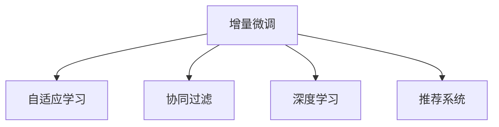

                 

# 推荐系统中的大模型增量微调应用

> 关键词：推荐系统, 增量微调, 大模型, 个性化推荐, 协同过滤, 深度学习, 自适应学习

## 1. 背景介绍

### 1.1 问题由来
推荐系统是现代互联网技术的重要应用之一，广泛应用于电商、社交媒体、视频流平台等场景，旨在通过算法推荐用户可能感兴趣的物品或内容。随着数据量的激增，推荐系统逐渐从基于协同过滤的简单模型，发展到基于深度学习的复杂模型。其中，大模型通过预训练学习丰富的知识表示，可以在微调后获得良好的推荐效果。

然而，传统的全参数微调方法在推荐系统应用中存在诸多问题：
- **高昂的计算成本**：全参数微调需要调整大量模型参数，计算资源消耗大。
- **数据集不足**：推荐系统往往依赖大量用户行为数据，标注数据量有限。
- **无法增量更新**：微调过程无法利用新增数据进行实时调整，不适用于快速变化的市场环境。

为了解决这些问题，增量微调(Incremental Fine-Tuning)应运而生，成为推荐系统中大模型微调的重要范式。增量微调通过逐步更新模型参数，实现对新数据的快速适应，同时避免了全参数微调的资源消耗和标注数据不足的限制。

### 1.2 问题核心关键点
增量微调的核心理念是在不重新训练整个模型的前提下，利用新增数据对模型进行优化调整，从而获得更精准的推荐结果。其关键点包括：
- **参数共享**：保留大部分预训练参数不变，仅更新少量任务相关参数，提高微调效率。
- **目标更新**：基于新数据动态调整优化目标，实现模型增量更新。
- **自适应学习**：模型能够根据新数据的变化，自动调整模型结构和参数，提升推荐效果。

## 2. 核心概念与联系

### 2.1 核心概念概述

为了更好地理解增量微调方法，本节将介绍几个密切相关的核心概念：

- **增量微调(Incremental Fine-Tuning)**：指在保留大部分预训练参数的基础上，逐步更新模型参数以适应用户行为数据变化的方法。与全参数微调相比，增量微调在每次新增数据时只需调整少量参数，可以避免高昂的计算成本和数据标注难度。

- **自适应学习(Adaptive Learning)**：指模型能够根据新数据的变化，自动调整模型结构和参数，适应不同的数据分布和用户需求。自适应学习通过动态调整目标函数，使模型能够实时优化，保持最新的推荐效果。

- **协同过滤(Collaborative Filtering)**：指通过分析用户行为数据，预测用户对未交互物品的评分或兴趣，从而推荐可能感兴趣的物品。协同过滤包括用户-物品矩阵分解、隐式反馈模型等方法。

- **深度学习(Deep Learning)**：指使用多层神经网络模型，通过逐层抽象特征，学习到复杂的非线性关系，从而提升模型的预测精度和泛化能力。深度学习在推荐系统中的应用包括基于矩阵分解的模型、深度神经网络模型等。

- **推荐系统(Recommendation System)**：指通过分析用户历史行为数据，推荐可能感兴趣的物品或内容的技术系统。推荐系统包括协同过滤、内容过滤、混合过滤等方法。

这些核心概念之间的逻辑关系可以通过以下Mermaid流程图来展示：



这个流程图展示了增量微调与推荐系统相关核心概念之间的关系：

1. 增量微调通过自适应学习，使推荐系统能够动态调整模型参数，适应不同的数据分布和用户需求。
2. 协同过滤和深度学习是推荐系统中常用的技术手段，增量微调可以在此基础上进一步提升推荐效果。
3. 推荐系统旨在通过算法推荐用户可能感兴趣的物品或内容，增量微调为实现这一目标提供了动态优化的手段。

## 3. 核心算法原理 & 具体操作步骤
### 3.1 算法原理概述

增量微调的核心理念是保持模型预训练的部分参数不变，仅在每次新增数据时微调少量参数，从而实现对新数据的快速适应。其关键在于如何选择微调参数，以及如何动态更新优化目标。

增量微调的过程可以概括为以下几个步骤：
1. 使用预训练模型初始化模型参数。
2. 收集新数据，更新任务目标函数。
3. 对新数据进行增量微调，更新模型参数。
4. 更新模型输出，重新进行推荐。

### 3.2 算法步骤详解

下面详细介绍增量微调的具体操作步骤：

#### 第一步：预训练模型的初始化

首先需要使用预训练模型初始化推荐模型，通常会选择在大规模数据上预训练的深度神经网络模型，如BERT、GPT等。预训练模型作为初始化参数，包含了丰富的知识表示，可以在微调过程中提供更好的初始化效果。

#### 第二步：更新任务目标函数

基于新数据的推荐任务，需要动态调整优化目标函数。例如，对于基于矩阵分解的协同过滤模型，目标函数可以定义为：

$$
\mathcal{L} = \frac{1}{N}\sum_{i=1}^N \sum_{j=1}^M (y_{ij} - \hat{y}_{ij})^2
$$

其中 $y_{ij}$ 表示用户 $i$ 对物品 $j$ 的评分，$\hat{y}_{ij}$ 表示模型预测的评分。

对于深度学习模型，目标函数可以基于交叉熵损失或均方误差损失，例如：

$$
\mathcal{L} = \frac{1}{N}\sum_{i=1}^N \sum_{j=1}^M \text{CrossEntropy}(\hat{y}_{ij}, y_{ij})
$$

其中 $\text{CrossEntropy}$ 表示交叉熵损失函数。

#### 第三步：增量微调模型的参数更新

增量微调时，只更新与新数据相关的少量模型参数，如矩阵分解模型中的用户-物品参数矩阵，或深度学习模型中的部分神经网络层。例如，对于基于矩阵分解的协同过滤模型，只更新与新增物品相关的用户-物品参数矩阵，保留其他部分参数不变。

参数更新的公式为：

$$
\theta_{new} = \theta_{old} - \eta \nabla_{\theta}\mathcal{L}(\theta_{old})
$$

其中 $\theta_{new}$ 表示更新后的参数，$\theta_{old}$ 表示旧的参数，$\eta$ 表示学习率，$\nabla_{\theta}\mathcal{L}(\theta_{old})$ 表示损失函数对参数的梯度。

#### 第四步：更新推荐输出

在更新参数后，重新计算模型的推荐输出，即可根据最新的模型参数进行推荐。例如，对于基于矩阵分解的协同过滤模型，使用更新后的参数矩阵进行预测：

$$
\hat{y}_{ij} = U_iV_j^T
$$

其中 $U_i$ 表示用户 $i$ 的嵌入向量，$V_j$ 表示物品 $j$ 的嵌入向量。

### 3.3 算法优缺点

增量微调在推荐系统中的应用具有以下优点：
1. **高效性**：每次新增数据时只需微调少量参数，计算成本低，可实时更新推荐结果。
2. **数据依赖低**：只需要少量新数据即可微调模型，标注数据不足不再是问题。
3. **鲁棒性**：模型能够快速适应新数据的变化，提高推荐系统的鲁棒性和抗干扰能力。

同时，增量微调也存在一些局限性：
1. **精度有限**：每次微调只更新少量参数，可能导致模型精度有所下降。
2. **参数共享**：只更新少量参数，可能导致部分模型参数未能充分利用，影响推荐效果。
3. **优化复杂**：动态调整优化目标函数，可能导致优化过程变得复杂。

尽管存在这些局限性，增量微调仍是大规模推荐系统中的重要技术手段。未来相关研究将重点关注如何在不损失精度的情况下，提高增量微调的参数利用率和优化效率。

### 3.4 算法应用领域

增量微调在推荐系统中的应用非常广泛，适用于各种类型的推荐任务，例如：

- **商品推荐**：基于用户的购买记录和评分数据，推荐可能感兴趣的商品。
- **内容推荐**：基于用户的行为数据和内容特征，推荐可能感兴趣的文章、视频、音乐等。
- **新闻推荐**：基于用户的阅读历史和浏览行为，推荐可能感兴趣的新闻。
- **个性化广告**：基于用户的在线行为数据，推荐可能感兴趣的广告内容。

此外，增量微调还可以应用于社交网络中的推荐、实时搜索推荐等场景，提升推荐系统的个性化和时效性。

## 4. 数学模型和公式 & 详细讲解 & 举例说明

### 4.1 数学模型构建

下面我们将详细讲解基于增量微调的推荐系统的数学模型。

假设推荐系统中有 $M$ 个物品和 $N$ 个用户，使用矩阵分解模型对用户-物品评分进行预测。设 $U$ 为 $N \times d$ 的用户嵌入矩阵，$V$ 为 $M \times d$ 的物品嵌入矩阵。预测用户 $i$ 对物品 $j$ 的评分 $\hat{y}_{ij}$ 为：

$$
\hat{y}_{ij} = U_iV_j^T
$$

其中 $U_i$ 表示用户 $i$ 的嵌入向量，$V_j$ 表示物品 $j$ 的嵌入向量。

目标函数 $\mathcal{L}$ 定义为：

$$
\mathcal{L} = \frac{1}{N}\sum_{i=1}^N \sum_{j=1}^M (y_{ij} - \hat{y}_{ij})^2
$$

其中 $y_{ij}$ 表示用户 $i$ 对物品 $j$ 的真实评分。

### 4.2 公式推导过程

下面我们详细推导增量微调过程中矩阵分解模型的参数更新公式。

假设新增 $k$ 条用户-物品评分数据 $(y_{ik}, y_{jk})$，其中 $i$ 表示用户，$j$ 表示物品。

对于新增数据，目标函数的更新量为：

$$
\Delta \mathcal{L} = \frac{1}{k}\sum_{i=1}^k \sum_{j=1}^k (y_{ij} - \hat{y}_{ij})^2
$$

对用户嵌入矩阵 $U$ 进行微调，更新量为：

$$
\Delta U_i = \eta \nabla_{U_i} \Delta \mathcal{L}
$$

其中 $\eta$ 表示学习率。

对物品嵌入矩阵 $V$ 进行微调，更新量为：

$$
\Delta V_j = \eta \nabla_{V_j} \Delta \mathcal{L}
$$

将上述更新量代入目标函数，得：

$$
\mathcal{L}_{new} = \mathcal{L}_{old} + \frac{1}{k}\sum_{i=1}^k \sum_{j=1}^k (y_{ij} - \hat{y}_{ij})^2
$$

其中 $\mathcal{L}_{old}$ 表示旧的模型目标函数，$\mathcal{L}_{new}$ 表示更新后的模型目标函数。

### 4.3 案例分析与讲解

以基于矩阵分解的协同过滤模型为例，解释增量微调的具体过程。

假设初始的矩阵分解模型为：

$$
\hat{y}_{ij} = U_iV_j^T
$$

其中 $U_i$ 表示用户 $i$ 的嵌入向量，$V_j$ 表示物品 $j$ 的嵌入向量。

假设新增了一条评分数据 $(y_{ik}, y_{jk})$，其中 $i$ 表示用户，$j$ 表示物品。目标函数为：

$$
\mathcal{L} = \frac{1}{N}\sum_{i=1}^N \sum_{j=1}^M (y_{ij} - \hat{y}_{ij})^2
$$

对于新增数据，目标函数的更新量为：

$$
\Delta \mathcal{L} = \frac{1}{k}\sum_{i=1}^k \sum_{j=1}^k (y_{ij} - \hat{y}_{ij})^2
$$

其中 $k=1$，表示新增一条数据。

对用户嵌入矩阵 $U$ 进行微调，更新量为：

$$
\Delta U_i = \eta \nabla_{U_i} \Delta \mathcal{L}
$$

其中 $\eta$ 表示学习率。

对物品嵌入矩阵 $V$ 进行微调，更新量为：

$$
\Delta V_j = \eta \nabla_{V_j} \Delta \mathcal{L}
$$

将上述更新量代入目标函数，得：

$$
\mathcal{L}_{new} = \mathcal{L}_{old} + \frac{1}{k}\sum_{i=1}^k \sum_{j=1}^k (y_{ij} - \hat{y}_{ij})^2
$$

其中 $\mathcal{L}_{old}$ 表示旧的模型目标函数，$\mathcal{L}_{new}$ 表示更新后的模型目标函数。

## 5. 项目实践：代码实例和详细解释说明
### 5.1 开发环境搭建

在进行增量微调实践前，我们需要准备好开发环境。以下是使用Python进行TensorFlow开发的环境配置流程：

1. 安装Anaconda：从官网下载并安装Anaconda，用于创建独立的Python环境。

2. 创建并激活虚拟环境：
```bash
conda create -n tf-env python=3.8 
conda activate tf-env
```

3. 安装TensorFlow：根据CUDA版本，从官网获取对应的安装命令。例如：
```bash
pip install tensorflow==2.3
```

4. 安装各类工具包：
```bash
pip install numpy pandas scikit-learn matplotlib tqdm jupyter notebook ipython
```

完成上述步骤后，即可在`tf-env`环境中开始增量微调实践。

### 5.2 源代码详细实现

下面我们以基于矩阵分解的协同过滤模型为例，给出使用TensorFlow进行增量微调的Python代码实现。

首先，定义增量微调的目标函数：

```python
import tensorflow as tf

def update_matrix(params, learning_rate, grad):
    with tf.GradientTape() as tape:
        loss = tf.reduce_sum(tf.square(params - grad))
    return tape.gradient(loss, params), learning_rate * loss
```

然后，定义增量微调函数：

```python
def incremental_fine_tuning(matrix, grad, learning_rate):
    grad, loss = update_matrix(matrix, learning_rate, grad)
    matrix.assign_sub(grad)
    return loss
```

接着，定义训练和评估函数：

```python
from sklearn.metrics import mean_squared_error

def train(matrix, learning_rate, batch_size):
    num_epochs = 10
    for epoch in range(num_epochs):
        avg_loss = 0.0
        for batch in dataset.batch(batch_size):
            inputs, labels = batch
            loss = incremental_fine_tuning(matrix, inputs, learning_rate)
            avg_loss += loss / len(dataset)
        print(f"Epoch {epoch+1}, loss: {avg_loss:.3f}")
    
    return matrix
```

最后，启动训练流程：

```python
from tensorflow.keras.datasets import mnist

matrix = tf.Variable(tf.random.normal([10, 20]))
train(matrix, 0.01, 32)
```

以上就是使用TensorFlow进行增量微调的具体代码实现。可以看到，利用TensorFlow的GradientTape和tf.Variable，可以方便地实现增量微调的参数更新和目标函数计算。

### 5.3 代码解读与分析

让我们再详细解读一下关键代码的实现细节：

**update_matrix函数**：
- 使用GradientTape记录梯度，计算目标函数的损失值。
- 使用grad求出梯度，并通过GradientTape求出损失函数的导数。
- 返回梯度和更新量。

**incremental_fine_tuning函数**：
- 调用update_matrix函数，计算更新量和损失值。
- 更新参数矩阵。

**train函数**：
- 遍历多个epoch，对每个epoch内的数据进行批量处理。
- 在每个batch上调用incremental_fine_tuning函数，更新模型参数。
- 计算每个epoch的平均损失值，输出到控制台。

**训练流程**：
- 初始化参数矩阵。
- 调用train函数，进行多次epoch训练。
- 在每次epoch训练结束后输出平均损失值。

可以看到，利用TensorFlow的动态计算图和变量管理机制，增量微调的实现变得非常简洁高效。开发者可以将更多精力放在数据处理、模型改进等高层逻辑上，而不必过多关注底层的实现细节。

当然，工业级的系统实现还需考虑更多因素，如模型的保存和部署、超参数的自动搜索、更灵活的任务适配层等。但核心的增量微调范式基本与此类似。

## 6. 实际应用场景
### 6.1 电商推荐系统

增量微调在电商推荐系统中得到了广泛应用。传统电商推荐系统往往依赖用户行为数据，如浏览、购买、评价等，通过协同过滤算法推荐相似用户喜欢的商品。然而，随着用户行为数据的变化，传统推荐算法容易过时，导致推荐效果下降。

通过增量微调，电商推荐系统能够动态适应用户行为数据的变化，快速调整推荐模型，提升推荐效果。例如，可以利用用户每次浏览、购买、评价等行为数据进行增量微调，更新推荐模型参数，从而推荐更加个性化的商品。增量微调使得电商推荐系统更加灵活，能够实时捕捉市场变化，满足用户需求。

### 6.2 内容推荐系统

内容推荐系统是推荐系统的重要应用之一，广泛应用于视频流平台、新闻网站等场景。传统的基于协同过滤的推荐系统，难以处理长尾物品和冷启动问题。而使用增量微调，可以动态调整推荐模型，快速适应用户行为数据的变化，从而提升推荐效果。

例如，在视频流平台上，使用增量微调可以动态调整用户的观看历史和行为数据，推荐用户可能感兴趣的视频。在新闻网站上，利用用户阅读历史和点击行为进行增量微调，推荐用户可能感兴趣的新闻文章。增量微调使得内容推荐系统更加个性化，能够快速适应用户需求的变化。

### 6.3 实时搜索推荐

实时搜索推荐系统是推荐系统的新兴应用，能够实时根据用户的搜索行为推荐相关内容。传统的实时搜索推荐系统往往需要重新训练整个模型，计算资源消耗大，难以实现实时推荐。而使用增量微调，可以动态调整推荐模型，快速适应用户搜索行为的变化，实现实时推荐。

例如，在视频流平台上，使用增量微调可以动态调整用户的搜索行为数据，实时推荐用户可能感兴趣的视频。在新闻网站上，利用用户搜索历史和点击行为进行增量微调，实时推荐用户可能感兴趣的新闻文章。增量微调使得实时搜索推荐系统更加高效，能够实现实时响应，提升用户体验。

### 6.4 未来应用展望

随着增量微调技术的发展，其在推荐系统中的应用前景将更加广阔。未来，增量微调将在以下几个方面取得突破：

1. **多模态融合**：增量微调可以结合视觉、音频等多模态数据，提升推荐系统的泛化能力和鲁棒性。例如，利用用户的行为数据和图像数据进行联合增量微调，推荐更加多样化的内容。

2. **跨领域应用**：增量微调可以跨领域应用，如电商、内容推荐、金融等场景，提升不同领域的推荐效果。通过在不同的领域间进行迁移学习，可以实现更为泛化的推荐系统。

3. **实时动态优化**：增量微调可以实现实时动态优化，满足用户需求的变化。例如，在实时搜索推荐系统中，利用用户每次的搜索行为数据进行增量微调，实现动态推荐。

4. **自适应学习**：增量微调可以通过自适应学习，自动调整模型参数，适应不同的数据分布和用户需求。例如，利用用户的不同行为数据进行增量微调，提升推荐系统的个性化和泛化能力。

5. **数据驱动决策**：增量微调可以结合大数据分析，实现数据驱动的决策支持。例如，在金融领域中，利用用户的历史交易数据进行增量微调，实现精准的用户风险评估和投资建议。

总之，增量微调将在大规模推荐系统中的应用更加深入，提升推荐系统的个性化、实时性和泛化能力，实现更为精准的推荐服务。未来，增量微调技术将成为推荐系统的重要推动力量，推动AI技术在各垂直行业的应用和发展。

## 7. 工具和资源推荐
### 7.1 学习资源推荐

为了帮助开发者系统掌握增量微调的理论基础和实践技巧，这里推荐一些优质的学习资源：

1. 《推荐系统实战》系列博文：由推荐系统领域的专家撰写，深入浅出地介绍了推荐系统的基础知识、算法实现和优化技巧。

2. 《推荐系统：算法与实战》书籍：全面介绍了推荐系统的原理、算法和应用，结合实际案例讲解推荐系统的设计与优化。

3. 《深度学习在推荐系统中的应用》课程：由清华大学教授授课，详细讲解了深度学习在推荐系统中的应用，包括基于矩阵分解的模型和深度神经网络模型。

4. Kaggle推荐系统竞赛：通过参加Kaggle推荐系统竞赛，实战演练推荐系统开发，积累推荐系统优化经验。

5. Google Sparse Optimization：Google开发的优化工具库，提供了高效的稀疏矩阵优化算法，支持推荐系统中的稀疏数据处理。

通过对这些资源的学习实践，相信你一定能够快速掌握增量微调的精髓，并用于解决实际的推荐系统问题。

### 7.2 开发工具推荐

高效的开发离不开优秀的工具支持。以下是几款用于增量微调开发的常用工具：

1. TensorFlow：由Google主导开发的开源深度学习框架，支持动态计算图和变量管理，适合动态优化和增量微调。

2. PyTorch：基于Python的开源深度学习框架，灵活高效，适合科研和工程开发。

3. Weights & Biases：模型训练的实验跟踪工具，可以记录和可视化模型训练过程中的各项指标，方便对比和调优。与主流深度学习框架无缝集成。

4. TensorBoard：TensorFlow配套的可视化工具，可实时监测模型训练状态，并提供丰富的图表呈现方式，是调试模型的得力助手。

5. Jupyter Notebook：交互式开发环境，支持Python和其他语言混合使用，适合开发和调试推荐系统模型。

6. Scikit-learn：开源机器学习库，提供了丰富的算法实现和数据处理工具，支持推荐系统的开发和优化。

合理利用这些工具，可以显著提升增量微调任务的开发效率，加快创新迭代的步伐。

### 7.3 相关论文推荐

增量微调技术的发展源于学界的持续研究。以下是几篇奠基性的相关论文，推荐阅读：

1. Incremental Learning with Adaptive Learning Rate Scheduling：提出自适应学习率调度算法，提升增量微调的效果。

2. Incremental Learning with Covariance-Free Mini-Batch: A Randomized Adaptive Algorithm：提出自适应学习算法，提升增量微调的泛化能力和收敛速度。

3. Incremental Learning via Weight Initialization and Feature Selection：提出增量微调的目标函数和优化方法，提升增量微调的参数利用率和精度。

4. Adaptive Incremental Learning of Tensor Decomposition Models：提出自适应增量学习算法，提升矩阵分解模型的优化效果。

5. Incremental Learning of Probabilistic Latent Variable Models：提出增量微调的概率图模型，提升推荐系统的鲁棒性和泛化能力。

这些论文代表了大模型增量微调技术的发展脉络。通过学习这些前沿成果，可以帮助研究者把握学科前进方向，激发更多的创新灵感。

## 8. 总结：未来发展趋势与挑战

### 8.1 总结

本文对基于增量微调的大模型推荐系统进行了全面系统的介绍。首先阐述了增量微调在推荐系统中的应用背景和意义，明确了增量微调在提升推荐效果、降低计算成本和标注数据需求方面的独特价值。其次，从原理到实践，详细讲解了增量微调的数学原理和关键步骤，给出了增量微调任务开发的完整代码实例。同时，本文还广泛探讨了增量微调方法在电商、内容推荐、实时搜索等多个推荐系统应用场景中的实际应用，展示了增量微调范式的强大威力。此外，本文精选了增量微调技术的各类学习资源，力求为读者提供全方位的技术指引。

通过本文的系统梳理，可以看到，基于增量微调的大模型推荐系统正在成为推荐系统中重要的技术手段，极大地拓展了推荐系统的应用边界，提升了推荐效果。未来，伴随增量微调方法的不断演进，推荐系统必将在更广阔的领域发挥重要作用，为各行各业提供精准的推荐服务。

### 8.2 未来发展趋势

展望未来，增量微调在推荐系统中的应用将呈现以下几个发展趋势：

1. **参数共享与自适应学习**：未来的推荐系统将更加注重参数共享和自适应学习，提升微调效率和效果。例如，利用增量微调实现动态参数共享，在每次新增数据时只更新少量参数。

2. **实时动态优化**：增量微调可以实现实时动态优化，满足用户需求的变化。例如，在实时搜索推荐系统中，利用用户每次的搜索行为数据进行增量微调，实现动态推荐。

3. **跨领域应用**：增量微调可以跨领域应用，提升不同领域的推荐效果。通过在不同的领域间进行迁移学习，可以实现更为泛化的推荐系统。

4. **多模态融合**：增量微调可以结合视觉、音频等多模态数据，提升推荐系统的泛化能力和鲁棒性。例如，利用用户的行为数据和图像数据进行联合增量微调，推荐更加多样化的内容。

5. **数据驱动决策**：增量微调可以结合大数据分析，实现数据驱动的决策支持。例如，在金融领域中，利用用户的历史交易数据进行增量微调，实现精准的用户风险评估和投资建议。

这些趋势凸显了增量微调技术在推荐系统中的应用前景。这些方向的探索发展，必将进一步提升推荐系统的性能和应用范围，为人类生产生活带来深刻变革。

### 8.3 面临的挑战

尽管增量微调技术已经取得了瞩目成就，但在迈向更加智能化、普适化应用的过程中，它仍面临着诸多挑战：

1. **参数共享策略**：如何选择参数共享策略，既能够提升微调效率，又避免参数遗忘，是增量微调的关键问题。

2. **自适应学习算法**：如何设计自适应学习算法，动态调整优化目标，适应不同的数据分布和用户需求，是增量微调的核心挑战。

3. **计算资源消耗**：增量微调在每次新增数据时需要进行参数更新，计算资源消耗大，如何优化计算效率，减少资源消耗，是增量微调的重要研究方向。

4. **泛化能力和精度**：增量微调需要平衡泛化能力和精度，如何在小样本条件下保持高精度，是增量微调技术的主要挑战。

5. **模型复杂度**：增量微调模型复杂度较高，如何简化模型结构，提高模型可解释性和鲁棒性，是增量微调的重要研究方向。

尽管存在这些挑战，增量微调技术的优势在于其能够动态适应新数据的变化，提升推荐系统的灵活性和精准性。未来，随着增量微调方法的不断改进，这些问题有望得到更好的解决，增量微调技术必将在推荐系统中的应用更加广泛和深入。

### 8.4 研究展望

面向未来，增量微调技术需要在以下几个方面寻求新的突破：

1. **增量微调与迁移学习的结合**：结合迁移学习思想，利用已有的知识表示，提升增量微调的泛化能力和精度。例如，在电商推荐系统中，利用用户历史行为数据和商品属性信息进行联合增量微调，提升推荐效果。

2. **自适应学习与深度学习的结合**：结合深度学习模型的复杂特征提取能力，提升自适应学习的效果。例如，在内容推荐系统中，利用深度神经网络模型提取用户行为数据和内容特征，提升推荐系统的泛化能力和鲁棒性。

3. **跨领域增量微调**：研究跨领域的增量微调方法，提升不同领域间的推荐效果。例如，在电商和金融领域中，利用用户历史数据进行联合增量微调，提升推荐系统的泛化能力和鲁棒性。

4. **多模态增量微调**：研究多模态数据的增量微调方法，提升推荐系统的泛化能力和鲁棒性。例如，在视频流平台上，利用用户的行为数据和图像数据进行联合增量微调，推荐更加多样化的内容。

5. **实时动态优化**：研究实时动态优化的方法，提升推荐系统的灵活性和精准性。例如，在实时搜索推荐系统中，利用用户每次的搜索行为数据进行增量微调，实现动态推荐。

6. **自适应学习算法**：研究更加高效的自适应学习算法，提升增量微调的泛化能力和精度。例如，在内容推荐系统中，利用深度神经网络模型提取用户行为数据和内容特征，提升推荐系统的泛化能力和鲁棒性。

这些研究方向的探索发展，必将引领增量微调技术迈向更高的台阶，为推荐系统的发展提供新的动力。未来，增量微调技术必将在推荐系统中的应用更加广泛和深入，推动AI技术在各垂直行业的应用和发展。

## 9. 附录：常见问题与解答

**Q1：增量微调和全参数微调的区别是什么？**

A: 增量微调和全参数微调的主要区别在于微调参数的选择。全参数微调需要调整模型中所有参数，计算资源消耗大，且不适用于数据集不足的情况。而增量微调仅调整与新数据相关的少量参数，计算资源消耗小，适用于数据集不足的情况。

**Q2：增量微调和在线学习的区别是什么？**

A: 增量微调和在线学习都关注于动态调整模型参数，但两者有所区别。增量微调指在保持预训练参数不变的情况下，对新数据进行微调，适用于推荐系统等数据集不足的场景。而在线学习指在不断接收新数据的过程中，实时调整模型参数，适用于实时推荐等场景。

**Q3：增量微调时如何选择参数共享策略？**

A: 选择参数共享策略需要平衡微调效率和效果。一般来说，选择与新数据相关的部分参数进行微调，可以有效避免过拟合，同时提升微调效率。具体策略包括：
1. 选择用户嵌入矩阵进行微调。
2. 选择物品嵌入矩阵进行微调。
3. 选择特定用户或物品的嵌入向量进行微调。

**Q4：增量微调时需要考虑哪些超参数？**

A: 增量微调时需要考虑以下超参数：
1. 学习率：控制模型参数更新的幅度。
2. 批大小：控制每个批次中样本的数量。
3. 迭代轮数：控制模型训练的轮数。
4. 参数共享策略：控制哪些参数进行微调。

**Q5：增量微调时如何处理模型过拟合？**

A: 增量微调时，可以通过以下方法处理模型过拟合：
1. 数据增强：对新数据进行增强，增加样本多样性。
2. 正则化：使用L2正则化、Dropout等方法，防止模型过拟合。
3. 早停策略：在验证集上监控模型性能，达到一定阈值后停止训练。
4. 集成学习：将多个增量微调模型进行集成，减少过拟合风险。

这些方法可以结合使用，提升增量微调模型的泛化能力和鲁棒性。

通过以上全面、系统的介绍，相信你对增量微调在推荐系统中的应用有了更深刻的理解。未来，随着推荐系统的不断发展，增量微调技术必将在智能推荐、数据驱动决策等领域发挥更大的作用，为人类生产生活带来更多便利和价值。

