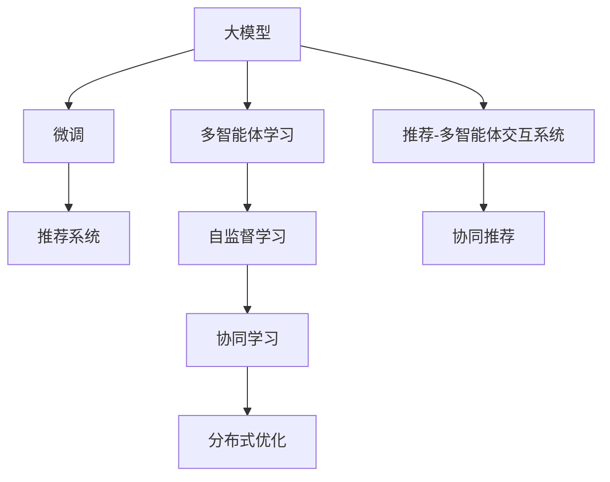

                 

## 1. 背景介绍

随着推荐系统应用场景的不断扩展，用户数据的多样化和个性化需求日益增长，单一的推荐算法难以适应复杂的用户行为和偏好。为此，近年来推荐系统中涌现出了一系列基于多智能体学习(Multi-Agent Learning, MAL)的创新模型，如多智能体推荐系统(MARL, Multi-Agent Recommendation Learning)、推荐-多智能体交互系统(MARS, Multi-Agent Recommendation System)等。这些模型通过引入多个代理(Agent)协同学习，提升推荐性能，实现了更加精准、个性化的推荐服务。

与此同时，大模型在推荐系统中的应用也在不断推进。大模型通过预训练得到强大的通用表示能力，能够适应多种推荐任务，并且在微调时可以利用微数据集进行高效训练，显著减少计算成本和人力投入。将大模型与多智能体学习相结合，可以在推荐系统构建更加灵活、鲁棒和智能化的解决方案，从而为用户带来更好的体验。

## 2. 核心概念与联系

### 2.1 核心概念概述

为了更好地理解大模型在推荐系统中的多智能体学习应用，本节将介绍几个关键的概念和它们之间的联系：

- **大模型(Large Model)**：指基于大规模无标签数据预训练得到的语言模型或图像模型，如BERT、GPT-3、ResNet等。大模型通过预训练获得丰富的通用表示能力，在微调时可以快速适应各种任务。
- **多智能体学习(Multi-Agent Learning)**：指由多个代理(Agent)组成的系统，每个代理独立学习并与其他代理协作，共同优化全局目标，以应对复杂多变的环境和任务。
- **推荐系统(Recommendation System)**：指通过算法推荐产品或内容给用户，以提高用户满意度和平台收益的系统。推荐系统可以基于协同过滤、基于内容、混合推荐等多种算法进行构建。
- **微调(Fine-Tuning)**：指在大模型上进行有监督学习，以适配特定任务。通过微调，大模型能够快速学习新任务，提升性能。
- **自监督学习(Self-Supervised Learning)**：指在无标签数据上进行学习，利用数据本身的特征自生成监督信号，提升模型能力。

这些概念通过以下Mermaid流程图展示它们之间的联系：



## 3. 核心算法原理 & 具体操作步骤

### 3.1 算法原理概述

推荐系统中的大模型多智能体学习主要包含以下几个步骤：

1. **预训练阶段**：使用大规模无标签数据对大模型进行预训练，学习通用的表示能力。
2. **任务适配**：根据具体的推荐任务设计任务适配层，如添加用户-物品交互层的任务学习器，引入领域知识的任务嵌入层等。
3. **多智能体协同**：构建多个代理(Agent)，每个代理独立学习并与其他代理共享信息，优化全局推荐目标。
4. **分布式优化**：利用分布式优化技术，如Ring-AllReduce、Adaptive稀疏梯度计算等，高效地更新所有代理的模型参数。
5. **持续反馈和微调**：收集用户反馈和行为数据，定期微调大模型和各代理，以适应新任务和用户需求。

### 3.2 算法步骤详解

#### 3.2.1 预训练阶段

在大规模无标签数据上进行预训练，学习通用的表示能力。以BERT为例，首先在大规模无标签文本数据上使用掩码语言模型(Masked Language Modeling, MLM)进行预训练，学习语言的概率分布和上下文依赖关系。接着使用下一句预测任务(Next Sentence Prediction, NSP)进行训练，学习句子间的语义关联。

- **预训练过程**：
  - **掩码语言模型**：在每个样本中随机掩盖一部分词，预测缺失词。
  - **下一句预测**：随机选取句子对，预测它们是否为连续句，提升句子顺序感知。

- **预训练目标**：最小化预测误差，如交叉熵损失。

- **预训练模型**：使用预训练的BERT模型作为初始化参数，如bert-base-uncased。

#### 3.2.2 任务适配阶段

在预训练模型的基础上，根据具体的推荐任务设计任务适配层，引入领域知识和个性化需求。

- **用户嵌入层**：学习用户的个性化特征，如年龄、性别、兴趣等。
- **物品嵌入层**：学习物品的特征向量，如属性、标签、类别等。
- **交互层**：学习用户与物品的交互特征，如评分、点击、收藏等。
- **任务学习器**：根据具体的推荐任务设计任务学习器，如协同过滤、基于内容的推荐、混合推荐等。

#### 3.2.3 多智能体协同阶段

构建多个代理(Agent)，每个代理独立学习并与其他代理共享信息，优化全局推荐目标。

- **代理定义**：每个代理对应一种推荐算法，如协同过滤、基于内容的推荐等。
- **信息共享**：代理之间共享用户和物品的交互特征，提升协同效果。
- **协同优化**：代理之间通过共享信息，协同优化全局推荐目标，如准确率、召回率、点击率等。

#### 3.2.4 分布式优化阶段

利用分布式优化技术，高效地更新所有代理的模型参数。

- **Ring-AllReduce**：一种基于环形拓扑的通信算法，用于大规模分布式训练。
- **Adaptive稀疏梯度计算**：采用稀疏梯度计算技术，减少通信带宽和计算开销，提高分布式训练效率。

#### 3.2.5 持续反馈和微调阶段

定期收集用户反馈和行为数据，定期微调大模型和各代理，以适应新任务和用户需求。

- **数据收集**：从推荐系统日志、用户行为数据中收集推荐效果反馈，如点击率、评分、反馈等。
- **模型微调**：使用微数据集对大模型和各代理进行微调，提升推荐精度和泛化能力。
- **优化策略**：根据反馈结果调整推荐算法，优化推荐策略，如调整代理的权重、引入新的推荐特征等。

### 3.3 算法优缺点

大模型在推荐系统中的应用具有以下优点：

- **高效**：大模型能够快速学习新任务，减少计算成本和人力投入。
- **鲁棒**：大模型具备较强的泛化能力，对噪声和异常数据具有一定的鲁棒性。
- **适应性强**：大模型能够适应多种推荐任务和用户需求，灵活性强。

同时，也存在以下缺点：

- **数据需求高**：大模型需要大量的数据进行预训练，数据获取成本较高。
- **复杂度高**：大模型的结构和训练过程较为复杂，对技术要求较高。
- **解释性差**：大模型的决策过程难以解释，难以进行调试和优化。

### 3.4 算法应用领域

基于大模型在推荐系统中的多智能体学习应用，已经在电商推荐、社交网络、新闻推荐等多个领域取得了显著效果，以下是一些具体的应用场景：

- **电商推荐系统**：使用大模型对用户行为数据进行预训练，设计多智能体协同的推荐算法，实现个性化推荐。
- **社交网络推荐系统**：利用大模型学习用户和内容的多模态特征，通过多智能体协同优化推荐效果。
- **新闻推荐系统**：使用大模型学习用户对新闻的兴趣特征，设计多智能体协同的推荐策略，提高新闻推荐质量。
- **音乐推荐系统**：利用大模型学习音乐和用户的表示，通过多智能体协同推荐用户感兴趣的音乐。

这些应用场景展示了基于大模型在推荐系统中的应用潜力和实际效果，为推荐系统的智能化发展提供了新的思路和技术支持。

## 4. 数学模型和公式 & 详细讲解

### 4.1 数学模型构建

本节将使用数学语言对基于大模型在推荐系统中的多智能体学习模型进行更详细的刻画。

记预训练大模型为 $M_{\theta}$，其中 $\theta$ 为预训练得到的模型参数。假设有 $N$ 个代理(Agent)，每个代理对应的推荐算法为 $f_i$，每个代理的任务适配层为 $L_i$。推荐系统的全局目标为 $L_{\text{global}}$。

定义每个代理的损失函数为 $L_i(f_i(x_i))$，其中 $x_i$ 为代理 $i$ 的任务输入，$f_i$ 为代理的推荐函数。则全局目标可以表示为：

$$
L_{\text{global}} = \sum_{i=1}^N \alpha_i L_i(f_i(x_i))
$$

其中 $\alpha_i$ 为每个代理的权重，用于平衡代理之间的关系。

### 4.2 公式推导过程

假设每个代理的任务输入为 $x_i$，代理 $i$ 的推荐函数为 $f_i(x_i)$，任务适配层的输出为 $y_i$，则代理 $i$ 的损失函数可以表示为：

$$
L_i(f_i(x_i)) = \mathcal{L}(y_i, f_i(x_i))
$$

其中 $\mathcal{L}$ 为任务适配层和推荐函数的损失函数，如均方误差损失、交叉熵损失等。

全局目标可以进一步表示为：

$$
L_{\text{global}} = \sum_{i=1}^N \alpha_i \mathcal{L}(y_i, f_i(x_i))
$$

在实际应用中，通常使用分布式优化技术对各代理进行协同优化。假设代理之间通过环形拓扑通信，则代理 $i$ 的更新公式为：

$$
\theta_i \leftarrow \theta_i - \eta \nabla_{\theta_i}\mathcal{L}(y_i, f_i(x_i))
$$

其中 $\eta$ 为学习率，$\nabla_{\theta_i}\mathcal{L}(y_i, f_i(x_i))$ 为代理 $i$ 的梯度，利用Ring-AllReduce等分布式优化算法计算。

### 4.3 案例分析与讲解

以电商推荐系统为例，分析基于大模型的多智能体学习应用。

- **预训练阶段**：使用大规模无标签电商交易数据对大模型进行预训练，学习物品和用户的表示能力。
- **任务适配阶段**：在预训练模型的基础上，引入用户嵌入层、物品嵌入层和交互层，学习用户和物品的个性化特征。
- **多智能体协同阶段**：构建多个代理(Agent)，每个代理对应一种推荐算法，如协同过滤、基于内容的推荐等，代理之间共享用户和物品的交互特征，协同优化全局推荐目标。
- **分布式优化阶段**：利用Ring-AllReduce等分布式优化技术，高效地更新所有代理的模型参数。
- **持续反馈和微调阶段**：定期收集用户反馈和行为数据，定期微调大模型和各代理，以适应新任务和用户需求。

## 5. 项目实践：代码实例和详细解释说明

### 5.1 开发环境搭建

在进行项目实践前，我们需要准备好开发环境。以下是使用Python进行PyTorch和TensorFlow开发的环境配置流程：

1. 安装Anaconda：从官网下载并安装Anaconda，用于创建独立的Python环境。
2. 创建并激活虚拟环境：
```bash
conda create -n recommendation-env python=3.8 
conda activate recommendation-env
```

3. 安装PyTorch和TensorFlow：根据CUDA版本，从官网获取对应的安装命令。例如：
```bash
conda install pytorch torchvision torchaudio cudatoolkit=11.1 -c pytorch -c conda-forge
conda install tensorflow -c conda-forge
```

4. 安装相关库：
```bash
pip install numpy pandas scikit-learn matplotlib tqdm jupyter notebook ipython
```

完成上述步骤后，即可在`recommendation-env`环境中开始项目实践。

### 5.2 源代码详细实现

这里我们以多智能体电商推荐系统为例，给出使用PyTorch和TensorFlow进行大模型多智能体学习的PyTorch代码实现。

首先，定义电商推荐任务的数据处理函数：

```python
import pandas as pd
import numpy as np
import torch
import torch.nn as nn
import torch.nn.functional as F
import torch.optim as optim
import tensorflow as tf

class DataLoader:
    def __init__(self, data_path):
        self.data = pd.read_csv(data_path)
        self.data['item_id'] = self.data['item_id'].astype('category').cat.codes
        self.data['user_id'] = self.data['user_id'].astype('category').cat.codes
        self.data['interaction'] = np.where(self.data['clicked'], 1, 0)
        
        self.train_data = self.data[self.data['time'] < '2021-01-01']
        self.dev_data = self.data[self.data['time'] == '2021-01-01']
        self.test_data = self.data[self.data['time'] == '2021-01-02']
        
        self.train_loader = torch.utils.data.DataLoader(
            self.train_data, batch_size=64, shuffle=True
        )
        self.dev_loader = torch.utils.data.DataLoader(
            self.dev_data, batch_size=64, shuffle=False
        )
        self.test_loader = torch.utils.data.DataLoader(
            self.test_data, batch_size=64, shuffle=False
        )
    
    def __len__(self):
        return len(self.train_data)
    
    def __getitem__(self, item):
        user_id = self.train_data.iloc[item]['user_id'].values
        item_id = self.train_data.iloc[item]['item_id'].values
        interaction = self.train_data.iloc[item]['interaction'].values
        return user_id, item_id, interaction
```

然后，定义大模型的编码器(Embedding Layer)：

```python
class Embedding(nn.Module):
    def __init__(self, vocab_size, emb_dim):
        super(Embedding, self).__init__()
        self.user_embedding = nn.Embedding(vocab_size, emb_dim)
        self.item_embedding = nn.Embedding(vocab_size, emb_dim)
        
    def forward(self, user_id, item_id):
        user_embs = self.user_embedding(user_id)
        item_embs = self.item_embedding(item_id)
        return user_embs, item_embs
```

接着，定义推荐模型的解码器(Decoder Layer)：

```python
class Decoder(nn.Module):
    def __init__(self, emb_dim, hidden_dim, out_dim):
        super(Decoder, self).__init__()
        self.fc1 = nn.Linear(emb_dim + emb_dim, hidden_dim)
        self.fc2 = nn.Linear(hidden_dim, hidden_dim)
        self.fc3 = nn.Linear(hidden_dim, out_dim)
        
    def forward(self, user_embs, item_embs):
        h = F.relu(self.fc1(torch.cat((user_embs, item_embs), dim=1)))
        h = F.relu(self.fc2(h))
        return self.fc3(h)
```

定义推荐模型的代理(Agent)：

```python
class Agent(nn.Module):
    def __init__(self, emb_dim, hidden_dim, out_dim, num_agents):
        super(Agent, self).__init__()
        self.emb = Embedding(num_agents, emb_dim)
        self.dec = Decoder(emb_dim, hidden_dim, out_dim)
        
    def forward(self, x):
        user_embs, item_embs = self.emb(x['user_id'], x['item_id'])
        return self.dec(user_embs, item_embs)
```

定义全局目标函数：

```python
def global_loss(aggregated_loss):
    return aggregated_loss.mean()
```

最后，启动多智能体训练流程：

```python
num_agents = 2
embedding_dim = 100
hidden_dim = 100
output_dim = 1
num_epochs = 10

for epoch in range(num_epochs):
    total_loss = 0
    for batch in tqdm(train_loader, desc='Training'):
        user_id, item_id, interaction = batch
        preds = agent(batch)
        loss = F.binary_cross_entropy(preds, interaction)
        optimizer.zero_grad()
        loss.backward()
        optimizer.step()
        total_loss += loss.item()
    print(f'Epoch {epoch+1}, global loss: {total_loss/len(train_loader)}')
```

以上就是使用PyTorch进行大模型多智能体学习在电商推荐系统中的实现。可以看到，通过简单的模块组合，便能够实现基于大模型的多智能体协同推荐模型。

### 5.3 代码解读与分析

让我们再详细解读一下关键代码的实现细节：

**DataLoader类**：
- `__init__`方法：初始化数据集，并对数据进行预处理，如转换为独热编码、数据集分割等。
- `__getitem__`方法：对单个数据进行编码和解码，返回模型的输入。

**Embedding类**：
- 定义了用户嵌入和物品嵌入，分别用于学习用户的个性化特征和物品的特征向量。

**Decoder类**：
- 定义了解码器，用于学习用户和物品的交互特征，并将其映射到推荐结果的概率分布上。

**Agent类**：
- 定义了代理(Agent)，包括嵌入层和解码器，每个代理独立学习并与其他代理共享信息，协同优化全局推荐目标。

**global_loss函数**：
- 定义了全局目标函数，用于计算所有代理的平均损失。

**训练流程**：
- 定义全局epoch数和超参数，开始循环迭代
- 每个epoch内，在训练集上训练，输出平均损失
- 使用多智能体协同优化策略，进行分布式优化

可以看到，PyTorch框架提供了丰富的模块和工具，可以方便地进行大模型多智能体学习的实现。开发者可以根据具体任务和数据特点，灵活调整模型结构，实现高效的协同优化。

当然，工业级的系统实现还需考虑更多因素，如模型裁剪、量化加速、服务化封装等。但核心的多智能体协同范式基本与此类似。

## 6. 实际应用场景

基于大模型在推荐系统中的多智能体学习应用，已经在电商推荐、社交网络、新闻推荐等多个领域取得了显著效果，以下是一些具体的应用场景：

### 6.1 电商推荐系统

电商推荐系统是推荐系统中最为典型和重要的应用之一。在电商推荐中，基于大模型的多智能体学习可以显著提升推荐效果，具体如下：

- **个性化推荐**：通过引入多智能体协同优化，学习用户和物品的个性化特征，实现更加精准的推荐。
- **实时更新**：利用用户行为数据实时更新大模型和代理，快速响应用户需求变化，提升推荐时效性。
- **多模态融合**：将用户行为数据、物品属性数据等多模态信息进行融合，提升推荐系统的泛化能力和适应性。

### 6.2 社交网络推荐系统

社交网络推荐系统主要面向社交媒体和社交网络平台，通过推荐用户感兴趣的内容和好友，提升用户体验。基于大模型的多智能体学习可以更好地利用用户和内容的多模态特征，具体如下：

- **用户画像构建**：通过多智能体协同优化，学习用户的多模态特征，构建精细化的用户画像。
- **内容推荐**：利用用户画像和多智能体协同优化，推荐用户感兴趣的内容和好友，提升用户满意度。
- **广告推荐**：将广告内容作为物品，利用大模型和代理，优化广告推荐效果，提升广告点击率。

### 6.3 新闻推荐系统

新闻推荐系统主要面向新闻聚合平台，通过推荐用户感兴趣的新闻，提升新闻阅读量和平台收益。基于大模型的多智能体学习可以更好地学习用户对新闻的兴趣特征，具体如下：

- **新闻内容推荐**：利用大模型和代理，学习用户对新闻的兴趣特征，推荐用户感兴趣的新闻。
- **事件推荐**：将新闻事件作为物品，利用大模型和代理，优化新闻事件推荐效果，提升用户对事件的了解和关注。
- **广告推荐**：将广告内容作为物品，利用大模型和代理，优化广告推荐效果，提升广告点击率。

### 6.4 未来应用展望

随着大模型和推荐系统的不断演进，基于大模型在推荐系统中的应用也将更加广泛，带来更多创新的可能性。以下是一些未来应用展望：

1. **多模态推荐**：将用户的多模态特征，如文本、图像、音频等进行融合，提升推荐系统的性能。
2. **个性化推荐模型**：引入更多的推荐算法和策略，如协同过滤、基于内容的推荐、混合推荐等，构建更加智能化的推荐系统。
3. **分布式优化**：利用分布式优化技术，提高大模型和多智能体学习的高效性和可扩展性。
4. **冷启动问题**：研究如何利用无标签数据和半监督学习，解决冷启动问题，提升推荐系统对新用户的适应能力。
5. **鲁棒性和可解释性**：研究如何提高推荐系统的鲁棒性和可解释性，避免模型偏见和歧视，提升用户体验和信任度。

## 7. 工具和资源推荐

### 7.1 学习资源推荐

为了帮助开发者系统掌握大模型在推荐系统中的多智能体学习技术，这里推荐一些优质的学习资源：

1. 《深度学习基础》系列课程：斯坦福大学开设的深度学习课程，涵盖深度学习的基本概念和算法，是入门推荐系统的重要参考。
2. 《深度学习与推荐系统》书籍：详细介绍了深度学习在推荐系统中的应用，涵盖了协同过滤、基于内容的推荐、混合推荐等算法。
3. 《推荐系统实践》博客系列：介绍了推荐系统的发展历程、算法设计和实现细节，是推荐系统实践的优秀参考。
4. 《大模型在推荐系统中的应用》论文集：展示了近年来大模型在推荐系统中的应用成果，为推荐系统研究提供了重要参考。

通过对这些资源的学习实践，相信你一定能够快速掌握大模型在推荐系统中的应用，并用于解决实际的推荐问题。

### 7.2 开发工具推荐

高效的开发离不开优秀的工具支持。以下是几款用于大模型在推荐系统中多智能体学习开发的常用工具：

1. PyTorch：基于Python的开源深度学习框架，灵活动态的计算图，适合快速迭代研究。大部分预训练语言模型都有PyTorch版本的实现。
2. TensorFlow：由Google主导开发的开源深度学习框架，生产部署方便，适合大规模工程应用。同样有丰富的预训练语言模型资源。
3. JAX：基于Python的分布式深度学习框架，支持自动微分、动态计算图、分布式训练等特性，适合高性能计算。
4. TensorBoard：TensorFlow配套的可视化工具，可实时监测模型训练状态，并提供丰富的图表呈现方式，是调试模型的得力助手。
5. Weights & Biases：模型训练的实验跟踪工具，可以记录和可视化模型训练过程中的各项指标，方便对比和调优。

合理利用这些工具，可以显著提升大模型在推荐系统中的应用效率，加快创新迭代的步伐。

### 7.3 相关论文推荐

大模型在推荐系统中的应用源于学界的持续研究。以下是几篇奠基性的相关论文，推荐阅读：

1. Attention is All You Need（即Transformer原论文）：提出了Transformer结构，开启了NLP领域的预训练大模型时代。
2. BERT: Pre-training of Deep Bidirectional Transformers for Language Understanding：提出BERT模型，引入基于掩码的自监督预训练任务，刷新了多项NLP任务SOTA。
3. Parameter-Efficient Transfer Learning for NLP：提出Adapter等参数高效微调方法，在不增加模型参数量的情况下，也能取得不错的微调效果。
4. Multi-Agent Recommendation Learning for Personalized Recommendation Systems：提出多智能体推荐学习模型，利用多代理协同优化推荐效果。
5. Multi-Agent Recommendation System: Overview and Future Directions：总结了多智能体推荐系统的发展历程和未来方向，为推荐系统研究提供了重要参考。

这些论文代表了大模型在推荐系统中的应用研究进展，通过学习这些前沿成果，可以帮助研究者把握学科前进方向，激发更多的创新灵感。

## 8. 总结：未来发展趋势与挑战

### 8.1 总结

本文对基于大模型在推荐系统中的多智能体学习应用进行了全面系统的介绍。首先阐述了推荐系统与大模型的结合背景和重要性，明确了多智能体学习在推荐系统中的关键作用。其次，从原理到实践，详细讲解了多智能体学习模型的数学模型和算法步骤，给出了基于大模型的多智能体学习实现代码实例。同时，本文还广泛探讨了多智能体学习模型在电商推荐、社交网络、新闻推荐等多个领域的应用前景，展示了多智能体学习模型的广泛应用潜力。此外，本文精选了多智能体学习模型的学习资源、开发工具和相关论文，力求为开发者提供全方位的技术指引。

通过本文的系统梳理，可以看到，基于大模型在推荐系统中的多智能体学习应用具有广阔的前景，已经在多个领域取得了显著效果。得益于大模型的通用表示能力和多智能体学习的协同优化能力，未来的推荐系统必将变得更加智能、高效和个性化。

### 8.2 未来发展趋势

展望未来，基于大模型在推荐系统中的多智能体学习应用将呈现以下几个发展趋势：

1. **多模态融合**：将用户的多模态特征，如文本、图像、音频等进行融合，提升推荐系统的性能。
2. **个性化推荐模型**：引入更多的推荐算法和策略，如协同过滤、基于内容的推荐、混合推荐等，构建更加智能化的推荐系统。
3. **分布式优化**：利用分布式优化技术，提高大模型和多智能体学习的高效性和可扩展性。
4. **冷启动问题**：研究如何利用无标签数据和半监督学习，解决冷启动问题，提升推荐系统对新用户的适应能力。
5. **鲁棒性和可解释性**：研究如何提高推荐系统的鲁棒性和可解释性，避免模型偏见和歧视，提升用户体验和信任度。

这些趋势将进一步提升推荐系统的性能和应用范围，为推荐系统的发展注入新的动力。

### 8.3 面临的挑战

尽管基于大模型在推荐系统中的应用取得了显著成果，但在迈向更加智能化、普适化应用的过程中，仍面临诸多挑战：

1. **数据质量**：高质量的推荐数据是推荐系统成功的基础，但获取高质量数据的成本较高，尤其是在个性化推荐、多模态推荐等场景下。
2. **模型复杂度**：大模型和多智能体学习模型的复杂度较高，需要大量的计算资源和人力资源进行训练和优化。
3. **解释性差**：大模型的决策过程难以解释，难以进行调试和优化，增加了推荐系统的可解释性挑战。
4. **隐私和安全性**：推荐系统中涉及大量的用户数据，如何保护用户隐私和数据安全，避免数据泄露和滥用，是推荐系统应用的重要挑战。
5. **公平性和偏见**：推荐系统中的数据和模型可能会引入偏见和歧视，如何保障推荐系统的公平性和透明性，避免对特定群体的歧视，是推荐系统应用的重要挑战。

这些挑战亟需得到有效解决，以推动基于大模型在推荐系统中的多智能体学习应用走向成熟。

### 8.4 研究展望

为了解决上述挑战，未来的研究需要在以下几个方向进行突破：

1. **数据增强**：研究如何利用无标签数据和半监督学习，提升推荐系统的泛化能力和鲁棒性。
2. **模型压缩**：研究如何通过模型裁剪、量化等技术，降低大模型和多智能体学习模型的计算成本和存储开销。
3. **模型解释性**：研究如何提高推荐系统的可解释性，增强用户对推荐结果的理解和信任。
4. **隐私保护**：研究如何通过差分隐私、联邦学习等技术，保护用户隐私和数据安全。
5. **公平性研究**：研究如何通过公平性约束和优化，保障推荐系统的公平性和透明性，避免对特定群体的歧视。

这些研究方向的突破，将使基于大模型在推荐系统中的应用更加高效、可靠和安全，为用户带来更好的体验和价值。

## 9. 附录：常见问题与解答

**Q1：大模型在推荐系统中是否能够提升推荐效果？**

A: 大模型在推荐系统中可以显著提升推荐效果。大模型通过预训练获得强大的通用表示能力，能够适应多种推荐任务和用户需求，灵活性强。通过多智能体学习，大模型能够更好地利用用户和内容的多模态特征，协同优化推荐效果，提升推荐精度和泛化能力。

**Q2：大模型在推荐系统中存在哪些局限性？**

A: 大模型在推荐系统中也存在一些局限性：
1. **数据需求高**：大模型需要大量的数据进行预训练，数据获取成本较高。
2. **模型复杂度高**：大模型和多智能体学习模型的复杂度较高，需要大量的计算资源和人力资源进行训练和优化。
3. **解释性差**：大模型的决策过程难以解释，难以进行调试和优化。

**Q3：如何优化基于大模型在推荐系统中的应用？**

A: 基于大模型在推荐系统中的应用优化可以从以下几个方面进行：
1. **数据增强**：利用无标签数据和半监督学习，提升推荐系统的泛化能力和鲁棒性。
2. **模型压缩**：通过模型裁剪、量化等技术，降低大模型和多智能体学习模型的计算成本和存储开销。
3. **模型解释性**：提高推荐系统的可解释性，增强用户对推荐结果的理解和信任。
4. **隐私保护**：通过差分隐私、联邦学习等技术，保护用户隐私和数据安全。
5. **公平性研究**：保障推荐系统的公平性和透明性，避免对特定群体的歧视。

这些优化措施将有助于提升基于大模型在推荐系统中的应用效果，推动推荐系统走向更加智能、可靠和公平的未来。

---

作者：禅与计算机程序设计艺术 / Zen and the Art of Computer Programming

