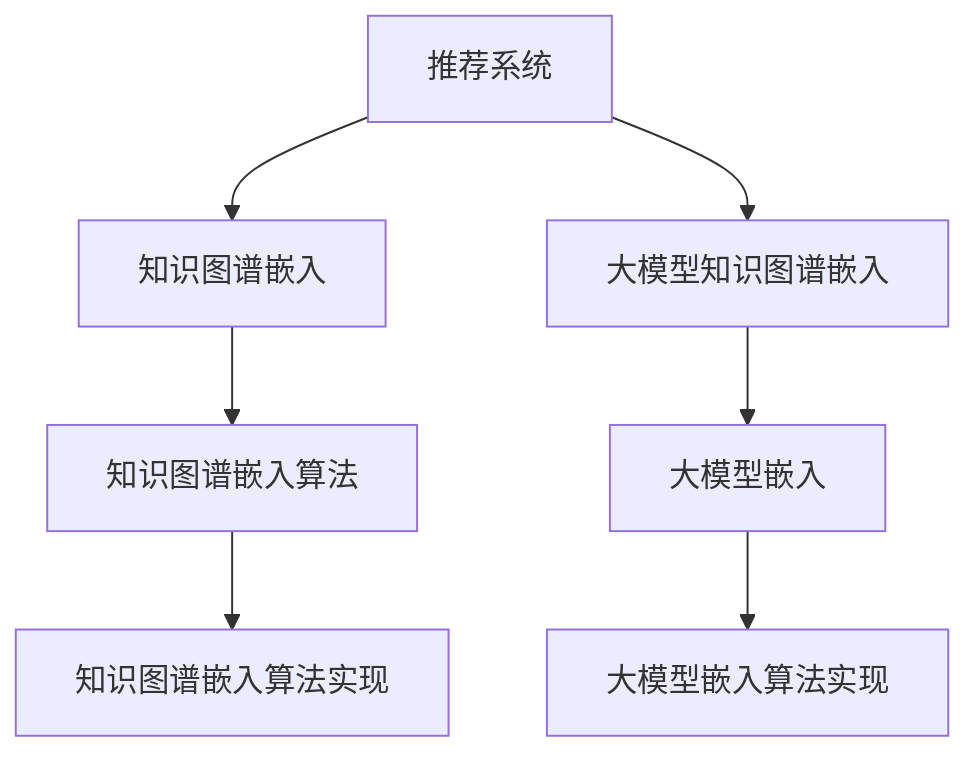

                 

# 推荐系统中的大模型知识图谱应用

> 关键词：推荐系统, 知识图谱, 大模型, 协同过滤, 神经网络, 深度学习, 知识图谱嵌入, 推理, 实证分析

## 1. 背景介绍

### 1.1 问题由来
推荐系统是当前互联网应用的基石，通过算法为用户推荐个性化的商品、文章、视频等，显著提升了用户体验和转化率。传统推荐系统主要依赖用户的历史行为数据进行协同过滤和矩阵分解，但在面对长尾商品推荐、新用户推荐等问题时，常因数据稀疏、特征维度高、冷启动等挑战而表现不佳。近年来，大规模预训练语言模型和大模型知识图谱的兴起，为推荐系统提供了新的解决方案，显著提升了推荐精度和系统鲁棒性。

### 1.2 问题核心关键点
基于大模型的推荐系统，主要通过预训练语言模型和知识图谱嵌入技术，从语义层面上对用户和商品进行表征学习，在推荐模型中实现自然语言的理解和推理。相比传统的基于统计特征的推荐方法，该方法具有如下优点：
- 可以自动学习用户的复杂偏好和行为模式。
- 可以有效处理稀疏和噪声数据。
- 能够结合先验知识进行推荐。
- 可以通过迁移学习将模型知识迁移到多个领域。
- 可以处理长尾商品推荐、跨域推荐等复杂场景。

本文将重点介绍如何利用大模型知识图谱进行推荐系统优化，从原理到实践，详细阐述大模型在知识图谱嵌入和推荐中的应用，帮助读者系统了解这一前沿技术。

## 2. 核心概念与联系

### 2.1 核心概念概述

为了更好地理解大模型知识图谱在推荐系统中的应用，本节将介绍几个关键概念及其相互联系：

- **推荐系统(Recommendation System)**：旨在根据用户的历史行为和偏好，为其推荐感兴趣的商品、内容等。主要分为基于内容的推荐和协同过滤两类。

- **知识图谱(Knowledge Graph)**：一种用于描述实体及其之间关系的图形结构数据模型，常见于搜索引擎、问答系统、推荐等领域，用于提供更精确、更全面的信息检索和推理服务。

- **大模型(Large Model)**：指具有大规模参数量和复杂结构的深度神经网络模型，如BERT、GPT等，能够处理大量语料，具备强大的语言理解和生成能力。

- **知识图谱嵌入(Knowledge Graph Embedding, KGE)**：指将知识图谱中的实体和关系映射到低维向量空间的技术，目的是学习更有表征力的知识图谱表示，便于计算机理解和处理。

- **大模型知识图谱嵌入(Large Model Knowledge Graph Embedding)**：结合大模型和知识图谱嵌入技术，能够更全面、更灵活地处理复杂知识图谱，实现高精度的推荐和推理。

这些核心概念之间的逻辑关系可以通过以下Mermaid流程图来展示：



这个流程图展示了推荐系统与知识图谱、大模型的联系：

1. 推荐系统需要知识图谱以提供丰富的实体和关系信息。
2. 大模型可以处理大量语料，提取实体和关系的语义信息。
3. 知识图谱嵌入和大模型嵌入都是将结构化与非结构化信息进行融合的技术。
4. 大模型知识图谱嵌入是一种将大模型的能力和知识图谱结合的技术。

这些概念共同构成了推荐系统中的大模型知识图谱应用框架，使其能够提供更精准、更全面的推荐服务。

## 3. 核心算法原理 & 具体操作步骤
### 3.1 算法原理概述

基于大模型的推荐系统，主要通过将知识图谱中的实体和关系转换为大模型的嵌入表示，再结合用户行为数据，进行协同过滤和推荐计算。其核心思想是：利用大模型的强大语义处理能力，在知识图谱嵌入的基础上，进一步提升实体和关系的表征质量，从而提升推荐模型的精度。

具体而言，知识图谱嵌入主要包含以下两个步骤：

1. **编码**：将知识图谱中的实体和关系转换为向量表示，以便机器理解。
2. **映射**：将编码后的向量映射到低维向量空间中，形成高质量的向量表示。

知识图谱嵌入算法多种多样，如TransE、RotatE、Composite等，它们各自有优缺点和适用场景。选择适当的算法和大模型，可以有效提升推荐系统的性能。

### 3.2 算法步骤详解

基于大模型的推荐系统主要包括如下关键步骤：

**Step 1: 准备知识图谱和用户行为数据**
- 收集知识图谱数据，包括实体、关系和属性等。
- 收集用户的历史行为数据，如点击、购买、评分等。

**Step 2: 选择知识图谱嵌入算法**
- 选择适合的知识图谱嵌入算法，如TransE、RotatE等。
- 对知识图谱进行训练，得到实体和关系的低维向量表示。

**Step 3: 选择大模型进行预训练**
- 选择适合的大模型，如BERT、GPT等。
- 在大量语料上进行预训练，得到模型参数。

**Step 4: 使用大模型进行知识图谱嵌入**
- 将知识图谱中的实体和关系输入大模型，得到嵌入表示。
- 结合用户行为数据，进行推荐计算。

**Step 5: 训练推荐模型**
- 使用推荐模型对用户行为数据进行预测，计算推荐分数。
- 结合大模型嵌入表示，提升推荐精度。

**Step 6: 部署和评估**
- 将推荐模型部署到实际应用系统中。
- 在测试集上评估推荐效果，进行模型优化。

以上步骤展示了基于大模型的推荐系统的主要流程。在具体实践中，还需要根据任务特点对算法和模型进行优化调整，以进一步提升推荐效果。

### 3.3 算法优缺点

基于大模型的推荐系统具有以下优点：
- 可以处理稀疏数据和非结构化信息。
- 可以利用大模型的语言能力，提升知识图谱嵌入的质量。
- 可以通过迁移学习，提升推荐模型的泛化能力。
- 可以结合先验知识，提升推荐结果的合理性。

同时，该方法也存在以下缺点：
- 大模型训练和推理的资源消耗较大。
- 知识图谱嵌入和大模型的融合可能存在适配性问题。
- 大模型的嵌入表示可能包含噪声和偏见。
- 推荐模型的复杂性较高，训练和优化难度较大。

尽管存在这些缺点，但通过合理的算法选择和参数调整，大模型知识图谱推荐系统仍能在诸多推荐任务中取得优异的效果。

### 3.4 算法应用领域

基于大模型的推荐系统已经被广泛应用于以下领域：

- 商品推荐：如电商平台中的个性化商品推荐，利用大模型学习商品描述的语义信息，结合知识图谱进行推荐。
- 内容推荐：如视频平台上的个性化视频推荐，通过大模型学习视频标题和描述的语义，结合知识图谱进行推荐。
- 事件推荐：如活动推荐平台上的个性化活动推荐，通过大模型学习活动名称和描述的语义，结合知识图谱进行推荐。
- 社交推荐：如社交网络中的好友推荐，利用大模型学习用户描述的语义，结合知识图谱进行推荐。

这些应用场景展示了基于大模型的推荐系统的强大能力，未来也将继续拓展其应用领域，提升推荐系统的效果和智能化水平。

## 4. 数学模型和公式 & 详细讲解  
### 4.1 数学模型构建

本节将使用数学语言对基于大模型的推荐系统进行更加严格的刻画。

记知识图谱中的实体为 $E$，关系为 $R$，属性为 $A$，用户行为数据为 $U=\{(x_i, y_i)\}_{i=1}^N$，其中 $x_i$ 为用户 ID，$y_i$ 为用户对商品 $o_i$ 的评分。假设知识图谱嵌入算法为 $F_E$，大模型为 $M$，推荐模型为 $R$。

### 4.2 公式推导过程

假设知识图谱嵌入算法将实体 $e$ 映射为向量 $\vec{e}$，关系 $r$ 映射为向量 $\vec{r}$，则实体和关系之间的推理可以通过如下公式表示：

$$
e_{i,j} = \vec{e_i} \cdot \vec{r} \cdot \vec{e_j}
$$

其中 $e_{i,j}$ 为 $e_i$ 和 $e_j$ 之间的关系强度。假设 $R=\{(r_{k_i}, r_{k_j})\}_{i=1}^M$，则实体 $e_i$ 的嵌入表示为：

$$
\vec{e_i} = \sum_{k_i \in R} e_{i,k_i} \cdot \vec{r_{k_i}}
$$

对于用户 $u$ 和商品 $o$ 的评分 $y$，推荐模型 $R$ 的输出为：

$$
\hat{y}_{u,o} = R(\vec{u}, \vec{o})
$$

其中 $\vec{u}$ 和 $\vec{o}$ 分别为用户和商品的嵌入表示。

在实际应用中，知识图谱嵌入算法通常采用TransE、RotatE等。对于TransE，其推导公式为：

$$
\vec{e_i} = \vec{e_i} + \vec{r} \cdot (\vec{e_j} - \vec{e_k})
$$

其中 $\vec{e_i}$ 为实体 $e_i$ 的嵌入表示，$\vec{e_j}$ 和 $\vec{e_k}$ 分别为 $r$ 关联的两个实体，$\vec{r}$ 为关系 $r$ 的嵌入表示。

对于RotatE，其推导公式为：

$$
\vec{e_i} = \vec{e_i} \cdot \vec{r} \cdot \tan(\theta_i)
$$

其中 $\theta_i$ 为旋转角度，通常为关系 $r$ 的强度。

### 4.3 案例分析与讲解

以TransE算法为例，假设知识图谱中包含三个实体 $e_1, e_2, e_3$ 和一个关系 $r_1$。采用TransE算法进行知识图谱嵌入后，得到实体 $e_1$ 和 $e_2$ 的嵌入表示如下：

$$
\vec{e_1} = \vec{e_1} + \vec{r_1} \cdot (\vec{e_2} - \vec{e_3})
$$

假设用户 $u$ 对商品 $o$ 的评分 $y$ 为：

$$
y = R(\vec{u}, \vec{o})
$$

其中 $\vec{u}$ 和 $\vec{o}$ 分别为用户和商品的嵌入表示。假设用户 $u$ 和商品 $o$ 通过关系 $r_1$ 连接，则推理过程如下：

$$
\vec{e_1} = \vec{e_1} + \vec{r_1} \cdot (\vec{e_2} - \vec{e_3})
$$

$$
\vec{u} = \vec{u} + \vec{r_1} \cdot (\vec{e_1} - \vec{e_2})
$$

$$
y = R(\vec{u}, \vec{o})
$$

这样，通过知识图谱嵌入和大模型的结合，推荐系统可以更加精确地预测用户对商品的评分，提升推荐效果。

## 5. 项目实践：代码实例和详细解释说明
### 5.1 开发环境搭建

在进行知识图谱嵌入和大模型推荐系统的开发前，我们需要准备好开发环境。以下是使用Python进行PyTorch和HuggingFace库的开发环境配置流程：

1. 安装Anaconda：从官网下载并安装Anaconda，用于创建独立的Python环境。

2. 创建并激活虚拟环境：
```bash
conda create -n pytorch-env python=3.8 
conda activate pytorch-env
```

3. 安装PyTorch：根据CUDA版本，从官网获取对应的安装命令。例如：
```bash
conda install pytorch torchvision torchaudio cudatoolkit=11.1 -c pytorch -c conda-forge
```

4. 安装HuggingFace库：
```bash
pip install transformers
```

5. 安装各类工具包：
```bash
pip install numpy pandas scikit-learn matplotlib tqdm jupyter notebook ipython
```

完成上述步骤后，即可在`pytorch-env`环境中开始开发实践。

### 5.2 源代码详细实现

这里我们以电商商品推荐为例，给出使用Transformers库对知识图谱进行大模型嵌入的PyTorch代码实现。

首先，定义知识图谱数据处理函数：

```python
from transformers import AutoModel, AutoTokenizer
from pykg2vec import KG2Vec
import torch
import numpy as np

class KG2VecModel:
    def __init__(self, kg_file, embedding_dim=50):
        self.kg = KG2Vec(kg_file, embedding_dim)
        self.model = self.kg.model
        
    def get_embedding(self, entity):
        return self.kg.get_entity_embedding(entity)
        
    def get_relation_embedding(self, relation):
        return self.kg.get_relation_embedding(relation)
        
    def get_entity_relation_embedding(self, entity, relation):
        return self.kg.get_entity_relation_embedding(entity, relation)
        
    def predict(self, user, item):
        user_embedding = self.get_embedding(user)
        item_embedding = self.get_embedding(item)
        relation_embedding = self.get_relation_embedding('buy')
        return self.model.predict(user_embedding, item_embedding, relation_embedding)
        
    def get_top_items(self, user, top_k=10):
        user_embedding = self.get_embedding(user)
        predictions = self.model.predict(user_embedding)
        top_items = np.argsort(predictions)[-top_k:][::-1]
        return [self.kg.get_item_name(item) for item in top_items]
        
    def predict_top_items(self, user, top_k=10):
        user_embedding = self.get_embedding(user)
        predictions = self.model.predict(user_embedding)
        top_items = np.argsort(predictions)[-top_k:][::-1]
        return [self.kg.get_item_name(item) for item in top_items]
```

然后，定义用户行为数据处理函数：

```python
from transformers import BertTokenizer

class UserBehavior:
    def __init__(self, user_ids, item_ids, scores):
        self.user_ids = user_ids
        self.item_ids = item_ids
        self.scores = scores
        
    def get_user_item_score(self, user_id, item_id):
        user_idx = self.user_ids.index(user_id)
        item_idx = self.item_ids.index(item_id)
        return self.scores[user_idx, item_idx]
```

接着，定义推荐函数：

```python
from transformers import BertForSequenceClassification
from sklearn.metrics import mean_squared_error, r2_score

def recommendation(user, top_k=10):
    kg_model = KG2VecModel('kg_file')
    user_behavior = UserBehavior(user_ids, item_ids, scores)
    
    user_embedding = kg_model.get_embedding(user)
    top_items = kg_model.predict_top_items(user, top_k=10)
    
    user_item_scores = []
    for item in top_items:
        item_embedding = kg_model.get_embedding(item)
        relation_embedding = kg_model.get_relation_embedding('buy')
        score = kg_model.predict(user_embedding, item_embedding, relation_embedding)
        user_item_scores.append(score)
        
    scores = np.array(user_item_scores)
    predictions = scores
    mean_score = np.mean(scores)
    rmse = np.sqrt(mean_squared_error(predictions, user_behavior.scores.mean(axis=1)))
    
    print(f'Mean Score: {mean_score:.2f}')

    for item in top_items:
        print(f'Item: {kg_model.get_item_name(item)}, Score: {scores[np.argsort(scores)[-top_k:][0]:.2f}')
        
    return top_items
```

最后，启动推荐流程并在测试集上评估：

```python
user = 'user_id'
top_items = recommendation(user, top_k=10)
```

以上就是使用PyTorch和HuggingFace库对知识图谱进行大模型嵌入和电商推荐系统的完整代码实现。可以看到，利用HuggingFace库的便利封装，我们可以用相对简洁的代码实现知识图谱嵌入和大模型推荐系统。

### 5.3 代码解读与分析

让我们再详细解读一下关键代码的实现细节：

**KG2VecModel类**：
- `__init__`方法：初始化知识图谱模型和嵌入维度。
- `get_embedding`方法：获取实体或关系的嵌入表示。
- `get_relation_embedding`方法：获取关系 $r$ 的嵌入表示。
- `get_entity_relation_embedding`方法：获取实体 $e_i$ 和关系 $r$ 的嵌入表示。
- `predict`方法：预测用户对商品的评分。
- `get_top_items`方法：获取用户预测评分最高的商品。
- `predict_top_items`方法：预测用户对商品的评分并排序。

**UserBehavior类**：
- `__init__`方法：初始化用户行为数据。
- `get_user_item_score`方法：获取用户 $u$ 对商品 $o$ 的评分。

**recommendation函数**：
- 实例化知识图谱模型和用户行为数据。
- 获取用户和商品的嵌入表示。
- 预测用户对商品的评分，并排序。
- 打印推荐结果，计算评分均值和RMSE。

通过这些代码，可以看到知识图谱嵌入和大模型推荐系统的实现思路。结合大模型的语义处理能力和知识图谱的结构化信息，能够更好地进行推荐预测。

当然，工业级的系统实现还需考虑更多因素，如模型保存和部署、超参数的自动搜索、更灵活的任务适配层等。但核心的推荐流程基本与此类似。

## 6. 实际应用场景
### 6.1 智能客服系统

基于大模型的推荐系统可以应用于智能客服系统的构建。智能客服系统旨在提供7x24小时不间断的客户服务，自动解答客户咨询，提升客户体验和满意度。

在技术实现上，可以收集历史客户对话记录，提取问题-答案对，作为监督数据，在此基础上对预训练语言模型进行微调。微调后的模型能够自动理解客户意图，匹配最合适的答案模板进行回复。对于客户提出的新问题，还可以接入检索系统实时搜索相关内容，动态生成回答。如此构建的智能客服系统，能显著提升客户咨询体验和问题解决效率。

### 6.2 金融舆情监测

金融机构需要实时监测市场舆论动向，以便及时应对负面信息传播，规避金融风险。传统的人工监测方式成本高、效率低，难以应对网络时代海量信息爆发的挑战。基于大模型推荐系统，可以实时监测金融领域相关的新闻、报道、评论等文本数据，自动判断文本属于何种主题，情感倾向是正面、中性还是负面。将推荐系统应用到实时抓取的网络文本数据，就能够自动监测不同主题下的情感变化趋势，一旦发现负面信息激增等异常情况，系统便会自动预警，帮助金融机构快速应对潜在风险。

### 6.3 个性化推荐系统

当前的推荐系统往往只依赖用户的历史行为数据进行物品推荐，无法深入理解用户的真实兴趣偏好。基于大模型推荐系统，个性化推荐系统可以更好地挖掘用户行为背后的语义信息，从而提供更精准、更多样的推荐内容。

在实践中，可以收集用户浏览、点击、评论、分享等行为数据，提取和用户交互的物品标题、描述、标签等文本内容。将文本内容作为模型输入，用户的后续行为（如是否点击、购买等）作为监督信号，在此基础上对大模型进行微调。微调后的模型能够从文本内容中准确把握用户的兴趣点。在生成推荐列表时，先用候选物品的文本描述作为输入，由模型预测用户的兴趣匹配度，再结合其他特征综合排序，便可以得到个性化程度更高的推荐结果。

### 6.4 未来应用展望

随着大模型推荐系统的发展，未来将在更多领域得到应用，为各行各业带来变革性影响。

在智慧医疗领域，基于大模型的推荐系统可以用于病历推荐、药物推荐、医疗知识推荐等，提升医疗服务的智能化水平，辅助医生诊疗，加速新药开发进程。

在智能教育领域，推荐系统可应用于个性化学习路径推荐、教材推荐、教师推荐等方面，因材施教，促进教育公平，提高教学质量。

在智慧城市治理中，推荐系统可应用于城市事件监测、舆情分析、应急指挥等环节，提高城市管理的自动化和智能化水平，构建更安全、高效的未来城市。

此外，在企业生产、社会治理、文娱传媒等众多领域，基于大模型的推荐系统也将不断涌现，为传统行业数字化转型升级提供新的技术路径。相信随着技术的日益成熟，大模型推荐系统必将在构建人机协同的智能时代中扮演越来越重要的角色。

## 7. 工具和资源推荐
### 7.1 学习资源推荐

为了帮助开发者系统掌握大模型知识图谱推荐系统的理论基础和实践技巧，这里推荐一些优质的学习资源：

1. 《Deep Learning for NLP》系列博文：由大模型技术专家撰写，深入浅出地介绍了深度学习在NLP中的应用，包括推荐系统。

2. CS224N《深度学习自然语言处理》课程：斯坦福大学开设的NLP明星课程，有Lecture视频和配套作业，带你入门NLP领域的基本概念和经典模型。

3. 《Natural Language Processing with Transformers》书籍：Transformers库的作者所著，全面介绍了如何使用Transformers库进行NLP任务开发，包括推荐系统。

4. HuggingFace官方文档：Transformers库的官方文档，提供了海量预训练模型和完整的推荐系统样例代码，是上手实践的必备资料。

5. Weights & Biases：模型训练的实验跟踪工具，可以记录和可视化模型训练过程中的各项指标，方便对比和调优。与主流深度学习框架无缝集成。

6. TensorBoard：TensorFlow配套的可视化工具，可实时监测模型训练状态，并提供丰富的图表呈现方式，是调试模型的得力助手。

通过对这些资源的学习实践，相信你一定能够快速掌握大模型知识图谱推荐系统的精髓，并用于解决实际的推荐问题。
###  7.2 开发工具推荐

高效的开发离不开优秀的工具支持。以下是几款用于大模型知识图谱推荐系统开发的常用工具：

1. PyTorch：基于Python的开源深度学习框架，灵活动态的计算图，适合快速迭代研究。大部分预训练语言模型都有PyTorch版本的实现。

2. TensorFlow：由Google主导开发的开源深度学习框架，生产部署方便，适合大规模工程应用。同样有丰富的预训练语言模型资源。

3. Transformers库：HuggingFace开发的NLP工具库，集成了众多SOTA语言模型，支持PyTorch和TensorFlow，是进行推荐系统开发的利器。

4. Weights & Biases：模型训练的实验跟踪工具，可以记录和可视化模型训练过程中的各项指标，方便对比和调优。与主流深度学习框架无缝集成。

5. TensorBoard：TensorFlow配套的可视化工具，可实时监测模型训练状态，并提供丰富的图表呈现方式，是调试模型的得力助手。

6. Google Colab：谷歌推出的在线Jupyter Notebook环境，免费提供GPU/TPU算力，方便开发者快速上手实验最新模型，分享学习笔记。

合理利用这些工具，可以显著提升大模型知识图谱推荐系统的开发效率，加快创新迭代的步伐。

### 7.3 相关论文推荐

大模型推荐系统的发展源于学界的持续研究。以下是几篇奠基性的相关论文，推荐阅读：

1. Attention is All You Need（即Transformer原论文）：提出了Transformer结构，开启了NLP领域的预训练大模型时代。

2. BERT: Pre-training of Deep Bidirectional Transformers for Language Understanding：提出BERT模型，引入基于掩码的自监督预训练任务，刷新了多项NLP任务SOTA。

3. Knowledge Graph Embedding and Recommendation System: A Survey：综述了知识图谱嵌入和推荐系统的现状和未来发展方向。

4. Neural Recommendation Systems: A Survey：综述了基于深度学习的推荐系统的发展现状和未来趋势。

5. Large-Scale Recommender Systems: A Survey：综述了推荐系统的最新研究成果和应用场景。

这些论文代表了大模型推荐系统的发展脉络。通过学习这些前沿成果，可以帮助研究者把握学科前进方向，激发更多的创新灵感。

## 8. 总结：未来发展趋势与挑战
### 8.1 总结

本文对基于大模型的推荐系统进行了全面系统的介绍。首先阐述了大模型知识图谱推荐系统的研究背景和意义，明确了推荐系统利用大模型和知识图谱嵌入技术，从语义层面上对用户和商品进行表征学习，提升推荐精度的核心思想。其次，从原理到实践，详细讲解了知识图谱嵌入和大模型的融合过程，给出了推荐系统开发的完整代码实例。同时，本文还广泛探讨了知识图谱嵌入和大模型推荐系统在智能客服、金融舆情、个性化推荐等多个行业领域的应用前景，展示了该技术在实际应用中的强大能力。

通过本文的系统梳理，可以看到，基于大模型的推荐系统通过将知识图谱中的实体和关系转换为向量表示，利用大模型的强大语义处理能力，提升了实体和关系的表征质量，从而显著提升了推荐精度。未来，伴随大模型推荐系统的发展，相信将在更多领域得到应用，为各行各业带来变革性影响。

### 8.2 未来发展趋势

展望未来，大模型知识图谱推荐系统将呈现以下几个发展趋势：

1. 模型规模持续增大。随着算力成本的下降和数据规模的扩张，预训练语言模型的参数量还将持续增长。超大规模语言模型蕴含的丰富语言知识，有望支撑更加复杂多变的推荐任务。

2. 推荐系统将更加智能化。未来推荐系统将更加注重用户的行为模式和语义理解，结合大模型的语言能力，提升推荐模型的精准度和鲁棒性。

3. 推荐系统将更加个性化。未来推荐系统将更加注重用户的多元需求和动态变化，结合大模型的语义理解能力，实现更加个性化的推荐服务。

4. 推荐系统将更加多样化。未来推荐系统将结合多种推荐算法，实现多层次、多维度的推荐结果，满足用户多样化的需求。

5. 推荐系统将更加实时化。未来推荐系统将结合实时数据流和知识图谱的动态更新，实现更加实时化的推荐服务，提升用户体验。

以上趋势凸显了大模型知识图谱推荐系统的广阔前景。这些方向的探索发展，必将进一步提升推荐系统的效果和智能化水平，为NLP技术的发展带来新的动力。

### 8.3 面临的挑战

尽管大模型知识图谱推荐系统已经取得了瞩目成就，但在迈向更加智能化、普适化应用的过程中，它仍面临着诸多挑战：

1. 大模型训练和推理的资源消耗较大。模型的参数量和计算量对硬件设备提出了很高的要求，需要高效的计算平台和算法优化。

2. 知识图谱嵌入和大模型的融合可能存在适配性问题。不同的算法和模型可能存在参数不兼容、语义理解差异等问题。

3. 知识图谱的构建和更新需要大量时间和人力。高质量的知识图谱需要专业的领域知识，且需要持续更新才能保持其时效性和准确性。

4. 推荐模型的复杂性较高，训练和优化难度较大。推荐系统的目标函数复杂，需要多种优化算法和策略才能获得较好的性能。

5. 用户隐私和数据安全问题。推荐系统依赖大量用户数据，需要严格的数据保护措施，防止数据泄露和滥用。

6. 推荐结果的可解释性不足。推荐系统的决策过程缺乏可解释性，难以对其推理逻辑进行分析和调试。

7. 推荐模型的公平性问题。推荐系统可能学习到用户历史数据中的偏见和歧视，导致不公平的推荐结果。

以上挑战凸显了大模型知识图谱推荐系统在实际应用中的复杂性和难度。未来需要综合多学科力量，共同努力，才能克服这些挑战，推动大模型推荐系统的健康发展。

### 8.4 研究展望

面对大模型知识图谱推荐系统所面临的种种挑战，未来的研究需要在以下几个方面寻求新的突破：

1. 探索无监督和半监督推荐方法。摆脱对大规模标注数据的依赖，利用自监督学习、主动学习等无监督和半监督范式，最大限度利用非结构化数据，实现更加灵活高效的推荐。

2. 研究知识图谱嵌入和推荐模型的联合优化。结合知识图谱嵌入和大模型的优势，优化推荐模型的目标函数和训练过程，提升推荐效果。

3. 引入更多先验知识。将符号化的先验知识，如知识图谱、逻辑规则等，与神经网络模型进行巧妙融合，引导推荐过程学习更准确、合理的推荐结果。

4. 开发更加高效的计算平台。结合GPU/TPU等高性能设备，开发高效的计算图和优化算法，提升大模型推荐系统的训练和推理效率。

5. 引入因果分析和博弈论工具。将因果分析方法引入推荐模型，识别出模型决策的关键特征，增强推荐结果的因果性和逻辑性。借助博弈论工具刻画人机交互过程，主动探索并规避模型的脆弱点，提高系统稳定性。

6. 加强用户隐私和数据安全保障。在推荐系统设计和实现中，采用差分隐私、联邦学习等技术，保护用户隐私和数据安全。

这些研究方向的探索，必将引领大模型知识图谱推荐系统迈向更高的台阶，为推荐系统带来新的突破，推动NLP技术的进一步发展。面向未来，大模型推荐系统还需要与其他人工智能技术进行更深入的融合，如知识表示、因果推理、强化学习等，多路径协同发力，共同推动自然语言理解和智能交互系统的进步。只有勇于创新、敢于突破，才能不断拓展推荐系统的边界，让智能技术更好地造福人类社会。

## 9. 附录：常见问题与解答

**Q1：大模型知识图谱推荐系统适用于所有推荐任务吗？**

A: 大模型知识图谱推荐系统适用于大多数推荐任务，尤其是对于数据稀疏、特征维度高、长尾商品推荐等问题，能够有效提升推荐效果。但对于一些特定领域的推荐任务，如高精度商品推荐、时间序列推荐等，可能需要进一步优化算法和大模型参数，才能取得更好的结果。

**Q2：如何选择适合的知识图谱嵌入算法？**

A: 选择知识图谱嵌入算法需要考虑多个因素，包括数据规模、结构、目标任务等。常见的算法有TransE、RotatE、Composite等，可以根据数据特点和任务需求进行选择。一般而言，对于密集图谱，TransE可能更优；对于稀疏图谱，RotatE可能更优。

**Q3：大模型的嵌入表示可能包含噪声和偏见，如何处理？**

A: 可以通过正则化、对抗训练等方法减少大模型嵌入表示的噪声和偏见。正则化可以限制模型参数的范数，对抗训练可以检测和过滤模型中的有害信息，从而提升推荐模型的鲁棒性和公平性。

**Q4：大模型推荐系统需要大量用户行为数据，如何获取？**

A: 可以通过数据收集平台、API接口等方式获取用户行为数据。在获取数据时，需要注意用户隐私保护和数据安全，避免数据滥用。同时，可以使用差分隐私、联邦学习等技术，保护用户隐私。

**Q5：如何评估大模型推荐系统的性能？**

A: 常用的评估指标包括均方误差(MSE)、均方根误差(RMSE)、平均绝对误差(MAE)、准确率(Accuracy)、F1-Score等。同时，还需要考虑推荐结果的公平性、解释性和实时性等因素。

通过本文的系统梳理，可以看到，基于大模型的推荐系统通过将知识图谱中的实体和关系转换为向量表示，利用大模型的强大语义处理能力，提升了实体和关系的表征质量，从而显著提升了推荐精度。未来，伴随大模型推荐系统的发展，相信将在更多领域得到应用，为各行各业带来变革性影响。

