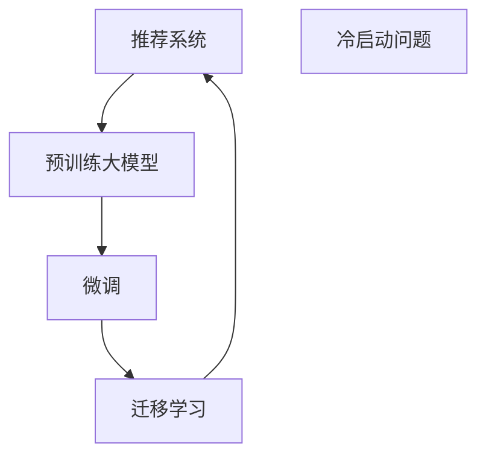

                 

## 1. 背景介绍

推荐系统作为互联网时代的重要技术，在电商、媒体、社交等多个领域得到了广泛应用，为用户带来了个性化的内容和服务。然而，在推荐系统的初始阶段，即冷启动阶段，如何为无历史行为记录的新用户提供有效的推荐，是一个值得深入探讨的问题。传统方法主要依赖于特征工程和机器学习模型的训练，但特征维度高、模型训练时间长的问题往往难以解决。近年来，人工智能大模型在推荐系统中的应用逐步兴起，通过迁移学习等技术，可以在很大程度上缓解冷启动问题。

本文将从推荐系统的冷启动问题入手，探讨利用大模型的迁移学习解决方案。通过介绍核心概念、算法原理及操作步骤，以及实际应用场景和未来展望，帮助读者全面掌握该技术。

## 2. 核心概念与联系

### 2.1 核心概念概述

- **推荐系统**：通过分析用户的历史行为、属性等信息，为用户推荐个性化商品、内容、服务等。
- **冷启动问题**：推荐系统在面对新用户或新商品时，无法获取足够的历史数据，无法提供有效的推荐。
- **迁移学习**：将一个领域学习到的知识，迁移到另一个领域进行学习的方法，可以有效解决冷启动问题。
- **预训练大模型**：如BERT、GPT等大规模预训练模型，在大量无标签数据上进行训练，具备强大的通用表征能力。
- **微调**：在大模型的基础上，通过微调特定层或全模型，使其适应该任务。

### 2.2 核心概念原理和架构的 Mermaid 流程图



这个流程图展示了从推荐系统到冷启动问题，再到利用大模型和微调进行迁移学习的全流程。推荐系统通过预训练大模型的迁移学习，可以有效解决冷启动问题，为用户推荐更加个性化、精准的内容。

## 3. 核心算法原理 & 具体操作步骤

### 3.1 算法原理概述

迁移学习在推荐系统中的应用，主要是通过在大模型上进行微调，使得模型可以适应特定任务的需求。具体来说，预训练大模型在大量无标签数据上进行训练，获得了广泛的语义和知识表示。通过微调特定层或全模型，可以在较小的数据集上快速适应新任务，提供准确的推荐。

### 3.2 算法步骤详解

1. **数据准备**：收集推荐任务的相关数据，如用户行为、商品属性等，划分为训练集和测试集。

2. **预训练模型选择**：选择合适的预训练大模型，如BERT、GPT等。

3. **任务适配层添加**：根据推荐任务，添加相应的输出层和损失函数。

4. **微调参数设置**：设置微调时的学习率、优化器等超参数。

5. **执行微调**：将微调数据集输入模型，进行前向传播和反向传播，更新模型参数。

6. **模型评估**：在测试集上评估模型性能，优化微调策略。

### 3.3 算法优缺点

**优点**：
- 快速适应新任务：通过微调，模型可以在少量数据上快速获得良好性能。
- 通用性强：预训练大模型在多种任务上均有良好表现，可以适配不同的推荐场景。
- 参数高效：微调时只更新少部分参数，避免过拟合。

**缺点**：
- 数据需求高：仍需要一定的标注数据进行微调。
- 模型复杂度：预训练模型和微调过程较为复杂，需要较高的计算资源。

### 3.4 算法应用领域

迁移学习在推荐系统的应用领域非常广泛，如电商推荐、新闻推荐、广告推荐等。通过利用大模型和微调技术，可以有效解决冷启动问题，为用户提供更加精准、个性化的推荐服务。

## 4. 数学模型和公式 & 详细讲解 & 举例说明

### 4.1 数学模型构建

推荐系统的目标是为用户推荐与历史行为相似的物品。假设有 $N$ 个用户 $U$，$M$ 个物品 $I$，每个用户 $u$ 对物品 $i$ 的评分 $r_{ui}$，模型目标是最大化：

$$
\max_{\theta} \sum_{u=1}^{N} \sum_{i=1}^{M} r_{ui}p_{ui}(\theta)
$$

其中，$p_{ui}(\theta)$ 为模型的预测概率分布，$\theta$ 为模型参数。

### 4.2 公式推导过程

为了解决冷启动问题，需要在预训练大模型上进行微调。假设微调后的模型为 $M_{\theta}$，在用户 $u$ 对物品 $i$ 的评分上，微调的损失函数为：

$$
\mathcal{L}(u,i) = -\log M_{\theta}(x_i)
$$

其中 $x_i$ 为物品 $i$ 的特征向量。

### 4.3 案例分析与讲解

以电商推荐为例，假设有 $N$ 个用户和 $M$ 个商品，收集到 $K$ 个用户对商品的评分数据。通过微调BERT模型，使其可以预测用户对新商品的评分，缓解冷启动问题。具体步骤如下：

1. **数据准备**：收集 $K$ 个用户对 $M$ 个商品的评分数据，划分为训练集和测试集。
2. **模型选择**：选择BERT模型作为预训练模型。
3. **任务适配层添加**：添加线性分类器作为输出层，损失函数为交叉熵损失。
4. **微调参数设置**：设置学习率为 $2e-5$，优化器为AdamW。
5. **执行微调**：将微调数据集输入模型，进行前向传播和反向传播，更新模型参数。
6. **模型评估**：在测试集上评估模型性能，调整超参数。

## 5. 项目实践：代码实例和详细解释说明

### 5.1 开发环境搭建

- **安装Python环境**：使用Anaconda创建虚拟环境，安装Python 3.8。
- **安装PyTorch和Transformers库**：
  ```bash
  conda install pytorch torchvision torchaudio transformers
  ```
- **安装相关库**：
  ```bash
  pip install pandas numpy scikit-learn
  ```

### 5.2 源代码详细实现

```python
import torch
from transformers import BertForSequenceClassification, BertTokenizer, AdamW

# 设置设备
device = torch.device("cuda" if torch.cuda.is_available() else "cpu")

# 数据准备
tokenizer = BertTokenizer.from_pretrained("bert-base-uncased")
train_dataset = # 准备训练数据集
test_dataset = # 准备测试数据集

# 模型选择和初始化
model = BertForSequenceClassification.from_pretrained("bert-base-uncased", num_labels=2)
model.to(device)

# 设置优化器和超参数
optimizer = AdamW(model.parameters(), lr=2e-5)

# 训练模型
for epoch in range(10):
    for data in train_loader:
        inputs, labels = data
        inputs = inputs.to(device)
        labels = labels.to(device)
        model.zero_grad()
        outputs = model(inputs)
        loss = outputs.loss
        loss.backward()
        optimizer.step()

# 测试模型
test_loss = 0
for data in test_loader:
    inputs, labels = data
    inputs = inputs.to(device)
    labels = labels.to(device)
    outputs = model(inputs)
    loss = outputs.loss
    test_loss += loss.item()

print(f"测试损失：{test_loss/N}")
```

### 5.3 代码解读与分析

- **模型选择和初始化**：选择BERT模型作为预训练模型，并初始化为默认参数。
- **优化器和超参数设置**：使用AdamW优化器，学习率为 $2e-5$。
- **训练过程**：在每个epoch中，对训练数据进行迭代，计算损失并更新模型参数。
- **测试过程**：在测试集上计算模型损失，评估模型性能。

### 5.4 运行结果展示

在训练完成后，模型可以在新商品上快速进行评分预测，从而缓解冷启动问题。例如，在电商推荐中，模型可以预测新商品对新用户的评分，为用户提供个性化推荐。

## 6. 实际应用场景

### 6.1 电商推荐

电商推荐是推荐系统的重要应用场景之一。通过利用大模型和微调技术，可以有效解决冷启动问题，为用户提供精准的商品推荐。例如，利用BERT模型在电商评论数据上进行微调，可以预测用户对新商品的评分，从而提升推荐效果。

### 6.2 新闻推荐

新闻推荐系统需要为用户推荐与历史兴趣相似的新闻内容。利用大模型和微调技术，可以有效缓解冷启动问题。例如，通过微调BERT模型，可以预测用户对新新闻的兴趣度，提供个性化的新闻推荐。

### 6.3 广告推荐

广告推荐系统需要为用户推荐与其兴趣相关的广告。通过利用大模型和微调技术，可以有效解决冷启动问题。例如，利用BERT模型在广告数据上进行微调，可以预测用户对新广告的点击率，从而提升广告投放效果。

## 7. 工具和资源推荐

### 7.1 学习资源推荐

1. **《推荐系统实战》**：讲解推荐系统的基本原理和常见算法，包含冷启动问题解决思路。
2. **《深度学习推荐系统》**：介绍推荐系统的深度学习技术，包括迁移学习的应用。
3. **Kaggle竞赛平台**：提供推荐系统相关的竞赛任务，可以进行实战练习。

### 7.2 开发工具推荐

1. **PyTorch**：深度学习框架，支持分布式训练和动态图机制，适合推荐系统的模型训练。
2. **TensorFlow**：深度学习框架，支持静态图机制，适合生产环境的模型部署。
3. **HuggingFace Transformers库**：提供预训练模型的封装，方便微调操作。

### 7.3 相关论文推荐

1. **“DeepFM: A Neural Network Approach for Recommender Systems”**：介绍DeepFM模型，利用神经网络进行特征交叉和微调。
2. **“KNN in Recommender Systems”**：介绍KNN算法，利用协同过滤进行推荐。
3. **“Word2Vec: Exploring the Semantic Structure of Large Datasets”**：介绍Word2Vec模型，利用预训练向量进行推荐。

## 8. 总结：未来发展趋势与挑战

### 8.1 研究成果总结

利用大模型和微调技术解决推荐系统的冷启动问题，已经成为推荐系统领域的重要研究方向。通过微调模型，可以在少量数据上快速获得准确的推荐结果，提升推荐系统的性能。

### 8.2 未来发展趋势

1. **多模态推荐**：将文本、图像、音频等多种模态数据融合到推荐系统中，提升推荐效果。
2. **联邦学习**：通过分布式训练和多用户数据协同，提升推荐系统的隐私保护和鲁棒性。
3. **自适应推荐**：利用在线学习算法，实时更新模型参数，提升推荐系统的实时性和个性化。

### 8.3 面临的挑战

1. **数据隐私和安全**：推荐系统需要处理大量用户数据，如何保护用户隐私和数据安全是一个重要挑战。
2. **模型复杂度**：大模型和微调过程较为复杂，如何优化模型结构和计算效率是一个重要研究方向。
3. **推荐公平性**：推荐系统需要避免推荐结果的偏见和歧视，确保推荐结果的公平性和公正性。

### 8.4 研究展望

未来，推荐系统的研究将更加注重用户隐私保护、模型复杂度优化和推荐公平性，同时利用大模型和微调技术，提升推荐系统的性能和覆盖面。通过多模态融合、联邦学习和自适应推荐等技术，推荐系统将在更多场景下发挥重要作用，为用户带来更加个性化、精准的服务。

## 9. 附录：常见问题与解答

**Q1：什么是推荐系统？**

A: 推荐系统通过分析用户的历史行为和属性，为用户推荐个性化商品、内容、服务等。

**Q2：什么是冷启动问题？**

A: 推荐系统在面对新用户或新商品时，由于缺乏历史数据，无法提供有效的推荐。

**Q3：什么是迁移学习？**

A: 迁移学习是将一个领域学习到的知识，迁移到另一个领域进行学习的方法，可以有效解决冷启动问题。

**Q4：如何利用大模型解决冷启动问题？**

A: 利用大模型和微调技术，可以在少量数据上快速获得准确的推荐结果，提升推荐系统的性能。

**Q5：推荐系统的未来发展方向是什么？**

A: 未来推荐系统将更加注重用户隐私保护、模型复杂度优化和推荐公平性，同时利用多模态融合、联邦学习和自适应推荐等技术，提升推荐系统的性能和覆盖面。

