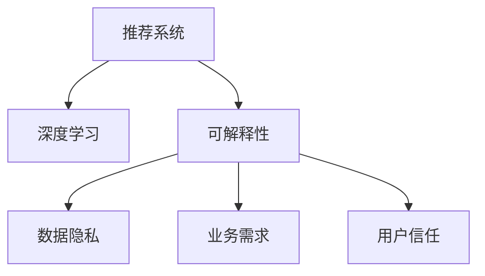

                 

# 推荐系统的可解释性：用户的信任

## 1. 背景介绍

推荐系统（Recommendation Systems）是现代互联网应用中的重要组件，从电商平台的商品推荐到视频网站的个性化视频推荐，都离不开推荐系统的支撑。然而，随着数据量的爆炸性增长和模型复杂度的提升，推荐系统的“黑盒”特性愈发明显，用户往往无法理解其背后的决策逻辑。这种“黑盒”特性，不仅影响了用户体验，也可能带来信任危机。

### 1.1 问题由来

近年来，推荐系统的发展取得了长足的进步，但“可解释性”（Explainability）问题始终未能得到充分解决。主要原因如下：

- **模型复杂性**：现代推荐系统通常采用深度学习模型，包括深度神经网络、深度置信网络、深度推荐算法等，这些模型具有高度的非线性特性，难以用传统方式解释。

- **数据隐私**：推荐系统需要大量用户行为数据作为训练和评估依据，而用户对这些数据的使用目的和处理方式通常存在担忧。

- **业务需求**：许多业务方需要根据推荐结果做出重要决策，而透明的解释有助于提高决策的科学性和可信度。

### 1.2 问题核心关键点

要解决推荐系统的可解释性问题，关键在于找到用户可以理解并信任的推荐依据。以下是核心关键点：

- **模型透明性**：推荐系统应当提供透明的模型决策过程，让用户了解推荐结果的生成机制。

- **数据可控性**：用户需要对自己的数据拥有一定的控制权，了解数据的用途和处理方式。

- **结果可解释性**：推荐系统应当提供清晰、易懂的解释，帮助用户理解推荐结果的依据。

- **业务可操作性**：在实际应用中，推荐系统的解释需要具备可操作性，便于业务方参考和利用。

## 2. 核心概念与联系

### 2.1 核心概念概述

为了更好地理解推荐系统的可解释性，本节将介绍几个密切相关的核心概念：

- **推荐系统**：通过分析用户的历史行为、兴趣偏好等数据，向用户推荐其可能感兴趣的产品、内容或服务的技术。

- **深度学习**：一类模仿人类学习方式的机器学习方法，通过多层神经网络对输入数据进行学习，并输出预测结果。

- **可解释性**：指模型的决策过程可以被用户理解，并且能够在一定范围内被解释和验证的特性。

- **数据隐私**：在数据收集、存储、传输和处理过程中，保护用户个人数据不被滥用或泄露的权利。

- **业务需求**：不同业务方根据自身的目标和需求，对推荐系统提出了不同层次的要求。

- **用户信任**：用户对推荐系统的信任度，直接影响其使用和满意度。

这些核心概念之间的逻辑关系可以通过以下Mermaid流程图来展示：



这个流程图展示推荐系统的核心概念及其之间的关系：

1. 推荐系统通过深度学习模型对用户数据进行分析。
2. 可解释性是推荐系统的重要特性，与用户信任密切相关。
3. 数据隐私保护是推荐系统设计的重要原则。
4. 业务需求驱动推荐系统的设计和优化。
5. 用户信任是推荐系统成功应用的基石。

## 3. 核心算法原理 & 具体操作步骤

### 3.1 算法原理概述

推荐系统的可解释性可以分为模型透明性、数据可控性、结果可解释性和业务可操作性四个方面。每个方面都需要在算法和设计上考虑，以满足用户和业务方的需求。

### 3.2 算法步骤详解

#### 3.2.1 模型透明性

1. **模型选择与设计**：选择用户可理解的模型架构，如逻辑回归、决策树、线性模型等，而非过于复杂的深度神经网络。
2. **参数解释**：对模型参数进行解释，如逻辑回归的权重、决策树的特征重要性等。
3. **中间过程可视化**：通过可视化工具（如TensorBoard、SHAP）展示模型训练和推理过程中的关键节点和参数变化。

#### 3.2.2 数据可控性

1. **数据匿名化**：对用户数据进行匿名化处理，保护用户隐私。
2. **数据控制接口**：允许用户对数据的使用和处理方式进行控制，如访问权限、删除权等。
3. **数据透明度报告**：定期向用户提供数据使用报告，说明数据的使用情况和处理方式。

#### 3.2.3 结果可解释性

1. **推荐理由生成**：为每个推荐结果生成简明的解释，如推荐依据的特征、权重等信息。
2. **交互式解释界面**：设计交互式界面，让用户可以查询和理解推荐理由。
3. **反馈机制**：建立用户反馈机制，收集用户对推荐理由的意见和建议。

#### 3.2.4 业务可操作性

1. **决策支持系统**：将推荐结果和解释集成到业务决策支持系统中，便于业务方参考。
2. **性能指标监控**：监控推荐系统的性能指标，如召回率、准确率、覆盖率等，提供业务方所需的信息。
3. **异常检测与处理**：建立异常检测机制，及时处理推荐系统中的异常情况，确保系统稳定运行。

### 3.3 算法优缺点

推荐系统的可解释性具有以下优点：

- **提升用户信任**：透明的决策过程和易懂的解释可以增强用户对推荐系统的信任度，提升用户满意度。
- **增强决策科学性**：通过可解释性，业务方可以更好地理解推荐系统的决策依据，提高决策的科学性和准确性。
- **优化用户体验**：用户对推荐理由的理解，有助于提高个性化推荐的效果，减少误导和反感。

同时，该方法也存在一些局限性：

- **模型复杂性限制**：过于复杂的模型难以解释，可能需要采用更简单的模型，以牺牲部分性能为代价。
- **数据隐私问题**：对数据的匿名化和透明度要求，可能增加系统实现和维护的复杂性。
- **用户理解难度**：即便提供了解释，用户仍可能难以理解或信任这些解释，需要进一步优化。

尽管如此，推荐系统的可解释性仍是提高其用户体验和业务价值的重要方向。未来相关研究的重点在于如何进一步降低解释的复杂度，提高用户和业务方的理解度，同时兼顾数据隐私和业务需求。

### 3.4 算法应用领域

推荐系统的可解释性在多个领域都有广泛应用，例如：

- **电商推荐**：用户可以理解推荐商品的依据，提高购物体验。
- **媒体推荐**：视频、音乐推荐系统可以解释推荐依据，提高用户满意度。
- **健康医疗**：医疗推荐系统可以解释诊断和推荐理由，增加患者对医疗服务的信任。
- **金融风控**：金融推荐系统可以解释风险评估和推荐依据，增强业务方决策的透明度。
- **教育培训**：教育推荐系统可以解释课程推荐依据，帮助学生和教师更好地理解和学习。

这些领域中，推荐系统的可解释性不仅能提升用户体验，还能促进业务的科学决策，具有重要的应用价值。

## 4. 数学模型和公式 & 详细讲解  
### 4.1 数学模型构建

推荐系统的可解释性涉及多个数学模型和算法，本节将对其中的典型模型进行详细介绍。

#### 4.1.1 协同过滤

协同过滤（Collaborative Filtering）是一种常见的推荐算法，基于用户行为数据和物品属性数据，通过相似性度量推荐新物品。协同过滤的模型如下：

$$
\hat{y} = \alpha \mathbf{U} \mathbf{V}^T \mathbf{x} + (1-\alpha)\mathbf{B}
$$

其中 $\hat{y}$ 为推荐值，$\mathbf{U}$ 和 $\mathbf{V}$ 为用户和物品的嵌入向量，$\mathbf{x}$ 为物品特征向量，$\mathbf{B}$ 为物品的基础评分。

#### 4.1.2 深度学习模型

深度学习模型通过多层神经网络进行用户行为和物品属性的非线性建模。常用的模型包括矩阵分解（如PMF）、多层感知机（MLP）、卷积神经网络（CNN）和循环神经网络（RNN）等。这些模型通常具有较高的预测能力，但解释性较差。

#### 4.1.3 模型可解释性

推荐系统模型可解释性可以通过以下方法实现：

1. **特征重要性分析**：通过LIME、SHAP等方法计算特征对推荐结果的影响权重。
2. **模型可视化**：使用TensorBoard等工具可视化模型参数和中间结果。
3. **规则生成**：将模型转化为规则形式，便于用户理解。

#### 4.1.4 数据隐私保护

数据隐私保护通常采用以下方法：

1. **差分隐私**：通过加入噪声扰动，使得单个用户的数据无法被唯一识别。
2. **数据匿名化**：将用户标识数据转换为匿名标识符，保护用户隐私。
3. **访问控制**：对数据访问进行严格控制，确保数据只被授权人员使用。

### 4.2 公式推导过程

#### 4.2.1 协同过滤的推导

协同过滤的模型推导如下：

$$
\hat{y} = \alpha \mathbf{U} \mathbf{V}^T \mathbf{x} + (1-\alpha)\mathbf{B}
$$

其中 $\alpha$ 为惩罚因子，用于平衡模型对物品特征和基础评分的依赖。

#### 4.2.2 深度学习模型的推导

深度学习模型通过多层神经网络进行特征学习和非线性建模，通常包含以下层：

1. 输入层：输入用户行为和物品属性数据。
2. 隐藏层：通过非线性激活函数进行特征提取。
3. 输出层：输出推荐值。

### 4.3 案例分析与讲解

#### 4.3.1 电商推荐案例

电商推荐系统可以通过协同过滤和深度学习模型进行推荐。用户通过浏览、购买、评价等行为产生数据，系统利用这些数据进行协同过滤和深度学习，生成推荐结果。推荐结果需要提供可解释性，如推荐商品的依据、用户行为偏好等，以增强用户信任。

#### 4.3.2 视频推荐案例

视频推荐系统通过协同过滤和深度学习模型，分析用户观看历史和视频属性，生成推荐结果。推荐理由需要解释，如推荐视频的主题、风格、时长等信息，以提高用户满意度。

## 5. 项目实践：代码实例和详细解释说明

### 5.1 开发环境搭建

在进行推荐系统可解释性实践前，我们需要准备好开发环境。以下是使用Python进行TensorFlow开发的环境配置流程：

1. 安装Anaconda：从官网下载并安装Anaconda，用于创建独立的Python环境。

2. 创建并激活虚拟环境：
```bash
conda create -n tf-env python=3.8 
conda activate tf-env
```

3. 安装TensorFlow：根据CUDA版本，从官网获取对应的安装命令。例如：
```bash
conda install tensorflow==2.7.0 -c conda-forge
```

4. 安装TensorBoard：
```bash
pip install tensorboard
```

5. 安装PyTorch：
```bash
pip install torch
```

6. 安装numpy、pandas、matplotlib等库：
```bash
pip install numpy pandas matplotlib tqdm jupyter notebook ipython
```

完成上述步骤后，即可在`tf-env`环境中开始推荐系统可解释性实践。

### 5.2 源代码详细实现

下面我以电商推荐系统为例，给出使用TensorFlow和Keras进行协同过滤模型的PyTorch代码实现。

```python
import tensorflow as tf
from tensorflow.keras.layers import Input, Embedding, Dot, Dense
from tensorflow.keras.models import Model

# 定义协同过滤模型的输入和输出
user_input = Input(shape=(1,), name='user')
item_input = Input(shape=(1,), name='item')
rating_input = Input(shape=(1,), name='rating')

# 定义用户和物品的嵌入层
user_embedding = Embedding(input_dim=1000, output_dim=32, name='user_embedding')(user_input)
item_embedding = Embedding(input_dim=1000, output_dim=32, name='item_embedding')(item_input)

# 计算用户和物品的相似度
similarity = Dot(axes=(2, 2), name='similarity')([user_embedding, item_embedding])

# 将相似度与评分进行加权求和
rating = Dense(1, activation='linear', name='rating')(similarity * rating_input)

# 定义推荐系统的输出
recommendation = Model(inputs=[user_input, item_input, rating_input], outputs=[rating])

# 编译模型
recommendation.compile(optimizer=tf.keras.optimizers.Adam(learning_rate=0.001), loss='mse')

# 训练模型
recommendation.fit(x_train, y_train, validation_data=(x_val, y_val), epochs=10, batch_size=64)

# 预测推荐结果
recommendation_recommendation = recommendation.predict(x_test)
```

### 5.3 代码解读与分析

让我们再详细解读一下关键代码的实现细节：

**模型定义**：
- 使用Keras定义协同过滤模型的输入、嵌入层、相似度计算和评分计算。
- 嵌入层的输入维度为1，表示每个用户和物品的唯一标识符。
- 相似度计算使用点积（Dot）操作，计算用户和物品的相似度。
- 评分计算通过Dense层，将相似度与用户评分加权求和。

**模型编译与训练**：
- 使用Adam优化器和均方误差（mse）损失函数编译模型。
- 使用训练集和验证集进行模型训练，训练10个epoch，每个epoch使用64个样本。

**预测推荐结果**：
- 使用训练好的模型对测试集进行预测，得到推荐评分。

这个代码实例展示了如何使用TensorFlow实现一个简单的协同过滤模型，并对其可解释性进行可视化。需要注意的是，在实际应用中，推荐系统的可解释性需要进一步细化和优化，如提供推荐理由的解释、使用可视化工具展示中间结果等。

## 6. 实际应用场景

### 6.1 电商推荐系统

电商推荐系统是推荐系统可解释性的一个重要应用场景。电商平台需要向用户推荐可能感兴趣的商品，提高用户购买转化率。通过可解释性，用户可以理解推荐商品的依据，提高购物体验和满意度。

在技术实现上，电商推荐系统可以使用协同过滤和深度学习模型进行推荐。协同过滤模型通过分析用户行为数据，生成推荐结果，并使用特征重要性分析方法，如SHAP，解释推荐依据。深度学习模型则通过分析用户行为和商品属性，生成推荐结果，并通过可视化工具，如TensorBoard，展示模型中间结果和参数变化。

### 6.2 媒体推荐系统

视频推荐系统也是推荐系统可解释性的一个重要应用场景。视频平台需要向用户推荐可能感兴趣的视频，提高用户观看时长和满意度。通过可解释性，用户可以理解推荐视频的主题、风格、时长等信息，提高观看体验。

在技术实现上，视频推荐系统可以使用协同过滤和深度学习模型进行推荐。协同过滤模型通过分析用户观看历史和视频属性，生成推荐结果，并使用特征重要性分析方法，解释推荐依据。深度学习模型则通过分析用户行为和视频属性，生成推荐结果，并通过可视化工具，展示模型中间结果和参数变化。

### 6.3 健康医疗推荐系统

健康医疗推荐系统也是推荐系统可解释性的一个重要应用场景。医疗平台需要向患者推荐可能适合的治疗方案或医生，提高患者治疗效果和满意度。通过可解释性，患者可以理解推荐依据和治疗方案，增加对医疗服务的信任。

在技术实现上，健康医疗推荐系统可以使用协同过滤和深度学习模型进行推荐。协同过滤模型通过分析患者历史诊疗数据，生成推荐结果，并使用特征重要性分析方法，解释推荐依据。深度学习模型则通过分析患者诊疗数据和医生属性，生成推荐结果，并通过可视化工具，展示模型中间结果和参数变化。

### 6.4 未来应用展望

随着推荐系统的发展，基于可解释性的推荐方法将在更多领域得到应用，为传统行业带来变革性影响。

在智慧医疗领域，基于可解释性的推荐系统可以推荐最佳治疗方案，帮助医生制定科学的治疗策略。在智能教育领域，基于可解释性的推荐系统可以推荐最适合学生的课程和教材，提高教育质量。在智慧城市治理中，基于可解释性的推荐系统可以推荐最合适的城市事件处理方案，提高城市管理效率。

此外，在企业生产、社会治理、文娱传媒等众多领域，基于可解释性的推荐系统也将不断涌现，为各行各业带来新的技术路径。相信随着技术的日益成熟，推荐系统可解释性将成为推荐系统落地应用的重要保障，推动推荐系统走向更加智能、可靠的方向。

## 7. 工具和资源推荐

### 7.1 学习资源推荐

为了帮助开发者系统掌握推荐系统可解释性的理论基础和实践技巧，这里推荐一些优质的学习资源：

1. 《推荐系统：算法与实现》书籍：全面介绍了推荐系统的发展历程、算法设计和实现方法，是推荐系统学习的必读之作。

2. CS239《推荐系统》课程：斯坦福大学开设的推荐系统明星课程，讲解了推荐系统的基础和前沿技术，适合入门和进阶学习。

3. KDD《推荐系统》论文集：收集了大量的推荐系统经典论文，提供了丰富的理论背景和实践案例。

4. Weights & Biases：模型训练的实验跟踪工具，可以记录和可视化模型训练过程中的各项指标，方便对比和调优。

5. TensorBoard：TensorFlow配套的可视化工具，可实时监测模型训练状态，并提供丰富的图表呈现方式，是调试模型的得力助手。

通过对这些资源的学习实践，相信你一定能够快速掌握推荐系统可解释性的精髓，并用于解决实际的推荐问题。

### 7.2 开发工具推荐

高效的开发离不开优秀的工具支持。以下是几款用于推荐系统可解释性开发的常用工具：

1. TensorFlow：基于Python的开源深度学习框架，灵活动态的计算图，适合快速迭代研究。

2. Keras：基于TensorFlow的高层次神经网络API，提供了简单易用的接口，适合快速原型开发。

3. SHAP：用于解释机器学习模型的工具，可以计算特征对模型输出的影响权重。

4. TensorBoard：TensorFlow配套的可视化工具，可实时监测模型训练状态，并提供丰富的图表呈现方式。

5. PyTorch：基于Python的开源深度学习框架，支持动态计算图和GPU加速，适合复杂的模型训练。

合理利用这些工具，可以显著提升推荐系统可解释性任务的开发效率，加快创新迭代的步伐。

### 7.3 相关论文推荐

推荐系统可解释性的研究源于学界的持续研究。以下是几篇奠基性的相关论文，推荐阅读：

1. Explainable Artificial Intelligence: Concepts, Opportunities and Challenges（王腾《可解释人工智能：概念、机遇和挑战》）：全面介绍了可解释人工智能的研究进展和应用场景。

2. Deep Neural Networks for Large-Scale Recommendation Systems（Geng W《基于深度神经网络的推荐系统》）：探讨了深度学习在推荐系统中的应用和改进。

3. A Survey on Explainable Recommender Systems: From Rules to Machine Learning（Wang Q《可解释推荐系统的综述：从规则到机器学习》）：总结了可解释推荐系统的主要方法和发展趋势。

4. A Survey on Interpretation Methods of Neural Networks for Recommendation Systems（Fu D《深度神经网络推荐系统的解释方法综述》）：介绍了深度神经网络推荐系统的解释方法和工具。

这些论文代表了大数据推荐系统的研究方向，通过学习这些前沿成果，可以帮助研究者把握学科前进方向，激发更多的创新灵感。

## 8. 总结：未来发展趋势与挑战

### 8.1 总结

本文对推荐系统可解释性进行了全面系统的介绍。首先阐述了推荐系统可解释性的背景和意义，明确了可解释性在用户信任、业务需求、数据隐私等方面的重要性。其次，从原理到实践，详细讲解了推荐系统可解释性的模型透明性、数据可控性、结果可解释性和业务可操作性四个方面，给出了推荐系统可解释性任务的完整代码实例。同时，本文还广泛探讨了推荐系统可解释性在电商推荐、媒体推荐、健康医疗等多个行业领域的应用前景，展示了推荐系统可解释性的巨大潜力。

通过本文的系统梳理，可以看到，推荐系统可解释性在提升用户体验和业务价值方面具有重要意义，是推荐系统成功应用的重要保障。未来，伴随推荐系统的发展和优化，可解释性技术也将不断进步，为推荐系统走向更加智能化、可靠化的方向提供支持。

### 8.2 未来发展趋势

展望未来，推荐系统可解释性将呈现以下几个发展趋势：

1. **模型透明性**：未来推荐系统将采用更加透明的模型架构，如逻辑回归、决策树等，增强用户对推荐系统的信任。

2. **数据隐私保护**：推荐系统将采用更加严格的隐私保护措施，如差分隐私、数据匿名化等，确保用户数据的安全和隐私。

3. **结果可解释性**：推荐系统将提供更加清晰、易懂的推荐理由，使用户和业务方能够更好地理解和信任推荐结果。

4. **业务可操作性**：推荐系统将进一步优化业务支持系统，提供更加科学、精准的决策依据，增强业务决策的可操作性和科学性。

5. **多模态融合**：推荐系统将融合多模态数据，如文本、图像、视频等，提升推荐系统的性能和可解释性。

6. **个性化推荐**：推荐系统将更加注重个性化推荐，通过用户行为数据和用户画像，提供更加精准的推荐服务。

以上趋势凸显了推荐系统可解释性技术的广阔前景。这些方向的探索发展，必将进一步提升推荐系统的性能和用户体验，为智能推荐系统的发展提供新动力。

### 8.3 面临的挑战

尽管推荐系统可解释性技术已经取得了一定的进展，但在迈向更加智能化、普适化应用的过程中，它仍面临诸多挑战：

1. **模型复杂性**：推荐系统通常采用复杂深度学习模型，难以解释。未来需要在简化模型和提升性能之间寻找平衡。

2. **数据隐私问题**：用户数据的隐私保护是推荐系统可解释性的重要挑战，需要在保护隐私和提供解释之间找到折中方案。

3. **用户理解难度**：即便提供了解释，用户仍可能难以理解或信任这些解释，需要进一步优化解释方式和内容。

4. **业务需求复杂性**：不同业务方的需求不同，需要提供定制化的解释方式和报告。

5. **系统复杂性**：推荐系统可解释性涉及多个组件和技术，系统复杂性较高。

6. **数据不平衡**：推荐系统通常处理的数据不平衡，需要通过技术手段缓解。

正视这些挑战，积极应对并寻求突破，将使推荐系统可解释性技术迈向成熟，为推荐系统在更多领域的应用提供支持。

### 8.4 研究展望

面对推荐系统可解释性面临的种种挑战，未来的研究需要在以下几个方面寻求新的突破：

1. **简化模型**：开发更加简单、易解释的推荐模型，如逻辑回归、决策树等，以提高用户和业务方的理解度。

2. **强化隐私保护**：采用更加严格的隐私保护措施，如差分隐私、数据匿名化等，确保用户数据的安全和隐私。

3. **优化解释方式**：设计更加清晰、易懂的解释方式，使用户和业务方能够更好地理解和信任推荐结果。

4. **定制化解释**：根据不同业务方的需求，提供定制化的解释方式和报告，满足不同业务场景的要求。

5. **多模态融合**：融合多模态数据，如文本、图像、视频等，提升推荐系统的性能和可解释性。

6. **个性化推荐**：通过用户行为数据和用户画像，提供更加精准的个性化推荐服务。

这些研究方向将推动推荐系统可解释性技术不断进步，为推荐系统走向更加智能、可靠的方向提供支持。面向未来，推荐系统可解释性需要与其他人工智能技术进行更深入的融合，如知识表示、因果推理、强化学习等，多路径协同发力，共同推动智能推荐系统的进步。

## 9. 附录：常见问题与解答

**Q1：推荐系统可解释性是否适用于所有推荐任务？**

A: 推荐系统可解释性在大多数推荐任务上都能取得不错的效果，特别是对于数据量较小的任务。但对于一些特定领域的任务，如医学、法律等，仅仅依靠通用语料预训练的模型可能难以很好地适应。此时需要在特定领域语料上进一步预训练，再进行可解释性处理，才能获得理想效果。此外，对于一些需要时效性、个性化很强的任务，如对话、推荐等，可解释性方法也需要针对性的改进优化。

**Q2：如何选择合适的推荐系统可解释性方法？**

A: 选择推荐系统可解释性方法时，需要考虑以下因素：
1. 推荐任务的特点：不同推荐任务的特点不同，需要采用不同的可解释性方法。
2. 用户和业务方的需求：用户和业务方对推荐结果的解释方式和报告有不同的需求，需要提供定制化的解释方式。
3. 数据的质量和数量：数据质量越高、数据量越大，推荐系统可解释性方法的效果越好。

**Q3：推荐系统可解释性面临哪些资源瓶颈？**

A: 推荐系统可解释性面临的主要资源瓶颈包括：
1. 模型复杂性：过于复杂的模型难以解释，可能需要采用更简单的模型，以牺牲部分性能为代价。
2. 数据隐私问题：对数据的匿名化和透明度要求，可能增加系统实现和维护的复杂性。
3. 用户理解难度：即便提供了解释，用户仍可能难以理解或信任这些解释，需要进一步优化。

尽管如此，推荐系统可解释性仍是提高用户体验和业务价值的重要方向。未来相关研究的重点在于如何进一步降低解释的复杂度，提高用户和业务方的理解度，同时兼顾数据隐私和业务需求。

**Q4：推荐系统可解释性在落地部署时需要注意哪些问题？**

A: 将推荐系统可解释性模型转化为实际应用，还需要考虑以下问题：
1. 模型裁剪：去除不必要的层和参数，减小模型尺寸，加快推理速度。
2. 量化加速：将浮点模型转为定点模型，压缩存储空间，提高计算效率。
3. 服务化封装：将模型封装为标准化服务接口，便于集成调用。
4. 弹性伸缩：根据请求流量动态调整资源配置，平衡服务质量和成本。
5. 监控告警：实时采集系统指标，设置异常告警阈值，确保服务稳定性。
6. 安全防护：采用访问鉴权、数据脱敏等措施，保障数据和模型安全。

推荐系统可解释性需要从数据、算法、工程、业务等多个维度协同发力，才能真正实现推荐系统的可解释性。总之，推荐系统可解释性需要在保证推荐效果的前提下，提供清晰、易懂的解释，增强用户信任和业务决策的科学性。

---

作者：禅与计算机程序设计艺术 / Zen and the Art of Computer Programming

