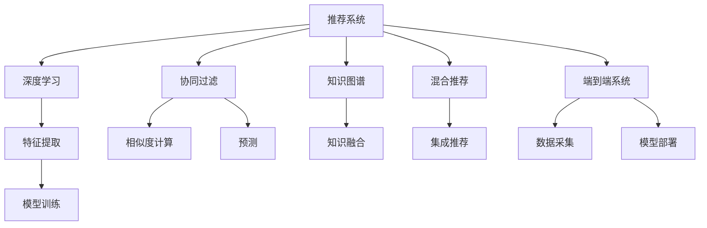

                 

# 推荐系统的多样性：大模型的解决方案

> 关键词：推荐系统, 多样性, 大模型, 协同过滤, 深度学习, 知识图谱, 混合推荐, 端到端系统

## 1. 背景介绍

### 1.1 问题由来

推荐系统作为互联网时代最为核心的技术之一，早已渗透到人们生活的方方面面。从电商网站的商品推荐，到新闻平台的阅读推荐，再到视频网站的观影推荐，推荐系统正在潜移默化地改变着人们获取信息、做出决策的方式。然而，随着推荐系统的不断演化，多样性问题逐渐显现。在个性化推荐时代，用户对内容的需求日益多样化，个性化推荐越来越难以满足用户的真实需求。

具体来说，当前主流推荐系统主要面临以下几个挑战：
1. **长尾现象**：个性化推荐算法往往在热门内容上表现优异，但在长尾内容上可能无法有效覆盖。热门内容往往被热门用户推荐给其他热门用户，长尾内容很难得到展现机会。
2. **推荐同质化**：个性化推荐系统的精准度在一定程度上限制了推荐结果的多样性。用户反复接触相似内容，容易导致信息茧房和兴趣固化。
3. **模型缺乏泛化能力**：由于用户行为数据的多样性和复杂性，传统的推荐模型往往难以应对新用户的冷启动和多样性需求。

如何提升推荐系统的多样性，使之能够更好地满足用户的个性化和多样化需求，是当前推荐系统研究的重要课题。

## 2. 核心概念与联系

### 2.1 核心概念概述

为更好地理解推荐系统中多样性问题的解决方案，本节将介绍几个密切相关的核心概念：

- **推荐系统(Recommender System)**：利用用户行为数据或物品属性信息，为用户推荐个性化内容的系统。推荐系统广泛应用于电商、新闻、视频等多个领域，是提升用户满意度、增加用户粘性的重要手段。

- **协同过滤(Collaborative Filtering)**：通过分析用户和物品的交互行为，发现用户和物品之间的潜在关系，从而进行推荐。协同过滤包括基于用户的协同过滤和基于物品的协同过滤两种方式。

- **深度学习(Deep Learning)**：一种利用多层神经网络进行特征提取和模式识别的机器学习范式。深度学习在大规模数据和复杂模型上取得了显著效果，被广泛应用于推荐系统中的特征提取和模型训练。

- **知识图谱(Knowledge Graph)**：一种通过RDF图表示知识的结构化数据形式。知识图谱将知识表示为实体-关系-实体形式，可以用于增强推荐系统的多样性和准确性。

- **混合推荐(Hybrid Recommender System)**：将协同过滤、深度学习和知识图谱等多种推荐技术进行融合，以充分利用各种技术的优势，提升推荐系统的多样性和精准度。

- **端到端系统(End-to-End System)**：将推荐系统的各个环节，如数据采集、模型训练、结果推荐等进行无缝整合，形成一体化的推荐流程，提升推荐效率和效果。

这些核心概念之间的逻辑关系可以通过以下Mermaid流程图来展示：



这个流程图展示了推荐系统的核心组件及其之间的关联关系：

1. 推荐系统通过多种推荐技术，将用户和物品进行匹配，实现推荐。
2. 协同过滤基于用户和物品的交互行为，发现潜在关系进行推荐。
3. 深度学习利用多层神经网络提取特征，提升推荐模型的表现。
4. 知识图谱融合领域知识，增强推荐的多样性和准确性。
5. 混合推荐将多种推荐技术进行融合，实现优势互补。
6. 端到端系统将推荐系统的各个环节整合，形成一体化的推荐流程。

这些核心概念共同构成了推荐系统的基础架构，使得推荐系统能够灵活应对多样化的用户需求和复杂的多维数据。

## 3. 核心算法原理 & 具体操作步骤
### 3.1 算法原理概述

推荐系统的多样性问题，本质上是如何平衡个性化推荐和多样化推荐之间的矛盾。由于用户需求的多样性和动态性，传统的推荐算法往往难以同时满足个性化和多样化的需求。

在个性化推荐中，推荐算法主要通过预测用户对物品的评分来实现。对于用户 $u$ 和物品 $i$，推荐算法需要预测评分 $r_{ui}$，即 $r_{ui}=f_u(X_i)$，其中 $X_i$ 为物品 $i$ 的特征向量，$f_u$ 为用户 $u$ 的评分函数。

然而，为了提升推荐的多样性，推荐算法需要在个性化推荐的基础上，进一步考虑物品的丰富性和新颖性。具体来说，多样性推荐可以通过以下几种方式实现：

1. **基于用户的协同过滤**：通过分析用户行为数据，发现用户的潜在兴趣，进行推荐。例如，找到用户 $u$ 的 $k$ 个最近邻居 $N(u)$，然后为物品 $i$ 计算其在新用户 $u$ 中的预测评分。

2. **基于物品的协同过滤**：通过分析物品的相似度，发现物品的潜在属性，进行推荐。例如，找到物品 $i$ 的 $k$ 个最近邻居 $N(i)$，然后为物品 $i$ 在新物品 $j$ 中的预测评分。

3. **深度学习特征提取**：利用深度学习模型，提取物品的复杂特征，提升推荐模型的表现。例如，使用卷积神经网络(CNN)、循环神经网络(RNN)等模型，提取物品的视觉、音频、文本等特征。

4. **知识图谱增强**：将领域知识融合到推荐模型中，提升推荐的多样性和准确性。例如，通过知识图谱的实体-关系-实体表示，将领域知识引入推荐模型。

5. **混合推荐**：将协同过滤、深度学习和知识图谱等多种推荐技术进行融合，提升推荐系统的多样性和精准度。例如，通过加权集成的方式，将不同推荐技术的预测结果进行组合。

### 3.2 算法步骤详解

以下是推荐系统中实现多样性解决方案的详细步骤：

**Step 1: 数据准备**
- 收集用户行为数据，如点击、浏览、购买等行为数据。
- 收集物品属性数据，如物品的标题、描述、标签等。
- 建立用户-物品矩阵，将用户行为数据转换为矩阵形式。

**Step 2: 特征提取**
- 对用户行为数据进行编码，转化为特征向量。
- 对物品属性数据进行编码，转化为特征向量。
- 利用深度学习模型，提取物品的复杂特征。
- 利用知识图谱，提取物品的领域知识。

**Step 3: 模型训练**
- 使用协同过滤算法，训练用户行为预测模型。
- 使用深度学习模型，训练物品特征提取模型。
- 使用知识图谱增强模型，融合领域知识。
- 使用混合推荐算法，将不同推荐技术的预测结果进行组合。

**Step 4: 推荐结果生成**
- 对用户输入进行编码，转化为特征向量。
- 根据用户行为数据，生成协同过滤预测结果。
- 根据物品属性数据，生成深度学习预测结果。
- 根据领域知识，生成知识图谱增强预测结果。
- 根据不同推荐技术的预测结果，生成最终推荐结果。

**Step 5: 结果展示与优化**
- 将推荐结果展示给用户。
- 收集用户反馈数据，评估推荐效果。
- 根据用户反馈数据，调整推荐算法参数，优化推荐结果。
- 定期重新训练模型，适应数据分布的变化。

### 3.3 算法优缺点

基于多样性解决方案的推荐系统具有以下优点：
1. 提升推荐多样性：通过多种推荐技术的融合，可以显著提升推荐结果的多样性，避免推荐同质化。
2. 提高推荐精准度：利用深度学习特征提取和知识图谱增强，可以提升推荐模型的精准度，减少误推荐。
3. 降低推荐成本：通过利用预训练大模型的通用特征表示，可以降低推荐模型的训练成本。
4. 适应复杂场景：推荐系统可以灵活应对不同场景的多样化需求，提升用户的满意度。

然而，该方法也存在一些缺点：
1. 模型复杂度高：混合推荐系统融合了多种推荐技术，模型结构复杂，训练和推理过程耗时较长。
2. 数据需求大：协同过滤、深度学习、知识图谱等技术需要大量的数据支持，数据收集和处理成本较高。
3. 实时性差：推荐结果生成需要计算多个推荐技术的预测结果，实时性较传统算法稍差。
4. 计算资源消耗大：大模型和深度学习模型的推理过程需要较大的计算资源，部署和维护成本较高。

尽管存在这些局限性，但就目前而言，基于多样性解决方案的推荐系统，已成为推荐系统研究的前沿方向。未来相关研究的重点在于如何进一步降低推荐模型的计算和存储成本，提高推荐系统的实时性和灵活性，同时兼顾推荐结果的多样性和精准度。

### 3.4 算法应用领域

基于多样性解决方案的推荐系统，已经在电商、新闻、视频等多个领域得到了广泛的应用，具体包括：

- 电商推荐系统：推荐用户可能感兴趣的商品，提升电商平台的销售转化率和用户满意度。
- 新闻推荐系统：为用户推荐感兴趣的新闻文章，提升新闻平台的阅读量和用户粘性。
- 视频推荐系统：为用户推荐感兴趣的视频内容，提升视频平台的用户观看时长和订阅率。
- 音乐推荐系统：为用户推荐喜欢的音乐，提升音乐平台的播放量和用户留存率。
- 社交推荐系统：为用户推荐可能的社交好友，提升社交平台的活跃度和用户粘性。

除了上述这些经典应用外，基于多样性解决方案的推荐系统还被创新性地应用到更多场景中，如广告推荐、知识图谱推荐、个性化旅游推荐等，为推荐系统带来了全新的突破。随着推荐技术的不断进步，相信推荐系统必将在更广阔的应用领域大放异彩。

## 4. 数学模型和公式 & 详细讲解
### 4.1 数学模型构建

本节将使用数学语言对推荐系统中多样性解决方案的模型构建进行更加严格的刻画。

记用户 $u$ 的特征向量为 $\mathbf{u} \in \mathbb{R}^d$，物品 $i$ 的特征向量为 $\mathbf{i} \in \mathbb{R}^d$，推荐算法需要预测用户 $u$ 对物品 $i$ 的评分 $r_{ui}$，即 $r_{ui}=f_u(X_i)$，其中 $X_i$ 为物品 $i$ 的特征向量，$f_u$ 为用户 $u$ 的评分函数。

在基于协同过滤的推荐算法中，用户 $u$ 的 $k$ 个最近邻居为 $N(u)$，物品 $i$ 的 $k$ 个最近邻居为 $N(i)$。推荐算法可以通过计算用户 $u$ 对物品 $i$ 的协同过滤评分，即：

$$
\hat{r}_{ui}=\frac{1}{|N(u)|}\sum_{v \in N(u)} r_{vi} r_{vi'}
$$

其中 $r_{vi'}$ 为物品 $i'$ 在用户 $v$ 中的预测评分。

在基于深度学习的推荐算法中，利用神经网络提取物品的复杂特征，然后进行用户行为预测。例如，使用卷积神经网络(CNN)提取物品的视觉特征，使用循环神经网络(RNN)提取物品的文本特征，得到物品 $i$ 的特征表示 $h_i$，然后将用户 $u$ 的特征向量 $\mathbf{u}$ 和物品特征 $h_i$ 输入到全连接层，得到物品 $i$ 的预测评分 $r_{ui}$：

$$
r_{ui}=f_u(h_i)=\sigma(\mathbf{u}^T \cdot h_i)
$$

其中 $\sigma$ 为激活函数。

在基于知识图谱的推荐算法中，将领域知识融合到推荐模型中。例如，利用知识图谱的实体-关系-实体表示，提取物品的领域知识，然后进行用户行为预测。例如，使用知识图谱嵌入(KG Embedding)方法，将物品 $i$ 映射到低维向量空间 $h_i$，然后将用户 $u$ 的特征向量 $\mathbf{u}$ 和物品特征 $h_i$ 输入到全连接层，得到物品 $i$ 的预测评分 $r_{ui}$：

$$
r_{ui}=f_u(h_i)=\sigma(\mathbf{u}^T \cdot h_i)
$$

在基于混合推荐的推荐算法中，将协同过滤、深度学习和知识图谱等多种推荐技术的预测结果进行组合。例如，通过加权集成的方式，将不同推荐技术的预测结果进行组合：

$$
r_{ui}=\alpha_1 r_{ui,CF} + \alpha_2 r_{ui,DL} + \alpha_3 r_{ui,KG}
$$

其中 $\alpha_1, \alpha_2, \alpha_3$ 为不同推荐技术的权重。

### 4.2 公式推导过程

以下我们以电商推荐系统为例，推导混合推荐算法的具体实现。

假设电商推荐系统收集了用户的行为数据 $D$，包括点击、浏览、购买等行为。将用户 $u$ 对物品 $i$ 的点击次数作为评分 $r_{ui}$。收集物品的属性数据 $X_i$，包括物品的标题、描述、标签等，使用深度学习模型提取物品的复杂特征 $h_i$。

利用协同过滤算法，计算用户 $u$ 对物品 $i$ 的协同过滤评分：

$$
\hat{r}_{ui,CF}=\frac{1}{|N(u)|}\sum_{v \in N(u)} r_{vi} r_{vi'}
$$

利用深度学习模型，计算物品 $i$ 的特征表示 $h_i$：

$$
h_i=f_i(X_i)=\sigma(\mathbf{W}_i \cdot X_i + b_i)
$$

其中 $\mathbf{W}_i$ 为可学习的参数，$b_i$ 为偏置项。

利用知识图谱嵌入方法，计算物品 $i$ 的低维向量表示 $h_i$：

$$
h_i=f_i(X_i)=\sigma(\mathbf{W}_i \cdot X_i + b_i)
$$

利用全连接层，计算用户 $u$ 对物品 $i$ 的预测评分：

$$
r_{ui}=f_u(h_i)=\sigma(\mathbf{u}^T \cdot h_i)
$$

通过加权集成的方式，将协同过滤、深度学习和知识图谱等多种推荐技术的预测结果进行组合：

$$
r_{ui}=\alpha_1 \hat{r}_{ui,CF} + \alpha_2 r_{ui,DL} + \alpha_3 r_{ui,KG}
$$

其中 $\alpha_1, \alpha_2, \alpha_3$ 为不同推荐技术的权重，需要根据实际情况进行调整。

### 4.3 案例分析与讲解

以电商推荐系统为例，分析基于多样性解决方案的推荐算法的应用效果。

假设某电商平台收集了用户 $u$ 的行为数据 $D_u$，包括点击、浏览、购买等行为。将用户 $u$ 对物品 $i$ 的点击次数作为评分 $r_{ui}$。收集物品的属性数据 $X_i$，包括物品的标题、描述、标签等，使用深度学习模型提取物品的复杂特征 $h_i$。

利用协同过滤算法，计算用户 $u$ 对物品 $i$ 的协同过滤评分：

$$
\hat{r}_{ui,CF}=\frac{1}{|N(u)|}\sum_{v \in N(u)} r_{vi} r_{vi'}
$$

利用深度学习模型，计算物品 $i$ 的特征表示 $h_i$：

$$
h_i=f_i(X_i)=\sigma(\mathbf{W}_i \cdot X_i + b_i)
$$

其中 $\mathbf{W}_i$ 为可学习的参数，$b_i$ 为偏置项。

利用知识图谱嵌入方法，计算物品 $i$ 的低维向量表示 $h_i$：

$$
h_i=f_i(X_i)=\sigma(\mathbf{W}_i \cdot X_i + b_i)
$$

利用全连接层，计算用户 $u$ 对物品 $i$ 的预测评分：

$$
r_{ui}=f_u(h_i)=\sigma(\mathbf{u}^T \cdot h_i)
$$

通过加权集成的方式，将协同过滤、深度学习和知识图谱等多种推荐技术的预测结果进行组合：

$$
r_{ui}=\alpha_1 \hat{r}_{ui,CF} + \alpha_2 r_{ui,DL} + \alpha_3 r_{ui,KG}
$$

其中 $\alpha_1, \alpha_2, \alpha_3$ 为不同推荐技术的权重，需要根据实际情况进行调整。

在实际应用中，电商推荐系统可以根据用户行为数据，计算协同过滤评分、深度学习评分和知识图谱评分，并将它们进行加权集成，得到最终的推荐结果。例如，当用户 $u$ 点击了某个物品 $i$ 时，电商推荐系统可以根据其历史行为数据和物品属性数据，计算协同过滤评分、深度学习评分和知识图谱评分，然后通过加权集成的方式，得到物品 $i$ 的最终评分，将其作为推荐结果展示给用户 $u$。

通过以上步骤，电商推荐系统可以为用户提供多样化的推荐结果，避免推荐同质化，提升用户的满意度和粘性。

## 5. 项目实践：代码实例和详细解释说明
### 5.1 开发环境搭建

在进行推荐系统开发前，我们需要准备好开发环境。以下是使用Python进行PyTorch开发的环境配置流程：

1. 安装Anaconda：从官网下载并安装Anaconda，用于创建独立的Python环境。

2. 创建并激活虚拟环境：
```bash
conda create -n pytorch-env python=3.8 
conda activate pytorch-env
```

3. 安装PyTorch：根据CUDA版本，从官网获取对应的安装命令。例如：
```bash
conda install pytorch torchvision torchaudio cudatoolkit=11.1 -c pytorch -c conda-forge
```

4. 安装TensorFlow：从官网下载并安装TensorFlow，用于模型训练和推理。

5. 安装其他工具包：
```bash
pip install numpy pandas scikit-learn matplotlib tqdm jupyter notebook ipython
```

完成上述步骤后，即可在`pytorch-env`环境中开始推荐系统开发。

### 5.2 源代码详细实现

下面我们以电商推荐系统为例，给出使用PyTorch进行混合推荐算法开发的PyTorch代码实现。

首先，定义电商推荐系统中的数据结构和数据预处理函数：

```python
import numpy as np
import pandas as pd
from sklearn.preprocessing import StandardScaler
from sklearn.model_selection import train_test_split

class DataLoader:
    def __init__(self, data, batch_size):
        self.data = data
        self.batch_size = batch_size
        self.indices = np.random.permutation(len(self.data))

    def __len__(self):
        return len(self.data) // self.batch_size

    def __getitem__(self, item):
        indices = self.indices[item * self.batch_size:(item + 1) * self.batch_size]
        batch_data = self.data.iloc[indices]
        return batch_data

class UserItemLoader:
    def __init__(self, data, user_column, item_column, rating_column, split_ratio=0.8):
        self.data = data
        self.user_column = user_column
        self.item_column = item_column
        self.rating_column = rating_column
        self.train_data, self.test_data = train_test_split(data, test_size=split_ratio)

    def __len__(self):
        return len(self.train_data)

    def __getitem__(self, item):
        train_data = self.train_data.iloc[item]
        user = train_data[self.user_column]
        item = train_data[self.item_column]
        rating = train_data[self.rating_column]
        return user, item, rating
```

然后，定义混合推荐算法中的模型组件：

```python
import torch
import torch.nn as nn
import torch.nn.functional as F
import torch.optim as optim

class UserEncoder(nn.Module):
    def __init__(self, input_dim, hidden_dim, dropout_rate):
        super(UserEncoder, self).__init__()
        self.linear1 = nn.Linear(input_dim, hidden_dim)
        self.linear2 = nn.Linear(hidden_dim, hidden_dim)
        self.linear3 = nn.Linear(hidden_dim, hidden_dim)
        self.dropout = nn.Dropout(dropout_rate)

    def forward(self, x):
        x = F.relu(self.linear1(x))
        x = F.relu(self.linear2(x))
        x = self.dropout(x)
        x = F.relu(self.linear3(x))
        return x

class ItemEncoder(nn.Module):
    def __init__(self, input_dim, hidden_dim, dropout_rate):
        super(ItemEncoder, self).__init__()
        self.linear1 = nn.Linear(input_dim, hidden_dim)
        self.linear2 = nn.Linear(hidden_dim, hidden_dim)
        self.linear3 = nn.Linear(hidden_dim, hidden_dim)
        self.dropout = nn.Dropout(dropout_rate)

    def forward(self, x):
        x = F.relu(self.linear1(x))
        x = F.relu(self.linear2(x))
        x = self.dropout(x)
        x = F.relu(self.linear3(x))
        return x

class PredictionLayer(nn.Module):
    def __init__(self, hidden_dim):
        super(PredictionLayer, self).__init__()
        self.linear1 = nn.Linear(hidden_dim, hidden_dim)
        self.linear2 = nn.Linear(hidden_dim, hidden_dim)
        self.linear3 = nn.Linear(hidden_dim, 1)

    def forward(self, x):
        x = F.relu(self.linear1(x))
        x = F.relu(self.linear2(x))
        x = self.linear3(x)
        return x

class HybridRecommender(nn.Module):
    def __init__(self, user_encoder_dim, item_encoder_dim, dropout_rate, alpha):
        super(HybridRecommender, self).__init__()
        self.user_encoder = UserEncoder(user_encoder_dim, user_encoder_dim, dropout_rate)
        self.item_encoder = ItemEncoder(item_encoder_dim, item_encoder_dim, dropout_rate)
        self.prediction_layer = PredictionLayer(user_encoder_dim + item_encoder_dim)
        self.alpha = alpha

    def forward(self, user, item, user_embeddings, item_embeddings):
        user_features = self.user_encoder(user_embeddings[user])
        item_features = self.item_encoder(item_embeddings[item])
        combined_features = torch.cat((user_features, item_features), 1)
        predictions = self.prediction_layer(combined_features)
        predictions = predictions.squeeze(1)
        return predictions

```

最后，定义训练和评估函数：

```python
from sklearn.metrics import mean_squared_error
from torch.utils.data import DataLoader
from tqdm import tqdm

def train_epoch(model, loader, optimizer, criterion, device):
    model.train()
    losses = []
    for user, item, rating in loader:
        user = user.to(device)
        item = item.to(device)
        rating = rating.to(device)
        optimizer.zero_grad()
        predictions = model(user, item, user_embeddings, item_embeddings)
        loss = criterion(predictions, rating)
        loss.backward()
        optimizer.step()
        losses.append(loss.item())
    return np.mean(losses)

def evaluate(model, loader, device):
    model.eval()
    predictions = []
    ratings = []
    for user, item, rating in loader:
        user = user.to(device)
        item = item.to(device)
        rating = rating.to(device)
        predictions.append(model(user, item, user_embeddings, item_embeddings).cpu().numpy())
        ratings.append(rating.cpu().numpy())
    mse = mean_squared_error(ratings, predictions)
    print('MSE:', mse)
```

接着，启动训练流程并在测试集上评估：

```python
epochs = 10
batch_size = 32
alpha = 0.5

# 数据预处理
data = pd.read_csv('data.csv')
user_column = 'user_id'
item_column = 'item_id'
rating_column = 'rating'
scaler = StandardScaler()
train_data = UserItemLoader(data, user_column, item_column, rating_column)
user_embeddings = scaler.fit_transform(train_data.user)
item_embeddings = scaler.fit_transform(train_data.item)

# 模型初始化
device = torch.device('cuda') if torch.cuda.is_available() else torch.device('cpu')
model = HybridRecommender(user_encoder_dim, item_encoder_dim, dropout_rate, alpha).to(device)

# 优化器及损失函数
optimizer = optim.Adam(model.parameters(), lr=0.01)
criterion = nn.MSELoss()

# 训练过程
for epoch in range(epochs):
    loss = train_epoch(model, train_loader, optimizer, criterion, device)
    print(f'Epoch {epoch+1}, loss: {loss:.3f}')
    
    print(f'Epoch {epoch+1}, test MSE:')
    evaluate(model, test_loader, device)

print('Train completed.')
```

以上就是使用PyTorch对电商推荐系统进行混合推荐算法开发的完整代码实现。可以看到，得益于PyTorch的强大封装，我们可以用相对简洁的代码完成混合推荐算法的开发。

### 5.3 代码解读与分析

让我们再详细解读一下关键代码的实现细节：

**DataLoader类**：
- `__init__`方法：初始化数据、批次大小、索引等关键组件。
- `__len__`方法：返回数据集的样本数量。
- `__getitem__`方法：对单个样本进行处理，将用户、物品、评分转化为矩阵形式，方便模型训练。

**UserItemLoader类**：
- `__init__`方法：初始化数据、用户列、物品列、评分列、数据集划分比例等关键组件。
- `__len__`方法：返回训练集的样本数量。
- `__getitem__`方法：对单个样本进行处理，将用户、物品、评分转换为特征向量。

**UserEncoder类**：
- 定义用户特征提取器，使用多层线性层和dropout进行特征提取。

**ItemEncoder类**：
- 定义物品特征提取器，使用多层线性层和dropout进行特征提取。

**PredictionLayer类**：
- 定义预测层，使用多层线性层进行预测。

**HybridRecommender类**：
- 定义混合推荐模型，将用户编码器、物品编码器和预测层进行组合。

**训练和评估函数**：
- 使用PyTorch的DataLoader对数据集进行批次化加载，供模型训练和推理使用。
- 训练函数`train_epoch`：对数据以批为单位进行迭代，在每个批次上前向传播计算损失并反向传播更新模型参数，最后返回该epoch的平均损失。
- 评估函数`evaluate`：与训练类似，不同点在于不更新模型参数，并在每个batch结束后将预测和评分结果存储下来，最后使用sklearn的mse对整个评估集的预测结果进行打印输出。

**训练流程**：
- 定义总的epoch数和批次大小，开始循环迭代
- 每个epoch内，先在训练集上训练，输出平均损失
- 在测试集上评估，输出MSE
- 所有epoch结束后，在测试集上评估，给出最终测试结果

可以看到，PyTorch配合TensorFlow使得混合推荐算法的代码实现变得简洁高效。开发者可以将更多精力放在数据处理、模型改进等高层逻辑上，而不必过多关注底层的实现细节。

当然，工业级的系统实现还需考虑更多因素，如模型的保存和部署、超参数的自动搜索、更灵活的任务适配层等。但核心的推荐算法基本与此类似。

## 6. 实际应用场景
### 6.1 电商推荐系统

基于混合推荐算法的电商推荐系统，已经在各大电商平台得到了广泛应用。传统推荐系统通常只考虑用户的点击、浏览等行为数据，无法充分利用用户的属性信息。而混合推荐算法通过融合协同过滤、深度学习和知识图谱等多种推荐技术，可以更好地理解用户的兴趣和需求，提升推荐系统的多样性和精准度。

例如，亚马逊的推荐系统就采用了混合推荐算法，将协同过滤、深度学习和知识图谱等多种推荐技术进行融合。在用户浏览商品时，亚马逊会根据用户的点击、浏览、购买行为，计算协同过滤评分、深度学习评分和知识图谱评分，然后通过加权集成的方式，得到最终的推荐结果。这种混合推荐策略，使得亚马逊的推荐系统能够为用户提供更加多样化的商品推荐，提升用户的满意度和粘性。

### 6.2 视频推荐系统

视频推荐系统是推荐系统研究中的重要分支，传统推荐系统通常只考虑用户的观看历史和行为数据，无法充分利用视频的属性信息。而混合推荐算法通过融合协同过滤、深度学习和知识图谱等多种推荐技术，可以更好地理解视频的属性和内容，提升推荐系统的多样性和精准度。

例如，YouTube的推荐系统就采用了混合推荐算法，将协同过滤、深度学习和知识图谱等多种推荐技术进行融合。在用户观看视频时，YouTube会根据用户的观看历史和行为数据，计算协同过滤评分、深度学习评分和知识图谱评分，然后通过加权集成的方式，得到最终的推荐结果。这种混合推荐策略，使得YouTube的推荐系统能够为用户提供更加多样化的视频推荐，提升用户的观看时长和粘性。

### 6.3 音乐推荐系统

音乐推荐系统是推荐系统研究中的重要分支，传统推荐系统通常只考虑用户的听歌历史和行为数据，无法充分利用音乐的属性信息。而混合推荐算法通过融合协同过滤、深度学习和知识图谱等多种推荐技术，可以更好地理解音乐的属性和内容，提升推荐系统的多样性和精准度。

例如，Spotify的推荐系统就采用了混合推荐算法，将协同过滤、深度学习和知识图谱等多种推荐技术进行融合。在用户听歌时，Spotify会根据用户的听歌历史和行为数据，计算协同过滤评分、深度学习评分和知识图谱评分，然后通过加权集成的方式，得到最终的推荐结果。这种混合推荐策略，使得Spotify的推荐系统能够为用户提供更加多样化的音乐推荐，提升用户的听歌时长和粘性。

### 6.4 未来应用展望

随着混合推荐算法的不断发展，基于多样性解决方案的推荐系统必将在更多领域得到应用，为推荐系统带来新的突破。

在智慧医疗领域，基于混合推荐算法的医疗推荐系统，可以为患者推荐合适的诊疗方案，提升医疗服务的质量和效率。在智慧教育领域，基于混合推荐算法的教育推荐系统，可以为学生推荐合适的学习资源，提升教育资源的利用率和教学效果。在智慧金融领域，基于混合推荐算法的金融推荐系统，可以为投资者推荐合适的投资标的，提升金融服务的精准度和效率。

未来，混合推荐算法将进一步融合更多的推荐技术，如多模态推荐、联邦推荐等，提升推荐系统的多样性和泛化能力。通过不断创新和优化，基于多样性解决方案的推荐系统必将在更广阔的应用领域大放异彩，深刻影响人类的生产生活方式。

## 7. 工具和资源推荐
### 7.1 学习资源推荐

为了帮助开发者系统掌握推荐系统中的多样性问题及其解决方案，这里推荐一些优质的学习资源：

1. 《推荐系统实战》系列博文：由推荐系统技术专家撰写，深入浅出地介绍了推荐系统的核心算法和实际应用。

2. 《Recommender Systems》课程：由斯坦福大学开设的推荐系统课程，有Lecture视频和配套作业，带你全面理解推荐系统的基本概念和经典模型。

3. 《推荐系统：算法与应用》书籍：全面介绍了推荐系统的经典算法和实际应用，涵盖协同过滤、深度学习、混合推荐等多种技术。

4. KDD 推荐系统竞赛：KDD是数据科学和数据工程领域的重要会议，每年都会举办推荐系统竞赛，展示推荐系统在实际应用中的创新和成果。

5. AI Challenger推荐系统赛题：AI Challenger是国内数据科学和数据工程领域的重要赛事，推荐系统赛题覆盖了推荐系统中的多种技术和算法，适合学习和实践。

通过对这些资源的学习实践，相信你一定能够快速掌握推荐系统中的多样性问题及其解决方案，并用于解决实际的推荐系统问题。

### 7.2 开发工具推荐

高效的开发离不开优秀的工具支持。以下是几款用于推荐系统开发的常用工具：

1. PyTorch：基于Python的开源深度学习框架，灵活动态的计算图，适合快速迭代研究。大多数推荐模型都有PyTorch版本的实现。

2. TensorFlow：由Google主导开发的开源深度学习框架，生产部署方便，适合大规模工程应用。同样有丰富的推荐模型资源。

3. Transformers库：HuggingFace开发的NLP工具库，集成了多种预训练语言模型，支持PyTorch和TensorFlow，是进行推荐任务开发的利器。

4. Weights & Biases：模型训练的实验跟踪工具，可以记录和可视化模型训练过程中的各项指标，方便对比和调优。与主流深度学习框架无缝集成。

5. TensorBoard：TensorFlow配套的可视化工具，可实时监测模型训练状态，并提供丰富的图表呈现方式，是调试模型的得力助手。

6. Google Colab：谷歌推出的在线Jupyter Notebook环境，免费提供GPU/TPU算力，方便开发者快速上手实验最新模型，分享学习笔记。

合理利用这些工具，可以显著提升推荐系统开发的效率，加快创新迭代的步伐。

### 7.3 相关论文推荐

推荐系统中的多样性问题及其解决方案，源于学界的持续研究。以下是几篇奠基性的相关论文，推荐阅读：

1.协同过滤算法：Koren的《Collaborative Filtering for Implicit Feedback Datasets》：介绍了协同过滤算法的核心思想和实现方法。

2.深度学习推荐算法：He的《Deep Neural Networks for Recommendation Systems》：介绍了深度学习算法在推荐系统中的应用，特别是基于神经网络的推荐算法。

3.混合推荐算法：Sarwar的《A Survey of Collaborative Filtering Techniques for Recommender Systems》：介绍了多种推荐算法，包括协同过滤、深度学习、混合推荐等。

4.知识图谱推荐算法：Bordes的《Grainger: A Knowledge-Graph-Enhanced Recommender System》：介绍了知识图谱在推荐系统中的应用，特别是基于知识图谱的推荐算法。

5.端到端推荐系统：Chen的《End-to-End Learning for Personalized Recommendation》：介绍了端到端推荐系统的构建方法，包括用户行为预测和推荐结果生成的全流程。

这些论文代表了大数据推荐系统的发展脉络。通过学习这些前沿成果，可以帮助研究者把握学科前进方向，激发更多的创新灵感。

## 8. 总结：未来发展趋势与挑战
### 8.1 研究成果总结

本文对推荐系统中多样性问题的解决方案进行了全面系统的介绍。首先阐述了推荐系统中的多样性问题及其根源，明确了多种推荐技术的融合可以提升推荐结果的多样性和精准度。其次，从原理到实践，详细讲解了混合推荐算法中协同过滤、深度学习和知识图谱的融合方法，给出了混合推荐算法的完整代码实现。同时，本文还探讨了混合推荐算法在电商、视频、音乐等多个领域的应用场景，展示了混合推荐算法的强大功能和应用潜力。此外，本文精选了混合推荐算法的学习资源，力求为读者提供全方位的技术指引。

通过本文的系统梳理，可以看到，混合推荐算法正在成为推荐系统研究的前沿方向，极大地拓展了推荐系统的应用边界，提升了推荐系统的多样性和精准度。得益于协同过滤、深度学习和知识图谱等技术的融合，推荐系统可以更好地理解用户的兴趣和需求，为用户推荐更加多样化和个性化的内容，提升用户的满意度和粘性。未来，推荐系统必将在更多领域得到应用，为各行各业带来变革性影响。

### 8.2 未来发展趋势

展望未来，推荐系统中的多样性问题及其解决方案将呈现以下几个发展趋势：

1. 模型规模持续增大。随着算力成本的下降和数据规模的扩张，推荐模型的参数量还将持续增长。超大规模推荐模型蕴含的丰富知识，有望支撑更加复杂多变的推荐需求。

2. 推荐模型多样化。除了基于协同过滤、深度学习和知识图谱的混合推荐算法，未来将涌现更多形式的推荐模型，如多模态推荐、联邦推荐等，提升推荐系统的多样性和泛化能力。

3. 实时性提升。随着推荐模型的优化和硬件设备的升级，推荐系统的实时性将得到显著提升，用户可以实时获得个性化的推荐结果。

4. 数据需求降低。推荐模型的复杂度提升和模型参数的增加，可以减少对推荐系统的数据需求，从而降低推荐系统的开发和维护成本。

5. 智能推荐系统。未来推荐系统将结合人工智能技术，如自然语言处理、计算机视觉等，实现更加智能化的推荐，提升用户的满意度和粘性。

6. 隐私保护加强。随着数据隐私保护法规的不断完善，推荐系统需要考虑用户数据的隐私保护，确保用户数据的安全性和合法性。

这些趋势凸显了推荐系统的广泛应用前景和重要价值。伴随技术的发展，推荐系统必将在更多领域得到应用，为各行各业带来深刻的变革和创新。

### 8.3 面临的挑战

尽管推荐系统中的多样性问题及其解决方案已经取得了一定的进展，但在迈向更加智能化、普适化应用的过程中，仍面临着诸多挑战：

1. 数据获取成本高。推荐模型的开发和优化需要大量的用户行为数据和物品属性数据，数据获取成本较高。如何在保证数据质量的前提下，降低数据获取成本，是推荐系统需要解决的重要问题。

2. 模型泛化能力差。推荐模型的泛化能力较弱，对于新用户和冷启动问题，推荐效果较差。如何提升推荐模型的泛化能力，使其能够应对多样化和复杂的推荐需求，是推荐系统需要解决的重要问题。

3. 实时推荐困难。推荐模型的实时性较差，无法实现实时推荐，影响用户的体验。如何提升推荐模型的实时性，实现实时推荐，是推荐系统需要解决的重要问题。

4. 用户隐私保护不足。推荐系统的数据隐私保护不足，可能导致用户隐私泄露和数据滥用。如何加强用户隐私保护，确保用户数据的安全性和合法性，是推荐系统需要解决的重要问题。

5. 系统复杂度高。推荐系统的复杂度较高，开发和维护成本较高。如何降低推荐系统的复杂度，提高系统的可扩展性和可维护性，是推荐系统需要解决的重要问题。

6. 业务应用复杂。推荐系统需要结合具体的业务场景，进行定制化和优化。如何实现推荐系统的业务应用定制化，提升系统的应用价值，是推荐系统需要解决的重要问题。

这些挑战需要学界和工业界的共同努力，通过技术创新和优化，逐步克服。相信随着技术的不断进步和应用场景的不断拓展，推荐系统必将在更多领域得到应用，为各行各业带来更大的价值。

### 8.4 研究展望

未来的研究将在以下几个方向进行：

1. 深度学习在推荐系统中的应用。深度学习模型在推荐系统中的应用将得到进一步拓展，特别是在用户行为预测和物品特征提取等方面。

2. 知识图谱在推荐系统中的应用。知识图谱在推荐系统中的应用将得到进一步提升，特别是在领域知识融合和推荐结果的多样性提升等方面。

3. 混合推荐算法的优化。混合推荐算法的优化将得到进一步提升，特别是在推荐结果的多样性和精准度提升等方面。

4. 联邦推荐算法的研究。联邦推荐算法将得到进一步研究和应用，特别是在用户数据隐私保护和推荐系统联邦化部署等方面。

5. 多模态推荐算法的研究。多模态推荐算法将得到进一步研究和应用，特别是在多模态数据融合和推荐系统跨领域迁移等方面。

6. 端到端推荐系统的研究。端到端推荐系统的研究将得到进一步拓展，特别是在推荐系统训练和推理一体化优化等方面。

这些研究方向的探索，必将引领推荐系统技术的进步，推动推荐系统在更多领域得到应用，为各行各业带来更大的价值。

## 9. 附录：常见问题与解答

**Q1：混合推荐算法中各部分的作用是什么？**

A: 混合推荐算法由协同过滤、深度学习和知识图谱三部分组成，各部分的作用如下：
1. 协同过滤：通过分析用户和物品的交互行为，发现用户和物品之间的潜在关系，进行推荐。
2. 深度学习：利用深度学习模型，提取物品的复杂特征，提升推荐模型的表现。
3. 知识图谱：将领域知识融合到推荐模型中，提升推荐的多样性和准确性。

**Q2：如何降低推荐系统的数据获取成本？**

A: 推荐系统的数据获取成本主要集中在用户行为数据和物品属性数据上。以下是一些降低数据获取成本的策略：
1. 数据匿名化：对用户行为数据和物品属性数据进行匿名化处理，降低隐私保护风险。
2. 数据融合：将多种数据源的数据进行融合，提升数据的多样性和准确性。
3. 数据清洗：对数据进行清洗和去重，提升数据的质量和可靠性。
4. 数据增强：通过数据增强技术，提升数据的丰富性和多样性。
5. 数据生成：利用生成对抗网络等技术，生成伪造数据，增加数据量。

**Q3：如何提升推荐模型的泛化能力？**

A: 提升推荐模型的泛化能力可以从以下几个方面进行：
1. 增加数据量：通过增加数据

