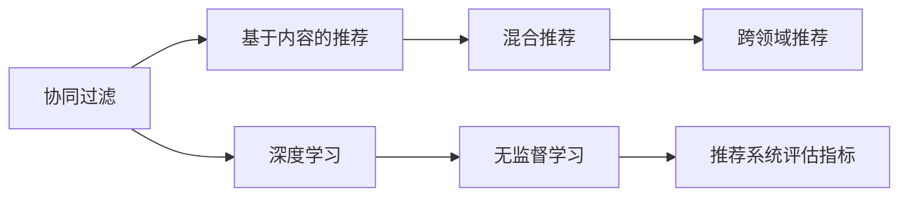

                 

# 推荐系统的局限与挑战：过拟合、偏见与多样性

## 1. 背景介绍

### 1.1 推荐系统的演进历程
推荐系统是现代信息系统中最重要的组件之一，其目的是从庞大的数据中识别用户潜在的兴趣，并将最合适的信息推荐给用户。从最初的基于规则的推荐、基于内容的推荐到近期的基于协同过滤的推荐，推荐系统的设计理念和技术路线一直在演进。

#### 1.1.1 基于规则的推荐
早期的推荐系统主要基于业务规则和专家知识，通过一定的逻辑计算确定推荐结果。这类推荐系统依赖于明确且准确的用户行为和产品属性，适合于产品种类较少，用户行为模式相对固定的场景。

#### 1.1.2 基于内容的推荐
基于内容的推荐系统通过分析用户喜欢的产品属性和行为特征，从而推荐相似的产品。这类系统适用于相似产品之间特征差异不大，用户兴趣和产品属性相关性强的场景。

#### 1.1.3 协同过滤推荐
协同过滤推荐系统主要分为基于用户的协同过滤和基于物品的协同过滤。前者通过计算用户间的相似度来推荐产品，后者则通过分析用户对相似产品的评价来推荐新物品。这类系统能够在用户产品种类丰富、用户行为多样化的场景中发挥重要作用。

#### 1.1.4 混合推荐系统
现代推荐系统多采用混合推荐的方式，综合利用多种推荐策略，提高推荐结果的准确性和鲁棒性。

### 1.2 推荐系统面临的挑战
随着互联网数据量的爆炸式增长，推荐系统在提升用户体验和增加收入方面发挥了重要作用。但同时，其在设计和应用中仍面临一系列挑战：

#### 1.2.1 数据稀疏性
推荐系统依赖于大量用户行为数据进行推荐，但很多用户可能只进行了少量的购买行为，导致数据稀疏。数据稀疏性会导致推荐算法难以准确地预测用户的行为和兴趣。

#### 1.2.2 冷启动问题
对于新用户和新产品，系统难以进行准确推荐。需要额外设计方法来解决新用户和产品的冷启动问题。

#### 1.2.3 多样性和个性化
如何平衡推荐结果的个性化和多样性，避免推荐过多类似的产品，忽视长尾产品的机会。

#### 1.2.4 可解释性和透明度
推荐系统的复杂性增加了模型的可解释性和透明度的需求。用户越来越关心推荐背后的依据和逻辑，希望获得透明的推荐理由。

#### 1.2.5 偏见与公平性
推荐系统可能会存在数据偏见和算法偏见，导致推荐结果不公平，对特定用户群体造成负面影响。

## 2. 核心概念与联系

### 2.1 核心概念概述

推荐系统涉及多个核心概念，包括但不限于：

- 协同过滤(Collaborative Filtering)：基于用户行为或物品特征相似性进行推荐，是目前主流推荐算法之一。
- 基于内容的推荐(Content-Based Recommendation)：根据物品的属性特征推荐与用户兴趣匹配度高的物品。
- 混合推荐(Mixed Recommendation)：结合多种推荐方法，综合不同算法的优势，提供更加多样和准确的推荐。
- 深度学习(Deep Learning)：通过神经网络模型挖掘数据中的隐含特征，提高推荐结果的准确性。
- 跨领域推荐(Cross-Domain Recommendation)：利用不同领域的数据进行推荐，拓宽推荐系统的边界。
- 无监督学习(Unsupervised Learning)：使用无标注数据进行推荐，适用于推荐空间广、数据稀疏的场景。
- 推荐系统评估指标(Evaluation Metrics)：用于衡量推荐结果的准确性和相关性，如召回率、准确率、F1-score等。

### 2.2 核心概念原理和架构的 Mermaid 流程图



### 2.3 核心概念之间的关系

协同过滤、基于内容的推荐、深度学习和无监督学习等技术构成了推荐系统的主要框架，并在其中相互结合。混合推荐则将这些方法融合，提供更加全面和多样化的推荐策略。跨领域推荐利用不同领域的数据，拓宽了推荐系统的应用范围。推荐系统评估指标则用于衡量推荐的准确性和多样性，指导算法的优化和改进。

## 3. 核心算法原理 & 具体操作步骤

### 3.1 算法原理概述

推荐系统的主要目标是通过数据分析挖掘用户的潜在兴趣，从而将最合适的信息推荐给用户。协同过滤和基于内容的推荐是常用的两种方法，其中协同过滤通过分析用户和物品间的相似性进行推荐，而基于内容的推荐则利用物品的特征和用户的历史行为进行推荐。深度学习通过神经网络模型挖掘数据中的隐含特征，提升推荐结果的准确性。

推荐系统一般分为两个步骤：

1. 数据预处理：包括用户数据、物品数据和用户行为数据的清洗、归一化等。
2. 模型训练和推荐：基于处理后的数据，训练推荐模型，并使用模型进行推荐。

### 3.2 算法步骤详解

推荐系统的具体算法步骤包括：

#### 3.2.1 数据预处理
- 清洗和处理缺失数据：填充缺失值或删除缺失值较多的样本。
- 特征工程：提取有意义的特征，如用户属性、物品属性、用户行为等。
- 数据标准化：归一化或标准化数据，避免不同特征之间的数量级差异。

#### 3.2.2 模型训练
- 选择合适的推荐算法，如协同过滤、深度学习、基于内容的推荐等。
- 设计模型架构，包括输入层、隐藏层和输出层等。
- 训练模型，调整超参数以优化模型性能。

#### 3.2.3 推荐过程
- 输入用户数据和物品数据到训练好的模型中。
- 使用模型计算预测结果，推荐最合适的物品。
- 将推荐结果输出给用户。

#### 3.2.4 系统评估
- 收集用户反馈，如点击率、购买率等。
- 使用推荐系统评估指标（如召回率、准确率等）评估推荐效果。
- 根据评估结果调整模型，优化推荐策略。

### 3.3 算法优缺点

#### 3.3.1 协同过滤推荐
- 优点：不需要物品属性信息，适用于数据稀疏场景。
- 缺点：计算复杂度高，容易出现冷启动问题，缺乏对新物品的推荐能力。

#### 3.3.2 基于内容的推荐
- 优点：基于物品属性信息进行推荐，适用于物品种类多、用户兴趣多样化的场景。
- 缺点：依赖于物品特征的有效性和用户历史行为，难以处理用户兴趣变化。

#### 3.3.3 深度学习推荐
- 优点：能够自动挖掘数据中的隐含特征，提高推荐结果的准确性。
- 缺点：计算量大，需要大量标注数据，模型难以解释。

#### 3.3.4 混合推荐
- 优点：结合多种推荐方法，综合不同算法的优势，提升推荐效果。
- 缺点：模型复杂度高，训练难度大。

### 3.4 算法应用领域

推荐系统广泛应用于电子商务、在线视频、社交网络等领域，为用户提供个性化、多样化的推荐服务。

#### 3.4.1 电子商务
推荐系统可以帮助电商平台精准推荐商品，提高销售转化率和用户满意度。

#### 3.4.2 在线视频
推荐系统为用户提供个性化的电影、电视剧推荐，增加平台的用户黏性和收入。

#### 3.4.3 社交网络
推荐系统根据用户行为和社交网络关系，推荐相关用户和内容，提高用户活跃度和平台粘性。

## 4. 数学模型和公式 & 详细讲解 & 举例说明

### 4.1 数学模型构建

推荐系统的数学模型可以分为基于用户的协同过滤和基于物品的协同过滤。这里以基于用户的协同过滤为例进行介绍。

设 $X$ 为用户集合，$Y$ 为物品集合，$U$ 为用户行为集合。根据用户行为 $u$ 和物品 $y$ 之间的评分 $r(u,y)$，推荐系统可以使用矩阵分解的方法进行建模。

设 $P$ 为用户行为矩阵，$P_{i,j}=r(i,j)$ 表示用户 $i$ 对物品 $j$ 的评分。$L$ 为低秩矩阵分解的目标，$R$ 为重建矩阵，$\lambda$ 为正则化系数。则推荐模型的目标函数为：

$$
L=\|P-R\|_F^2+\lambda\|R\|_F^2
$$

其中 $\|\cdot\|_F$ 为 Frobenius 范数，即矩阵中元素平方和的开方。

### 4.2 公式推导过程

矩阵分解模型的推导基于矩阵奇异值分解(SVD)的原理。设 $P$ 和 $R$ 分别为用户行为矩阵和低秩矩阵，$L$ 为目标函数。令 $P=U\Sigma V^T$，其中 $U$ 和 $V$ 为正交矩阵，$\Sigma$ 为对角矩阵。将 $P=U\Sigma V^T$ 代入目标函数 $L$ 中，得：

$$
L=\|U\Sigma V^T-R\|_F^2+\lambda\|R\|_F^2
$$

根据最小二乘法的原理，令 $U\Sigma V^T=R+\delta$，其中 $\delta$ 为误差矩阵。则：

$$
L=\|\delta\|_F^2+\lambda\|R\|_F^2
$$

求解 $L$ 最小值，可得：

$$
\delta=0 \quad \text{和} \quad R=U\Sigma V^T
$$

因此，目标函数简化为：

$$
L=\lambda\|U\Sigma V^T\|_F^2
$$

目标函数最小值条件为：

$$
\frac{\partial L}{\partial U}=\frac{\partial L}{\partial V}=\frac{\partial L}{\partial \Sigma}=0
$$

解以上方程，可得低秩矩阵分解的解为：

$$
U=U_{\text{svd}}\Sigma_{\text{svd}}V_{\text{svd}}^T
$$

其中 $U_{\text{svd}}$ 和 $V_{\text{svd}}$ 为奇异值分解矩阵 $P$ 的左、右奇异向量，$\Sigma_{\text{svd}}$ 为对角矩阵，包含奇异值。

### 4.3 案例分析与讲解

以某电商平台的用户行为数据为例，假设有一个 $n \times m$ 的用户行为矩阵 $P$，其中 $n$ 为用户数，$m$ 为商品数。我们希望使用矩阵分解方法进行用户行为预测，可以使用奇异值分解进行求解。

设 $P=U\Sigma V^T$，其中 $U$ 和 $V$ 分别为 $n \times k$ 和 $m \times k$ 矩阵，$\Sigma$ 为 $k \times k$ 矩阵。令 $k$ 为奇异值分解的维度。

1. 将用户行为矩阵 $P$ 进行奇异值分解，得到 $U$、$\Sigma$ 和 $V^T$。
2. 使用训练集数据 $P_{train}$ 计算奇异值 $\Sigma_{train}$ 和矩阵 $U_{train}$ 和 $V^T_{train}$。
3. 使用测试集数据 $P_{test}$ 进行预测，得到 $P_{pred}=U_{train}\Sigma_{train}V^T_{test}$。
4. 计算预测误差，使用均方误差（MSE）评估推荐系统的性能。

## 5. 项目实践：代码实例和详细解释说明

### 5.1 开发环境搭建

推荐系统开发通常使用 Python 作为编程语言，PyTorch 或 TensorFlow 作为深度学习框架。开发环境搭建如下：

1. 安装 Python 3.x 和相应的依赖库，如 NumPy、Pandas、scikit-learn 等。
2. 安装深度学习框架 PyTorch 或 TensorFlow，并配置相应的 GPU/TPU 环境。
3. 安装推荐系统相关的库，如 Surprise、PyLibRec 等。

### 5.2 源代码详细实现

下面以基于用户的协同过滤为例，使用 Surprise 库实现推荐系统的训练和推荐。

```python
from surprise import SVD
from surprise import Dataset
from surprise import Reader
from surprise import accuracy

# 定义数据集
reader = Reader(rating_scale=(1, 5))
data = Dataset.load_from_df(df, reader)

# 训练模型
algo = SVD()
algo.fit(data.build_full_trainset())

# 预测推荐结果
test_preds = algo.test(data.testset)

# 计算推荐精度
pred_auc = accuracy.accuracy(test_preds, data.testset)
print("推荐精度：", pred_auc)
```

### 5.3 代码解读与分析

代码中，我们使用 Surprise 库的 SVD 算法实现协同过滤推荐。首先，定义数据集并加载到 Surprise 中。然后，使用 SVD 算法训练模型，并使用测试集进行预测。最后，计算推荐精度。

推荐系统开发涉及多个关键步骤：

1. 数据预处理：清洗和处理缺失数据、归一化特征等。
2. 模型选择：选择适当的推荐算法，如协同过滤、基于内容的推荐等。
3. 模型训练：使用训练集数据训练推荐模型。
4. 推荐过程：使用模型对测试集进行推荐，输出推荐结果。
5. 系统评估：收集用户反馈，使用推荐系统评估指标评估推荐效果。

## 6. 实际应用场景

### 6.1 电商推荐

电商推荐系统根据用户的历史购买行为和浏览记录，推荐用户可能感兴趣的商品。通过优化推荐算法，电商推荐系统可以提高用户的购物体验和满意度。

### 6.2 视频推荐

视频推荐系统根据用户的观看历史和评分数据，推荐用户可能感兴趣的视频内容。通过推荐高质量视频，视频推荐系统可以提升平台的用户黏性和收入。

### 6.3 社交网络

社交网络推荐系统根据用户的社交关系和兴趣标签，推荐相关用户和内容。通过推荐与用户兴趣相符的内容，社交网络推荐系统可以提高用户活跃度和平台粘性。

### 6.4 未来应用展望

未来，推荐系统将在更多领域得到应用，为人类生活带来更智能、更个性化的体验。

1. 推荐系统将与其他技术融合，如知识图谱、自然语言处理等，提升推荐的准确性和多样性。
2. 推荐系统将利用跨领域数据，扩大推荐范围，增加推荐的多样性。
3. 推荐系统将通过深度学习、强化学习等技术，不断优化推荐策略，提高推荐效果。

## 7. 工具和资源推荐

### 7.1 学习资源推荐

1. 《推荐系统：基础与实践》一书：详细介绍了推荐系统的基本原理和应用，包括协同过滤、基于内容的推荐等。
2. Coursera 推荐系统课程：由斯坦福大学开设的推荐系统课程，涵盖推荐系统的理论和实践。
3. Kaggle 推荐系统竞赛：通过参加竞赛，学习推荐系统的优化和改进方法。
4. GitHub 推荐系统项目：学习其他开发者推荐系统的实现和优化方法。

### 7.2 开发工具推荐

1. Python：推荐系统开发的主流语言，拥有丰富的第三方库和工具。
2. PyTorch 和 TensorFlow：深度学习框架，适用于推荐系统的算法实现。
3. Surprise 和 PyLibRec：推荐系统开发库，提供了多种推荐算法的实现。
4. Scikit-learn：机器学习库，适用于数据预处理和特征工程。
5. TensorBoard：可视化工具，用于监控模型训练和评估。

### 7.3 相关论文推荐

1. "A Factorization Method for Predicting Ratings" 论文：介绍了协同过滤推荐系统的基本原理和实现方法。
2. "A Theoretical Analysis of Collaborative Filtering Algorithms" 论文：分析了协同过滤推荐系统的理论基础和优化方法。
3. "Personalized Top-N Recommendation via Matrix Factorization" 论文：详细介绍了矩阵分解推荐算法的实现和优化方法。

## 8. 总结：未来发展趋势与挑战

### 8.1 研究成果总结

推荐系统在电商、视频、社交网络等领域得到了广泛应用，显著提升了用户体验和平台收入。协同过滤、基于内容的推荐、混合推荐等技术不断优化，提高了推荐的准确性和多样性。

### 8.2 未来发展趋势

未来，推荐系统将在更多领域得到应用，为人类生活带来更智能、更个性化的体验。

1. 推荐系统将与其他技术融合，如知识图谱、自然语言处理等，提升推荐的准确性和多样性。
2. 推荐系统将利用跨领域数据，扩大推荐范围，增加推荐的多样性。
3. 推荐系统将通过深度学习、强化学习等技术，不断优化推荐策略，提高推荐效果。

### 8.3 面临的挑战

推荐系统在发展过程中面临诸多挑战，包括：

1. 数据稀疏性：推荐系统依赖于用户行为数据，但在数据稀疏情况下，推荐算法难以准确预测用户行为。
2. 冷启动问题：对于新用户和新产品，推荐算法难以进行准确推荐。
3. 多样性和个性化：如何在推荐结果中平衡个性化和多样性，避免推荐过多类似的产品。
4. 可解释性和透明度：推荐系统的复杂性增加了模型的可解释性和透明度的需求。
5. 偏见与公平性：推荐系统可能会存在数据偏见和算法偏见，导致推荐结果不公平。

### 8.4 研究展望

未来，推荐系统需要在数据处理、算法优化、模型透明性和公平性等方面进行深入研究。

1. 数据处理：通过数据增强、异构数据融合等方法，提高推荐系统的数据质量。
2. 算法优化：引入深度学习、强化学习等技术，提高推荐系统的准确性和多样性。
3. 模型透明性：提高推荐系统的可解释性，增强用户对推荐结果的理解和信任。
4. 公平性：通过数据处理和算法优化，消除推荐系统中的偏见，实现公平推荐。

推荐系统的发展需要多学科的交叉合作，共同推动推荐技术的不断进步，为人类的生活带来更加智能和美好的体验。

## 9. 附录：常见问题与解答

**Q1: 推荐系统如何处理数据稀疏性问题？**

A: 推荐系统通常使用数据稀疏性的处理策略：

1. 矩阵补全（Matrix Completion）：使用矩阵分解方法，填补缺失值。
2. 基于图的方法（Graph-Based Methods）：使用图结构表示用户和物品之间的关系，提高推荐效果。
3. 深度学习（Deep Learning）：通过神经网络模型挖掘隐含特征，减少数据稀疏性影响。

**Q2: 推荐系统如何处理冷启动问题？**

A: 推荐系统通常使用以下方法处理冷启动问题：

1. 基于内容的推荐：根据物品属性和用户兴趣进行推荐。
2. 基于社会网络的方法：利用用户社交关系进行推荐。
3. 协同过滤（Collaborative Filtering）：通过相似性度量，找到与新用户或物品相似的用户或物品进行推荐。
4. 混合推荐系统：结合多种推荐方法，综合不同算法的优势。

**Q3: 推荐系统如何平衡个性化和多样性？**

A: 推荐系统通常使用以下方法平衡个性化和多样性：

1. 多样性推荐：增加推荐结果的多样性，如基于随机森林、聚类等方法。
2. 多臂老虎机算法：通过探索和利用平衡，优化推荐结果的多样性和个性化。
3. 基于上下文的方法：考虑上下文信息，推荐更相关且多样化的结果。

**Q4: 推荐系统的可解释性如何实现？**

A: 推荐系统通常使用以下方法实现可解释性：

1. 模型透明性：使用简单的模型或可解释的算法，增强推荐结果的可解释性。
2. 特征重要性分析：通过特征重要性分析，帮助用户理解推荐结果的依据。
3. 用户反馈机制：通过用户反馈，不断优化推荐结果，提高推荐系统的透明度。

**Q5: 推荐系统的公平性如何保证？**

A: 推荐系统通常使用以下方法保证公平性：

1. 数据预处理：通过数据清洗和预处理，消除数据中的偏见。
2. 算法优化：通过公平性算法，优化推荐结果。
3. 用户反馈机制：通过用户反馈，不断优化推荐策略，减少偏见。

推荐系统需要多学科的交叉合作，共同推动推荐技术的不断进步，为人类的生活带来更加智能和美好的体验。

