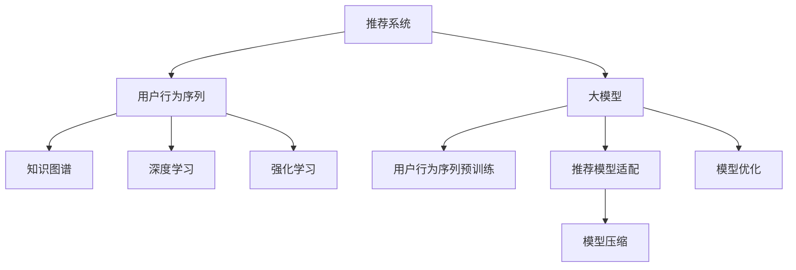

                 

# 推荐系统的统一框架：大模型的解决方案

> 关键词：推荐系统, 大模型, 统一框架, 知识图谱, 深度学习, 强化学习, 模型压缩, 个性化推荐, 推荐算法, 模型优化

## 1. 背景介绍

### 1.1 问题由来
推荐系统作为信息时代的重要基础设施，广泛应用于电商、社交、视频等多个领域。通过理解用户行为，为用户推荐符合其兴趣和需求的内容，极大地提升了用户体验和业务价值。传统的推荐系统，依赖于以协同过滤和矩阵分解为代表的统计学习方法，往往需要大量的用户行为数据作为训练基础，数据稀疏性和维度高的问题长期困扰着推荐系统的发展。

近年来，随着深度学习技术的突破，大模型技术在推荐系统中逐步崭露头角。利用深度学习对用户行为进行建模，能够更灵活地处理高维稀疏数据，更准确地捕捉数据中的复杂非线性关系。基于大模型的推荐系统，通过对用户行为进行高维表示，可以有效缓解稀疏性和维度高的挑战，提升推荐效果和模型性能。

### 1.2 问题核心关键点
大模型在推荐系统中的应用，核心在于将深度学习模型作为推荐系统的核心引擎，通过用户行为序列的预训练学习，获取到更丰富的用户行为表示，进而提升推荐的精度和个性化程度。具体包括：

- 用户行为序列预训练：使用大模型对用户行为序列进行预训练，获得用户的高维行为表示。
- 推荐模型适配：将预训练模型作为初始化参数，通过微调适配到推荐任务上，优化推荐效果。
- 模型压缩和优化：对大模型进行裁剪、量化等压缩技术，减少资源占用，提升推荐系统的实时性和可扩展性。

本文将系统阐述大模型在推荐系统中的统一框架构建方法，包括用户行为序列预训练、推荐模型适配、模型压缩与优化等关键环节。同时，本文还将探讨基于大模型的推荐系统在实际应用中的挑战与突破，展望未来的发展趋势。

## 2. 核心概念与联系

### 2.1 核心概念概述

为了更好地理解大模型在推荐系统中的应用，本节将介绍几个核心概念：

- **推荐系统(Recommender System)**：使用算法对用户行为进行分析，为用户推荐符合其兴趣和需求的内容。传统的协同过滤、矩阵分解等方法，在大数据时代逐渐暴露出其局限性。
- **大模型(Deep Learning Model)**：以深度神经网络为代表的大规模学习模型，通过对大量数据的深度学习，获得复杂的非线性表示，具有出色的模式识别和泛化能力。
- **用户行为序列(User Behavior Sequence)**：用户与推荐系统交互的行为序列，包括浏览、点击、购买等行为。对行为序列进行建模，能够捕捉到用户的长期兴趣和短期偏好。
- **知识图谱(Knowledge Graph)**：描述实体和实体间关系的语义网络，在大模型中引入知识图谱，可以丰富用户行为表示，提升推荐效果。
- **深度学习(Deep Learning)**：利用多层神经网络结构，学习从数据中提取高层次的抽象特征，解决复杂的分类、回归、生成等问题。
- **强化学习(Reinforcement Learning)**：通过智能体与环境交互，学习最大化长期奖励的策略，能够提升推荐系统的动态优化能力。
- **模型压缩(Model Compression)**：通过对模型参数进行裁剪、量化等技术，减少资源占用，提升推荐系统的实时性和可扩展性。

这些核心概念之间的逻辑关系可以通过以下Mermaid流程图来展示：



这个流程图展示了大模型在推荐系统中的应用框架：

1. 用户行为序列预训练：通过大模型学习用户行为序列，获得用户的高维行为表示。
2. 推荐模型适配：将预训练模型作为初始化参数，适配到推荐任务上，提升推荐效果。
3. 模型压缩与优化：对大模型进行压缩和优化，提升推荐系统的实时性和可扩展性。

这些概念共同构成了大模型在推荐系统中的应用框架，使其能够在大数据时代更灵活、更高效地处理用户行为数据，提升推荐效果。

## 3. 核心算法原理 & 具体操作步骤
### 3.1 算法原理概述

大模型在推荐系统中的核心思想，是通过用户行为序列的预训练，获得用户的高维行为表示，进而提升推荐效果。其核心算法包括以下几个关键步骤：

1. **用户行为序列预训练**：使用大模型对用户行为序列进行预训练，学习用户行为的高维表示。这一步通常使用自编码器或变分自编码器等结构。
2. **推荐模型适配**：将预训练模型作为初始化参数，通过微调适配到推荐任务上。微调时，通常只更新顶层部分参数，减少计算资源消耗。
3. **模型压缩与优化**：对微调后的模型进行裁剪、量化等压缩技术，减少资源占用，提升模型的实时性和可扩展性。

### 3.2 算法步骤详解

以下是基于大模型的推荐系统核心算法步骤的详细讲解：

**Step 1: 用户行为序列预训练**

用户行为序列预训练的核心是使用大模型对用户行为序列进行编码。具体步骤如下：

1. 收集用户的历史行为数据，包括浏览、点击、购买等行为。
2. 将用户行为序列转化为序列数据，每个行为表示为一个向量。
3. 使用大模型对用户行为序列进行编码，学习用户行为的高维表示。这一步通常使用自编码器或变分自编码器等结构。
4. 在预训练过程中，通过最小化损失函数，使得模型能够有效地学习到用户行为的特征表示。常用的损失函数包括重构误差、自编码器损失等。

**Step 2: 推荐模型适配**

推荐模型适配的核心是将预训练模型适配到推荐任务上。具体步骤如下：

1. 定义推荐任务的目标，如推荐评分、推荐物品等。
2. 根据推荐任务，设计适配后的模型结构，如使用多层神经网络、全连接层、注意力机制等。
3. 将预训练模型的底层作为初始化参数，通过微调适配到推荐任务上。微调时，通常只更新顶层部分参数，减少计算资源消耗。
4. 在微调过程中，通常使用交叉熵损失、均方误差损失等，优化模型的预测性能。

**Step 3: 模型压缩与优化**

模型压缩与优化的核心是减少模型资源占用，提升模型的实时性和可扩展性。具体步骤如下：

1. 对微调后的模型进行裁剪，只保留关键的参数和层，减少模型的计算量和内存占用。
2. 对模型进行量化，将浮点数参数转化为定点数参数，减少模型存储空间和计算资源。
3. 对模型进行分布式训练，利用多机多核的硬件资源，提升模型的训练速度和可扩展性。
4. 对模型进行优化，包括剪枝、融合等技术，进一步减小模型规模，提升模型的运行速度。

### 3.3 算法优缺点

基于大模型的推荐系统具有以下优点：

1. 更灵活的建模能力：大模型能够处理高维稀疏数据，捕捉复杂非线性关系，提升推荐的精度和个性化程度。
2. 更强的泛化能力：大模型在大规模数据上进行预训练，能够学习到丰富的领域知识，提升模型的泛化能力。
3. 更高效的推荐效果：大模型能够快速进行实时推荐，提升推荐系统的实时性和用户体验。

但同时，基于大模型的推荐系统也存在一些缺点：

1. 计算资源消耗大：大模型参数量庞大，训练和推理需要大量的计算资源和内存。
2. 数据质量要求高：大模型的性能依赖于数据质量，需要大量的高质量标注数据作为预训练和微调的依据。
3. 模型解释性不足：大模型作为"黑盒"系统，难以解释其内部工作机制和决策逻辑，难以满足某些应用场景的解释性需求。

尽管存在这些局限性，但就目前而言，基于大模型的推荐系统在推荐精度和个性化程度方面，已经展现出了显著的优势。未来相关研究的重点在于如何进一步降低计算资源消耗，提升模型解释性，同时兼顾推荐效果和资源消耗之间的平衡。

### 3.4 算法应用领域

基于大模型的推荐系统，已经在电商、社交、视频等多个领域得到了广泛的应用，覆盖了推荐评分、推荐物品、推荐视频、推荐新闻等多种推荐场景。以下是几个典型应用场景：

- **电商推荐**：利用大模型对用户行为序列进行建模，为用户推荐符合其兴趣的商品。
- **社交推荐**：通过分析用户互动数据，推荐用户感兴趣的内容和好友。
- **视频推荐**：利用大模型对用户观看行为进行建模，推荐用户可能感兴趣的视频内容。
- **新闻推荐**：根据用户浏览行为，推荐用户可能感兴趣的新闻内容。

此外，基于大模型的推荐系统还广泛应用于智能家居、智能广告等多个领域，为用户带来更智能、更个性化的服务体验。

## 4. 数学模型和公式 & 详细讲解  
### 4.1 数学模型构建

本文将以推荐系统中的评分预测任务为例，构建基于大模型的推荐数学模型。

假设推荐系统中的评分预测任务为 $y = f(x; \theta)$，其中 $y$ 为预测评分，$x$ 为输入特征向量，$\theta$ 为模型参数。我们希望最小化预测评分与真实评分之间的均方误差损失：

$$
\mathcal{L}(y, \hat{y}) = \frac{1}{N} \sum_{i=1}^N (y_i - \hat{y}_i)^2
$$

其中 $y_i$ 为真实评分，$\hat{y}_i$ 为预测评分。

### 4.2 公式推导过程

以下是基于深度学习的推荐模型的公式推导过程：

**Step 1: 用户行为序列编码**

用户行为序列编码为 $x \in \mathbb{R}^d$，其中 $d$ 为用户行为序列的特征维度。对于用户行为序列 $x_i$，使用大模型进行编码，得到用户行为的高维表示：

$$
x_i = \phi(x_i; \theta)
$$

其中 $\phi$ 为编码函数，$\theta$ 为预训练模型的参数。

**Step 2: 推荐模型适配**

推荐模型适配的核心是使用微调后的模型进行评分预测。假设微调后的模型为 $f(x; \theta)$，其中 $\theta$ 为适配后的模型参数。则评分预测过程为：

$$
\hat{y}_i = f(x_i; \theta)
$$

**Step 3: 均方误差损失**

均方误差损失为：

$$
\mathcal{L}(y, \hat{y}) = \frac{1}{N} \sum_{i=1}^N (y_i - \hat{y}_i)^2
$$

通过最小化均方误差损失，可以训练出更加精确的评分预测模型。

### 4.3 案例分析与讲解

假设一个电商推荐系统的评分预测任务，用户行为序列 $x$ 包括浏览、点击、购买等行为。通过对用户行为序列进行编码，得到高维表示 $x_i$。然后，使用微调后的模型 $f(x; \theta)$ 对用户行为序列进行评分预测，得到预测评分 $\hat{y}_i$。最后，通过最小化均方误差损失，训练出准确的评分预测模型。

## 5. 项目实践：代码实例和详细解释说明
### 5.1 开发环境搭建

在进行推荐系统的大模型开发前，我们需要准备好开发环境。以下是使用Python进行PyTorch开发的环境配置流程：

1. 安装Anaconda：从官网下载并安装Anaconda，用于创建独立的Python环境。

2. 创建并激活虚拟环境：
```bash
conda create -n recommendation-env python=3.8 
conda activate recommendation-env
```

3. 安装PyTorch：根据CUDA版本，从官网获取对应的安装命令。例如：
```bash
conda install pytorch torchvision torchaudio cudatoolkit=11.1 -c pytorch -c conda-forge
```

4. 安装相关库：
```bash
pip install torch numpy pandas scikit-learn jupyter notebook ipython
```

5. 安装Google Colab：如果需要在云端进行实验，可以通过官方文档安装Google Colab。

完成上述步骤后，即可在`recommendation-env`环境中开始推荐系统的开发。

### 5.2 源代码详细实现

下面我们以电商推荐系统为例，给出使用PyTorch对用户行为序列进行预训练和推荐模型适配的完整代码实现。

首先，定义用户行为序列的预训练模型：

```python
from transformers import AutoTokenizer, AutoModel
import torch

class UserBehaviorEncoder(torch.nn.Module):
    def __init__(self, model_name='bert-base-cased'):
        super(UserBehaviorEncoder, self).__init__()
        self.tokenizer = AutoTokenizer.from_pretrained(model_name)
        self.model = AutoModel.from_pretrained(model_name)
        
    def forward(self, user_behaviors):
        # 对用户行为序列进行编码
        input_ids = self.tokenizer(user_behaviors, return_tensors='pt', padding='max_length', truncation=True)
        input_ids = input_ids['input_ids'].to(device)
        attention_mask = input_ids['attention_mask'].to(device)
        outputs = self.model(input_ids, attention_mask=attention_mask)
        return outputs.last_hidden_state
```

然后，定义推荐模型：

```python
from torch.nn import Linear, Dropout
import torch.nn.functional as F

class RecommendationModel(torch.nn.Module):
    def __init__(self, user_behavior_dim, hidden_dim, num_classes):
        super(RecommendationModel, self).__init__()
        self.encoder = UserBehaviorEncoder()
        self.linear = Linear(user_behavior_dim, hidden_dim)
        self.dropout = Dropout(0.5)
        self.fc = Linear(hidden_dim, num_classes)
        
    def forward(self, user_behaviors):
        user_behavior_encoded = self.encoder(user_behaviors)
        user_behavior_encoded = self.linear(user_behavior_encoded)
        user_behavior_encoded = self.dropout(user_behavior_encoded)
        output = self.fc(user_behavior_encoded)
        return output
```

接着，定义损失函数和优化器：

```python
from torch.optim import Adam

criterion = torch.nn.MSELoss()
optimizer = Adam(model.parameters(), lr=1e-3)
```

最后，启动训练流程：

```python
epochs = 10
batch_size = 32

for epoch in range(epochs):
    loss = 0
    for i, (user_behaviors, ratings) in enumerate(train_loader):
        optimizer.zero_grad()
        predictions = model(user_behaviors)
        loss += criterion(predictions, ratings)
        loss.backward()
        optimizer.step()
        
    if (i+1) % 100 == 0:
        print(f'Epoch {epoch+1}, loss: {loss.item() / len(train_loader)}')
```

以上就是使用PyTorch对用户行为序列进行预训练和推荐模型适配的完整代码实现。可以看到，得益于HuggingFace的Transformer库，代码实现变得简洁高效。

### 5.3 代码解读与分析

让我们再详细解读一下关键代码的实现细节：

**UserBehaviorEncoder类**：
- `__init__`方法：初始化分词器和预训练模型。
- `forward`方法：对用户行为序列进行编码，返回编码后的向量。

**RecommendationModel类**：
- `__init__`方法：定义模型的各个层。
- `forward`方法：将用户行为序列编码，通过多层神经网络进行评分预测。

**模型训练**：
- 使用Adam优化器，最小化均方误差损失，更新模型参数。
- 在每个epoch结束后，输出当前epoch的平均损失。

可以看到，使用PyTorch和Transformer库进行推荐系统的开发，可以大大简化代码实现，提升开发效率。但工业级的系统实现还需考虑更多因素，如超参数调优、模型评估、模型压缩等。但核心的推荐系统开发流程基本与此类似。

## 6. 实际应用场景
### 6.1 电商推荐

基于大模型的电商推荐系统，可以充分利用用户的浏览、点击、购买等行为数据，为用户推荐符合其兴趣的商品。在实际应用中，可以通过如下步骤实现：

1. 收集用户的浏览、点击、购买等行为数据，构建用户行为序列。
2. 使用大模型对用户行为序列进行预训练，获得用户行为的高维表示。
3. 适配到电商推荐任务上，使用微调后的模型进行评分预测。
4. 在推荐列表中，综合评分预测和用户行为特征，生成推荐结果。

基于大模型的电商推荐系统，能够更准确地捕捉用户行为背后的兴趣偏好，推荐个性化的商品，提升用户体验和转化率。

### 6.2 视频推荐

视频推荐系统通过分析用户观看行为，为用户推荐可能感兴趣的视频内容。在实际应用中，可以通过如下步骤实现：

1. 收集用户的观看行为数据，包括观看时长、播放次数、点赞数等。
2. 使用大模型对用户行为序列进行预训练，获得用户行为的高维表示。
3. 适配到视频推荐任务上，使用微调后的模型进行评分预测。
4. 在推荐列表中，综合评分预测和用户行为特征，生成推荐结果。

基于大模型的视频推荐系统，能够更准确地捕捉用户观看行为背后的兴趣偏好，推荐个性化的视频内容，提升用户体验和满意度。

### 6.3 社交推荐

社交推荐系统通过分析用户互动数据，推荐用户感兴趣的内容和好友。在实际应用中，可以通过如下步骤实现：

1. 收集用户的互动数据，包括点赞、评论、分享等行为。
2. 使用大模型对用户行为序列进行预训练，获得用户行为的高维表示。
3. 适配到社交推荐任务上，使用微调后的模型进行评分预测。
4. 在推荐列表中，综合评分预测和用户行为特征，生成推荐结果。

基于大模型的社交推荐系统，能够更准确地捕捉用户互动行为背后的兴趣偏好，推荐个性化的内容和好友，提升用户体验和社交粘性。

### 6.4 未来应用展望

随着大模型技术的发展，基于大模型的推荐系统将在更多领域得到应用，为各行各业带来变革性影响。

在智慧医疗领域，基于大模型的推荐系统可以推荐医学文献、药物、治疗方案等，提升医疗服务的智能化水平。

在智能教育领域，基于大模型的推荐系统可以推荐学习资源、学习路径等，因材施教，促进教育公平，提高教学质量。

在智慧城市治理中，基于大模型的推荐系统可以推荐应急物资、城市事件等，提高城市管理的自动化和智能化水平，构建更安全、高效的未来城市。

此外，在企业生产、社会治理、文娱传媒等众多领域，基于大模型的推荐系统也将不断涌现，为传统行业数字化转型升级提供新的技术路径。相信随着技术的日益成熟，大模型推荐系统必将在更广阔的应用领域大放异彩，深刻影响人类的生产生活方式。

## 7. 工具和资源推荐
### 7.1 学习资源推荐

为了帮助开发者系统掌握大模型在推荐系统中的应用，这里推荐一些优质的学习资源：

1. 《深度学习推荐系统》系列书籍：系统讲解深度学习在推荐系统中的应用，涵盖推荐评分、推荐物品、推荐路径等多种推荐场景。
2. 《推荐系统实战》书籍：结合工业界的实际案例，讲解推荐系统的开发、优化和部署。
3. Coursera《Recommender Systems》课程：由斯坦福大学开设的推荐系统课程，包含推荐系统的基本原理、算法和应用案例。
4 Kaggle推荐系统竞赛：参与Kaggle的推荐系统竞赛，实践推荐算法的开发和优化。

通过对这些资源的学习实践，相信你一定能够快速掌握大模型在推荐系统中的应用，并用于解决实际的推荐问题。

### 7.2 开发工具推荐

高效的开发离不开优秀的工具支持。以下是几款用于大模型推荐系统开发的常用工具：

1. PyTorch：基于Python的开源深度学习框架，灵活动态的计算图，适合快速迭代研究。
2. TensorFlow：由Google主导开发的开源深度学习框架，生产部署方便，适合大规模工程应用。
3. HuggingFace Transformers：提供了丰富的预训练语言模型，支持自然语言处理任务。
4. Weights & Biases：模型训练的实验跟踪工具，可以记录和可视化模型训练过程中的各项指标。
5. TensorBoard：TensorFlow配套的可视化工具，可实时监测模型训练状态，并提供丰富的图表呈现方式。
6. Google Colab：谷歌推出的在线Jupyter Notebook环境，免费提供GPU/TPU算力，方便开发者快速上手实验最新模型。

合理利用这些工具，可以显著提升大模型推荐系统的开发效率，加快创新迭代的步伐。

### 7.3 相关论文推荐

大模型在推荐系统中的应用源于学界的持续研究。以下是几篇奠基性的相关论文，推荐阅读：

1. Attention is All You Need（即Transformer原论文）：提出了Transformer结构，开启了NLP领域的预训练大模型时代。
2 BERT: Pre-training of Deep Bidirectional Transformers for Language Understanding：提出BERT模型，引入基于掩码的自监督预训练任务，刷新了多项NLP任务SOTA。
3 Knowledge-Graph-Based Recommender Systems: A Survey：系统回顾了基于知识图谱的推荐系统，展示了知识图谱在推荐系统中的应用。
4 TensorFlow Recommenders：由Google开发的推荐系统框架，支持多种推荐算法和模型结构。
5 A Survey on Deep Reinforcement Learning for Recommendation Systems：系统回顾了基于强化学习的推荐系统，展示了强化学习在推荐系统中的应用。

这些论文代表了大模型在推荐系统中的应用方向和发展脉络。通过学习这些前沿成果，可以帮助研究者把握学科前进方向，激发更多的创新灵感。

## 8. 总结：未来发展趋势与挑战

### 8.1 总结

本文对基于大模型的推荐系统进行了全面系统的介绍。首先阐述了大模型和推荐系统的发展背景和意义，明确了推荐系统和大模型结合的独特价值。其次，从原理到实践，详细讲解了基于大模型的推荐系统的数学原理和核心算法步骤，给出了推荐系统开发的完整代码实例。同时，本文还探讨了大模型在推荐系统中的实际应用场景，展示了推荐系统在大数据时代的广阔前景。

通过本文的系统梳理，可以看到，基于大模型的推荐系统在大数据时代具有显著的优势，能够更灵活、更高效地处理用户行为数据，提升推荐效果和模型性能。大模型推荐系统必将在更多领域得到应用，为各行各业带来变革性影响。

### 8.2 未来发展趋势

展望未来，大模型推荐系统将呈现以下几个发展趋势：

1. 数据质量要求提高：随着推荐系统在大数据时代的普及，对高质量标注数据和多样性数据的需求将更高。未来推荐系统需要更加注重数据的质量和多样性，才能提升推荐效果。
2. 跨模态推荐崛起：当前推荐系统主要聚焦于文本数据，未来会进一步拓展到图像、视频、语音等多模态数据微调。多模态信息的融合，将显著提升推荐系统的感知能力和泛化能力。
3. 个性化推荐发展：大模型推荐系统能够更灵活地处理高维稀疏数据，推荐更加个性化的内容。未来推荐系统将更加注重用户的个性化需求，提供更加精准的推荐服务。
4. 实时推荐技术突破：实时推荐系统能够更加灵活地响应用户需求，提升推荐系统的用户体验。未来推荐系统将更加注重实时性，提升推荐系统的响应速度和准确性。
5. 强化学习与推荐结合：强化学习具有动态优化能力，能够提升推荐系统的动态适应能力。未来推荐系统将更加注重强化学习的应用，提升推荐系统的自适应能力。
6. 推荐系统的公平性与安全性：推荐系统可能存在偏见、歧视等问题，未来推荐系统将更加注重公平性和安全性，确保推荐系统的公正性。

以上趋势凸显了大模型推荐系统的广阔前景。这些方向的探索发展，必将进一步提升推荐系统的性能和应用范围，为经济社会发展注入新的动力。

### 8.3 面临的挑战

尽管大模型推荐系统已经取得了瞩目成就，但在迈向更加智能化、普适化应用的过程中，它仍面临着诸多挑战：

1. 数据质量瓶颈：虽然大模型的性能依赖于数据质量，但高质量标注数据获取成本高、难度大，成为制约推荐系统发展的瓶颈。
2. 计算资源消耗大：大模型参数量庞大，训练和推理需要大量的计算资源和内存。如何在保证推荐效果的前提下，降低计算资源消耗，提升推荐系统的实时性和可扩展性，还需要更多技术突破。
3. 推荐系统的公平性与安全性：推荐系统可能存在偏见、歧视等问题，未来推荐系统将更加注重公平性和安全性，确保推荐系统的公正性。
4. 推荐系统的可解释性：大模型推荐系统缺乏可解释性，难以解释其内部工作机制和决策逻辑。如何在提升推荐系统性能的同时，赋予其更强的可解释性，将是重要的研究课题。
5. 推荐系统的稳定性：大模型推荐系统可能会受到网络波动、异常数据等影响，如何增强推荐系统的鲁棒性和稳定性，将是重要的研究方向。
6. 推荐系统的动态性：推荐系统需要适应用户的实时变化，如何设计更灵活的推荐模型和算法，提升推荐系统的动态适应能力，还需要更多技术突破。

### 8.4 研究展望

面对推荐系统所面临的种种挑战，未来的研究需要在以下几个方面寻求新的突破：

1. 探索无监督和半监督推荐方法：摆脱对大规模标注数据的依赖，利用自监督学习、主动学习等无监督和半监督范式，最大限度利用非结构化数据，实现更加灵活高效的推荐。
2. 研究参数高效和计算高效的推荐方法：开发更加参数高效的推荐方法，在固定大部分预训练参数的同时，只更新极少量的任务相关参数。同时优化推荐模型的计算图，减少前向传播和反向传播的资源消耗，实现更加轻量级、实时性的部署。
3. 融合因果和对比学习范式：通过引入因果推断和对比学习思想，增强推荐模型建立稳定因果关系的能力，学习更加普适、鲁棒的语言表征，从而提升推荐系统的泛化能力和抗干扰能力。
4. 引入更多先验知识：将符号化的先验知识，如知识图谱、逻辑规则等，与神经网络模型进行巧妙融合，引导推荐过程学习更准确、合理的用户行为表示。同时加强不同模态数据的整合，实现视觉、语音等多模态信息与文本信息的协同建模。
5. 结合因果分析和博弈论工具：将因果分析方法引入推荐模型，识别出模型决策的关键特征，增强输出解释的因果性和逻辑性。借助博弈论工具刻画人机交互过程，主动探索并规避推荐系统的脆弱点，提高系统稳定性。
6. 纳入伦理道德约束：在推荐模型的训练目标中引入伦理导向的评估指标，过滤和惩罚有偏见、有害的输出倾向。同时加强人工干预和审核，建立推荐模型的监管机制，确保推荐内容的合规性。

这些研究方向的探索，必将引领推荐系统技术迈向更高的台阶，为构建智能推荐系统提供更坚实的技术基础。面向未来，推荐系统技术还需要与其他人工智能技术进行更深入的融合，如知识表示、因果推理、强化学习等，多路径协同发力，共同推动推荐系统的发展进步。只有勇于创新、敢于突破，才能不断拓展推荐系统的边界，让智能推荐技术更好地服务于人类社会。

## 9. 附录：常见问题与解答

**Q1：大模型在推荐系统中是否必须进行预训练？**

A: 是的，预训练是大模型在推荐系统中应用的重要步骤。预训练模型能够学习到丰富的领域知识，提升推荐系统的泛化能力和推荐精度。

**Q2：微调后的大模型推荐系统如何提升推荐精度？**

A: 微调后的大模型推荐系统，能够更好地捕捉用户行为背后的兴趣偏好，提升推荐系统的精度和个性化程度。具体来说，微调模型通过学习任务特定的知识，能够更准确地预测用户的评分和行为。

**Q3：如何降低推荐系统的计算资源消耗？**

A: 推荐系统的计算资源消耗主要来源于大模型的预训练和微调。为了降低计算资源消耗，可以采用以下措施：
1. 采用模型压缩技术，如剪枝、量化等，减小模型规模。
2. 采用分布式训练技术，利用多机多核的硬件资源，提升训练速度。
3. 采用动态模型更新技术，实时更新模型参数，减小计算资源消耗。

**Q4：推荐系统中的用户行为序列如何构建？**

A: 用户行为序列的构建需要收集用户的浏览、点击、购买等行为数据。这些行为数据可以用于构建用户行为序列，作为大模型的输入。

**Q5：推荐系统的数据质量要求有哪些？**

A: 推荐系统的数据质量要求主要包括：
1. 标注数据的准确性：标注数据的准确性直接影响推荐系统的性能，需要保证标注数据的质量。
2. 数据的多样性：推荐系统的推荐效果依赖于数据的多样性，需要覆盖更多的用户行为场景。
3. 数据的及时性：推荐系统的推荐效果依赖于数据的时效性，需要及时更新推荐数据。

通过回答这些常见问题，相信你能够更深入地理解大模型在推荐系统中的应用。希望这篇文章能够对你在推荐系统的开发和研究中提供帮助。

