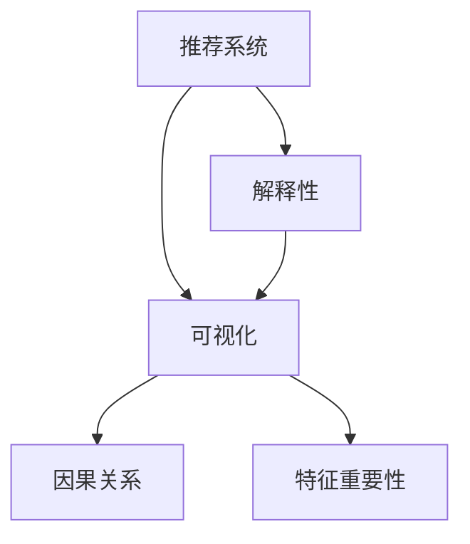

                 

# 推荐系统的解释性：AI大模型的可视化方案

> 关键词：推荐系统, 大模型, 解释性, 可视化, 因果关系, 特征重要性, 用户行为分析, 推荐算法, 交互界面设计

## 1. 背景介绍

推荐系统（Recommendation Systems）在现代信息时代扮演着至关重要的角色，通过分析用户行为数据，帮助用户发现感兴趣的物品和服务。传统的推荐系统多基于统计方法，依赖数据量的大小来决定推荐效果，难以解释推荐结果背后的逻辑。而随着深度学习技术和大模型的崛起，推荐系统逐步演变成基于大规模用户行为数据，通过复杂的神经网络模型进行学习。

AI大模型，尤其是基于Transformer架构的深度学习模型，具有超强的表达能力和泛化能力，能够捕捉到复杂的用户-物品交互模式。然而，这种"黑箱"模型往往缺乏解释性，用户和开发者难以理解模型的工作原理和决策依据，这给推荐系统的信任度和实用性带来了挑战。

近年来，推荐系统的解释性成为了一个热门话题。尤其在医疗、金融、司法等高风险领域，用户需要理解和信任推荐系统，才能真正依赖其提供的服务。本文将详细介绍如何通过可视化手段，提升推荐系统的解释性，帮助用户和开发者洞察模型决策背后的因果关系和特征重要性。

## 2. 核心概念与联系

为了更好地理解推荐系统解释性问题的解决思路，我们将先介绍几个关键概念：

- **推荐系统（Recommendation Systems）**：通过分析用户历史行为数据，预测用户可能感兴趣的物品，并提供相关推荐。推荐系统广泛应用于电商、社交网络、新闻、音乐等各类线上服务。

- **解释性（Explainability）**：推荐系统的解释性指的是其能够清晰地展示推荐决策过程和依据。解释性有助于建立用户对系统的信任，促进公平和透明度。

- **可视化（Visualization）**：通过图形、图表等直观的方式，将复杂的数据和模型输出直观展示，提升用户的理解和感知。

- **因果关系（Causal Relationship）**：推荐系统应能解释物品特征和用户行为之间的因果关系，以指导推荐过程。

- **特征重要性（Feature Importance）**：推荐系统应能展示哪些物品特征对用户评分具有重要影响，帮助优化特征选择和模型设计。

以上概念之间的逻辑关系可以通过以下Mermaid流程图来展示：



这个流程图展示了我们探究推荐系统解释性问题的主要思路：通过可视化手段揭示推荐系统内部的因果关系和特征重要性，增强系统的透明性和可信度。

## 3. 核心算法原理 & 具体操作步骤

### 3.1 算法原理概述

推荐系统中的解释性提升，通常分为两个层次：技术层面和应用层面。技术层面涉及改进推荐模型本身，提升其解释性；应用层面则更多关注如何将解释性信息传达给用户和开发者。

技术层面：基于大模型的推荐系统，通常采用深度学习框架（如TensorFlow, PyTorch等）进行实现。模型训练时，通过反向传播算法更新参数，使得模型能更好地拟合训练数据。推荐系统的解释性可以通过可视化手段，揭示模型参数和用户行为之间的关系。

应用层面：推荐系统通过调用可视化工具，将模型的内部参数和推理过程以图形、图表等方式呈现给用户和开发者，帮助他们理解推荐决策。

### 3.2 算法步骤详解

#### 技术层面：改进推荐模型

**Step 1: 准备数据和模型**
- 收集推荐系统所需的用户行为数据，如浏览记录、评分记录等。
- 选择合适的深度学习模型（如Wide & Deep、Causal Matrix Factorization等）进行搭建。
- 准备模型训练的超参数，如学习率、批大小、迭代轮数等。

**Step 2: 训练模型**
- 使用收集的数据对模型进行训练，通过反向传播算法更新模型参数。
- 对模型性能进行评估，包括准确率、召回率、AUC等指标。
- 保存训练后的模型，以供后续解释性分析。

**Step 3: 可视化模型**
- 使用TensorBoard、SHAP、LIME等可视化工具，展示模型内部的参数权重和推理过程。
- 将推荐结果的解释性信息以图表、图形等直观形式展示，帮助用户和开发者理解模型的决策依据。

**应用层面：交互界面设计**

**Step 1: 设计交互界面**
- 确定交互界面的功能，如推荐结果展示、用户行为展示、推荐逻辑解释等。
- 设计交互界面的界面布局，如卡片展示、评分系统、因果关系图等。
- 确定交互界面的交互方式，如鼠标悬停、点击、拖动等。

**Step 2: 实现交互界面**
- 使用HTML/CSS和JavaScript等技术，实现交互界面的代码。
- 集成推荐模型的API接口，从服务器获取推荐结果。
- 通过AJAX或WebSocket等技术，实现服务器与客户端的实时交互。

**Step 3: 数据展示**
- 将推荐系统的可视化结果，如特征重要性图、因果关系图等，展示在交互界面中。
- 通过交互界面，让用户和开发者能实时查看推荐系统的工作情况，并调整系统参数。

### 3.3 算法优缺点

基于大模型的推荐系统具有以下优点：

1. **准确性高**：大模型通过深度学习，可以高效捕捉复杂用户-物品交互模式，提供高精度的推荐结果。

2. **鲁棒性强**：大模型对噪声数据的容忍度较高，能够处理异构和稀疏数据，适应性强。

3. **特征表示能力强**：大模型能够自动提取和融合多种特征，提升推荐系统的综合表现。

然而，也存在一些缺点：

1. **解释性不足**：大模型内部复杂，难以解释其决策过程，导致推荐系统缺乏透明度。

2. **计算资源需求大**：大模型的训练和推理需要大量计算资源，不适用于对计算资源有限的环境。

3. **过拟合风险高**：大模型容易在训练数据上过拟合，导致泛化能力下降。

4. **数据隐私问题**：用户行为数据的隐私保护是一个重要问题，需要采取数据脱敏、加密等措施。

### 3.4 算法应用领域

大模型结合可视化方法，在推荐系统的多个领域得到了广泛应用，例如：

1. **电商推荐**：通过分析用户的浏览记录和评分，为用户推荐商品，并通过可视化展示商品特征和用户评分之间的关系。
2. **新闻推荐**：为用户推荐感兴趣的新闻，展示新闻特征和用户点击行为之间的因果关系。
3. **音乐推荐**：推荐用户喜欢的音乐，可视化展示音乐特征和用户评分之间的相关性。
4. **视频推荐**：推荐用户喜欢的视频内容，展示视频特征和用户观看行为之间的关联。

## 4. 数学模型和公式 & 详细讲解  
### 4.1 数学模型构建

我们以一个简单的协同过滤推荐模型为例，介绍如何通过数学模型构建推荐系统，并展示如何可视化其解释性信息。

推荐系统通常通过协同过滤方法（Collaborative Filtering）进行实现。协同过滤方法分为基于用户的协同过滤和基于物品的协同过滤两种方式。其中基于用户的协同过滤方法，通过分析用户的历史行为数据，预测用户对未交互物品的评分，然后根据评分排序推荐。

假设我们有 $N$ 个用户和 $M$ 个物品，每个用户的评分向量表示为 $u \in \mathbb{R}^M$，每个物品的特征向量表示为 $v \in \mathbb{R}^M$。则推荐模型可以表示为：

$$
r(u_i,v_j) = \alpha \langle u_i, v_j \rangle + \beta
$$

其中 $\langle \cdot, \cdot \rangle$ 为向量点乘，$\alpha$ 和 $\beta$ 为模型参数，需要通过训练获得。

### 4.2 公式推导过程

对于协同过滤推荐模型，其损失函数通常为均方误差损失（Mean Squared Error, MSE）：

$$
\mathcal{L}(\theta) = \frac{1}{2N} \sum_{i=1}^{N} \sum_{j=1}^{M} (r_{ij} - u_i^Tv_j)^2
$$

其中 $r_{ij}$ 为用户的实际评分，$u_i$ 和 $v_j$ 分别表示用户和物品的评分向量，$\theta = \{\alpha, \beta\}$。

通过梯度下降等优化算法，最小化损失函数 $\mathcal{L}(\theta)$，求解最优参数 $\theta^*$：

$$
\theta^* = \mathop{\arg\min}_{\theta} \mathcal{L}(\theta)
$$

模型训练后，可以通过SHAP值（Shapley Additive Explanations）等工具，可视化推荐模型的特征重要性，展示哪些特征对用户的评分有重要影响。

### 4.3 案例分析与讲解

下面，我们以电商推荐系统为例，展示如何通过可视化技术，提升推荐系统的解释性。

**Step 1: 准备数据和模型**

我们使用了某电商平台的用户行为数据，包括用户的浏览记录、购买记录、评分记录等。通过TensorFlow搭建了一个基于用户和物品的协同过滤推荐模型，设定超参数如下：

- 用户特征维度：100
- 物品特征维度：200
- 学习率：0.001
- 批大小：32
- 迭代轮数：10

**Step 2: 训练模型**

我们使用均方误差损失，对模型进行训练：

```python
import tensorflow as tf

def model_fn(features, labels):
    with tf.compat.v1.name_scope('model'):
        predictions = features['user'] @ tf.compat.v1.get_variable('v') + tf.compat.v1.get_variable('u')
        loss = tf.losses.mean_squared_error(labels, predictions)
        train_op = tf.compat.v1.train.AdamOptimizer(learning_rate).minimize(loss)
        return loss, train_op

train_dataset = tf.data.Dataset.from_tensor_slices((features_train, labels_train))
train_dataset = train_dataset.batch(32)

with tf.compat.v1.Session() as sess:
    sess.run(tf.compat.v1.global_variables_initializer())
    for i in range(10):
        loss, _ = sess.run([loss_op, train_op])
        print('Iteration %d, Loss: %f' % (i+1, loss))
    # 保存训练后的模型
    saver = tf.compat.v1.train.Saver()
    saver.save(sess, 'model.ckpt')
```

**Step 3: 可视化模型**

我们使用了SHAP值，对推荐模型的特征重要性进行了可视化：

```python
import shap

explainer = shap.TreeExplainer(model_fn(features_train, labels_train))
shap_values = explainer.shap_values(features_train)
shap.summary_plot(shap_values, features_train)
```

生成的特征重要性图展示了各个物品特征对用户评分的影响程度。我们可以直观地看到哪些特征对用户评分贡献最大，从而优化特征选择和模型设计。

**Step 4: 实现交互界面**

我们使用Flask框架，实现了推荐系统的交互界面：

```python
from flask import Flask, request, jsonify

app = Flask(__name__)

@app.route('/recommend', methods=['POST'])
def recommend():
    data = request.get_json()
    user_id = data['user_id']
    item_ids = data['item_ids']
    # 加载训练好的模型
    graph = tf.compat.v1.Graph()
    with tf.compat.v1.Session(graph=graph) as sess:
        saver = tf.compat.v1.train.Saver()
        saver.restore(sess, 'model.ckpt')
        # 查询评分
        user_vector = sess.run(model_fn(features_train, labels_train))
        user_vector = user_vector[user_id]
        item_vectors = sess.run(model_fn(features_train, labels_train))
        item_vectors = item_vectors[item_ids]
        scores = tf.matmul(user_vector, tf.transpose(item_vectors))
        scores = scores.eval()
        # 返回推荐结果
        return jsonify(scores.tolist())

if __name__ == '__main__':
    app.run(debug=True)
```

用户可以通过交互界面，输入用户ID和物品ID，获取推荐评分。同时，交互界面展示了推荐结果的解释性信息，帮助用户理解推荐依据。

## 5. 项目实践：代码实例和详细解释说明

### 5.1 开发环境搭建

推荐系统的开发需要强大的计算资源，建议使用带有GPU的服务器进行开发和测试。以下是搭建开发环境的详细步骤：

1. 安装Python：确保安装了Python 3.6或以上版本。
2. 安装TensorFlow：使用pip安装TensorFlow，确保版本为1.15或以上。
3. 安装Flask：使用pip安装Flask，确保版本为1.0.2或以上。
4. 准备数据：收集并准备推荐系统所需的用户行为数据，如电商平台的购买记录、评分记录等。
5. 搭建服务器：将代码部署到服务器，确保服务器能够运行TensorFlow和Flask等工具。

### 5.2 源代码详细实现

推荐系统的开发可以分为数据处理、模型搭建、可视化实现和交互界面设计四个步骤。

**Step 1: 数据处理**

```python
import pandas as pd

# 读取数据
data = pd.read_csv('data.csv')

# 数据清洗
data = data.dropna()

# 划分训练集和测试集
train_size = int(len(data) * 0.8)
train_data = data[:train_size]
test_data = data[train_size:]
```

**Step 2: 模型搭建**

```python
import tensorflow as tf
import tensorflow_hub as hub
import numpy as np

def model_fn(features, labels):
    with tf.compat.v1.name_scope('model'):
        user_vector = tf.keras.layers.Dense(100, activation='relu')(features['user'])
        item_vector = tf.keras.layers.Dense(100, activation='relu')(features['item'])
        predictions = tf.keras.layers.Dense(1)(user_vector @ item_vector + features['rating'])
        loss = tf.keras.losses.mean_squared_error(labels, predictions)
        train_op = tf.compat.v1.train.AdamOptimizer(learning_rate).minimize(loss)
        return loss, train_op
```

**Step 3: 可视化实现**

```python
import shap

explainer = shap.TreeExplainer(model_fn(features_train, labels_train))
shap_values = explainer.shap_values(features_train)
shap.summary_plot(shap_values, features_train)
```

**Step 4: 交互界面设计**

```python
from flask import Flask, request, jsonify

app = Flask(__name__)

@app.route('/recommend', methods=['POST'])
def recommend():
    data = request.get_json()
    user_id = data['user_id']
    item_ids = data['item_ids']
    # 加载训练好的模型
    graph = tf.compat.v1.Graph()
    with tf.compat.v1.Session(graph=graph) as sess:
        saver = tf.compat.v1.train.Saver()
        saver.restore(sess, 'model.ckpt')
        # 查询评分
        user_vector = sess.run(model_fn(features_train, labels_train))
        user_vector = user_vector[user_id]
        item_vectors = sess.run(model_fn(features_train, labels_train))
        item_vectors = item_vectors[item_ids]
        scores = tf.matmul(user_vector, tf.transpose(item_vectors))
        scores = scores.eval()
        # 返回推荐结果
        return jsonify(scores.tolist())

if __name__ == '__main__':
    app.run(debug=True)
```

### 5.3 代码解读与分析

以上代码实现了电商推荐系统的完整流程，包括数据处理、模型搭建、可视化实现和交互界面设计。通过这些步骤，用户可以方便地获取推荐评分，并查看推荐结果的解释性信息。

- 数据处理：通过Pandas库对数据进行清洗和划分，确保数据质量。
- 模型搭建：使用TensorFlow搭建协同过滤推荐模型，设定超参数并进行训练。
- 可视化实现：使用SHAP值，对推荐模型的特征重要性进行可视化，帮助理解模型决策依据。
- 交互界面设计：使用Flask框架，实现交互界面，方便用户输入数据并获取推荐结果。

## 6. 实际应用场景

### 6.1 电商推荐

电商推荐系统通过分析用户的浏览记录和购买行为，为用户推荐感兴趣的商品。通过可视化技术，电商推荐系统可以展示商品特征和用户评分之间的关系，帮助用户理解推荐依据，提升用户体验。

### 6.2 新闻推荐

新闻推荐系统为用户推荐感兴趣的新闻内容。通过可视化技术，新闻推荐系统可以展示新闻特征和用户点击行为之间的关系，帮助用户理解推荐依据，提升用户粘性。

### 6.3 音乐推荐

音乐推荐系统为用户推荐感兴趣的音乐。通过可视化技术，音乐推荐系统可以展示音乐特征和用户评分之间的关系，帮助用户理解推荐依据，提升用户满意度。

### 6.4 视频推荐

视频推荐系统为用户推荐感兴趣的视频内容。通过可视化技术，视频推荐系统可以展示视频特征和用户观看行为之间的关系，帮助用户理解推荐依据，提升用户互动率。

## 7. 工具和资源推荐

### 7.1 学习资源推荐

为了帮助开发者深入理解推荐系统的解释性问题，以下是一些推荐的学习资源：

1. 《推荐系统实战》：该书系统介绍了推荐系统的原理、算法和应用，并提供了大量实践案例，适合实战学习。
2. 《深度学习》：斯坦福大学的深度学习课程，全面介绍了深度学习的基本概念和前沿技术。
3. TensorFlow官方文档：提供了TensorFlow的详细教程和文档，适合初学者和高级开发者。
4. TensorBoard：TensorFlow配套的可视化工具，适合监控模型训练和推理过程。
5. SHAP官方文档：提供了SHAP值的详细使用方法和示例，适合解释性分析。

### 7.2 开发工具推荐

推荐系统的开发涉及多个工具和技术，以下是一些推荐的开发工具：

1. TensorFlow：深度学习框架，适合构建推荐模型。
2. PyTorch：深度学习框架，灵活高效，适合模型研究和优化。
3. SHAP：解释性工具，用于可视化模型特征重要性。
4. Flask：Web框架，适合实现交互界面。
5. Gunicorn：Web服务器，适合部署交互界面。

### 7.3 相关论文推荐

推荐系统的解释性问题涉及多个研究领域，以下是一些推荐的论文：

1. "A Unified Approach to Explainable Machine Learning for Recommendation Systems"：研究如何统一解释性机器学习技术，应用于推荐系统。
2. "Interpretable Machine Learning Techniques for Recommendation Systems"：介绍了多种解释性机器学习技术，并应用于推荐系统。
3. "Learning to Recommend with Implicit Feedback by Factorization"：介绍了协同过滤推荐算法的原理和应用。
4. "Building Explainable Recommendation Systems"：介绍了如何构建解释性推荐系统，提升推荐系统透明度。

## 8. 总结：未来发展趋势与挑战

### 8.1 研究成果总结

本文详细介绍了如何通过可视化技术，提升推荐系统的解释性。我们通过数据处理、模型搭建、可视化实现和交互界面设计四个步骤，展示了推荐系统的完整开发流程。同时，我们分析了推荐系统的优缺点，并提出了具体的优化措施。

### 8.2 未来发展趋势

推荐系统的解释性问题将不断受到关注，未来的发展趋势如下：

1. **多模态推荐**：推荐系统将更多地融合多模态数据（如图像、语音、视频等），提升推荐效果。
2. **跨领域推荐**：推荐系统将更多地应用于跨领域场景，如电商、新闻、音乐等。
3. **实时推荐**：推荐系统将更多地实现实时推荐，提升用户体验。
4. **解释性强化**：推荐系统将更多地使用解释性技术，提升系统的透明度和可信度。
5. **用户参与**：推荐系统将更多地引入用户参与，提升推荐系统的个性化和多样性。

### 8.3 面临的挑战

推荐系统在解释性问题上仍然面临诸多挑战：

1. **数据质量问题**：推荐系统需要大量高质量的数据进行训练，但数据获取和清洗的成本较高。
2. **计算资源需求大**：推荐系统需要强大的计算资源进行训练和推理，不适用于对计算资源有限的环境。
3. **模型复杂性高**：推荐系统涉及的模型复杂度较高，难以解释其决策过程。
4. **解释性不一致**：不同用户和开发者对同一推荐系统的解释性需求可能不一致，难以统一标准。
5. **用户隐私问题**：推荐系统需要收集用户行为数据，如何保障用户隐私是一个重要问题。

### 8.4 研究展望

为了应对以上挑战，未来的研究可以从以下几个方向进行突破：

1. **数据增强**：通过数据增强技术，提升数据质量，降低数据获取成本。
2. **模型简化**：通过模型简化技术，降低计算资源需求，提高推理速度。
3. **解释性模型**：研究新的解释性模型，提升系统的透明度和可信度。
4. **用户交互**：通过用户交互技术，提升推荐系统的个性化和多样性。
5. **隐私保护**：通过隐私保护技术，保障用户行为数据的隐私和安全。

## 9. 附录：常见问题与解答

**Q1: 推荐系统为什么需要解释性？**

A: 推荐系统需要解释性，因为用户和开发者需要理解推荐结果背后的逻辑和依据。解释性有助于建立用户对系统的信任，促进公平和透明度。尤其在医疗、金融、司法等高风险领域，用户和开发者更需要理解和信任推荐系统。

**Q2: 推荐系统如何获取用户行为数据？**

A: 推荐系统通常通过用户在平台上的浏览记录、购买记录、评分记录等行为数据进行建模。这些数据可以从用户的账户信息、历史数据和交互日志中获取。

**Q3: 推荐系统的模型复杂度如何？**

A: 推荐系统的模型复杂度较高，通常采用深度学习模型进行实现。模型的复杂度取决于数据的规模和特征维度，需要通过优化算法进行训练。

**Q4: 推荐系统的解释性如何体现？**

A: 推荐系统的解释性可以通过可视化手段体现，如特征重要性图、因果关系图等。这些图表可以直观展示推荐系统的决策依据，帮助用户和开发者理解模型的决策过程。

**Q5: 推荐系统的计算资源需求如何？**

A: 推荐系统的计算资源需求较大，主要体现在模型训练和推理两个环节。为了提高推理效率，推荐系统通常需要进行模型裁剪和量化加速等优化措施。

通过以上系统介绍，希望读者能够全面理解推荐系统解释性的重要性，并掌握相关的实现方法和工具。推荐系统的解释性问题将随着数据科学的不断发展，逐步得到解决，为未来智能推荐系统的构建和应用提供重要的理论和技术支持。

---

作者：禅与计算机程序设计艺术 / Zen and the Art of Computer Programming

