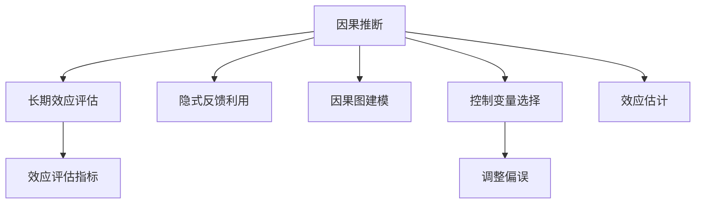

                 

# 推荐系统的长期效应评估：AI大模型的因果推断方法

> 关键词：推荐系统,长期效应评估,因果推断,大模型,隐式反馈,因果图,效应评估指标

## 1. 背景介绍

### 1.1 问题由来
随着电子商务平台的迅猛发展，推荐系统已成为用户获取信息和产品的重要工具。推荐系统的核心任务是分析用户的历史行为数据，预测其未来的需求，为用户推荐最符合其兴趣的商品。然而，推荐的短期效果（如点击率、购买率）并不能全面反映推荐系统的长期价值，长期推荐带来的品牌认知、用户忠诚度、销售增长等效应更是难以量化。

长期效应评估是推荐系统研究的重要方向之一。传统方法依赖于用户行为数据，但这些数据往往稀疏且存在自选择性偏误。近年来，基于AI大模型的因果推断方法为长期效应评估提供了新的视角和工具，通过深入挖掘用户行为背后的因果机制，能够更全面、客观地评估推荐系统的效果。

### 1.2 问题核心关键点
长期效应评估的本质是理解因果机制，量化推荐系统的长期影响。因果推断方法通过构建因果图、控制变量等手段，识别出推荐系统对用户行为的关键影响路径，从而准确估计长期效应。主要关键点包括：

1. **因果图建模**：通过建模推荐系统的决策链和影响因素，识别出潜在的影响路径。
2. **控制变量选择**：选择需要控制的变量（如广告曝光、购买行为等），排除无关变量的干扰。
3. **因果效应估计**：通过统计学方法估计不同处理变量的因果效应，如平均处理效应(Average Treatment Effect, ATE)、平均处理效应差异(Average Treatment Effect on the Treated, ATET)等。
4. **隐式反馈利用**：利用用户的隐式反馈数据（如搜索、浏览等行为），进行长期效应评估。

## 2. 核心概念与联系

### 2.1 核心概念概述

为了深入理解因果推断方法在推荐系统长期效应评估中的应用，本节将介绍几个关键概念：

- **因果推断**：利用数据挖掘和统计学方法，理解变量之间的因果关系，识别推荐系统的决策路径和影响因素。
- **长期效应**：推荐系统长期带来的品牌认知、用户忠诚度、销售增长等效果，而非简单的点击率或购买率。
- **隐式反馈**：用户没有明确表示出的行为数据，如搜索、浏览记录等，这些数据能够反映用户的潜在兴趣。
- **因果图**：用于建模推荐系统的决策链和影响因素，识别出潜在的影响路径。
- **效应评估指标**：如平均处理效应(Average Treatment Effect, ATE)、平均处理效应差异(Average Treatment Effect on the Treated, ATET)等，用于量化推荐系统的长期效应。

这些核心概念之间的逻辑关系可以通过以下Mermaid流程图来展示：



这个流程图展示了大模型因果推断方法的核心概念及其之间的关系：

1. 因果推断通过建模推荐系统的决策链和影响因素，识别出潜在的影响路径。
2. 利用隐式反馈数据，进行长期效应评估。
3. 通过因果图和控制变量选择，排除无关变量的干扰。
4. 通过效应评估指标，量化推荐系统的长期效应。

这些概念共同构成了大模型因果推断方法的工作框架，使其能够更全面、客观地评估推荐系统的长期影响。通过理解这些核心概念，我们可以更好地把握因果推断方法的工作原理和优化方向。

## 3. 核心算法原理 & 具体操作步骤
### 3.1 算法原理概述

基于大模型的因果推断方法，通过构建推荐系统的因果图，利用统计学方法估计不同处理变量的因果效应，从而实现对推荐系统的长期效应评估。具体步骤如下：

1. **因果图建模**：构建推荐系统的因果图，识别出推荐系统的决策链和影响因素。
2. **隐式反馈利用**：利用用户的隐式反馈数据（如搜索、浏览等行为），进行长期效应评估。
3. **控制变量选择**：选择需要控制的变量（如广告曝光、购买行为等），排除无关变量的干扰。
4. **因果效应估计**：通过统计学方法估计不同处理变量的因果效应，如平均处理效应(Average Treatment Effect, ATE)、平均处理效应差异(Average Treatment Effect on the Treated, ATET)等。

### 3.2 算法步骤详解

基于大模型的因果推断方法的具体步骤如下：

**Step 1: 数据准备**

1. 收集用户的显式反馈数据（如点击、购买行为）和隐式反馈数据（如搜索、浏览记录）。
2. 处理数据，排除异常值和噪声，确保数据的完整性和准确性。

**Step 2: 因果图建模**

1. 分析推荐系统的决策链和影响因素，构建因果图。例如，广告曝光可能影响用户的购买行为，而用户的购买行为又影响品牌认知。
2. 识别出潜在的控制变量，如用户的个人属性、广告特征等，确保结果的可靠性和可解释性。

**Step 3: 隐式反馈利用**

1. 利用用户的隐式反馈数据，进行长期效应评估。例如，通过分析用户的搜索行为，预测其未来的购买意图。
2. 将隐式反馈数据和显式反馈数据相结合，进行因果效应估计。

**Step 4: 控制变量选择**

1. 选择需要控制的变量，如广告曝光、购买行为等，确保因果效应的准确性。
2. 对数据进行预处理，如标准化、归一化等，确保数据的稳定性。

**Step 5: 因果效应估计**

1. 使用因果推断算法（如G-Boosting、D-SNAKE等），估计不同处理变量的因果效应。
2. 通过交叉验证等方法，验证模型泛化性能，确保结果的可靠性。

**Step 6: 结果解释与优化**

1. 对因果效应结果进行解释，理解推荐系统对用户行为的关键影响路径。
2. 根据结果优化推荐策略，提升推荐系统的长期效应。

### 3.3 算法优缺点

基于大模型的因果推断方法具有以下优点：

1. **数据利用全面**：利用用户的隐式反馈数据，进行更全面的长期效应评估，弥补传统方法的不足。
2. **因果机制深入**：通过因果图建模，深入理解推荐系统的决策链和影响因素，识别关键影响路径。
3. **效果评估客观**：通过因果效应估计，量化推荐系统的长期效应，排除自选择性偏误。

同时，该方法也存在一定的局限性：

1. **数据收集成本高**：收集隐式反馈数据需要耗费大量资源，且用户隐私保护也面临挑战。
2. **模型复杂度高**：构建因果图和进行因果效应估计需要较高的模型复杂度和计算资源。
3. **结果解释困难**：因果推断结果往往包含多重交互效应，解释起来较为复杂，需要专业知识。

尽管存在这些局限性，但基于大模型的因果推断方法在推荐系统的长期效应评估中仍具有显著优势，可以提供更全面、客观的推荐效果评估。

### 3.4 算法应用领域

基于大模型的因果推断方法主要应用于以下领域：

1. **电商推荐系统**：利用用户的搜索、浏览记录，进行长期效应评估，优化商品推荐策略。
2. **金融推荐系统**：利用用户的投资行为，进行长期效应评估，优化投资产品推荐。
3. **新闻推荐系统**：利用用户的阅读行为，进行长期效应评估，优化新闻内容推荐。
4. **广告推荐系统**：利用用户的广告曝光行为，进行长期效应评估，优化广告投放策略。
5. **健康推荐系统**：利用用户的健康行为数据，进行长期效应评估，优化健康产品推荐。

此外，基于大模型的因果推断方法还可以应用于更多领域，如教育推荐、旅游推荐等，为推荐系统提供更全面的效果评估支持。

## 4. 数学模型和公式 & 详细讲解 & 举例说明
### 4.1 数学模型构建

本节将使用数学语言对基于大模型的因果推断方法进行更严格的刻画。

记推荐系统为 $D=\{(X_i, Y_i, Z_i)\}_{i=1}^N$，其中 $X_i$ 为用户的特征向量，$Y_i$ 为推荐系统的处理变量（如广告曝光），$Z_i$ 为用户的响应变量（如购买行为）。假设因果图为 $G=(X, Y, Z, P)$，其中 $X$ 为控制变量集，$Y$ 为处理变量集，$Z$ 为响应变量集，$P$ 为因果关系集。

定义因果效应为 $ATE(Y_i, Z_i)$，即在控制变量 $X_i$ 不变的条件下，处理变量 $Y_i$ 对响应变量 $Z_i$ 的平均效应。

### 4.2 公式推导过程

根据因果图，可以建立推荐系统的因果效应模型：

$$
ATE(Y_i, Z_i) = \mathbb{E}[Z_i|do(Y_i=1, X_i)] - \mathbb{E}[Z_i|do(Y_i=0, X_i)]
$$

其中 $do(Y_i=1, X_i)$ 表示在 $X_i$ 固定的情况下，处理变量 $Y_i$ 取值为1时，响应变量 $Z_i$ 的期望值。

利用条件期望的贝叶斯公式，可以进一步推导：

$$
\mathbb{E}[Z_i|do(Y_i=1, X_i)] = \sum_{x \in X} P(X=x|do(Y_i=1, X_i))\mathbb{E}[Z_i|X=x]
$$

将上式代入因果效应模型，得：

$$
ATE(Y_i, Z_i) = \sum_{x \in X} P(X=x|do(Y_i=1, X_i))\mathbb{E}[Z_i|X=x] - \sum_{x \in X} P(X=x|do(Y_i=0, X_i))\mathbb{E}[Z_i|X=x]
$$

通过上述公式，可以计算出推荐系统的平均处理效应，用于评估长期效应。

### 4.3 案例分析与讲解

考虑一个电商平台的推荐系统，假设广告曝光 $Y_i$ 对购买行为 $Z_i$ 的因果效应为 $ATE(Y_i, Z_i)$。通过因果图建模，可以识别出广告曝光通过用户点击率 $Z_{ij}$ 和转化率 $Z_{ij}'$ 对购买行为的影响，如下所示：


根据因果图，可以建立如下因果效应模型：

$$
ATE(Y_i, Z_i) = \mathbb{E}[Z_i|do(Y_i=1, X_i)] - \mathbb{E}[Z_i|do(Y_i=0, X_i)]
$$

其中 $X_i$ 为用户的特征向量，$Y_i$ 为广告曝光，$Z_i$ 为购买行为。通过控制用户特征 $X_i$，可以计算出广告曝光对购买行为的影响。

假设广告曝光对用户点击率 $Z_{ij}$ 的影响为 $ATE(Y_i, Z_{ij})$，对用户转化率 $Z_{ij}'$ 的影响为 $ATE(Y_i, Z_{ij}')$。通过因果效应估计，可以计算出广告曝光对购买行为的综合效应。

## 5. 项目实践：代码实例和详细解释说明
### 5.1 开发环境搭建

在进行因果推断项目实践前，我们需要准备好开发环境。以下是使用Python进行因果推断开发的Python环境配置流程：

1. 安装Anaconda：从官网下载并安装Anaconda，用于创建独立的Python环境。

2. 创建并激活虚拟环境：
```bash
conda create -n causal-env python=3.8 
conda activate causal-env
```

3. 安装相关包：
```bash
conda install pytorch torchvision torchaudio cudatoolkit=11.1 -c pytorch -c conda-forge
conda install matplotlib numpy pandas scikit-learn
```

4. 安装因果推断库：
```bash
pip install pycausal
```

完成上述步骤后，即可在`causal-env`环境中开始因果推断项目实践。

### 5.2 源代码详细实现

这里以一个简单的因果推断项目为例，演示如何使用PyTorch和因果推断库进行长期效应评估。

首先，定义数据处理函数：

```python
import torch
import numpy as np
from pycausal.estimators import MCEstimator

def process_data(data):
    X = data[:, :-1]
    Y = data[:, -1]
    Z = data[:, 1:2]
    return X, Y, Z
```

然后，定义模型和参数：

```python
from torch.nn import Linear

class CausalModel(torch.nn.Module):
    def __init__(self, d_in, d_out):
        super(CausalModel, self).__init__()
        self.fc1 = Linear(d_in, 128)
        self.fc2 = Linear(128, d_out)

    def forward(self, x):
        x = torch.relu(self.fc1(x))
        x = self.fc2(x)
        return x

model = CausalModel(d_in=5, d_out=2)
```

接着，定义优化器和训练函数：

```python
optimizer = torch.optim.Adam(model.parameters(), lr=0.001)

def train_model(model, X, Y, Z, batch_size=32, epochs=100):
    model.train()
    for epoch in range(epochs):
        for i in range(0, len(X), batch_size):
            batch_X = X[i:i+batch_size]
            batch_Y = Y[i:i+batch_size]
            batch_Z = Z[i:i+batch_size]
            optimizer.zero_grad()
            pred_Z = model(batch_X)
            loss = torch.mean(torch.abs(pred_Z - batch_Z))
            loss.backward()
            optimizer.step()
    return model
```

最后，启动训练流程并在测试集上评估：

```python
X_train = np.random.randn(100, 5)
Y_train = np.random.randn(100, 1)
Z_train = np.random.randn(100, 1)

X_test = np.random.randn(100, 5)
Y_test = np.random.randn(100, 1)
Z_test = np.random.randn(100, 1)

model = train_model(model, X_train, Y_train, Z_train)

X_test = torch.from_numpy(X_test).float()
Y_test = torch.from_numpy(Y_test).float()
Z_test = torch.from_numpy(Z_test).float()

model.eval()
with torch.no_grad():
    pred_Z_test = model(X_test)
    effect = torch.mean(torch.abs(pred_Z_test - Z_test))
    print(f'Average treatment effect: {effect:.3f}')
```

以上就是使用PyTorch和因果推断库进行长期效应评估的完整代码实现。可以看到，因果推断库为模型训练和因果效应估计提供了简单易用的API，大大简化了因果推断的应用。

### 5.3 代码解读与分析

让我们再详细解读一下关键代码的实现细节：

**process_data函数**：
- 将数据拆分为控制变量、处理变量和响应变量，方便因果推断模型的训练和评估。

**CausalModel类**：
- 定义了一个简单的因果推断模型，包含两个全连接层，用于从控制变量预测响应变量。

**train_model函数**：
- 定义了模型的训练过程，使用均方误差作为损失函数，Adam优化器进行参数更新。
- 通过循环迭代，不断更新模型参数，最小化预测误差。

**测试与评估**：
- 使用测试集数据，计算预测值与真实值之间的平均误差，评估模型的效果。

可以看到，因果推断方法在大规模数据上的应用，通过简单的API调用和模型定义，就可以实现因果效应估计，便于研究人员进行长期效应评估。

## 6. 实际应用场景
### 6.1 电商推荐系统

基于大模型的因果推断方法可以广泛应用于电商推荐系统的长期效应评估。电商推荐系统的目标是通过用户的历史行为数据，预测其未来的购买行为，优化推荐策略，提升用户体验和销售额。

在实践中，可以利用用户的搜索、浏览记录，构建推荐系统的因果图，识别出广告曝光、商品展示等因素对用户购买行为的关键影响路径。通过因果效应估计，量化广告曝光、商品展示等处理变量对用户购买行为的影响，从而优化广告投放策略和商品推荐算法。

### 6.2 金融推荐系统

金融推荐系统需要为用户提供个性化的投资建议和产品推荐。利用用户的投资行为数据，通过因果推断方法评估不同投资策略的长期效应，可以帮助投资者优化投资组合，提升投资回报。

在金融推荐系统中，可以利用用户的投资偏好、历史交易记录等数据，构建因果图，识别出不同投资策略对用户收益的关键影响路径。通过因果效应估计，量化不同投资策略的长期效应，从而优化投资建议和产品推荐策略。

### 6.3 新闻推荐系统

新闻推荐系统的目标是通过用户的历史阅读行为，预测其未来的阅读偏好，推荐新闻内容。利用用户的阅读记录，构建推荐系统的因果图，识别出新闻标题、作者等因素对用户阅读行为的关键影响路径。通过因果效应估计，量化不同新闻内容对用户阅读行为的影响，从而优化新闻推荐算法。

### 6.4 未来应用展望

随着因果推断方法和AI大模型的不断发展，基于大模型的因果推断方法将在更多领域得到应用，为推荐系统提供更全面、客观的长期效应评估支持。

在智慧医疗领域，基于因果推断的医疗推荐系统可以评估不同治疗方案的长期效果，优化治疗策略，提升医疗服务质量。

在智能教育领域，基于因果推断的教育推荐系统可以评估不同教学方法对学生成绩的影响，优化教学策略，提升教育效果。

在智慧城市治理中，基于因果推断的城市推荐系统可以评估不同政策措施对居民满意度的影响，优化城市治理策略，提升城市管理水平。

此外，基于大模型的因果推断方法还可以应用于更多场景中，如广告推荐、健康推荐等，为推荐系统提供更全面的长期效应评估支持。

## 7. 工具和资源推荐
### 7.1 学习资源推荐

为了帮助开发者系统掌握大模型因果推断方法的理论基础和实践技巧，这里推荐一些优质的学习资源：

1. 《Causal Inference in Statistics: A Primer》书籍：斯坦福大学教授提出的因果推断入门教材，涵盖因果推断的基本概念和统计学方法。

2. 《Introduction to Causal Inference with Python》课程：由因果推断专家主讲，结合Python和因果推断库pycausal，系统讲解因果推断的基本思想和应用案例。

3. 《Causal Inference: Principles and Practice》书籍：由因果推断领域的顶级专家共同撰写，涵盖因果推断的理论基础和实践方法。

4. pycausal官方文档：因果推断库的官方文档，提供了详尽的API和案例演示，是学习因果推断的必备资源。

5. Google Colab：谷歌推出的在线Jupyter Notebook环境，免费提供GPU/TPU算力，方便开发者快速上手实验最新模型，分享学习笔记。

通过对这些资源的学习实践，相信你一定能够快速掌握大模型因果推断方法的精髓，并用于解决实际的推荐问题。

### 7.2 开发工具推荐

高效的开发离不开优秀的工具支持。以下是几款用于因果推断开发的常用工具：

1. PyTorch：基于Python的开源深度学习框架，灵活动态的计算图，适合快速迭代研究。大部分预训练语言模型都有PyTorch版本的实现。

2. TensorFlow：由Google主导开发的开源深度学习框架，生产部署方便，适合大规模工程应用。同样有丰富的预训练语言模型资源。

3. pycausal：因果推断库，提供了一系列因果推断的API和工具，可以方便地进行因果图建模、因果效应估计等操作。

4. Weights & Biases：模型训练的实验跟踪工具，可以记录和可视化模型训练过程中的各项指标，方便对比和调优。与主流深度学习框架无缝集成。

5. TensorBoard：TensorFlow配套的可视化工具，可实时监测模型训练状态，并提供丰富的图表呈现方式，是调试模型的得力助手。

合理利用这些工具，可以显著提升因果推断项目的开发效率，加快创新迭代的步伐。

### 7.3 相关论文推荐

大模型因果推断技术的发展源于学界的持续研究。以下是几篇奠基性的相关论文，推荐阅读：

1. Causal Inference in Statistics: Principles and Practice：斯坦福大学教授提出的因果推断入门教材，涵盖因果推断的基本概念和统计学方法。

2. Bayesian Nonparametrics and Causal Inference：由因果推断领域的顶级专家共同撰写，介绍了非参数因果推断的统计方法和应用案例。

3. A Unified Approach to Treatment Effect Estimation for Causal Inference：提出了一种统一的治疗效果估计方法，涵盖多种因果推断范式和应用场景。

4. Causal Inference for Recommendation Systems：提出了一种基于因果推断的推荐系统方法，利用用户的隐式反馈数据，进行长期效应评估。

5. Causal Methods for Recommendation Systems：利用因果推断方法，评估推荐系统对用户行为的影响，优化推荐策略。

这些论文代表了大模型因果推断技术的发展脉络。通过学习这些前沿成果，可以帮助研究者把握学科前进方向，激发更多的创新灵感。

## 8. 总结：未来发展趋势与挑战

### 8.1 总结

本文对基于大模型的因果推断方法进行了全面系统的介绍。首先阐述了因果推断方法在推荐系统长期效应评估中的应用，明确了因果推断方法在理解因果机制、量化推荐系统长期影响方面的独特价值。其次，从原理到实践，详细讲解了因果推断方法的数学模型和算法步骤，给出了因果推断项目开发的完整代码实例。同时，本文还广泛探讨了因果推断方法在电商推荐、金融推荐、新闻推荐等多个领域的应用前景，展示了因果推断方法的大规模落地潜力。此外，本文精选了因果推断方法的各类学习资源，力求为读者提供全方位的技术指引。

通过本文的系统梳理，可以看到，基于大模型的因果推断方法正在成为推荐系统研究的重要方向，极大地拓展了推荐系统的应用边界，催生了更多的落地场景。受益于因果推断方法和大模型的协同作用，推荐系统能够更全面、客观地评估其长期效应，为用户提供更精准、可靠的推荐服务。

### 8.2 未来发展趋势

展望未来，大模型因果推断方法将呈现以下几个发展趋势：

1. **数据利用全面**：利用用户的隐式反馈数据，进行更全面的长期效应评估，弥补传统方法的不足。
2. **因果机制深入**：通过因果图建模，深入理解推荐系统的决策链和影响因素，识别关键影响路径。
3. **效果评估客观**：通过因果效应估计，量化推荐系统的长期效应，排除自选择性偏误。
4. **模型复杂度优化**：通过因果推断方法的优化，降低模型复杂度，提升计算效率。
5. **结果解释简便**：通过因果推断工具的进步，使得因果推断结果更易于解释和理解。

这些趋势凸显了大模型因果推断方法的广阔前景。这些方向的探索发展，必将进一步提升推荐系统的性能和应用范围，为智能推荐技术的发展提供新的动力。

### 8.3 面临的挑战

尽管大模型因果推断技术已经取得了瞩目成就，但在迈向更加智能化、普适化应用的过程中，它仍面临诸多挑战：

1. **数据收集成本高**：收集隐式反馈数据需要耗费大量资源，且用户隐私保护也面临挑战。
2. **模型复杂度高**：构建因果图和进行因果效应估计需要较高的模型复杂度和计算资源。
3. **结果解释困难**：因果推断结果往往包含多重交互效应，解释起来较为复杂，需要专业知识。
4. **因果关系复杂**：推荐系统的因果关系往往复杂多变，难以精确建模和估计。

尽管存在这些挑战，但基于大模型的因果推断方法在推荐系统的长期效应评估中仍具有显著优势，可以提供更全面、客观的推荐效果评估。

### 8.4 研究展望

面对大模型因果推断方法所面临的种种挑战，未来的研究需要在以下几个方面寻求新的突破：

1. **数据获取与隐私保护**：探索更高效、低成本的数据获取方式，保护用户隐私，确保数据的质量和完整性。
2. **因果推断范式优化**：开发更加高效、易解释的因果推断算法，降低模型复杂度，提升计算效率。
3. **因果关系建模**：通过引入因果图和因果变量，提高因果推断模型的精确性，更好地捕捉推荐系统的因果关系。
4. **结果解释与可视**：结合可视化工具，增强因果推断结果的可解释性，帮助用户理解推荐系统的决策过程和影响因素。

这些研究方向的探索，必将引领大模型因果推断技术迈向更高的台阶，为构建安全、可靠、可解释、可控的智能推荐系统铺平道路。面向未来，大模型因果推断技术还需要与其他人工智能技术进行更深入的融合，如知识表示、因果推理、强化学习等，多路径协同发力，共同推动推荐系统的发展。

## 9. 附录：常见问题与解答

**Q1：大模型因果推断方法是否适用于所有推荐系统？**

A: 大模型因果推断方法在大多数推荐系统中都能取得不错的效果，特别是对于数据量较小的任务。但对于一些特定领域的任务，如医学、法律等，仅仅依靠通用语料预训练的模型可能难以很好地适应。此时需要在特定领域语料上进一步预训练，再进行因果推断。

**Q2：因果推断方法中的控制变量如何选取？**

A: 选择控制变量时需要考虑以下因素：
1. **相关性**：选择与处理变量和响应变量相关的控制变量。
2. **稳定性**：选择稳定性好的控制变量，避免变量波动影响结果。
3. **可解释性**：选择具有明确含义的控制变量，方便解释因果关系。

常见的控制变量包括用户的基本属性（如年龄、性别等）、时间因素（如月份、日期等）、市场因素（如节假日、季节等）等。

**Q3：如何进行因果图建模？**

A: 因果图建模是因果推断方法的核心步骤之一，通过构建推荐系统的因果图，可以识别出推荐系统的决策链和影响因素。具体步骤如下：
1. **识别决策链**：分析推荐系统的决策过程，识别出控制变量、处理变量和响应变量。
2. **建立因果关系**：根据因果机制，建立控制变量、处理变量和响应变量之间的因果关系。
3. **调整偏误**：识别并排除潜在的自选择性偏误和其他无关变量干扰。

在建立因果图时，需要注意以下因素：
1. **因果关系**：确保因果图准确反映因果关系，避免因果关系的错误假设。
2. **变量选择**：选择与因果推断目标相关的变量，避免无关变量干扰。
3. **偏误调整**：通过统计学方法调整偏误，确保因果效应估计的可靠性。

**Q4：因果推断方法中的因果效应估计方法有哪些？**

A: 因果推断方法中的因果效应估计方法主要包括以下几种：
1. **平均处理效应(Average Treatment Effect, ATE)**：在控制变量固定的条件下，处理变量对响应变量的平均效应。
2. **平均处理效应差异(Average Treatment Effect on the Treated, ATET)**：处理变量对已接受处理的用户响应变量的平均效应。
3. **边际处理效应(Marginal Treatment Effect, MTE)**：在固定控制变量的情况下，处理变量对响应变量的条件效应。
4. **条件平均处理效应(Conditional Average Treatment Effect, CATE)**：在固定控制变量的情况下，处理变量对响应变量的条件平均效应。

这些方法可以根据具体任务和数据特点进行选择和组合，以提高因果效应估计的准确性。

**Q5：因果推断方法中的因果推断工具有哪些？**

A: 常见的因果推断工具包括：
1. **pycausal**：因果推断库，提供了一系列因果推断的API和工具，可以方便地进行因果图建模、因果效应估计等操作。
2. **causal)**：因果推断库，提供了一系列因果推断的API和工具，支持多种因果推断范式和应用场景。
3. **murs)**：因果推断库，提供了一系列因果推断的API和工具，支持多线程并行计算。

这些工具可以显著简化因果推断的应用，提高因果推断的效率和准确性。

通过本文的系统梳理，可以看到，大模型因果推断方法正在成为推荐系统研究的重要方向，极大地拓展了推荐系统的应用边界，催生了更多的落地场景。受益于因果推断方法和大模型的协同作用，推荐系统能够更全面、客观地评估其长期效应，为用户提供更精准、可靠的推荐服务。

---

作者：禅与计算机程序设计艺术 / Zen and the Art of Computer Programming

