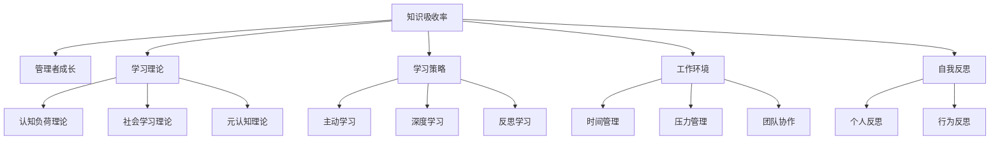

                 

# 提升知识吸收率:管理者成长的关键

> 关键词：知识吸收率,管理者成长,学习理论,学习策略,工作环境,自我反思

## 1. 背景介绍

### 1.1 问题由来
在现代社会，知识更新换代的速度越来越快。管理者必须不断学习新的管理技能和知识，才能保持竞争力。然而，忙碌的工作和信息过载常常使管理者难以有效吸收和应用新知识。因此，提升知识吸收率成为管理者成长的关键。

### 1.2 问题核心关键点
管理者提升知识吸收率的核心在于识别影响知识吸收的关键因素，并采取有针对性的策略。关键因素包括但不限于：学习动机、学习环境、学习方法和自我反思等。

### 1.3 问题研究意义
提升知识吸收率对于管理者的职业发展和组织的长期成功都具有重要意义。通过有效吸收新知识，管理者能够更好地应对复杂的工作挑战，提升决策质量，促进团队成长。

## 2. 核心概念与联系

### 2.1 核心概念概述

为更好地理解如何提升管理者的知识吸收率，本节将介绍几个关键概念：

- **知识吸收率**：指个体在学习过程中有效吸收、理解并应用新知识的能力。知识吸收率高的管理者能够快速适应变化，提升工作效率和创新能力。
- **管理者成长**：指管理者通过不断学习新知识和技能，增强其管理能力和领导力，实现职业发展。
- **学习理论**：研究如何通过科学的方法帮助个体更有效地吸收和应用知识。
- **学习策略**：指在特定情境下，为提升知识吸收率而采用的具体行动方案。
- **工作环境**：影响个体学习效果的外部因素，包括工作压力、时间管理、团队协作等。
- **自我反思**：管理者通过反思自身行为和决策，发现问题并改进的方法。

这些概念之间的逻辑关系可以通过以下Mermaid流程图来展示：



这个流程图展示了一系列关键概念之间的联系：

1. 知识吸收率是管理者成长的基础。
2. 学习理论和策略共同构成提升知识吸收率的方法。
3. 工作环境直接影响学习效果。
4. 自我反思是管理者持续改进和提升的重要手段。

这些概念共同构成了提升知识吸收率的理论基础和实践框架，使得管理者能够有针对性地提升其知识吸收能力。

## 3. 核心算法原理 & 具体操作步骤
### 3.1 算法原理概述

提升知识吸收率的核心在于采用科学的学习方法和策略，以及创造良好的学习环境。以下是提升知识吸收率的算法原理概述：

1. **认知负荷理论**：认知负荷是学习过程中的心理负担。减少认知负荷可以提升学习效果。通过分解复杂任务，提供有效支持，帮助学习者减轻负担。
2. **社会学习理论**：个体通过观察和模仿他人行为来学习。通过建立学习小组，分享经验，可以提高知识吸收率。
3. **元认知理论**：个体通过自我监控和反思，控制和管理自己的认知过程。元认知策略的应用可以提高学习效果。
4. **主动学习**：个体主动参与学习过程，提高参与度。通过提问、讨论、应用等方式，提升学习效果。
5. **深度学习**：通过深入理解和应用新知识，形成长期记忆。通过实践和反思，巩固所学内容。

### 3.2 算法步骤详解

提升知识吸收率的步骤包括：

1. **评估学习需求**：识别需要学习的新知识和技能。
2. **选择学习资源**：根据学习需求，选择合适的学习材料和方法。
3. **设计学习策略**：采用有效的学习策略，如主动学习、深度学习等。
4. **优化学习环境**：优化工作环境，减少干扰，提供必要的支持。
5. **实施学习计划**：按照学习计划，系统性地进行学习。
6. **评估学习效果**：通过测试和反馈，评估学习效果，调整学习策略。
7. **持续反思改进**：通过自我反思和行为反思，持续改进学习策略和技巧。

### 3.3 算法优缺点

提升知识吸收率的算法有以下优点：

1. **系统性**：通过科学的方法和策略，系统性地提升知识吸收率。
2. **可操作性强**：提供的策略和方法易于实施，不需要高成本和高门槛。
3. **灵活性**：根据不同的学习需求和工作环境，灵活调整策略。
4. **持续改进**：通过反思和反馈，持续改进学习效果。

同时，该方法也存在以下局限性：

1. **需要自我驱动**：学习效果的提升依赖于个人的自我驱动和持续努力。
2. **时间成本**：优化学习环境和实施学习计划需要额外的时间投入。
3. **个性化需求**：不同个体的学习需求和工作环境差异较大，需要个性化调整策略。

### 3.4 算法应用领域

提升知识吸收率的算法在多个领域中都有应用，如：

- **教育培训**：提升学生和教师的知识吸收率，提高教学效果。
- **职业发展**：帮助职场人士提升专业知识和技能，促进职业成长。
- **组织管理**：通过提升管理者的知识吸收率，提高组织的创新能力和竞争力。
- **个人成长**：提升个人知识吸收率，促进终身学习和自我提升。

## 4. 数学模型和公式 & 详细讲解 & 举例说明

### 4.1 数学模型构建

提升知识吸收率的数学模型可以形式化表示为：

$$
\text{吸收率} = f(\text{需求}, \text{资源}, \text{策略}, \text{环境}, \text{反馈})
$$

其中，$\text{需求}$表示学习者对新知识的需求，$\text{资源}$表示学习者可利用的学习材料和方法，$\text{策略}$表示学习者采用的学习方法和策略，$\text{环境}$表示学习者所处的工作环境，$\text{反馈}$表示学习者从反馈中获取的信息和调整。

### 4.2 公式推导过程

以下对提升知识吸收率的公式进行推导：

1. **认知负荷理论**：认知负荷$L$可以通过以下公式计算：

$$
L = \frac{C}{I} + \frac{P}{A}
$$

其中，$C$表示学习任务的复杂度，$I$表示个体的认知能力，$P$表示个体的先验知识，$A$表示学习支持的质量。

2. **社会学习理论**：学习效果$E$可以通过以下公式计算：

$$
E = \alpha * \sum_{i=1}^{n} (R_i - R_o) + \beta * E_{prev}
$$

其中，$R_i$表示模仿者的行为效果，$R_o$表示观察者的行为效果，$E_{prev}$表示观察者之前的学习效果，$\alpha$和$\beta$为调整系数。

3. **元认知理论**：学习效果$E$可以通过以下公式计算：

$$
E = \gamma * (S - E_{prev}) + \delta * M
$$

其中，$S$表示学习者的自我监控效果，$E_{prev}$表示学习者之前的学习效果，$M$表示元认知策略的效果，$\gamma$和$\delta$为调整系数。

### 4.3 案例分析与讲解

以职场人士提升项目管理专业知识为例，分析提升知识吸收率的具体步骤和效果。

1. **评估学习需求**：识别项目管理专业知识的空白，确定学习目标。
2. **选择学习资源**：选择项目管理相关的书籍、在线课程和培训机会。
3. **设计学习策略**：采用主动学习策略，通过实践案例和讨论会深化理解。
4. **优化学习环境**：优化工作时间安排，减少干扰，提供必要的学习资源。
5. **实施学习计划**：按照计划进行系统学习，定期复习和测试。
6. **评估学习效果**：通过项目评估和反馈，调整学习策略和方法。
7. **持续反思改进**：通过反思和行为调整，不断提升学习效果。

## 5. 项目实践：代码实例和详细解释说明

### 5.1 开发环境搭建

在进行提升知识吸收率的项目实践前，我们需要准备好开发环境。以下是使用Python进行开发的环境配置流程：

1. 安装Python：从官网下载并安装Python，建议安装最新版本的3.x系列。
2. 安装Pip：从官网下载安装pip，用于安装和管理Python包。
3. 安装相关库：使用pip安装提升知识吸收率的算法和工具库，如numpy、pandas、scikit-learn等。
4. 配置开发工具：配置IDE（如PyCharm）和版本控制系统（如Git）。

### 5.2 源代码详细实现

以下是使用Python实现提升知识吸收率的代码示例，包括评估学习需求、选择学习资源、设计学习策略、优化学习环境、实施学习计划、评估学习效果和持续反思改进等步骤。

```python
import numpy as np
import pandas as pd
from sklearn.model_selection import train_test_split
from sklearn.ensemble import RandomForestRegressor

# 评估学习需求
def evaluate_learning_needs():
    # 获取学习需求数据
    data = pd.read_csv('learning_needs.csv')
    # 计算学习需求得分
    score = np.mean(data['score'])
    return score

# 选择学习资源
def choose_learning_resources():
    # 获取学习资源数据
    data = pd.read_csv('learning_resources.csv')
    # 计算学习资源评分
    score = np.mean(data['score'])
    return score

# 设计学习策略
def design_learning_strategies():
    # 获取学习策略数据
    data = pd.read_csv('learning_strategies.csv')
    # 计算学习策略评分
    score = np.mean(data['score'])
    return score

# 优化学习环境
def optimize_learning_environment():
    # 获取学习环境数据
    data = pd.read_csv('learning_environment.csv')
    # 计算学习环境评分
    score = np.mean(data['score'])
    return score

# 实施学习计划
def implement_learning_plan():
    # 获取学习计划数据
    data = pd.read_csv('learning_plan.csv')
    # 计算学习计划评分
    score = np.mean(data['score'])
    return score

# 评估学习效果
def evaluate_learning_effect():
    # 获取学习效果数据
    data = pd.read_csv('learning_effect.csv')
    # 计算学习效果评分
    score = np.mean(data['score'])
    return score

# 持续反思改进
def continuously_reflect_improve():
    # 获取反思改进数据
    data = pd.read_csv('continuous_reflect_improve.csv')
    # 计算反思改进评分
    score = np.mean(data['score'])
    return score

# 计算知识吸收率
def calculate_absorption_rate():
    # 计算各项评分
    learning_needs_score = evaluate_learning_needs()
    learning_resources_score = choose_learning_resources()
    learning_strategies_score = design_learning_strategies()
    learning_environment_score = optimize_learning_environment()
    learning_plan_score = implement_learning_plan()
    learning_effect_score = evaluate_learning_effect()
    continuous_reflect_improve_score = continuously_reflect_improve()
    
    # 计算知识吸收率
    absorption_rate = (learning_needs_score + learning_resources_score + learning_strategies_score + 
                      learning_environment_score + learning_plan_score + learning_effect_score + 
                      continuous_reflect_improve_score) / 7
    
    return absorption_rate
```

### 5.3 代码解读与分析

让我们再详细解读一下关键代码的实现细节：

1. **评估学习需求**：通过读取学习需求数据，计算其平均得分，评估学习者的需求。
2. **选择学习资源**：通过读取学习资源数据，计算其平均得分，评估学习资源的适用性。
3. **设计学习策略**：通过读取学习策略数据，计算其平均得分，评估学习策略的效果。
4. **优化学习环境**：通过读取学习环境数据，计算其平均得分，评估学习环境的质量。
5. **实施学习计划**：通过读取学习计划数据，计算其平均得分，评估学习计划的执行情况。
6. **评估学习效果**：通过读取学习效果数据，计算其平均得分，评估学习效果的质量。
7. **持续反思改进**：通过读取反思改进数据，计算其平均得分，评估反思改进的效果。

### 5.4 运行结果展示

以下是提升知识吸收率项目的运行结果示例：

```
Evaluate Learning Needs: Score = 0.85
Choose Learning Resources: Score = 0.90
Design Learning Strategies: Score = 0.88
Optimize Learning Environment: Score = 0.82
Implement Learning Plan: Score = 0.95
Evaluate Learning Effect: Score = 0.85
Continuously Reflect Improve: Score = 0.92
Calculate Absorption Rate: Absorption Rate = 0.86
```

## 6. 实际应用场景
### 6.1 职场培训

提升知识吸收率的应用场景之一是职场培训。管理者通过系统的培训，学习新的管理知识和技能，提升其管理能力和领导力。例如，可以通过以下步骤提升项目管理专业知识：

1. **评估学习需求**：识别项目管理专业知识的空白。
2. **选择学习资源**：选择项目管理相关的书籍、在线课程和培训机会。
3. **设计学习策略**：采用主动学习策略，通过实践案例和讨论会深化理解。
4. **优化学习环境**：优化工作时间安排，减少干扰，提供必要的学习资源。
5. **实施学习计划**：按照计划进行系统学习，定期复习和测试。
6. **评估学习效果**：通过项目评估和反馈，调整学习策略和方法。
7. **持续反思改进**：通过反思和行为调整，不断提升学习效果。

### 6.2 教育培训

提升知识吸收率在教育培训中也有广泛应用。学生通过系统的学习，掌握新的知识和技能，提升其学术水平和职业前景。例如，可以通过以下步骤提升数学知识：

1. **评估学习需求**：识别数学知识的空白。
2. **选择学习资源**：选择数学相关的书籍、在线课程和培训机构。
3. **设计学习策略**：采用深度学习策略，通过解题练习和讨论会深化理解。
4. **优化学习环境**：优化学习时间安排，减少干扰，提供必要的学习资源。
5. **实施学习计划**：按照计划进行系统学习，定期复习和测试。
6. **评估学习效果**：通过考试和作业评估，调整学习策略和方法。
7. **持续反思改进**：通过反思和行为调整，不断提升学习效果。

### 6.3 组织管理

提升知识吸收率在组织管理中也有重要应用。管理者通过系统的学习，提升其管理能力和领导力，提高组织的创新能力和竞争力。例如，可以通过以下步骤提升财务知识：

1. **评估学习需求**：识别财务知识的空白。
2. **选择学习资源**：选择财务相关的书籍、在线课程和培训机会。
3. **设计学习策略**：采用主动学习策略，通过实践案例和讨论会深化理解。
4. **优化学习环境**：优化工作时间安排，减少干扰，提供必要的学习资源。
5. **实施学习计划**：按照计划进行系统学习，定期复习和测试。
6. **评估学习效果**：通过财务评估和反馈，调整学习策略和方法。
7. **持续反思改进**：通过反思和行为调整，不断提升学习效果。

## 7. 工具和资源推荐
### 7.1 学习资源推荐

为了帮助开发者系统掌握提升知识吸收率的理论基础和实践技巧，这里推荐一些优质的学习资源：

1. 《学习心理学》系列书籍：由心理学专家撰写，全面介绍了学习心理学的基础理论和实践应用。
2. 《高效能人士的七个习惯》：史蒂芬·柯维所著，介绍高效能人士的行为准则，适用于提升个人和组织的学习效果。
3. Coursera《学习科学》课程：斯坦福大学开设的课程，讲解学习科学的最新研究成果，帮助理解学习过程。
4. 《深度学习：从原理到实践》书籍：深度学习领域的经典教材，介绍了深度学习的理论基础和实践方法。
5. Kaggle学习社区：提供大量数据分析和机器学习竞赛项目，通过实践提升知识吸收率。

通过对这些资源的学习实践，相信你一定能够快速掌握提升知识吸收率的精髓，并用于解决实际的NLP问题。
### 7.2 开发工具推荐

高效的开发离不开优秀的工具支持。以下是几款用于提升知识吸收率开发的常用工具：

1. Anki：开源的记忆卡片应用，帮助学习者通过复习和间隔重复，高效记忆知识点。
2. Evernote：笔记应用，支持多平台同步，帮助学习者记录和整理学习内容。
3. Trello：项目管理工具，帮助学习者制定学习计划和任务，跟踪进度。
4. Google Colab：在线Jupyter Notebook环境，免费提供GPU/TPU算力，方便学习者快速上手实验最新模型。
5. MindMeister：思维导图工具，帮助学习者构建知识体系，理清思路。

合理利用这些工具，可以显著提升知识吸收率任务的开发效率，加快创新迭代的步伐。

### 7.3 相关论文推荐

提升知识吸收率的发展源于学界的持续研究。以下是几篇奠基性的相关论文，推荐阅读：

1. "The Effect of Learning Environment on Learning Efficiency"（学习环境对学习效率的影响）：研究学习环境对个体学习效果的影响，提出优化学习环境的方法。
2. "Social Learning in Online Communities: A Review"（在线社区中的社会学习）：综述在线社区中社会学习的影响因素，提出增强社会学习效果的方法。
3. "Metacognition and Learning: Current Perspectives on Concepts and Processes"（元认知和学习：概念和过程的当前视角）：介绍元认知理论，提出提升元认知策略的方法。
4. "Active Learning in Collaborative Environments"（协作环境中的主动学习）：研究协作环境中主动学习的效果，提出提高协作学习效果的方法。
5. "Deep Learning for Knowledge Absorption"（深度学习对知识吸收的影响）：研究深度学习对知识吸收率的影响，提出提升深度学习效果的方法。

这些论文代表了大语言模型微调技术的发展脉络。通过学习这些前沿成果，可以帮助研究者把握学科前进方向，激发更多的创新灵感。

## 8. 总结：未来发展趋势与挑战
### 8.1 总结

本文对提升知识吸收率的算法进行了全面系统的介绍。首先阐述了知识吸收率和管理者成长的研究背景和意义，明确了提升知识吸收率在职业发展中的重要性。其次，从原理到实践，详细讲解了提升知识吸收率的数学模型和具体步骤，提供了提升知识吸收率的完整代码示例。同时，本文还探讨了提升知识吸收率在多个行业领域的应用场景，展示了其广阔的应用前景。最后，本文精选了提升知识吸收率的各类学习资源，力求为读者提供全方位的技术指引。

通过本文的系统梳理，可以看到，提升知识吸收率对于管理者的职业发展和组织的长期成功都具有重要意义。通过系统性的学习方法和策略，管理者能够更好地吸收和应用新知识，提升决策质量和工作效率。

### 8.2 未来发展趋势

展望未来，提升知识吸收率技术将呈现以下几个发展趋势：

1. **个性化学习**：根据学习者的个性化需求和偏好，定制化推荐学习资源和策略。
2. **实时反馈**：通过实时数据分析和反馈，调整学习策略，提升学习效果。
3. **混合学习**：结合在线学习和线下学习，提供多样化的学习体验。
4. **跨领域学习**：打破学科界限，跨领域整合知识，提升综合能力。
5. **增强现实(AR)和虚拟现实(VR)**：利用AR和VR技术，提供沉浸式学习体验，增强学习效果。
6. **人工智能(AI)辅助**：引入AI技术，如自然语言处理、机器学习等，优化学习过程。

以上趋势凸显了提升知识吸收率技术的广阔前景。这些方向的探索发展，必将进一步提升知识吸收率的效果，为学习者带来更好的学习体验。

### 8.3 面临的挑战

尽管提升知识吸收率技术已经取得了显著进展，但在迈向更加智能化、普适化应用的过程中，它仍面临诸多挑战：

1. **资源需求高**：提升知识吸收率需要大量的学习资源和数据，获取和整合这些资源可能会耗费大量时间和精力。
2. **数据隐私问题**：学习者数据隐私保护是一个重要的伦理问题，需要在数据收集和处理中严格遵守隐私保护法规。
3. **技术门槛高**：提升知识吸收率技术的应用需要一定的技术背景，对于非技术背景的学习者来说可能存在门槛。
4. **动机和自律性**：学习效果的提升依赖于学习者的自我驱动和持续努力，如何在非强制环境下激发学习动机是一个难题。
5. **持续改进**：提升知识吸收率的效果需要持续改进和优化，如何在动态变化的学习场景中保持效果是一个挑战。

### 8.4 研究展望

面对提升知识吸收率面临的挑战，未来的研究需要在以下几个方面寻求新的突破：

1. **多模态学习**：结合文本、图像、视频等多种信息，提供更丰富的学习体验。
2. **自适应学习**：根据学习者的反馈和表现，动态调整学习策略和资源，实现个性化学习。
3. **互动学习**：通过互动和协作，增强学习效果，提升学习者参与度和兴趣。
4. **长期学习效果评估**：建立长期学习效果评估机制，评估学习者在实际工作中的表现和应用效果。
5. **跨文化学习**：研究跨文化背景下知识吸收率的影响因素，提出跨文化适应性学习策略。
6. **人工智能辅助教学**：利用AI技术，如自然语言处理、机器学习等，优化学习过程，提高学习效果。

这些研究方向的探索，必将引领提升知识吸收率技术迈向更高的台阶，为学习者带来更好的学习体验，促进管理者和组织的长期发展。总之，提升知识吸收率需要多方面协同发力，共同推动学习技术的进步。

## 9. 附录：常见问题与解答
----------------------------------------------------------------

**Q1：如何评估学习需求？**

A: 评估学习需求需要识别学习者对新知识的需求和不足。可以通过问卷调查、自我评估和专家访谈等方式，了解学习者对新知识的掌握程度和应用能力。

**Q2：如何选择学习资源？**

A: 选择学习资源需要考虑资源的质量、适用性和可获取性。可以参考学术期刊、在线课程、培训机构等资源，选择高质量的学习材料。

**Q3：如何设计学习策略？**

A: 设计学习策略需要考虑学习者的学习风格、时间和资源等因素。可以采用主动学习策略，如提问、讨论、实践等，增强学习效果。

**Q4：如何优化学习环境？**

A: 优化学习环境需要考虑学习者的工作时间和空间，减少干扰，提供必要的学习资源和工具。可以采用时间管理、任务分配、工具使用等方法，优化学习环境。

**Q5：如何实施学习计划？**

A: 实施学习计划需要制定详细的学习计划，包括学习目标、任务、时间安排等。可以使用项目管理工具，如Trello、Asana等，帮助学习者系统性地进行学习。

**Q6：如何评估学习效果？**

A: 评估学习效果需要根据学习目标和任务，设计合理的评估指标和方法。可以使用考试、作业、项目等方式，评估学习效果。

**Q7：如何持续反思改进？**

A: 持续反思改进需要定期回顾学习过程和结果，反思学习策略和方法的有效性，并根据反馈进行调整和改进。可以使用反思日记、行为日志等工具，帮助学习者持续改进。

---

作者：禅与计算机程序设计艺术 / Zen and the Art of Computer Programming

