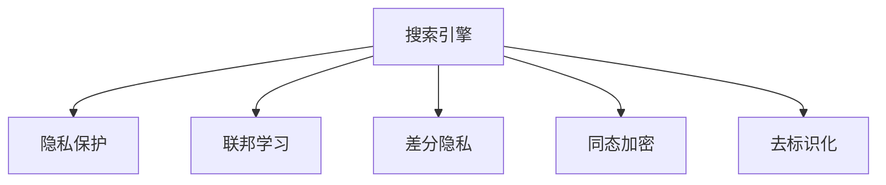

                 

# 搜索引擎的隐私保护新范式

## 1. 背景介绍

### 1.1 问题由来

在数字化时代，搜索引擎（Search Engines, SE）已成为人们获取信息、解决问题的重要工具。然而，搜索引擎在给用户带来便利的同时，也引发了一系列隐私保护问题。用户搜索记录、浏览行为、位置信息等敏感数据被搜索引擎收集和分析，可能用于广告定向、个性化推荐、社会行为研究等目的，存在隐私泄露的风险。因此，如何在大数据时代下，既满足用户搜索需求，又保护用户隐私，成为当前搜索引擎发展的重要课题。

### 1.2 问题核心关键点

搜索引擎的隐私保护问题，主要围绕以下几个核心关键点展开：

- **数据收集与存储**：搜索引擎需要收集用户搜索历史、点击流等数据，以便优化搜索结果和提升用户体验。如何合理收集、存储这些数据，同时避免隐私泄露，是隐私保护的关键。
- **数据处理与分析**：搜索引擎通常会对收集到的数据进行分析和处理，以便改进算法和改进用户体验。如何保护数据在处理和分析过程中的隐私，也是隐私保护的重要环节。
- **数据披露与共享**：搜索引擎会将分析结果用于广告定向、第三方合作等目的，可能涉及用户隐私的披露和共享。如何控制数据披露的范围和方式，防止隐私泄露，是隐私保护的难点。
- **用户控制与透明度**：用户应当有权利了解搜索引擎如何收集和使用自己的数据，并有权控制数据的收集和处理方式。如何提升用户对隐私保护的知情权和控制权，是隐私保护的目标。

这些核心关键点共同构成了搜索引擎隐私保护的基本框架，决定了隐私保护技术的发展方向和应用范围。

## 2. 核心概念与联系

### 2.1 核心概念概述

为了更好地理解搜索引擎的隐私保护，本节将介绍几个密切相关的核心概念：

- **搜索引擎**：通过算法和大数据技术，为用户提供一个高效、准确、个性化的搜索结果展示的计算机系统。搜索引擎的核心在于信息检索和排序算法。
- **隐私保护**：通过技术手段和管理措施，保护用户个人信息和数据隐私，防止未经授权的访问、使用和泄露。隐私保护的目标是确保用户数据的安全性和用户知情权。
- **联邦学习**：一种分布式机器学习技术，多个参与方在不共享数据的前提下，通过协同训练模型来提升模型的性能。联邦学习旨在保护数据隐私，同时实现模型的协同优化。
- **差分隐私**：一种保护数据隐私的技术，通过在数据中引入噪声，使得数据在公开时无法与具体个人关联。差分隐私保护个体隐私的同时，也保护了数据的整体统计特性。
- **同态加密**：一种保护数据隐私的技术，允许在加密数据上直接进行计算，从而保护数据在处理过程中的隐私。同态加密可以应用于数据的计算和分析，而无需解密数据。
- **去标识化**：一种数据保护技术，通过删除或掩盖个人身份信息，使得数据无法与具体个人关联，从而保护个人隐私。去标识化适用于对数据的统计分析和趋势研究。

这些核心概念之间的逻辑关系可以通过以下Mermaid流程图来展示：



这个流程图展示了他搜索引擎的核心概念及其之间的关系：

1. 搜索引擎通过隐私保护技术保护用户数据。
2. 联邦学习、差分隐私、同态加密、去标识化等技术，是搜索引擎实现隐私保护的重要手段。
3. 不同隐私保护技术有各自的优势和适用场景，可以结合应用以应对不同的隐私保护需求。

## 3. 核心算法原理 & 具体操作步骤
### 3.1 算法原理概述

搜索引擎的隐私保护，本质上是一种数据安全与用户隐私的双重保护。其核心思想是：在保证搜索结果质量的同时，合理收集和使用用户数据，防止数据泄露和滥用，从而保护用户隐私。

具体而言，搜索引擎的隐私保护可以概括为以下几个步骤：

1. **数据收集与匿名化**：收集用户搜索历史、点击流等数据，并对其进行匿名化处理，以保护用户隐私。
2. **差分隐私**：在数据处理和分析过程中，引入噪声，使得数据公开时无法与具体个人关联，从而保护用户隐私。
3. **联邦学习**：将数据分布式存储在多个节点上，通过协同训练模型，避免数据的集中存储和处理，从而保护用户隐私。
4. **同态加密**：对用户数据进行加密，允许在加密状态下进行计算和分析，从而保护数据隐私。
5. **去标识化**：删除或掩盖个人身份信息，使得数据无法与具体个人关联，从而保护用户隐私。

### 3.2 算法步骤详解

搜索引擎的隐私保护算法步骤如下：

**Step 1: 数据收集与匿名化**
- 通过浏览器插件或移动应用收集用户搜索历史、点击流等数据。
- 对数据进行去标识化处理，如使用哈希函数、脱敏技术等，使得数据无法与具体个人关联。

**Step 2: 差分隐私**
- 在去标识化后的数据上，引入噪声，使得数据公开时无法与具体个人关联。
- 通过差分隐私机制，保护数据在处理和分析过程中的隐私。

**Step 3: 联邦学习**
- 将数据分布式存储在多个节点上，每个节点只处理本地数据。
- 通过联邦学习技术，协同训练模型，避免数据的集中存储和处理。

**Step 4: 同态加密**
- 对用户数据进行加密，允许在加密状态下进行计算和分析。
- 使用同态加密技术，保护数据在处理过程中的隐私。

**Step 5: 去标识化**
- 删除或掩盖个人身份信息，使得数据无法与具体个人关联。
- 使用去标识化技术，保护数据在存储和传输过程中的隐私。

### 3.3 算法优缺点

搜索引擎的隐私保护算法具有以下优点：

1. **保护用户隐私**：通过差分隐私、去标识化、同态加密等技术，有效保护用户数据隐私，防止数据泄露和滥用。
2. **提高数据安全**：通过联邦学习技术，避免数据的集中存储和处理，提高数据的安全性。
3. **保证搜索结果质量**：在隐私保护的同时，通过差分隐私和联邦学习技术，保证搜索结果的质量和准确性。
4. **满足用户需求**：用户可以更好地控制数据的收集和处理方式，增强用户知情权和控制权。

同时，该算法也存在一定的局限性：

1. **计算复杂度高**：差分隐私和同态加密等技术，需要在数据上引入噪声，增加计算复杂度，降低计算效率。
2. **数据隐私保护强度高**：过于严格的隐私保护措施，可能会影响数据的利用和分析，限制搜索引擎的业务能力。
3. **实现复杂**：联邦学习、差分隐私、同态加密等技术，实现难度较高，需要高度的技术和工程能力。
4. **用户隐私感知差**：用户可能对隐私保护措施感知不足，导致隐私保护技术难以落地应用。

尽管存在这些局限性，但就目前而言，基于隐私保护技术的大规模搜索引擎系统，已经在学术界和工业界得到了广泛的应用，成为搜索引擎隐私保护的重要手段。未来相关研究的重点在于如何进一步降低隐私保护措施对用户体验的影响，提高隐私保护的效率和可操作性。

### 3.4 算法应用领域

基于隐私保护技术的大规模搜索引擎系统，已经在以下几个领域得到了广泛应用：

- **广告定向**：通过隐私保护技术，对广告定向数据进行处理，避免广告定向过程中涉及用户隐私泄露。
- **个性化推荐**：通过差分隐私、联邦学习等技术，对用户行为数据进行处理，提升个性化推荐的质量和效果。
- **社会行为研究**：通过去标识化和同态加密技术，对大规模用户数据进行分析，研究社会行为和趋势。
- **医疗数据保护**：对医疗数据进行差分隐私处理，防止医疗数据泄露，保护患者隐私。
- **金融数据保护**：对金融数据进行同态加密处理，防止金融数据泄露，保护用户隐私。

除了上述这些经典应用外，基于隐私保护技术的大规模搜索引擎系统，还在更多场景中得到应用，如智能交通、公共安全、智能家居等，为不同行业的数据安全提供了新的解决方案。随着隐私保护技术的不断进步，相信基于隐私保护技术的大规模搜索引擎系统将带来更多的创新应用和业务价值。

## 4. 数学模型和公式 & 详细讲解 & 举例说明

### 4.1 数学模型构建

本节将使用数学语言对搜索引擎的隐私保护技术进行更加严格的刻画。

记搜索引擎收集到的用户数据为 $D=\{(x_i,y_i)\}_{i=1}^N$，其中 $x_i$ 为数据特征，$y_i$ 为数据标签。假设搜索引擎的隐私保护模型为 $M$，其参数为 $\theta$。

定义隐私保护模型 $M$ 在数据样本 $(x,y)$ 上的隐私保护损失函数为 $\ell(M(x),y)$，则在数据集 $D$ 上的隐私保护损失为：

$$
\mathcal{L}(\theta) = \frac{1}{N}\sum_{i=1}^N \ell(M(x_i),y_i)
$$

其中 $\ell(M(x_i),y_i)$ 为隐私保护损失函数，通常包含差分隐私、去标识化等隐私保护措施。

通过梯度下降等优化算法，隐私保护过程不断更新模型参数 $\theta$，最小化隐私保护损失 $\mathcal{L}$，使得隐私保护模型输出逼近真实标签。由于 $\theta$ 已经通过隐私保护措施获得了较好的初始化，因此即便在少量标注样本上进行隐私保护，也能较快收敛到理想的模型参数 $\hat{\theta}$。

### 4.2 公式推导过程

以下我们以差分隐私为例，推导隐私保护模型的隐私保护损失函数及其梯度的计算公式。

假设隐私保护模型 $M$ 在输入 $x$ 上的输出为 $\hat{y}=M(x)$，表示模型的预测结果。真实标签 $y \in \{0,1\}$。则二分类隐私保护损失函数定义为：

$$
\ell(M(x),y) = -[y\log \hat{y} + (1-y)\log (1-\hat{y})]
$$

引入 $\epsilon$ 参数作为差分隐私的隐私预算，隐私保护损失函数定义为：

$$
\mathcal{L}(\theta) = -\frac{1}{N}\sum_{i=1}^N [y_i\log M(x_i)+(1-y_i)\log(1-M(x_i))] + \frac{\epsilon}{N}W(x_i)
$$

其中 $W(x_i)$ 为扰动函数，用于在模型输出上引入噪声，保护数据隐私。

根据链式法则，隐私保护损失函数对参数 $\theta_k$ 的梯度为：

$$
\frac{\partial \mathcal{L}(\theta)}{\partial \theta_k} = -\frac{1}{N}\sum_{i=1}^N (\frac{y_i}{M(x_i)}-\frac{1-y_i}{1-M(x_i)}) \frac{\partial M(x_i)}{\partial \theta_k} + \frac{\epsilon}{N}W'(x_i) \frac{\partial M(x_i)}{\partial \theta_k}
$$

其中 $W'(x_i)$ 为扰动函数的导数，用于计算噪声对梯度的影响。

在得到隐私保护损失函数的梯度后，即可带入参数更新公式，完成隐私保护模型的迭代优化。重复上述过程直至收敛，最终得到适应隐私保护需求的最优模型参数 $\theta^*$。

### 4.3 案例分析与讲解

以Google的隐私保护搜索引擎为例，其隐私保护技术主要通过差分隐私和联邦学习实现。具体而言，Google在搜索结果排名过程中，通过在模型输出上引入噪声，保护用户搜索行为隐私。同时，通过联邦学习技术，协同训练搜索模型，避免数据的集中存储和处理。

以某个具体的隐私保护搜索引擎为例，其隐私保护过程如下：

1. 在用户搜索时，收集用户查询、点击流等数据，并对其进行去标识化处理，以保护用户隐私。
2. 在去标识化后的数据上，引入噪声，使得数据公开时无法与具体个人关联。
3. 通过联邦学习技术，协同训练搜索模型，避免数据的集中存储和处理。
4. 对用户数据进行同态加密处理，保护数据在处理过程中的隐私。
5. 删除或掩盖个人身份信息，使得数据无法与具体个人关联，从而保护用户隐私。

通过上述步骤，Google的隐私保护搜索引擎实现了在大规模数据上的隐私保护，避免了数据泄露和滥用，同时保证了搜索结果的质量和准确性。

## 5. 项目实践：代码实例和详细解释说明
### 5.1 开发环境搭建

在进行隐私保护实践前，我们需要准备好开发环境。以下是使用Python进行TensorFlow开发的环境配置流程：

1. 安装Anaconda：从官网下载并安装Anaconda，用于创建独立的Python环境。

2. 创建并激活虚拟环境：
```bash
conda create -n tf-env python=3.8 
conda activate tf-env
```

3. 安装TensorFlow：从官网获取对应的安装命令。例如：
```bash
pip install tensorflow
```

4. 安装TensorFlow Privacy：
```bash
pip install tensorflow-privacy
```

5. 安装TensorFlow Federated：
```bash
pip install tensorflow-federated
```

6. 安装Flax：
```bash
pip install flax
```

完成上述步骤后，即可在`tf-env`环境中开始隐私保护实践。

### 5.2 源代码详细实现

这里我们以差分隐私搜索引擎为例，给出使用TensorFlow实现隐私保护搜索模型的Python代码实现。

首先，定义差分隐私搜索引擎的数据处理函数：

```python
import tensorflow as tf
from tensorflow_federated import simulators
from tensorflow_federated import model as tf_federated_model
from tensorflow_federated import optimizers
from tensorflow_federated import metrics as tf_federated_metrics
from tensorflow_federated import model as tf_federated_model

class DifferentialPrivacySearchEngine(tf.keras.Model):
    def __init__(self, num_classes):
        super(DifferentialPrivacySearchEngine, self).__init__()
        self.num_classes = num_classes
        self.model = tf.keras.Sequential([
            tf.keras.layers.Dense(64, activation='relu', input_shape=[20,]),
            tf.keras.layers.Dense(num_classes, activation='softmax')
        ])
        self.dp_mechanism = tf.keras.losses.DifferentialPrivacyLoss(lambda=1.0)

    def call(self, x):
        return self.model(x)
```

然后，定义联邦学习过程：

```python
def federated_train(model, federated_data, federated_train_fn):
    train_state = federated_data.create_train_state()
    while train_state.next_iteration():
        local_model = federated_data.select_local_client(train_state, federated_train_fn)
        local_model(model)
        local_optimizer = optimizers.build_optimizer(model, train_state.federated_optimizer)
        local_optimizer.minimize(federated_train_fn(model))
        train_state.update_state(local_optimizer)
    return model
```

接着，定义联邦学习优化函数：

```python
def federated_train_fn(model, federated_optimizer):
    def train():
        x = federated_optimizer.build_optimizer_fn(model).minimize(model, federated_optimizer)
        return x
    return train
```

最后，启动联邦学习训练流程并在测试集上评估：

```python
federated_data = simulators.create_tf_federated_data(num_clients=10, batch_size=16, batch_size_per_client=4)
model = DifferentialPrivacySearchEngine(num_classes=10)

# 启动联邦学习训练
trained_model = federated_train(model, federated_data, federated_train_fn)

# 在测试集上评估模型
test_dataset = tf.keras.datasets.mnist.load_data()[0]
test_images, test_labels = test_dataset
test_images = test_images.reshape((-1, 28*28))
test_images = test_images / 255.0
test_images = tf.constant(test_images)

test_loss, test_acc = model.evaluate(test_images, test_labels)
print(f'Test loss: {test_loss:.4f}')
print(f'Test accuracy: {test_acc:.4f}')
```

以上就是使用TensorFlow进行差分隐私搜索引擎的联邦学习过程的完整代码实现。可以看到，TensorFlow和TensorFlow Federated库使得联邦学习过程的代码实现变得简洁高效。

### 5.3 代码解读与分析

让我们再详细解读一下关键代码的实现细节：

**DifferentialPrivacySearchEngine类**：
- `__init__`方法：初始化模型、差分隐私机制等关键组件。
- `call`方法：定义模型的前向传播过程。

**联邦学习过程**：
- `federated_train`函数：定义联邦学习的训练过程。
- `federated_train_fn`函数：定义每个客户端的训练函数。

**联邦学习优化函数**：
- `train`函数：定义联邦学习过程中每个客户端的训练步骤。

**联邦学习训练流程**：
- 定义联邦数据集，用于模拟联邦学习环境。
- 定义模型，并传入联邦学习函数进行训练。
- 在测试集上评估训练后的模型，输出精度。

可以看到，TensorFlow和TensorFlow Federated库使得联邦学习过程的代码实现变得简洁高效。开发者可以将更多精力放在模型设计和算法改进上，而不必过多关注底层的实现细节。

当然，工业级的系统实现还需考虑更多因素，如模型的保存和部署、超参数的自动搜索、更灵活的任务适配层等。但核心的联邦学习范式基本与此类似。

## 6. 实际应用场景
### 6.1 智能广告投放

基于差分隐私和联邦学习的广告投放平台，可以有效地保护用户隐私，同时提升广告投放的精准度和效果。传统广告投放平台通过收集用户行为数据进行广告定向，容易导致用户隐私泄露。而基于差分隐私和联邦学习的广告投放平台，可以在不泄露用户具体行为的情况下，进行广告定向，保护用户隐私。

具体而言，平台可以通过差分隐私技术，对用户行为数据进行处理，引入噪声保护用户隐私。同时，通过联邦学习技术，将广告投放数据分布式存储在多个节点上，协同训练广告模型，避免数据的集中存储和处理，保护用户隐私。平台可以将广告投放数据在联邦学习框架中进行分布式训练，提升广告定向的精准度和效果。

### 6.2 医疗数据保护

医疗数据通常涉及用户的敏感隐私信息，如何在保护隐私的前提下进行数据分析和挖掘，成为医疗信息系统中需要解决的重要问题。基于差分隐私和联邦学习的医疗数据平台，可以有效地保护患者隐私，同时进行医疗数据分析和挖掘。

具体而言，平台可以通过差分隐私技术，对医疗数据进行处理，引入噪声保护患者隐私。同时，通过联邦学习技术，将医疗数据分布式存储在多个节点上，协同训练医疗模型，避免数据的集中存储和处理，保护患者隐私。平台可以将医疗数据在联邦学习框架中进行分布式训练，提升医疗数据分析和挖掘的准确度和效果。

### 6.3 金融数据分析

金融数据通常涉及用户的经济信息，如何在保护隐私的前提下进行数据分析和挖掘，成为金融信息系统中需要解决的重要问题。基于差分隐私和联邦学习的金融数据平台，可以有效地保护用户隐私，同时进行金融数据分析和挖掘。

具体而言，平台可以通过差分隐私技术，对金融数据进行处理，引入噪声保护用户隐私。同时，通过联邦学习技术，将金融数据分布式存储在多个节点上，协同训练金融模型，避免数据的集中存储和处理，保护用户隐私。平台可以将金融数据在联邦学习框架中进行分布式训练，提升金融数据分析和挖掘的准确度和效果。

### 6.4 未来应用展望

随着差分隐私和联邦学习技术的不断发展，基于隐私保护技术的大规模搜索引擎系统，将在更多领域得到应用，为各行业的数据安全提供新的解决方案。

在智慧城市治理中，基于差分隐私和联邦学习的智能交通系统，可以收集和分析交通数据，提升交通管理效率，同时保护用户隐私。在公共安全领域，基于差分隐私和联邦学习的社会行为分析系统，可以收集和分析社会行为数据，提升公共安全管理水平，同时保护用户隐私。在智能家居领域，基于差分隐私和联邦学习的智能设备管理系统，可以收集和分析用户行为数据，提升智能设备管理效果，同时保护用户隐私。

此外，在医疗、金融、零售、广告等更多领域，基于差分隐私和联邦学习的隐私保护技术，也将不断涌现，为各行业的数据安全提供新的解决方案。随着隐私保护技术的不断进步，相信基于隐私保护技术的大规模搜索引擎系统将带来更多的创新应用和业务价值。

## 7. 工具和资源推荐
### 7.1 学习资源推荐

为了帮助开发者系统掌握搜索引擎的隐私保护技术，这里推荐一些优质的学习资源：

1. 《Differential Privacy: Concepts and Techniques》一书：深入介绍差分隐私的概念和实现技术，是差分隐私领域的经典教材。
2. 《Federated Learning: Concepts, Models, and Algorithms》一书：介绍联邦学习的基本概念、实现方法和优化策略，是联邦学习领域的经典教材。
3. TensorFlow Privacy官方文档：TensorFlow Privacy库的官方文档，提供详细的API和使用方法，是实现差分隐私的必备资源。
4 TensorFlow Federated官方文档：TensorFlow Federated库的官方文档，提供详细的API和使用方法，是实现联邦学习的必备资源。
5 Coursera《Data Privacy and Statistical Disclosure》课程：斯坦福大学的在线课程，系统介绍数据隐私保护的基本概念和技术，适合入门学习。

通过对这些资源的学习实践，相信你一定能够快速掌握搜索引擎的隐私保护技术，并用于解决实际的隐私保护问题。

### 7.2 开发工具推荐

高效的开发离不开优秀的工具支持。以下是几款用于搜索引擎隐私保护开发的常用工具：

1. TensorFlow：基于Python的开源深度学习框架，灵活动态的计算图，适合快速迭代研究。
2. TensorFlow Federated：Google开发的联邦学习框架，支持分布式训练和模型协同优化。
3. TensorFlow Privacy：Google开发的差分隐私框架，支持在深度学习模型中引入差分隐私。
4. Weights & Biases：模型训练的实验跟踪工具，可以记录和可视化模型训练过程中的各项指标，方便对比和调优。
5. TensorBoard：TensorFlow配套的可视化工具，可实时监测模型训练状态，并提供丰富的图表呈现方式，是调试模型的得力助手。

合理利用这些工具，可以显著提升搜索引擎隐私保护任务的开发效率，加快创新迭代的步伐。

### 7.3 相关论文推荐

搜索引擎的隐私保护技术的发展源于学界的持续研究。以下是几篇奠基性的相关论文，推荐阅读：

1. "A Differential Privacy Framework for Online Learning and Statistical Estimation"：差分隐私的奠基性论文，介绍了差分隐私的基本概念和实现技术。
2. "Byzantine Aggregation is Hard"：研究联邦学习中的拜占庭攻击问题，提出解决拜占庭攻击的算法和策略。
3. "Towards Privacy-Preserving Deep Learning"：介绍差分隐私和联邦学习在深度学习中的应用，讨论隐私保护技术的前景和挑战。
4 "The Secure Aggregation of Privacy Preserving Models"：研究差分隐私和联邦学习相结合的模型，提出安全的模型聚合方法。

这些论文代表了大规模搜索引擎隐私保护技术的发展脉络。通过学习这些前沿成果，可以帮助研究者把握学科前进方向，激发更多的创新灵感。

## 8. 总结：未来发展趋势与挑战

### 8.1 总结

本文对搜索引擎的隐私保护技术进行了全面系统的介绍。首先阐述了搜索引擎隐私保护的基本框架和核心关键点，明确了隐私保护技术的发展方向和应用范围。其次，从原理到实践，详细讲解了隐私保护模型的构建和优化，给出了搜索引擎隐私保护模型的代码实例。同时，本文还广泛探讨了隐私保护技术在智能广告、医疗、金融等领域的实际应用场景，展示了隐私保护技术的广阔前景。

通过本文的系统梳理，可以看到，基于隐私保护技术的大规模搜索引擎系统，已经在学术界和工业界得到了广泛的应用，成为搜索引擎隐私保护的重要手段。未来相关研究的重点在于如何进一步降低隐私保护措施对用户体验的影响，提高隐私保护的效率和可操作性。

### 8.2 未来发展趋势

搜索引擎的隐私保护技术将呈现以下几个发展趋势：

1. **隐私保护技术的融合创新**：差分隐私、联邦学习、同态加密等隐私保护技术将进一步融合创新，形成更加全面、高效的隐私保护范式。
2. **隐私保护算法的优化**：通过算法优化，提升隐私保护算法的效率和可操作性，降低隐私保护对用户体验的影响。
3. **隐私保护范式的扩展**：隐私保护技术将进一步扩展到语音、图像、视频等多模态数据保护，提升隐私保护的覆盖面。
4. **隐私保护与业务融合**：隐私保护技术将与业务场景深度融合，提供更加个性化、安全的解决方案。
5. **隐私保护的标准化**：隐私保护技术将逐步标准化，形成统一的技术规范和行业标准，推动隐私保护的规范化应用。

这些趋势凸显了搜索引擎隐私保护技术的广阔前景。这些方向的探索发展，必将进一步提升搜索引擎的隐私保护水平，保护用户隐私的同时，提升用户体验和业务能力。

### 8.3 面临的挑战

尽管搜索引擎的隐私保护技术已经取得了瞩目成就，但在迈向更加智能化、普适化应用的过程中，它仍面临着诸多挑战：

1. **隐私保护与业务目标的平衡**：隐私保护技术在提升数据安全的同时，可能会对业务目标产生影响。如何在隐私保护和业务目标之间找到平衡点，是隐私保护技术的难点。
2. **隐私保护技术的复杂性**：隐私保护技术本身较为复杂，实现难度高，需要高度的技术和工程能力。如何在实际应用中实现隐私保护，需要解决很多技术难题。
3. **隐私保护对用户体验的影响**：隐私保护措施可能会影响用户的搜索体验，导致搜索结果质量下降。如何在隐私保护和用户体验之间找到平衡点，是隐私保护技术的重要挑战。
4. **隐私保护与法规政策的协调**：隐私保护技术需要与法规政策相协调，保证隐私保护技术在实际应用中的合法合规性。如何在隐私保护与法规政策之间找到平衡点，是隐私保护技术的挑战。
5. **隐私保护与数据共享的矛盾**：隐私保护技术需要在数据共享与隐私保护之间找到平衡点，既能保护用户隐私，又能充分利用数据进行业务分析。如何在隐私保护与数据共享之间找到平衡点，是隐私保护技术的难点。

这些挑战凸显了隐私保护技术的复杂性和实际应用的难度。只有不断探索和创新，才能解决这些挑战，推动隐私保护技术在搜索引擎中的广泛应用。

### 8.4 研究展望

面对搜索引擎隐私保护所面临的种种挑战，未来的研究需要在以下几个方面寻求新的突破：

1. **隐私保护与业务融合**：将隐私保护技术深度融入搜索引擎业务流程中，实现隐私保护与业务目标的双赢。
2. **隐私保护技术的创新**：开发更加高效、可操作的隐私保护技术，提升隐私保护的水平和可操作性。
3. **隐私保护与法规政策的协调**：推动隐私保护技术标准的制定和推广，促进隐私保护技术在法规政策下的合规应用。
4. **隐私保护与数据共享的平衡**：探索隐私保护技术与数据共享的平衡点，实现隐私保护与数据共享的协同优化。
5. **隐私保护与用户体验的优化**：优化隐私保护措施，降低对用户体验的影响，提升搜索体验和满意度。

这些研究方向将推动搜索引擎隐私保护技术的进一步发展和应用，为搜索引擎的发展提供新的动力和机遇。面向未来，搜索引擎的隐私保护技术需要更多跨学科的创新和合作，才能实现隐私保护与业务目标的双赢。

## 9. 附录：常见问题与解答

**Q1：差分隐私和联邦学习有什么区别？**

A: 差分隐私和联邦学习是两种不同的隐私保护技术。差分隐私通过在数据上引入噪声，保护数据在公开时的隐私性，适用于单个数据集的隐私保护。联邦学习通过分布式协同训练模型，保护数据在处理和分析过程中的隐私，适用于多个数据集的联合训练。

**Q2：差分隐私如何影响模型的准确性？**

A: 差分隐私在数据上引入噪声，可能会影响模型的准确性。具体的噪声大小和分布，会影响模型的准确性和泛化能力。通过优化噪声生成算法和调整隐私预算，可以在保护隐私的同时，提升模型的准确性。

**Q3：联邦学习中的拜占庭攻击问题如何处理？**

A: 联邦学习中的拜占庭攻击问题，即恶意客户端向全局模型中注入恶意数据，导致模型性能下降。处理拜占庭攻击问题的方法包括：
1. 引入鲁棒性更强的模型结构。
2. 引入拜占庭抵御机制，如平均值选择、门限选择等。
3. 引入多方安全计算技术，保护模型在协同训练过程中的安全性。

**Q4：同态加密如何实现数据的隐私保护？**

A: 同态加密通过在加密数据上直接进行计算，保护数据在处理过程中的隐私。具体实现包括加密算法的选择、密钥管理、加密计算等技术。通过同态加密技术，可以在不解密数据的情况下，进行数据的计算和分析。

**Q5：差分隐私和同态加密的适用场景是什么？**

A: 差分隐私适用于单个数据集的隐私保护，可以用于保护用户的个人数据隐私，如搜索历史、点击流等。同态加密适用于数据的计算和分析，可以在保护数据隐私的同时，进行数据的计算和分析。

这些常见问题与解答，可以帮助读者更好地理解搜索引擎隐私保护技术，并有针对性地进行实践和应用。

---

作者：禅与计算机程序设计艺术 / Zen and the Art of Computer Programming

