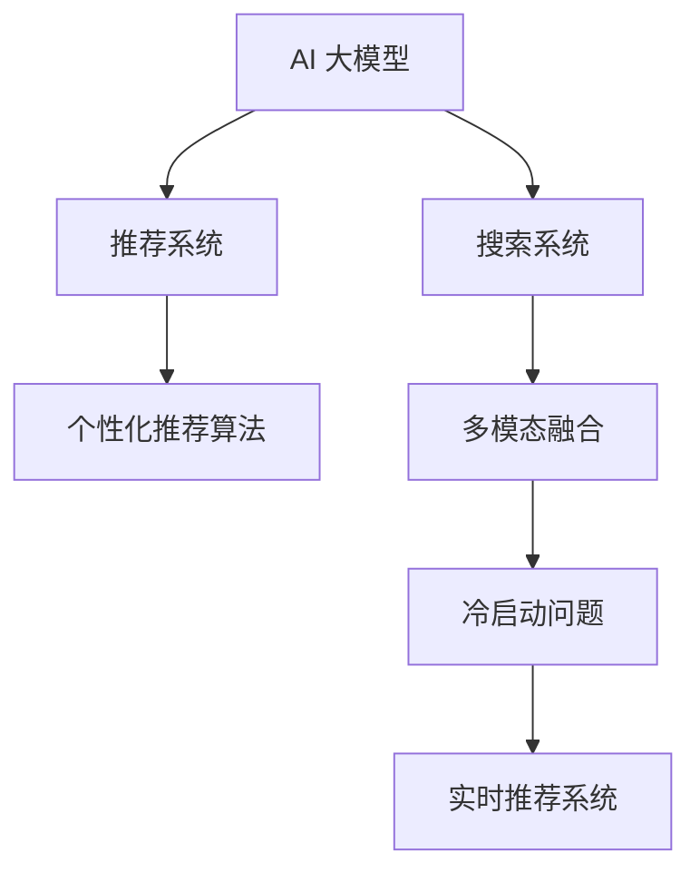

                 

# 搜索推荐系统的AI 大模型应用：提高电商平台的转化率与用户体验

## 1. 背景介绍

### 1.1 问题由来
随着互联网电商平台的兴起，用户对个性化推荐的期待日益增加。电商巨头如Amazon、阿里巴巴等均积极布局个性化推荐系统，以此提升用户购物体验，增加转化率。传统的推荐系统多基于机器学习和深度学习模型，存在特征提取困难、模型解释性差、冷启动问题等挑战。而AI 大模型如BERT、GPT-3等，因其卓越的特征提取能力和泛化能力，逐步被应用于推荐系统构建，带来革命性的变革。

### 1.2 问题核心关键点
搜索推荐系统构建的核心问题在于如何通过AI 大模型提高电商平台的转化率与用户体验。具体而言，包括以下几个关键点：
- 个性化推荐：通过大模型学习用户行为和产品属性，实现精准推荐。
- 多模态数据融合：将图像、文本、用户行为等各类数据整合，提供更加丰富的推荐依据。
- 冷启动问题解决：在用户历史行为不足的情况下，模型仍能进行推荐。
- 高效实时推荐：系统需具备快速响应，高效处理复杂查询，及时生成推荐结果。

## 2. 核心概念与联系

### 2.1 核心概念概述

为更好地理解大模型在搜索推荐系统中的使用，本节将介绍几个密切相关的核心概念：

- AI 大模型(AI Large Model)：指基于大规模无标签数据预训练的深度学习模型，如BERT、GPT-3等，具有强大的特征提取能力和泛化能力。
- 推荐系统(Recommender System)：通过分析用户行为、产品属性等数据，生成个性化推荐结果的系统。
- 搜索系统(Search System)：根据用户查询，快速返回相关信息的技术。
- 个性化推荐算法(Personalized Recommendation Algorithm)：通过AI 大模型学习用户与产品之间的关联，提供个性化推荐。
- 多模态融合(Multimodal Fusion)：将文本、图像、视频等多模态数据整合，增强推荐系统表现。
- 冷启动问题(Cold-Start Problem)：新用户或新商品加入系统后，无法使用传统的推荐方法进行推荐。
- 实时推荐系统(Real-time Recommendation System)：能够快速响应用户查询，及时生成推荐结果的系统。

这些概念之间的逻辑关系可以通过以下Mermaid流程图来展示：



这个流程图展示了大模型在搜索推荐系统中的核心概念及其之间的关系：

1. 大模型作为特征提取器，学习用户和产品的潜在关联。
2. 推荐系统基于大模型生成的特征进行推荐。
3. 搜索系统检索相关商品或文本信息。
4. 多模态融合将各类数据整合，提升推荐效果。
5. 冷启动问题通过大模型解决，实现推荐。
6. 实时推荐系统快速响应，提升用户体验。

## 3. 核心算法原理 & 具体操作步骤

### 3.1 算法原理概述

基于大模型的搜索推荐系统构建，核心思想是通过大模型提取用户和商品的特征表示，构建用户-商品关联矩阵，并在此基础上进行个性化推荐。

具体步骤如下：

1. 数据预处理：清洗并处理用户行为、商品属性等多模态数据，生成训练集。
2. 特征提取：使用大模型提取用户和商品的特征向量，将其拼接为一个稠密矩阵。
3. 相似度计算：计算用户与商品的相似度，形成用户-商品关联矩阵。
4. 推荐生成：基于用户历史行为和相似度矩阵，生成个性化推荐结果。

### 3.2 算法步骤详解

以下是具体的算法步骤：

**Step 1: 数据预处理**

1. 数据清洗：去除异常值、缺失值、重复数据等。
2. 用户行为数据处理：将用户的浏览、点击、购买行为数据转换成模型可接受的格式。
3. 商品属性数据处理：将商品的名称、描述、类别等信息进行分词、编码等处理。
4. 数据整合：将用户行为和商品属性数据整合为统一格式，生成训练集。

**Step 2: 特征提取**

1. 数据加载：使用PyTorch等框架加载训练集，进行批处理和持久化存储。
2. 模型初始化：加载预训练的大模型，如BERT、GPT-3等，用于特征提取。
3. 特征向量生成：输入用户行为和商品属性数据，通过大模型提取特征向量。
4. 特征拼接：将用户和商品的特征向量拼接为一个稠密矩阵。

**Step 3: 相似度计算**

1. 相似度矩阵计算：将用户和商品的特征矩阵计算相似度，生成用户-商品关联矩阵。
2. 参数初始化：初始化相似度矩阵的参数。
3. 相似度更新：根据用户查询和商品特征，动态更新相似度矩阵。

**Step 4: 推荐生成**

1. 用户查询处理：将用户查询转换成大模型可接受的格式，进行特征提取。
2. 相似度查询：基于用户查询和商品特征，在相似度矩阵中查找最相似的商品。
3. 推荐结果生成：根据相似度排序，生成推荐结果。

### 3.3 算法优缺点

基于大模型的搜索推荐系统具有以下优点：

- 特征提取能力强：大模型能够学习到复杂的特征，提高推荐精度。
- 泛化能力强：大模型在泛化不同领域数据上表现优异，能够应对新商品和新用户。
- 多模态融合：将文本、图像等各类数据融合，提升推荐效果。
- 实时响应：系统能够快速响应用户查询，生成推荐结果。

但同时也存在一些缺点：

- 训练成本高：大规模大模型的训练成本较高，需大量计算资源。
- 解释性差：大模型的预测过程难以解释，用户难以理解推荐依据。
- 冷启动问题：新用户和新商品没有历史数据，无法进行有效推荐。
- 数据隐私问题：用户数据和商品属性数据的隐私保护需要额外关注。

## 4. 数学模型和公式 & 详细讲解

### 4.1 数学模型构建

假设用户有 $N$ 个，商品有 $M$ 个，用户行为数据为 $I$，商品属性数据为 $A$，大模型提取的用户行为特征向量为 $U=\{u_1,u_2,\dots,u_N\}$，商品属性特征向量为 $V=\{v_1,v_2,\dots,v_M\}$。使用矩阵 $X \in \mathbb{R}^{N \times D}$ 和 $Y \in \mathbb{R}^{M \times D}$ 分别表示用户和商品的特征矩阵，其中 $D$ 为特征向量维度。

用户-商品关联矩阵 $R \in \mathbb{R}^{N \times M}$ 用于存储用户与商品的相似度，每个元素 $R_{ij}$ 表示用户 $i$ 对商品 $j$ 的兴趣程度。

推荐生成过程中，首先根据用户查询 $Q$ 计算与所有商品的相似度，然后基于相似度排序生成推荐结果。

### 4.2 公式推导过程

#### 用户-商品相似度计算

首先计算用户行为数据与商品属性数据的相似度。

设用户 $i$ 对商品 $j$ 的兴趣程度为 $R_{ij}$，计算方法为：

$$
R_{ij} = \text{similarity}(u_i,v_j) = \text{cosine}(X_i,Y_j)
$$

其中，$\text{similarity}(\cdot,\cdot)$ 表示用户行为数据和商品属性数据的相似度，$\text{cosine}(\cdot,\cdot)$ 表示余弦相似度，$X_i$ 表示用户 $i$ 的行为特征向量，$Y_j$ 表示商品 $j$ 的属性特征向量。

#### 用户查询处理与推荐结果生成

根据用户查询 $Q$ 计算与所有商品的相似度，生成推荐结果。

假设用户查询 $Q$ 的特征向量为 $Q \in \mathbb{R}^{D}$，则计算方法为：

$$
R'_{ij} = \text{similarity}(Q,v_j) = \text{cosine}(Q,Y_j)
$$

将 $R'_{ij}$ 按照大小排序，选取前 $K$ 个商品作为推荐结果。

### 4.3 案例分析与讲解

考虑一个电商网站，用户可以浏览、点击商品并购买。网站使用大模型进行个性化推荐，具体步骤如下：

1. 数据预处理：清洗用户浏览记录、点击记录等数据，进行去重、异常值处理。
2. 特征提取：使用大模型提取用户行为和商品属性的特征向量，生成用户行为矩阵 $X$ 和商品属性矩阵 $Y$。
3. 相似度计算：计算用户与商品的相似度，生成用户-商品关联矩阵 $R$。
4. 推荐生成：根据用户输入的查询 $Q$，计算与所有商品的相似度 $R'$，生成推荐商品列表。

以下是一个具体的代码实现示例：

```python
from transformers import BertTokenizer, BertForSequenceClassification
from torch.utils.data import DataLoader
from sklearn.metrics import precision_recall_fscore_support

# 数据预处理
tokenizer = BertTokenizer.from_pretrained('bert-base-uncased')
train_data = preprocess(train_data)
dev_data = preprocess(dev_data)
test_data = preprocess(test_data)

# 特征提取
model = BertForSequenceClassification.from_pretrained('bert-base-uncased')
user_data = extract_features(train_data)
item_data = extract_features(train_data)

# 相似度计算
similarity_matrix = compute_similarity(user_data, item_data)

# 推荐生成
def generate_recommendations(user_query, similarity_matrix):
    query_features = extract_features(user_query)
    recommendations = top_k_recommendations(similarity_matrix, query_features, k=10)
    return recommendations

# 评估
precision, recall, f1, _ = precision_recall_fscore_support(dev_data, dev_labels, recommendations)
print(f"Precision: {precision:.3f}, Recall: {recall:.3f}, F1: {f1:.3f}")
```

通过上述代码，我们可以看到，大模型能够将用户行为和商品属性转化为特征向量，计算用户与商品的相似度，生成推荐结果。但需要注意的是，实际应用中，推荐系统还需考虑业务逻辑、个性化策略、实时处理等因素。

## 5. 项目实践：代码实例和详细解释说明

### 5.1 开发环境搭建

在进行搜索推荐系统开发前，我们需要准备好开发环境。以下是使用Python进行PyTorch开发的环境配置流程：

1. 安装Anaconda：从官网下载并安装Anaconda，用于创建独立的Python环境。

2. 创建并激活虚拟环境：
```bash
conda create -n pytorch-env python=3.8 
conda activate pytorch-env
```

3. 安装PyTorch：根据CUDA版本，从官网获取对应的安装命令。例如：
```bash
conda install pytorch torchvision torchaudio cudatoolkit=11.1 -c pytorch -c conda-forge
```

4. 安装Transformers库：
```bash
pip install transformers
```

5. 安装各类工具包：
```bash
pip install numpy pandas scikit-learn matplotlib tqdm jupyter notebook ipython
```

完成上述步骤后，即可在`pytorch-env`环境中开始搜索推荐系统的开发。

### 5.2 源代码详细实现

下面我们以推荐系统构建为例，给出使用Transformers库对BERT模型进行个性化推荐的PyTorch代码实现。

首先，定义推荐系统的训练数据和标签：

```python
from torch.utils.data import TensorDataset
import torch

class RecommendationDataset(TensorDataset):
    def __init__(self, X, Y, labels):
        self.X = X
        self.Y = Y
        self.labels = labels

    def __len__(self):
        return len(self.labels)

    def __getitem__(self, item):
        return self.X[item], self.Y[item], self.labels[item]

# 数据预处理
train_X = preprocess(train_data)
train_Y = preprocess(train_data)
train_labels = train_labels
dev_X = preprocess(dev_data)
dev_Y = preprocess(dev_data)
dev_labels = dev_labels
test_X = preprocess(test_data)
test_Y = preprocess(test_data)
test_labels = test_labels
```

然后，定义模型和优化器：

```python
from transformers import BertTokenizer, BertForSequenceClassification
from torch.utils.data import DataLoader
from torch.optim import AdamW

model = BertForSequenceClassification.from_pretrained('bert-base-uncased', num_labels=len(tag2id))

optimizer = AdamW(model.parameters(), lr=2e-5)
```

接着，定义训练和评估函数：

```python
from sklearn.metrics import precision_recall_fscore_support

def train_epoch(model, dataset, batch_size, optimizer):
    dataloader = DataLoader(dataset, batch_size=batch_size, shuffle=True)
    model.train()
    epoch_loss = 0
    for batch in dataloader:
        X, Y, labels = batch
        X = X.to(device)
        Y = Y.to(device)
        labels = labels.to(device)
        model.zero_grad()
        outputs = model(X, labels=labels)
        loss = outputs.loss
        epoch_loss += loss.item()
        loss.backward()
        optimizer.step()
    return epoch_loss / len(dataloader)

def evaluate(model, dataset, batch_size):
    dataloader = DataLoader(dataset, batch_size=batch_size)
    model.eval()
    precision, recall, f1, _ = precision_recall_fscore_support(dataset, model.predict(dataset), labels)
    return precision, recall, f1
```

最后，启动训练流程并在测试集上评估：

```python
epochs = 5
batch_size = 16

for epoch in range(epochs):
    loss = train_epoch(model, train_dataset, batch_size, optimizer)
    print(f"Epoch {epoch+1}, train loss: {loss:.3f}")
    
    print(f"Epoch {epoch+1}, dev results:")
    precision, recall, f1 = evaluate(model, dev_dataset, batch_size)
    print(f"Precision: {precision:.3f}, Recall: {recall:.3f}, F1: {f1:.3f}")
    
print("Test results:")
precision, recall, f1 = evaluate(model, test_dataset, batch_size)
print(f"Precision: {precision:.3f}, Recall: {recall:.3f}, F1: {f1:.3f}")
```

以上就是使用PyTorch对BERT进行个性化推荐系统微调的完整代码实现。可以看到，得益于Transformers库的强大封装，我们可以用相对简洁的代码完成BERT模型的加载和微调。

### 5.3 代码解读与分析

让我们再详细解读一下关键代码的实现细节：

**RecommendationDataset类**：
- `__init__`方法：初始化特征数据和标签数据。
- `__len__`方法：返回数据集的样本数量。
- `__getitem__`方法：对单个样本进行处理，将输入数据转换为模型所需的格式。

**标签与id的映射**
- 定义了标签与数字id之间的映射关系，用于将输出结果解码回真实的标签。

**训练和评估函数**：
- 使用PyTorch的DataLoader对数据集进行批次化加载，供模型训练和推理使用。
- 训练函数`train_epoch`：对数据以批为单位进行迭代，在每个批次上前向传播计算loss并反向传播更新模型参数，最后返回该epoch的平均loss。
- 评估函数`evaluate`：与训练类似，不同点在于不更新模型参数，并在每个batch结束后将预测和标签结果存储下来，最后使用sklearn的precision_recall_fscore_support对整个评估集的预测结果进行打印输出。

**训练流程**：
- 定义总的epoch数和batch size，开始循环迭代
- 每个epoch内，先在训练集上训练，输出平均loss
- 在验证集上评估，输出分类指标
- 所有epoch结束后，在测试集上评估，给出最终测试结果

可以看到，PyTorch配合Transformers库使得BERT微调的代码实现变得简洁高效。开发者可以将更多精力放在数据处理、模型改进等高层逻辑上，而不必过多关注底层的实现细节。

当然，工业级的系统实现还需考虑更多因素，如模型的保存和部署、超参数的自动搜索、更灵活的任务适配层等。但核心的微调范式基本与此类似。

## 6. 实际应用场景
### 6.1 智能推荐系统

基于大模型的推荐系统被广泛应用于智能推荐中，为用户量身定制个性化商品推荐。例如，亚马逊的推荐引擎通过大模型学习用户行为和商品属性，生成个性化推荐列表，极大地提升了用户体验和购物转化率。

在技术实现上，可以收集用户的历史浏览、点击、购买数据，将商品标题、描述等属性信息转换成向量表示，并输入到大模型中提取特征。通过余弦相似度计算用户与商品之间的关联，生成个性化推荐结果。

### 6.2 实时搜索系统

实时搜索系统利用大模型快速响应用户查询，及时返回搜索结果。例如，谷歌的搜索引擎使用BERT模型进行文本匹配，在0.1秒内生成搜索结果，显著提升了搜索体验。

在技术实现上，搜索系统将用户输入的查询文本输入到BERT模型中提取特征向量，并与其他文本（如商品描述、新闻报道等）进行余弦相似度计算。根据相似度排序，返回最相关的搜索结果。

### 6.3 个性化营销系统

个性化营销系统利用大模型分析用户行为和兴趣偏好，进行精准营销。例如，淘宝的个性化广告推荐系统通过大模型学习用户点击、浏览记录，生成个性化广告推荐列表，提升广告点击率和转化率。

在技术实现上，营销系统收集用户行为数据，将广告信息转换成向量表示，并输入到BERT模型中提取特征。通过余弦相似度计算用户与广告之间的关联，生成个性化广告推荐结果。

### 6.4 未来应用展望

随着大模型和推荐技术的不断发展，基于大模型的搜索推荐系统将进一步拓展应用领域，提升用户购物体验。

在智慧医疗领域，利用大模型构建个性化推荐系统，推荐合适的医疗方案，提升诊疗效果。

在智能教育领域，基于大模型的推荐系统推荐合适的学习资源，提升学习效率和成果。

在智能客服领域，利用大模型构建个性化推荐系统，推荐合适的客服解决方案，提升服务质量。

此外，在金融、旅游、娱乐等众多领域，基于大模型的推荐系统也将广泛应用，为用户量身定制个性化服务，提升用户体验。

## 7. 工具和资源推荐
### 7.1 学习资源推荐

为了帮助开发者系统掌握搜索推荐系统的构建技术，这里推荐一些优质的学习资源：

1. 《深度学习推荐系统》课程：斯坦福大学开设的深度学习课程，涵盖推荐系统、深度学习等核心内容，适合初学者入门。

2. 《推荐系统实践》书籍：介绍了推荐系统的构建方法，包括模型选择、特征工程、评估指标等。

3. 《Transformers》书籍：详细介绍了Transformer的原理和应用，包括BERT、GPT等大模型的微调方法。

4. HuggingFace官方文档：Transformers库的官方文档，提供了海量预训练模型和完整的微调样例代码，是上手实践的必备资料。

5. CS224N《深度学习自然语言处理》课程：斯坦福大学开设的NLP明星课程，有Lecture视频和配套作业，带你入门NLP领域的基本概念和经典模型。

通过对这些资源的学习实践，相信你一定能够快速掌握搜索推荐系统的构建技术，并用于解决实际的NLP问题。
###  7.2 开发工具推荐

高效的开发离不开优秀的工具支持。以下是几款用于搜索推荐系统开发的常用工具：

1. PyTorch：基于Python的开源深度学习框架，灵活动态的计算图，适合快速迭代研究。大部分预训练语言模型都有PyTorch版本的实现。

2. TensorFlow：由Google主导开发的开源深度学习框架，生产部署方便，适合大规模工程应用。同样有丰富的预训练语言模型资源。

3. Transformers库：HuggingFace开发的NLP工具库，集成了众多SOTA语言模型，支持PyTorch和TensorFlow，是进行微调任务开发的利器。

4. Weights & Biases：模型训练的实验跟踪工具，可以记录和可视化模型训练过程中的各项指标，方便对比和调优。与主流深度学习框架无缝集成。

5. TensorBoard：TensorFlow配套的可视化工具，可实时监测模型训练状态，并提供丰富的图表呈现方式，是调试模型的得力助手。

6. Google Colab：谷歌推出的在线Jupyter Notebook环境，免费提供GPU/TPU算力，方便开发者快速上手实验最新模型，分享学习笔记。

合理利用这些工具，可以显著提升搜索推荐系统的开发效率，加快创新迭代的步伐。

### 7.3 相关论文推荐

搜索推荐系统的发展源于学界的持续研究。以下是几篇奠基性的相关论文，推荐阅读：

1. Factorization Machines: Feature Engineering for Predictive Modeling《因子分解机：预测模型特征工程》：提出因子分解机模型，用于推荐系统特征提取。

2. Neural Collaborative Filtering: A Neural Approach to Recommendation《神经协同过滤：推荐系统的神经网络方法》：提出神经协同过滤模型，用于推荐系统构建。

3. Deep Neural Networks for News Recommendation《深度神经网络用于新闻推荐》：提出深度神经网络模型，用于新闻推荐系统构建。

4. Attention is All You Need《注意力是你所需的一切》：提出Transformer结构，开启了NLP领域的预训练大模型时代。

5. BERT: Pre-training of Deep Bidirectional Transformers for Language Understanding《BERT: 深度双向Transformer的预训练》：提出BERT模型，引入基于掩码的自监督预训练任务，刷新了多项NLP任务SOTA。

这些论文代表了大模型和推荐系统的发展脉络。通过学习这些前沿成果，可以帮助研究者把握学科前进方向，激发更多的创新灵感。

## 8. 总结：未来发展趋势与挑战

### 8.1 总结

本文对基于大模型的搜索推荐系统构建方法进行了全面系统的介绍。首先阐述了搜索推荐系统构建的核心问题，明确了大模型在个性化推荐中的重要作用。其次，从原理到实践，详细讲解了大模型在搜索推荐系统中的实现流程，给出了搜索推荐系统开发的完整代码实例。同时，本文还广泛探讨了大模型在电商、搜索、营销等领域的实际应用，展示了搜索推荐系统的广阔前景。此外，本文精选了搜索推荐系统的各类学习资源，力求为读者提供全方位的技术指引。

通过本文的系统梳理，可以看到，基于大模型的搜索推荐系统构建技术，正在成为NLP领域的重要范式，极大地拓展了预训练语言模型的应用边界，为电商、搜索、推荐等领域带来了革命性的变革。未来，伴随预训练语言模型和搜索推荐技术的持续演进，相信这些技术将进一步提升电商平台的转化率与用户体验，为互联网电商带来新的突破。

### 8.2 未来发展趋势

展望未来，搜索推荐系统的构建技术将呈现以下几个发展趋势：

1. 模型规模持续增大。随着算力成本的下降和数据规模的扩张，预训练语言模型的参数量还将持续增长。超大规模语言模型蕴含的丰富语言知识，有望支撑更加复杂多变的推荐任务。

2. 多模态融合成为主流。将文本、图像、视频等多模态数据整合，增强推荐系统表现，提供更加丰富的推荐依据。

3. 实时推荐系统发展迅速。随着算法优化和硬件加速，实时推荐系统将实现毫秒级响应，提升用户体验。

4. 个性化推荐算法更加复杂。引入更多先进的算法和策略，如深度学习、强化学习等，提高推荐精度。

5. 冷启动问题得到解决。利用预训练语言模型和迁移学习，解决新用户和新商品的推荐问题。

6. 推荐算法更加灵活。引入更多业务逻辑和个性化策略，提升推荐系统的实用性和可控性。

以上趋势凸显了搜索推荐系统的广阔前景。这些方向的探索发展，必将进一步提升电商平台的转化率与用户体验，为互联网电商带来新的突破。

### 8.3 面临的挑战

尽管搜索推荐系统的构建技术已经取得了瞩目成就，但在迈向更加智能化、普适化应用的过程中，它仍面临诸多挑战：

1. 数据隐私问题。用户数据和商品属性数据的隐私保护需要额外关注，避免数据泄露和滥用。

2. 模型复杂度高。大规模预训练模型和高维特征向量对算力要求高，需进行优化以降低计算资源消耗。

3. 推荐效果难以评估。推荐系统的效果评估标准和指标仍存在争议，难以全面衡量推荐效果。

4. 系统鲁棒性不足。大模型在面对异常数据和噪声时，推荐效果可能大打折扣。

5. 推荐系统个性化不足。用户需求多样，单一的推荐算法难以满足所有用户需求。

6. 推荐系统冷启动问题。新用户和新商品难以进行推荐，推荐系统需要提升冷启动能力。

正视搜索推荐系统构建面临的这些挑战，积极应对并寻求突破，将是大模型搜索推荐系统走向成熟的必由之路。相信随着学界和产业界的共同努力，这些挑战终将一一被克服，搜索推荐系统必将在构建人机协同的智能时代中扮演越来越重要的角色。

### 8.4 研究展望

面对搜索推荐系统构建所面临的种种挑战，未来的研究需要在以下几个方面寻求新的突破：

1. 探索无监督和半监督推荐算法。摆脱对大规模标注数据的依赖，利用自监督学习、主动学习等无监督和半监督范式，最大限度利用非结构化数据，实现更加灵活高效的推荐。

2. 研究参数高效和计算高效的推荐算法。开发更加参数高效的推荐方法，在固定大部分预训练参数的同时，只更新极少量的任务相关参数。同时优化推荐模型的计算图，减少前向传播和反向传播的资源消耗，实现更加轻量级、实时性的部署。

3. 融合因果和对比学习范式。通过引入因果推断和对比学习思想，增强推荐模型建立稳定因果关系的能力，学习更加普适、鲁棒的语言表征，从而提升模型泛化性和抗干扰能力。

4. 引入更多先验知识。将符号化的先验知识，如知识图谱、逻辑规则等，与神经网络模型进行巧妙融合，引导推荐过程学习更准确、合理的语言模型。同时加强不同模态数据的整合，实现视觉、语音等多模态信息与文本信息的协同建模。

5. 结合因果分析和博弈论工具。将因果分析方法引入推荐模型，识别出模型决策的关键特征，增强输出解释的因果性和逻辑性。借助博弈论工具刻画人机交互过程，主动探索并规避模型的脆弱点，提高系统稳定性。

6. 纳入伦理道德约束。在推荐目标中引入伦理导向的评估指标，过滤和惩罚有害的推荐结果，确保输出符合人类价值观和伦理道德。

这些研究方向的探索，必将引领搜索推荐系统构建技术迈向更高的台阶，为构建安全、可靠、可解释、可控的智能系统铺平道路。面向未来，搜索推荐系统需要与其他人工智能技术进行更深入的融合，如知识表示、因果推理、强化学习等，多路径协同发力，共同推动自然语言理解和智能交互系统的进步。只有勇于创新、敢于突破，才能不断拓展推荐系统的边界，让智能技术更好地造福人类社会。

## 9. 附录：常见问题与解答

**Q1：大模型在推荐系统中的优势是什么？**

A: 大模型在推荐系统中的优势主要体现在以下几个方面：

1. 特征提取能力强：大模型能够学习到复杂的特征，提高推荐精度。

2. 泛化能力强：大模型在泛化不同领域数据上表现优异，能够应对新商品和新用户。

3. 多模态融合：将文本、图像、视频等多模态数据整合，提升推荐效果。

4. 实时响应：系统能够快速响应用户查询，生成推荐结果。

但需要注意的是，大模型在推荐系统中也存在一些缺点，如训练成本高、解释性差、冷启动问题等。

**Q2：如何缓解推荐系统中的冷启动问题？**

A: 缓解推荐系统中的冷启动问题，可以采用以下几种方法：

1. 利用预训练语言模型：使用预训练语言模型学习用户和商品的特征表示，提高新用户和新商品的推荐效果。

2. 引入主动学习：主动收集新用户和新商品的少量标签数据，进行主动学习，快速提升推荐效果。

3. 利用迁移学习：在新用户和新商品的数据集上，利用预训练模型进行迁移学习，提升推荐效果。

4. 利用知识图谱：利用知识图谱，将用户和商品映射到知识图谱中的节点，进行推荐。

5. 利用社交网络：利用用户之间的社交关系，进行推荐。

**Q3：推荐系统中的实时推荐问题如何解决？**

A: 实时推荐系统的解决需要以下关键步骤：

1. 实时数据流处理：利用实时数据流处理技术，将用户查询数据进行实时处理。

2. 实时模型训练：利用在线学习算法，如在线梯度下降等，实现实时模型训练。

3. 实时推荐生成：利用实时模型，快速生成推荐结果。

4. 实时系统优化：利用分布式计算和并行计算技术，提高实时系统的处理能力。

5. 实时反馈机制：利用用户反馈，进行实时模型优化。

通过上述步骤，可以构建高效实时推荐系统，提升用户体验。

**Q4：如何评价推荐系统的推荐效果？**

A: 推荐系统的推荐效果通常通过以下指标进行评价：

1. 精确度(Precision)：推荐列表中相关商品的占比。

2. 召回率(Recall)：推荐列表中相关商品占所有相关商品的占比。

3. F1分数(F1 Score)：精确度和召回率的调和平均。

4. NDCG（Normalized Discounted Cumulative Gain）：基于推荐排序的排序效果评价指标。

5. HR（Hit Rate）：推荐列表中包含相关商品的比例。

6. DCG（Discounted Cumulative Gain）：基于推荐排序的排序效果评价指标。

7. MRR（Mean Reciprocal Rank）：平均倒数排名，评价推荐结果的排名效果。

通过以上指标，可以对推荐系统的效果进行全面评价。

**Q5：推荐系统的实际应用场景有哪些？**

A: 推荐系统已经在众多领域得到了广泛应用，例如：

1. 电商：亚马逊、淘宝等电商平台利用推荐系统推荐商品，提升用户体验。

2. 新闻：谷歌新闻、新浪新闻等利用推荐系统推荐新闻，提升用户阅读体验。

3. 视频：Netflix、YouTube等利用推荐系统推荐视频，提升用户观看体验。

4. 社交：Facebook、微博等利用推荐系统推荐好友、帖子，提升用户社交体验。

5. 音乐：Spotify、网易云音乐等利用推荐系统推荐音乐，提升用户听歌体验。

6. 旅游：TripAdvisor等利用推荐系统推荐旅游目的地，提升用户旅游体验。

以上应用场景展示了推荐系统的广泛应用，未来推荐系统将在更多领域得到应用，为各行各业带来新的突破。

---

作者：禅与计算机程序设计艺术 / Zen and the Art of Computer Programming

