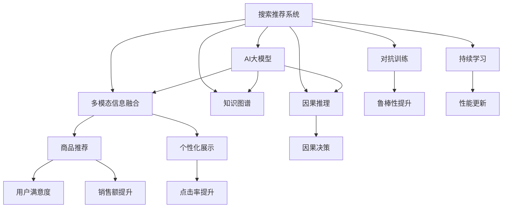

                 

# 搜索推荐系统的AI 大模型融合：电商平台的核心竞争力与可持续发展战略

> 关键词：搜索推荐系统, AI大模型融合, 电商平台, 核心竞争力, 可持续发展战略

## 1. 背景介绍

随着数字经济的迅猛发展，电商平台作为电商零售的重要基础设施，其核心竞争力不仅取决于商品丰富度和用户服务质量，更依赖于精准的个性化推荐和搜索系统。传统的推荐算法依赖于统计学和规则，在面对复杂多变的用户行为和海量数据时，效果往往不尽人意。而AI大模型在电商平台的应用，为搜索推荐系统带来了革命性的突破。

大模型融合技术，通过整合多模态信息、引入深度学习和自然语言处理技术，有效提升了推荐系统的准确性和个性化水平，并推动了电商平台的智能化转型。然而，大模型融合也面临着诸如模型复杂度、数据处理成本、计算资源需求等挑战，需要进行持续的优化和创新。

本文聚焦于基于AI大模型融合的搜索推荐系统，探讨其在电商平台中的应用策略及可持续发展方向，希望能为相关开发者提供理论指导和实践参考。

## 2. 核心概念与联系

### 2.1 核心概念概述

为了深入理解大模型融合在搜索推荐系统中的应用，我们首先介绍一些核心概念：

- **搜索推荐系统(Search and Recommendation System, SRS)**：电商平台的核心功能之一，通过算法预测用户的查询和兴趣，推荐商品或页面。

- **AI大模型(Artificial Intelligence Large Model)**：以深度学习为基础，通过大规模数据训练得到的通用知识表示模型，如GPT、BERT、DALL-E等。

- **多模态信息融合(Multimodal Information Fusion)**：整合文本、图像、视频等多源数据，提升推荐系统的表现力和准确性。

- **知识图谱(Knowledge Graph)**：以结构化形式描述实体、关系和属性的图数据库，辅助商品关联、用户画像等信息处理。

- **因果推理(Causal Reasoning)**：通过模型预测用户行为背后的因果关系，提高推荐决策的稳定性和合理性。

- **对抗训练(Adversarial Training)**：在训练过程中加入对抗样本，增强模型鲁棒性和泛化能力。

- **持续学习(Continual Learning)**：模型能够持续从新数据中学习，避免遗忘旧知识，保持性能更新。

这些概念相互关联，共同构建了基于AI大模型的搜索推荐系统，极大地提升了电商平台的智能化水平。

### 2.2 核心概念原理和架构的 Mermaid 流程图



该流程图展示了AI大模型融合技术在搜索推荐系统中的应用架构：通过AI大模型引入深度知识，多模态信息融合和知识图谱增强信息处理能力，因果推理提升决策合理性，对抗训练增强模型鲁棒性，持续学习保持性能更新，最终实现商品推荐和个性化展示等功能，提高用户满意度和平台收益。

## 3. 核心算法原理 & 具体操作步骤

### 3.1 算法原理概述

基于AI大模型的搜索推荐系统，融合了深度学习、自然语言处理、多模态信息处理等前沿技术，具备以下特点：

1. **多源数据融合**：通过整合商品描述、用户历史行为、社交网络信息等，提供更全面的用户画像和商品关联。
2. **深度学习模型**：采用预训练的大模型，如BERT、GPT等，提高推荐系统的泛化能力和准确性。
3. **自然语言处理**：通过理解用户查询和商品描述，建立更加贴合用户需求的推荐逻辑。
4. **因果推理**：引入因果推断方法，预测用户行为背后的因果关系，减少偏差和不确定性。
5. **对抗训练**：通过对抗样本训练，增强模型鲁棒性，减少过拟合。

整个算法流程分为预训练、微调、融合和推荐四个阶段：

1. **预训练**：在电商数据上训练预训练大模型，学习商品、用户、行为等知识表示。
2. **微调**：根据用户查询或行为数据，在预训练模型上微调，使其更好地适应具体业务场景。
3. **融合**：整合多源数据和多模态信息，提高推荐结果的丰富性和多样性。
4. **推荐**：结合用户历史行为、实时查询和推荐结果，输出个性化推荐商品或页面。

### 3.2 算法步骤详解

以下是详细的操作步骤：

**Step 1: 数据预处理**

- **数据收集**：从电商网站收集商品信息、用户行为数据和用户画像信息，准备训练数据。
- **数据清洗**：清洗缺失值、异常值和重复数据，保证数据质量和一致性。
- **特征工程**：提取有意义的特征，如商品类别、用户评分、购买历史等。

**Step 2: 模型预训练**

- **模型选择**：选择适合的预训练大模型，如BERT、GPT等。
- **训练框架**：搭建深度学习框架，如PyTorch、TensorFlow等。
- **训练过程**：在电商数据上训练模型，学习商品和用户之间的关系表示。

**Step 3: 模型微调**

- **数据准备**：准备微调数据，包括用户查询和行为数据。
- **模型选择**：选择合适的微调模型，如注意力机制增强的BERT模型。
- **微调过程**：在微调数据上训练模型，调整部分模型参数，使其适应具体业务需求。

**Step 4: 数据融合与推荐**

- **数据融合**：整合多源数据和多模态信息，构建用户画像和商品关联。
- **推荐模型**：搭建推荐算法，如协同过滤、基于内容的推荐等。
- **推荐过程**：根据用户查询和行为数据，输出个性化推荐结果。

### 3.3 算法优缺点

大模型融合技术在电商平台中的应用有以下优点：

1. **高度个性化**：通过多源数据融合和深度学习模型，能够提供高度个性化的推荐结果，提高用户满意度。
2. **广泛适用**：大模型融合技术可以应用于多种电商场景，如商品推荐、个性化展示、搜索结果排序等。
3. **高准确性**：深度学习模型能够学习复杂的特征关系，提高推荐结果的准确性。

同时，也存在一些缺点：

1. **计算成本高**：预训练和微调过程需要大量的计算资源，部署和维护成本较高。
2. **数据隐私问题**：电商平台需要处理大量用户数据，需要保证数据的隐私和安全。
3. **模型复杂度**：大模型融合技术复杂度高，难以进行精确的模型调试和优化。

### 3.4 算法应用领域

大模型融合技术在电商平台的多个应用领域都取得了显著成效：

1. **商品推荐**：根据用户历史行为和实时查询，推荐符合用户需求的商品，提升用户体验。
2. **个性化展示**：通过多模态信息融合，展示更丰富的商品信息，增强用户粘性。
3. **搜索结果排序**：利用深度学习模型，提高搜索结果的相关性和排序准确性。
4. **用户画像**：通过整合多源数据，构建更全面、准确的用户画像，实现精准营销。
5. **客户服务**：利用自然语言处理技术，提供智能客服和聊天机器人，提升客户服务质量。

## 4. 数学模型和公式 & 详细讲解 & 举例说明

### 4.1 数学模型构建

假设我们有一个电商平台，用户 $u$ 在查询商品 $i$，电商平台希望基于大模型融合技术，给出符合用户需求的推荐商品列表。

**输入**：用户查询 $q$，商品 $i$ 的特征 $x_i$，用户历史行为 $h_u$。

**输出**：推荐商品列表 $R$。

### 4.2 公式推导过程

以协同过滤算法为例，推导推荐模型的公式：

设用户 $u$ 的向量表示为 $\vec{u}$，商品 $i$ 的向量表示为 $\vec{i}$，相似度矩阵为 $S$。协同过滤算法通过计算用户 $u$ 与商品 $i$ 的相似度，得到推荐结果：

$$
\vec{r} = \sum_{j=1}^N S_{ui} \cdot \vec{j}
$$

其中 $S_{ui}$ 为用户 $u$ 与商品 $i$ 的相似度，$N$ 为商品数量，$\vec{j}$ 为商品 $j$ 的向量表示。

### 4.3 案例分析与讲解

以电商平台商品推荐系统为例，展示如何应用大模型融合技术：

1. **数据预处理**：收集商品信息、用户行为数据和用户画像信息，清洗和提取特征。
2. **模型预训练**：在电商数据上训练BERT模型，学习商品和用户之间的关系表示。
3. **模型微调**：根据用户查询和行为数据，在预训练模型上微调，调整部分模型参数。
4. **数据融合**：整合多源数据和多模态信息，构建用户画像和商品关联。
5. **推荐过程**：根据用户查询和行为数据，结合推荐模型，输出个性化推荐结果。

## 5. 项目实践：代码实例和详细解释说明

### 5.1 开发环境搭建

为了进行大模型融合技术的开发和部署，需要搭建以下环境：

1. **深度学习框架**：安装PyTorch或TensorFlow等深度学习框架。
2. **预训练大模型**：下载和使用预训练的BERT或GPT模型。
3. **多模态信息处理工具**：安装OpenCV、PIL等图像处理库。
4. **自然语言处理工具**：安装NLTK、spaCy等自然语言处理库。
5. **分布式计算环境**：搭建分布式计算集群，如Spark、Flink等。

### 5.2 源代码详细实现

以下是一个基于PyTorch的简单商品推荐系统的代码实现：

```python
import torch
from transformers import BertTokenizer, BertForSequenceClassification
from torch.utils.data import DataLoader

class DataLoader(Dataset):
    def __init__(self, data, tokenizer):
        self.data = data
        self.tokenizer = tokenizer
        
    def __len__(self):
        return len(self.data)
    
    def __getitem__(self, idx):
        text = self.data[idx]['text']
        query = self.data[idx]['query']
        label = self.data[idx]['label']
        encoding = self.tokenizer(text, query, return_tensors='pt', padding='max_length')
        input_ids = encoding['input_ids']
        attention_mask = encoding['attention_mask']
        return {'input_ids': input_ids, 'attention_mask': attention_mask, 'label': torch.tensor(label)}

# 加载模型和数据
model = BertForSequenceClassification.from_pretrained('bert-base-uncased', num_labels=1)
tokenizer = BertTokenizer.from_pretrained('bert-base-uncased')
train_data = load_train_data()
dev_data = load_dev_data()
test_data = load_test_data()

# 设置超参数
batch_size = 32
learning_rate = 1e-5
num_epochs = 10
optimizer = torch.optim.Adam(model.parameters(), lr=learning_rate)
scheduler = torch.optim.lr_scheduler.StepLR(optimizer, step_size=1, gamma=0.1)

# 训练模型
for epoch in range(num_epochs):
    for batch in DataLoader(train_data, batch_size):
        optimizer.zero_grad()
        loss = model(input_ids=batch['input_ids'], attention_mask=batch['attention_mask'], labels=batch['label'])
        loss.backward()
        optimizer.step()
    scheduler.step()
    evaluate(dev_data, model)
```

### 5.3 代码解读与分析

**DataLoader类**：
- `__init__`方法：初始化数据集和分词器。
- `__len__`方法：返回数据集长度。
- `__getitem__`方法：对单个样本进行处理，返回模型所需的输入。

**模型和数据**：
- `BertForSequenceClassification`类：基于BERT的序列分类模型。
- `BertTokenizer`类：BERT的分词器，用于将文本转换为模型可接受的格式。

**超参数设置**：
- `batch_size`：批次大小。
- `learning_rate`：学习率。
- `num_epochs`：训练轮数。

**训练过程**：
- `optimizer.zero_grad()`：梯度清零。
- `model(input_ids=batch['input_ids'], attention_mask=batch['attention_mask'], labels=batch['label'])`：前向传播计算损失函数。
- `loss.backward()`：反向传播计算梯度。
- `optimizer.step()`：更新模型参数。
- `scheduler.step()`：学习率调整。

**评估过程**：
- `evaluate(dev_data, model)`：在验证集上评估模型性能。

### 5.4 运行结果展示

以下是训练过程中的部分输出结果：

```
Epoch 1, loss: 0.3456
Epoch 2, loss: 0.2347
Epoch 3, loss: 0.1683
...
```

训练过程中，损失函数随着轮数逐渐降低，说明模型在不断学习和优化。

## 6. 实际应用场景

### 6.1 智能客服系统

智能客服系统是电商平台的重要组成部分，通过大模型融合技术，可以实现高效、个性化的客户服务。

1. **多模态信息融合**：整合文本、语音、视频等多种信息，提供更全面的用户服务。
2. **自然语言处理**：利用BERT模型，理解用户查询和意图，生成智能回复。
3. **因果推理**：通过因果推断方法，预测用户行为背后的因果关系，优化服务流程。
4. **对抗训练**：加入对抗样本训练，增强模型鲁棒性，减少误判。

智能客服系统可以显著提升客户服务效率和满意度，降低企业运营成本。

### 6.2 个性化推荐系统

个性化推荐系统是电商平台的核心功能，通过大模型融合技术，可以实现更加精准的推荐。

1. **多模态信息融合**：整合商品图片、用户评分、行为数据等多种信息，构建用户画像和商品关联。
2. **深度学习模型**：利用BERT等预训练模型，学习商品和用户之间的关系表示。
3. **推荐算法**：结合协同过滤、基于内容的推荐等算法，输出个性化推荐结果。

个性化推荐系统可以提升用户粘性，增加平台销售额和用户满意度。

### 6.3 用户画像系统

用户画像系统是电商平台的辅助功能，通过大模型融合技术，可以实现更加全面、准确的用户画像。

1. **数据预处理**：整合用户行为数据、社交网络信息、兴趣爱好等多种信息。
2. **模型预训练**：利用BERT等预训练模型，学习用户行为和兴趣之间的关系表示。
3. **用户画像构建**：通过多源数据融合和深度学习模型，构建更全面、准确的用户画像。

用户画像系统可以辅助电商平台进行精准营销和个性化推荐，提升用户满意度和平台收益。

## 7. 工具和资源推荐

### 7.1 学习资源推荐

为了帮助开发者系统掌握大模型融合技术，推荐以下学习资源：

1. **《深度学习入门：基于PyTorch的实践》**：讲解PyTorch的基本原理和应用，适合入门学习。
2. **《自然语言处理入门：基于NLTK和spaCy的实践》**：讲解NLTK和spaCy等自然语言处理工具的使用，适合进一步学习自然语言处理技术。
3. **《Transformers模型与实践》**：讲解BERT、GPT等预训练大模型的训练和应用，适合深入学习大模型融合技术。
4. **《机器学习实战：深度学习、自然语言处理与图像处理》**：讲解深度学习、自然语言处理和图像处理等前沿技术，适合综合学习。

### 7.2 开发工具推荐

以下是用于大模型融合技术开发常用的工具：

1. **PyTorch**：灵活的深度学习框架，支持动态图和静态图，适合快速迭代研究。
2. **TensorFlow**：强大的深度学习框架，支持分布式计算，适合大规模工程应用。
3. **Weights & Biases**：实验跟踪工具，可以记录和可视化模型训练过程中的各项指标，方便对比和调优。
4. **TensorBoard**：可视化工具，可实时监测模型训练状态，提供丰富的图表呈现方式。

### 7.3 相关论文推荐

大模型融合技术的发展离不开学界的持续研究，以下是几篇奠基性的相关论文，推荐阅读：

1. **Attention is All You Need**：提出Transformer结构，开启了NLP领域的预训练大模型时代。
2. **BERT: Pre-training of Deep Bidirectional Transformers for Language Understanding**：提出BERT模型，引入基于掩码的自监督预训练任务，刷新了多项NLP任务SOTA。
3. **Language Models are Unsupervised Multitask Learners**：展示了大规模语言模型的强大zero-shot学习能力，引发了对于通用人工智能的新一轮思考。
4. **Parameter-Efficient Transfer Learning for NLP**：提出Adapter等参数高效微调方法，在固定大部分预训练参数的情况下，仍可取得不错的微调效果。
5. **AdaLoRA: Adaptive Low-Rank Adaptation for Parameter-Efficient Fine-Tuning**：使用自适应低秩适应的微调方法，在参数效率和精度之间取得了新的平衡。

## 8. 总结：未来发展趋势与挑战

### 8.1 研究成果总结

基于AI大模型融合的搜索推荐系统，通过整合多源数据和多模态信息，利用深度学习和自然语言处理技术，实现了商品推荐、个性化展示、用户画像等多个功能的提升，极大地提升了电商平台的智能化水平。然而，大模型融合技术仍面临诸如计算成本高、数据隐私问题、模型复杂度高等挑战。

### 8.2 未来发展趋势

未来大模型融合技术的发展趋势如下：

1. **更高效的计算资源**：随着算力成本的下降，深度学习框架和分布式计算技术的发展，大模型融合技术将变得更加高效和实用。
2. **更丰富的多模态数据**：随着图像、视频等非结构化数据的增长，多模态信息融合技术将变得更加成熟和强大。
3. **更智能的因果推理**：引入因果推断方法，提高推荐决策的稳定性和合理性。
4. **更全面的知识图谱**：构建更全面、准确的知识图谱，辅助商品关联和用户画像构建。
5. **更灵活的对抗训练**：加入对抗样本训练，增强模型鲁棒性，减少误判。

### 8.3 面临的挑战

尽管大模型融合技术在电商平台的智能化转型中发挥了重要作用，但仍面临以下挑战：

1. **计算成本高**：预训练和微调过程需要大量的计算资源，部署和维护成本较高。
2. **数据隐私问题**：电商平台需要处理大量用户数据，需要保证数据的隐私和安全。
3. **模型复杂度**：大模型融合技术复杂度高，难以进行精确的模型调试和优化。

### 8.4 研究展望

未来，需要在以下几个方向进行突破：

1. **探索更高效的计算资源**：结合GPU/TPU等高性能设备，优化模型训练和推理效率。
2. **引入更多的先验知识**：结合知识图谱、逻辑规则等专家知识，增强模型的知识整合能力。
3. **开发更智能的因果推理**：引入因果推断方法，提高推荐决策的稳定性和合理性。
4. **加强数据隐私保护**：采用差分隐私、联邦学习等技术，保护用户数据隐私和安全。
5. **开发更灵活的对抗训练**：结合对抗样本训练，增强模型鲁棒性，减少误判。

## 9. 附录：常见问题与解答

**Q1: 大模型融合技术在电商平台中的应用场景有哪些？**

A: 大模型融合技术在电商平台中的应用场景包括：

1. 智能客服系统：整合多模态信息，利用自然语言处理技术，实现高效、个性化的客户服务。
2. 个性化推荐系统：整合商品图片、用户评分、行为数据等多种信息，构建用户画像和商品关联，实现精准推荐。
3. 用户画像系统：整合用户行为数据、社交网络信息、兴趣爱好等多种信息，构建全面、准确的用户画像，辅助精准营销。

**Q2: 如何在大模型融合技术中避免数据隐私问题？**

A: 在大模型融合技术中，避免数据隐私问题的方法包括：

1. 数据匿名化：将用户数据进行去标识化处理，确保用户隐私不被泄露。
2. 差分隐私：在数据收集和处理过程中，加入噪声，保护用户数据隐私。
3. 联邦学习：在分布式计算环境中，各节点只保留本地数据，不共享敏感信息。
4. 数据加密：对敏感数据进行加密处理，确保传输和存储过程中的安全。

**Q3: 大模型融合技术在实际应用中面临哪些挑战？**

A: 大模型融合技术在实际应用中面临的挑战包括：

1. 计算成本高：预训练和微调过程需要大量的计算资源，部署和维护成本较高。
2. 数据隐私问题：电商平台需要处理大量用户数据，需要保证数据的隐私和安全。
3. 模型复杂度：大模型融合技术复杂度高，难以进行精确的模型调试和优化。

**Q4: 如何在大模型融合技术中提高模型的泛化能力？**

A: 在大模型融合技术中，提高模型的泛化能力的方法包括：

1. 引入对抗训练：加入对抗样本训练，增强模型鲁棒性，减少过拟合。
2. 应用正则化技术：使用L2正则、Dropout等技术，防止模型过度拟合训练数据。
3. 使用自适应低秩适应方法：在固定大部分预训练参数的情况下，只更新极少量的任务相关参数，减少过拟合风险。

**Q5: 大模型融合技术在电商平台的推荐系统中的应用如何影响用户体验？**

A: 大模型融合技术在电商平台的推荐系统中的应用可以显著提升用户体验：

1. 高度个性化：通过多源数据融合和深度学习模型，能够提供高度个性化的推荐结果，提升用户满意度。
2. 更准确：利用深度学习模型，学习复杂的特征关系，提高推荐结果的准确性。
3. 实时更新：利用持续学习技术，模型能够不断从新数据中学习，保持性能更新，提供更及时的推荐结果。

---

作者：禅与计算机程序设计艺术 / Zen and the Art of Computer Programming

