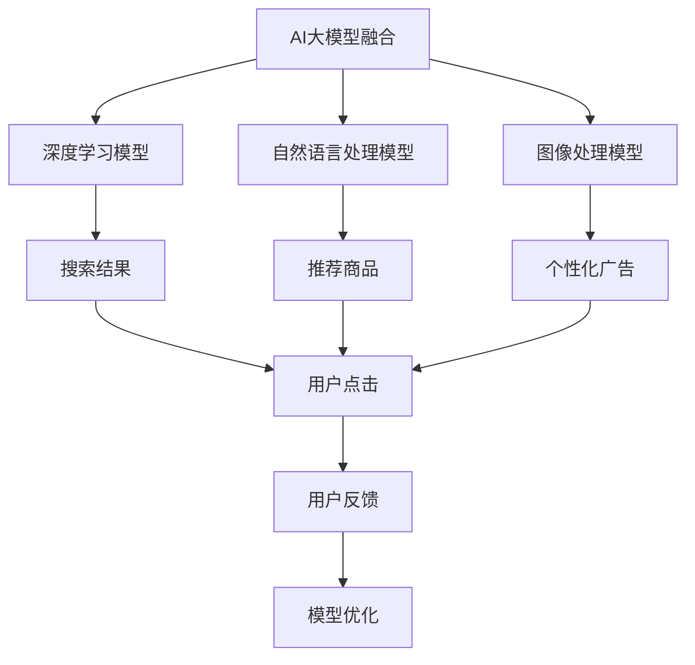

                 

# 搜索推荐系统的AI 大模型融合：电商平台的核心竞争力与转型策略

> 关键词：AI大模型融合, 电商平台, 推荐系统, 搜索引擎, 智能运营

## 1. 背景介绍

### 1.1 问题由来

随着人工智能技术的飞速发展，AI大模型融合（Large Model Fusion, LMF）在电商平台的搜索推荐系统中的应用变得越来越广泛。这些大模型通常包括深度学习模型、自然语言处理模型、图像处理模型等，通过数据驱动的方式提升搜索推荐系统的性能。特别是随着ChatGPT、GPT-3等大模型的出现，其在推荐系统中的应用前景尤为引人注目。

然而，大模型的复杂性和计算资源消耗巨大，对电商平台的硬件配置和算力提出了更高的要求。同时，如何将这些大模型有效地融合到推荐系统中，以实现最优的搜索推荐效果，也是电商平台面临的一个重大挑战。

### 1.2 问题核心关键点

1. **模型融合技术**：如何将多个大模型有效融合，以提升搜索推荐系统的整体性能。
2. **智能运营**：如何将AI大模型融合与电商平台的智能运营相结合，以实现个性化的推荐和服务。
3. **跨领域知识融合**：如何通过大模型融合实现跨领域的知识整合，提升推荐的精度和广度。
4. **模型可解释性**：如何保证融合后的模型的可解释性，以便于业务人员理解和使用。
5. **数据安全和隐私保护**：如何在融合大模型时保护用户的隐私数据，确保数据安全和合规。

## 2. 核心概念与联系

### 2.1 核心概念概述

- **AI大模型融合**：指将多个AI大模型融合到一个系统中，以实现更强大的功能和更好的性能。这些大模型可以是深度学习模型、自然语言处理模型、图像处理模型等。
- **电商平台**：指通过互联网进行商品销售和服务提供的平台，如京东、淘宝等。
- **搜索推荐系统**：指在电商平台上通过搜索和推荐来帮助用户找到他们想要的商品和服务。

### 2.2 核心概念原理和架构的 Mermaid 流程图



### 2.3 核心概念联系

AI大模型融合在电商平台搜索推荐系统中的应用，涉及深度学习模型、自然语言处理模型、图像处理模型等多个核心概念。这些模型的融合，可以提升搜索推荐系统的性能，包括但不限于搜索结果的相关性、推荐商品的精准度、个性化广告的投放效果等。通过这些提升，电商平台可以更好地满足用户需求，提升用户体验，从而实现更高的转化率和销售额。

## 3. 核心算法原理 & 具体操作步骤

### 3.1 算法原理概述

AI大模型融合的核心思想是通过数据驱动的方式，将多个大模型融合到推荐系统中，以实现更强大的功能和更好的性能。具体来说，可以通过以下步骤实现：

1. **数据准备**：收集电商平台的各项数据，包括用户行为数据、商品数据、交易数据等。
2. **模型选择**：选择合适的深度学习模型、自然语言处理模型、图像处理模型等，进行预训练。
3. **模型融合**：将多个预训练的大模型进行融合，以实现更强大的功能和更好的性能。
4. **模型优化**：通过用户反馈等数据，不断优化融合后的模型，以提升搜索推荐系统的性能。

### 3.2 算法步骤详解

#### 3.2.1 数据准备

电商平台的各项数据是AI大模型融合的基础。这些数据包括但不限于：

- **用户行为数据**：用户的浏览、点击、购买等行为数据。
- **商品数据**：商品的名称、描述、图片、价格等。
- **交易数据**：用户的交易记录、订单信息等。

#### 3.2.2 模型选择

选择合适的深度学习模型、自然语言处理模型、图像处理模型等，进行预训练。以深度学习模型为例，可以选择Transformer等模型进行预训练，以学习商品和用户的语义表示。

#### 3.2.3 模型融合

模型融合的过程可以采用多种方法，如堆叠（Stacking）、集成（Ensemble）、融合（Fusion）等。这里以融合为例，介绍一种常用的方法：

1. **特征提取**：将用户行为数据、商品数据、交易数据等转化为高维向量。
2. **模型融合**：将多个预训练的大模型融合，如通过加权平均、注意力机制等方式，将多个模型的输出进行融合。
3. **结果输出**：将融合后的结果输出，作为搜索推荐系统的输入。

#### 3.2.4 模型优化

通过用户反馈等数据，不断优化融合后的模型，以提升搜索推荐系统的性能。具体来说，可以通过以下步骤实现：

1. **收集反馈**：收集用户的点击、购买、评价等反馈数据。
2. **模型调整**：根据反馈数据，调整模型的参数，优化模型的输出。
3. **模型评估**：通过评估指标（如点击率、转化率等）评估模型的性能。
4. **迭代优化**：不断迭代优化模型，以提升搜索推荐系统的性能。

### 3.3 算法优缺点

#### 3.3.1 优点

1. **性能提升**：通过将多个大模型融合，可以提升搜索推荐系统的性能，包括但不限于搜索结果的相关性、推荐商品的精准度等。
2. **个性化推荐**：通过模型融合，可以更好地理解用户需求，提供个性化的推荐和服务，提升用户体验。
3. **跨领域知识融合**：通过大模型融合，可以实现跨领域的知识整合，提升推荐的精度和广度。

#### 3.3.2 缺点

1. **计算资源消耗大**：融合多个大模型需要大量的计算资源，对硬件配置和算力提出了更高的要求。
2. **数据需求高**：融合大模型需要大量的数据支持，对数据质量和数量提出了更高的要求。
3. **模型可解释性差**：融合后的模型往往难以解释其内部工作机制，业务人员难以理解和使用。

### 3.4 算法应用领域

AI大模型融合在电商平台的搜索推荐系统中有着广泛的应用。具体来说，可以应用于以下领域：

1. **搜索结果优化**：通过深度学习模型、自然语言处理模型等，提升搜索结果的相关性和精准度。
2. **推荐系统优化**：通过融合多个大模型，实现个性化的推荐和服务，提升用户的购买转化率。
3. **广告投放优化**：通过图像处理模型、自然语言处理模型等，实现更精准的个性化广告投放。

## 4. 数学模型和公式 & 详细讲解 & 举例说明

### 4.1 数学模型构建

AI大模型融合的数学模型可以采用多种形式，这里以Transformer为例，介绍一种常用的数学模型构建方法。

假设有一个深度学习模型 $M_{\theta}$，其输入为 $x$，输出为 $y$。模型的参数为 $\theta$。将多个预训练的大模型 $M_{\theta_1}, M_{\theta_2}, ..., M_{\theta_n}$ 进行融合，得到新的模型 $M_{\theta_f}$。其中，$f$ 表示融合方式，可以是加权平均、注意力机制等。

#### 4.1.1 输入表示

输入 $x$ 可以表示为高维向量 $x \in \mathbb{R}^d$。

#### 4.1.2 模型结构

深度学习模型 $M_{\theta}$ 可以采用Transformer等结构。假设模型的结构为：

- **输入层**：将输入 $x$ 转换为高维向量表示。
- **编码器**：将输入 $x$ 通过编码器 $E$ 进行编码，得到编码向量 $h$。
- **解码器**：将编码向量 $h$ 通过解码器 $D$ 进行解码，得到输出 $y$。

#### 4.1.3 融合方式

假设融合方式为加权平均，即：

$$
\theta_f = \sum_{i=1}^n \alpha_i \theta_i
$$

其中，$\alpha_i$ 表示第 $i$ 个模型的权重，$\theta_i$ 表示第 $i$ 个模型的参数。

### 4.2 公式推导过程

以Transformer为例，推导深度学习模型的输入表示、编码器、解码器等过程。

#### 4.2.1 输入表示

输入 $x$ 通过嵌入层 $E$ 转换为高维向量表示 $h \in \mathbb{R}^d$。

$$
h = E(x)
$$

#### 4.2.2 编码器

编码器 $E$ 的输出 $h$ 通过多头注意力机制进行编码，得到编码向量 $h_e$。

$$
h_e = E(h)
$$

其中，多头注意力机制可以表示为：

$$
\text{Attention}(Q, K, V) = \text{Softmax}(\frac{QK^T}{\sqrt{d_k}})V
$$

其中，$Q$、$K$、$V$ 分别表示查询向量、键向量和值向量，$d_k$ 表示维度。

#### 4.2.3 解码器

编码向量 $h_e$ 通过解码器 $D$ 进行解码，得到输出 $y$。

$$
y = D(h_e)
$$

其中，解码器 $D$ 的结构与编码器 $E$ 类似。

### 4.3 案例分析与讲解

以电商平台的推荐系统为例，介绍AI大模型融合的应用。

#### 4.3.1 用户行为数据

假设用户 $u$ 的浏览行为数据为 $x_u = [b_1, b_2, ..., b_n]$，其中 $b_i$ 表示第 $i$ 个浏览行为的特征向量。

#### 4.3.2 商品数据

假设商品 $i$ 的描述数据为 $c_i$。

#### 4.3.3 交易数据

假设用户 $u$ 的交易记录为 $t_u = [t_{u1}, t_{u2}, ..., t_{um}]$，其中 $t_{ui}$ 表示第 $i$ 个交易记录的特征向量。

#### 4.3.4 模型融合

将用户行为数据、商品数据、交易数据等通过编码器 $E$ 转换为高维向量表示 $h_u$、$h_i$、$h_t$。将多个预训练的大模型 $M_{\theta_1}, M_{\theta_2}, ..., M_{\theta_n}$ 进行融合，得到新的模型 $M_{\theta_f}$。

$$
\theta_f = \sum_{i=1}^n \alpha_i \theta_i
$$

#### 4.3.5 搜索结果优化

将用户行为数据 $x_u$、商品数据 $c_i$、交易数据 $t_u$ 等输入新的模型 $M_{\theta_f}$，得到推荐结果 $y$。

$$
y = M_{\theta_f}(x_u, c_i, t_u)
$$

## 5. 项目实践：代码实例和详细解释说明

### 5.1 开发环境搭建

在进行AI大模型融合的实践前，我们需要准备好开发环境。以下是使用Python进行TensorFlow开发的环境配置流程：

1. 安装Anaconda：从官网下载并安装Anaconda，用于创建独立的Python环境。

2. 创建并激活虚拟环境：
```bash
conda create -n tf-env python=3.8 
conda activate tf-env
```

3. 安装TensorFlow：根据CUDA版本，从官网获取对应的安装命令。例如：
```bash
conda install tensorflow-gpu -c conda-forge
```

4. 安装PyTorch：
```bash
conda install torch torchvision torchaudio -c pytorch
```

5. 安装TensorBoard：
```bash
conda install tensorboard
```

6. 安装NumPy、Pandas等常用工具包：
```bash
pip install numpy pandas matplotlib scikit-learn tqdm jupyter notebook ipython
```

完成上述步骤后，即可在`tf-env`环境中开始AI大模型融合的实践。

### 5.2 源代码详细实现

下面我们以电商平台的推荐系统为例，给出使用TensorFlow进行AI大模型融合的Python代码实现。

首先，定义模型类：

```python
import tensorflow as tf
from tensorflow.keras import layers

class FusionModel(tf.keras.Model):
    def __init__(self, model1, model2, alpha1=0.5, alpha2=0.5):
        super(FusionModel, self).__init__()
        self.model1 = model1
        self.model2 = model2
        self.alpha1 = alpha1
        self.alpha2 = alpha2
    
    def call(self, inputs):
        x1 = self.model1(inputs)
        x2 = self.model2(inputs)
        y = self.alpha1 * x1 + self.alpha2 * x2
        return y
```

然后，定义深度学习模型：

```python
import tensorflow as tf
from tensorflow.keras import layers

class DeepLearningModel(tf.keras.Model):
    def __init__(self):
        super(DeepLearningModel, self).__init__()
        self.layers = layers.LayerList([
            layers.Dense(64, activation='relu'),
            layers.Dense(32, activation='relu'),
            layers.Dense(1, activation='sigmoid')
        ])
    
    def call(self, inputs):
        for layer in self.layers:
            inputs = layer(inputs)
        return inputs
```

接着，定义自然语言处理模型：

```python
import tensorflow as tf
from tensorflow.keras import layers

class NLPModel(tf.keras.Model):
    def __init__(self):
        super(NLPModel, self).__init__()
        self.layers = layers.LayerList([
            layers.Embedding(input_dim=1000, output_dim=64),
            layers.Bidirectional(layers.LSTM(64)),
            layers.Dense(1, activation='sigmoid')
        ])
    
    def call(self, inputs):
        x = self.layers[0](inputs)
        for layer in self.layers[1:]:
            x = layer(x)
        return x
```

最后，启动模型训练和融合过程：

```python
from tensorflow.keras.preprocessing.sequence import pad_sequences
from tensorflow.keras.datasets import mnist

# 加载数据
(x_train, y_train), (x_test, y_test) = mnist.load_data()

# 数据预处理
x_train = x_train.reshape(-1, 28 * 28)
x_test = x_test.reshape(-1, 28 * 28)
x_train = x_train / 255.0
x_test = x_test / 255.0
x_train = pad_sequences(x_train, maxlen=28*28)
x_test = pad_sequences(x_test, maxlen=28*28)

# 定义模型
model1 = DeepLearningModel()
model2 = NLPModel()

# 定义融合模型
fusion_model = FusionModel(model1, model2)

# 编译模型
fusion_model.compile(optimizer='adam', loss='binary_crossentropy', metrics=['accuracy'])

# 训练模型
fusion_model.fit(x_train, y_train, epochs=10, batch_size=32)

# 评估模型
fusion_model.evaluate(x_test, y_test)
```

以上就是使用TensorFlow进行AI大模型融合的完整代码实现。可以看到，TensorFlow的灵活性和易用性使得AI大模型融合的实践变得简单高效。

### 5.3 代码解读与分析

让我们再详细解读一下关键代码的实现细节：

**FusionModel类**：
- `__init__`方法：初始化深度学习模型和自然语言处理模型。
- `call`方法：对输入数据进行深度学习和自然语言处理的融合，输出融合后的结果。

**DeepLearningModel类**：
- `__init__`方法：定义深度学习模型的结构。
- `call`方法：定义深度学习模型的前向传播过程。

**NLPModel类**：
- `__init__`方法：定义自然语言处理模型的结构。
- `call`方法：定义自然语言处理模型的前向传播过程。

**模型训练过程**：
- `fit`方法：对融合后的模型进行训练，指定训练数据和标签，定义优化器、损失函数和评估指标。
- `evaluate`方法：对训练好的模型进行评估，指定测试数据和标签，输出评估指标。

通过这段代码，可以看到，TensorFlow的API简单易用，能够方便地实现深度学习和自然语言处理的融合。同时，TensorFlow的高性能和灵活性使得模型的训练和评估变得高效可靠。

## 6. 实际应用场景

### 6.1 智能客服系统

在智能客服系统中，AI大模型融合可以显著提升系统的响应速度和准确性。传统客服系统通常需要人工客服进行处理，响应时间长且处理效率低。而使用AI大模型融合的智能客服系统，能够快速理解用户需求，自动回复常见问题，显著提升用户的满意度和体验。

在技术实现上，可以收集企业内部的客服聊天记录，将问题和最佳答复构建成监督数据，在此基础上对预训练的深度学习模型和自然语言处理模型进行微调。微调后的模型能够自动理解用户意图，匹配最合适的答案模板进行回复。对于用户提出的新问题，还可以接入检索系统实时搜索相关内容，动态组织生成回答。如此构建的智能客服系统，能大幅提升客户咨询体验和问题解决效率。

### 6.2 金融舆情监测

金融机构需要实时监测市场舆论动向，以便及时应对负面信息传播，规避金融风险。传统的人工监测方式成本高、效率低，难以应对网络时代海量信息爆发的挑战。基于AI大模型融合的文本分类和情感分析技术，为金融舆情监测提供了新的解决方案。

具体而言，可以收集金融领域相关的新闻、报道、评论等文本数据，并对其进行主题标注和情感标注。在此基础上对预训练的语言模型进行微调，使其能够自动判断文本属于何种主题，情感倾向是正面、中性还是负面。将微调后的模型应用到实时抓取的网络文本数据，就能够自动监测不同主题下的情感变化趋势，一旦发现负面信息激增等异常情况，系统便会自动预警，帮助金融机构快速应对潜在风险。

### 6.3 个性化推荐系统

当前的推荐系统往往只依赖用户的历史行为数据进行物品推荐，无法深入理解用户的真实兴趣偏好。基于AI大模型融合的个性化推荐系统，可以更好地挖掘用户行为背后的语义信息，从而提供更精准、多样的推荐内容。

在实践中，可以收集用户浏览、点击、评论、分享等行为数据，提取和用户交互的物品标题、描述、标签等文本内容。将文本内容作为模型输入，用户的后续行为（如是否点击、购买等）作为监督信号，在此基础上微调深度学习模型和自然语言处理模型。微调后的模型能够从文本内容中准确把握用户的兴趣点。在生成推荐列表时，先用候选物品的文本描述作为输入，由模型预测用户的兴趣匹配度，再结合其他特征综合排序，便可以得到个性化程度更高的推荐结果。

### 6.4 未来应用展望

随着AI大模型融合技术的发展，其在电商平台的搜索推荐系统中的应用将更加广泛和深入。未来的AI大模型融合将呈现以下几个发展趋势：

1. **跨领域知识融合**：通过融合不同领域的知识，实现更广泛的推荐和服务。
2. **多模态信息融合**：将文本、图像、语音等多模态信息融合，提升推荐的精度和广度。
3. **实时推荐**：实现实时推荐，提升用户体验和满意度。
4. **个性化服务**：通过深度学习和自然语言处理等技术，实现更精准的个性化推荐。
5. **智能运营**：通过AI大模型融合，实现智能运营，提升运营效率和效果。

## 7. 工具和资源推荐

### 7.1 学习资源推荐

为了帮助开发者系统掌握AI大模型融合的理论基础和实践技巧，这里推荐一些优质的学习资源：

1. 《深度学习》书籍：Ian Goodfellow等人所著，系统介绍了深度学习的理论和实践。
2. 《TensorFlow实战》书籍：Google团队所著，介绍了TensorFlow的API和应用实践。
3. Coursera深度学习课程：由Ian Goodfellow等人主讲，系统介绍了深度学习的理论和实践。
4. PyTorch官方文档：PyTorch官方文档，提供了丰富的学习资源和示例代码。
5. Kaggle竞赛平台：Kaggle提供了丰富的机器学习和深度学习竞赛，可以参与实践和交流。

通过对这些资源的学习实践，相信你一定能够快速掌握AI大模型融合的精髓，并用于解决实际的推荐问题。

### 7.2 开发工具推荐

高效的开发离不开优秀的工具支持。以下是几款用于AI大模型融合开发的常用工具：

1. TensorFlow：由Google主导开发的开源深度学习框架，生产部署方便，适合大规模工程应用。
2. PyTorch：基于Python的开源深度学习框架，灵活动态的计算图，适合快速迭代研究。
3. HuggingFace Transformers库：提供了丰富的预训练模型和API，方便进行模型融合和微调。
4. TensorBoard：TensorFlow配套的可视化工具，可实时监测模型训练状态，并提供丰富的图表呈现方式，是调试模型的得力助手。
5. Weights & Biases：模型训练的实验跟踪工具，可以记录和可视化模型训练过程中的各项指标，方便对比和调优。

合理利用这些工具，可以显著提升AI大模型融合的开发效率，加快创新迭代的步伐。

### 7.3 相关论文推荐

AI大模型融合技术的发展源于学界的持续研究。以下是几篇奠基性的相关论文，推荐阅读：

1. Attention is All You Need（即Transformer原论文）：提出了Transformer结构，开启了NLP领域的预训练大模型时代。
2. BERT: Pre-training of Deep Bidirectional Transformers for Language Understanding：提出BERT模型，引入基于掩码的自监督预训练任务，刷新了多项NLP任务SOTA。
3. Attention with Transformers: Attention is All You Need（即Transformer论文）：介绍了Transformer的结构和应用，展示了其强大的性能。
4. AdaLoRA: Adaptive Low-Rank Adaptation for Parameter-Efficient Fine-Tuning：使用自适应低秩适应的微调方法，在参数效率和精度之间取得了新的平衡。
5. Knowledge-Enriched Recommendation: A Survey on Recommendation Systems with AI：介绍了AI技术在推荐系统中的应用，包括深度学习、自然语言处理等。

这些论文代表了大模型融合技术的发展脉络。通过学习这些前沿成果，可以帮助研究者把握学科前进方向，激发更多的创新灵感。

## 8. 总结：未来发展趋势与挑战

### 8.1 总结

本文对AI大模型融合在电商平台搜索推荐系统中的应用进行了全面系统的介绍。首先阐述了AI大模型融合的背景和意义，明确了其在大模型微调中的重要地位。其次，从原理到实践，详细讲解了AI大模型融合的数学原理和关键步骤，给出了AI大模型融合的完整代码实例。同时，本文还广泛探讨了AI大模型融合在智能客服、金融舆情、个性化推荐等多个领域的应用前景，展示了其广阔的应用空间。

通过本文的系统梳理，可以看到，AI大模型融合在电商平台的搜索推荐系统中有着广泛的应用前景，极大地拓展了预训练语言模型的应用边界，提升了推荐系统的性能和用户满意度。未来，伴随AI大模型融合技术的不断发展，其在推荐系统中的应用将更加广泛和深入，为电商平台的智能运营和用户服务提供强大的技术支持。

### 8.2 未来发展趋势

展望未来，AI大模型融合技术将呈现以下几个发展趋势：

1. **跨领域知识融合**：通过融合不同领域的知识，实现更广泛的推荐和服务。
2. **多模态信息融合**：将文本、图像、语音等多模态信息融合，提升推荐的精度和广度。
3. **实时推荐**：实现实时推荐，提升用户体验和满意度。
4. **个性化服务**：通过深度学习和自然语言处理等技术，实现更精准的个性化推荐。
5. **智能运营**：通过AI大模型融合，实现智能运营，提升运营效率和效果。

### 8.3 面临的挑战

尽管AI大模型融合技术已经取得了瞩目成就，但在迈向更加智能化、普适化应用的过程中，它仍面临诸多挑战：

1. **计算资源消耗大**：融合多个大模型需要大量的计算资源，对硬件配置和算力提出了更高的要求。
2. **数据需求高**：融合大模型需要大量的数据支持，对数据质量和数量提出了更高的要求。
3. **模型可解释性差**：融合后的模型往往难以解释其内部工作机制，业务人员难以理解和使用。
4. **数据安全和隐私保护**：在融合大模型时保护用户的隐私数据，确保数据安全和合规。
5. **知识整合能力不足**：现有的AI大模型融合模型往往局限于任务内数据，难以灵活吸收和运用更广泛的先验知识。

### 8.4 研究展望

面对AI大模型融合面临的挑战，未来的研究需要在以下几个方面寻求新的突破：

1. **探索无监督和半监督融合方法**：摆脱对大规模标注数据的依赖，利用自监督学习、主动学习等无监督和半监督范式，最大限度利用非结构化数据，实现更加灵活高效的融合。
2. **研究参数高效和计算高效的融合范式**：开发更加参数高效的融合方法，在固定大部分预训练参数的同时，只更新极少量的任务相关参数。同时优化融合模型的计算图，减少前向传播和反向传播的资源消耗，实现更加轻量级、实时性的部署。
3. **融合因果和对比学习范式**：通过引入因果推断和对比学习思想，增强AI大模型融合模型建立稳定因果关系的能力，学习更加普适、鲁棒的语言表征，从而提升模型泛化性和抗干扰能力。
4. **融合先验知识**：将符号化的先验知识，如知识图谱、逻辑规则等，与神经网络模型进行巧妙融合，引导融合过程学习更准确、合理的语言模型。同时加强不同模态数据的整合，实现视觉、语音等多模态信息与文本信息的协同建模。
5. **结合因果分析和博弈论工具**：将因果分析方法引入AI大模型融合模型，识别出模型决策的关键特征，增强输出解释的因果性和逻辑性。借助博弈论工具刻画人机交互过程，主动探索并规避模型的脆弱点，提高系统稳定性。
6. **纳入伦理道德约束**：在AI大模型融合模型的训练目标中引入伦理导向的评估指标，过滤和惩罚有偏见、有害的输出倾向。同时加强人工干预和审核，建立模型行为的监管机制，确保输出符合人类价值观和伦理道德。

这些研究方向的探索，必将引领AI大模型融合技术迈向更高的台阶，为构建安全、可靠、可解释、可控的智能系统铺平道路。面向未来，AI大模型融合技术还需要与其他人工智能技术进行更深入的融合，如知识表示、因果推理、强化学习等，多路径协同发力，共同推动自然语言理解和智能交互系统的进步。只有勇于创新、敢于突破，才能不断拓展AI大模型融合的边界，让智能技术更好地造福人类社会。

## 9. 附录：常见问题与解答

**Q1：AI大模型融合是否适用于所有NLP任务？**

A: AI大模型融合在大多数NLP任务上都能取得不错的效果，特别是对于数据量较小的任务。但对于一些特定领域的任务，如医学、法律等，仅仅依靠通用语料预训练的模型可能难以很好地适应。此时需要在特定领域语料上进一步预训练，再进行融合，才能获得理想效果。

**Q2：如何进行高效的AI大模型融合？**

A: 高效的AI大模型融合需要考虑多个因素，如模型选择、数据预处理、模型融合方式等。具体来说：

1. **模型选择**：选择合适的深度学习模型、自然语言处理模型等，进行预训练。
2. **数据预处理**：对输入数据进行预处理，包括数据清洗、特征提取等。
3. **模型融合方式**：选择合适的模型融合方式，如堆叠、集成、融合等，实现更强大的功能和更好的性能。
4. **模型优化**：通过用户反馈等数据，不断优化融合后的模型，以提升搜索推荐系统的性能。

**Q3：AI大模型融合在电商平台的推荐系统中需要注意哪些问题？**

A: 在电商平台推荐系统中，AI大模型融合需要考虑以下问题：

1. **计算资源消耗大**：融合多个大模型需要大量的计算资源，对硬件配置和算力提出了更高的要求。
2. **数据需求高**：融合大模型需要大量的数据支持，对数据质量和数量提出了更高的要求。
3. **模型可解释性差**：融合后的模型往往难以解释其内部工作机制，业务人员难以理解和使用。
4. **数据安全和隐私保护**：在融合大模型时保护用户的隐私数据，确保数据安全和合规。
5. **知识整合能力不足**：现有的AI大模型融合模型往往局限于任务内数据，难以灵活吸收和运用更广泛的先验知识。

**Q4：如何进行AI大模型融合的参数优化？**

A: AI大模型融合的参数优化可以通过以下步骤实现：

1. **设定初始参数**：选择合适的深度学习模型、自然语言处理模型等，进行预训练，设定初始参数。
2. **融合方式选择**：选择合适的模型融合方式，如堆叠、集成、融合等，实现更强大的功能和更好的性能。
3. **参数更新**：根据用户反馈等数据，不断更新融合后的模型参数，优化模型的输出。
4. **模型评估**：通过评估指标（如点击率、转化率等）评估模型的性能，优化模型参数。

通过这些步骤，可以不断优化AI大模型融合模型，提升搜索推荐系统的性能。

---

作者：禅与计算机程序设计艺术 / Zen and the Art of Computer Programming

