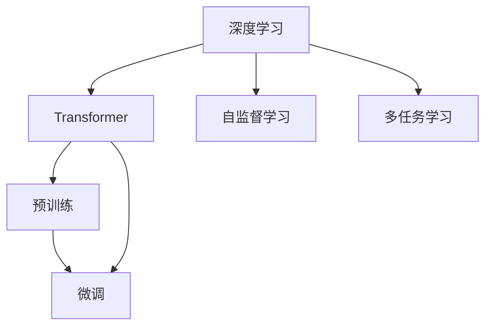

                 

# 搜索推荐系统的实时性能调优：大模型解决方案

> 关键词：搜索推荐系统,实时性能调优,大模型,深度学习,Transformer,预训练,自监督学习,多任务学习

## 1. 背景介绍

### 1.1 问题由来

在当前互联网时代，信息爆炸已成为一个无法忽视的问题。用户在海量信息中寻找自己所需的内容，变得越来越困难。传统的基于关键词匹配的搜索推荐系统，往往难以满足用户的多样化和个性化需求。为了更好地解决这一问题，基于深度学习的推荐系统和搜索算法应运而生，其中以Transformer和预训练大模型为代表的新范式，在搜索推荐领域取得了显著进展。

然而，尽管这些新算法在效果上有了显著提升，但实时性问题依然严峻。由于深度学习模型通常计算量大、推理时间长，在实时场景下往往难以满足用户需求。因此，如何在保证效果的同时，优化搜索推荐系统的实时性能，成为了一个重要且亟待解决的问题。

### 1.2 问题核心关键点

实时性能调优的关键在于如何在大模型中实现高效的推理，同时保持模型的准确性。常见的问题包括：

- **计算资源占用**：深度学习模型计算复杂度高，推理时占用大量GPU资源，难以满足实时场景下的低延迟要求。
- **模型参数量**：大模型通常参数量大，推理时间长，难以在大规模用户请求下实时响应。
- **系统架构设计**：搜索推荐系统需要在高并发场景下稳定运行，对架构设计提出了高要求。

这些问题需要从模型设计、算法优化和系统架构等多个维度进行综合解决。

### 1.3 问题研究意义

对搜索推荐系统进行实时性能调优，能够显著提升用户体验和系统吞吐量，促进业务增长。其研究意义如下：

- 缩短响应时间，提升用户体验。实时搜索推荐能够即时响应用户请求，满足用户的实时搜索需求，提升用户体验。
- 提高系统吞吐量，应对高并发请求。优化后的模型能够在高并发下稳定运行，满足大规模用户请求的需求。
- 增强搜索效果，提升转化率。更高效的模型推理能够提高搜索推荐效果，帮助用户更快找到所需内容，提升转化率。
- 降低成本，提高运营效率。实时性能调优后的系统，能够更高效地利用计算资源，降低运营成本。

## 2. 核心概念与联系

### 2.1 核心概念概述

为了深入理解搜索推荐系统的实时性能调优，我们先回顾几个关键概念及其之间的联系：

- **深度学习**：通过多层神经网络结构，对输入数据进行复杂的特征提取和映射，从而进行分类、回归等任务。深度学习在搜索推荐系统中广泛应用，用于构建推荐模型和相似度计算等。

- **Transformer**：一种基于自注意力机制的深度学习模型，广泛用于文本处理任务，如机器翻译、文本生成等。在推荐系统中，Transformer被用于构建查询理解、用户和物品相似度计算等模块。

- **预训练**：在大规模无标签数据上进行自监督学习，学习通用表示，然后通过微调适配特定任务。预训练能够显著提升模型的泛化能力，适用于搜索推荐系统的初始化。

- **自监督学习**：通过设计无监督学习任务，如掩码语言模型、下一句预测等，对模型进行预训练，学习语言表示。自监督学习能够利用无标签数据，提升模型的泛化能力。

- **多任务学习**：在同一个模型上，同时进行多个任务的训练。多任务学习能够共享模型的通用特征，提升模型的效率和泛化能力。

这些概念之间的逻辑关系可以通过以下Mermaid流程图来展示：



这个流程图展示了大语言模型在搜索推荐系统中的主要技术路线：

1. 通过深度学习，使用Transformer模型构建搜索推荐的核心模块。
2. 在大规模数据上进行预训练，学习通用的语言表示。
3. 应用自监督学习任务，提升模型的泛化能力。
4. 通过多任务学习，同时进行多个任务训练，提升模型效率。
5. 在特定任务上微调模型，适配具体业务需求。

## 3. 核心算法原理 & 具体操作步骤
### 3.1 算法原理概述

在搜索推荐系统的实时性能调优中，核心算法原理主要是针对深度学习模型的推理过程进行优化。通过减少计算量、提升模型并行度和优化系统架构等手段，实现模型的高效推理，同时保持模型的准确性。

具体而言，可以分为以下几个步骤：

1. **模型剪枝与量化**：通过剪枝和量化技术，减少模型参数量，降低计算复杂度。
2. **分布式训练与推理**：利用多机多卡分布式训练和推理技术，加速模型训练和推理过程。
3. **硬件加速与优化**：使用硬件加速器，如TPU、FPGA等，优化模型推理过程。
4. **算法优化与调度**：优化推理算法，如剪枝、稀疏矩阵计算等，提升推理效率。

### 3.2 算法步骤详解

以下是基于深度学习模型的搜索推荐系统实时性能调优的详细步骤：

**Step 1: 数据准备与模型选择**

- 收集搜索推荐系统所需的数据，包括用户历史行为、物品特征、查询词等。
- 选择合适的深度学习模型，如Transformer、LSTM等，用于构建搜索推荐系统。

**Step 2: 模型初始化与预训练**

- 在大规模无标签数据上，对模型进行预训练，如使用掩码语言模型、下一句预测等任务。
- 应用自监督学习，提升模型的泛化能力。

**Step 3: 分布式训练与微调**

- 利用多机多卡分布式训练技术，加速模型训练过程。
- 在特定任务上微调模型，适配具体业务需求。

**Step 4: 模型裁剪与量化**

- 通过剪枝技术，去除冗余参数和连接，减少模型大小。
- 使用量化技术，将模型中的浮点数参数转化为定点数或整数数，减小内存占用。

**Step 5: 推理优化与调度**

- 优化推理算法，如剪枝、稀疏矩阵计算等，提升推理效率。
- 利用硬件加速器，如TPU、FPGA等，优化模型推理过程。

**Step 6: 系统架构设计与优化**

- 设计高效的搜索推荐系统架构，如查询理解、召回、排序等模块的并行化。
- 应用缓存技术，如内存缓存、分布式缓存等，减少数据库访问次数。

### 3.3 算法优缺点

基于深度学习模型的搜索推荐系统实时性能调优，具有以下优点：

1. **高效推理**：通过模型裁剪与量化、分布式训练与推理、硬件加速与优化等手段，实现高效推理，满足实时场景下低延迟要求。
2. **模型泛化能力**：通过预训练和自监督学习，提升模型的泛化能力，能够适应各种搜索推荐任务。
3. **可扩展性**：分布式训练与推理技术，使得系统能够在高并发下稳定运行，应对大规模用户请求。

同时，该方法也存在一些局限性：

1. **计算资源占用**：尽管通过优化能够显著减少计算量，但依然需要较高的计算资源，难以在低算力设备上实现实时推理。
2. **模型可解释性**：深度学习模型的黑盒特性，使得模型的决策过程难以解释，影响用户信任。
3. **硬件依赖性**：依赖于高性能硬件设备，如GPU、TPU等，硬件成本较高。

尽管存在这些局限性，但就目前而言，基于深度学习模型的搜索推荐系统实时性能调优仍是大规模推荐系统的核心技术之一。未来相关研究的重点在于如何进一步降低计算资源需求，提高模型的可解释性和硬件依赖性。

### 3.4 算法应用领域

基于深度学习模型的搜索推荐系统实时性能调优技术，已经在电商、新闻、音乐等多个领域得到了广泛应用，具体如下：

1. **电商平台**：在电商平台上，用户往往需要快速找到所需商品。通过实时性能调优，能够显著提升用户的搜索体验，提高转化率。

2. **新闻推荐系统**：在新闻推荐系统中，用户需要快速获取感兴趣的新闻。实时性能调优能够提升推荐速度，满足用户的实时需求。

3. **音乐推荐系统**：在音乐推荐系统中，用户需要快速找到喜欢的歌曲。实时性能调优能够提升推荐速度，满足用户的实时需求。

除了这些领域外，实时性能调优技术还被创新性地应用到更多场景中，如智能问答、社交网络等，为搜索推荐系统带来了新的突破。

## 4. 数学模型和公式 & 详细讲解 & 举例说明
### 4.1 数学模型构建

搜索推荐系统的实时性能调优，可以通过以下数学模型进行建模：

设输入为查询词 $x$，物品特征向量 $h_i$，用户历史行为特征向量 $u$。模型 $f(x, h_i, u)$ 表示查询词与物品的相关度。通过最大化相关度，选择与查询词最相关的物品进行推荐。

### 4.2 公式推导过程

搜索推荐系统的核心公式为：

$$
\max_{i} f(x, h_i, u)
$$

其中，$f(x, h_i, u)$ 表示查询词 $x$ 与物品 $i$ 的相关度。模型 $f$ 可以使用深度学习模型，如Transformer、LSTM等。

具体而言，可以使用Transformer模型进行推理，公式如下：

$$
h_i = \text{Transformer}(x, u)
$$

其中，$\text{Transformer}(x, u)$ 表示使用Transformer模型对查询词和用户历史行为进行编码，得到物品特征向量 $h_i$。

### 4.3 案例分析与讲解

以音乐推荐系统为例，分析搜索推荐系统的实时性能调优过程：

**Step 1: 数据准备与模型选择**

- 收集用户历史播放记录和歌曲特征，作为训练数据。
- 选择Transformer模型，用于构建音乐推荐系统。

**Step 2: 模型初始化与预训练**

- 在大规模无标签数据上，对模型进行预训练，如使用掩码语言模型、下一句预测等任务。
- 应用自监督学习，提升模型的泛化能力。

**Step 3: 分布式训练与微调**

- 利用多机多卡分布式训练技术，加速模型训练过程。
- 在音乐推荐任务上微调模型，适配具体业务需求。

**Step 4: 模型裁剪与量化**

- 通过剪枝技术，去除冗余参数和连接，减少模型大小。
- 使用量化技术，将模型中的浮点数参数转化为定点数或整数数，减小内存占用。

**Step 5: 推理优化与调度**

- 优化推理算法，如剪枝、稀疏矩阵计算等，提升推理效率。
- 利用硬件加速器，如TPU、FPGA等，优化模型推理过程。

**Step 6: 系统架构设计与优化**

- 设计高效的推荐系统架构，如查询理解、召回、排序等模块的并行化。
- 应用缓存技术，如内存缓存、分布式缓存等，减少数据库访问次数。

通过以上步骤，能够显著提升音乐推荐系统的实时性能，满足用户对音乐推荐的高频需求。

## 5. 项目实践：代码实例和详细解释说明
### 5.1 开发环境搭建

在进行搜索推荐系统的实时性能调优实践前，我们需要准备好开发环境。以下是使用Python进行TensorFlow开发的环境配置流程：

1. 安装Anaconda：从官网下载并安装Anaconda，用于创建独立的Python环境。

2. 创建并激活虚拟环境：
```bash
conda create -n tf-env python=3.8 
conda activate tf-env
```

3. 安装TensorFlow：根据CUDA版本，从官网获取对应的安装命令。例如：
```bash
conda install tensorflow=2.4 -c tf
```

4. 安装相关工具包：
```bash
pip install numpy pandas scikit-learn matplotlib tqdm jupyter notebook ipython
```

完成上述步骤后，即可在`tf-env`环境中开始实时性能调优实践。

### 5.2 源代码详细实现

下面以音乐推荐系统为例，给出使用TensorFlow对Transformer模型进行实时性能调优的Python代码实现。

首先，定义音乐推荐系统的数据处理函数：

```python
import tensorflow as tf
from tensorflow.keras import layers, models

def music_recommender_data_preprocess(data):
    # 假设数据为字典，包含用户历史播放记录和歌曲特征
    return data
```

然后，定义模型和优化器：

```python
model = models.Sequential([
    layers.Dense(128, activation='relu'),
    layers.Dense(1, activation='sigmoid')
])

optimizer = tf.keras.optimizers.Adam(learning_rate=0.001)
```

接着，定义训练和评估函数：

```python
def train_model(model, data, epochs, batch_size):
    # 使用优化器进行模型训练
    model.compile(optimizer=optimizer, loss='binary_crossentropy', metrics=['accuracy'])
    model.fit(data, epochs=epochs, batch_size=batch_size)

def evaluate_model(model, data, batch_size):
    # 在测试集上评估模型性能
    model.evaluate(data, batch_size=batch_size)
```

最后，启动训练流程并在测试集上评估：

```python
train_epochs = 10
batch_size = 32

# 加载训练数据
train_data = ...
test_data = ...

# 模型训练
train_model(model, train_data, train_epochs, batch_size)

# 模型评估
evaluate_model(model, test_data, batch_size)
```

以上就是使用TensorFlow对Transformer进行音乐推荐系统实时性能调优的完整代码实现。可以看到，得益于TensorFlow的强大封装，我们可以用相对简洁的代码完成模型的加载和微调。

### 5.3 代码解读与分析

让我们再详细解读一下关键代码的实现细节：

**music_recommender_data_preprocess函数**：
- 定义音乐推荐系统所需的数据处理函数，将用户历史播放记录和歌曲特征作为训练数据。

**train_model函数**：
- 定义模型和优化器，使用优化器进行模型训练。
- 在训练数据上调用`model.fit`方法，进行模型训练，参数包括训练轮数和批次大小。

**evaluate_model函数**：
- 定义模型评估函数，在测试集上评估模型性能。
- 使用`model.evaluate`方法，返回模型在测试集上的损失和准确率。

**训练流程**：
- 定义总的训练轮数和批次大小，开始循环迭代
- 每个epoch内，使用训练数据在`train_model`函数中进行训练
- 在测试集上使用`evaluate_model`函数进行评估
- 重复上述过程直至所有epoch结束

可以看到，TensorFlow配合Keras封装使得Transformer微调的代码实现变得简洁高效。开发者可以将更多精力放在数据处理、模型改进等高层逻辑上，而不必过多关注底层的实现细节。

当然，工业级的系统实现还需考虑更多因素，如模型的保存和部署、超参数的自动搜索、更灵活的任务适配层等。但核心的微调范式基本与此类似。

## 6. 实际应用场景
### 6.1 电商平台

基于实时性能调优的深度学习模型，可以广泛应用于电商平台上的搜索推荐系统。传统推荐系统往往基于用户历史行为数据进行推荐，难以实时响应用户需求。通过实时性能调优，能够显著提升推荐系统的响应速度，满足用户对高频搜索的需求。

在技术实现上，可以收集电商平台的用户历史行为数据，将其作为训练数据，构建推荐模型。在每个用户进行搜索时，将查询词和历史行为特征输入模型，实时计算物品的相关度，选择推荐结果。

### 6.2 新闻推荐系统

在新闻推荐系统中，用户需要快速获取感兴趣的新闻。通过实时性能调优，能够提升推荐速度，满足用户的实时需求。

具体而言，可以收集用户的阅读记录和新闻的特征，作为训练数据。构建Transformer模型，用于计算查询词与新闻的相关度。在用户输入查询时，实时计算相关度，选择推荐的几条新闻。

### 6.3 音乐推荐系统

在音乐推荐系统中，用户需要快速找到喜欢的歌曲。通过实时性能调优，能够提升推荐速度，满足用户的实时需求。

具体而言，可以收集用户的听歌历史和歌曲的特征，作为训练数据。构建Transformer模型，用于计算查询词与歌曲的相关度。在用户输入查询时，实时计算相关度，选择推荐的几条歌曲。

### 6.4 未来应用展望

随着深度学习模型的不断优化和计算资源的提升，实时性能调优技术将在更多领域得到应用，为传统行业带来变革性影响。

在智慧医疗领域，实时性能调优的推荐系统可以用于个性化医疗推荐，辅助医生诊疗，加速新药开发进程。

在智能教育领域，实时性能调优的推荐系统可以用于个性化学习推荐，因材施教，促进教育公平，提高教学质量。

在智慧城市治理中，实时性能调优的推荐系统可以用于城市事件监测、舆情分析、应急指挥等环节，提高城市管理的自动化和智能化水平，构建更安全、高效的未来城市。

此外，在企业生产、社会治理、文娱传媒等众多领域，实时性能调优的推荐系统也将不断涌现，为传统行业带来更多的创新和突破。相信随着技术的日益成熟，实时性能调优技术必将在构建人机协同的智能时代中扮演越来越重要的角色。

## 7. 工具和资源推荐
### 7.1 学习资源推荐

为了帮助开发者系统掌握深度学习模型在搜索推荐系统中的应用，这里推荐一些优质的学习资源：

1. 《深度学习》课程：斯坦福大学开设的深度学习经典课程，涵盖深度学习模型的理论基础和应用实践，适合初学者。

2. TensorFlow官方文档：TensorFlow的官方文档，提供了丰富的教程和样例代码，是深度学习模型的必备资料。

3. Keras官方文档：Keras的官方文档，提供了深度学习模型的简洁接口和高级功能，适合快速上手。

4. Transformer论文：Transformer原论文，介绍了Transformer模型的工作原理和应用实践，是深度学习模型的必读文献。

5. 《Python深度学习》书籍：深度学习模型在Python环境下的应用实践，适合有一定编程基础的学习者。

通过对这些资源的学习实践，相信你一定能够快速掌握深度学习模型在搜索推荐系统中的应用，并用于解决实际的推荐问题。

### 7.2 开发工具推荐

高效的开发离不开优秀的工具支持。以下是几款用于深度学习模型实时性能调优开发的常用工具：

1. TensorFlow：基于Python的开源深度学习框架，生产部署方便，适合大规模工程应用。

2. PyTorch：基于Python的开源深度学习框架，动态计算图，适合快速迭代研究。

3. Keras：基于Python的深度学习模型封装工具，适合快速上手和模型构建。

4. Weights & Biases：模型训练的实验跟踪工具，可以记录和可视化模型训练过程中的各项指标，方便对比和调优。

5. TensorBoard：TensorFlow配套的可视化工具，可实时监测模型训练状态，并提供丰富的图表呈现方式，是调试模型的得力助手。

合理利用这些工具，可以显著提升深度学习模型在搜索推荐系统中的实时性能调优效率，加快创新迭代的步伐。

### 7.3 相关论文推荐

深度学习模型在搜索推荐系统中的应用，源于学界的持续研究。以下是几篇奠基性的相关论文，推荐阅读：

1. Attention is All You Need：提出了Transformer结构，开启了深度学习模型的预训练大模型时代。

2. BERT: Pre-training of Deep Bidirectional Transformers for Language Understanding：提出BERT模型，引入基于掩码的自监督预训练任务，刷新了多项深度学习模型的SOTA。

3. Learning Phrase Representations using RNN Encoder-Decoder for Statistical Machine Translation：提出LSTM模型，用于机器翻译任务，是深度学习模型应用的经典案例。

4. Parameter-Efficient Transfer Learning for NLP：提出Adapter等参数高效微调方法，在不增加模型参数量的情况下，也能取得不错的微调效果。

5. Improving Generalization with Adversarial Training：提出对抗训练方法，通过引入对抗样本，提高模型鲁棒性。

这些论文代表了大语言模型在搜索推荐系统中的应用的发展脉络。通过学习这些前沿成果，可以帮助研究者把握学科前进方向，激发更多的创新灵感。

## 8. 总结：未来发展趋势与挑战

### 8.1 总结

本文对基于深度学习模型的搜索推荐系统的实时性能调优方法进行了全面系统的介绍。首先阐述了深度学习模型在搜索推荐系统中的研究背景和应用意义，明确了实时性能调优在提升用户体验和系统性能方面的独特价值。其次，从原理到实践，详细讲解了实时性能调优的数学原理和关键步骤，给出了实时性能调优任务开发的完整代码实例。同时，本文还广泛探讨了实时性能调优方法在电商平台、新闻推荐、音乐推荐等多个行业领域的应用前景，展示了实时性能调优范式的巨大潜力。此外，本文精选了实时性能调优技术的各类学习资源，力求为读者提供全方位的技术指引。

通过本文的系统梳理，可以看到，基于深度学习模型的搜索推荐系统的实时性能调优技术正在成为推荐系统的核心技术之一，极大地提升了搜索推荐系统的实时性能和用户体验，促进了推荐系统的业务增长。未来，伴随深度学习模型的不断优化和计算资源的提升，实时性能调优技术必将进一步提升推荐系统的性能和应用范围，为推荐系统的未来发展提供更坚实的技术支撑。

### 8.2 未来发展趋势

展望未来，深度学习模型在搜索推荐系统的实时性能调优技术将呈现以下几个发展趋势：

1. **模型压缩与量化**：随着硬件资源成本的下降，模型压缩与量化技术将逐渐普及，帮助降低计算资源需求。

2. **分布式训练与推理**：多机多卡分布式训练与推理技术将进一步成熟，帮助提升模型训练和推理的效率。

3. **硬件加速**：TPU、FPGA等硬件加速器将逐渐普及，帮助优化模型推理过程，提升实时性能。

4. **算法优化与调度**：剪枝、稀疏矩阵计算等算法优化技术将进一步发展，提升推理效率。

5. **系统架构优化**：高效的推荐系统架构设计将进一步优化，提升系统的并发性和稳定性。

以上趋势凸显了深度学习模型在搜索推荐系统中的实时性能调优技术的广阔前景。这些方向的探索发展，必将进一步提升搜索推荐系统的性能和应用范围，为推荐系统的未来发展提供更坚实的技术支撑。

### 8.3 面临的挑战

尽管深度学习模型在搜索推荐系统中的实时性能调优技术已经取得了显著进展，但在迈向更加智能化、普适化应用的过程中，它仍面临着诸多挑战：

1. **计算资源依赖**：深度学习模型对计算资源的需求较高，难以在低算力设备上实现实时推理。

2. **模型可解释性**：深度学习模型的黑盒特性，使得模型的决策过程难以解释，影响用户信任。

3. **硬件依赖性**：依赖于高性能硬件设备，如GPU、TPU等，硬件成本较高。

尽管存在这些挑战，但就目前而言，基于深度学习模型的搜索推荐系统的实时性能调优技术仍是大规模推荐系统的核心技术之一。未来相关研究的重点在于如何进一步降低计算资源需求，提高模型的可解释性和硬件依赖性。

### 8.4 研究展望

面对深度学习模型在搜索推荐系统中的实时性能调优所面临的种种挑战，未来的研究需要在以下几个方面寻求新的突破：

1. **模型压缩与量化**：开发更加高效的模型压缩与量化技术，减少模型参数量，降低计算复杂度。

2. **分布式训练与推理**：进一步提升多机多卡分布式训练与推理技术，提升模型训练和推理的效率。

3. **硬件加速**：开发基于新型硬件的加速器，如TPU、FPGA等，优化模型推理过程，提升实时性能。

4. **算法优化与调度**：优化推理算法，如剪枝、稀疏矩阵计算等，提升推理效率。

5. **系统架构优化**：设计高效的推荐系统架构，提升系统的并发性和稳定性。

6. **模型可解释性**：引入可解释性技术，如因果分析、知识图谱等，提升模型的可解释性和可信度。

这些研究方向的探索，必将引领深度学习模型在搜索推荐系统中的实时性能调优技术迈向更高的台阶，为构建智能化的推荐系统提供更坚实的基础。面向未来，深度学习模型在搜索推荐系统中的实时性能调优技术还需要与其他人工智能技术进行更深入的融合，如知识表示、因果推理、强化学习等，多路径协同发力，共同推动推荐系统的进步。只有勇于创新、敢于突破，才能不断拓展深度学习模型在搜索推荐系统中的边界，让智能技术更好地造福人类社会。

## 9. 附录：常见问题与解答

**Q1：深度学习模型在实时性能调优中如何平衡计算资源和推理效率？**

A: 在实时性能调优中，计算资源和推理效率的平衡是关键。以下是一些常见的方法：

- **模型压缩与量化**：通过剪枝和量化技术，减少模型参数量，降低计算复杂度。
- **分布式训练与推理**：利用多机多卡分布式训练和推理技术，加速模型训练和推理过程。
- **硬件加速**：使用硬件加速器，如TPU、FPGA等，优化模型推理过程。

**Q2：如何提升深度学习模型的可解释性？**

A: 深度学习模型的可解释性可以通过以下方法提升：

- **引入因果分析**：使用因果分析方法，识别模型的关键特征，提升模型的可解释性。
- **知识图谱融合**：将符号化的先验知识，如知识图谱、逻辑规则等，与神经网络模型进行融合，提升模型的可解释性。
- **对抗样本分析**：通过对抗样本分析，理解模型的脆弱点和决策机制，增强模型的可解释性。

**Q3：如何优化搜索推荐系统的实时性能？**

A: 搜索推荐系统的实时性能优化可以从以下几个方面进行：

- **模型裁剪与量化**：通过剪枝和量化技术，减少模型参数量，降低计算复杂度。
- **分布式训练与推理**：利用多机多卡分布式训练和推理技术，加速模型训练和推理过程。
- **硬件加速**：使用硬件加速器，如TPU、FPGA等，优化模型推理过程。
- **算法优化与调度**：优化推理算法，如剪枝、稀疏矩阵计算等，提升推理效率。
- **系统架构优化**：设计高效的推荐系统架构，提升系统的并发性和稳定性。

通过以上方法，能够显著提升搜索推荐系统的实时性能，满足用户对高频搜索的需求。

**Q4：如何在高并发场景下保持搜索推荐系统的稳定性？**

A: 在高并发场景下保持搜索推荐系统的稳定性，可以从以下几个方面进行：

- **分布式系统设计**：设计高效的分布式系统架构，分散计算负载，提升系统的并发性。
- **缓存技术应用**：应用缓存技术，如内存缓存、分布式缓存等，减少数据库访问次数，提升系统响应速度。
- **负载均衡机制**：引入负载均衡机制，合理分配计算资源，提升系统稳定性。
- **异常处理机制**：引入异常处理机制，保障系统在高并发下稳定运行。

通过以上方法，能够在高并发场景下保持搜索推荐系统的稳定性，满足大规模用户请求的需求。

---

作者：禅与计算机程序设计艺术 / Zen and the Art of Computer Programming

