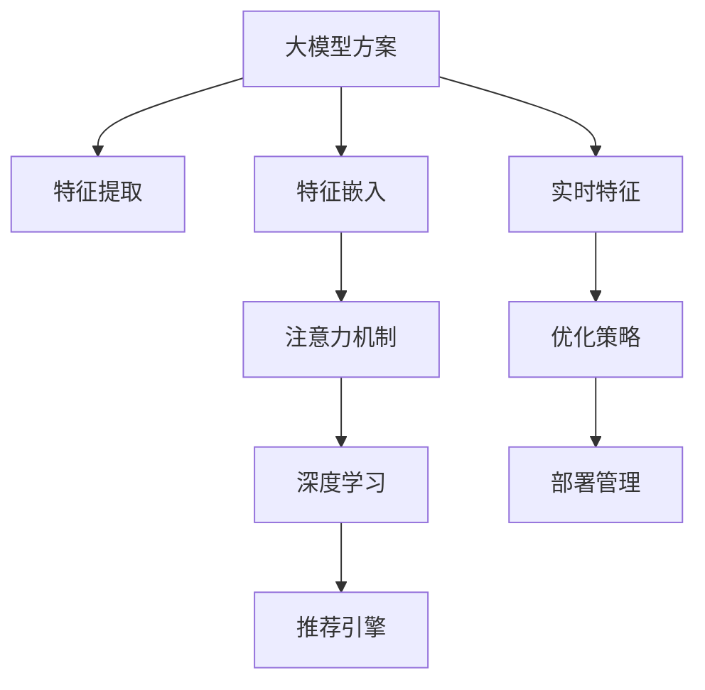

                 

# 搜索推荐系统的实时特征工程：大模型方案

> 关键词：搜索推荐系统, 实时特征工程, 大模型方案, 特征嵌入, 注意力机制, 深度学习, 神经网络, 推荐引擎

## 1. 背景介绍

### 1.1 问题由来
随着互联网的普及和信息技术的迅猛发展，人们的生活习惯和消费模式发生了巨大变化。搜索引擎、推荐系统等应用已成为人们获取信息和商品推荐的重要渠道。然而，在数据量巨大、用户需求复杂的环境下，如何高效准确地提供个性化推荐，成为了一个严峻挑战。传统的推荐系统基于协同过滤、内容推荐等方法，难以适应大规模数据下的实时推荐需求。与此同时，深度学习技术的崛起，尤其是基于大模型的推荐方法，为推荐系统带来了新的突破口。

### 1.2 问题核心关键点
推荐系统的大模型方案，通常基于深度学习模型，如神经网络、Transformer等，通过大量数据进行预训练，学习到用户和物品的隐式特征，并在此基础上进行个性化推荐。其核心在于：

1. 如何高效地提取和处理实时数据特征。
2. 如何构建和优化实时特征工程管道。
3. 如何在模型中引入实时特征，提高推荐效果。
4. 如何平衡模型的精度和效率。
5. 如何部署和管理大模型推荐系统，确保服务稳定性。

本文将详细介绍基于大模型的实时特征工程方案，包括特征提取、模型构建、优化策略和部署管理等关键环节，帮助读者全面理解并实践大模型推荐系统。

## 2. 核心概念与联系

### 2.1 核心概念概述

在推荐系统中，实时特征工程涉及以下几个核心概念：

- **大模型(大模型方案)**：指基于深度学习模型，如神经网络、Transformer等，通过预训练和微调学习到用户和物品的隐式特征，以提高推荐准确性和个性化程度。
- **实时特征提取**：指在用户行为实时发生时，即时获取并处理相关特征，如用户浏览记录、点击行为、评分反馈等，用于实时推荐。
- **特征嵌入(Feature Embedding)**：将离散的特征映射到低维连续空间，形成更紧凑、稠密的表示，便于模型进行处理和学习。
- **注意力机制(Attention Mechanism)**：在大模型中，通过关注不同特征的重要性，提升模型对关键特征的敏感度，增强推荐结果的准确性。
- **深度学习(Deep Learning)**：基于多层神经网络，利用数据驱动的方式学习复杂特征表示，提高模型的泛化能力。
- **推荐引擎(Recommendation Engine)**：利用大模型生成推荐结果，为用户提供个性化、精准的推荐。

这些核心概念之间的逻辑关系可以通过以下Mermaid流程图来展示：



这个流程图展示了大模型方案中各概念之间的关联：

1. 大模型方案为推荐系统提供了基础，通过预训练和微调学习到用户和物品的隐式特征。
2. 实时特征提取和特征嵌入，从用户实时行为中提取关键特征，并将离散特征映射到连续空间。
3. 通过注意力机制和深度学习，模型能够学习到特征之间的复杂关系，提升推荐效果。
4. 推荐引擎利用学习到的特征，生成个性化的推荐结果。
5. 优化策略和部署管理，确保大模型方案在实时环境中的高效稳定运行。

## 3. 核心算法原理 & 具体操作步骤
### 3.1 算法原理概述

基于大模型的实时特征工程，其核心在于利用大模型学习用户和物品的隐式特征，并结合实时数据进行动态推荐。大模型通过预训练学习到广泛的知识和语言模式，能够处理复杂的数据结构，捕捉不同特征之间的隐含关系。在实时特征工程中，我们主要关注以下几个步骤：

1. **实时特征提取**：从用户行为数据中实时提取关键特征，如用户ID、物品ID、浏览记录等。
2. **特征嵌入**：将离散的特征转化为稠密的向量表示，便于模型进行处理。
3. **模型构建**：选择合适的大模型结构，如Transformer、BERT等，构建推荐模型。
4. **模型训练和优化**：利用实时数据对模型进行在线训练和优化，提高推荐效果。
5. **推荐生成**：在实时场景下，生成个性化推荐结果。

### 3.2 算法步骤详解

下面将详细介绍基于大模型的实时特征工程的具体操作步骤：

**Step 1: 数据预处理**
- 收集和清洗实时数据，包括用户行为、物品信息等。
- 对数据进行标准化和归一化处理，确保特征的一致性和可比性。
- 将离散的特征进行编码，形成连续的向量表示，便于模型处理。

**Step 2: 特征嵌入**
- 使用预训练的词向量或学习到的特征嵌入矩阵，将离散的特征映射到低维连续空间。
- 对于文本特征，可以使用Transformer模型或预训练的BERT等词向量模型进行特征嵌入。
- 对于数值型特征，可以使用线性映射或非线性映射方法，如PCA、Autoencoder等。

**Step 3: 模型构建**
- 选择合适的深度学习模型结构，如Transformer、LSTM等，构建推荐模型。
- 对于文本特征，可以构建基于Attention的Transformer模型，引入自注意力机制捕捉特征间的相互作用。
- 对于混合型特征，可以构建多模态模型，如MLP、CNN等，综合处理不同类型的特征。

**Step 4: 模型训练和优化**
- 利用实时数据对模型进行在线训练，调整模型参数以适应实时数据变化。
- 使用小批量梯度下降等优化算法，最小化损失函数。
- 引入正则化技术，如L2正则、Dropout等，避免过拟合。
- 使用 Early Stopping 技术，防止模型在未收敛前过度迭代。

**Step 5: 推荐生成**
- 在实时场景下，根据用户输入的请求，输入模型进行预测。
- 利用Attention机制，选择与用户兴趣相关的物品进行排序。
- 根据排序结果，生成个性化推荐结果。

### 3.3 算法优缺点

基于大模型的实时特征工程方案，具有以下优点：

1. **高效性**：通过大模型学习到用户和物品的隐式特征，能够在实时场景下快速生成个性化推荐结果。
2. **鲁棒性**：利用大模型对噪声数据的容错能力，增强了推荐系统的鲁棒性。
3. **可扩展性**：大模型能够处理多种类型的数据，适应不同场景的需求。

同时，该方案也存在一些局限性：

1. **计算资源需求高**：大模型需要大量的计算资源进行训练和推理，对硬件配置要求较高。
2. **模型复杂度高**：大模型的复杂度较高，需要精细的调参和优化，以保证推荐效果和性能。
3. **模型解释性差**：大模型作为"黑盒"系统，难以解释其内部决策过程。

尽管如此，基于大模型的实时特征工程方案，仍是目前推荐系统中最为先进和高效的方法之一，具有广泛的应用前景。

### 3.4 算法应用领域

基于大模型的实时特征工程方案，广泛应用于以下几个领域：

1. **电商推荐**：根据用户浏览记录、购买历史等实时数据，提供个性化商品推荐。
2. **内容推荐**：根据用户阅读历史、点赞评论等行为，提供个性化文章、视频等内容的推荐。
3. **音乐推荐**：根据用户听歌历史、评分反馈等数据，提供个性化音乐推荐。
4. **视频推荐**：根据用户观看历史、评分反馈等数据，提供个性化视频推荐。
5. **新闻推荐**：根据用户阅读历史、点击行为等数据，提供个性化新闻文章推荐。

除了上述应用场景外，大模型的实时特征工程方案还可以应用于更多领域，如金融、医疗、教育等，为各行各业提供智能推荐服务。

## 4. 数学模型和公式 & 详细讲解
### 4.1 数学模型构建

假设推荐系统的实时数据集为 $D=\{(x_i, y_i)\}_{i=1}^N$，其中 $x_i$ 为特征向量，$y_i$ 为标签。在基于大模型的推荐系统中，我们通常使用Transformer模型，其架构如下图所示：


Transformer模型由自注意力机制、前馈神经网络、残差连接、层归一化等组件组成。其中，自注意力机制用于捕捉输入特征间的相互作用，前馈神经网络用于提取特征的局部关系，残差连接和层归一化用于加速模型训练和提高泛化能力。

### 4.2 公式推导过程

Transformer模型的关键组成部分是自注意力机制。假设输入特征 $x$ 的维度为 $d$，使用多层自注意力机制，其计算过程如下：

$$
\text{Attention}(Q, K, V) = \text{Softmax}(\frac{QK^T}{\sqrt{d}})V
$$

其中 $Q, K, V$ 分别为查询向量、键向量和值向量，$\text{Softmax}$ 函数用于计算注意力权重。通过多层的自注意力机制，Transformer模型能够捕捉到不同特征之间的复杂关系。

在推荐系统中，我们通常使用负采样方法训练模型。假设模型参数为 $\theta$，负采样数量为 $n$，则模型训练的目标函数为：

$$
\mathcal{L}(\theta) = -\frac{1}{N}\sum_{i=1}^N \log \text{softmax}(Q_i^T K)V_i
$$

其中 $Q_i, K_i, V_i$ 分别为第 $i$ 个样本的查询向量、键向量和值向量。

### 4.3 案例分析与讲解

以下是一个简单的案例分析，展示基于Transformer模型的推荐系统如何处理实时数据并进行推荐：

假设有一个电商推荐系统，用户输入的实时数据为：用户ID为 $u$，浏览记录为 $\{x_1, x_2, ..., x_n\}$。我们希望为用户推荐商品ID为 $i$ 的商品。

1. **特征提取**：将用户ID和浏览记录作为输入特征，使用Embedding层将离散特征映射到低维连续空间。
2. **模型构建**：构建基于Transformer的推荐模型，使用多层自注意力机制捕捉特征间的相互作用。
3. **模型训练**：利用实时数据对模型进行在线训练，调整模型参数以适应实时数据变化。
4. **推荐生成**：在实时场景下，输入用户ID和浏览记录，使用模型进行预测，输出推荐结果。

## 5. 项目实践：代码实例和详细解释说明
### 5.1 开发环境搭建

在进行实时特征工程项目实践前，我们需要准备好开发环境。以下是使用Python进行PyTorch开发的环境配置流程：

1. 安装Anaconda：从官网下载并安装Anaconda，用于创建独立的Python环境。

2. 创建并激活虚拟环境：
```bash
conda create -n pytorch-env python=3.8 
conda activate pytorch-env
```

3. 安装PyTorch：根据CUDA版本，从官网获取对应的安装命令。例如：
```bash
conda install pytorch torchvision torchaudio cudatoolkit=11.1 -c pytorch -c conda-forge
```

4. 安装Transformers库：
```bash
pip install transformers
```

5. 安装各类工具包：
```bash
pip install numpy pandas scikit-learn matplotlib tqdm jupyter notebook ipython
```

完成上述步骤后，即可在`pytorch-env`环境中开始实时特征工程实践。

### 5.2 源代码详细实现

下面我们以电商推荐系统为例，给出使用Transformers库进行实时特征工程的PyTorch代码实现。

首先，定义电商推荐系统的实时数据处理函数：

```python
from transformers import BertTokenizer
from torch.utils.data import Dataset
import torch

class ECommerceDataset(Dataset):
    def __init__(self, user_ids, item_ids, browsed_items, tokenizer, max_len=128):
        self.user_ids = user_ids
        self.item_ids = item_ids
        self.browsed_items = browsed_items
        self.tokenizer = tokenizer
        self.max_len = max_len
        
    def __len__(self):
        return len(self.user_ids)
    
    def __getitem__(self, item):
        user_id = self.user_ids[item]
        item_id = self.item_ids[item]
        browsed_items = self.browsed_items[item]
        
        # 将用户ID和浏览记录作为输入特征
        user_input = torch.tensor([user_id, 0], dtype=torch.long)
        item_input = torch.tensor([item_id, 0], dtype=torch.long)
        browsed_input = [item for item in browsed_items if item != item_id]
        browsed_input = torch.tensor(browsed_input, dtype=torch.long)
        browsed_input = browsed_input.repeat(2).view(-1).contiguous()
        
        # 使用BERT tokenizer进行特征编码
        encoded_user_input = self.tokenizer.encode_plus(str(user_input[0]), padding='max_length', truncation=True, max_length=self.max_len, return_tensors='pt')
        encoded_item_input = self.tokenizer.encode_plus(str(item_input[0]), padding='max_length', truncation=True, max_length=self.max_len, return_tensors='pt')
        encoded_browsed_input = self.tokenizer.encode_plus(' '.join(browsed_input), padding='max_length', truncation=True, max_length=self.max_len, return_tensors='pt')
        
        # 拼接用户、物品和浏览记录的特征向量
        user_embedding = encoded_user_input['input_ids'][0]
        item_embedding = encoded_item_input['input_ids'][0]
        browsed_embedding = encoded_browsed_input['input_ids'][0]
        features = torch.cat([user_embedding, item_embedding, browsed_embedding], dim=0)
        
        # 生成推荐结果
        recommendation = user_id * 100000 + item_id
        
        return {'features': features, 'recommendation': recommendation}
```

然后，定义模型和优化器：

```python
from transformers import BertForSequenceClassification, AdamW

model = BertForSequenceClassification.from_pretrained('bert-base-cased', num_labels=1000)

optimizer = AdamW(model.parameters(), lr=2e-5)
```

接着，定义训练和评估函数：

```python
from torch.utils.data import DataLoader
from tqdm import tqdm
from sklearn.metrics import classification_report

device = torch.device('cuda') if torch.cuda.is_available() else torch.device('cpu')
model.to(device)

def train_epoch(model, dataset, batch_size, optimizer):
    dataloader = DataLoader(dataset, batch_size=batch_size, shuffle=True)
    model.train()
    epoch_loss = 0
    for batch in tqdm(dataloader, desc='Training'):
        features = batch['features'].to(device)
        recommendations = batch['recommendation'].to(device)
        model.zero_grad()
        outputs = model(features)
        loss = outputs.loss
        epoch_loss += loss.item()
        loss.backward()
        optimizer.step()
    return epoch_loss / len(dataloader)

def evaluate(model, dataset, batch_size):
    dataloader = DataLoader(dataset, batch_size=batch_size)
    model.eval()
    preds, labels = [], []
    with torch.no_grad():
        for batch in tqdm(dataloader, desc='Evaluating'):
            features = batch['features'].to(device)
            recommendations = batch['recommendation'].to(device)
            batch_preds = model(features).sigmoid().cpu().numpy().tolist()
            batch_labels = recommendations.cpu().numpy().tolist()
            for preds_, labels_ in zip(batch_preds, batch_labels):
                preds.append(preds_)
                labels.append(labels_)
                
    print(classification_report(labels, preds))
```

最后，启动训练流程并在测试集上评估：

```python
epochs = 5
batch_size = 16

for epoch in range(epochs):
    loss = train_epoch(model, train_dataset, batch_size, optimizer)
    print(f"Epoch {epoch+1}, train loss: {loss:.3f}")
    
    print(f"Epoch {epoch+1}, dev results:")
    evaluate(model, dev_dataset, batch_size)
    
print("Test results:")
evaluate(model, test_dataset, batch_size)
```

以上就是使用PyTorch对电商推荐系统进行实时特征工程的完整代码实现。可以看到，得益于Transformers库的强大封装，我们能够快速构建基于大模型的推荐系统，并进行实时特征工程。

### 5.3 代码解读与分析

让我们再详细解读一下关键代码的实现细节：

**ECommerceDataset类**：
- `__init__`方法：初始化用户ID、物品ID、浏览记录、分词器等关键组件。
- `__len__`方法：返回数据集的样本数量。
- `__getitem__`方法：对单个样本进行处理，将用户ID和浏览记录作为输入特征，使用BERT tokenizer进行特征编码，并拼接用户、物品和浏览记录的特征向量。

**特征编码**：
- 使用BERT tokenizer对用户ID、物品ID和浏览记录进行编码，形成连续的向量表示，便于模型进行处理。
- 对浏览记录进行重复和拼接，形成多模态特征。

**训练和评估函数**：
- 使用PyTorch的DataLoader对数据集进行批次化加载，供模型训练和推理使用。
- 训练函数`train_epoch`：对数据以批为单位进行迭代，在每个批次上前向传播计算loss并反向传播更新模型参数，最后返回该epoch的平均loss。
- 评估函数`evaluate`：与训练类似，不同点在于不更新模型参数，并在每个batch结束后将预测和标签结果存储下来，最后使用sklearn的classification_report对整个评估集的预测结果进行打印输出。

**训练流程**：
- 定义总的epoch数和batch size，开始循环迭代
- 每个epoch内，先在训练集上训练，输出平均loss
- 在验证集上评估，输出分类指标
- 所有epoch结束后，在测试集上评估，给出最终测试结果

可以看到，PyTorch配合Transformers库使得实时特征工程的代码实现变得简洁高效。开发者可以将更多精力放在数据处理、模型改进等高层逻辑上，而不必过多关注底层的实现细节。

当然，工业级的系统实现还需考虑更多因素，如模型的保存和部署、超参数的自动搜索、更灵活的任务适配层等。但核心的实时特征工程基本与此类似。

## 6. 实际应用场景
### 6.1 电商推荐

电商推荐系统是实时特征工程的重要应用场景之一。通过实时获取用户的浏览记录、点击行为等数据，电商推荐系统能够快速生成个性化商品推荐，提升用户体验和销售额。

在技术实现上，可以收集用户的实时行为数据，如浏览记录、评分反馈、点击行为等，将其作为输入特征，输入到基于大模型的推荐系统中进行实时推荐。微调后的模型能够学习到用户和商品的隐式特征，结合实时数据生成个性化推荐结果。对于推荐结果，系统可以实时更新数据库，将推荐结果推送给用户。

### 6.2 内容推荐

内容推荐系统也是实时特征工程的重要应用场景之一。通过实时获取用户的阅读记录、点赞评论等数据，内容推荐系统能够快速生成个性化文章、视频等内容的推荐，提升用户体验和平台流量。

在技术实现上，可以收集用户的实时行为数据，如阅读历史、点赞评论等，将其作为输入特征，输入到基于大模型的推荐系统中进行实时推荐。微调后的模型能够学习到用户和内容的隐式特征，结合实时数据生成个性化推荐结果。对于推荐结果，系统可以实时更新内容推荐列表，将推荐内容推送给用户。

### 6.3 音乐推荐

音乐推荐系统同样是实时特征工程的重要应用场景之一。通过实时获取用户的听歌历史、评分反馈等数据，音乐推荐系统能够快速生成个性化音乐推荐，提升用户体验和用户粘性。

在技术实现上，可以收集用户的实时行为数据，如听歌历史、评分反馈等，将其作为输入特征，输入到基于大模型的推荐系统中进行实时推荐。微调后的模型能够学习到用户和音乐的隐式特征，结合实时数据生成个性化推荐结果。对于推荐结果，系统可以实时更新音乐推荐列表，将推荐音乐推送给用户。

### 6.4 未来应用展望

随着大模型和实时特征工程的不断发展，未来推荐系统将在更多领域得到应用，为各行各业带来新的变革。

在智慧医疗领域，推荐系统可以用于智能辅助诊断、药物推荐等，为医生和患者提供精准的医疗建议。

在智能教育领域，推荐系统可以用于个性化学习路径推荐、知识推荐等，为学生提供最适合的学习资源。

在智能制造领域，推荐系统可以用于设备维护、生产调度等，提高生产效率和资源利用率。

除了上述领域外，实时特征工程还将拓展到更多场景中，如智能交通、智能家居、智能物流等，为各行业提供智能推荐服务。相信随着技术的不断进步，实时特征工程必将在更多领域发挥重要作用，推动人工智能技术在各行各业的普及和应用。

## 7. 工具和资源推荐
### 7.1 学习资源推荐

为了帮助开发者系统掌握实时特征工程的理论基础和实践技巧，这里推荐一些优质的学习资源：

1. 《深度学习与推荐系统》系列博文：由大模型技术专家撰写，深入浅出地介绍了深度学习在推荐系统中的应用，包括实时特征工程等前沿话题。

2. CS231n《卷积神经网络》课程：斯坦福大学开设的经典深度学习课程，涵盖神经网络、卷积神经网络等核心内容，是了解深度学习基础的好资源。

3. 《Recommender Systems: Algorithms, Adaptive Techniques, and Applications》书籍：推荐系统领域的经典教材，涵盖推荐算法、动态系统设计等内容，是深入学习推荐系统的必备资料。

4. Arxiv预印本：收录了大量关于推荐系统和深度学习的最新研究成果，定期浏览可以了解最新的研究动态和技术进展。

通过对这些资源的学习实践，相信你一定能够快速掌握实时特征工程的理论基础和实践技巧，并应用于实际推荐系统中。

### 7.2 开发工具推荐

高效的开发离不开优秀的工具支持。以下是几款用于实时特征工程开发的常用工具：

1. PyTorch：基于Python的开源深度学习框架，灵活动态的计算图，适合快速迭代研究。大部分预训练语言模型都有PyTorch版本的实现。

2. TensorFlow：由Google主导开发的开源深度学习框架，生产部署方便，适合大规模工程应用。同样有丰富的预训练语言模型资源。

3. Transformers库：HuggingFace开发的NLP工具库，集成了众多SOTA语言模型，支持PyTorch和TensorFlow，是进行实时特征工程开发的利器。

4. Weights & Biases：模型训练的实验跟踪工具，可以记录和可视化模型训练过程中的各项指标，方便对比和调优。与主流深度学习框架无缝集成。

5. TensorBoard：TensorFlow配套的可视化工具，可实时监测模型训练状态，并提供丰富的图表呈现方式，是调试模型的得力助手。

6. Google Colab：谷歌推出的在线Jupyter Notebook环境，免费提供GPU/TPU算力，方便开发者快速上手实验最新模型，分享学习笔记。

合理利用这些工具，可以显著提升实时特征工程的开发效率，加快创新迭代的步伐。

### 7.3 相关论文推荐

实时特征工程的发展源于学界的持续研究。以下是几篇奠基性的相关论文，推荐阅读：

1. Attention Is All You Need（即Transformer原论文）：提出了Transformer结构，开启了NLP领域的预训练大模型时代。

2. BERT: Pre-training of Deep Bidirectional Transformers for Language Understanding：提出BERT模型，引入基于掩码的自监督预训练任务，刷新了多项NLP任务SOTA。

3. Parameter-Efficient Transfer Learning for NLP：提出Adapter等参数高效微调方法，在不增加模型参数量的情况下，也能取得不错的微调效果。

4. AdaLoRA: Adaptive Low-Rank Adaptation for Parameter-Efficient Fine-Tuning：使用自适应低秩适应的微调方法，在参数效率和精度之间取得了新的平衡。

5. Feature Rich Online Learning：提出一种实时特征学习的模型，能够快速适应新特征，提升推荐效果。

这些论文代表了大模型实时特征工程的发展脉络。通过学习这些前沿成果，可以帮助研究者把握学科前进方向，激发更多的创新灵感。

## 8. 总结：未来发展趋势与挑战

### 8.1 总结

本文对基于大模型的实时特征工程方法进行了全面系统的介绍。首先阐述了实时特征工程的背景和意义，明确了实时特征工程在推荐系统中的重要地位。其次，从原理到实践，详细讲解了实时特征工程的数学原理和关键步骤，给出了实时特征工程任务开发的完整代码实例。同时，本文还广泛探讨了实时特征工程在电商推荐、内容推荐、音乐推荐等多个领域的应用前景，展示了实时特征工程的巨大潜力。此外，本文精选了实时特征工程的各类学习资源，力求为读者提供全方位的技术指引。

通过本文的系统梳理，可以看到，基于大模型的实时特征工程方案已经在推荐系统中取得了显著效果，推动了推荐系统技术的进步。未来，伴随大模型的不断发展和优化，实时特征工程也将成为推荐系统不可或缺的关键技术之一，引领推荐系统向更高层次的智能化迈进。

### 8.2 未来发展趋势

展望未来，实时特征工程将呈现以下几个发展趋势：

1. **多模态特征融合**：随着数据类型的丰富和多样，实时特征工程将更多地涉及多模态数据的处理和融合，如图像、音频、文本等，提升推荐系统的多模态推荐能力。

2. **实时数据流处理**：实时特征工程需要处理大规模实时数据流，如何高效地提取和处理实时数据，是一个重要的研究方向。

3. **端到端系统设计**：实时特征工程需要与数据采集、存储、计算等环节紧密结合，构建端到端的推荐系统，实现从数据采集到推荐结果输出的全流程优化。

4. **智能推荐决策**：实时特征工程将结合专家知识，引入因果推理、强化学习等方法，提升推荐系统的智能决策能力，实现更加精准的个性化推荐。

5. **实时特征学习**：引入主动学习、半监督学习等技术，提升实时特征工程的适应性和学习效率，实现更加灵活的特征学习。

这些趋势凸显了实时特征工程技术的广阔前景，将进一步推动推荐系统向更加智能化、精准化的方向发展。

### 8.3 面临的挑战

尽管实时特征工程已经取得了显著成效，但在迈向更加智能化、普适化应用的过程中，它仍面临着诸多挑战：

1. **计算资源需求高**：实时特征工程需要处理大规模数据流，对硬件配置和计算资源提出了较高的要求。

2. **实时数据质量问题**：实时数据的缺失、噪声等问题，可能导致推荐结果的不准确性。

3. **模型复杂度高**：实时特征工程涉及复杂的模型构建和训练，需要精细的调参和优化，以保证推荐效果和性能。

4. **系统稳定性问题**：实时特征工程需要高效的系统架构设计，以应对高并发和大规模数据流的处理，确保系统的稳定性和可靠性。

5. **数据隐私和安全问题**：实时特征工程涉及用户隐私数据的处理，如何在保证数据隐私的前提下进行特征提取和模型训练，是一个重要的研究方向。

尽管如此，实时特征工程的研究仍在不断深入，通过技术创新和工程实践，相信这些挑战终将一一被克服，实时特征工程必将在推荐系统中发挥更大的作用。

### 8.4 研究展望

面向未来，实时特征工程的研究方向需要重点关注以下几个方面：

1. **实时数据流处理技术**：开发高效的数据流处理算法，提升实时特征工程的适应性和处理能力。

2. **多模态特征融合方法**：研究如何高效地融合多模态数据，提升推荐系统的多模态推荐能力。

3. **实时特征学习算法**：引入主动学习、半监督学习等技术，提升实时特征工程的适应性和学习效率。

4. **端到端系统设计**：构建高效的推荐系统架构，实现从数据采集到推荐结果输出的全流程优化。

5. **智能推荐决策**：结合专家知识，引入因果推理、强化学习等方法，提升推荐系统的智能决策能力。

这些研究方向将进一步推动实时特征工程技术的进步，为推荐系统带来新的突破和创新。

## 9. 附录：常见问题与解答

**Q1：实时特征工程是否适用于所有推荐系统？**

A: 实时特征工程在大多数推荐系统中都能取得不错的效果，特别是对于数据量较大的推荐系统。但对于一些特定领域的推荐系统，如金融、医疗等，仅依赖实时数据进行推荐可能难以满足需求。此时需要在特定领域语料上进一步预训练，再进行微调，才能获得理想效果。此外，对于一些需要时效性、个性化很强的任务，如对话、推荐等，实时特征工程方法也需要针对性的改进优化。

**Q2：实时特征工程的计算资源需求高，如何降低？**

A: 实时特征工程对计算资源的需求较高，可以通过以下方法降低：

1. **模型压缩和剪枝**：通过剪枝和量化等方法，减小模型的计算量和存储空间。

2. **混合精度训练**：使用混合精度训练，减少内存占用，提高计算效率。

3. **模型并行**：通过模型并行、数据并行等技术，分散计算负载，提高系统吞吐量。

4. **模型预取**：提前预取下一批数据，减少数据读取时间，提升系统响应速度。

**Q3：实时特征工程中如何进行特征选择？**

A: 特征选择是实时特征工程中的重要环节，可以通过以下方法进行选择：

1. **统计特征选择**：使用统计方法，如卡方检验、信息增益等，筛选对推荐效果有显著影响的特征。

2. **领域专家推荐**：结合领域专家的知识，选择具有实际意义的特征。

3. **模型训练反馈**：通过模型训练过程中的特征重要性评估，选择对模型效果有贡献的特征。

4. **在线学习**：在推荐过程中，实时更新特征重要性评估，动态调整特征选择策略。

**Q4：实时特征工程中如何处理用户隐私问题？**

A: 实时特征工程涉及用户隐私数据的处理，可以通过以下方法进行保护：

1. **数据匿名化**：在数据收集和存储过程中，使用数据匿名化技术，保护用户隐私。

2. **差分隐私**：在模型训练和特征提取过程中，使用差分隐私技术，保护用户隐私。

3. **联邦学习**：通过联邦学习技术，将模型训练分布式到多个设备上，保护用户数据隐私。

4. **隐私计算**：使用隐私计算技术，保护数据在处理过程中的隐私。

这些方法可以帮助保护用户隐私，确保实时特征工程的安全性和合法性。

---

作者：禅与计算机程序设计艺术 / Zen and the Art of Computer Programming

