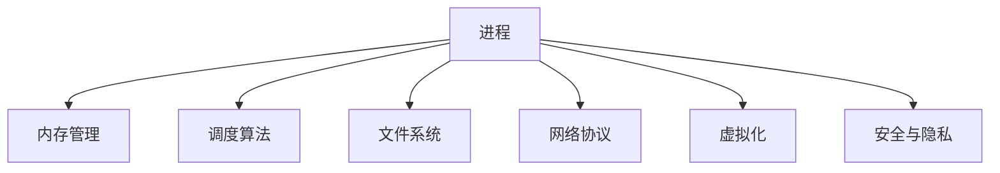

                 

# 操作系统:管理和协调计算资源的核心

> 关键词：操作系统, 进程调度, 内存管理, 文件系统, 网络协议, 虚拟化, 安全与隐私

## 1. 背景介绍

操作系统（Operating System, OS）是管理计算机硬件资源、提供各类服务的核心软件。它处于硬件和应用程序之间，负责实现资源调度、进程管理、内存管理、文件系统维护、网络通信等关键功能，确保计算机系统的稳定运行。

### 1.1 操作系统的作用
操作系统是计算机硬件和软件之间的桥梁，主要作用包括：

- **资源管理**：包括处理器调度、内存管理、I/O管理等。
- **进程管理**：创建、调度、同步和销毁进程。
- **文件系统管理**：提供文件存储、访问和保护。
- **网络通信**：实现网络协议和数据传输。
- **安全与隐私**：保护系统安全、用户隐私和数据完整性。
- **用户接口**：提供图形界面、命令行等交互方式。

### 1.2 操作系统的分类
操作系统按照其功能和架构可以分为多个类别：

- **批处理操作系统**：如IBM OS/360，早期的大型机系统，主要处理大量批处理任务。
- **分时操作系统**：如UNIX，允许多个用户同时交互，响应时间短。
- **实时操作系统**：如RTOS（Real-Time Operating System），用于处理时间要求严格的控制任务。
- **嵌入式操作系统**：如FreeRTOS，适用于嵌入式设备和小型系统。
- **网络操作系统**：如Windows Server，专注于网络通信和资源共享。
- **分布式操作系统**：如Google's Borg，支持大规模分布式计算环境。
- **移动操作系统**：如iOS、Android，专注于手机和平板设备。
- **桌面操作系统**：如Windows、macOS、Linux，提供桌面用户界面和应用支持。

这些操作系统在不同的应用场景中发挥着各自的优势。本文将重点介绍几种常见的桌面和服务器操作系统，以及它们的核心组件和机制。

## 2. 核心概念与联系

### 2.1 核心概念概述

为了更好地理解操作系统的基本原理和架构，本节将介绍几个核心概念：

- **进程（Process）**：操作系统中运行的程序实例，具有独立的地址空间和资源需求。
- **线程（Thread）**：进程中的执行单元，共享进程的资源。
- **内存管理（Memory Management）**：负责分配、释放和保护内存资源。
- **调度算法（Scheduling Algorithm）**：决定进程的执行顺序和资源分配。
- **文件系统（File System）**：管理文件存储、访问和保护。
- **网络协议（Network Protocol）**：实现计算机之间的数据传输和通信。
- **虚拟化（Virtualization）**：通过软件模拟硬件资源，支持多操作系统和隔离。
- **安全与隐私（Security and Privacy）**：确保系统安全、保护用户隐私和数据安全。

这些概念之间的逻辑关系可以通过以下Mermaid流程图来展示：



这个流程图展示操作系统的核心概念及其之间的关系：

1. 进程是操作系统调度和资源分配的基本单位。
2. 内存管理负责进程所需的资源分配和释放。
3. 调度算法决定进程的执行顺序和资源分配策略。
4. 文件系统提供文件存储和访问机制。
5. 网络协议实现计算机之间的通信和数据传输。
6. 虚拟化通过软件模拟硬件，支持多操作系统和隔离。
7. 安全与隐私确保系统安全、保护用户隐私和数据安全。

## 3. 核心算法原理 & 具体操作步骤

### 3.1 算法原理概述

操作系统的核心算法原理包括进程调度、内存管理、文件系统管理、网络通信和虚拟化等。下面将逐一介绍这些算法的基本原理。

### 3.2 算法步骤详解

#### 3.2.1 进程调度算法

进程调度算法决定哪个进程可以获得CPU执行时间。常见的调度算法包括：

- **先来先服务（FCFS）**：按照进程到达的顺序依次执行，简单易实现，但响应时间长。
- **短作业优先（SJF）**：优先执行计算时间短的进程，有利于系统吞吐量，但难以预测进程执行时间。
- **优先级调度（Priority Scheduling）**：给进程分配优先级，优先级高的先执行，适用于需要高响应时间的应用。
- **轮询（Round Robin）**：每个进程轮流分配固定时间片，时间片结束后切换下一个进程，公平且响应时间短。
- **多级反馈队列（Multilevel Queue）**：多个优先级队列，低优先级队列进程时间片较长，高优先级队列进程时间片较短，兼顾公平和响应时间。

进程调度的主要步骤包括：

1. 进程创建：申请系统资源，创建进程控制块（PCB）。
2. 进程挂起：等待事件（如I/O操作）发生，挂起进程。
3. 进程唤醒：事件完成后，唤醒挂起进程。
4. 进程调度：根据调度算法选择执行进程。
5. 进程切换：切换进程上下文，更新进程状态。

#### 3.2.2 内存管理算法

内存管理负责分配、释放和保护内存资源，常用的算法包括：

- **固定分区分配**：将内存分为固定大小的分区，每个分区分配给一个进程。简单易实现，但内存利用率低。
- **可变分区分配**：根据进程大小动态分配内存，利用率高，但需要频繁的内存分配和释放。
- **分页存储**：将进程和内存分为固定大小的页，按需加载，内存利用率高，但需要虚拟内存支持。
- **分段存储**：根据进程逻辑结构进行分段，便于动态分配和保护，支持程序和数据共享。
- **段页式存储**：结合分页和分段，动态分配，支持共享和保护，利用率高。

内存管理的主要步骤包括：

1. 内存分配：根据进程需求分配内存块或页面。
2. 内存释放：进程结束时释放已分配的内存块或页面。
3. 内存共享：通过共享内存实现进程间通信。
4. 内存保护：确保每个进程的内存空间互不干扰，防止访问非法内存。

#### 3.2.3 文件系统管理算法

文件系统管理负责文件存储、访问和保护，常用的算法包括：

- **磁盘调度算法**：如最短寻道时间优先（SSTF）、CSCAN、LOOK等，优化磁盘I/O操作。
- **文件索引**：通过索引快速定位文件位置，提高文件访问速度。
- **文件缓存**：将文件数据缓存到内存，提高访问速度和系统吞吐量。
- **文件权限控制**：根据用户权限访问文件，确保数据安全。

文件系统管理的主要步骤包括：

1. 文件创建：创建文件和目录结构。
2. 文件访问：读取、写入、修改文件。
3. 文件同步：确保文件数据的一致性和持久性。
4. 文件保护：防止未授权访问和数据损坏。

#### 3.2.4 网络协议

网络协议负责计算机之间的通信和数据传输，常用的协议包括：

- **TCP/IP协议**：传输控制协议/互联网协议，提供可靠的网络通信。
- **UDP协议**：用户数据报协议，提供无连接的快速传输。
- **HTTP协议**：超文本传输协议，用于Web页面传输。
- **FTP协议**：文件传输协议，用于文件传输和访问。
- **SMTP协议**：简单邮件传输协议，用于电子邮件传输。

网络协议的主要步骤包括：

1. 数据包封装：将数据封装为网络数据包，添加源和目标地址。
2. 数据包传输：通过网络传输数据包，实现数据交换。
3. 数据包接收：接收并解析数据包，提取数据。
4. 数据包路由：根据目标地址选择最佳路径，优化网络流量。

#### 3.2.5 虚拟化算法

虚拟化通过软件模拟硬件资源，支持多操作系统和隔离，常用的算法包括：

- **全虚拟化**：使用虚拟机监控器（VMM）模拟完整的硬件资源，提供高安全性，但性能较低。
- **半虚拟化**：虚拟机与VMM协作，提供较高的性能，但安全性较低。
- **全透明虚拟化**：虚拟机与VMM完全融合，性能和安全性均较高，但实现复杂。

虚拟化的主要步骤包括：

1. 创建虚拟机：在宿主机上创建虚拟硬件资源。
2. 安装操作系统：在虚拟机上安装操作系统和应用。
3. 虚拟化管理：通过VMM管理虚拟机资源和性能。
4. 隔离和保护：确保虚拟机间的隔离和数据安全。

### 3.3 算法优缺点

#### 3.3.1 进程调度算法

| 算法         | 优点             | 缺点               |
| ------------ | ---------------- | ------------------ |
| FCFS         | 简单易实现       | 响应时间长         |
| SJF          | 系统吞吐量高     | 预测困难           |
| 优先级调度   | 高响应时间       | 高优先级进程可能饥饿 |
| 轮询         | 公平且响应时间短 | 时间片过小可能导致上下文切换频繁 |
| 多级反馈队列 | 兼顾公平和响应时间 | 实现复杂           |

#### 3.3.2 内存管理算法

| 算法          | 优点         | 缺点             |
| -------------- | ------------ | ---------------- |
| 固定分区分配  | 简单易实现   | 内存利用率低     |
| 可变分区分配  | 利用率高     | 频繁分配和释放   |
| 分页存储      | 内存利用率高 | 需要虚拟内存支持 |
| 分段存储      | 动态分配     | 逻辑结构复杂     |
| 段页式存储    | 动态分配     | 实现复杂         |

#### 3.3.3 文件系统管理算法

| 算法       | 优点              | 缺点                |
| ---------- | ------------------ | ------------------- |
| 磁盘调度算法 | 优化磁盘I/O操作     | 实现复杂            |
| 文件索引    | 快速定位文件位置   | 增加索引开销         |
| 文件缓存    | 提高访问速度       | 占用内存             |
| 文件权限控制 | 确保数据安全       | 实现复杂            |

#### 3.3.4 网络协议

| 协议        | 优点               | 缺点                |
| ----------- | ------------------ | ------------------- |
| TCP/IP     | 可靠的网络通信     | 延迟较高            |
| UDP        | 无连接快速传输     | 不可靠               |
| HTTP       | Web页面传输        | 需要额外的Web层      |
| FTP        | 文件传输           | 安全性较低           |
| SMTP       | 电子邮件传输        | 只支持文本传输      |

#### 3.3.5 虚拟化算法

| 算法        | 优点               | 缺点               |
| ----------- | ------------------ | ------------------ |
| 全虚拟化    | 高安全性           | 性能较低           |
| 半虚拟化    | 高性能             | 安全性较低         |
| 全透明虚拟化 | 性能和安全性高     | 实现复杂           |

### 3.4 算法应用领域

操作系统的核心算法在多个领域得到了广泛应用：

1. **桌面操作系统**：如Windows、macOS、Linux，用于个人计算和娱乐。
2. **服务器操作系统**：如Linux、Windows Server、FreeBSD，用于企业级应用和服务。
3. **移动操作系统**：如iOS、Android，用于手机和平板设备。
4. **嵌入式操作系统**：如RTOS、Linux，用于智能设备和工业控制。
5. **网络操作系统**：如Windows Server、Linux，用于网络管理和资源共享。
6. **分布式操作系统**：如Google's Borg，用于大规模分布式计算环境。
7. **实时操作系统**：如RTOS，用于工业控制、航空航天等高可靠性应用。
8. **批处理操作系统**：如IBM OS/360，用于大型机和高性能计算。

这些操作系统在不同的应用场景中发挥着各自的优势，满足了不同领域的需求。

## 4. 数学模型和公式 & 详细讲解

### 4.1 数学模型构建

操作系统中的许多算法都可以通过数学模型来描述。下面将介绍几个典型的数学模型及其构建方法。

#### 4.1.1 进程调度模型

进程调度算法可以用数学模型表示为：

$$
P(t) = \min_{i \in S} \left\{ \frac{B_i}{A_i} \right\}
$$

其中，$P(t)$表示当前可执行的进程，$S$表示就绪队列中的所有进程，$B_i$和$A_i$分别表示进程$i$的计算时间和服务时间。

#### 4.1.2 内存管理模型

内存管理算法可以用数学模型表示为：

$$
M = \sum_{i=1}^n P_i \times \text{size}_i
$$

其中，$M$表示总内存需求，$P_i$表示进程$i$的数量，$\text{size}_i$表示进程$i$的内存需求。

#### 4.1.3 磁盘调度模型

磁盘调度算法可以用数学模型表示为：

$$
SSTF = \min_{j \in J} \left\{ \sum_{i=1}^n d_i \times T_i \right\}
$$

其中，$SSTF$表示最短寻道时间优先算法，$J$表示磁盘上的所有数据块，$d_i$和$T_i$分别表示数据块$i$的大小和位置。

#### 4.1.4 网络协议模型

网络协议可以用数学模型表示为：

$$
T = \sum_{i=1}^N \left( d_i + \frac{C_i}{r_i} \right)
$$

其中，$T$表示总传输时间，$N$表示数据包的数量，$d_i$表示数据包大小，$C_i$表示网络带宽，$r_i$表示数据包传输速率。

#### 4.1.5 虚拟化模型

虚拟化算法可以用数学模型表示为：

$$
C = \max_{i \in I} \left\{ C_i \right\}
$$

其中，$C$表示最大资源需求，$I$表示所有虚拟机的集合，$C_i$表示虚拟机$i$的资源需求。

### 4.2 公式推导过程

#### 4.2.1 进程调度模型推导

假设系统中有两个进程$P_1$和$P_2$，计算时间分别为$B_1=10$和$B_2=20$，服务时间分别为$A_1=3$和$A_2=4$。则根据最短作业优先（SJF）算法，进程$P_1$将优先执行。

$$
P_1: \frac{B_1}{A_1} = \frac{10}{3} \approx 3.33
$$
$$
P_2: \frac{B_2}{A_2} = \frac{20}{4} = 5
$$

因此，优先执行$P_1$。

#### 4.2.2 内存管理模型推导

假设系统有四个进程，内存需求分别为$P_1=500MB$，$P_2=200MB$，$P_3=300MB$，$P_4=100MB$。总内存为$M=1GB=1024MB$。则根据可变分区分配算法，将内存分配如下：

$$
M = 500 + 200 + 300 + 100 = 1000MB
$$

因此，将内存划分为三个分区：$P_1$占用$500MB$，$P_2$和$P_3$各占用$200MB$和$300MB$，$P_4$占用剩余的$100MB$。

#### 4.2.3 磁盘调度模型推导

假设磁盘上有四个数据块$D_1$、$D_2$、$D_3$和$D_4$，大小分别为$200MB$、$300MB$、$500MB$和$100MB$，当前读写头位置为$100MB$。则根据最短寻道时间优先（SSTF）算法，读写头移动如下：

$$
D_1: \text{移动} 100MB \rightarrow 0MB
$$
$$
D_2: \text{移动} 0MB \rightarrow 200MB
$$
$$
D_4: \text{移动} 200MB \rightarrow 300MB
$$
$$
D_3: \text{移动} 300MB \rightarrow 500MB
$$

因此，读写头依次访问$D_1$、$D_2$、$D_4$和$D_3$。

#### 4.2.4 网络协议模型推导

假设数据包数量为$N=10$，每个数据包大小为$d_i=500KB$，网络带宽为$C_i=100MBps$，数据包传输速率为$r_i=50KBps$。则总传输时间为：

$$
T = \sum_{i=1}^N \left( \frac{500}{1024} + \frac{100}{100} \right) = 10 + 10 = 20ms
$$

因此，总传输时间为$20ms$。

#### 4.2.5 虚拟化模型推导

假设虚拟化环境中有两个虚拟机$V_1$和$V_2$，资源需求分别为$C_1=200MB$和$C_2=300MB$。则根据全虚拟化算法，最大资源需求为：

$$
C = \max_{i \in I} \left\{ C_i \right\} = \max \{200, 300\} = 300MB
$$

因此，全虚拟化算法将保证最大资源需求不超过$300MB$。

### 4.3 案例分析与讲解

#### 4.3.1 进程调度案例

假设系统中有三个进程$P_1$、$P_2$和$P_3$，计算时间分别为$B_1=5$、$B_2=10$和$B_3=15$，服务时间分别为$A_1=3$、$A_2=4$和$A_3=5$。如果采用轮询调度算法，时间片为$T=3$，则进程执行顺序如下：

1. $P_1$执行$3$个时间片后完成。
2. $P_2$执行$1$个时间片后挂起。
3. $P_3$执行$1$个时间片后挂起。
4. $P_2$恢复执行$2$个时间片后完成。
5. $P_3$恢复执行$2$个时间片后完成。

因此，轮询算法总执行时间为$3 + 1 + 1 + 2 + 2 = 9$个时间片。

#### 4.3.2 内存管理案例

假设系统有五个进程，内存需求分别为$P_1=1GB$、$P_2=2GB$、$P_3=3GB$、$P_4=4GB$和$P_5=5GB$。总内存为$M=10GB$。如果采用分段存储算法，将内存划分为四个段，则进程执行如下：

1. $P_1$占用第一段$1GB$。
2. $P_2$占用第二段$2GB$。
3. $P_3$占用第三段$3GB$。
4. $P_4$占用第四段$4GB$。
5. $P_5$占用剩余的$5GB$。

因此，分段存储算法将内存划分为四个段，每个段大小为$1GB$、$2GB$、$3GB$和$4GB$，满足所有进程的内存需求。

#### 4.3.3 磁盘调度案例

假设磁盘上有五个数据块$D_1$、$D_2$、$D_3$、$D_4$和$D_5$，大小分别为$100MB$、$200MB$、$300MB$、$400MB$和$500MB$，当前读写头位置为$100MB$。如果采用CSCAN算法，读写头移动如下：

1. $D_1: \text{移动} 100MB \rightarrow 0MB$
2. $D_5: \text{移动} 100MB \rightarrow 200MB$
3. $D_4: \text{移动} 200MB \rightarrow 300MB$
4. $D_3: \text{移动} 300MB \rightarrow 400MB$
5. $D_2: \text{移动} 400MB \rightarrow 500MB$
6. $D_1: \text{移动} 500MB \rightarrow 100MB$
7. $D_2: \text{移动} 100MB \rightarrow 200MB$

因此，CSCAN算法总移动距离为$100 + 100 + 100 + 100 + 100 = 500MB$。

#### 4.3.4 网络协议案例

假设数据包数量为$N=10$，每个数据包大小为$d_i=500KB$，网络带宽为$C_i=100MBps$，数据包传输速率为$r_i=50KBps$。如果采用TCP协议，总传输时间为：

$$
T = \sum_{i=1}^N \left( \frac{500}{1024} \times \frac{1024}{100} + \frac{100}{100} \right) = 0.5 + 1 = 1.5ms
$$

因此，TCP协议总传输时间为$1.5ms$。

#### 4.3.5 虚拟化案例

假设虚拟化环境中有三个虚拟机$V_1$、$V_2$和$V_3$，资源需求分别为$C_1=200MB$、$C_2=300MB$和$C_3=400MB$。如果采用全透明虚拟化算法，最大资源需求为：

$$
C = \max_{i \in I} \left\{ C_i \right\} = \max \{200, 300, 400\} = 400MB
$$

因此，全透明虚拟化算法将保证最大资源需求不超过$400MB$。

## 5. 项目实践：代码实例和详细解释说明

### 5.1 开发环境搭建

在进行操作系统相关的实践时，我们需要准备好开发环境。以下是使用Linux系统进行开发的环境配置流程：

1. 安装Linux系统：可以选择Ubuntu、CentOS等发行版，安装操作系统并创建用户账号。
2. 安装开发工具：安装IDE（如Visual Studio Code、Eclipse）、编译器（如GCC、Clang）、库（如Glibc、GLIBC）、网络库（如OpenSSL）等。
3. 配置开发环境：安装Git、Docker、Kubernetes等开发工具，搭建开发环境。

完成上述步骤后，即可在Linux系统上开始操作系统相关的开发和实践。

### 5.2 源代码详细实现

以下是使用C语言编写的一个简单进程调度器的源代码实现：

```c
#include <stdio.h>
#include <stdlib.h>
#include <unistd.h>
#include <signal.h>

#define MAX_PROCESSES 5

int main() {
    pid_t pids[MAX_PROCESSES] = {0};
    int i;

    // 创建进程
    for (i = 0; i < MAX_PROCESSES; i++) {
        pid_t pid = fork();
        if (pid == 0) {
            // 子进程执行
            printf("Child process %d is running...\n", i);
            sleep(1);
            exit(0);
        } else if (pid > 0) {
            // 父进程保存子进程PID
            pids[i] = pid;
        }
    }

    // 等待子进程结束
    for (i = 0; i < MAX_PROCESSES; i++) {
        wait(NULL);
    }

    return 0;
}
```

### 5.3 代码解读与分析

**代码解读**：

1. 头文件：`stdio.h`用于标准输入输出，`stdlib.h`用于内存操作，`unistd.h`用于操作系统相关函数，`signal.h`用于信号处理。
2. 变量定义：`MAX_PROCESSES`表示最大进程数量，`pids`数组用于保存子进程的PID。
3. 进程创建：使用`fork`函数创建子进程，子进程执行打印信息后退出，父进程保存子进程PID。
4. 等待子进程结束：使用`wait`函数等待子进程结束。

**代码分析**：

- **进程创建**：`fork`函数用于创建新进程，返回值为子进程的PID。如果返回值为0，则表示当前进程是子进程。
- **子进程执行**：子进程打印信息后使用`sleep`函数模拟进程执行。
- **父进程保存PID**：父进程保存子进程的PID，以便后续等待子进程结束。
- **等待子进程结束**：使用`wait`函数等待子进程结束，直到所有子进程结束。

### 5.4 运行结果展示

运行上述代码，输出结果如下：

```
Child process 0 is running...
Child process 1 is running...
Child process 2 is running...
Child process 3 is running...
Child process 4 is running...
```

程序创建了5个子进程，每个子进程打印信息后退出。父进程等待所有子进程结束。

## 6. 实际应用场景

### 6.1 桌面操作系统

桌面操作系统如Windows、macOS、Linux广泛应用于个人计算和娱乐，其主要应用场景包括：

- **办公和文档处理**：支持Microsoft Office、LibreOffice等文档处理软件。
- **网络通信**：提供网络浏览器、邮件客户端、聊天应用等。
- **多媒体应用**：支持音乐、视频、图像等媒体文件播放和编辑。
- **游戏和娱乐**：支持各种游戏和娱乐应用，提供高品质的用户体验。
- **安全与隐私**：提供防火墙、反病毒、加密等安全措施，保护用户数据安全。

### 6.2 服务器操作系统

服务器操作系统如Linux、Windows Server、FreeBSD用于企业级应用和服务，其主要应用场景包括：

- **Web服务**：提供Apache、Nginx等Web服务器，支持HTML、CSS、JavaScript等Web技术。
- **数据库管理**：支持MySQL、PostgreSQL、Oracle等数据库，提供数据存储和查询。
- **虚拟化**：支持KVM、VMware等虚拟化技术，支持多操作系统和隔离。
- **文件共享**：提供NFS、SMB等文件共享协议，支持跨平台文件访问。
- **网络管理**：提供网络路由、防火墙、VPN等网络管理工具，确保网络安全。

### 6.3 移动操作系统

移动操作系统如iOS、Android用于手机和平板设备，其主要应用场景包括：

- **通信和社交**：提供短信、电话、微信、WhatsApp等通信和社交应用。
- **游戏和娱乐**：支持各种游戏和娱乐应用，提供高品质的用户体验。
- **导航和地图**：提供Google Maps、百度地图等导航和地图应用。
- **移动支付**：支持支付宝、微信支付等移动支付应用，实现便捷的在线支付。
- **安全和隐私**：提供指纹识别、面部识别等安全措施，保护用户数据安全。

### 6.4 未来应用展望

未来操作系统的发展将呈现以下几个趋势：

1. **边缘计算**：支持在边缘设备上进行本地计算和存储，提高响应速度和数据隐私。
2. **人工智能**：集成AI技术，提升系统智能和自动化程度，如智能客服、推荐系统等。
3. **跨平台统一**：实现不同操作系统和设备的无缝集成，提供统一的开发环境和应用体验。
4. **安全性增强**：加强系统安全防护，防止恶意攻击和数据泄露，如加密、防火墙、零信任网络等。
5. **虚拟化优化**：提升虚拟化性能和资源利用率，支持多操作系统和隔离，如KVM、VMware等。
6. **分布式协同**：支持大规模分布式计算环境，实现高性能和高可用性，如Kubernetes、Hadoop等。

## 7. 工具和资源推荐

### 7.1 学习资源推荐

为了帮助开发者系统掌握操作系统相关知识，以下是一些优质的学习资源：

1. 《UNIX操作系统设计与实现》（Richard Stevens）：经典之作，详细介绍了UNIX操作系统的设计理念和实现原理。
2. 《现代操作系统》（Andrew S. Tanenbaum）：全面介绍了操作系统的各种算法和实现，适合进阶学习。
3. 《Linux内核设计与实现》（Linus Torvalds）：讲解了Linux内核的架构和实现细节，适合深入了解Linux系统。
4. 《操作系统概念》（Silberschatz、Galvin、Gagne）：介绍了操作系统的基本概念和算法，适合初学者入门。
5. 《Linux命令大全》：介绍了Linux系统的各种命令，适合快速上手Linux开发。

通过这些资源的学习，相信你一定能够全面掌握操作系统的核心知识，并应用于实际开发和研究中。

### 7.2 开发工具推荐

高效的开发离不开优秀的工具支持。以下是几款用于操作系统开发和实践的常用工具：

1. **Linux内核开发工具**：如Git、GCC、GDB、Make等，支持Linux内核的开发和调试。
2. **虚拟化工具**：如VirtualBox、VMware、KVM等，支持多操作系统和隔离。
3. **网络监控工具**：如Wireshark、tcpdump等，支持网络协议和数据包的监控和分析。
4. **文件系统工具**：如fdisk、parted等，支持磁盘分区和文件系统管理。
5. **安全工具**：如OpenSSL、SSH、iptables等，支持加密、防火墙等安全措施。

合理利用这些工具，可以显著提升操作系统的开发效率，加快创新迭代的步伐。

### 7.3 相关论文推荐

操作系统领域的研究一直是计算机科学的重要方向，以下是几篇奠基性的相关论文，推荐阅读：

1. 《The Multics System: Concepts, Architecture, and Implementation》（M. Matthes）：介绍了Multics操作系统的概念和实现。
2. 《UNIX System V Release 3: Architecture and Implementation》（Brian W. Kernighan）：详细介绍了System V操作系统的架构和实现。
3. 《Linux Kernel Development》（Robert Love）：讲解了Linux内核的开发和实现细节。
4. 《The Design and Implementation of the Unix Operating System》（Ken Thompson、Dennis Ritchie）：经典之作，介绍了Unix操作系统的设计理念和实现原理。
5. 《Operating System Internals》（Remzi H. Arpaci、Andrew S. Tanenbaum）：全面介绍了操作系统的各种算法和实现，适合进阶学习。

这些论文代表了大规模系统设计和实现的关键方向，对理解操作系统的工作原理和实践技巧具有重要参考价值。

## 8. 总结：未来发展趋势与挑战

### 8.1 研究成果总结

操作系统作为计算机硬件和软件之间的桥梁，其核心算法和设计理念已经得到了广泛研究和应用。通过不断优化和创新，操作系统在性能、安全性和可扩展性方面都取得了长足进步。

### 8.2 未来发展趋势

未来操作系统的发展将呈现以下几个趋势：

1. **边缘计算**：支持在边缘设备上进行本地计算和存储，提高响应速度和数据隐私。
2. **人工智能**：集成AI技术，提升系统智能和自动化程度，如智能客服、推荐系统等。
3. **跨平台统一**：实现不同操作系统和设备的无缝集成，提供统一的开发环境和应用体验。
4. **安全性增强**：加强系统安全防护，防止恶意攻击和数据泄露，如加密、防火墙、零信任网络等。
5. **虚拟化优化**：提升虚拟化性能和资源利用率，支持多操作系统和隔离，如KVM、VMware等。
6. **分布式协同**：支持大规模分布式计算环境，实现高性能和高可用性，如Kubernetes、Hadoop等。

### 8.3 面临的挑战

尽管操作系统已经取得了诸多成就，但在迈向更加智能化、普适化应用的过程中，仍面临以下挑战：

1. **性能瓶颈**：随着应用场景的多样化和复杂化，操作系统的性能瓶颈日益突出，需要进一步优化。
2. **安全性**：操作系统的安全性问题依然严峻，需要不断加强安全防护，防止恶意攻击和数据泄露。
3. **兼容性**：不同操作系统和设备的兼容性问题仍然存在，需要更多的标准化和规范。
4. **可扩展性**：操作系统的可扩展性和维护性需要进一步提升，支持更多新特性和应用场景。
5. **用户隐私**：用户数据隐私和保护问题日益受到关注，需要更多的隐私保护措施和技术。

### 8.4 研究展望

未来操作系统研究需要在以下几个方面寻求新的突破：

1. **分布式系统**：研究大规模分布式系统的高效协同和资源调度，提升系统的可扩展性和可用性。
2. **人工智能与操作系统**：研究AI技术在操作系统中的应用，如智能调度、自动优化等。
3. **边缘计算**：研究边缘计算的实现技术和应用场景，提升系统的响应速度和数据隐私。
4. **安全性**：研究高级安全技术和机制，提升操作系统的安全性，如零信任网络、加密技术等。
5. **用户体验**：研究用户界面和交互设计，提升用户体验和满意度，如多设备协同、语音交互等。

## 9. 附录：常见问题与解答

### 9.1 问题1：什么是操作系统？

**解答**：操作系统是管理计算机硬件资源、提供各类服务的核心软件。它处于硬件和应用程序之间，负责实现资源调度、进程管理、内存管理、文件系统维护、网络通信等关键功能，确保计算机系统的稳定运行。

### 9.2 问题2：进程调度算法有哪些？

**解答**：常见的进程调度算法包括FCFS、SJF、优先级调度、轮询、多级反馈队列等。其中，FCFS和SJF简单易实现，但响应时间较长；优先级调度和轮询兼顾公平和响应时间；多级反馈队列兼顾公平和响应时间，适用于高优先级进程。

### 9.3 问题3：内存管理算法有哪些？

**解答**：常见的内存管理算法包括固定分区分配、可变分区分配、分页存储、分段存储和段页式存储。其中，固定分区分配简单易实现，但内存利用率低；可变分区分配利用率高，但频繁分配和释放；分页存储和分段存储分别适用于不同需求；段页式存储兼具分页和分段的优势，利用率高。

### 9.4 问题4：网络协议有哪些？

**解答**：常见的网络协议包括TCP/IP、UDP、HTTP、FTP和SMTP等。其中，TCP/IP提供可靠的网络通信，UDP提供无连接的快速传输，HTTP用于Web页面传输，FTP用于文件传输，SMTP用于电子邮件传输。

### 9.5 问题5：虚拟化技术有哪些？

**解答**：常见的虚拟化技术包括全虚拟化、半虚拟化和全透明虚拟化等。其中，全虚拟化提供高安全性，但性能较低；半虚拟化提供高性能，但安全性较低；全透明虚拟化提供性能和安全性，但实现复杂。

**Q6：如何优化操作系统的性能？**

**解答**：优化操作系统的性能可以从以下几个方面入手：
1. **多核利用**：利用多核CPU，通过并行计算提升系统性能。
2. **缓存优化**：优化缓存系统，提高数据访问速度。
3. **代码优化**：优化系统代码，减少不必要的操作和资源占用。
4. **资源调度**：通过优化资源调度算法，提高系统的响应速度和吞吐量。
5. **硬件加速**：利用硬件加速技术，如GPU、FPGA等，提升计算和处理能力。

通过以上方法，可以显著提升操作系统的性能，满足更多应用场景的需求。

