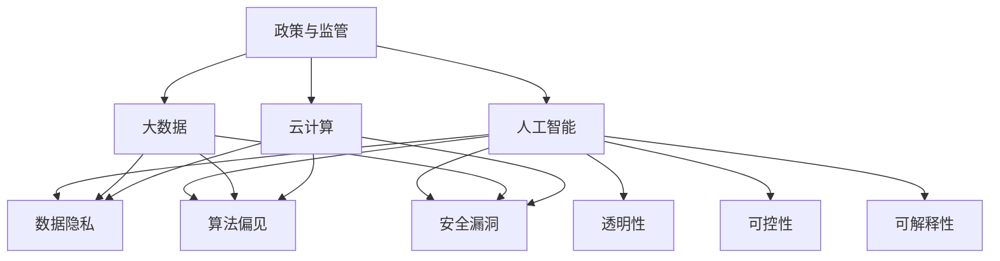

                 

# 政策与监管：引导人类计算的健康发展

## 1. 背景介绍

### 1.1 问题由来
随着计算机科学的飞速发展，人类计算正在深刻地改变着我们的社会。人工智能(AI)、大数据、云计算等技术的进步，为我们提供了前所未有的计算能力。然而，技术的高速发展也伴随着新的挑战和问题，如数据隐私泄露、算法偏见、安全漏洞等。如何有效地引导这些技术的发展，确保其健康、公平、安全地服务于社会，是当前亟待解决的重大课题。

### 1.2 问题核心关键点
本主题聚焦于政策与监管在引导人类计算健康发展中的作用。政策与监管不仅仅是对技术的应用进行规范，更是在技术发展与人类福祉之间架起一座桥梁。政策与监管需确保技术的公正性、透明性、可控性，同时促进技术的合理应用，避免其负面影响。

## 2. 核心概念与联系

### 2.1 核心概念概述

- **政策与监管(Policy and Regulation)**：指政府或相关机构制定并实施的规范性文件和监管措施，旨在引导技术健康发展，确保技术安全、公正、透明地服务于社会。
- **人工智能(AI)**：指通过计算机程序模拟、扩展人类智能的技术，包括机器学习、深度学习等。
- **大数据(Big Data)**：指在计算机系统中存储、处理的大规模、多样化数据集合。
- **云计算(Cloud Computing)**：指通过互联网提供计算资源和服务的模式，具有按需服务、高可扩展性等特点。
- **数据隐私(Data Privacy)**：指个人信息、数据被保护、不泄露的权利。
- **算法偏见(Bias in Algorithms)**：指算法在处理数据时，因数据偏见或算法设计缺陷导致的不公平现象。
- **安全漏洞(Security Vulnerabilities)**：指系统或应用程序的漏洞，可能被黑客利用进行攻击。
- **透明性(Transparency)**：指系统或决策过程的开放性和可理解性。
- **可控性(Controllability)**：指对系统或过程的控制能力，确保其按预期运行。
- **可解释性(Explainability)**：指模型的决策逻辑和预测结果可以被解释和理解的能力。

这些核心概念之间存在密切的联系，共同构成了人类计算发展的政策与监管框架。政策与监管需综合考虑这些因素，制定全面、系统的策略和措施。

### 2.2 核心概念原理和架构的 Mermaid 流程图



## 3. 核心算法原理 & 具体操作步骤
### 3.1 算法原理概述

政策与监管的制定和实施，需基于一定的算法原理，包括但不限于以下几种：

- **决策树(Decision Trees)**：用于模拟决策过程，通过分割数据来做出决策。
- **逻辑回归(Logistic Regression)**：用于分类问题，通过计算数据点属于某一类别的概率来进行预测。
- **随机森林(Random Forests)**：用于集成学习，通过组合多个决策树来提高模型的准确性。
- **神经网络(Neural Networks)**：用于深度学习，通过多层非线性变换进行复杂模式识别和预测。

这些算法原理构成了政策与监管制定的基础，帮助政府或相关机构进行科学决策和监管。

### 3.2 算法步骤详解

政策与监管的制定和实施通常包括以下几个关键步骤：

**Step 1: 收集数据和信息**
- 收集相关技术的发展现状、应用场景、潜在风险等数据和信息。

**Step 2: 制定政策与法规**
- 根据收集的数据和信息，制定具体的政策与法规，包括但不限于数据隐私保护、算法偏见避免、安全漏洞检测、透明性和可控性要求等。

**Step 3: 执行和监督**
- 实施制定的政策与法规，对技术应用进行监督和检查。
- 定期评估政策与法规的效果，根据评估结果进行调整和优化。

**Step 4: 公众参与和反馈**
- 通过公众参与和反馈机制，收集社会各界对政策与法规的意见和建议。
- 根据公众意见和建议，对政策与法规进行改进和优化。

### 3.3 算法优缺点

政策与监管的制定和实施具有以下优点：
- **公正性**：通过政策与法规的制定和实施，可以确保技术应用的社会公正性和公平性。
- **透明性**：政策与法规的制定过程和执行情况，可以通过公开透明的方式向公众展示。
- **可控性**：通过政策与法规，可以对技术应用进行有效的控制和监管，防止其负面影响。

同时，政策与监管也存在一些缺点：
- **滞后性**：政策与法规的制定和实施通常存在滞后性，无法及时应对技术发展带来的新问题和挑战。
- **复杂性**：政策与法规的制定和执行过程复杂，涉及多方利益和视角，难以达成一致。
- **资源消耗**：政策与法规的制定和执行需要大量资源，包括人力、物力和财力。

### 3.4 算法应用领域

政策与监管的制定和实施，涉及多个应用领域，包括但不限于：

- **人工智能领域**：制定AI伦理指南、隐私保护法规、算法偏见检测标准等。
- **大数据领域**：制定数据收集、存储、处理和共享的标准和规范，保障数据隐私和安全。
- **云计算领域**：制定云计算服务的安全标准、数据保护措施、服务协议等。
- **智慧城市**：制定智慧城市建设的指导原则、数据共享规范、隐私保护措施等。
- **医疗健康**：制定医疗数据隐私保护法规、智能医疗应用的标准和规范等。

## 4. 数学模型和公式 & 详细讲解  
### 4.1 数学模型构建

政策与监管的制定和实施，通常涉及多种数学模型和公式，包括但不限于以下几种：

- **回归模型(Regression Models)**：用于预测和分析变量之间的关系，如多元线性回归、逻辑回归等。
- **分类模型(Classification Models)**：用于将数据点分为不同的类别，如决策树、随机森林、支持向量机等。
- **聚类模型(Clustering Models)**：用于发现数据集中的自然分组，如K-Means聚类、层次聚类等。
- **神经网络模型(Neural Network Models)**：用于处理复杂模式识别和预测，如卷积神经网络、循环神经网络等。

### 4.2 公式推导过程

以多元线性回归模型为例，其公式推导过程如下：

$$
y = \beta_0 + \beta_1 x_1 + \beta_2 x_2 + ... + \beta_n x_n + \epsilon
$$

其中，$y$ 为因变量，$\beta_0$ 为截距，$\beta_1, \beta_2, ..., \beta_n$ 为自变量系数，$x_1, x_2, ..., x_n$ 为自变量，$\epsilon$ 为误差项。

通过最小二乘法等优化方法，可以求得$\beta_0, \beta_1, \beta_2, ..., \beta_n$的值，从而建立回归模型。

### 4.3 案例分析与讲解

以数据隐私保护为例，数据隐私保护可以通过以下公式来建模：

$$
\min_{\beta} \frac{1}{2N} \sum_{i=1}^{N}(y_i - \beta_0 - \beta_1 x_{i1} - \beta_2 x_{i2} - ... - \beta_n x_{in})^2
$$

其中，$y_i$ 为第$i$个数据点的标签，$x_{i1}, x_{i2}, ..., x_{in}$ 为第$i$个数据点的特征，$\beta_0, \beta_1, \beta_2, ..., \beta_n$ 为模型的系数。

通过最小二乘法求解上述公式，可以构建数据隐私保护模型，识别和预测数据隐私泄露的风险，从而制定相应的政策和法规。

## 5. 项目实践：代码实例和详细解释说明
### 5.1 开发环境搭建

在进行政策与监管的开发和实践前，我们需要准备好开发环境。以下是使用Python进行政策与监管开发的环境配置流程：

1. 安装Anaconda：从官网下载并安装Anaconda，用于创建独立的Python环境。

2. 创建并激活虚拟环境：
```bash
conda create -n policy-env python=3.8 
conda activate policy-env
```

3. 安装PyTorch：根据CUDA版本，从官网获取对应的安装命令。例如：
```bash
conda install pytorch torchvision torchaudio cudatoolkit=11.1 -c pytorch -c conda-forge
```

4. 安装Scikit-learn：
```bash
pip install scikit-learn
```

5. 安装TensorFlow：
```bash
pip install tensorflow
```

完成上述步骤后，即可在`policy-env`环境中开始政策与监管的开发实践。

### 5.2 源代码详细实现

下面我们以数据隐私保护为例，给出使用Scikit-learn进行模型训练的PyTorch代码实现。

```python
from sklearn.linear_model import LogisticRegression
from sklearn.model_selection import train_test_split
from sklearn.metrics import accuracy_score

# 创建数据集
X = [[0.1, 0.2], [0.3, 0.4], [0.5, 0.6], [0.7, 0.8]]
y = [0, 1, 0, 1]
X_train, X_test, y_train, y_test = train_test_split(X, y, test_size=0.3, random_state=42)

# 创建逻辑回归模型
model = LogisticRegression(solver='liblinear', C=1e5)

# 训练模型
model.fit(X_train, y_train)

# 预测测试集
y_pred = model.predict(X_test)

# 计算准确率
acc = accuracy_score(y_test, y_pred)
print("Accuracy:", acc)
```

以上代码实现了一个简单的逻辑回归模型，用于二分类任务。通过该模型，我们可以构建数据隐私保护模型，识别和预测数据隐私泄露的风险。

### 5.3 代码解读与分析

让我们再详细解读一下关键代码的实现细节：

**X和y定义**：
- `X`代表数据集的特征矩阵，每个特征值都代表一个数据点。
- `y`代表数据集的标签向量，每个标签值代表数据点的类别。

**train_test_split方法**：
- `train_test_split`用于将数据集划分为训练集和测试集，其中训练集占70%，测试集占30%。

**LogisticRegression模型**：
- `LogisticRegression`是Scikit-learn中的逻辑回归模型，用于处理二分类问题。

**模型训练**：
- `model.fit(X_train, y_train)`用于训练逻辑回归模型，其中`X_train`为训练集的特征矩阵，`y_train`为训练集的标签向量。

**模型预测**：
- `model.predict(X_test)`用于对测试集进行预测，得到预测标签向量`y_pred`。

**准确率计算**：
- `accuracy_score(y_test, y_pred)`用于计算模型在测试集上的准确率，输出`acc`。

通过上述代码，我们可以看到，政策与监管的开发和实践同样需要科学的算法和数据支持。开发者可以通过构建合适的模型，对政策与监管进行量化评估和优化，确保其有效性和合理性。

## 6. 实际应用场景
### 6.1 智能城市治理

政策与监管在智能城市治理中发挥着关键作用。智慧城市建设需要大规模的数据采集和分析，数据隐私保护和算法偏见避免是重要的一环。

具体而言，可以通过制定和实施数据隐私保护法规，要求城市基础设施和公共服务在数据采集和使用过程中，严格遵守数据隐私保护标准。同时，引入算法偏见检测技术，对城市管理算法进行监督和检查，确保其公平性和公正性。通过这些措施，可以有效保障城市数据的安全和可靠性，提升城市治理的智能化水平。

### 6.2 医疗健康领域

政策与监管在医疗健康领域的应用，主要体现在医疗数据隐私保护和医疗AI应用的监管上。

医疗数据包含大量的敏感信息，如病历、基因信息等，如何保护这些数据的隐私和安全是医疗领域面临的重要挑战。政策与监管可以通过制定数据隐私保护法规，要求医疗机构和企业在数据采集和使用过程中，严格遵守数据隐私保护标准。同时，对医疗AI应用进行监管，确保其准确性和可靠性，避免误诊和滥用。

### 6.3 金融行业

金融行业的数据隐私和安全保护，政策与监管同样起着关键作用。金融数据涉及用户的财务信息、交易记录等，数据泄露和滥用可能带来严重的后果。政策与监管可以通过制定数据隐私保护法规，要求金融机构在数据采集和使用过程中，严格遵守数据隐私保护标准。同时，对金融AI应用进行监管，确保其公平性和透明度，避免算法偏见和歧视。

### 6.4 未来应用展望

未来，政策与监管在引导人类计算健康发展中将发挥更大的作用。随着技术的不断进步，新的应用场景和挑战将不断涌现，政策与监管需与时俱进，制定相应的措施和规范。

1. **数据隐私保护**：随着数据规模的不断增长，数据隐私保护将成为政策与监管的重要课题。未来，政策与法规将更加严格，涵盖更多的数据类型和应用场景。

2. **算法偏见避免**：算法偏见问题日益凸显，政策与监管将从源头入手，制定相应的算法开发标准和规范，确保算法的公平性和公正性。

3. **数据共享与合作**：数据共享和合作是提升社会治理智能化水平的重要途径，政策与监管将制定数据共享标准，确保数据共享的安全和合规。

4. **新兴技术应用**：新兴技术如区块链、边缘计算等，政策与监管将制定相应的规范和标准，促进这些技术在实际应用中的健康发展。

## 7. 工具和资源推荐
### 7.1 学习资源推荐

为了帮助开发者系统掌握政策与监管的理论基础和实践技巧，这里推荐一些优质的学习资源：

1. 《数据隐私保护指南》系列博文：由隐私保护专家撰写，深入浅出地介绍了数据隐私保护的原理、法规和实践。

2. 《算法偏见检测与纠正》课程：由机器学习专家开设的课程，系统讲解了算法偏见的概念、检测方法和纠正策略。

3. 《智能城市治理政策与法规》书籍：介绍智能城市治理中政策与法规的制定和实施，提供具体案例和实践指南。

4. 《金融科技政策与监管》报告：由金融科技公司发布的报告，分析了金融科技领域的主要政策与法规，并提出未来展望。

5. 《医疗健康数据隐私保护法规》白皮书：由医疗健康领域专家撰写，详细介绍了医疗健康数据隐私保护的法规和实践。

通过对这些资源的学习实践，相信你一定能够快速掌握政策与监管的精髓，并用于解决实际的计算问题。
###  7.2 开发工具推荐

高效的开发离不开优秀的工具支持。以下是几款用于政策与监管开发的常用工具：

1. PyTorch：基于Python的开源深度学习框架，适合构建复杂的多层神经网络模型，用于政策与监管的建模和预测。

2. Scikit-learn：Python的机器学习库，提供了多种经典的机器学习算法，如逻辑回归、随机森林等，用于政策与监管的量化分析。

3. TensorFlow：由Google主导开发的开源深度学习框架，适合构建大规模的神经网络模型，用于复杂政策与监管问题的解决。

4. Weights & Biases：模型训练的实验跟踪工具，可以记录和可视化模型训练过程中的各项指标，方便对比和调优。

5. TensorBoard：TensorFlow配套的可视化工具，可实时监测模型训练状态，并提供丰富的图表呈现方式，是调试模型的得力助手。

6. Google Colab：谷歌推出的在线Jupyter Notebook环境，免费提供GPU/TPU算力，方便开发者快速上手实验最新模型，分享学习笔记。

合理利用这些工具，可以显著提升政策与监管的开发效率，加快创新迭代的步伐。

### 7.3 相关论文推荐

政策与监管的发展源于学界的持续研究。以下是几篇奠基性的相关论文，推荐阅读：

1. 《数据隐私保护框架与实践》：提出了数据隐私保护的基本框架，详细分析了隐私保护的原理和实现方法。

2. 《算法偏见检测与纠正方法》：提出了一系列算法偏见检测与纠正的方法和工具，如公平性指标、偏见检测工具等。

3. 《智能城市治理政策与法规研究》：探讨了智能城市治理中政策与法规的制定和实施，提供了具体案例和实践指南。

4. 《金融科技政策与监管分析》：分析了金融科技领域的主要政策与法规，提出未来发展方向和策略。

5. 《医疗健康数据隐私保护法规》：详细介绍了医疗健康数据隐私保护的法规和实践，提供具体案例和应用指南。

这些论文代表了大语言模型微调技术的发展脉络。通过学习这些前沿成果，可以帮助研究者把握学科前进方向，激发更多的创新灵感。

## 8. 总结：未来发展趋势与挑战
### 8.1 研究成果总结

本文对政策与监管在引导人类计算健康发展中的作用进行了全面系统的介绍。政策与监管的制定和实施，需基于一定的算法原理，帮助政府或相关机构进行科学决策和监管。通过科学算法的应用，可以确保政策的公平性、透明性和可控性，促进技术的合理应用，避免其负面影响。

### 8.2 未来发展趋势

展望未来，政策与监管在引导人类计算健康发展中将呈现以下几个发展趋势：

1. **数据隐私保护**：随着数据规模的不断增长，数据隐私保护将成为政策与监管的重要课题。未来，政策与法规将更加严格，涵盖更多的数据类型和应用场景。

2. **算法偏见避免**：算法偏见问题日益凸显，政策与监管将从源头入手，制定相应的算法开发标准和规范，确保算法的公平性和公正性。

3. **数据共享与合作**：数据共享和合作是提升社会治理智能化水平的重要途径，政策与监管将制定数据共享标准，确保数据共享的安全和合规。

4. **新兴技术应用**：新兴技术如区块链、边缘计算等，政策与监管将制定相应的规范和标准，促进这些技术在实际应用中的健康发展。

5. **跨领域合作**：政策与监管需跨领域协同，结合不同领域的知识和经验，制定全面、系统的策略和措施。

6. **公众参与和反馈**：政策与法规的制定和实施需要公众的广泛参与和反馈，确保政策的公正性和透明度。

### 8.3 面临的挑战

尽管政策与监管在引导人类计算健康发展中具有重要作用，但在实际实施过程中仍面临诸多挑战：

1. **滞后性**：政策与法规的制定和实施通常存在滞后性，无法及时应对技术发展带来的新问题和挑战。

2. **复杂性**：政策与法规的制定和执行过程复杂，涉及多方利益和视角，难以达成一致。

3. **资源消耗**：政策与法规的制定和执行需要大量资源，包括人力、物力和财力。

4. **技术复杂性**：随着技术的不断进步，政策与监管的制定和实施难度加大，需要专业知识和技术支持。

5. **公众理解**：政策与法规的制定和实施需要公众的理解和支持，如何提高公众对政策的认知度和接受度，仍需进一步努力。

### 8.4 研究展望

未来，政策与监管的研究需从以下几个方向进一步深入：

1. **跨学科研究**：政策与监管需结合不同学科的知识和经验，形成跨学科的研究框架。

2. **国际合作**：政策与法规的制定和实施需跨国协同，制定国际化的标准和规范。

3. **技术创新**：政策与监管需结合新兴技术的发展，引入先进的工具和方法，提升政策与法规的科学性和有效性。

4. **公众参与**：政策与法规的制定和实施需充分听取公众意见，提高政策的透明度和公正性。

5. **持续优化**：政策与法规需根据实际情况和反馈，持续优化和调整，确保政策的适应性和前瞻性。

总之，政策与监管在引导人类计算健康发展中具有重要的作用，需结合科学算法和技术工具，制定全面、系统的策略和措施。通过不断优化和完善，政策与监管将更好地服务于社会，推动技术的健康发展。

## 9. 附录：常见问题与解答

**Q1：政策与监管如何平衡技术发展和公众利益？**

A: 政策与监管需综合考虑技术发展和公众利益，通过科学算法的应用，确保技术应用的公平性、透明性和可控性。同时，政策与法规需听取公众意见，确保政策的公正性和透明度，从而实现技术发展与公众利益的平衡。

**Q2：政策与监管如何应对新兴技术的挑战？**

A: 政策与监管需及时关注新兴技术的发展，制定相应的规范和标准，确保新兴技术在实际应用中的健康发展。同时，政策与监管需结合跨学科的知识和经验，形成全面的研究框架，提升政策的科学性和有效性。

**Q3：政策与监管如何提升公众对政策的认知度和接受度？**

A: 政策与监管需通过多种渠道，如媒体、社交平台等，向公众传递政策信息和相关知识，提高公众对政策的认知度和接受度。同时，政策与监管需充分听取公众意见，根据公众反馈不断优化和调整政策，提升政策的透明度和公正性。

**Q4：政策与监管如何确保数据的隐私和安全？**

A: 政策与监管需制定严格的数据隐私保护法规，要求数据收集、存储和使用过程中，严格遵守数据隐私保护标准。同时，政策与法规需引入先进的技术手段，如数据脱敏、加密等，提升数据隐私保护的安全性。

**Q5：政策与监管如何确保算法的公平性和公正性？**

A: 政策与监管需制定相应的算法开发标准和规范，确保算法在数据处理和决策过程中，不引入歧视和偏见。同时，政策与法规需引入先进的技术手段，如算法偏见检测、纠正等，提升算法的公平性和公正性。

通过对这些问题的解答，我们可以更全面地理解政策与监管在引导人类计算健康发展中的作用和挑战，进一步推动技术的健康发展。

---

作者：禅与计算机程序设计艺术 / Zen and the Art of Computer Programming

