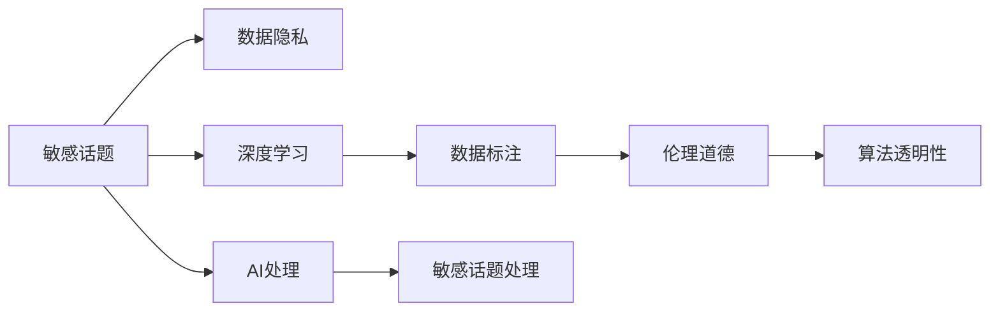

                 

# 敏感话题搜索：AI的平衡之道

> 关键词：敏感话题, 数据隐私, 深度学习, 数据标注, 人工智能, 伦理道德

## 1. 背景介绍

### 1.1 问题由来
在现代社会，信息爆炸的背景下，敏感话题的讨论与传播无处不在。从政治事件到社会热点，从隐私保护到公共安全，敏感话题无处不在，也无处可避。在这样的环境下，如何平衡人工智能（AI）技术的应用与敏感话题的处理，成为一个亟待解决的课题。

### 1.2 问题核心关键点
AI在处理敏感话题时，面临着多方面的挑战：

- **数据隐私问题**：如何确保敏感话题处理过程中的数据隐私和安全。
- **模型偏见问题**：AI模型是否会引入或放大偏见，影响敏感话题的公正处理。
- **伦理道德问题**：AI在处理敏感话题时，如何遵守伦理道德，避免误导或伤害。
- **算法透明性问题**：AI模型的决策过程是否透明，能否被理解和信任。

这些问题不仅影响着AI技术在敏感话题处理中的应用效果，也关系到社会的公平与正义。本文将深入探讨这些关键问题，并提出平衡之道。

## 2. 核心概念与联系

### 2.1 核心概念概述

- **敏感话题（Sensitive Topics）**：指那些涉及个人隐私、政治敏感、性别歧视、种族歧视等容易引发争议或不适的议题。
- **数据隐私（Data Privacy）**：指保护个人数据不被未授权访问、收集、存储和使用，以维护个体权益和信息安全。
- **深度学习（Deep Learning）**：指利用神经网络等深度学习模型处理大规模数据，进行特征提取和模式识别，是AI技术的重要组成部分。
- **数据标注（Data Annotation）**：指对原始数据进行标注，为模型训练提供指导，是训练高性能AI模型的重要环节。
- **伦理道德（Ethical Morality）**：指在AI技术应用中遵循的道德规范和社会责任，确保技术应用符合社会正义和公平。
- **算法透明性（Algorithm Transparency）**：指AI模型的决策过程能否被解释和理解，确保用户和监管者可以信任和监督模型。

这些概念相互关联，共同构成了AI处理敏感话题的技术框架。

### 2.2 核心概念原理和架构的 Mermaid 流程图



## 3. 核心算法原理 & 具体操作步骤
### 3.1 算法原理概述

AI处理敏感话题的算法原理主要基于深度学习模型，通过大量标注数据进行训练，学习敏感话题的特征和模式。具体步骤包括数据收集、数据标注、模型训练、模型评估和模型部署。

### 3.2 算法步骤详解

**Step 1: 数据收集**
收集与敏感话题相关的数据，确保数据来源多样性和代表性。数据可以来自公开数据集、社交媒体、新闻报道等，但需要注意数据隐私问题，避免侵犯个人隐私和版权。

**Step 2: 数据标注**
对收集的数据进行标注，标注内容应准确、公正，避免引入偏见和歧视。标注过程应透明、可追溯，确保标注结果的可信度。

**Step 3: 模型训练**
使用标注好的数据对深度学习模型进行训练，选择合适的模型架构和训练算法。训练过程中应设置合适的超参数，如学习率、批大小等。

**Step 4: 模型评估**
在验证集上对训练好的模型进行评估，使用合适的评价指标如准确率、召回率、F1分数等。评估结果应全面反映模型在敏感话题处理上的表现。

**Step 5: 模型部署**
将训练好的模型部署到实际应用中，应确保模型在生产环境中的稳定性和性能。部署过程中应考虑数据隐私和算法透明性问题，确保模型符合伦理道德规范。

### 3.3 算法优缺点

**优点**：

- **自动化处理**：AI模型可以快速处理大量敏感话题数据，提高处理效率。
- **公正性**：AI模型通过数据标注过程，可以避免人为偏见，提高处理公正性。
- **可扩展性**：AI模型可以处理多种类型的敏感话题，具有较好的通用性和可扩展性。

**缺点**：

- **数据隐私风险**：数据标注和模型训练过程中可能涉及敏感数据，存在隐私泄露风险。
- **算法偏见**：深度学习模型可能引入数据中的偏见，放大原有歧视和不公。
- **伦理道德挑战**：AI在处理敏感话题时，可能引发伦理道德争议。
- **算法透明性不足**：复杂AI模型难以解释和理解，缺乏透明性。

### 3.4 算法应用领域

- **社交媒体监控**：使用AI模型监控社交媒体上的敏感话题讨论，识别极端言论和潜在风险。
- **舆情分析**：分析公众对敏感话题的看法和情感倾向，为政府和企业决策提供依据。
- **隐私保护**：在处理涉及个人隐私的敏感话题时，确保数据隐私和安全。
- **信息过滤**：过滤和屏蔽涉及性别、种族等敏感话题的内容，维护网络环境健康。

## 4. 数学模型和公式 & 详细讲解 & 举例说明

### 4.1 数学模型构建

AI处理敏感话题的数学模型主要基于分类、回归、聚类等深度学习模型。以分类模型为例，假设有敏感话题 $T$ 和两个类别 $C_1, C_2$，分类模型的目标是最小化损失函数 $L$，使得模型预测结果尽可能接近真实标签 $y$。

损失函数 $L$ 可以表示为：

$$
L = -\frac{1}{N} \sum_{i=1}^N (y_i \log p_i + (1-y_i) \log (1-p_i))
$$

其中 $p_i$ 是模型预测结果，$y_i$ 是真实标签。

### 4.2 公式推导过程

对于分类模型，假设有 $K$ 个训练样本 $(x_i, y_i)$，模型参数为 $\theta$，损失函数为 $L(\theta)$。梯度下降算法的更新公式为：

$$
\theta \leftarrow \theta - \eta \nabla_{\theta}L(\theta)
$$

其中 $\eta$ 是学习率。

### 4.3 案例分析与讲解

以情感分析模型为例，模型输入为敏感话题文本，输出为情感极性（如正面、负面、中性）。训练数据集包含已标注的情感文本，模型通过最小化损失函数 $L$ 来训练。

## 5. 项目实践：代码实例和详细解释说明

### 5.1 开发环境搭建

要使用AI处理敏感话题，需要搭建相应的开发环境。以下是一个基本的环境搭建流程：

1. 安装 Python 环境：确保 Python 环境稳定，建议使用虚拟环境。
2. 安装 TensorFlow 或 PyTorch：深度学习模型开发的基础框架。
3. 安装 Scikit-learn 和 Pandas：用于数据处理和分析。
4. 安装相关的 AI 库：如 Keras、TensorFlow-Keras 等。

### 5.2 源代码详细实现

下面是一个简单的情感分析模型实现，用于处理敏感话题的情感极性：

```python
import tensorflow as tf
from tensorflow.keras import layers

# 构建模型
model = tf.keras.Sequential([
    layers.Embedding(input_dim=vocab_size, output_dim=embedding_dim, input_length=max_length),
    layers.Bidirectional(layers.LSTM(128)),
    layers.Dense(1, activation='sigmoid')
])

# 编译模型
model.compile(loss='binary_crossentropy', optimizer='adam', metrics=['accuracy'])

# 训练模型
model.fit(train_data, train_labels, epochs=num_epochs, batch_size=batch_size, validation_data=(val_data, val_labels))
```

### 5.3 代码解读与分析

代码中使用了 TensorFlow 的 Keras API，构建了一个简单的情感分析模型。模型主要由嵌入层（Embedding）、双向 LSTM 层（Bidirectional LSTM）和输出层（Dense）组成。嵌入层将输入文本转换为向量表示，双向 LSTM 层用于提取文本特征，输出层通过 sigmoid 激活函数输出情感极性。

## 6. 实际应用场景

### 6.1 社交媒体监控

社交媒体上的敏感话题监控可以通过 AI 模型实现，识别极端言论和潜在风险。例如，Twitter 上的极端言论监测系统，可以使用情感分析模型识别负面情感，及时报警。

### 6.2 舆情分析

政府和企业可以使用 AI 模型分析公众对敏感话题的看法和情感倾向，为政策制定和市场预测提供依据。例如，新闻媒体可以使用情感分析模型分析受众对某一事件的情感倾向，了解舆情动态。

### 6.3 隐私保护

在处理涉及个人隐私的敏感话题时，AI 模型可以用于数据去标识化（Data De-identification）和隐私保护。例如，医疗数据的去标识化，确保敏感信息不泄露。

### 6.4 信息过滤

AI 模型可以用于信息过滤，屏蔽涉及性别、种族等敏感话题的内容，维护网络环境健康。例如，社交媒体平台可以使用文本过滤模型屏蔽敏感内容，保护用户免受不良信息影响。

## 7. 工具和资源推荐

### 7.1 学习资源推荐

- **《深度学习》课程**：斯坦福大学的吴恩达教授主讲的《深度学习》课程，系统介绍了深度学习的基本概念和实现方法。
- **Kaggle**：数据科学竞赛平台，提供了丰富的数据集和竞赛项目，适合学习 AI 模型处理实际问题。
- **TensorFlow 官方文档**：TensorFlow 的官方文档详细介绍了 TensorFlow 的各个模块和功能，适合深入学习。
- **Python 基础教程**：《Python 编程：从入门到实践》，适合零基础读者学习 Python 编程。

### 7.2 开发工具推荐

- **Jupyter Notebook**：开源的交互式编程环境，适合数据科学和深度学习项目的开发。
- **Google Colab**：Google 提供的免费 Jupyter Notebook 环境，支持 GPU 计算，适合高性能计算任务。
- **TensorBoard**：TensorFlow 的可视化工具，可以实时监控模型训练过程，适合调试和分析模型性能。

### 7.3 相关论文推荐

- **《深度学习在文本分类中的应用》**：论文介绍了深度学习在文本分类任务中的应用，提出了多种模型架构和训练方法。
- **《AI 伦理与道德问题》**：论文探讨了 AI 技术在伦理和道德方面的挑战和解决方案。

## 8. 总结：未来发展趋势与挑战

### 8.1 研究成果总结

本文从背景介绍、核心概念、算法原理、操作步骤、实际应用场景等方面，系统探讨了 AI 处理敏感话题的技术框架和方法。AI 技术在处理敏感话题时，可以提供自动化、公正性的解决方案，但也面临着数据隐私、算法偏见、伦理道德、算法透明性等挑战。

### 8.2 未来发展趋势

未来，AI 处理敏感话题的发展趋势可能包括以下几个方面：

- **隐私保护技术发展**：随着隐私保护技术的发展，数据隐私问题将得到更好的解决。
- **AI 伦理道德规范**：AI 伦理道德规范将逐渐完善，确保技术应用符合社会正义和公平。
- **算法透明性和可解释性提升**：算法透明性和可解释性将成为 AI 研究的重要方向，增强模型的可信度和可理解性。
- **多模态数据融合**：多模态数据的融合将提高 AI 模型的处理能力和应用范围。

### 8.3 面临的挑战

AI 处理敏感话题仍然面临诸多挑战：

- **数据隐私保护**：如何保护数据隐私，确保敏感数据不被滥用。
- **算法偏见消除**：如何消除 AI 模型中的偏见，确保处理公正性。
- **伦理道德约束**：如何在 AI 技术应用中遵守伦理道德规范，确保技术应用符合社会价值观。
- **算法透明性**：如何提高 AI 模型的透明性和可解释性，增强用户和监管者的信任。

### 8.4 研究展望

未来，AI 处理敏感话题的研究需要进一步探索以下几个方向：

- **隐私保护技术**：开发更加安全、高效的隐私保护技术，确保数据隐私和安全。
- **公平性算法**：研究公平性算法，消除 AI 模型中的偏见和歧视，确保处理公正性。
- **伦理道德模型**：建立伦理道德模型，指导 AI 技术应用中的伦理决策。
- **透明性增强**：提高 AI 模型的透明性和可解释性，增强用户和监管者的信任。

## 9. 附录：常见问题与解答

**Q1: AI 处理敏感话题面临的主要挑战有哪些？**

A: AI 处理敏感话题面临的主要挑战包括数据隐私保护、算法偏见消除、伦理道德约束和算法透明性不足。

**Q2: 如何在 AI 处理敏感话题时保护数据隐私？**

A: 数据隐私保护可以通过数据去标识化、加密存储、访问控制等措施实现。

**Q3: AI 模型如何消除偏见？**

A: 消除偏见可以通过数据平衡、公平性算法、偏差检测等方法实现。

**Q4: 如何确保 AI 模型符合伦理道德规范？**

A: 确保 AI 模型符合伦理道德规范需要建立伦理导向的评价指标和监督机制，确保模型决策透明、公正。

**Q5: 如何提高 AI 模型的透明性和可解释性？**

A: 提高透明性和可解释性可以通过模型可视化、可解释模型设计、用户友好的界面等措施实现。

---

作者：禅与计算机程序设计艺术 / Zen and the Art of Computer Programming

