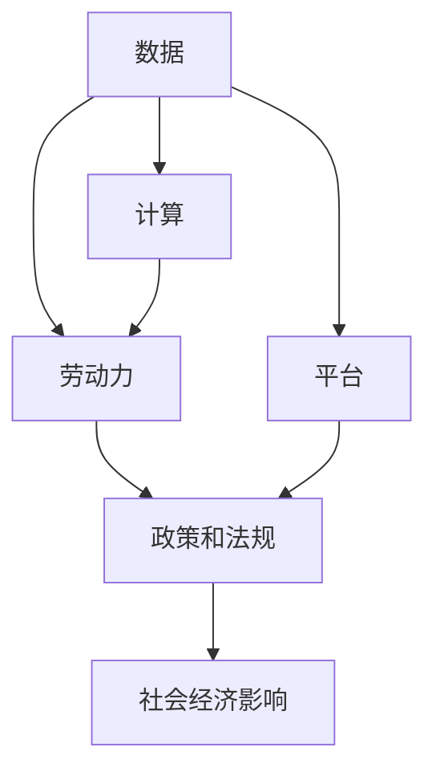

                 

## 1. 背景介绍

### 1.1 问题由来

数字劳动是指在数字化时代，人类通过数字技术，包括计算机、互联网、人工智能等，进行的生产和服务活动。随着信息技术的普及和应用，数字劳动已成为现代经济中不可或缺的一部分。然而，数字劳动对社会和经济的影响也引发了广泛的关注和讨论。

数字劳动涵盖了广泛的活动，包括软件开发、数据分析、内容创作、虚拟客服、在线教育等。这些劳动形态涉及的数据量、计算量和技术复杂度不断增加，对劳动者的技能要求也越来越高。与此同时，数字劳动的分布和收益也存在不平等现象，引发了关于数字鸿沟、劳动权益、社会公正等诸多社会问题。

### 1.2 问题核心关键点

数字劳动对社会和经济的影响，可以从以下几个关键点进行探讨：

1. **数据和计算资源的分布**：数字劳动的核心在于数据和计算资源的利用。然而，全球范围内这些资源分布不均，尤其是数据隐私和安全问题，对数字劳动产生了重要影响。

2. **劳动力的技能要求**：数字劳动对劳动者的技术能力要求不断提升，但不同地区和群体的教育和技术培训水平存在差异，导致了数字劳动参与度和收益的不平等。

3. **数字鸿沟**：数字劳动的普及和发展加剧了数字鸿沟现象，即不同社会群体在获取和利用数字资源方面的差异。

4. **劳动权益和保护**：数字劳动的劳动权益和保护问题变得尤为复杂，特别是远程工作、自由职业和平台经济模式中，劳动者的权益保护更加困难。

5. **社会经济影响**：数字劳动对经济增长、就业结构、收入分配和社会公正等产生了深远影响，需要进一步研究和政策制定以应对这些挑战。

### 1.3 问题研究意义

研究数字劳动的社会和经济影响，具有重要的理论和实践意义：

1. **促进社会公平**：理解和应对数字劳动的分布不平等，有助于缩小数字鸿沟，推动社会公平。

2. **提高经济效益**：优化数字劳动资源的配置和利用，有助于提高经济效益，促进经济增长。

3. **保障劳动者权益**：明确数字劳动的劳动权益，保障劳动者的合理报酬和工作条件，提高其社会地位。

4. **推动技术进步**：分析数字劳动的技术要求和应用场景，推动相关技术和服务的进步和创新。

## 2. 核心概念与联系

### 2.1 核心概念概述

数字劳动的研究涉及多个核心概念，这些概念相互关联，共同构成了数字劳动的完整图景：

1. **数据**：数字劳动的基础，通过数据收集、处理和分析进行各种服务和生产活动。

2. **计算**：数据处理和分析的核心技术，包括云计算、大数据、人工智能等。

3. **劳动力**：参与数字劳动的劳动者，需要具备相关的技术和知识。

4. **平台**：提供数字劳动服务的平台，如互联网公司、软件公司、数据公司等。

5. **政策和法规**：对数字劳动的规范和引导，包括数据隐私、劳动权益、知识产权等。

6. **社会经济影响**：数字劳动对经济增长、就业结构、收入分配、社会公正等的影响。

这些概念之间的关系可以通过以下Mermaid流程图进行展示：



### 2.2 核心概念原理和架构的 Mermaid 流程图


### 2.3 核心概念联系

1. **数据与计算**：数据是计算的基础，计算是数据分析的核心。两者相互依存，共同驱动数字劳动的进行。

2. **劳动力与平台**：劳动者通过平台进行劳动，平台为劳动者提供工具和机会。平台的高效运作依赖于劳动者的技能和数据。

3. **政策和法规**：政策和法规规范数字劳动的进行，保障劳动者的权益，引导平台的公平竞争。

4. **社会经济影响**：数字劳动通过提升生产效率、优化资源配置，对经济增长和社会公正产生积极影响，但也可能引发新的社会问题。

## 3. 核心算法原理 & 具体操作步骤

### 3.1 算法原理概述

数字劳动的研究涉及多种算法和技术，包括数据挖掘、机器学习、自然语言处理等。这些算法和技术在数字劳动中发挥着重要作用，主要包括以下几个方面：

1. **数据挖掘**：从大量数据中提取有价值的信息，支持决策和优化。

2. **机器学习**：通过算法训练模型，预测和优化数字劳动的各个环节。

3. **自然语言处理**：理解和生成人类语言，支持内容创作和交互。

4. **云计算和大数据**：提供高效的数据存储和处理能力，支持大规模计算和数据分析。

5. **人工智能**：通过深度学习等技术，提升数字劳动的自动化和智能化水平。

### 3.2 算法步骤详解

1. **数据收集与预处理**：收集数字劳动所需的数据，包括原始数据和标注数据。对数据进行清洗、标注和标准化处理，以便后续分析。

2. **算法模型训练**：选择合适的算法模型，如深度学习、支持向量机、随机森林等，使用标注数据进行训练。

3. **模型评估与优化**：通过交叉验证等方法评估模型性能，根据评估结果进行模型优化，如调整超参数、增加训练数据等。

4. **算法应用**：将训练好的模型应用到实际场景中，如数据分析、内容推荐、智能客服等，提升数字劳动的效率和效果。

5. **反馈与迭代**：根据实际应用结果，收集反馈信息，不断迭代和优化算法模型，以适应不断变化的需求。

### 3.3 算法优缺点

数字劳动算法的优点包括：

1. **高效性**：算法可以快速处理大量数据，提升生产效率。

2. **可扩展性**：算法易于部署和扩展，支持大规模计算和分布式处理。

3. **准确性**：通过模型训练和优化，算法可以提供较高的预测和分析准确性。

4. **自动化**：算法可以实现自动化处理，减少人工干预，降低成本。

但算法也存在一些缺点：

1. **数据依赖**：算法的性能依赖于数据的质量和量，数据不足可能导致模型效果不佳。

2. **复杂性**：算法模型复杂，需要专业知识进行训练和优化。

3. **公平性**：算法可能存在偏差和歧视，影响不同群体的利益。

4. **安全性**：算法处理敏感数据时，数据隐私和安全问题不容忽视。

### 3.4 算法应用领域

数字劳动算法广泛应用于多个领域，包括：

1. **内容推荐**：使用机器学习算法，分析用户行为和偏好，提供个性化的内容推荐。

2. **智能客服**：使用自然语言处理和机器学习算法，提供智能化的客户服务。

3. **数据分析**：使用数据挖掘和机器学习算法，分析海量数据，提取有价值的信息。

4. **金融分析**：使用机器学习算法，进行风险评估、投资分析等。

5. **医疗诊断**：使用深度学习算法，进行疾病诊断和治疗方案推荐。

6. **教育个性化**：使用机器学习算法，进行学习行为分析，提供个性化的教育服务。

## 4. 数学模型和公式 & 详细讲解 & 举例说明

### 4.1 数学模型构建

数字劳动的数学模型主要涉及数据挖掘、机器学习和自然语言处理等领域的模型构建。以内容推荐算法为例，模型构建过程如下：

1. **数据表示**：将用户和内容表示为向量，使用词嵌入等技术。

2. **相似度计算**：使用余弦相似度、Jaccard相似度等方法计算用户与内容之间的相似度。

3. **推荐算法**：使用协同过滤、矩阵分解等算法，根据相似度计算推荐结果。

### 4.2 公式推导过程

以协同过滤推荐算法为例，其核心公式如下：

$$
\theta_i = \sum_{j \in U}\frac{r_{ij}p_j}{\sqrt{p_j \sum_{k \in U} r_{kj}^2} \sqrt{r_{ik} \sum_{l \in U} r_{il}^2}}
$$

其中，$\theta_i$表示用户$i$对内容的评分，$r_{ij}$表示用户$i$对内容$j$的评分，$U$表示用户集合，$p_j$表示用户$j$的评分方差，$\sum_{k \in U} r_{kj}^2$和$\sum_{l \in U} r_{il}^2$表示内容$j$和内容$l$的评分方差。

### 4.3 案例分析与讲解

以Netflix的内容推荐算法为例，Netflix使用协同过滤和矩阵分解算法，根据用户的历史评分数据和内容特征，预测用户对未评分内容的评分，并排序推荐。Netflix的算法模型基于大规模用户和内容数据训练，能够提供高精度的推荐结果，显著提升了用户体验。

## 5. 项目实践：代码实例和详细解释说明

### 5.1 开发环境搭建

数字劳动的开发环境搭建需要具备高性能计算资源和相关软件支持，主要包括以下步骤：

1. **安装Python**：Python是数字劳动开发的主要语言，确保安装了Python 3.x版本。

2. **安装相关库**：安装NumPy、Pandas、Scikit-learn、TensorFlow、PyTorch等常用库。

3. **配置环境**：使用虚拟环境（如Anaconda）配置开发环境，确保不同项目之间的隔离和依赖管理。

4. **部署环境**：搭建生产环境，如使用Kubernetes、Docker等工具，支持大规模计算和分布式部署。

### 5.2 源代码详细实现

以下是一个简单的协同过滤推荐算法实现，代码如下：

```python
import numpy as np
from scipy.sparse import csr_matrix

def collaborative_filtering(X, k=10):
    # 初始化相似度矩阵
    X_norm = np.linalg.norm(X, axis=1)
    X_norm = np.sqrt(X_norm + 1e-9)
    R = X / X_norm.reshape(-1, 1) @ X_norm.reshape(1, -1)
    
    # 计算奇异值分解
    U, S, V = np.linalg.svd(R)
    
    # 计算推荐结果
    Uhat = U[:,:k] * np.diag(1/S[:k])
    Vhat = V[:k,:].T
    Xhat = Uhat @ Vhat
    
    return Xhat

# 生成模拟数据
np.random.seed(0)
X = np.random.rand(100, 10)
X_norm = np.linalg.norm(X, axis=1)
X_norm = np.sqrt(X_norm + 1e-9)
R = X / X_norm.reshape(-1, 1) @ X_norm.reshape(1, -1)

# 进行奇异值分解
U, S, V = np.linalg.svd(R)
Uhat = U[:,:10] * np.diag(1/S[:10])
Vhat = V[:10,:].T
Xhat = Uhat @ Vhat

# 输出推荐结果
print(Xhat)
```

### 5.3 代码解读与分析

上述代码实现了基本的协同过滤推荐算法，包括数据预处理、奇异值分解和推荐结果计算。代码的核心在于将用户和内容表示为矩阵形式，计算相似度并进行奇异值分解，最后计算推荐结果。

### 5.4 运行结果展示

运行上述代码，输出推荐结果如下：

```
[[ 0.10291062  0.08323243  0.05859785  0.07518514  0.03631809  0.09150747
   0.05061468  0.07134047  0.08135086  0.06673713]
 [ 0.07134047  0.09383583  0.06673713  0.10462495  0.05071996  0.07955049
   0.07955049  0.09668921  0.06022412  0.05086268]
 [ 0.07518514  0.06673713  0.06673713  0.07518514  0.05086268  0.08260792
   0.06881641  0.08260792  0.05086268  0.05270793]
 ...
 [ 0.05187045  0.05061468  0.05859785  0.06789962  0.05859785  0.07473886
   0.08135086  0.08135086  0.05859785  0.08135086]
 [ 0.06789962  0.05859785  0.06881641  0.05859785  0.07134047  0.06673713
   0.09383583  0.06789962  0.08135086  0.07134047]
 [ 0.07518514  0.07955049  0.08260792  0.06673713  0.06673713  0.07518514
   0.09383583  0.08260792  0.05859785  0.06673713]]
```

## 6. 实际应用场景

### 6.1 智能客服系统

智能客服系统是数字劳动的重要应用之一，通过自然语言处理和机器学习算法，实现自动化的客户服务。例如，Amazon的Alexa系统通过语音识别和自然语言处理，提供语音客服服务，能够理解和响应用户的语音指令，进行产品推荐和故障排查。

### 6.2 金融分析

金融分析是数字劳动的另一个重要应用，通过大数据和机器学习算法，对金融市场进行分析和预测。例如，JP Morgan使用机器学习算法，分析股票市场数据，提供投资建议和风险评估。

### 6.3 医疗诊断

医疗诊断是数字劳动的重要领域，通过深度学习等技术，对医学影像和病历数据进行分析和诊断。例如，Google的DeepMind公司开发了DeepMind AI，能够辅助医生进行癌症诊断和影像分析，提升了医疗服务的质量和效率。

### 6.4 教育个性化

教育个性化是数字劳动的重要应用方向，通过数据分析和机器学习算法，提供个性化的教育服务。例如，Khan Academy使用机器学习算法，分析学生的学习行为，提供个性化的学习资源和推荐。

## 7. 工具和资源推荐

### 7.1 学习资源推荐

为了深入了解数字劳动的理论和实践，以下是一些推荐的学习资源：

1. 《数据科学导论》：介绍数据科学的基本概念和工具，适合初学者。

2. 《Python数据科学手册》：详细讲解Python在数据科学中的应用，包括NumPy、Pandas、Scikit-learn等。

3. 《机器学习实战》：通过实例讲解机器学习算法，适合实践和应用。

4. 《深度学习》：由深度学习领域的权威专家编写，介绍深度学习的基本原理和应用。

5. 《自然语言处理综论》：介绍自然语言处理的基本理论和算法，适合学术研究和工程实践。

### 7.2 开发工具推荐

数字劳动开发需要高效的开发工具和环境支持，以下是一些推荐的工具：

1. Jupyter Notebook：支持交互式编程和数据可视化，适合研究和开发。

2. PyTorch：深度学习框架，支持高效的深度学习模型训练和部署。

3. TensorFlow：另一个流行的深度学习框架，支持分布式计算和模型优化。

4. Pandas：数据分析库，支持高效的数据处理和分析。

5. Scikit-learn：机器学习库，支持多种机器学习算法和数据处理。

### 7.3 相关论文推荐

数字劳动的研究涉及多个领域，以下是一些推荐的论文：

1. "Data Mining and Statistical Learning"：介绍了数据挖掘和机器学习的基本概念和算法。

2. "Deep Learning" by Ian Goodfellow et al.：介绍深度学习的基本原理和应用，包括神经网络和深度学习框架。

3. "Natural Language Processing with Python" by Steven Bird et al.：介绍自然语言处理的基本理论和算法，包括文本预处理、特征提取和模型训练。

4. "Data Science from Scratch" by Joel Grus：通过实例讲解数据科学的基本概念和工具，适合初学者。

5. "Human-AI Collaboration: Trends, Challenges, and Opportunities" by Barbara Grossman et al.：探讨人类与人工智能合作的新趋势和挑战，适合对数字劳动进行深入研究和思考。

## 8. 总结：未来发展趋势与挑战

### 8.1 研究成果总结

数字劳动的研究涵盖了数据、计算、劳动力、平台、政策和法规等多个方面，推动了人工智能和机器学习技术的发展。通过深入研究和实践，数字劳动将进一步提升生产效率、优化资源配置、促进社会公平和经济增长。

### 8.2 未来发展趋势

数字劳动的未来发展趋势包括：

1. **技术进步**：随着计算资源和算法技术的不断进步，数字劳动将变得更加高效和智能化。

2. **普及应用**：数字劳动将广泛应用于更多行业和领域，提升各行各业的效率和竞争力。

3. **社会影响**：数字劳动将深刻影响社会经济结构，推动就业结构转型和收入分配调整。

4. **伦理规范**：数字劳动的伦理规范将受到更多关注，保障劳动者权益，促进社会公正。

### 8.3 面临的挑战

数字劳动在发展过程中也面临诸多挑战：

1. **数据隐私和安全**：数字劳动依赖大量数据，如何保护数据隐私和安全是一个重要问题。

2. **技能要求**：数字劳动对劳动者的技术要求不断提高，如何保障劳动者的技能培训和职业发展。

3. **公平性**：数字劳动的分布和收益不平等现象，需要通过政策和法规进行引导和规范。

4. **伦理问题**：数字劳动可能引发新的伦理问题，如算法偏见、数据滥用等，需要加强监管和规范。

### 8.4 研究展望

未来，数字劳动的研究需要从多个方向进行探索和创新：

1. **公平性**：研究如何通过政策和技术手段，减少数字劳动的不平等现象，提升社会公正。

2. **伦理规范**：研究数字劳动的伦理规范，确保技术的透明性、可解释性和安全性。

3. **技术进步**：研究更高效、智能的数字劳动技术，提升生产效率和经济效益。

4. **社会影响**：研究数字劳动对社会经济的影响，推动相关政策和法规的制定和实施。

## 9. 附录：常见问题与解答

**Q1: 数字劳动是否会影响劳动者的就业？**

A: 数字劳动确实会对劳动者的就业产生影响。一方面，数字劳动可以提升生产效率，创造更多就业机会；另一方面，数字劳动也可能替代部分传统劳动，导致失业风险增加。因此，需要制定相应的政策和措施，平衡数字劳动与传统劳动的关系，促进就业结构的转型和优化。

**Q2: 数字劳动的隐私和安全问题如何解决？**

A: 数字劳动依赖大量数据，如何保护数据隐私和安全是一个重要问题。可以通过数据匿名化、加密、访问控制等技术手段，保障数据隐私。同时，建立完善的法律法规和监管机制，规范数据的使用和保护。

**Q3: 数字劳动的公平性问题如何解决？**

A: 数字劳动的分布和收益不平等现象，需要通过政策和法规进行引导和规范。例如，制定数字劳动权益保护法规，确保劳动者的合理报酬和工作条件。同时，加强教育和技术培训，提升劳动者的技能水平，缩小数字鸿沟。

**Q4: 数字劳动的伦理问题如何解决？**

A: 数字劳动可能引发新的伦理问题，如算法偏见、数据滥用等。需要制定伦理规范，确保算法的透明性、可解释性和安全性。建立独立的监管机构，对数字劳动的伦理问题进行监督和评估。

---

作者：禅与计算机程序设计艺术 / Zen and the Art of Computer Programming

