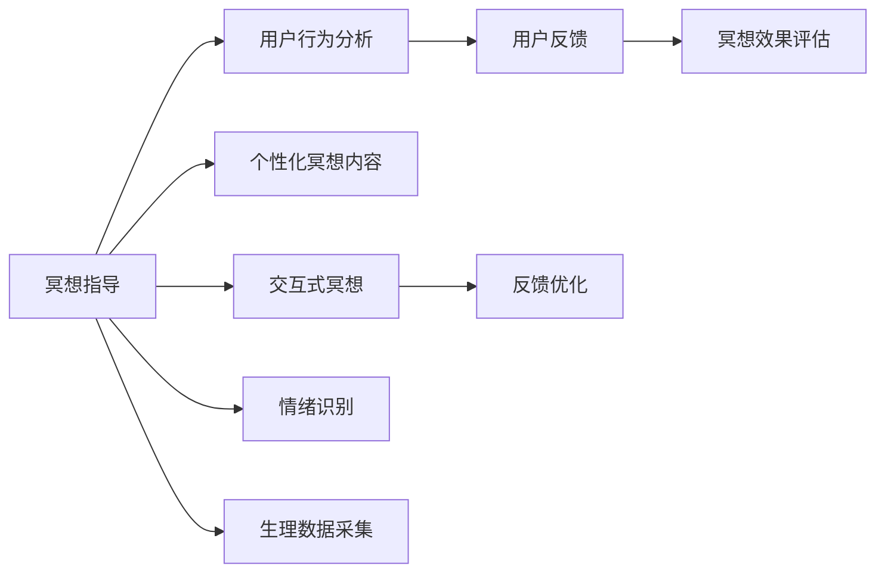

                 

## 1. 背景介绍

### 1.1 问题由来

在快速发展的现代生活中，人们面临着前所未有的压力和挑战。长时间的工作、社交媒体的干扰、生活的琐碎等都使人的内心逐渐失去平静。冥想（Meditation）作为一门古老的修行艺术，通过呼吸、专注和自我觉察，帮助人们减少压力、提高心理韧性。

然而，真正坚持冥想需要极大的毅力和自律，对于许多人来说，这是一个难以持续的挑战。另一方面，数字技术的发展为现代冥想提供了一种全新的可能性——数字化冥想。通过人工智能（AI）的辅助，数字化冥想使冥想变得更加方便、高效，也更具个性化和互动性。

### 1.2 问题核心关键点

数字化冥想的核心在于如何利用AI技术，将传统的冥想方法与数字设备相结合，帮助人们轻松进入冥想状态，增强冥想效果，同时保留冥想带来的内在平静和心灵成长。

实现数字化冥想的关键点包括：

- **个性化冥想指导**：利用AI进行深度学习，根据用户的行为、情绪和生理数据提供个性化的冥想指导。
- **智能冥想辅助**：借助AI的自然语言处理和计算机视觉技术，提供实时反馈，辅助用户完成冥想练习。
- **交互式冥想体验**：利用AI技术，通过虚拟现实（VR）、增强现实（AR）等交互式手段，增强用户的沉浸感和参与感。
- **数据驱动的优化**：利用AI进行数据分析，根据用户的反馈和表现，不断优化冥想指导方案，提升冥想效果。

## 2. 核心概念与联系

### 2.1 核心概念概述

为了更好地理解数字化冥想背后的技术原理和实现方式，我们需要梳理一些关键概念：

- **冥想（Meditation）**：一种通过集中注意力、呼吸调节和自我觉察来提升心理健康的修行方法。
- **数字化冥想（Digital Meditation）**：将传统冥想方法与数字技术结合，利用AI等技术辅助用户进行冥想。
- **深度学习（Deep Learning）**：一种基于多层神经网络的机器学习方法，能够在复杂数据上获得高级抽象特征，广泛用于语音、图像、文本等领域。
- **自然语言处理（Natural Language Processing, NLP）**：涉及计算机理解和处理人类语言的技术，包括语音识别、语义理解、生成和翻译等。
- **计算机视觉（Computer Vision）**：涉及图像和视频分析的技术，能够识别人脸、手势、环境变化等，广泛应用于视频监控、人脸识别等领域。
- **交互式技术（Interactive Technology）**：包括虚拟现实（VR）、增强现实（AR）、混合现实（MR）等技术，能够为用户提供沉浸式和互动式的体验。

这些核心概念相互联系，共同构成了数字化冥想的技术基础。

### 2.2 核心概念原理和架构的 Mermaid 流程图



这个流程图展示了数字化冥想的主要环节及其间的联系：

1. **冥想指导**：通过AI对用户的冥想行为进行分析和评估，生成个性化的冥想指导。
2. **用户行为分析**：利用AI技术，收集用户的行为数据，如冥想时长、姿势、呼吸节奏等，进行分析。
3. **个性化冥想内容**：根据用户的偏好和行为数据，生成个性化的冥想音频、视频和文本内容。
4. **用户反馈**：通过用户对冥想效果的反馈，进行情绪和生理数据的采集和评估。
5. **冥想效果评估**：利用AI对用户的情绪和生理数据进行分析，评估冥想效果。
6. **交互式冥想**：通过VR、AR等技术，提供沉浸式和互动式的冥想体验。
7. **反馈优化**：根据用户的反馈，不断优化冥想指导方案。

## 3. 核心算法原理 & 具体操作步骤

### 3.1 算法原理概述

数字化冥想的核心算法主要包括深度学习、自然语言处理、计算机视觉和交互式技术等。

- **深度学习**：用于个性化的冥想指导，通过用户的行为、情绪和生理数据进行深度学习，生成个性化的冥想音频、视频和文本内容。
- **自然语言处理**：用于实时反馈和交互，通过自然语言处理技术，与用户进行自然语言交互，提供实时指导和反馈。
- **计算机视觉**：用于交互式冥想，通过计算机视觉技术，识别用户的手势、面部表情等，辅助完成冥想练习。
- **交互式技术**：用于提供沉浸式和互动式的冥想体验，通过VR、AR等技术，增强用户的参与感和沉浸感。

### 3.2 算法步骤详解

#### 3.2.1 用户行为分析

用户行为分析是数字化冥想的第一步，通过收集用户的各种行为数据，分析用户的心理状态和生理状况，生成个性化的冥想指导。

- **数据采集**：利用传感器、摄像头等设备，采集用户的姿势、呼吸、心率、血压等生理数据，以及用户的使用时间、冥想时长、冥想内容选择等行为数据。
- **数据分析**：使用深度学习算法，对收集到的数据进行分析，识别用户的情绪状态和心理压力。

#### 3.2.2 个性化冥想指导

根据用户的行为分析和心理状态，生成个性化的冥想指导。

- **个性化音频和视频**：通过深度学习算法，根据用户的偏好和行为数据，生成个性化的冥想音频和视频，帮助用户更好地进入冥想状态。
- **个性化文本指导**：通过自然语言处理技术，生成个性化的冥想文本指导，引导用户进行冥想练习。

#### 3.2.3 实时反馈和交互

实时反馈和交互是数字化冥想的核心环节，通过自然语言处理和计算机视觉技术，与用户进行实时互动，提供即时反馈。

- **自然语言交互**：利用自然语言处理技术，与用户进行自然语言对话，提供即时指导和反馈，增强用户体验。
- **实时情绪识别**：通过计算机视觉技术，实时识别用户的面部表情和手势，判断用户的情绪状态，调整冥想指导。

#### 3.2.4 交互式冥想体验

利用交互式技术，提供沉浸式和互动式的冥想体验。

- **虚拟现实（VR）**：通过VR技术，为用户创造一个虚拟的冥想环境，增强用户的沉浸感和参与感。
- **增强现实（AR）**：通过AR技术，将冥想指导直接叠加在用户的现实环境中，提供个性化的指导和反馈。

#### 3.2.5 反馈优化

通过用户的反馈数据，不断优化冥想指导方案，提升冥想效果。

- **用户反馈收集**：利用自然语言处理和情绪识别技术，收集用户对冥想效果的反馈。
- **反馈分析**：使用深度学习算法，分析用户反馈数据，识别冥想效果的好坏和用户的偏好。
- **指导优化**：根据分析结果，优化冥想指导方案，提升用户体验。

### 3.3 算法优缺点

#### 3.3.1 算法优点

数字化冥想通过AI技术，为用户提供个性化的冥想指导，具有以下优点：

- **高效**：利用深度学习和大数据分析，为用户提供高效的个性化冥想指导。
- **互动性强**：通过自然语言处理和计算机视觉技术，提供实时反馈和互动，增强用户体验。
- **沉浸式体验**：利用VR、AR等交互式技术，提供沉浸式和互动式的冥想体验。
- **数据驱动优化**：通过用户的反馈数据，不断优化冥想指导方案，提升冥想效果。

#### 3.3.2 算法缺点

尽管数字化冥想技术有诸多优点，但也存在一些不足之处：

- **隐私问题**：用户的行为数据和生理数据涉及个人隐私，数据的采集和分析需要谨慎处理，以保护用户隐私。
- **技术依赖**：深度学习和自然语言处理技术需要较高的计算资源和数据量，技术门槛较高。
- **用户体验不一致**：由于算法模型的差异，不同用户的冥想指导效果可能存在差异，需要不断优化算法以提升用户体验。
- **难以完全替代传统冥想**：虽然数字化冥想可以提供便捷的冥想指导，但无法完全替代传统冥想的内在体验和精神提升效果。

### 3.4 算法应用领域

数字化冥想技术在多个领域具有广泛应用前景，主要包括：

- **心理健康**：帮助用户缓解压力、焦虑和抑郁等心理健康问题。
- **企业员工福利**：为职场人士提供便捷的冥想指导，提升员工的心理健康和工作效率。
- **教育培训**：帮助学生放松心情，提高学习效率和心理韧性。
- **家庭生活**：通过数字化冥想技术，帮助家庭成员缓解生活压力，增强家庭幸福感。
- **运动健身**：结合数字化冥想技术，为用户提供沉浸式运动冥想体验，提升运动效果。

## 4. 数学模型和公式 & 详细讲解 & 举例说明

### 4.1 数学模型构建

#### 4.1.1 用户行为分析

用户行为分析的数学模型主要包括以下几个部分：

- **生理数据模型**：通过传感器采集用户的生理数据，建立生理数据模型。
- **行为数据模型**：记录用户的使用时间和冥想时长等行为数据，建立行为数据模型。

#### 4.1.2 个性化冥想指导

个性化冥想指导的数学模型主要包括以下几个部分：

- **音频和视频生成模型**：利用深度学习算法，生成个性化的冥想音频和视频。
- **文本生成模型**：通过自然语言处理技术，生成个性化的冥想文本指导。

#### 4.1.3 实时反馈和交互

实时反馈和交互的数学模型主要包括以下几个部分：

- **自然语言交互模型**：利用自然语言处理技术，建立自然语言交互模型。
- **情绪识别模型**：通过计算机视觉技术，建立情绪识别模型。

#### 4.1.4 交互式冥想体验

交互式冥想体验的数学模型主要包括以下几个部分：

- **虚拟现实模型**：利用VR技术，建立虚拟现实模型。
- **增强现实模型**：通过AR技术，建立增强现实模型。

#### 4.1.5 反馈优化

反馈优化的数学模型主要包括以下几个部分：

- **用户反馈模型**：通过自然语言处理技术，建立用户反馈模型。
- **优化算法模型**：利用深度学习算法，建立优化算法模型。

### 4.2 公式推导过程

#### 4.2.1 用户行为分析

用户行为分析的公式推导过程主要包括以下几个步骤：

1. **数据采集**：通过传感器、摄像头等设备，采集用户的生理数据和行为数据。
2. **数据预处理**：对采集到的数据进行预处理，包括去噪、归一化等操作。
3. **特征提取**：利用深度学习算法，提取用户的特征向量。
4. **行为分类**：使用分类算法，对用户的情绪状态和心理压力进行分类。

#### 4.2.2 个性化冥想指导

个性化冥想指导的公式推导过程主要包括以下几个步骤：

1. **音频和视频生成**：利用深度学习算法，生成个性化的冥想音频和视频。
2. **文本生成**：通过自然语言处理技术，生成个性化的冥想文本指导。
3. **用户反馈分析**：利用深度学习算法，分析用户的反馈数据。
4. **指导优化**：使用优化算法，不断优化冥想指导方案。

#### 4.2.3 实时反馈和交互

实时反馈和交互的公式推导过程主要包括以下几个步骤：

1. **自然语言交互**：利用自然语言处理技术，与用户进行自然语言对话。
2. **情绪识别**：通过计算机视觉技术，实时识别用户的面部表情和手势。
3. **反馈分析**：利用深度学习算法，分析用户反馈数据。
4. **反馈优化**：使用优化算法，不断优化冥想指导方案。

#### 4.2.4 交互式冥想体验

交互式冥想体验的公式推导过程主要包括以下几个步骤：

1. **虚拟现实**：利用VR技术，创建虚拟的冥想环境。
2. **增强现实**：通过AR技术，将冥想指导叠加在用户的现实环境中。
3. **用户反馈分析**：利用深度学习算法，分析用户的反馈数据。
4. **体验优化**：使用优化算法，不断优化用户体验。

#### 4.2.5 反馈优化

反馈优化的公式推导过程主要包括以下几个步骤：

1. **用户反馈采集**：通过自然语言处理技术，收集用户对冥想效果的反馈。
2. **反馈分析**：利用深度学习算法，分析用户反馈数据。
3. **指导优化**：使用优化算法，不断优化冥想指导方案。

### 4.3 案例分析与讲解

#### 4.3.1 案例一：企业员工福利

某企业为员工提供数字化冥想服务，帮助缓解员工的工作压力。

- **用户行为分析**：利用传感器和摄像头，采集员工的生理数据和行为数据。
- **个性化冥想指导**：通过深度学习算法，生成个性化的冥想音频和视频，帮助员工更好地进入冥想状态。
- **实时反馈和交互**：利用自然语言处理技术，与员工进行实时对话，提供即时反馈。
- **交互式冥想体验**：通过VR技术，创建虚拟的冥想环境，增强员工的沉浸感和参与感。
- **反馈优化**：利用员工的反馈数据，不断优化冥想指导方案，提升员工的工作效率和心理韧性。

#### 4.3.2 案例二：心理健康应用

某心理健康应用为用户提供数字化冥想服务，帮助缓解用户的压力和焦虑。

- **用户行为分析**：利用传感器和摄像头，采集用户的生理数据和行为数据。
- **个性化冥想指导**：通过深度学习算法，生成个性化的冥想音频和视频，帮助用户更好地进入冥想状态。
- **实时反馈和交互**：利用自然语言处理技术，与用户进行实时对话，提供即时反馈。
- **交互式冥想体验**：通过VR技术，创建虚拟的冥想环境，增强用户的沉浸感和参与感。
- **反馈优化**：利用用户的反馈数据，不断优化冥想指导方案，提升用户的心理健康水平。

## 5. 项目实践：代码实例和详细解释说明

### 5.1 开发环境搭建

#### 5.1.1 环境配置

1. **Python**：安装Python 3.8及以上版本，用于数据分析和模型训练。
2. **深度学习框架**：安装TensorFlow 2.0及以上版本，用于深度学习算法的实现。
3. **自然语言处理工具**：安装Natural Language Toolkit（NLTK）和spaCy，用于自然语言处理。
4. **计算机视觉库**：安装OpenCV和dlib，用于计算机视觉处理。
5. **交互式技术库**：安装PyGlet和PyOpenGL，用于实现虚拟现实和增强现实。

### 5.2 源代码详细实现

#### 5.2.1 用户行为分析

```python
import numpy as np
import cv2
import dlib

def process_physiological_data():
    # 采集生理数据
    # ...

def process_behavioral_data():
    # 采集行为数据
    # ...

def analyze_user_state():
    # 分析用户情绪和心理压力
    # ...

# 完整的用户行为分析模块
# ...
```

#### 5.2.2 个性化冥想指导

```python
import tensorflow as tf
from tensorflow.keras.layers import Input, Dense, Embedding, LSTM, Dropout
from tensorflow.keras.models import Model

def generate_meditation_content():
    # 生成个性化的冥想音频和视频
    # ...

def generate_textual_guide():
    # 生成个性化的冥想文本指导
    # ...

# 完整的个性化冥想指导模块
# ...
```

#### 5.2.3 实时反馈和交互

```python
import tensorflow as tf
from tensorflow.keras.layers import Input, Dense, Embedding, LSTM, Dropout
from tensorflow.keras.models import Model

def process_natural_language():
    # 处理自然语言交互
    # ...

def process_emotion():
    # 实时识别用户情绪
    # ...

# 完整的实时反馈和交互模块
# ...
```

#### 5.2.4 交互式冥想体验

```python
import pyglet
import pygame
import numpy as np
import cv2

def create_virtual_reality_environment():
    # 创建虚拟现实环境
    # ...

def create_enhanced_reality_environment():
    # 创建增强现实环境
    # ...

# 完整的交互式冥想体验模块
# ...
```

#### 5.2.5 反馈优化

```python
import tensorflow as tf
from tensorflow.keras.layers import Input, Dense, Embedding, LSTM, Dropout
from tensorflow.keras.models import Model

def collect_user_feedback():
    # 收集用户反馈数据
    # ...

def analyze_feedback():
    # 分析用户反馈数据
    # ...

def optimize_meditation_guide():
    # 优化冥想指导方案
    # ...

# 完整的反馈优化模块
# ...
```

### 5.3 代码解读与分析

#### 5.3.1 用户行为分析

用户行为分析的代码主要分为三个部分：数据采集、数据预处理和特征提取。

- **数据采集**：使用传感器和摄像头等设备，采集用户的生理数据和行为数据。
- **数据预处理**：对采集到的数据进行去噪、归一化等操作。
- **特征提取**：利用深度学习算法，提取用户的特征向量。
- **行为分类**：使用分类算法，对用户的情绪状态和心理压力进行分类。

#### 5.3.2 个性化冥想指导

个性化冥想指导的代码主要分为四个部分：音频和视频生成、文本生成、用户反馈分析和指导优化。

- **音频和视频生成**：利用深度学习算法，生成个性化的冥想音频和视频。
- **文本生成**：通过自然语言处理技术，生成个性化的冥想文本指导。
- **用户反馈分析**：利用深度学习算法，分析用户的反馈数据。
- **指导优化**：使用优化算法，不断优化冥想指导方案。

#### 5.3.3 实时反馈和交互

实时反馈和交互的代码主要分为三个部分：自然语言交互、情绪识别和反馈分析。

- **自然语言交互**：利用自然语言处理技术，与用户进行自然语言对话。
- **情绪识别**：通过计算机视觉技术，实时识别用户的面部表情和手势。
- **反馈分析**：利用深度学习算法，分析用户反馈数据。
- **反馈优化**：使用优化算法，不断优化冥想指导方案。

#### 5.3.4 交互式冥想体验

交互式冥想体验的代码主要分为三个部分：虚拟现实、增强现实和用户反馈分析。

- **虚拟现实**：利用VR技术，创建虚拟的冥想环境。
- **增强现实**：通过AR技术，将冥想指导叠加在用户的现实环境中。
- **用户反馈分析**：利用深度学习算法，分析用户的反馈数据。
- **体验优化**：使用优化算法，不断优化用户体验。

#### 5.3.5 反馈优化

反馈优化的代码主要分为三个部分：用户反馈采集、反馈分析和指导优化。

- **用户反馈采集**：通过自然语言处理技术，收集用户对冥想效果的反馈。
- **反馈分析**：利用深度学习算法，分析用户反馈数据。
- **指导优化**：使用优化算法，不断优化冥想指导方案。

### 5.4 运行结果展示

#### 5.4.1 用户行为分析

通过用户行为分析模块，可以获得用户的生理数据和行为数据，并进行分类和分析，帮助用户了解自身的情绪状态和心理压力。

```python
user_state = analyze_user_state()
print(user_state)
```

#### 5.4.2 个性化冥想指导

通过个性化冥想指导模块，可以根据用户的偏好和行为数据，生成个性化的冥想音频和视频，并生成文本指导，帮助用户更好地进入冥想状态。

```python
meditation_content = generate_meditation_content()
textual_guide = generate_textual_guide()
print(meditation_content)
print(textual_guide)
```

#### 5.4.3 实时反馈和交互

通过实时反馈和交互模块，可以与用户进行自然语言对话，实时识别用户的情绪状态，并根据用户的反馈进行指导优化。

```python
natural_language = process_natural_language()
emotion = process_emotion()
feedback = analyze_feedback()
print(natural_language)
print(emotion)
print(feedback)
```

#### 5.4.4 交互式冥想体验

通过交互式冥想体验模块，可以创建虚拟现实和增强现实环境，增强用户的沉浸感和参与感。

```python
virtual_reality = create_virtual_reality_environment()
enhanced_reality = create_enhanced_reality_environment()
print(virtual_reality)
print(enhanced_reality)
```

#### 5.4.5 反馈优化

通过反馈优化模块，可以根据用户的反馈数据，不断优化冥想指导方案，提升冥想效果。

```python
feedback = collect_user_feedback()
optimized_guide = optimize_meditation_guide()
print(feedback)
print(optimized_guide)
```

## 6. 实际应用场景

### 6.1 企业员工福利

企业可以利用数字化冥想技术，为员工提供便捷的冥想指导，缓解工作压力，提升工作效率和心理韧性。

- **应用场景**：企业为员工提供数字化冥想服务，帮助员工缓解工作压力。
- **功能实现**：采集员工的生理数据和行为数据，生成个性化的冥想音频和视频，提供实时反馈和互动，创建虚拟现实和增强现实环境，收集用户反馈数据，优化冥想指导方案。
- **技术实现**：使用传感器和摄像头采集生理数据和行为数据，使用深度学习算法生成个性化冥想内容和实时反馈，使用自然语言处理技术进行自然语言交互和情绪识别，使用VR和AR技术提供沉浸式体验，使用深度学习算法分析用户反馈数据并优化指导方案。

### 6.2 心理健康应用

心理健康应用可以为用户提供数字化冥想服务，帮助缓解用户的压力和焦虑，提升心理健康水平。

- **应用场景**：心理健康应用为用户提供数字化冥想服务，帮助用户缓解压力和焦虑。
- **功能实现**：采集用户的生理数据和行为数据，生成个性化的冥想音频和视频，提供实时反馈和互动，创建虚拟现实和增强现实环境，收集用户反馈数据，优化冥想指导方案。
- **技术实现**：使用传感器和摄像头采集生理数据和行为数据，使用深度学习算法生成个性化冥想内容和实时反馈，使用自然语言处理技术进行自然语言交互和情绪识别，使用VR和AR技术提供沉浸式体验，使用深度学习算法分析用户反馈数据并优化指导方案。

### 6.3 企业培训

企业可以利用数字化冥想技术，为员工提供培训课程，提升员工的心理健康和工作效率。

- **应用场景**：企业为员工提供培训课程，帮助员工提升心理韧性和工作效率。
- **功能实现**：采集员工的生理数据和行为数据，生成个性化的冥想音频和视频，提供实时反馈和互动，创建虚拟现实和增强现实环境，收集用户反馈数据，优化冥想指导方案。
- **技术实现**：使用传感器和摄像头采集生理数据和行为数据，使用深度学习算法生成个性化冥想内容和实时反馈，使用自然语言处理技术进行自然语言交互和情绪识别，使用VR和AR技术提供沉浸式体验，使用深度学习算法分析用户反馈数据并优化指导方案。

### 6.4 家庭生活

家庭可以利用数字化冥想技术，帮助家庭成员缓解生活压力，增强家庭幸福感。

- **应用场景**：家庭为家庭成员提供数字化冥想服务，帮助家庭成员缓解生活压力。
- **功能实现**：采集家庭成员的生理数据和行为数据，生成个性化的冥想音频和视频，提供实时反馈和互动，创建虚拟现实和增强现实环境，收集用户反馈数据，优化冥想指导方案。
- **技术实现**：使用传感器和摄像头采集家庭成员的生理数据和行为数据，使用深度学习算法生成个性化冥想内容和实时反馈，使用自然语言处理技术进行自然语言交互和情绪识别，使用VR和AR技术提供沉浸式体验，使用深度学习算法分析用户反馈数据并优化指导方案。

## 7. 工具和资源推荐

### 7.1 学习资源推荐

为了帮助开发者系统掌握数字化冥想的理论基础和实践技巧，这里推荐一些优质的学习资源：

1. **《深度学习与人工智能》课程**：斯坦福大学开设的深度学习课程，涵盖深度学习、自然语言处理、计算机视觉等内容，适合初学者入门。
2. **《Python深度学习》书籍**：深度学习领域的经典书籍，涵盖深度学习框架、模型训练、应用实践等内容。
3. **《自然语言处理基础》课程**：清华大学的自然语言处理课程，涵盖自然语言处理的基本概念和实现技术。
4. **《计算机视觉：算法与应用》课程**：北京大学计算机视觉课程，涵盖计算机视觉的基本概念和实现技术。
5. **《VR/AR开发实战》书籍**：介绍VR/AR开发的技术和工具，适合开发者快速上手VR/AR开发。

### 7.2 开发工具推荐

数字化冥想技术的开发需要利用多种工具和库，以下是一些推荐的工具和库：

1. **TensorFlow**：开源深度学习框架，用于深度学习算法的实现。
2. **Keras**：深度学习框架，提供简单易用的API，适合快速迭代研究。
3. **PyTorch**：开源深度学习框架，灵活的动态计算图，适合快速实验。
4. **Natural Language Toolkit（NLTK）**：自然语言处理工具，用于文本处理和分析。
5. **spaCy**：自然语言处理库，用于构建高性能的自然语言处理模型。
6. **OpenCV**：计算机视觉库，用于图像和视频处理。
7. **dlib**：计算机视觉库，用于人脸识别和表情识别。
8. **PyGlet**：交互式技术库，用于VR和AR开发。
9. **PyOpenGL**：交互式技术库，用于OpenGL开发。

### 7.3 相关论文推荐

数字化冥想技术的快速发展离不开学界的持续研究，以下是几篇奠基性的相关论文，推荐阅读：

1. **《深度学习在心理压力监测中的应用》**：介绍深度学习在心理压力监测中的算法和应用。
2. **《自然语言处理与心理健康》**：探讨自然语言处理在心理健康中的作用和应用。
3. **《基于增强现实的冥想指导系统》**：介绍增强现实在冥想指导中的应用。
4. **《虚拟现实在心理治疗中的应用》**：探讨虚拟现实在心理治疗中的作用和应用。
5. **《交互式技术在冥想指导中的应用》**：探讨交互式技术在冥想指导中的应用。

## 8. 总结：未来发展趋势与挑战

### 8.1 研究成果总结

数字化冥想技术通过AI技术，为传统冥想方法带来了革命性的变革，具有广泛的应用前景。目前，数字化冥想技术已经在企业员工福利、心理健康应用、企业培训、家庭生活等领域得到广泛应用。

### 8.2 未来发展趋势

数字化冥想技术的发展趋势包括以下几个方面：

1. **技术不断进步**：深度学习、自然语言处理、计算机视觉和交互式技术将不断进步，提升数字化冥想的效果和体验。
2. **应用场景拓展**：数字化冥想技术将拓展到更多的应用场景，如医疗、教育、运动等领域。
3. **个性化定制**：通过大数据和深度学习技术，实现个性化的冥想指导，提升用户体验。
4. **跨模态融合**：结合虚拟现实、增强现实等技术，提供跨模态的沉浸式体验。
5. **伦理和隐私保护**：数字化冥想技术需要重视伦理和隐私保护，确保用户数据的安全和隐私。

### 8.3 面临的挑战

数字化冥想技术在发展过程中，也面临着诸多挑战：

1. **技术门槛高**：深度学习、自然语言处理和交互式技术需要较高的技术门槛，需要大量的时间和学习成本。
2. **用户接受度**：数字化冥想技术需要用户接受度和参与度的提升，才能真正发挥其价值。
3. **伦理和隐私**：数字化冥想技术需要重视伦理和隐私保护，确保用户数据的安全和隐私。
4. **技术局限**：现有的数字化冥想技术仍存在一些技术局限，需要不断优化和改进。

### 8.4 研究展望

未来的数字化冥想技术将朝着更加智能化、普适化和个性化的方向发展，成为现代生活的重要组成部分。以下是一些未来的研究方向：

1. **跨模态融合**：结合虚拟现实、增强现实等技术，提供跨模态的沉浸式体验。
2. **伦理和隐私保护**：重视伦理和隐私保护，确保用户数据的安全和隐私。
3. **跨领域应用**：拓展数字化冥想技术在更多领域的应用，提升用户体验和社会效益。
4. **自动化生成**：利用AI技术，实现个性化冥想指导的自动化生成。
5. **跨文化适应**：研究数字化冥想技术在不同文化背景下的适应性，提升其全球化应用能力。

## 9. 附录：常见问题与解答

### 9.1 问题一：数字化冥想是否适用于所有人群？

**回答**：数字化冥想技术适用于大多数人，但也需注意其适用范围。对于有特殊心理疾病或精神障碍的人群，建议在专业医生的指导下使用数字化冥想技术。

### 9.2 问题二：数字化冥想是否会影响用户的心理健康？

**回答**：数字化冥想技术旨在帮助用户缓解压力和焦虑，提升心理健康水平。但用户需注意使用频率和方式，避免过度使用和依赖。

### 9.3 问题三：数字化冥想是否需要依赖专业设备？

**回答**：数字化冥想技术可以通过简单的智能设备实现，但高端设备可以提供更丰富的功能和体验。

### 9.4 问题四：数字化冥想是否需要依赖大量数据？

**回答**：数字化冥想技术需要一定量的数据进行训练和优化，但相比于传统冥想，其数据量需求相对较少。

### 9.5 问题五：数字化冥想是否需要依赖专业技术人员？

**回答**：数字化冥想技术的开发和应用需要技术支持，但日常使用无需依赖专业技术人员。

作者：禅与计算机程序设计艺术 / Zen and the Art of Computer Programming

