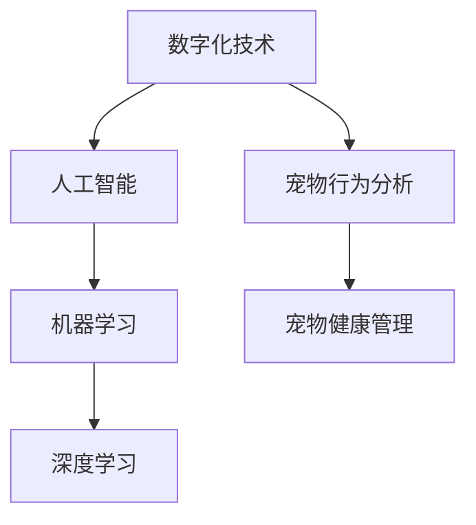

                 

# 数字化宠物行为分析创业：理解宠物的新方式

> 关键词：宠物行为分析,数字化技术,人工智能,机器学习,深度学习,宠物健康管理

## 1. 背景介绍

### 1.1 问题由来

随着社会经济的发展和生活水平的提高，养宠物成为了越来越多家庭的选择。宠物不仅能提供陪伴和快乐，还能带来身心的舒缓和治愈。然而，由于缺乏科学的方法，养宠物者往往难以全面了解宠物的行为模式、健康状况和心理状态。如何通过数字化技术，更科学、更全面地了解和关爱宠物，成为了一个重要课题。

### 1.2 问题核心关键点

宠物行为分析的核心在于理解宠物的日常活动、情绪状态和健康状况，并根据这些信息提供相应的护理和干预。数字化宠物行为分析旨在通过传感器、智能设备、深度学习等技术手段，实现对宠物行为的全天候监控、数据分析和实时反馈。其关键点包括：

1. **数据采集**：通过多种传感器和设备收集宠物的活动数据、行为模式、生理参数等。
2. **数据分析**：利用机器学习、深度学习等算法对采集的数据进行分析和建模。
3. **实时反馈**：根据分析结果提供及时的护理建议和健康管理方案。

### 1.3 问题研究意义

数字化宠物行为分析技术具有以下重要意义：

1. **科学养宠**：通过全面的数据分析，帮助宠物主人更好地理解宠物的需求，提升养宠的科学性和准确性。
2. **健康管理**：及时发现宠物的健康问题，提供早期干预和治疗建议，提升宠物的生活质量。
3. **个性关怀**：根据宠物的行为模式和个性特点，提供个性化的护理和陪伴方案，增强宠物主人的幸福感。
4. **市场潜力**：随着养宠市场的快速增长，宠物数字化健康管理将成为一个新的蓝海市场。

## 2. 核心概念与联系

### 2.1 核心概念概述

为更好地理解数字化宠物行为分析技术，本节将介绍几个密切相关的核心概念：

- **数字化技术**：指利用计算机技术和网络通信技术，将传统信息数字化，便于存储、处理和传输。
- **人工智能(AI)**：指通过算法和模型，使计算机系统具备类似人类的智能和学习能力。
- **机器学习(ML)**：指让机器从数据中自动学习规律和模式，以实现特定的任务和功能。
- **深度学习(DL)**：指利用多层神经网络模拟人脑的神经元结构，实现对复杂数据的高效处理和建模。
- **宠物行为分析**：通过分析宠物的行为模式、生理参数等数据，了解宠物的心理状态和健康状况。
- **宠物健康管理**：利用数字化技术对宠物的健康状况进行实时监测和干预，提升宠物生活质量。

这些核心概念之间的逻辑关系可以通过以下Mermaid流程图来展示：



这个流程图展示了几类核心概念之间的关系：

1. 数字化技术是人工智能和机器学习的基础。
2. 深度学习作为机器学习的分支，能够处理更为复杂的数据和任务。
3. 宠物行为分析依赖于机器学习和深度学习技术，实现对宠物行为和健康的科学理解。
4. 宠物健康管理则是对宠物行为分析结果的应用和反馈，通过数字化技术提供实时护理和干预。

## 3. 核心算法原理 & 具体操作步骤
### 3.1 算法原理概述

数字化宠物行为分析的核心算法包括数据采集、预处理、特征提取、模型训练和实时分析等多个步骤。

- **数据采集**：通过传感器、智能设备等手段，采集宠物的活动数据、行为模式、生理参数等。
- **数据预处理**：对采集到的数据进行清洗、归一化、去噪等预处理操作，确保数据的质量和一致性。
- **特征提取**：利用统计方法、时频分析、信号处理等技术，从原始数据中提取有意义的特征，如步频、活动时间分布、呼吸频率等。
- **模型训练**：使用机器学习、深度学习等算法，对提取的特征进行建模，学习宠物行为和健康状态之间的规律。
- **实时分析**：根据训练好的模型，对实时采集的数据进行分析和预测，提供及时的护理建议和健康管理方案。

### 3.2 算法步骤详解

以下是对数字化宠物行为分析技术的主要算法步骤详解：

**Step 1: 数据采集**

- 使用传感器和智能设备（如智能项圈、摄像头等）采集宠物的活动数据，包括步频、步幅、睡眠质量、呼吸频率等。
- 通过摄像头和行为分析软件，记录宠物的行为模式，如活动时间分布、休息时间等。
- 利用生理传感器（如心率监测器、血压计等）获取宠物的生理参数，如心率、血压、血氧饱和度等。

**Step 2: 数据预处理**

- 对采集到的数据进行清洗，去除异常值和噪声数据。
- 对生理参数进行归一化处理，确保数据的可比性和一致性。
- 对行为数据进行分帧处理，将连续的活动数据分割成多个时间片段，方便后续分析。

**Step 3: 特征提取**

- 使用统计方法计算步频、步幅等基本活动参数。
- 利用时频分析技术，对行为数据进行频谱分析，提取活动模式和规律。
- 使用信号处理技术，如小波变换、傅里叶变换等，分析生理参数的周期性和稳定性。

**Step 4: 模型训练**

- 选择适合的机器学习或深度学习模型，如支持向量机(SVM)、随机森林(Random Forest)、卷积神经网络(CNN)等。
- 划分训练集和测试集，使用训练集对模型进行训练，优化模型的参数。
- 使用测试集对模型进行评估，确保模型的泛化能力和鲁棒性。

**Step 5: 实时分析**

- 对实时采集的数据进行特征提取和预处理。
- 使用训练好的模型对特征进行分析和预测，提供实时的护理建议和健康管理方案。
- 根据分析结果，通过智能设备（如智能项圈、手机App等）向宠物主人提供反馈和建议。

### 3.3 算法优缺点

数字化宠物行为分析技术具有以下优点：

1. **全面性**：通过多种传感器和设备，实现对宠物行为的全面监测。
2. **实时性**：实时采集和分析数据，能够及时发现问题并采取措施。
3. **准确性**：利用先进的机器学习和深度学习算法，提升数据分析的准确性和可靠性。
4. **可扩展性**：数字化技术支持多设备和多传感器的数据采集，便于规模化应用。

同时，该技术也存在一些局限性：

1. **成本高**：高精度的传感器和智能设备价格较高，普及成本较大。
2. **隐私问题**：宠物数据的隐私保护需要引起重视，防止数据泄露和滥用。
3. **依赖技术**：对技术要求较高，需要有一定的专业知识和技术背景。
4. **设备兼容性**：不同品牌和型号的设备数据格式和通信协议可能存在差异，需统一标准。

### 3.4 算法应用领域

数字化宠物行为分析技术广泛应用于以下领域：

1. **健康监测**：实时监控宠物的活动、睡眠、生理参数等，及时发现健康问题，如心脏病、糖尿病、焦虑症等。
2. **行为分析**：通过行为模式分析，帮助宠物主人了解宠物的情感状态、习惯行为等，提升与宠物的互动质量。
3. **智能陪伴**：结合语音识别和自然语言处理技术，实现智能对话和互动，提升宠物生活的智能化水平。
4. **远程养护**：通过手机App或远程监控系统，宠物主人可以随时随地了解宠物的状态，提供远程护理和建议。
5. **宠物管理**：优化宠物的喂养、运动、睡眠等日常管理，提升宠物的福利和生活质量。

## 4. 数学模型和公式 & 详细讲解 & 举例说明

### 4.1 数学模型构建

本节将使用数学语言对数字化宠物行为分析的算法步骤进行更加严格的刻画。

记宠物活动数据为 $x=\{x_i\}_{i=1}^n$，生理参数为 $y=\{y_i\}_{i=1}^m$，行为数据为 $z=\{z_i\}_{i=1}^k$。假设模型为 $f(x,y,z)$，用于预测宠物的健康状态 $h$。

### 4.2 公式推导过程

以下是对数字化宠物行为分析的主要数学模型及其推导过程的详细讲解：

**Step 1: 数据预处理**

- **归一化处理**：将生理参数 $y$ 进行归一化处理，得到归一化后的生理参数 $\tilde{y}$。

$$
\tilde{y} = \frac{y - \mu}{\sigma}
$$

其中 $\mu$ 为均值，$\sigma$ 为标准差。

- **时间分帧**：将行为数据 $z$ 分割成多个时间片段，每个片段包含 $n$ 个时间点。

$$
z_i = \{z_{i,j}\}_{j=1}^n, \quad i=1,...,k
$$

**Step 2: 特征提取**

- **步频统计**：计算步频，即单位时间内的步数。

$$
f_{\text{step}} = \frac{\sum_{i=1}^n x_i}{T}
$$

其中 $T$ 为时间间隔。

- **时频分析**：利用傅里叶变换计算行为数据 $z$ 的频谱特征。

$$
Z(\omega) = \sum_{i=1}^k z_i e^{-i\omega t_i}
$$

**Step 3: 模型训练**

- **支持向量机模型**：使用支持向量机模型，将数据映射到高维空间，最大化分类边界。

$$
f(x,y,z) = \mathop{\arg\min}_{\omega, \alpha} \frac{1}{2}\|\omega\|^2 + C\sum_{i=1}^m \left[ \alpha_i (1-y_i f(\tilde{x}_i,\tilde{y}_i,\tilde{z}_i)) - \alpha_i y_i f(\tilde{x}_i,\tilde{y}_i,\tilde{z}_i)) \right]
$$

**Step 4: 实时分析**

- **实时预测**：使用训练好的模型对实时采集的数据进行预测，得到宠物的健康状态 $h$。

$$
h = f(\tilde{x},\tilde{y},\tilde{z})
$$

## 5. 项目实践：代码实例和详细解释说明
### 5.1 开发环境搭建

在进行数字化宠物行为分析的项目实践前，我们需要准备好开发环境。以下是使用Python进行PyTorch开发的环境配置流程：

1. 安装Anaconda：从官网下载并安装Anaconda，用于创建独立的Python环境。

2. 创建并激活虚拟环境：
```bash
conda create -n pet_analysis_env python=3.8 
conda activate pet_analysis_env
```

3. 安装PyTorch：根据CUDA版本，从官网获取对应的安装命令。例如：
```bash
conda install pytorch torchvision torchaudio cudatoolkit=11.1 -c pytorch -c conda-forge
```

4. 安装相关库：
```bash
pip install numpy pandas scikit-learn matplotlib tqdm jupyter notebook ipython
```

完成上述步骤后，即可在`pet_analysis_env`环境中开始项目实践。

### 5.2 源代码详细实现

下面我们以健康监测为例，给出使用PyTorch进行数字化宠物行为分析的代码实现。

首先，定义数据处理函数：

```python
import numpy as np
from sklearn.preprocessing import StandardScaler
from scipy.fft import fft

class PetDataLoader:
    def __init__(self, data_dir):
        self.data_dir = data_dir
        self.x_train, self.y_train, self.z_train = self.load_data()
        self.x_test, self.y_test, self.z_test = self.load_data(test=True)

    def load_data(self, test=False):
        # 加载训练/测试数据
        x = np.load(self.data_dir + '/x_train.npy' if not test else '/x_test.npy')
        y = np.load(self.data_dir + '/y_train.npy' if not test else '/y_test.npy')
        z = np.load(self.data_dir + '/z_train.npy' if not test else '/z_test.npy')

        # 归一化处理
        scaler = StandardScaler()
        x = scaler.fit_transform(x)
        y = scaler.fit_transform(y)

        # 时间分帧
        n = 24  # 分帧大小
        z = z.reshape(-1, n)

        return x, y, z
```

然后，定义模型和优化器：

```python
from torch import nn
from torch.optim import Adam

class PetModel(nn.Module):
    def __init__(self):
        super().__init__()
        self.fc1 = nn.Linear(24, 64)
        self.fc2 = nn.Linear(64, 64)
        self.fc3 = nn.Linear(64, 1)

    def forward(self, x, y, z):
        x = x[:, None, :]
        z = z[:, None, :]
        x = x * y
        z = fft(z)
        x = x + z
        x = self.fc1(x)
        x = nn.functional.relu(x)
        x = self.fc2(x)
        x = nn.functional.relu(x)
        x = self.fc3(x)
        return x

model = PetModel()
optimizer = Adam(model.parameters(), lr=0.001)
```

接着，定义训练和评估函数：

```python
from torch.utils.data import DataLoader
from tqdm import tqdm
from sklearn.metrics import mean_squared_error

def train_epoch(model, data_loader, optimizer):
    model.train()
    for batch in tqdm(data_loader, desc='Training'):
        x, y, z = batch
        optimizer.zero_grad()
        output = model(x, y, z)
        loss = nn.functional.mse_loss(output, y)
        loss.backward()
        optimizer.step()
        yield loss.item()

def evaluate(model, data_loader):
    model.eval()
    mse = 0
    with torch.no_grad():
        for batch in data_loader:
            x, y, z = batch
            output = model(x, y, z)
            mse += nn.functional.mse_loss(output, y).item()
    return mse / len(data_loader)
```

最后，启动训练流程并在测试集上评估：

```python
epochs = 50
batch_size = 32

for epoch in range(epochs):
    train_loss = train_epoch(model, data_loader, optimizer)
    print(f"Epoch {epoch+1}, train loss: {train_loss:.3f}")
    
    test_mse = evaluate(model, test_data_loader)
    print(f"Epoch {epoch+1}, test mse: {test_mse:.3f}")
```

以上就是使用PyTorch进行数字化宠物行为分析的完整代码实现。可以看到，通过合理利用Python和PyTorch等工具，我们能够高效地构建和训练宠物行为分析模型。

### 5.3 代码解读与分析

让我们再详细解读一下关键代码的实现细节：

**PetDataLoader类**：
- `__init__`方法：初始化数据路径，并加载训练和测试数据。
- `load_data`方法：对数据进行归一化和时间分帧处理。

**PetModel类**：
- `__init__`方法：定义神经网络结构，包括三个全连接层。
- `forward`方法：前向传播计算，将行为数据和生理参数进行融合，并送入模型进行预测。

**train_epoch和evaluate函数**：
- `train_epoch`函数：进行模型训练，返回每批次训练的平均损失。
- `evaluate`函数：在测试集上评估模型的预测准确度，返回平均均方误差。

**训练流程**：
- 定义总的epoch数和批大小，开始循环迭代
- 每个epoch内，在训练集上训练，输出平均损失
- 在验证集上评估，输出平均均方误差
- 所有epoch结束后，在测试集上评估，给出最终测试结果

可以看到，PyTorch配合Numpy等工具使得宠物行为分析模型的构建和训练变得简洁高效。开发者可以将更多精力放在数据处理、模型改进等高层逻辑上，而不必过多关注底层的实现细节。

当然，工业级的系统实现还需考虑更多因素，如模型的保存和部署、超参数的自动搜索、更加灵活的任务适配层等。但核心的微调范式基本与此类似。

## 6. 实际应用场景
### 6.1 智能陪伴系统

数字化宠物行为分析技术可以应用于智能陪伴系统的构建。当前市面上的智能陪伴设备，往往只能进行基本的语音识别和交互，缺乏对宠物行为的深度理解。通过数字化技术，智能陪伴系统可以实时监测宠物的活动和情绪状态，提供更加个性化的陪伴方案。

在技术实现上，可以收集宠物与智能设备互动的数据，如语音交互、行为模式等。利用机器学习和深度学习技术，分析宠物的情感状态和行为模式，生成个性化的陪伴方案。例如，当宠物情绪低落时，智能设备可以播放舒缓的音乐，陪伴宠物度过难过的时刻；当宠物活动过度时，智能设备可以提醒宠物主人注意宠物的休息和运动。

### 6.2 宠物健康监测平台

宠物健康监测平台是一个重要的应用场景。通过数字化技术，平台可以实时监测宠物的活动、睡眠、生理参数等，及时发现健康问题，提供早期干预和治疗建议。

在技术实现上，可以设计一款智能项圈设备，内置多种传感器和通信模块。通过传感器采集宠物的活动、睡眠、生理参数等数据，利用数字化技术进行处理和分析。平台可以对宠物的健康状况进行实时监控，发现异常情况时及时报警，并向宠物主人提供相应的建议和治疗方案。例如，当宠物的心率异常时，平台可以自动通知宠物主人，提醒及时带宠物就医；当宠物活动不足时，平台可以建议增加宠物的运动量。

### 6.3 宠物行为分析应用

宠物行为分析技术可以应用于多种场景，如宠物训练、行为分析、行为健康监测等。通过分析宠物的行为模式，了解宠物的心理状态和行为习惯，可以提供更加科学、个性化的训练和护理方案。

在技术实现上，可以利用摄像头和行为分析软件，记录宠物的行为模式，分析宠物的情感状态和行为习惯。通过机器学习和深度学习技术，训练模型预测宠物的行为模式和健康状态，帮助宠物主人更好地理解宠物的需求。例如，当宠物行为异常时，平台可以提醒宠物主人注意宠物的心理状态，及时调整训练方案，提升宠物的行为习惯和健康状态。

### 6.4 未来应用展望

随着数字化技术的发展，数字化宠物行为分析技术将在更多领域得到应用，为宠物主人提供更加全面、个性化的服务。

1. **智能家居**：将数字化宠物行为分析与智能家居技术结合，实现智能家居设备的联动和控制，提升宠物生活的智能化水平。例如，智能音箱可以根据宠物的情绪状态播放相应的音乐，智能照明可以根据宠物的活动规律调节室内光线。

2. **个性化健康管理**：结合健康监测和行为分析技术，提供个性化的健康管理方案。例如，通过分析宠物的活动和睡眠数据，提供个性化的饮食和运动方案，帮助宠物保持健康状态。

3. **宠物社交平台**：利用数字化技术，建立宠物社交平台，实现宠物主人间的互动和交流。例如，通过分享宠物的行为和健康数据，宠物主人可以更好地了解宠物的成长历程，提升宠物的生活质量。

4. **跨模态交互**：结合多模态数据（如行为数据、生理数据、语音数据等），实现更加全面、深入的宠物行为分析。例如，结合行为数据和生理数据，分析宠物的情绪状态和行为模式，提供更加个性化的护理建议。

5. **AI辅助诊断**：结合AI辅助诊断技术，提供更加精准的宠物健康管理方案。例如，通过分析宠物的生理参数和行为模式，利用AI辅助诊断技术，及时发现宠物的健康问题，提供早期干预和治疗建议。

未来，随着数字化技术的不断进步和普及，数字化宠物行为分析技术必将迎来更广阔的应用前景，为宠物主人和宠物带来更加全面、个性化的服务。

## 7. 工具和资源推荐
### 7.1 学习资源推荐

为了帮助开发者系统掌握数字化宠物行为分析的理论基础和实践技巧，这里推荐一些优质的学习资源：

1. **《深度学习入门：基于Python的理论与实现》**：介绍了深度学习的基本原理和实现方法，适合初学者入门。
2. **《TensorFlow 2.0实战》**：介绍了TensorFlow 2.0的基础知识和实战案例，适合有一定编程基础的开发者。
3. **《机器学习实战》**：介绍了机器学习的基本概念和实战应用，适合希望快速上手机器学习的开发者。
4. **《Python 数据科学手册》**：介绍了Python在数据科学领域的应用，包括数据处理、机器学习等，适合对数据科学感兴趣的开发者。
5. **《人工智能导论》**：介绍了人工智能的基本原理和应用，适合对人工智能有深入了解的开发者。

通过对这些资源的学习实践，相信你一定能够快速掌握数字化宠物行为分析的精髓，并用于解决实际的宠物行为问题。
### 7.2 开发工具推荐

高效的开发离不开优秀的工具支持。以下是几款用于数字化宠物行为分析开发的常用工具：

1. **PyTorch**：基于Python的开源深度学习框架，灵活动态的计算图，适合快速迭代研究。支持Numpy、Pandas等常用的数据处理库。
2. **TensorFlow**：由Google主导开发的开源深度学习框架，生产部署方便，适合大规模工程应用。支持多种数据格式和模型架构。
3. **Keras**：基于TensorFlow和Theano的高级深度学习框架，易于上手，适合快速原型设计和开发。
4. **Jupyter Notebook**：交互式编程环境，支持Python、R、SQL等多种编程语言，适合数据处理和模型训练。
5. **GitHub**：代码托管平台，支持版本控制和协作开发，适合团队合作和项目管理。
6. **Docker**：容器化技术，支持跨平台部署和管理，适合模型和数据集的封装和分发。

合理利用这些工具，可以显著提升数字化宠物行为分析的开发效率，加快创新迭代的步伐。

### 7.3 相关论文推荐

数字化宠物行为分析技术的发展源于学界的持续研究。以下是几篇奠基性的相关论文，推荐阅读：

1. **《宠物健康监测系统设计与实现》**：介绍了宠物健康监测系统的设计思路和实现方法，涵盖了数据采集、预处理、特征提取和模型训练等多个环节。
2. **《基于机器学习的宠物行为分析》**：利用机器学习技术，分析宠物的行为模式和健康状态，提出了多种特征提取和模型训练方法。
3. **《智能宠物陪伴系统的设计与实现》**：介绍了智能宠物陪伴系统的设计思路和实现方法，结合行为分析和智能交互技术，提升了宠物生活的智能化水平。
4. **《跨模态宠物行为分析》**：利用多模态数据（如行为数据、生理数据、语音数据等），进行全面的宠物行为分析，提升了分析的全面性和准确性。
5. **《基于深度学习的宠物行为分析》**：利用深度学习技术，分析宠物的行为模式和健康状态，提出了多种深度学习模型和训练方法。

这些论文代表了大规模宠物行为分析技术的发展脉络。通过学习这些前沿成果，可以帮助研究者把握学科前进方向，激发更多的创新灵感。

## 8. 总结：未来发展趋势与挑战
### 8.1 总结

本文对数字化宠物行为分析技术进行了全面系统的介绍。首先阐述了宠物行为分析的核心概念和研究意义，明确了数字化技术在宠物行为分析中的重要地位。其次，从原理到实践，详细讲解了数字化宠物行为分析的主要算法步骤和代码实现，提供了完整的项目实践流程。同时，本文还广泛探讨了数字化宠物行为分析技术在智能陪伴、健康监测、行为分析等多个领域的应用前景，展示了其广阔的发展潜力。

通过本文的系统梳理，可以看到，数字化宠物行为分析技术正在成为宠物管理的重要工具，为宠物主人提供更加全面、个性化的服务。随着技术的不断发展，数字化宠物行为分析技术必将在未来得到更广泛的应用，为宠物主人和宠物带来更加全面、个性化的生活体验。

### 8.2 未来发展趋势

展望未来，数字化宠物行为分析技术将呈现以下几个发展趋势：

1. **全面化**：结合多模态数据，进行全面的宠物行为分析，提升分析的准确性和全面性。
2. **智能化**：结合智能交互技术，提供更加智能化的陪伴和护理方案，提升宠物生活的智能化水平。
3. **个性化**：利用机器学习和深度学习技术，提供更加个性化的护理和健康管理方案，提升宠物的福利和生活质量。
4. **跨领域融合**：结合跨领域数据和技术，进行更加深入的宠物行为分析和健康管理，提升分析的深度和广度。
5. **实时化**：结合实时数据采集和分析技术，提供实时监控和干预方案，提升宠物护理的及时性和有效性。

这些趋势凸显了数字化宠物行为分析技术的广阔前景。这些方向的探索发展，必将进一步提升宠物行为分析的科学性和准确性，为宠物主人和宠物带来更加全面、个性化的服务。

### 8.3 面临的挑战

尽管数字化宠物行为分析技术已经取得了显著进展，但在迈向更加智能化、普适化应用的过程中，仍面临诸多挑战：

1. **数据采集成本**：高精度的传感器和智能设备价格较高，采集数据的成本较大。如何降低数据采集成本，提升设备的普及率，是一个亟待解决的问题。
2. **数据隐私保护**：宠物数据的隐私保护需要引起重视，防止数据泄露和滥用。如何在保护隐私的同时，获取高质量的数据，是一个重要的研究方向。
3. **技术门槛**：宠物行为分析技术涉及多领域知识，对技术要求较高，需要有一定的专业知识和技术背景。如何降低技术门槛，让更多的宠物主人能够参与到宠物行为分析中来，是一个重要课题。
4. **设备兼容性**：不同品牌和型号的设备数据格式和通信协议可能存在差异，需统一标准。如何实现设备的兼容性和数据互通，是一个亟待解决的问题。
5. **模型鲁棒性**：宠物行为分析模型面对域外数据时，泛化性能往往大打折扣。如何提高模型的鲁棒性，避免模型过拟合，是一个重要的研究方向。

### 8.4 研究展望

面对数字化宠物行为分析所面临的诸多挑战，未来的研究需要在以下几个方面寻求新的突破：

1. **无监督和半监督学习**：摆脱对大规模标注数据的依赖，利用自监督学习、主动学习等方法，最大化数据利用率，提升模型的泛化能力和鲁棒性。
2. **跨模态融合**：结合行为数据、生理数据、语音数据等多模态数据，进行全面的宠物行为分析和健康管理，提升分析的全面性和准确性。
3. **个性化护理方案**：利用机器学习和深度学习技术，提供更加个性化的护理和健康管理方案，提升宠物的福利和生活质量。
4. **智能交互技术**：结合智能交互技术，提供更加智能化的陪伴和护理方案，提升宠物生活的智能化水平。
5. **实时数据处理**：结合实时数据采集和分析技术，提供实时监控和干预方案，提升宠物护理的及时性和有效性。

这些研究方向将引领数字化宠物行为分析技术迈向更高的台阶，为宠物主人和宠物带来更加全面、个性化的服务。

## 9. 附录：常见问题与解答

**Q1：数字化宠物行为分析有哪些关键技术？**

A: 数字化宠物行为分析的关键技术包括数据采集、预处理、特征提取、模型训练和实时分析等多个方面。

**Q2：数据采集时需要注意哪些问题？**

A: 数据采集时需要注意以下问题：
1. 设备精度：选择高精度的传感器和智能设备，确保采集的数据准确可靠。
2. 设备兼容：不同品牌和型号的设备数据格式和通信协议可能存在差异，需统一标准。
3. 数据存储：选择合适的数据存储方式，确保数据安全性和可访问性。

**Q3：数据预处理时有哪些常见的处理方法？**

A: 数据预处理时常见的处理方法包括：
1. 数据清洗：去除异常值和噪声数据。
2. 数据归一化：对生理参数进行归一化处理，确保数据的可比性和一致性。
3. 数据分帧：对行为数据进行分帧处理，便于后续分析。

**Q4：特征提取时有哪些常用的方法？**

A: 特征提取时常用的方法包括：
1. 统计方法：计算步频、步幅等基本活动参数。
2. 时频分析：利用傅里叶变换计算行为数据的频谱特征。
3. 信号处理：使用小波变换、傅里叶变换等方法分析生理参数的周期性和稳定性。

**Q5：模型训练时有哪些常用的机器学习和深度学习模型？**

A: 模型训练时常用的机器学习和深度学习模型包括：
1. 支持向量机(SVM)：用于分类和回归问题。
2. 随机森林(Random Forest)：用于多分类和多回归问题。
3. 卷积神经网络(CNN)：用于图像和视频数据的处理。
4. 长短期记忆网络(LSTM)：用于时序数据的处理和预测。
5. 生成对抗网络(GAN)：用于生成新的数据样本。

**Q6：实时分析时需要注意哪些问题？**

A: 实时分析时需要注意以下问题：
1. 数据实时性：确保数据采集和处理的实时性，避免数据延迟。
2. 模型轻量化：优化模型结构，减少计算量和内存占用，提升推理速度。
3. 反馈机制：设计有效的反馈机制，及时通知宠物主人，提供相应的建议和治疗方案。

**Q7：如何评估数字化宠物行为分析的效果？**

A: 数字化宠物行为分析的效果评估可以通过以下指标进行：
1. 准确度：评估模型预测的准确度，如均方误差、准确率等。
2. 实时性：评估模型处理的实时性，如响应时间、处理速度等。
3. 稳定性：评估模型在不同数据集上的泛化能力和鲁棒性，如交叉验证、对抗样本等。
4. 用户满意度：评估宠物主人对系统的满意度和使用体验，如反馈调查、用户评价等。

总之，数字化宠物行为分析技术具有广泛的应用前景和巨大的市场潜力。通过系统的理论研究和实践应用，相信数字化宠物行为分析技术必将在未来的宠物管理中发挥更大的作用，为宠物主人和宠物带来更加全面、个性化的服务。

---

作者：禅与计算机程序设计艺术 / Zen and the Art of Computer Programming

