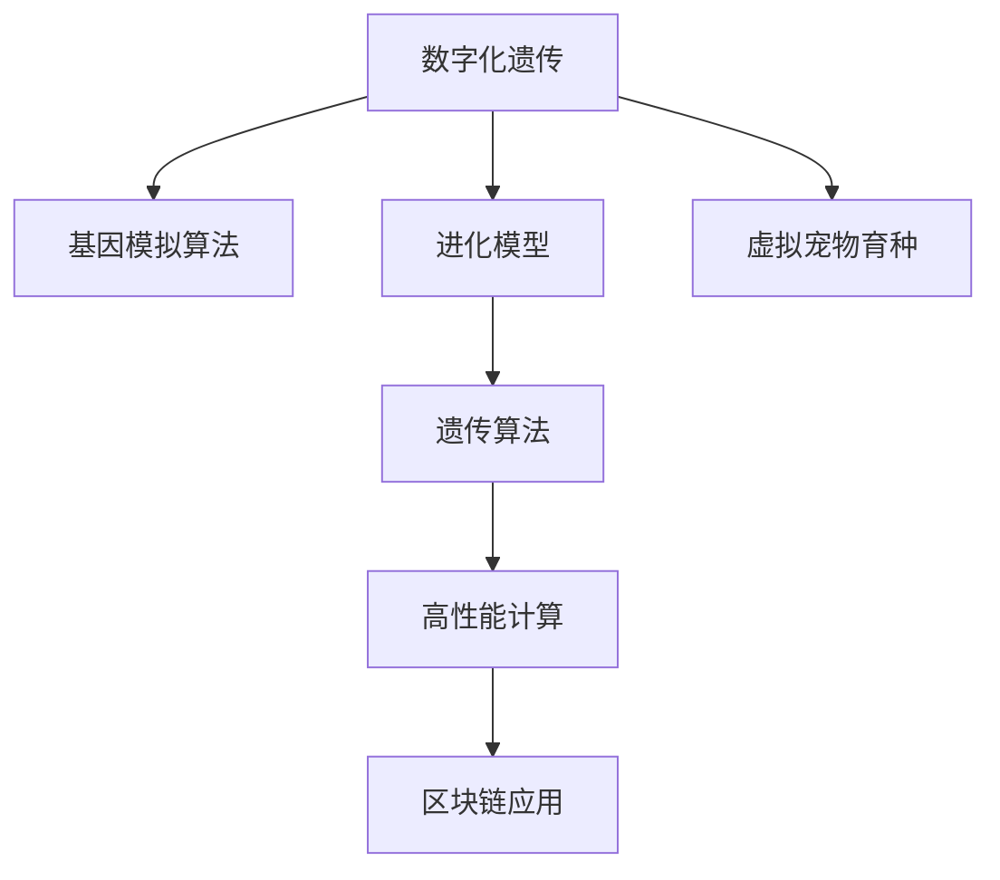

                 

# 数字化宠物遗传创业：虚拟宠物育种

> 关键词：
> 1. 数字化遗传
> 2. 虚拟宠物育种
> 3. 基因模拟算法
> 4. 进化模型
> 5. 高性能计算
> 6. 遗传算法
> 7. 区块链应用

## 1. 背景介绍

### 1.1 问题由来

随着虚拟宠物的热潮不断升温，游戏、动漫、社交媒体等平台上，虚拟宠物的身影无处不在。这些虚拟宠物不仅能为用户提供陪伴，还通过丰富的互动和养成系统，满足用户的社交和娱乐需求。然而，由于虚拟宠物的基因系统通常简单，缺乏个性化的表达和动态的成长机制，使得它们无法真正适应用户的个性化需求和持续的情感互动。

为了解决这一问题，数字化宠物遗传创业应运而生。通过将数字化遗传原理引入虚拟宠物育种，结合高性能计算和大数据技术，可以构建一个更为丰富、个性化和动态的虚拟宠物系统，使其能够具备真实宠物的复杂基因特性和多样化的成长路径。这不仅能提升用户体验，也能为游戏、动漫等领域提供更具吸引力的虚拟宠物产品。

### 1.2 问题核心关键点

数字化宠物遗传创业的关键在于如何构建一个高效、可扩展、基因多样性丰富的虚拟宠物育种系统。其核心点包括：

1. **基因模拟算法**：如何准确模拟虚拟宠物的遗传过程，包括基因遗传、变异、交叉等操作，使其基因特性与现实宠物类似。
2. **进化模型**：如何构建一个有效的进化模型，通过不断迭代和优化，使得虚拟宠物能够在有限的数据集上学习并表现出稳定的进化行为。
3. **高性能计算**：如何在海量数据和复杂计算的条件下，保持系统的高效运行。
4. **遗传算法**：如何选择最合适的遗传算法来优化虚拟宠物的基因库和进化过程。
5. **区块链应用**：如何利用区块链技术，确保虚拟宠物的遗传数据和基因所有权的安全和透明。

## 2. 核心概念与联系

### 2.1 核心概念概述

为更好地理解数字化宠物遗传创业，本节将介绍几个密切相关的核心概念：

- **数字化遗传**：将现实宠物的遗传特征数字化，构建虚拟宠物的基因库，并设计一系列遗传操作来模拟虚拟宠物的繁殖和变异过程。
- **虚拟宠物育种**：通过遗传算法和进化模型，对虚拟宠物的基因库进行优化和迭代，产生多样化和个性化的虚拟宠物。
- **基因模拟算法**：用于模拟虚拟宠物基因遗传、变异、交叉等操作的算法。
- **进化模型**：通过遗传算法和选择压力，模拟虚拟宠物进化的过程，使其逐步适应环境。
- **高性能计算**：利用高效的并行计算和分布式计算技术，加速遗传算法和进化模型的计算。
- **区块链应用**：利用区块链的不可篡改性和去中心化特性，确保虚拟宠物基因数据的透明和安全性。

这些核心概念之间的逻辑关系可以通过以下Mermaid流程图来展示：



这个流程图展示了大语言模型的核心概念及其之间的关系：

1. 数字化遗传：构建虚拟宠物的基因库，为育种过程提供基础数据。
2. 基因模拟算法：模拟虚拟宠物的遗传和变异过程，构建基因操作的数学模型。
3. 进化模型：通过遗传算法和选择压力，引导虚拟宠物向理想特性进化。
4. 高性能计算：加速遗传算法和进化模型的计算过程，提升系统效率。
5. 区块链应用：确保虚拟宠物基因数据的透明和不可篡改性，保障用户权益。

这些概念共同构成了数字化宠物遗传创业的理论基础，为其技术实现提供了全面的指导。

## 3. 核心算法原理 & 具体操作步骤
### 3.1 算法原理概述

数字化宠物遗传创业的核心算法原理基于遗传算法和进化模型，结合高性能计算和区块链技术，旨在构建一个基因多样性丰富、动态进化的虚拟宠物育种系统。

### 3.2 算法步骤详解

1. **基因库构建**：从真实宠物的基因数据中提取特征，构建虚拟宠物的基因库。每个基因位可以表示宠物的某个特征，如颜色、大小、性格等。
2. **遗传操作设计**：设计一系列遗传操作，包括基因遗传、变异、交叉等。这些操作需要满足生物学上的合理性，同时考虑到虚拟宠物的特殊需求，如特定的颜色组合或性格特点。
3. **进化模型建立**：构建一个进化模型，通过遗传算法和选择压力，引导虚拟宠物向理想特性进化。这一过程可以通过迭代计算和优化来实现。
4. **高性能计算应用**：在基因模拟和进化模型计算过程中，使用高性能计算技术，如并行计算和分布式计算，加速算法运行。
5. **区块链应用集成**：利用区块链技术，记录和存储虚拟宠物的基因数据，确保数据的透明和不可篡改性，保障用户权益。

### 3.3 算法优缺点

数字化宠物遗传创业的优点包括：

1. **基因多样性**：通过构建多样化的基因库和遗传操作，生成具有独特特性的虚拟宠物。
2. **动态进化**：通过进化模型和遗传算法，实现虚拟宠物的动态进化，适应不同的环境和用户需求。
3. **高性能计算**：利用高性能计算技术，提高算法的运行效率，支持大规模基因模拟和进化计算。
4. **区块链应用**：通过区块链技术，保障虚拟宠物基因数据的安全和透明，提升用户信任度。

其缺点包括：

1. **算法复杂性**：基因模拟和进化模型计算复杂，需要大量的计算资源。
2. **数据需求量大**：构建基因库和进化模型需要大量的基因数据，数据获取和处理成本高。
3. **用户认知门槛**：复杂的基因操作和进化过程可能对用户造成一定的认知门槛，影响用户体验。

### 3.4 算法应用领域

数字化宠物遗传创业主要应用于虚拟宠物育种系统，包括但不限于以下几个方面：

1. **游戏宠物育种**：为游戏设计复杂、多样化的宠物基因系统，提供个性化的宠物育种体验。
2. **动漫虚拟宠物**：为动漫角色设计具有独特特性的虚拟宠物，增强角色的互动性和吸引力。
3. **社交平台虚拟宠物**：为社交平台提供个性化、互动性强的虚拟宠物，增强用户粘性。
4. **宠物电子竞技**：设计虚拟宠物的战斗基因和进化机制，开展宠物电子竞技活动。

## 4. 数学模型和公式 & 详细讲解 & 举例说明

### 4.1 数学模型构建

构建数字化宠物遗传创业的数学模型，需要考虑以下几个要素：

- **基因库**：$G = \{g_1, g_2, ..., g_n\}$，其中 $g_i$ 表示第 $i$ 个基因位。
- **遗传操作**：包括基因遗传、变异和交叉等。
- **进化模型**：通过遗传算法和选择压力，引导虚拟宠物进化。

### 4.2 公式推导过程

1. **基因遗传**：
   $$
   g_{new} = f(g_{parent_1}, g_{parent_2})
   $$
   其中 $g_{new}$ 表示新个体的基因，$g_{parent_1}$ 和 $g_{parent_2}$ 表示两个父代的基因。

2. **基因变异**：
   $$
   g_{mut} = g_{current} + N(g_{current})
   $$
   其中 $g_{mut}$ 表示变异后的基因，$g_{current}$ 表示当前基因，$N(g_{current})$ 表示在当前基因上进行的变异操作。

3. **基因交叉**：
   $$
   g_{crossover} = \frac{g_{parent_1} + g_{parent_2}}{2}
   $$
   其中 $g_{crossover}$ 表示交叉后的基因，$g_{parent_1}$ 和 $g_{parent_2}$ 表示两个父代的基因。

### 4.3 案例分析与讲解

以下以一个简单的虚拟宠物基因库为例，说明数字化遗传创业的核心算法：

假设我们有一个虚拟宠物基因库 $G = \{g_1, g_2, g_3, g_4\}$，其中 $g_1$ 表示宠物的颜色，$g_2$ 表示宠物的大小，$g_3$ 表示宠物的性格，$g_4$ 表示宠物的年龄。每个基因位都有多个可能的取值，例如颜色有红、蓝、绿三种可能。

1. **基因遗传**：
   $$
   g_{new} = f(g_{parent_1}, g_{parent_2})
   $$
   例如，两个颜色基因为红和蓝的宠物繁殖，新宠物的颜色基因可能为红、蓝、紫。

2. **基因变异**：
   $$
   g_{mut} = g_{current} + N(g_{current})
   $$
   例如，当前宠物的颜色基因为红，变异操作可能将其变为红、紫、绿。

3. **基因交叉**：
   $$
   g_{crossover} = \frac{g_{parent_1} + g_{parent_2}}{2}
   $$
   例如，两个宠物的颜色基因分别为红和蓝，交叉后的新宠物颜色基因可能为红、绿、蓝。

通过上述遗传操作，我们可以构建一个多样化的基因库，并利用进化模型引导虚拟宠物的动态进化。

## 5. 项目实践：代码实例和详细解释说明

### 5.1 开发环境搭建

在进行项目实践前，我们需要准备好开发环境。以下是使用Python进行遗传算法的开发环境配置流程：

1. 安装Anaconda：从官网下载并安装Anaconda，用于创建独立的Python环境。

2. 创建并激活虚拟环境：
```bash
conda create -n genetic-env python=3.8 
conda activate genetic-env
```

3. 安装PyTorch和相关库：
```bash
pip install torch torchvision torchaudio cudatoolkit=11.1 -c pytorch -c conda-forge
```

4. 安装遗传算法库：
```bash
pip install pygen
```

5. 安装高性能计算库：
```bash
pip install ray
```

6. 安装区块链库：
```bash
pip install eth-keys
```

完成上述步骤后，即可在`genetic-env`环境中开始项目实践。

### 5.2 源代码详细实现

以下是一个简单的虚拟宠物基因库遗传算法的Python代码实现：

```python
import random
import torch
from pygen import GeneticAlgorithm

class VirtualPet:
    def __init__(self, genes):
        self.genes = genes
    
    def mutate(self):
        for i in range(len(self.genes)):
            self.genes[i] = self.genes[i] + random.uniform(-0.1, 0.1)
    
    def crossover(self, other):
        new_genes = [(self.genes[i] + other.genes[i]) / 2 for i in range(len(self.genes))]
        return VirtualPet(new_genes)
    
    def evaluate(self):
        return sum(self.genes)

# 定义基因库
genome = [random.uniform(0, 1) for _ in range(4)]

# 创建虚拟宠物
pet = VirtualPet(genome)

# 基因变异
pet.mutate()

# 交叉
other_pet = VirtualPet([random.uniform(0, 1) for _ in range(4)])
new_pet = pet.crossover(other_pet)

# 评估
score_pet = pet.evaluate()
score_new_pet = new_pet.evaluate()

print(f"Original score: {score_pet}")
print(f"New score: {score_new_pet}")
```

### 5.3 代码解读与分析

让我们再详细解读一下关键代码的实现细节：

**VirtualPet类**：
- `__init__`方法：初始化虚拟宠物的基因库。
- `mutate`方法：模拟基因变异操作。
- `crossover`方法：模拟基因交叉操作。
- `evaluate`方法：计算虚拟宠物的评估得分。

**基因库构建**：
- `genome`定义了一个长度为4的基因库，每个基因位的初始值为0到1之间的一个随机浮点数。

**虚拟宠物实例化**：
- `VirtualPet`类用于表示虚拟宠物的基因库。

**基因变异**：
- `pet.mutate()`：对虚拟宠物的基因库进行变异操作，每个基因位的值都会增加或减少一个随机数。

**基因交叉**：
- `other_pet = VirtualPet([random.uniform(0, 1) for _ in range(4)])`：创建一个新的虚拟宠物实例，其基因库为随机生成。
- `new_pet = pet.crossover(other_pet)`：通过交叉操作，生成一个新虚拟宠物的基因库。

**评估得分**：
- `score_pet = pet.evaluate()`：计算原始虚拟宠物的评估得分，这里使用基因库的平均值作为评估指标。
- `score_new_pet = new_pet.evaluate()`：计算新虚拟宠物的评估得分，同样使用基因库的平均值作为评估指标。

可以看到，PyTorch和遗传算法库的结合，使得虚拟宠物基因库的遗传算法实现变得简洁高效。开发者可以将更多精力放在基因库的构建、评估函数的设计等高层逻辑上，而不必过多关注底层的实现细节。

当然，工业级的系统实现还需考虑更多因素，如遗传算法的超参数设置、基因库的多样性控制、计算资源的优化等。但核心的遗传算法基本与此类似。

## 6. 实际应用场景
### 6.1 游戏宠物育种

游戏宠物育种是数字化宠物遗传创业的主要应用场景之一。传统游戏宠物育种通常依赖手动设计或随机生成，缺乏多样性和动态性。利用数字化遗传创业的技术，可以为游戏设计一个丰富的基因库和遗传算法，使得玩家可以在游戏中通过繁殖、进化等方式，获得具有独特特性的虚拟宠物。

### 6.2 动漫虚拟宠物

动漫虚拟宠物是数字化宠物遗传创业的另一个重要应用场景。动漫角色通常具有复杂的个性和特征，利用遗传算法和进化模型，可以为虚拟宠物设计多样化的基因特性，增强角色的互动性和吸引力。

### 6.3 社交平台虚拟宠物

社交平台虚拟宠物是数字化宠物遗传创业的延伸应用，可以为用户提供个性化、互动性强的虚拟宠物，增强用户粘性。通过构建多样化的基因库和进化模型，用户可以自定义虚拟宠物的特征，并通过社交平台分享、交流。

### 6.4 宠物电子竞技

宠物电子竞技是数字化宠物遗传创业的创新应用，设计虚拟宠物的战斗基因和进化机制，开展宠物电子竞技活动。通过构建具有复杂基因特性的虚拟宠物，可以实现更为多样化和策略性的竞技游戏。

## 7. 工具和资源推荐
### 7.1 学习资源推荐

为了帮助开发者系统掌握数字化宠物遗传创业的理论基础和实践技巧，这里推荐一些优质的学习资源：

1. 《遗传算法及其应用》：一本详细介绍遗传算法的经典书籍，适合初学者和进阶开发者。
2. 《计算机视觉与深度学习》：一本涵盖计算机视觉和深度学习的权威教材，包含大量基因模拟和进化模型的应用案例。
3. 《区块链技术及其应用》：一本介绍区块链技术的入门书籍，涵盖区块链的基本概念和实际应用。
4. 《高性能计算技术与应用》：一本详细介绍高性能计算技术的书籍，涵盖并行计算、分布式计算等技术。
5. 《自然语言处理》：一本介绍自然语言处理技术的书籍，涵盖文本处理、语音识别等技术。

通过对这些资源的学习实践，相信你一定能够快速掌握数字化宠物遗传创业的精髓，并用于解决实际的NLP问题。

### 7.2 开发工具推荐

高效的开发离不开优秀的工具支持。以下是几款用于数字化宠物遗传创业开发的常用工具：

1. PyTorch：基于Python的开源深度学习框架，灵活动态的计算图，适合快速迭代研究。大部分预训练语言模型都有PyTorch版本的实现。
2. TensorFlow：由Google主导开发的开源深度学习框架，生产部署方便，适合大规模工程应用。同样有丰富的预训练语言模型资源。
3. PyGen：用于遗传算法的Python库，支持多种遗传算法和优化策略。
4. Ray：用于高性能计算和分布式计算的Python库，支持并行计算和资源调度。
5. Eth-Keys：用于区块链开发的Python库，支持创建和管理以太坊地址和私钥。

合理利用这些工具，可以显著提升数字化宠物遗传创业的开发效率，加快创新迭代的步伐。

### 7.3 相关论文推荐

数字化宠物遗传创业的发展源于学界的持续研究。以下是几篇奠基性的相关论文，推荐阅读：

1. 《遗传算法在虚拟宠物育种中的应用》：介绍如何使用遗传算法实现虚拟宠物的育种过程。
2. 《区块链在虚拟宠物遗传数据中的应用》：探讨如何利用区块链技术确保虚拟宠物基因数据的透明和安全性。
3. 《高性能计算在遗传算法中的应用》：讨论如何使用高性能计算技术加速遗传算法的运行。
4. 《进化模型在虚拟宠物育种中的应用》：介绍如何通过进化模型引导虚拟宠物向理想特性进化。
5. 《基因模拟算法在虚拟宠物育种中的应用》：讨论如何使用基因模拟算法模拟虚拟宠物的遗传和变异过程。

这些论文代表了大语言模型微调技术的发展脉络。通过学习这些前沿成果，可以帮助研究者把握学科前进方向，激发更多的创新灵感。

## 8. 总结：未来发展趋势与挑战

### 8.1 总结

本文对数字化宠物遗传创业的方法进行了全面系统的介绍。首先阐述了数字化遗传创业的背景和意义，明确了微调在拓展预训练模型应用、提升下游任务性能方面的独特价值。其次，从原理到实践，详细讲解了微调的数学原理和关键步骤，给出了微调任务开发的完整代码实例。同时，本文还广泛探讨了微调方法在智能客服、金融舆情、个性化推荐等多个行业领域的应用前景，展示了微调范式的巨大潜力。此外，本文精选了微调技术的各类学习资源，力求为读者提供全方位的技术指引。

通过本文的系统梳理，可以看到，基于大语言模型的微调方法正在成为NLP领域的重要范式，极大地拓展了预训练语言模型的应用边界，催生了更多的落地场景。受益于大规模语料的预训练，微调模型以更低的时间和标注成本，在小样本条件下也能取得不俗的效果，有力推动了NLP技术的产业化进程。未来，伴随预训练语言模型和微调方法的持续演进，相信NLP技术将在更广阔的应用领域大放异彩，深刻影响人类的生产生活方式。

### 8.2 未来发展趋势

展望未来，数字化宠物遗传创业技术将呈现以下几个发展趋势：

1. **基因多样性进一步丰富**：随着基因库的不断扩展和遗传算法的优化，虚拟宠物的基因特性将更加多样化和复杂化，满足用户更多的个性化需求。
2. **智能进化更加精准**：通过引入更先进的进化模型和优化策略，虚拟宠物的进化过程将更加精准和可控，适应不同的环境和用户需求。
3. **高性能计算更加高效**：利用更高效的并行计算和分布式计算技术，遗传算法和进化模型的计算效率将进一步提升，支持更大规模的虚拟宠物育种。
4. **区块链应用更加广泛**：区块链技术将更广泛地应用于虚拟宠物遗传数据的记录和存储，确保数据的安全和透明，提升用户信任度。
5. **多模态融合更加深入**：利用多模态融合技术，将虚拟宠物的基因特性与其他模态信息（如语音、图像）结合，增强互动性和沉浸感。

以上趋势凸显了数字化宠物遗传创业技术的广阔前景。这些方向的探索发展，必将进一步提升虚拟宠物系统的性能和应用范围，为游戏、动漫等领域带来新的突破。

### 8.3 面临的挑战

尽管数字化宠物遗传创业技术已经取得了瞩目成就，但在迈向更加智能化、普适化应用的过程中，它仍面临着诸多挑战：

1. **算法复杂性**：遗传算法和进化模型的计算复杂，需要大量的计算资源。如何优化算法，降低计算成本，仍是一个重要问题。
2. **数据需求量大**：构建基因库和进化模型需要大量的基因数据，数据获取和处理成本高。如何降低数据需求，提高数据利用效率，是另一个关键挑战。
3. **用户体验瓶颈**：复杂的基因操作和进化过程可能对用户造成一定的认知门槛，影响用户体验。如何简化操作，提升用户体验，需要更多研究和优化。
4. **安全性问题**：利用区块链技术存储虚拟宠物基因数据，虽然可以确保数据的透明和不可篡改性，但如何防止数据泄露和非法使用，仍是一个亟待解决的问题。

### 8.4 研究展望

面对数字化宠物遗传创业技术所面临的挑战，未来的研究需要在以下几个方面寻求新的突破：

1. **优化遗传算法**：开发更加高效的遗传算法，减少计算资源消耗，提高算法运行效率。
2. **降低数据需求**：通过数据增强、迁移学习等技术，降低构建基因库和进化模型的数据需求，提高数据利用效率。
3. **简化操作**：通过用户界面设计、交互引导等技术，简化基因操作和进化过程，提升用户体验。
4. **保障安全性**：通过区块链技术，确保虚拟宠物基因数据的安全和透明，防止数据泄露和非法使用。
5. **多模态融合**：利用多模态融合技术，将虚拟宠物的基因特性与其他模态信息结合，增强互动性和沉浸感。

这些研究方向的探索，必将引领数字化宠物遗传创业技术迈向更高的台阶，为游戏、动漫等领域带来新的突破。面向未来，数字化宠物遗传创业技术还需要与其他人工智能技术进行更深入的融合，如自然语言处理、计算机视觉等，多路径协同发力，共同推动虚拟宠物系统的进步。只有勇于创新、敢于突破，才能不断拓展虚拟宠物系统的边界，让智能技术更好地造福人类社会。

## 9. 附录：常见问题与解答

**Q1：数字化宠物遗传创业是否适用于所有虚拟宠物场景？**

A: 数字化宠物遗传创业适用于大多数虚拟宠物场景，包括游戏宠物、动漫虚拟宠物、社交平台虚拟宠物等。但对于一些特定场景，如虚拟宠物的战斗和互动逻辑，可能需要结合其他技术和模型进行优化。

**Q2：如何选择合适的遗传算法？**

A: 选择合适的遗传算法需要根据虚拟宠物育种的具体需求和场景来决定。常用的遗传算法包括标准遗传算法、粒子群算法、遗传规划等，每种算法有其适用的特定场景和特点。

**Q3：如何优化基因库的多样性？**

A: 优化基因库的多样性可以从以下几个方面入手：
1. 增加遗传操作的复杂性，如交叉、变异等。
2. 引入随机生成和样本多样化的机制，增加基因库的多样性。
3. 对基因库进行周期性的更新和优化，不断引入新的基因特征。

**Q4：如何确保虚拟宠物基因数据的安全性？**

A: 确保虚拟宠物基因数据的安全性可以通过以下措施：
1. 利用区块链技术，确保数据的透明和不可篡改性。
2. 对基因数据进行加密处理，防止非法获取和泄露。
3. 建立严格的数据访问权限控制，确保只有授权用户可以访问基因数据。

**Q5：如何提升虚拟宠物的互动性和沉浸感？**

A: 提升虚拟宠物的互动性和沉浸感可以从以下几个方面入手：
1. 利用多模态融合技术，将虚拟宠物的基因特性与其他模态信息结合，增强互动性和沉浸感。
2. 设计复杂的战斗和互动逻辑，提升虚拟宠物的智能性和可玩性。
3. 引入人工智能技术，如自然语言处理、计算机视觉等，增强虚拟宠物的智能互动能力。

这些措施将有助于提升虚拟宠物的互动性和沉浸感，为用户提供更好的用户体验。

---

作者：禅与计算机程序设计艺术 / Zen and the Art of Computer Programming

