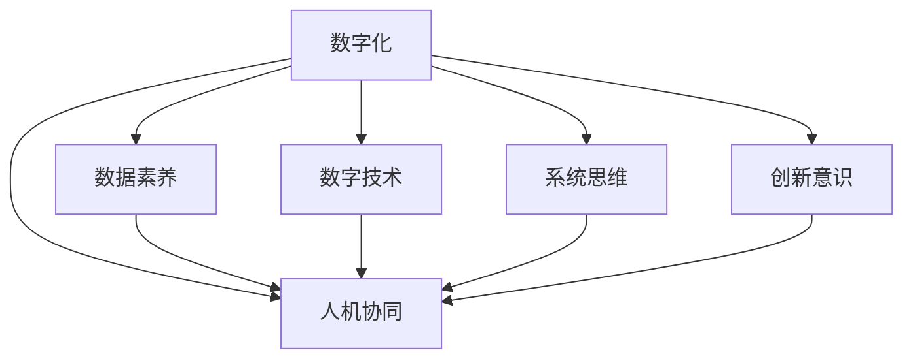

                 

# 数字化思维：全球脑时代的生存技能

## 1. 背景介绍

### 1.1 问题由来
进入21世纪，世界正经历着从工业经济到数字经济的深刻变革。以互联网、大数据、人工智能为代表的新技术飞速发展，彻底重塑了人类社会的生产、生活、工作方式，也对人类的思维方式提出了新的要求。面对日益数字化的世界，传统思维模式正逐渐失效，而数字化思维成为个体适应新环境、实现自我发展的关键技能。

### 1.2 问题核心关键点
数字化思维的核心在于理解和应用数字技术、数据驱动决策的能力。其关键点包括：

- **数据素养**：理解和分析数据的能力，能够从数据中提取有价值的信息，支持决策。
- **技术理解**：对数字技术的基本原理和应用场景的掌握，能够灵活运用技术解决问题。
- **系统思维**：具备全局视野和系统化思考的能力，能够从复杂系统中识别出关键要素和关联，制定优化方案。
- **人机协同**：在数字化环境中与机器协作，利用技术优势，提升个人和团队的效率。
- **创新意识**：积极探索新技术、新方法，持续改进个人和组织的工作方式，推动创新发展。

数字化思维将成为未来社会的基础技能，对各行各业的从业者提出了新的要求，也为全球脑时代的人类生存提供了新路径。

## 2. 核心概念与联系

### 2.1 核心概念概述

为更好地理解数字化思维及其相关概念，本节将介绍几个核心概念：

- **数字化**：将现实世界的信息转化为数字形式，借助数字技术进行处理、分析、存储和传播。数字化是人类社会进入信息时代的重要标志。
- **数据素养**：理解数据的来源、性质、处理方法和分析结果，具备数据驱动决策的能力。
- **数字技术**：指以数字信息为基础，涵盖计算机硬件、软件、网络通信、人工智能等领域的综合性技术。
- **系统思维**：从整体出发，综合考虑系统各要素的相互关系，分析系统动态演变规律，制定优化方案。
- **人机协同**：人类与机器在任务执行、信息处理、决策支持等方面形成有机协作，提升整体效率。
- **创新意识**：不断探索新思路、新方法，推动技术进步和应用创新。

这些概念之间的联系和相互作用，构成了数字化思维的基础框架，使其能够应用于各种实际场景中。

### 2.2 核心概念原理和架构的 Mermaid 流程图



这个流程图展示了数字化思维的核心概念及其相互关系。数字化是基础，数据素养、数字技术、系统思维、人机协同、创新意识分别从不同维度支持数字化思维的实践。通过理解这些核心概念，我们能够更好地把握数字化思维的本质，提升其在实际应用中的效果。

## 3. 核心算法原理 & 具体操作步骤

### 3.1 算法原理概述

数字化思维的核心算法原理主要体现在以下几个方面：

- **数据预处理**：通过清洗、格式化、归一化等方法，将原始数据转化为适合分析的形式。
- **数据分析**：应用统计学、机器学习等方法，从数据中提取有用的信息和模式。
- **模型训练**：利用历史数据训练模型，预测未来趋势或结果，支持决策。
- **系统优化**：通过系统分析，识别出影响系统效率的关键因素，制定优化方案。
- **人机协作**：结合机器学习模型的输出，结合人类经验进行决策，实现人机协同。

### 3.2 算法步骤详解

基于数字化思维的核心算法原理，下面是具体的算法操作步骤：

1. **数据收集**：从各种渠道获取相关数据，确保数据的多样性和全面性。
2. **数据清洗**：对数据进行去重、缺失值处理、异常值检测等预处理操作，确保数据质量。
3. **特征工程**：提取和选择对模型训练有帮助的特征，进行归一化、编码等处理。
4. **模型选择与训练**：根据问题类型选择合适的模型，使用历史数据进行训练，调整模型参数。
5. **模型评估与优化**：在验证集上评估模型性能，根据结果进行调整，提升模型泛化能力。
6. **系统集成**：将模型集成到实际系统中，结合业务规则和数据动态进行决策支持。
7. **持续监控与迭代**：实时监控模型性能，定期更新数据和模型，确保系统适应性。

### 3.3 算法优缺点

数字化思维算法具有以下优点：

- **数据驱动决策**：通过数据分析，提供更加客观、准确的决策依据。
- **优化效率**：系统思维和人机协同能够显著提升决策和执行的效率。
- **创新能力**：结合创新意识，不断探索新方法和新技术，推动持续改进。

同时，也存在以下缺点：

- **技术门槛**：需要掌握一定的数据处理和模型训练技能，对从业者提出了较高要求。
- **数据隐私**：在数据收集和分析过程中，需要关注数据隐私和安全问题。
- **模型复杂度**：复杂模型需要大量的计算资源和专业知识，可能增加成本和风险。

### 3.4 算法应用领域

数字化思维的算法和原理，广泛应用于以下几个领域：

- **商业分析**：利用数据分析和模型预测，优化营销策略、产品设计、供应链管理等。
- **金融科技**：通过风险评估、欺诈检测、智能投顾等应用，提升金融服务的质量和效率。
- **医疗健康**：在疾病预测、治疗方案推荐、健康管理等方面，提供个性化、精准的医疗服务。
- **教育培训**：通过数据分析和智能推荐，实现个性化学习路径设计，提升教育效果。
- **城市管理**：利用物联网、大数据等技术，优化城市交通、环境、公共安全等管理决策。

这些应用领域展示了数字化思维的广泛适用性和深远影响，推动了各行业的数字化转型和智能化发展。

## 4. 数学模型和公式 & 详细讲解

### 4.1 数学模型构建

数字化思维的数学模型构建主要围绕数据处理和模型训练展开。以下是一个典型的数据驱动决策模型构建流程：

1. **数据预处理模型**：
   - 设原始数据集为 $D=\{(x_i,y_i)\}_{i=1}^N$，其中 $x_i$ 为输入特征，$y_i$ 为输出标签。
   - 数据预处理包括去重、缺失值处理、异常值检测等操作，得到预处理后的数据集 $D_{pre}$。
   - 特征工程提取关键特征 $X=\{x_1,x_2,...,x_k\}$，进行归一化、编码等处理。

2. **模型训练模型**：
   - 选择适当的模型 $M$，如线性回归、逻辑回归、随机森林等，使用历史数据 $D_{train}$ 进行训练。
   - 损失函数为 $L=\frac{1}{N}\sum_{i=1}^N\ell(y_i,M(x_i))$，其中 $\ell$ 为具体的损失函数，如均方误差、交叉熵等。
   - 使用梯度下降等优化算法，最小化损失函数，更新模型参数 $\theta$。

3. **模型评估模型**：
   - 在验证集 $D_{val}$ 上评估模型性能，计算准确率、召回率、F1值等指标。
   - 根据评估结果调整模型参数或选择更合适的模型。

### 4.2 公式推导过程

以下以线性回归为例，推导模型训练的基本公式。

设线性回归模型的输出为 $y=wx+b$，其中 $w$ 为权重向量，$b$ 为偏置项。训练样本为 $(x_i,y_i)$，$x_i$ 为输入特征，$y_i$ 为输出标签。目标是最小化损失函数 $L(w,b)=\frac{1}{2N}\sum_{i=1}^N(y_i-w^Tx_i-b)^2$。

根据梯度下降算法，求导得：
$$
\frac{\partial L(w,b)}{\partial w} = \frac{1}{N}\sum_{i=1}^N(y_i-w^Tx_i-b)x_i
$$
$$
\frac{\partial L(w,b)}{\partial b} = \frac{1}{N}\sum_{i=1}^N(y_i-w^Tx_i-b)
$$

使用随机梯度下降法更新参数：
$$
w \leftarrow w - \eta\frac{1}{N}\sum_{i=1}^N(y_i-w^Tx_i-b)x_i
$$
$$
b \leftarrow b - \eta\frac{1}{N}\sum_{i=1}^N(y_i-w^Tx_i-b)
$$

其中 $\eta$ 为学习率。

### 4.3 案例分析与讲解

以房价预测为例，分析数字化思维在实际应用中的作用。

- **数据收集**：收集历史房屋交易数据，包括房屋面积、位置、房龄、交通便利性等信息。
- **数据清洗**：剔除缺失值和异常值，处理重复数据。
- **特征工程**：提取关键特征如房屋面积、位置评分、交通评分等。
- **模型训练**：使用线性回归模型训练房价预测模型。
- **模型评估**：在验证集上评估模型性能，优化模型参数。
- **系统集成**：将模型集成到房价评估系统中，支持实时预测。
- **持续监控**：定期更新数据和模型，确保模型适应性。

通过这一过程，可以实现对房价的精准预测，支持房产投资决策，提升投资效益。

## 5. 项目实践：代码实例和详细解释说明

### 5.1 开发环境搭建

进行数字化思维项目实践前，需要准备好开发环境。以下是使用Python进行Pandas、Scikit-Learn、TensorFlow等库的开发环境配置流程：

1. 安装Anaconda：从官网下载并安装Anaconda，用于创建独立的Python环境。

2. 创建并激活虚拟环境：
```bash
conda create -n pyenv python=3.8 
conda activate pyenv
```

3. 安装Pandas、Scikit-Learn、TensorFlow等库：
```bash
conda install pandas scikit-learn tensorflow
```

4. 安装Jupyter Notebook：
```bash
conda install jupyter notebook
```

5. 安装必要的依赖库：
```bash
pip install numpy matplotlib
```

完成上述步骤后，即可在`pyenv`环境中开始实践。

### 5.2 源代码详细实现

下面以线性回归为例，给出使用Scikit-Learn库进行数据驱动决策的Python代码实现。

```python
from sklearn.linear_model import LinearRegression
from sklearn.model_selection import train_test_split
from sklearn.metrics import mean_squared_error
import pandas as pd
import numpy as np

# 读取数据
data = pd.read_csv('house_prices.csv')

# 数据预处理
data.dropna(inplace=True)
X = data[['area', 'location_score', 'traffic_score']]
y = data['price']

# 特征工程
X = pd.get_dummies(X, drop_first=True)

# 划分训练集和验证集
X_train, X_val, y_train, y_val = train_test_split(X, y, test_size=0.2, random_state=42)

# 模型训练
model = LinearRegression()
model.fit(X_train, y_train)

# 模型评估
y_pred = model.predict(X_val)
mse = mean_squared_error(y_val, y_pred)
print(f"验证集MSE: {mse:.2f}")

# 系统集成
# 将模型应用到实际系统中进行房价预测
```

### 5.3 代码解读与分析

让我们再详细解读一下关键代码的实现细节：

**数据读取和预处理**：
- 使用Pandas库读取房屋数据，并进行数据清洗、特征提取等预处理操作。

**模型训练**：
- 选择线性回归模型，使用训练集数据进行训练。
- 计算训练集和验证集上的损失函数值。

**模型评估**：
- 使用均方误差（MSE）评估模型在验证集上的性能。
- 将模型集成到实际系统中，支持实时预测。

**系统集成**：
- 在实际系统中应用模型，对新房屋进行价格预测。

可以看到，通过简单的Python代码实现，我们便能快速构建一个基于线性回归的房价预测系统，实现了数字化思维在实际应用中的落地。

## 6. 实际应用场景

### 6.1 智能制造

在智能制造领域，数字化思维的应用可以显著提升生产效率和产品质量。通过物联网技术收集设备运行数据，利用数据分析和机器学习模型，预测设备故障，优化生产流程，实现智能化生产。例如，某制造企业通过数字化思维构建了智能仓储管理系统，通过实时监控仓库状态，优化库存管理，提升物流效率，降低成本。

### 6.2 智慧城市

智慧城市建设中，数字化思维的应用可以提升城市管理水平，改善居民生活质量。例如，通过城市大数据分析，识别出交通拥堵、环境污染等热点问题，制定优化方案，提升城市运行效率。某智慧城市项目通过数字化思维构建了智能交通管理系统，实时监控交通流量，优化红绿灯控制，减少交通堵塞。

### 6.3 医疗健康

在医疗健康领域，数字化思维的应用可以提升医疗服务质量和效率。通过大数据分析，预测疾病风险，推荐个性化治疗方案，提升诊疗效果。例如，某医院通过数字化思维构建了智能诊断系统，利用历史病历数据和最新研究成果，辅助医生进行疾病诊断，提升诊断准确率。

### 6.4 金融科技

在金融科技领域，数字化思维的应用可以提升风险控制和客户服务水平。通过数据分析和模型预测，评估贷款风险，优化客户体验，提升服务质量。例如，某银行通过数字化思维构建了智能风控系统，利用大数据分析客户信用历史和行为，降低贷款违约率，提升客户满意度。

### 6.5 教育培训

在教育培训领域，数字化思维的应用可以提供个性化学习体验，提升教育效果。通过数据分析和推荐系统，推荐适合的学习资源，优化学习路径，提升学习效果。例如，某在线教育平台通过数字化思维构建了个性化学习推荐系统，根据学生的学习历史和兴趣，推荐适合的课程和资源，提升学习体验。

## 7. 工具和资源推荐

### 7.1 学习资源推荐

为了帮助开发者系统掌握数字化思维的理论基础和实践技巧，这里推荐一些优质的学习资源：

1. **《数据科学导论》**：介绍数据科学的基本概念和常用技术，适合初学者入门。
2. **《机器学习实战》**：通过具体案例，介绍机器学习算法的实现和应用，适合实践者参考。
3. **Coursera《数据科学与机器学习》课程**：由斯坦福大学教授主讲，涵盖数据科学和机器学习的核心内容，适合系统学习。
4. **Kaggle竞赛平台**：提供大量数据集和竞赛机会，通过实战练习提升技能。
5. **Github开源项目**：浏览和学习各类开源项目，了解最新的技术和应用实践。

通过对这些资源的学习实践，相信你一定能够快速掌握数字化思维的精髓，并用于解决实际的NLP问题。

### 7.2 开发工具推荐

高效的开发离不开优秀的工具支持。以下是几款用于数字化思维开发的常用工具：

1. **Python**：Python语言简洁易用，生态丰富，适合快速迭代研究和开发。
2. **Pandas**：用于数据处理和分析，支持多种数据格式和操作，适合数据分析任务。
3. **Scikit-Learn**：开源机器学习库，提供了丰富的算法和工具，适合构建模型和评估效果。
4. **TensorFlow**：开源深度学习框架，支持分布式训练和模型部署，适合大规模工程应用。
5. **Jupyter Notebook**：交互式开发环境，支持Python、R等多种语言，适合编写和调试代码。

合理利用这些工具，可以显著提升数字化思维任务的开发效率，加快创新迭代的步伐。

### 7.3 相关论文推荐

数字化思维技术的发展源于学界的持续研究。以下是几篇奠基性的相关论文，推荐阅读：

1. **《数据驱动决策：基于机器学习的方法》**：介绍数据驱动决策的基本原理和应用场景。
2. **《深度学习在数据驱动决策中的应用》**：探讨深度学习技术在数据分析和模型训练中的作用。
3. **《系统思维在复杂系统中的应用》**：分析系统思维在解决复杂系统问题中的作用和应用。
4. **《人机协同：人工智能与人类协作的未来》**：探讨人机协同在各个领域的实际应用和潜在价值。

这些论文代表了大语言模型微调技术的发展脉络。通过学习这些前沿成果，可以帮助研究者把握学科前进方向，激发更多的创新灵感。

## 8. 总结：未来发展趋势与挑战

### 8.1 总结

本文对数字化思维进行了全面系统的介绍。首先阐述了数字化思维的研究背景和意义，明确了数字化思维在现代社会中的重要性和应用场景。其次，从原理到实践，详细讲解了数字化思维的数学模型和算法步骤，给出了数字化思维任务开发的完整代码实例。同时，本文还广泛探讨了数字化思维在各个行业领域的应用前景，展示了数字化思维的广阔前景。最后，本文精选了数字化思维技术的各类学习资源，力求为读者提供全方位的技术指引。

通过本文的系统梳理，可以看到，数字化思维已经成为现代社会不可或缺的基础技能，对各行各业的从业者提出了新的要求，也为全球脑时代的人类生存提供了新路径。

### 8.2 未来发展趋势

展望未来，数字化思维技术将呈现以下几个发展趋势：

1. **数据治理与隐私保护**：随着数据量的不断增长，数据治理和隐私保护成为数字化思维应用的重要保障。需要建立完善的数据管理制度，确保数据安全和个人隐私。
2. **跨领域融合**：数字化思维技术将与其他领域的技术深度融合，如物联网、区块链、人工智能等，推动更广泛的应用场景。
3. **人机协同智能化**：未来人机协同将更加智能化，机器能够更好地理解和模拟人类行为，实现更高效的人机协作。
4. **智能决策支持**：数字化思维技术将更加注重智能决策支持，结合专家知识和AI技术，提升决策的科学性和合理性。
5. **持续学习与进化**：数字化思维技术将不断进化，结合最新技术发展，持续提升性能和应用效果。

以上趋势凸显了数字化思维技术的广阔前景，这些方向的探索发展，必将进一步提升数字化思维在实际应用中的效果，推动数字化时代的进步。

### 8.3 面临的挑战

尽管数字化思维技术已经取得了瞩目成就，但在迈向更加智能化、普适化应用的过程中，它仍面临着诸多挑战：

1. **数据质量与获取**：数据质量不高、获取难度大，仍是制约数字化思维应用的主要瓶颈。需要进一步提升数据采集和处理技术，确保数据质量。
2. **技术门槛**：数字化思维技术需要一定的技术储备，对从业者提出了较高要求。需要通过教育培训，提升全社会的数字化思维能力。
3. **隐私与安全**：在数据驱动决策中，隐私和安全问题尤为突出。需要建立完善的数据保护机制，确保数据安全和个人隐私。
4. **模型复杂度**：复杂的模型需要大量的计算资源和专业知识，可能增加成本和风险。需要进一步优化模型结构和算法，降低技术门槛。
5. **跨领域应用**：数字化思维技术在不同领域的应用效果差异较大，需要结合领域特性进行优化。

### 8.4 研究展望

面对数字化思维面临的挑战，未来的研究需要在以下几个方面寻求新的突破：

1. **低成本数据获取**：探索低成本、高效的数据采集和处理技术，提升数据获取能力。
2. **普适化技术**：开发更易用、易理解的数字化思维技术，降低技术门槛，提升普及率。
3. **智能决策支持**：结合专家知识和AI技术，提升决策的科学性和合理性。
4. **跨领域融合**：推动数字化思维与其他技术深度融合，拓展应用场景。
5. **持续学习与进化**：结合最新技术发展，不断优化和进化数字化思维技术，提升性能和应用效果。

这些研究方向的探索，必将引领数字化思维技术迈向更高的台阶，为构建智能型社会提供更强大的技术支撑。

## 9. 附录：常见问题与解答

**Q1：数字化思维是否适用于所有行业和场景？**

A: 数字化思维技术可以应用于绝大多数行业和场景，但其效果和应用方式因行业特性和数据特点而有所不同。需要根据具体情况进行优化和调整。

**Q2：如何进行数字化思维项目的数据治理与隐私保护？**

A: 数据治理与隐私保护是数字化思维项目中的重要环节。需要建立完善的数据管理制度，确保数据质量和安全。具体措施包括数据匿名化、加密处理、访问控制等。

**Q3：如何降低数字化思维项目的技术门槛？**

A: 降低数字化思维项目的技术门槛，需要开发易用、易理解的数字化思维工具和平台，提供详细的文档和教程。同时，开展数字化思维教育培训，提升全社会的数字化思维能力。

**Q4：如何提高数字化思维项目的数据质量和获取效率？**

A: 提高数字化思维项目的数据质量和获取效率，需要采用先进的数据采集和处理技术，如物联网、大数据、AI等。同时，建立数据治理机制，确保数据质量和完整性。

**Q5：如何优化数字化思维项目的跨领域应用效果？**

A: 优化数字化思维项目的跨领域应用效果，需要结合领域特性进行模型和算法优化，如医疗、金融、教育等行业具有不同的数据特点和需求，需要进行针对性的调整。

通过这些问答，我们更好地理解了数字化思维的核心概念和应用挑战，为进一步的研究和实践提供了参考。

