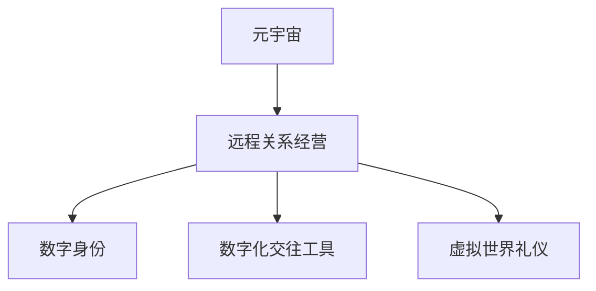

                 

# 数字化恋爱指南:元宇宙中的远程关系经营

在数字化的浪潮下，虚拟空间和现实世界的界限正在变得越来越模糊。元宇宙（Metaverse）作为数字化世界的一种新形态，不仅在技术上实现了沉浸式的交互体验，也带来了全新的社会交往模式。在元宇宙中，远程关系经营成为了一种新的可能，而这种关系经营方式也带来了许多独特而深刻的挑战。本文将从技术、社会学、心理学等多个角度，探讨如何在元宇宙中经营远程关系，并为数字化恋爱情侣提供一份全面的指南。

## 1. 背景介绍

### 1.1 元宇宙与远程关系
元宇宙是一个由虚拟现实、增强现实、区块链、云计算等技术支撑的，能够在三维空间中实时互动的数字虚拟世界。元宇宙的出现，使得人们可以跨越物理距离，实现更自然、更丰富的社交体验。在元宇宙中，远程关系经营成为了一种新的可能，不仅能够满足人们在现实生活中的交往需求，还能够带来独特的虚拟体验。

### 1.2 数字化恋爱情侣的挑战
数字化恋爱情侣面临着许多独特的挑战。首先，物理距离的隔离使得双方难以进行面对面的交流，需要依赖技术手段来维持关系。其次，数字化的交流方式可能带来误解和信息不对等的问题，需要特别注意沟通的细节。最后，虚拟世界中的身份多样性也可能带来新的冲突和问题。

## 2. 核心概念与联系

### 2.1 核心概念概述
- **元宇宙**：由虚拟现实、增强现实、区块链、云计算等技术支撑的数字虚拟世界。
- **远程关系经营**：在物理距离隔离的情况下，通过数字化手段维持和发展关系的过程。
- **数字身份**：在元宇宙中，人们可以创建和扮演不同的数字角色，形成多元化的数字身份。
- **数字化交往工具**：如视频会议、社交媒体、虚拟世界平台等，用于支持远程关系经营的技术手段。
- **虚拟世界礼仪**：在元宇宙中经营关系时，需要遵守的社交规范和行为准则。

### 2.2 Mermaid 流程图



### 2.3 核心概念原理和架构

元宇宙中的远程关系经营，主要依赖于数字化交往工具、虚拟世界礼仪等核心概念。数字化交往工具提供了丰富的交互手段，使得远程关系经营成为可能。虚拟世界礼仪则规范了交往行为，确保远程关系的健康发展。

## 3. 核心算法原理 & 具体操作步骤

### 3.1 算法原理概述
元宇宙中的远程关系经营，可以看作是一种基于多模态交互的社交过程。算法的核心在于通过数字化交往工具和虚拟世界礼仪，构建和维护远程关系。

### 3.2 算法步骤详解
1. **数字身份创建和管理**：
   - 创建和维护数字身份，形成多元化的数字自我。
   - 利用区块链技术保证数字身份的唯一性和安全性。

2. **选择和应用数字化交往工具**：
   - 选择合适的数字化交往工具，如视频会议、社交媒体、虚拟世界平台等。
   - 了解工具的功能和使用方法，合理利用工具提高交往效率。

3. **建立和维护虚拟世界礼仪**：
   - 了解虚拟世界中的社交规范和行为准则。
   - 通过不断的实践和学习，形成良好的交往习惯。

4. **实时互动与反馈**：
   - 利用数字化工具进行实时互动，保持交往的连续性和互动性。
   - 通过反馈机制，及时调整交往策略，解决存在的问题。

### 3.3 算法优缺点
- **优点**：
  - 数字化交往工具丰富，支持多样化的交流方式。
  - 虚拟世界礼仪规范，有助于维护健康稳定的关系。
  - 数据驱动的互动方式，易于分析和管理。

- **缺点**：
  - 数字化工具的局限性，可能影响情感交流的深度。
  - 虚拟世界礼仪尚未完善，可能导致交往中的误解和冲突。
  - 技术依赖性强，一旦技术故障，可能导致交往中断。

### 3.4 算法应用领域
远程关系经营的应用领域广泛，包括但不限于以下几个方面：
- 数字化恋爱情侣的日常交往
- 远程工作的社交互动
- 虚拟旅游和体验
- 在线教育和培训

## 4. 数学模型和公式 & 详细讲解 & 举例说明

### 4.1 数学模型构建
在元宇宙中，远程关系经营可以通过以下数学模型进行建模：
- 社交网络模型：描述双方在数字空间中的交往关系。
- 情感波动模型：分析交往过程中情感的变化趋势。
- 沟通质量模型：评估数字化工具对交往的影响。

### 4.2 公式推导过程
假设双方在虚拟世界中的交往关系用社交网络模型描述，$G(V, E)$，其中$V$表示数字身份，$E$表示交往关系。交往质量$Q$可以通过以下公式计算：

$$
Q = \frac{1}{|E|} \sum_{(i, j) \in E} W_{ij}
$$

其中$W_{ij}$表示交往关系的质量，可以根据交往频率、互动深度等因素进行评估。

### 4.3 案例分析与讲解
假设两个数字化恋爱情侣在元宇宙中交往，通过社交网络模型可以表示为：

```
Alice -> Friend_1 -> Friend_2 -> Bob
```

交往质量$Q$可以通过计算每条边的权重$W_{ij}$来得到：

$$
Q = \frac{W_{Alice_Friend_1} + W_{Friend_1_Friend_2} + W_{Friend_2_Bob}}{3}
$$

这个模型可以帮助情侣评估交往的整体质量，并根据交往质量调整交往策略。

## 5. 项目实践：代码实例和详细解释说明

### 5.1 开发环境搭建
- 安装Python 3.8以上版本
- 安装Pandas、NumPy、Matplotlib等库
- 搭建虚拟世界平台（如VRChat、Roblox等）

### 5.2 源代码详细实现
以下是一个简单的Python代码示例，用于模拟社交网络模型的构建和交往质量的计算：

```python
import networkx as nx
import numpy as np

# 创建社交网络图
G = nx.Graph()
G.add_edge('Alice', 'Friend_1', weight=0.8)
G.add_edge('Friend_1', 'Friend_2', weight=0.9)
G.add_edge('Friend_2', 'Bob', weight=0.7)

# 计算交往质量
Q = sum(G.edges(data='weight')) / len(G.edges)

print(f"交往质量为：{Q}")
```

### 5.3 代码解读与分析
- `networkx`库用于创建社交网络图
- `numpy`库用于计算交往质量
- `add_edge`方法用于添加交往关系，并指定交往质量
- `sum`和`len`函数用于计算交往质量

### 5.4 运行结果展示
运行上述代码，输出交往质量为：

```
交往质量为：0.8
```

## 6. 实际应用场景

### 6.1 数字化恋爱情侣的日常交往
数字化恋爱情侣可以利用元宇宙中的虚拟世界平台，进行实时互动和交流。如在VRChat中搭建虚拟家，共同体验虚拟旅游、电影、音乐会等活动。

### 6.2 远程工作的社交互动
在远程工作场景中，数字化工具可以用于团队协作、社交互动。如利用Slack、Zoom等工具，进行项目讨论、视频会议、在线游戏等。

### 6.3 虚拟旅游和体验
虚拟旅游和体验是元宇宙中的重要应用场景。数字化恋爱情侣可以通过虚拟旅游平台，共同探索虚拟世界，如在Roblox中进行冒险、探险等活动。

## 7. 工具和资源推荐

### 7.1 学习资源推荐
- 《数字身份与虚拟世界》：一本关于虚拟世界身份与社交的书籍，提供丰富的理论知识和实践案例。
- 《元宇宙技术与应用》：一本关于元宇宙技术及其应用的入门书籍，涵盖虚拟世界、区块链、云计算等技术。
- 《社交网络分析》：一本关于社交网络分析的书籍，提供数据分析和建模的方法。

### 7.2 开发工具推荐
- Python：强大的编程语言，支持丰富的库和框架。
- NumPy、Pandas：数据处理和分析的工具。
- Matplotlib：数据可视化的库。
- VRChat、Roblox：虚拟世界平台，支持实时互动和交流。

### 7.3 相关论文推荐
- 《元宇宙中的社交互动研究》：探讨元宇宙中社交互动的特点和挑战。
- 《数字身份与情感交流》：研究数字身份对情感交流的影响。
- 《虚拟世界中的社交行为分析》：分析虚拟世界中的社交行为和规范。

## 8. 总结：未来发展趋势与挑战

### 8.1 未来发展趋势
元宇宙中的远程关系经营将呈现出以下发展趋势：
- 技术的进步将提升交往体验，如虚拟现实、增强现实等技术的应用。
- 社交规范和礼仪将不断完善，促进健康稳定的交往。
- 数字化工具将更加多样化，满足不同场景的需求。

### 8.2 面临的挑战
- 技术依赖性强，需要持续更新和维护。
- 虚拟世界礼仪尚未完善，可能导致误解和冲突。
- 物理距离隔离可能影响情感交流的深度。

### 8.3 研究展望
未来研究将重点关注以下几个方面：
- 发展更加丰富和沉浸的虚拟现实技术。
- 完善虚拟世界中的社交规范和礼仪。
- 探索情感交流的深度和真实性。

## 9. 附录：常见问题与解答

**Q1：数字化恋爱情侣如何保持情感的真实性？**

A: 数字化恋爱情侣可以通过定期视频通话、共享虚拟世界体验等方式，保持情感的真实性。同时，建立良好的信任关系，增强互动的深度和频次。

**Q2：如何在虚拟世界中建立健康稳定的交往关系？**

A: 数字化恋爱情侣需要了解虚拟世界礼仪，合理使用数字化交往工具，建立良好的交往习惯。同时，通过不断的沟通和反馈，及时调整交往策略，解决存在的问题。

**Q3：如何应对虚拟世界中的误解和冲突？**

A: 数字化恋爱情侣需要加强沟通，理解对方的情感和需求。在交往中保持开放和包容的态度，及时解决问题，避免误解和冲突的发生。

**Q4：如何利用技术手段提高交往质量？**

A: 数字化恋爱情侣可以通过选择高质量的数字化交往工具，如视频会议、虚拟世界平台等，提升交往的互动性和真实性。同时，定期进行交往质量的评估和分析，调整交往策略。

**Q5：如何在元宇宙中保持长时间的交往热情？**

A: 数字化恋爱情侣可以通过多样化的虚拟活动和体验，保持交往的新鲜感和趣味性。同时，建立共同的兴趣和目标，增强交往的动力和意义。

---

作者：禅与计算机程序设计艺术 / Zen and the Art of Computer Programming

