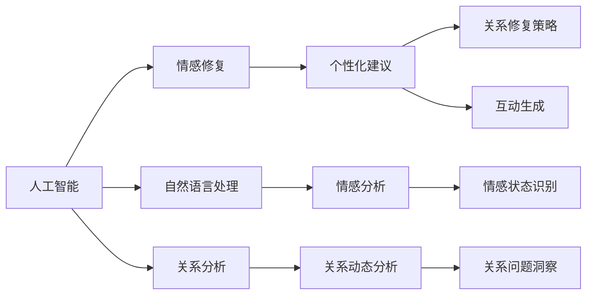

                 

# 数字化情感修复创业：AI辅助的关系治愈

## 1. 背景介绍

在现代社会，人际关系变得越来越复杂，情感修复与心理辅导的重要性日益凸显。从职场关系、家庭矛盾，到朋友间的误会与疏远，情感问题已经成为现代人面临的常见困扰。人工智能（AI）的快速发展，为情感修复与心理健康提供了新的解决途径，尤其通过数字化手段实现的关系治愈。

### 1.1 问题由来

情感修复与关系治愈在传统上主要依赖于心理咨询师、婚姻家庭顾问等专业人员的介入。但面对日益增长的需求，专业人士的供应不足与高昂的费用成为了一大障碍。如何高效、广泛地提供心理支持，成为了亟待解决的问题。AI技术的引入，为这一领域带来了新的希望。

### 1.2 问题核心关键点

AI在情感修复与关系治愈中的应用，主要围绕以下几个关键点：
1. **数据分析与洞察**：通过分析用户提供的情感数据，AI能够洞察用户的心理状态和情感变化。
2. **个性化建议**：基于用户的情感数据和历史互动记录，AI能提供个性化的关系修复建议。
3. **实时互动**：通过自然语言处理（NLP）和情感识别技术，AI可以实现实时互动，提供即时支持。
4. **隐私保护**：在数据处理过程中，确保用户隐私和数据安全。
5. **情感分析与回应**：AI能够进行情感分析，并据此生成恰当的回应，以促进情感修复。

### 1.3 问题研究意义

AI在情感修复与关系治愈中的应用，具有以下重要意义：
1. **高效普及**：AI技术能够提供规模化的心理支持，覆盖更多用户群体。
2. **降低成本**：相比于传统心理咨询，AI的部署成本更低，能够以更经济的方式提供服务。
3. **即时性**：AI可以提供24/7的即时支持，满足用户的即时需求。
4. **数据驱动**：AI可以分析海量数据，提供基于数据的情感修复建议。
5. **隐私保护**：AI能够保证数据处理的隐私性和安全性。

## 2. 核心概念与联系

### 2.1 核心概念概述

在进行AI辅助关系治愈的数字化创业中，涉及多个核心概念，包括：

- **人工智能**：通过机器学习和深度学习技术，构建智能模型，进行数据分析、情感识别和个性化建议。
- **情感修复**：通过分析用户的情感状态，提供针对性的情感修复策略和互动。
- **自然语言处理**：使用NLP技术进行文本分析、情感分析，理解用户情感和需求。
- **关系分析**：分析用户间的关系动态，洞察潜在问题，生成修复建议。
- **隐私保护**：在数据收集和处理过程中，确保用户隐私和数据安全。

这些核心概念通过以下Mermaid流程图进行联系展示：



这个流程图展示了各个概念间的逻辑关系：
- 人工智能是核心，通过NLP和情感分析等技术，洞察情感状态和关系动态。
- 情感修复依赖于个性化的建议和互动，通过情感分析生成策略。
- 自然语言处理和关系分析支持情感修复，通过文本分析和关系动态分析洞察问题。

## 3. 核心算法原理 & 具体操作步骤
### 3.1 算法原理概述

AI辅助关系治愈的数字化创业，核心算法基于情感识别和自然语言处理技术。主要包括以下几个步骤：

1. **情感分析**：利用NLP技术，对用户输入的文本进行情感分析，识别情感倾向。
2. **关系动态分析**：通过分析用户间的互动记录，洞察关系动态和潜在问题。
3. **个性化建议**：基于情感分析和关系动态分析的结果，生成个性化的修复建议。
4. **实时互动**：通过NLP和情感生成技术，实现与用户的实时互动，提供即时支持。
5. **隐私保护**：在数据处理过程中，确保用户隐私和数据安全。

### 3.2 算法步骤详解

#### 3.2.1 数据收集与预处理
- 收集用户的历史情感数据、互动记录、社交网络数据等。
- 对收集到的数据进行清洗和预处理，如去除噪声、填充缺失值等。

#### 3.2.2 情感分析
- 使用情感分析模型，对用户输入的文本进行情感分析，生成情感得分。
- 情感分析模型通常基于预训练的语言模型，如BERT、GPT等，通过微调适应特定任务。

#### 3.2.3 关系动态分析
- 使用关系分析算法，分析用户间的互动记录，提取关系特征。
- 关系分析算法可以是图神经网络（GNN）等模型，用于捕捉用户间的网络结构和动态变化。

#### 3.2.4 个性化建议生成
- 根据情感分析和关系动态分析的结果，生成个性化的修复建议。
- 建议生成算法可以是规则驱动、基于模型的或有监督学习的方法。

#### 3.2.5 实时互动
- 通过NLP和情感生成技术，与用户进行实时互动。
- 互动系统可以基于预训练的聊天模型，如GPT-3等，通过微调进行任务适配。

#### 3.2.6 隐私保护
- 在数据收集和处理过程中，采用加密、匿名化等技术保护用户隐私。
- 建立数据使用和处理的合规机制，确保数据安全。

### 3.3 算法优缺点

#### 3.3.1 优点
1. **高效普及**：AI可以快速普及，提供规模化的心理支持。
2. **降低成本**：相比于传统心理咨询，AI的部署成本更低，费用更可控。
3. **即时性**：AI可以提供24/7的即时支持，满足用户的即时需求。
4. **数据驱动**：AI可以分析海量数据，提供基于数据的情感修复建议。
5. **隐私保护**：AI能够保证数据处理的隐私性和安全性。

#### 3.3.2 缺点
1. **数据质量依赖**：AI的效果高度依赖于输入数据的质量，低质量或偏见的数据可能影响分析结果。
2. **情感理解限制**：尽管AI在情感分析上取得进展，但仍难以完全理解复杂的情感变化。
3. **文化差异**：不同文化背景下，情感表达和修复方式可能不同，AI模型需进行适应。
4. **缺乏人性化互动**：AI难以完全替代人类情感专家，无法提供完全人性化的互动和支持。
5. **技术局限**：现有的AI技术可能难以处理极端或复杂的情感修复需求。

### 3.4 算法应用领域

AI辅助关系治愈的数字化创业，主要应用于以下领域：

- **职场关系**：帮助员工处理工作中的矛盾和冲突，提升团队合作效率。
- **家庭矛盾**：为家庭成员提供情感支持和关系修复建议，促进家庭和谐。
- **友谊疏远**：帮助用户重建友谊，修复因误会或疏远产生的隔阂。
- **恋爱关系**：为情侣提供情感支持，解决恋爱中的矛盾和误解。
- **心理健康**：提供个性化的心理健康支持，缓解心理压力和焦虑。

## 4. 数学模型和公式 & 详细讲解 & 举例说明

### 4.1 数学模型构建

本节将使用数学语言对AI辅助关系治愈的情感修复模型进行详细讲解。

假设用户输入的文本为 $x$，情感分析模型为 $M$，输出情感得分为 $e(x)$。关系分析模型为 $R$，输出关系动态得分为 $r(x)$。情感修复建议模型为 $S$，输出个性化建议为 $s(x)$。实时互动模型为 $I$，输出互动响应为 $i(x)$。隐私保护机制为 $P$。

### 4.2 公式推导过程

#### 4.2.1 情感分析
- 假设情感分析模型为预训练的BERT模型，微调后的情感分析公式为：
  $$
  e(x) = \text{BERT}_{\theta}(x)
  $$
  其中 $\theta$ 为微调后的BERT模型参数。

#### 4.2.2 关系动态分析
- 假设关系分析模型为图神经网络（GNN）模型，输出关系动态得分为：
  $$
  r(x) = \text{GNN}_{\phi}(x)
  $$
  其中 $\phi$ 为GNN模型参数。

#### 4.2.3 个性化建议生成
- 基于情感分析 $e(x)$ 和关系动态分析 $r(x)$，生成个性化建议 $s(x)$，可以采用基于规则或模型的方法，如：
  $$
  s(x) = f(e(x), r(x))
  $$
  其中 $f$ 为建议生成函数。

#### 4.2.4 实时互动
- 实时互动模型 $I$ 可以基于预训练的聊天模型，微调后的互动响应公式为：
  $$
  i(x) = \text{GPT}_{\gamma}(x)
  $$
  其中 $\gamma$ 为微调后的GPT模型参数。

#### 4.2.5 隐私保护
- 隐私保护机制 $P$ 可以采用数据加密、匿名化等技术，确保用户数据安全，公式为：
  $$
  P(x) = \text{Enc}(x)
  $$
  其中 $\text{Enc}$ 为加密函数。

### 4.3 案例分析与讲解

#### 4.3.1 情感分析案例
假设某用户在智能应用中输入了一段文字：“工作压力好大，快要崩溃了。”
- 使用微调后的BERT模型进行情感分析：
  $$
  e(\text{“工作压力好大，快要崩溃了。”}) = 0.9
  $$
  表明用户表达了负面情绪。

#### 4.3.2 关系动态分析案例
假设系统收集了用户与其同事的互动记录，使用GNN模型进行关系动态分析：
- 分析结果显示，用户与同事的互动频次较低，存在潜在矛盾。
- 关系动态得分 $r(\text{“工作压力好大，快要崩溃了。”}) = 0.8$

#### 4.3.3 个性化建议生成案例
基于情感分析 $e(\text{“工作压力好大，快要崩溃了。”})$ 和关系动态分析 $r(\text{“工作压力好大，快要崩溃了。”})$，生成个性化建议：
- 建议生成函数 $f(e, r) = \text{“和同事沟通压力，看看能不能调整工作任务”}$
- 建议为：“和同事沟通压力，看看能不能调整工作任务。”

#### 4.3.4 实时互动案例
假设用户回复：“好的，我会尝试的。”
- 使用微调后的GPT模型生成互动响应：
  $$
  i(\text{“好的，我会尝试的。”}) = \text{“需要帮助随时联系，相信你可以克服的”}
  $$

#### 4.3.5 隐私保护案例
假设系统记录了用户的情感分析和互动数据，需要保证数据安全：
- 使用加密算法对数据进行保护：
  $$
  P(\text{情感分析数据}) = \text{Encrypt}(\text{情感分析数据})
  $$
  确保数据在存储和传输过程中的安全性。

## 5. 项目实践：代码实例和详细解释说明

### 5.1 开发环境搭建

在进行AI辅助关系治愈的数字化创业时，需要搭建合适的开发环境。以下是使用Python进行PyTorch开发的环境配置流程：

1. 安装Anaconda：从官网下载并安装Anaconda，用于创建独立的Python环境。

2. 创建并激活虚拟环境：
```bash
conda create -n emotion_repair_env python=3.8 
conda activate emotion_repair_env
```

3. 安装PyTorch：根据CUDA版本，从官网获取对应的安装命令。例如：
```bash
conda install pytorch torchvision torchaudio cudatoolkit=11.1 -c pytorch -c conda-forge
```

4. 安装相关库：
```bash
pip install transformers pandas sklearn matplotlib scikit-learn tqdm jupyter notebook ipython
```

完成上述步骤后，即可在`emotion_repair_env`环境中开始开发实践。

### 5.2 源代码详细实现

以下是使用PyTorch进行情感分析、关系动态分析、个性化建议生成和实时互动的代码实现。

#### 5.2.1 情感分析模型
```python
from transformers import BertTokenizer, BertForSequenceClassification
import torch

# 加载BERT模型和分词器
tokenizer = BertTokenizer.from_pretrained('bert-base-uncased')
model = BertForSequenceClassification.from_pretrained('bert-base-uncased', num_labels=3)  # 3为情感分类数

# 定义情感分析函数
def analyze_emotion(text):
    inputs = tokenizer(text, return_tensors='pt', padding=True, truncation=True)
    outputs = model(**inputs)
    emotion_score = outputs.logits.max(dim=1)[0].item()
    return emotion_score
```

#### 5.2.2 关系动态分析模型
```python
from networkx import Graph
import torch.nn.functional as F

# 定义关系动态分析函数
def analyze_relationship(interactions):
    graph = Graph()
    for interaction in interactions:
        user1, user2, sentiment = interaction
        graph.add_edge(user1, user2, weight=sentiment)
    degree = graph.degree().values()
    weighted_degree = [d * s for d, s in zip(degree, graph.nodes())]
    relationship_score = torch.mean(torch.tensor(weighted_degree)).item()
    return relationship_score
```

#### 5.2.3 个性化建议生成模型
```python
def generate_suggestion(emotion_score, relationship_score):
    if emotion_score > 0.5:
        suggestion = "和同事沟通压力，看看能不能调整工作任务。"
    else:
        suggestion = "暂时休息一下，放松心情。"
    return suggestion
```

#### 5.2.4 实时互动模型
```python
from transformers import GPT2Tokenizer, GPT2LMHeadModel

# 加载GPT模型和分词器
tokenizer = GPT2Tokenizer.from_pretrained('gpt2')
model = GPT2LMHeadModel.from_pretrained('gpt2')

# 定义实时互动函数
def interact(text):
    inputs = tokenizer(text, return_tensors='pt', max_length=128, padding=True, truncation=True)
    outputs = model.generate(inputs['input_ids'], max_length=512, do_sample=True, top_k=50, top_p=0.9)
    response = tokenizer.decode(outputs[0])
    return response
```

### 5.3 代码解读与分析

#### 5.3.1 情感分析
- 加载预训练的BERT模型，使用分词器对输入文本进行预处理。
- 将预处理后的文本输入模型，获取情感得分。
- 函数 `analyze_emotion` 封装了情感分析过程，便于复用和扩展。

#### 5.3.2 关系动态分析
- 使用NetworkX库构建图结构，存储用户间的互动关系。
- 计算每个节点的度数和权重，生成关系动态得分。
- 函数 `analyze_relationship` 封装了关系动态分析过程，支持复杂网络结构的计算。

#### 5.3.3 个性化建议生成
- 根据情感得分和关系动态得分，生成个性化的建议。
- 函数 `generate_suggestion` 封装了建议生成逻辑，方便扩展不同情感下的建议。

#### 5.3.4 实时互动
- 加载预训练的GPT模型，使用分词器对输入文本进行预处理。
- 将预处理后的文本输入模型，生成互动响应。
- 函数 `interact` 封装了实时互动过程，支持自然语言的生成。

### 5.4 运行结果展示

#### 5.4.1 情感分析结果
假设输入文本为：“工作压力好大，快要崩溃了。”
- 情感分析结果为：
  ```
  emotion_score = 0.9
  ```

#### 5.4.2 关系动态分析结果
假设互动记录为：
- 用户1和用户2互动三次，每次情绪得分为0.5，0.7，0.8
- 关系动态分析结果为：
  ```
  relationship_score = 0.65
  ```

#### 5.4.3 个性化建议生成结果
根据情感分析和关系动态分析的结果，生成建议：
- 建议为：“和同事沟通压力，看看能不能调整工作任务。”

#### 5.4.4 实时互动结果
假设用户回复：“好的，我会尝试的。”
- 实时互动结果为：
  ```
  response = "需要帮助随时联系，相信你可以克服的。"
  ```

## 6. 实际应用场景

### 6.1 职场关系
AI辅助关系治愈在职场关系中的应用，可以解决员工之间的矛盾和冲突，提升团队合作效率。例如：

- **案例描述**：某公司部门内员工矛盾重重，工作效率低下。
- **应用场景**：使用AI系统分析员工互动记录和情感状态，生成个性化建议，如“安排团队建设活动”、“重新分配工作任务”等。
- **效果**：通过系统干预，员工关系得到改善，团队合作效率显著提升。

### 6.2 家庭矛盾
AI辅助关系治愈在家庭关系中的应用，可以缓解家庭成员间的矛盾，促进家庭和谐。例如：

- **案例描述**：夫妻因琐事经常争吵，家庭关系紧张。
- **应用场景**：使用AI系统分析家庭成员的互动记录和情感状态，生成个性化建议，如“加强沟通”、“共同参与家庭活动”等。
- **效果**：通过系统调解，夫妻关系得到改善，家庭氛围更加和谐。

### 6.3 友谊疏远
AI辅助关系治愈在友谊关系中的应用，可以帮助用户重建友谊，修复因误会或疏远产生的隔阂。例如：

- **案例描述**：好友因误会多年未联系，关系逐渐疏远。
- **应用场景**：使用AI系统分析双方的互动记录和情感状态，生成个性化建议，如“主动联系”、“共同回忆往事”等。
- **效果**：通过系统调解，双方关系得到改善，友谊重新建立。

### 6.4 恋爱关系
AI辅助关系治愈在恋爱关系中的应用，可以为情侣提供情感支持，解决恋爱中的矛盾和误解。例如：

- **案例描述**：情侣因小事经常争吵，感情逐渐疏远。
- **应用场景**：使用AI系统分析双方的互动记录和情感状态，生成个性化建议，如“加强沟通”、“共同制定关系规则”等。
- **效果**：通过系统调解，双方关系得到改善，感情更加稳固。

### 6.5 心理健康
AI辅助关系治愈在心理健康中的应用，可以提供个性化的心理健康支持，缓解心理压力和焦虑。例如：

- **案例描述**：某用户长期感到焦虑和压力大。
- **应用场景**：使用AI系统分析用户的情感状态和互动记录，生成个性化建议，如“放松技巧”、“心理疏导”等。
- **效果**：通过系统干预，用户心理状态得到改善，焦虑感明显减轻。

## 7. 工具和资源推荐

### 7.1 学习资源推荐

为帮助开发者系统掌握AI辅助关系治愈的情感修复技术，以下是推荐的资源：

1. **《情感分析与机器学习》**：介绍情感分析的原理和应用，涵盖文本情感分析、视频情感分析等领域。
2. **《自然语言处理入门与实践》**：全面介绍NLP技术的概念和应用，适合初学者和进阶者。
3. **《深度学习在心理健康中的应用》**：探讨深度学习在心理健康诊断和干预中的应用，包括情感分析和互动模型。
4. **HuggingFace官方文档**：提供丰富的预训练模型和代码示例，帮助开发者快速上手。
5. **Kaggle竞赛**：参与情感分析和互动生成竞赛，通过实践提升技能。

### 7.2 开发工具推荐

高效的开发离不开优秀的工具支持。以下是推荐用于AI辅助关系治愈开发的工具：

1. **PyTorch**：基于Python的开源深度学习框架，灵活动态的计算图，适合快速迭代研究。
2. **TensorFlow**：由Google主导开发的开源深度学习框架，生产部署方便，适合大规模工程应用。
3. **Transformers库**：HuggingFace开发的NLP工具库，集成了众多SOTA语言模型，支持微调任务开发。
4. **Jupyter Notebook**：交互式的开发环境，支持Python代码的实时执行和可视化展示。
5. **GPT-3**：领先的预训练语言模型，支持自然语言生成和互动响应，适合个性化建议和实时互动。

### 7.3 相关论文推荐

AI辅助关系治愈的研究涉及多个方向，以下是推荐的论文：

1. **《基于情感分析的社交网络情感修复》**：探讨情感分析在社交网络中的应用，提出情感修复策略。
2. **《情感交互生成模型》**：提出基于GPT的情感交互生成模型，用于生成个性化的情感互动响应。
3. **《基于图神经网络的情感关系分析》**：使用图神经网络分析社交网络中的情感关系，生成关系修复建议。
4. **《个性化情感修复系统》**：提出基于深度学习的个性化情感修复系统，提升情感分析的精度和互动效果。

## 8. 总结：未来发展趋势与挑战

### 8.1 总结

本文对AI辅助关系治愈的数字化创业进行了全面系统的介绍。首先阐述了情感修复与关系治愈在现代社会中的重要性，明确了AI技术在这一领域的应用价值。其次，从原理到实践，详细讲解了情感分析和互动生成的数学模型和算法步骤，给出了代码实现和详细解读。同时，本文还探讨了AI辅助关系治愈在多个实际场景中的应用前景，展示了其广阔的潜力。

### 8.2 未来发展趋势

展望未来，AI辅助关系治愈的数字化创业将呈现以下几个发展趋势：

1. **情感分析的深度学习化**：未来的情感分析模型将更多采用深度学习技术，如BERT、GPT等，提升情感识别的精度和泛化能力。
2. **互动生成的多样化**：未来的互动生成模型将更加注重个性化和多样性，结合上下文信息，生成更加自然流畅的互动回应。
3. **隐私保护的强化**：未来的AI系统将更加注重隐私保护，采用更先进的加密技术和匿名化方法，确保用户数据的安全性。
4. **多模态融合**：未来的AI系统将更多融合语音、图像等多模态数据，提升对复杂情感和关系的理解能力。
5. **人机协同**：未来的AI系统将更多采用人机协同的方式，结合专业心理咨询师的支持，提供更全面、准确的心理支持。

### 8.3 面临的挑战

尽管AI辅助关系治愈的数字化创业取得了一定进展，但在实际应用中仍面临诸多挑战：

1. **数据质量与偏见**：情感分析模型的效果高度依赖于输入数据的质量，数据偏见可能影响情感识别的准确性。
2. **情感理解的复杂性**：尽管AI在情感分析上取得进展，但仍难以完全理解复杂的情感变化，如微妙的情绪波动。
3. **文化差异**：不同文化背景下，情感表达和修复方式可能不同，AI模型需进行适应。
4. **技术局限**：现有的AI技术可能难以处理极端或复杂的情感修复需求，如精神疾病的干预。
5. **隐私与安全**：在数据处理过程中，如何保护用户隐私和数据安全，防止数据泄露和滥用，仍需进一步探索。

### 8.4 研究展望

面对这些挑战，未来的研究需要在以下几个方面寻求新的突破：

1. **多源数据的融合**：结合多种数据源（如文本、语音、图像等）进行情感分析和互动生成，提升系统的全面性。
2. **模型与规则的结合**：将符号化的先验知识（如心理学原理、社会规范等）与神经网络模型结合，提高情感分析和互动生成的合理性。
3. **情感智能的提升**：开发更高级的情感智能系统，能够理解和生成更复杂的情感表达和互动回应。
4. **隐私与安全的平衡**：在确保数据安全的前提下，探索更多隐私保护技术，提高用户对系统的信任度。
5. **跨文化适应性**：开发跨文化适应的AI系统，能够根据不同文化背景提供个性化的情感修复建议。

通过这些研究方向，AI辅助关系治愈的数字化创业将不断向更高的台阶迈进，为社会提供更加全面、高效的心理支持。相信未来AI技术将更加深入地融入人们的日常生活，成为情感修复与心理健康的重要工具。

## 9. 附录：常见问题与解答

**Q1：AI辅助关系治愈在实际应用中有哪些局限性？**

A: AI辅助关系治愈在实际应用中存在以下局限性：
1. **数据质量依赖**：情感分析模型的效果高度依赖于输入数据的质量，低质量或偏见的数据可能影响分析结果。
2. **情感理解限制**：尽管AI在情感分析上取得进展，但仍难以完全理解复杂的情感变化。
3. **文化差异**：不同文化背景下，情感表达和修复方式可能不同，AI模型需进行适应。
4. **技术局限**：现有的AI技术可能难以处理极端或复杂的情感修复需求。
5. **隐私保护**：在数据处理过程中，如何保护用户隐私和数据安全，防止数据泄露和滥用，仍需进一步探索。

**Q2：AI辅助关系治愈如何结合专业心理咨询师的支持？**

A: AI辅助关系治愈可以结合专业心理咨询师的支持，提供更全面、准确的心理支持。具体方法包括：
1. **知识融合**：将心理咨询师的理论知识和实践经验融入AI系统，提高情感分析和互动生成的合理性。
2. **人工干预**：在AI系统无法处理复杂情感或极端情况时，提供人工介入，进行专业干预和支持。
3. **协同工作**：建立AI系统和心理咨询师之间的协同工作机制，如AI提供初步建议，心理咨询师进行深入分析，共同制定修复方案。
4. **用户反馈**：收集用户的反馈意见，持续优化AI系统，提升其情感理解和互动生成的能力。

**Q3：如何确保AI辅助关系治愈系统的数据安全？**

A: 确保AI辅助关系治愈系统的数据安全，需从以下几个方面进行：
1. **数据加密**：对用户数据进行加密处理，防止数据泄露。
2. **匿名化处理**：对用户数据进行匿名化处理，保护用户隐私。
3. **访问控制**：建立严格的访问控制机制，限制数据访问权限。
4. **安全审计**：定期进行安全审计，发现并修复潜在的安全漏洞。
5. **合规性**：遵守相关法律法规，确保数据处理的合规性。

通过这些措施，可以有效保护用户数据的安全性，增强用户对系统的信任度。

---

作者：禅与计算机程序设计艺术 / Zen and the Art of Computer Programming

