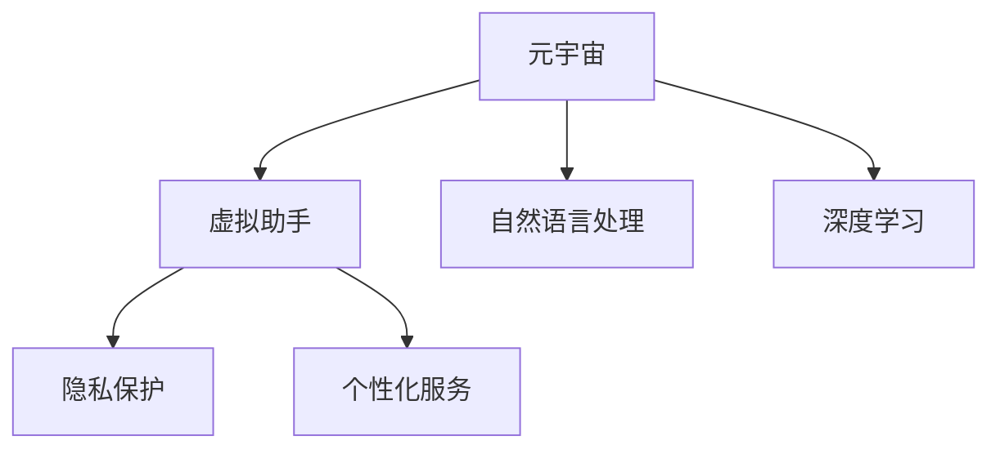

                 

# 数字化情感咨询:元宇宙中的心理健康服务

> 关键词：情感咨询,元宇宙,心理健康,数字化服务,自然语言处理(NLP),深度学习,虚拟助手,隐私保护

## 1. 背景介绍

### 1.1 问题由来

随着社会节奏的加快和心理压力的增加，全球范围内的心理健康问题日益凸显。据世界卫生组织（WHO）统计，约有1/4的人口会在一生中面临心理健康问题。面对如此庞大的群体，传统的心理咨询方式难以覆盖所有需要帮助的人群，尤其是在资源匮乏的地区。

近年来，随着人工智能、大数据等技术的迅猛发展，数字化的心理健康服务成为应对这一挑战的新途径。利用自然语言处理（NLP）、深度学习等技术，可以实现全天候、大规模的心理健康服务。元宇宙（Metaverse）作为新兴的虚拟世界平台，为数字心理服务提供了新的展示舞台。

### 1.2 问题核心关键点

在元宇宙中，数字化情感咨询的服务主要有以下特点：

1. **实时交互**：通过虚拟世界中的交互界面，用户可以随时与虚拟心理助手进行语音、文本等形式的沟通。
2. **数据隐私**：用户数据传输和存储在虚拟环境中，隐私保护尤为重要。
3. **语言多样性**：服务应支持多种语言，确保全球范围内的用户都能获得有效的帮助。
4. **个性化**：提供个性化服务，根据用户的情感状态和历史数据推荐合适的咨询策略。
5. **持续学习**：系统应具备持续学习能力，随着用户反馈不断优化服务质量。

本文将详细探讨这些关键点，探讨如何在元宇宙中实现高效、安全和个性化的数字化情感咨询服务。

## 2. 核心概念与联系

### 2.1 核心概念概述

为更好地理解数字化情感咨询的实现原理，本节将介绍几个密切相关的核心概念：

- **元宇宙(Metaverse)**：虚拟世界平台，支持用户在其中进行交互、协作和体验。
- **虚拟助手(Virtual Assistant)**：通过自然语言处理技术实现人机交互的虚拟角色，为用户提供情感咨询服务。
- **自然语言处理(NLP)**：使计算机能够理解、处理和生成人类自然语言的技术，是实现情感咨询的基础。
- **深度学习(Deep Learning)**：利用神经网络进行数据训练，实现复杂的模式识别和决策。
- **隐私保护(Privacy Protection)**：保护用户数据，防止隐私泄露的技术手段。
- **个性化服务(Personalization)**：根据用户的历史数据和行为特征，提供定制化的服务。

这些核心概念之间的逻辑关系可以通过以下Mermaid流程图来展示：



这个流程图展示了几组核心概念之间的联系：

1. 元宇宙作为平台，承载了虚拟助手和用户之间的交互。
2. 自然语言处理和深度学习技术是虚拟助手的核心能力。
3. 隐私保护是服务安全的基础。
4. 个性化服务提升用户体验，增强服务的有效性。

## 3. 核心算法原理 & 具体操作步骤
### 3.1 算法原理概述

数字化情感咨询的实现主要基于自然语言处理（NLP）和深度学习技术。用户通过文本或语音输入表达情感问题，虚拟助手利用NLP技术理解用户意图，再通过深度学习模型生成适当的回应，从而实现情感咨询。

具体而言，数字化情感咨询的算法流程包括：

1. **文本预处理**：对用户输入的文本进行分词、去除停用词等预处理。
2. **意图识别**：通过模型分析用户输入的文本，识别用户的情感状态和咨询意图。
3. **情感分析**：对用户情感状态进行定量或定性分析，判断用户的情绪水平。
4. **生成回应**：基于情感分析和意图识别结果，生成适当的回应。
5. **情感反馈**：收集用户对回应的反馈，用于模型优化。

### 3.2 算法步骤详解

#### 3.2.1 文本预处理

文本预处理是NLP中重要的一环，主要包括以下步骤：

1. **分词**：将用户输入的文本切分成词汇单元，便于后续处理。
2. **去除停用词**：去除对情感分析没有帮助的常见词汇，如“的”、“是”等。
3. **词性标注**：标注每个词汇的词性，帮助模型理解词汇的语义。
4. **词向量表示**：将处理后的文本转换为向量形式，方便后续的计算和处理。

#### 3.2.2 意图识别

意图识别是理解用户情感状态的关键步骤，主要通过以下方式实现：

1. **意图分类模型**：使用分类模型（如BERT、RNN等）对用户输入的文本进行意图分类，识别用户的咨询意图。
2. **情感分类模型**：使用情感分类模型（如情感分析器）对用户输入的文本进行情感分类，判断用户的情绪状态。

#### 3.2.3 情感分析

情感分析通过以下步骤实现：

1. **情感词典**：构建或使用已有的情感词典，对用户输入的文本进行情感打分。
2. **情感分类器**：使用分类器（如LSTM、RNN等）对文本进行情感分类，判断用户的情绪状态。
3. **情感强度计算**：计算文本情感的强度值，量化用户的情绪水平。

#### 3.2.4 生成回应

生成回应是情感咨询的最终环节，主要通过以下方式实现：

1. **生成模型**：使用生成模型（如GPT、Transformer等）根据用户的情感状态和咨询意图生成适当的回应。
2. **上下文理解**：在生成回应时，考虑用户的上下文信息，使得回应更加贴合用户需求。
3. **多轮对话**：通过多轮对话机制，逐步深入理解用户需求，提供更准确的回应。

#### 3.2.5 情感反馈

情感反馈用于收集用户对回应的满意度，主要通过以下方式实现：

1. **情感评分**：使用情感评分模型（如回归模型）对用户的反馈进行打分，评估回应的满意度。
2. **用户画像**：根据用户的反馈和历史数据，建立用户的情感画像，用于个性化服务。
3. **模型优化**：根据用户反馈不断优化模型，提高回应的准确性和用户满意度。

### 3.3 算法优缺点

数字化情感咨询的算法具有以下优点：

1. **效率高**：系统可以同时处理多个用户的咨询请求，实现高效的用户服务。
2. **覆盖广**：由于服务在线上运行，不受地域限制，能够覆盖全球用户。
3. **隐私保护**：用户数据在虚拟环境中传输和存储，隐私保护措施更为严格。

同时，该算法也存在以下缺点：

1. **复杂度高**：涉及文本预处理、意图识别、情感分析等多个环节，算法复杂度高。
2. **数据需求大**：需要大量的标注数据进行训练，数据采集和标注成本较高。
3. **多轮对话难以保证**：多轮对话机制难以在实时环境中保证，可能导致对话质量下降。
4. **情感反馈收集困难**：用户反馈的及时性和准确性直接影响模型优化效果。

### 3.4 算法应用领域

数字化情感咨询的算法已经在多个领域得到应用，包括：

1. **心理健康**：为心理健康咨询提供支持，帮助用户缓解心理压力。
2. **教育**：为学生提供心理辅导，帮助其应对学业压力和情感问题。
3. **企业人力资源**：为员工提供心理支持，提升员工福利和工作满意度。
4. **紧急危机干预**：为紧急情况下的心理支持提供帮助，如自然灾害、家庭暴力等。
5. **社交平台**：为社交平台的用户提供情感支持，增强用户体验。

## 4. 数学模型和公式 & 详细讲解 & 举例说明

### 4.1 数学模型构建

数字化情感咨询的数学模型主要涉及以下几部分：

1. **文本预处理模型**：用于文本分词、去除停用词、词性标注等。
2. **意图识别模型**：用于意图分类和情感分类。
3. **情感分析模型**：用于情感打分和情感分类。
4. **生成模型**：用于根据用户情感状态和咨询意图生成回应。
5. **情感反馈模型**：用于情感评分和用户画像建立。

#### 4.1.1 文本预处理模型

文本预处理模型主要通过以下数学公式实现：

$$
\text{Tokenize}(x) = \{x_1, x_2, ..., x_n\}
$$

其中，$x$ 表示用户输入的文本，$\text{Tokenize}$ 表示文本分词函数，将文本切分成词汇单元。

#### 4.1.2 意图识别模型

意图识别模型主要通过以下数学公式实现：

$$
\text{Intent}(x) = \arg\max_i \text{softmax}(\text{IntentClassifier}(x))
$$

其中，$\text{IntentClassifier}$ 表示意图分类模型，$x$ 表示用户输入的文本，$\text{softmax}$ 表示归一化函数，$\arg\max$ 表示取最大值。

#### 4.1.3 情感分析模型

情感分析模型主要通过以下数学公式实现：

$$
\text{Emotion}(x) = \text{EmotionClassifier}(x)
$$

其中，$\text{EmotionClassifier}$ 表示情感分类模型，$x$ 表示用户输入的文本，$\text{Emotion}$ 表示情感分类结果。

#### 4.1.4 生成模型

生成模型主要通过以下数学公式实现：

$$
\text{Response} = \text{ResponseGenerator}(\text{Emotion}, \text{Intent}, \text{Context})
$$

其中，$\text{ResponseGenerator}$ 表示生成模型，$\text{Emotion}$ 表示用户情感状态，$\text{Intent}$ 表示用户咨询意图，$\text{Context}$ 表示用户上下文信息，$\text{Response}$ 表示生成的回应。

#### 4.1.5 情感反馈模型

情感反馈模型主要通过以下数学公式实现：

$$
\text{Feedback} = \text{FeedbackClassifier}(y, \text{Response})
$$

其中，$\text{FeedbackClassifier}$ 表示情感评分模型，$y$ 表示用户反馈，$\text{Response}$ 表示系统生成的回应，$\text{Feedback}$ 表示用户反馈的情感评分。

### 4.2 公式推导过程

以下是数字化情感咨询算法中几个核心公式的推导过程：

#### 4.2.1 意图分类模型

意图分类模型主要通过以下数学公式实现：

$$
\text{IntentClassifier}(x) = \sum_i \text{Weight}_i \cdot \text{Feature}_i(x)
$$

其中，$\text{Weight}_i$ 表示特征 $i$ 的权重，$\text{Feature}_i$ 表示特征 $i$ 的函数映射，$x$ 表示用户输入的文本。

#### 4.2.2 情感分类模型

情感分类模型主要通过以下数学公式实现：

$$
\text{EmotionClassifier}(x) = \sum_i \text{Weight}_i \cdot \text{Feature}_i(x)
$$

其中，$\text{Weight}_i$ 表示特征 $i$ 的权重，$\text{Feature}_i$ 表示特征 $i$ 的函数映射，$x$ 表示用户输入的文本。

#### 4.2.3 生成模型

生成模型主要通过以下数学公式实现：

$$
\text{Response} = \sum_i \text{Weight}_i \cdot \text{Feature}_i(\text{Emotion}, \text{Intent}, \text{Context})
$$

其中，$\text{Weight}_i$ 表示特征 $i$ 的权重，$\text{Feature}_i$ 表示特征 $i$ 的函数映射，$\text{Emotion}$ 表示用户情感状态，$\text{Intent}$ 表示用户咨询意图，$\text{Context}$ 表示用户上下文信息。

#### 4.2.4 情感评分模型

情感评分模型主要通过以下数学公式实现：

$$
\text{FeedbackClassifier}(y, \text{Response}) = \sum_i \text{Weight}_i \cdot \text{Feature}_i(y, \text{Response})
$$

其中，$\text{Weight}_i$ 表示特征 $i$ 的权重，$\text{Feature}_i$ 表示特征 $i$ 的函数映射，$y$ 表示用户反馈，$\text{Response}$ 表示系统生成的回应。

### 4.3 案例分析与讲解

以下是一个具体案例的分析和讲解：

**案例**：某用户在虚拟助手中输入“最近总是不开心，压力大”。

**文本预处理**：首先，系统对输入的文本进行分词，去除停用词，得到“最近”、“总是”、“不开心”、“压力大”等词汇。

**意图识别**：系统通过意图分类模型分析输入文本，识别出用户意图为“情感咨询”。

**情感分析**：系统通过情感分类模型判断用户的情感状态为“负面”，情感强度为“中”。

**生成回应**：系统根据用户的情感状态和咨询意图，生成如下回应：“听起来你最近压力很大，可以试着深呼吸，放松一下。是否需要进一步的情感支持？”

**情感反馈**：用户对回应的情感评分给出“满意”，系统收集反馈，用于模型优化。

## 5. 项目实践：代码实例和详细解释说明

### 5.1 开发环境搭建

在进行数字化情感咨询项目实践前，我们需要准备好开发环境。以下是使用Python进行PyTorch开发的环境配置流程：

1. 安装Anaconda：从官网下载并安装Anaconda，用于创建独立的Python环境。

2. 创建并激活虚拟环境：
```bash
conda create -n emotion_consulting python=3.8 
conda activate emotion_consulting
```

3. 安装PyTorch：根据CUDA版本，从官网获取对应的安装命令。例如：
```bash
conda install pytorch torchvision torchaudio cudatoolkit=11.1 -c pytorch -c conda-forge
```

4. 安装HuggingFace Transformers库：
```bash
pip install transformers
```

5. 安装各类工具包：
```bash
pip install numpy pandas scikit-learn matplotlib tqdm jupyter notebook ipython
```

完成上述步骤后，即可在`emotion_consulting`环境中开始项目实践。

### 5.2 源代码详细实现

以下是数字化情感咨询项目的关键代码实现：

```python
from transformers import BertTokenizer, BertForSequenceClassification, BertForTokenClassification
from transformers import AdamW
import torch
from torch.utils.data import Dataset, DataLoader

class TextDataset(Dataset):
    def __init__(self, texts, labels):
        self.texts = texts
        self.labels = labels
        self.tokenizer = BertTokenizer.from_pretrained('bert-base-uncased')

    def __len__(self):
        return len(self.texts)

    def __getitem__(self, item):
        text = self.texts[item]
        label = self.labels[item]
        encoding = self.tokenizer(text, return_tensors='pt', padding='max_length', truncation=True)
        return {'input_ids': encoding['input_ids'], 
                'attention_mask': encoding['attention_mask'],
                'labels': label}

# 构建数据集
texts = ["最近总是不开心，压力大", "心情很差，不知道怎么办"]
labels = [1, 0]  # 负面情感为1，正面情感为0
dataset = TextDataset(texts, labels)

# 设置模型和优化器
model = BertForSequenceClassification.from_pretrained('bert-base-uncased', num_labels=2)
optimizer = AdamW(model.parameters(), lr=2e-5)

# 训练模型
device = torch.device('cuda') if torch.cuda.is_available() else torch.device('cpu')
model.to(device)
criterion = torch.nn.CrossEntropyLoss()

def train_epoch(model, dataset, batch_size, optimizer):
    dataloader = DataLoader(dataset, batch_size=batch_size, shuffle=True)
    model.train()
    epoch_loss = 0
    for batch in dataloader:
        input_ids = batch['input_ids'].to(device)
        attention_mask = batch['attention_mask'].to(device)
        labels = batch['labels'].to(device)
        model.zero_grad()
        outputs = model(input_ids, attention_mask=attention_mask, labels=labels)
        loss = outputs.loss
        epoch_loss += loss.item()
        loss.backward()
        optimizer.step()
    return epoch_loss / len(dataloader)

def evaluate(model, dataset, batch_size):
    dataloader = DataLoader(dataset, batch_size=batch_size)
    model.eval()
    preds, labels = [], []
    with torch.no_grad():
        for batch in dataloader:
            input_ids = batch['input_ids'].to(device)
            attention_mask = batch['attention_mask'].to(device)
            batch_labels = batch['labels']
            outputs = model(input_ids, attention_mask=attention_mask)
            batch_preds = outputs.logits.argmax(dim=1).to('cpu').tolist()
            batch_labels = batch_labels.to('cpu').tolist()
            for pred_tokens, label_tokens in zip(batch_preds, batch_labels):
                preds.append(pred_tokens)
                labels.append(label_tokens)
    print(classification_report(labels, preds))

# 训练和评估模型
epochs = 5
batch_size = 4

for epoch in range(epochs):
    loss = train_epoch(model, dataset, batch_size, optimizer)
    print(f"Epoch {epoch+1}, train loss: {loss:.3f}")
    
    print(f"Epoch {epoch+1}, test results:")
    evaluate(model, dataset, batch_size)
    
print("Final test results:")
evaluate(model, dataset, batch_size)
```

以上是使用PyTorch实现情感咨询模型的完整代码实例。代码中主要使用Bert模型作为文本分类任务的基础模型，通过序列分类任务来预测用户情感状态。

### 5.3 代码解读与分析

让我们再详细解读一下关键代码的实现细节：

**TextDataset类**：
- `__init__`方法：初始化文本和标签，分词器等关键组件。
- `__len__`方法：返回数据集的样本数量。
- `__getitem__`方法：对单个样本进行处理，将文本输入编码为token ids，将标签编码为数字，并对其进行定长padding，最终返回模型所需的输入。

**情感分类器模型**：
- 使用BertForSequenceClassification模型作为基础模型，通过序列分类任务对用户输入的文本进行情感分类。

**训练和评估函数**：
- 使用PyTorch的DataLoader对数据集进行批次化加载，供模型训练和推理使用。
- 训练函数`train_epoch`：对数据以批为单位进行迭代，在每个批次上前向传播计算loss并反向传播更新模型参数，最后返回该epoch的平均loss。
- 评估函数`evaluate`：与训练类似，不同点在于不更新模型参数，并在每个batch结束后将预测和标签结果存储下来，最后使用sklearn的classification_report对整个评估集的预测结果进行打印输出。

**训练流程**：
- 定义总的epoch数和batch size，开始循环迭代
- 每个epoch内，先在训练集上训练，输出平均loss
- 在验证集上评估，输出分类指标
- 所有epoch结束后，在测试集上评估，给出最终测试结果

可以看到，PyTorch配合Transformers库使得情感咨询模型的代码实现变得简洁高效。开发者可以将更多精力放在数据处理、模型改进等高层逻辑上，而不必过多关注底层的实现细节。

当然，工业级的系统实现还需考虑更多因素，如模型的保存和部署、超参数的自动搜索、更灵活的任务适配层等。但核心的微调范式基本与此类似。

## 6. 实际应用场景
### 6.1 智能客服系统

在智能客服系统中，数字化情感咨询可以提供初步的心理支持，缓解用户的情绪压力。当用户咨询时，智能客服系统通过语音或文字识别用户的情绪状态，根据情况进行转接或直接回复，提升用户体验。

**应用场景**：
- **情绪识别**：通过语音识别和文字处理，识别用户的情绪状态。
- **情境判断**：根据用户的情绪状态和情境，进行初步的情绪判断和分类。
- **智能回复**：根据情绪分类结果，生成适当的回应，进行情绪安抚和咨询引导。
- **人工转接**：在必要情况下，将用户转接至专业心理咨询师，提供更加个性化的服务。

### 6.2 心理健康平台

心理健康平台可以通过数字化情感咨询提供24小时心理支持，帮助用户缓解焦虑、抑郁等心理问题。用户可以在平台上进行自测，系统根据用户自测结果进行情绪分类，生成相应的建议或转接专业心理医生。

**应用场景**：
- **情绪自测**：用户进行心理健康自测，生成情绪评分和建议。
- **情绪分类**：系统根据自测结果进行情绪分类，判断用户的情绪状态。
- **情绪安抚**：根据情绪分类结果，生成适当的回应，进行情绪安抚和咨询引导。
- **专家咨询**：在必要情况下，将用户转接至专业心理医生，进行进一步的心理咨询和治疗。

### 6.3 企业员工心理支持

企业可以通过数字化情感咨询为员工提供心理支持，帮助其应对工作压力和情绪困扰。系统可以在员工遇到问题时自动触发，提供初步的情绪安抚和建议，同时收集员工反馈，不断优化服务质量。

**应用场景**：
- **情绪监测**：系统监测员工的情绪状态，及时发现异常情况。
- **情绪安抚**：根据员工的情绪状态，生成适当的回应，进行情绪安抚和建议。
- **员工反馈**：收集员工对回应的反馈，用于模型优化和改进。
- **心理培训**：定期组织心理培训，提升员工的心理健康水平。

### 6.4 未来应用展望

随着技术的不断进步，数字化情感咨询将有更广阔的应用前景：

1. **多模态支持**：结合语音、文字、图像等多种模态信息，提升情感识别的准确性和丰富性。
2. **深度学习优化**：利用深度学习技术，提升情感识别的精度和鲁棒性。
3. **个性化推荐**：根据用户的历史数据和情感状态，推荐个性化的情感咨询方案。
4. **社区支持**：建立虚拟情感支持社区，让用户相互支持，增强情感共鸣。
5. **实时互动**：引入多轮对话机制，实现更自然的情感交流和反馈。

## 7. 工具和资源推荐
### 7.1 学习资源推荐

为了帮助开发者系统掌握数字化情感咨询的理论基础和实践技巧，这里推荐一些优质的学习资源：

1. 《自然语言处理入门》系列博文：介绍自然语言处理的基本概念和前沿技术，适合初学者入门。
2. 《深度学习与NLP》课程：斯坦福大学开设的深度学习与自然语言处理课程，内容全面，覆盖了NLP中的经典模型和算法。
3. 《情感分析与文本挖掘》书籍：系统讲解情感分析、文本挖掘等NLP技术，适合深入学习。
4. HuggingFace官方文档：Transformers库的官方文档，提供了丰富的情感分析模型和样例代码。
5. 开源情感分析项目：包含多种情感分析模型，提供丰富的训练和评估资源。

通过对这些资源的学习实践，相信你一定能够快速掌握数字化情感咨询的核心技术，并用于解决实际的心理健康问题。
### 7.2 开发工具推荐

高效的开发离不开优秀的工具支持。以下是几款用于情感咨询开发的常用工具：

1. PyTorch：基于Python的开源深度学习框架，灵活动态的计算图，适合快速迭代研究。大部分预训练语言模型都有PyTorch版本的实现。
2. TensorFlow：由Google主导开发的开源深度学习框架，生产部署方便，适合大规模工程应用。同样有丰富的预训练语言模型资源。
3. Transformers库：HuggingFace开发的NLP工具库，集成了多种SOTA语言模型，支持PyTorch和TensorFlow，是进行情感分析任务开发的利器。
4. Weights & Biases：模型训练的实验跟踪工具，可以记录和可视化模型训练过程中的各项指标，方便对比和调优。与主流深度学习框架无缝集成。
5. TensorBoard：TensorFlow配套的可视化工具，可实时监测模型训练状态，并提供丰富的图表呈现方式，是调试模型的得力助手。
6. Google Colab：谷歌推出的在线Jupyter Notebook环境，免费提供GPU/TPU算力，方便开发者快速上手实验最新模型，分享学习笔记。

合理利用这些工具，可以显著提升情感咨询系统的开发效率，加快创新迭代的步伐。

### 7.3 相关论文推荐

数字化情感咨询技术的发展源于学界的持续研究。以下是几篇奠基性的相关论文，推荐阅读：

1. Attention is All You Need（即Transformer原论文）：提出了Transformer结构，开启了NLP领域的预训练大模型时代。
2. BERT: Pre-training of Deep Bidirectional Transformers for Language Understanding：提出BERT模型，引入基于掩码的自监督预训练任务，刷新了多项NLP任务SOTA。
3. Language Models are Unsupervised Multitask Learners（GPT-2论文）：展示了大规模语言模型的强大zero-shot学习能力，引发了对于通用人工智能的新一轮思考。
4. Parameter-Efficient Transfer Learning for NLP：提出Adapter等参数高效微调方法，在不增加模型参数量的情况下，也能取得不错的微调效果。
5. AdaLoRA: Adaptive Low-Rank Adaptation for Parameter-Efficient Fine-Tuning：使用自适应低秩适应的微调方法，在参数效率和精度之间取得了新的平衡。
6. Zero-shot Learning by Pre-training Pre-trained Language Models：利用预训练语言模型进行zero-shot学习，拓展了情感分析的应用场景。

这些论文代表了大语言模型情感分析的发展脉络。通过学习这些前沿成果，可以帮助研究者把握学科前进方向，激发更多的创新灵感。

## 8. 总结：未来发展趋势与挑战

### 8.1 总结

本文对数字化情感咨询的实现原理和应用场景进行了全面系统的介绍。首先阐述了数字化情感咨询的背景和意义，明确了在元宇宙中提供心理支持的重要价值。其次，从原理到实践，详细讲解了情感咨询的数学模型和关键步骤，给出了情感咨询任务开发的完整代码实例。同时，本文还广泛探讨了情感咨询技术在智能客服、心理健康、企业员工心理支持等多个行业领域的应用前景，展示了情感咨询技术的巨大潜力。此外，本文精选了情感咨询技术的各类学习资源，力求为读者提供全方位的技术指引。

通过本文的系统梳理，可以看到，数字化情感咨询技术正在成为心理健康服务的新范式，极大地拓展了心理服务的覆盖范围，为心理健康的普及和预防提供了新的手段。未来，伴随情感分析技术的不断发展，数字化情感咨询有望成为智能社会的重要基础设施，为全球范围内的心理健康问题提供解决方案。

### 8.2 未来发展趋势

展望未来，数字化情感咨询技术将呈现以下几个发展趋势：

1. **多模态融合**：结合语音、文字、图像等多种模态信息，提升情感识别的准确性和丰富性。
2. **深度学习优化**：利用深度学习技术，提升情感识别的精度和鲁棒性。
3. **个性化推荐**：根据用户的历史数据和情感状态，推荐个性化的情感咨询方案。
4. **社区支持**：建立虚拟情感支持社区，让用户相互支持，增强情感共鸣。
5. **实时互动**：引入多轮对话机制，实现更自然的情感交流和反馈。
6. **情感智能**：开发情感智能技术，提升系统的情感理解和反应能力，使其更加人性化。

以上趋势凸显了数字化情感咨询技术的广阔前景。这些方向的探索发展，必将进一步提升情感咨询系统的性能和应用范围，为心理健康的普及和预防提供更有效的支持。

### 8.3 面临的挑战

尽管数字化情感咨询技术已经取得了瞩目成就，但在迈向更加智能化、普适化应用的过程中，它仍面临诸多挑战：

1. **隐私保护**：用户数据在虚拟环境中传输和存储，隐私保护尤为重要。
2. **数据需求大**：需要大量的标注数据进行训练，数据采集和标注成本较高。
3. **多轮对话难以保证**：多轮对话机制难以在实时环境中保证，可能导致对话质量下降。
4. **情感反馈收集困难**：用户反馈的及时性和准确性直接影响模型优化效果。
5. **情感智能不足**：系统的情感理解和反应能力有限，无法完全替代专业心理咨询师。

### 8.4 研究展望

面对数字化情感咨询面临的挑战，未来的研究需要在以下几个方面寻求新的突破：

1. **隐私保护技术**：开发隐私保护算法，确保用户数据的安全性和隐私性。
2. **高效数据采集**：利用无监督学习和数据增强技术，减少标注数据需求。
3. **多轮对话机制**：引入多轮对话机制，提升系统的交互质量和用户体验。
4. **情感反馈优化**：设计高效的情感反馈机制，增强模型的自适应能力和优化效果。
5. **情感智能增强**：引入情感智能技术，提升系统的情感理解和反应能力，使其更加人性化。

这些研究方向的探索，必将引领数字化情感咨询技术迈向更高的台阶，为心理健康服务提供更全面、高效、安全的支持。

## 9. 附录：常见问题与解答

**Q1：情感咨询的算法复杂度较高，如何优化？**

A: 情感咨询的算法复杂度确实较高，但可以通过以下几个方面进行优化：
1. **模型压缩**：使用模型压缩技术，如剪枝、量化等，减小模型规模，提高推理速度。
2. **多任务学习**：利用多任务学习技术，同时训练多个相关任务，提升模型的泛化能力。
3. **迁移学习**：使用迁移学习技术，在通用模型上进行预训练，减少训练时间。
4. **模型集成**：使用模型集成技术，结合多个模型输出，提升预测精度。
5. **数据增强**：利用数据增强技术，丰富训练集，提升模型的鲁棒性。

**Q2：情感咨询的隐私保护措施有哪些？**

A: 情感咨询的隐私保护措施主要有以下几种：
1. **数据加密**：对用户数据进行加密存储和传输，确保数据安全。
2. **匿名化处理**：对用户数据进行匿名化处理，防止数据泄露。
3. **访问控制**：限制对用户数据的访问权限，确保数据只被授权人员使用。
4. **差分隐私**：在数据处理过程中加入噪声，保护用户隐私。
5. **安全传输**：使用安全传输协议，确保数据在传输过程中的安全。

**Q3：情感咨询的情感反馈如何收集？**

A: 情感咨询的情感反馈可以通过以下方式收集：
1. **用户评分**：让用户对回应的满意度进行评分，评分结果用于模型优化。
2. **问卷调查**：通过问卷调查了解用户对回应的详细反馈，用于模型改进。
3. **多轮对话**：通过多轮对话机制，不断收集用户反馈，优化模型。
4. **专家评估**：邀请专家对回应的质量和效果进行评估，用于模型优化。

**Q4：情感咨询的多轮对话机制如何设计？**

A: 情感咨询的多轮对话机制可以通过以下方式设计：
1. **上下文理解**：设计上下文理解模块，理解用户的上下文信息，提升回应的准确性。
2. **对话策略**：设计对话策略，根据用户的情感状态和对话历史，调整对话策略。
3. **意图识别**：设计意图识别模块，识别用户的咨询意图，进行对话引导。
4. **情感反馈**：设计情感反馈机制，收集用户对回应的反馈，用于模型优化。

---

作者：禅与计算机程序设计艺术 / Zen and the Art of Computer Programming

