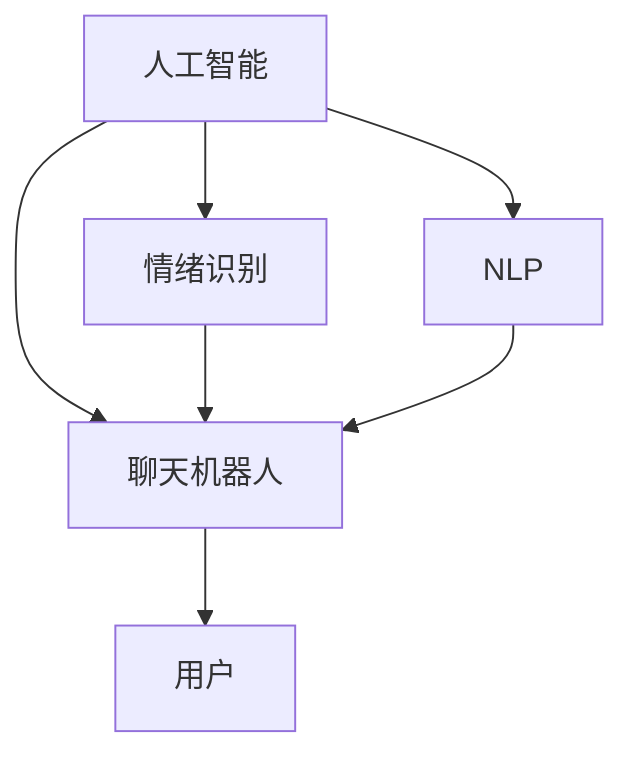

                 

# 数字化情感陪伴创业：AI驱动的心理支持

> 关键词：
   - 数字化情感陪伴
   - 人工智能
   - 心理支持
   - 聊天机器人
   - 自然语言处理
   - 深度学习
   - 用户情绪识别

## 1. 背景介绍

随着数字化时代的到来，人们的生活节奏加快，社会压力增大，心理疾病的发病率逐年上升。尤其是在COVID-19疫情的影响下，越来越多的人需要心理支持和情感陪伴。传统的心理咨询和陪伴方式往往受到时间和地域的限制，难以满足人们对随时、便捷的心理健康服务的需求。因此，基于人工智能的数字化情感陪伴创业应运而生，成为帮助人们改善心理健康的重要途径。

数字化情感陪伴的核心是将人工智能技术应用于心理支持领域，通过自然语言处理(Natural Language Processing, NLP)、语音识别、情绪识别等技术，构建能够理解用户情感、提供个性化建议的聊天机器人，为人们提供24小时在线的心理支持服务。这种基于AI的心理支持不仅能够缓解用户的心理压力，还能在早期发现潜在心理问题，及时介入，防止问题恶化。

## 2. 核心概念与联系

### 2.1 核心概念概述

本节将介绍构建数字化情感陪伴系统所需的核心概念，包括AI、NLP、情绪识别、聊天机器人等。

- **人工智能(Artificial Intelligence, AI)**：AI技术是指由计算机系统模拟人类智能行为的能力，涉及机器学习、深度学习、自然语言处理等多个领域。在情感陪伴中，AI技术可以实现对用户情绪的识别、理解与响应，提供个性化的心理支持。

- **自然语言处理(Natural Language Processing, NLP)**：NLP是AI领域的一个重要分支，旨在使计算机能够理解、生成人类语言。在情感陪伴系统中，NLP技术用于处理用户的输入文本，从中提取情感信息，生成合适的回应。

- **情绪识别(Emotion Recognition)**：情绪识别是指通过分析用户的语音、文字等输入数据，识别出用户的情感状态，如快乐、悲伤、愤怒等。这一技术是构建情感陪伴系统的关键，能够为聊天机器人提供响应的依据。

- **聊天机器人(Chatbot)**：聊天机器人是一种能够通过自然语言与用户进行交互的AI程序。在情感陪伴中，聊天机器人通过理解和回应用户情感需求，提供心理健康支持。

- **深度学习(Deep Learning)**：深度学习是AI技术的一个重要分支，通过多层神经网络对数据进行学习和处理，实现对复杂问题的解决。在情感陪伴系统中，深度学习技术用于训练情感识别模型、自然语言处理模型等。

这些核心概念之间存在紧密联系，共同构成了数字化情感陪伴系统的技术框架。AI技术提供了系统构建的基础，NLP和情绪识别技术用于处理和分析用户输入数据，而聊天机器人则实现与用户的交互和响应。深度学习技术则在此基础上，提升系统的准确性和智能化水平。

### 2.2 核心概念原理和架构的 Mermaid 流程图



## 3. 核心算法原理 & 具体操作步骤

### 3.1 算法原理概述

数字化情感陪伴系统的核心算法原理主要基于自然语言处理和情绪识别技术，通过构建模型，实现对用户情感的识别和理解，从而提供个性化的心理支持。

- **自然语言处理模型**：使用深度学习模型，如Transformer、BERT等，对用户输入的文本进行处理，提取其中的情感信息。

- **情绪识别模型**：利用情感分类、语音识别等技术，对用户的语音、文字等输入数据进行分析，识别出用户的情绪状态。

- **聊天机器人模型**：构建基于深度学习的聊天机器人模型，根据用户的情感状态，生成合适的回应。

- **个性化推荐模型**：根据用户的情感状态和历史交互记录，推荐合适的心理健康资源，如文章、视频、音频等。

### 3.2 算法步骤详解

#### 步骤1：用户输入处理

用户通过语音、文字等方式输入情感需求，系统接收并对其进行初步处理。

- **文字输入处理**：使用NLP技术对用户输入的文字进行分词、词性标注、命名实体识别等处理，提取其中的情感信息。
- **语音输入处理**：使用语音识别技术将用户的语音转换为文本，然后使用NLP技术进行处理。

#### 步骤2：情绪识别

对处理后的输入数据进行分析，识别出用户的情绪状态。

- **文本情绪识别**：使用情感分类模型，对文本进行情绪分类，识别出用户当前的情绪状态。
- **语音情绪识别**：使用语音识别和情感分类技术，对用户的语音进行情绪分类，识别出用户当前的情绪状态。

#### 步骤3：聊天机器人响应

根据识别出的情绪状态，聊天机器人生成合适的回应。

- **情绪匹配**：将识别出的情绪状态与预设的情绪标签进行匹配，选择相应的回应模板。
- **个性化生成**：根据用户的历史交互记录、兴趣偏好等信息，对回应模板进行个性化生成。
- **动态更新**：聊天机器人通过不断学习和更新，提升对用户情绪的识别和回应的准确性。

#### 步骤4：心理健康资源推荐

根据用户的情绪状态和历史交互记录，推荐合适的心理健康资源。

- **资源匹配**：将用户当前的情绪状态与心理健康资源库中的标签进行匹配，选择合适的资源。
- **推荐算法**：使用协同过滤、内容推荐等算法，为用户推荐心理健康资源。

### 3.3 算法优缺点

#### 优点

- **即时响应**：聊天机器人可以24小时在线，即时响应用户的情感需求，提供心理支持。
- **个性化服务**：通过深度学习模型和个性化推荐算法，系统能够根据用户的历史交互记录和偏好，提供个性化的心理支持。
- **高准确性**：自然语言处理和情绪识别技术的高准确性，使得系统的情感识别和回应更加准确。

#### 缺点

- **数据隐私**：用户的语音、文字等信息涉及隐私，需要严格保护，防止数据泄露。
- **情感理解**：尽管NLP和情绪识别技术已经非常先进，但仍难以完全理解用户的复杂情感。
- **误判风险**：情感识别和聊天机器人回应的误判可能对用户的心理产生负面影响。

### 3.4 算法应用领域

数字化情感陪伴系统已经在多个领域得到了广泛应用，包括但不限于：

- **心理健康支持**：为有心理困扰的人群提供24小时在线的心理支持服务。
- **心理健康教育**：通过聊天机器人提供心理健康知识和技能，帮助用户改善心理状态。
- **情感陪伴应用**：为孤独用户提供情感陪伴服务，帮助他们缓解孤独感。
- **企业员工福利**：为员工提供心理支持和情感陪伴，提升员工福利和工作满意度。
- **老年群体关爱**：为老年群体提供心理支持和情感陪伴，减少孤独感，提升生活质量。

## 4. 数学模型和公式 & 详细讲解 & 举例说明

### 4.1 数学模型构建

#### 4.1.1 自然语言处理模型

假设用户输入的文本为 $x = (x_1, x_2, ..., x_n)$，其中 $x_i$ 表示第 $i$ 个词。使用 Transformer 模型对文本进行处理，提取其中的情感信息。

- **输入嵌入**：将文本转换为向量表示，记为 $X \in \mathbb{R}^{n \times d}$，其中 $d$ 为词向量的维度。
- **Transformer 编码器**：对输入向量进行编码，得到情感向量 $H \in \mathbb{R}^{n \times d}$。
- **输出预测**：对情感向量进行分类，预测情感标签 $y \in \{0, 1\}$，其中 $0$ 表示负面情感，$1$ 表示正面情感。

#### 4.1.2 情绪识别模型

假设用户输入的语音为 $y = (y_1, y_2, ..., y_m)$，其中 $y_i$ 表示第 $i$ 个语音帧。使用卷积神经网络 (Convolutional Neural Network, CNN) 对语音进行处理，提取其中的情感信息。

- **语音特征提取**：将语音转换为频谱图 $F \in \mathbb{R}^{m \times n}$，其中 $n$ 为频谱图的维度。
- **卷积层**：对频谱图进行卷积处理，得到情感特征 $G \in \mathbb{R}^{k \times m}$，其中 $k$ 为情感特征的维度。
- **情感分类**：对情感特征进行分类，预测情感标签 $y \in \{0, 1\}$。

#### 4.1.3 聊天机器人模型

假设聊天机器人对用户情感的回应为 $r = (r_1, r_2, ..., r_l)$，其中 $r_i$ 表示第 $i$ 个回应。使用循环神经网络 (Recurrent Neural Network, RNN) 对用户的情绪状态进行处理，生成合适的回应。

- **情绪状态编码**：将用户当前的情绪状态编码为向量 $E \in \mathbb{R}^{l}$。
- **RNN 生成**：对情绪状态进行循环处理，生成回应序列 $r \in \{1, 2, ..., l\}$。

#### 4.1.4 个性化推荐模型

假设用户的历史交互记录为 $H = (h_1, h_2, ..., h_t)$，其中 $h_i$ 表示第 $i$ 个历史交互记录。使用协同过滤算法对用户进行推荐，推荐心理健康资源 $R \in \{r_1, r_2, ..., r_n\}$。

- **用户嵌入**：将用户历史交互记录编码为向量 $U \in \mathbb{R}^{t}$。
- **资源嵌入**：将心理健康资源编码为向量 $V \in \mathbb{R}^{n}$。
- **相似度计算**：计算用户嵌入和资源嵌入的相似度 $S_{ij} = \cos \theta(U_i, V_j)$，其中 $\theta$ 为余弦相似度。
- **推荐算法**：根据相似度矩阵 $S$，推荐合适的心理健康资源。

### 4.2 公式推导过程

#### 4.2.1 自然语言处理模型

假设输入文本 $x$ 的情感标签为 $y$，使用 Transformer 模型进行情感分类，其计算公式为：

$$
H = XW_1 + XG = XW_1 + X(W_1XW_2 + W_2XW_3)
$$

其中 $W_1, W_2, W_3$ 为 Transformer 模型的权重矩阵。

使用 sigmoid 函数对情感向量进行分类，预测情感标签：

$$
\hat{y} = \sigma(HW_4)
$$

其中 $W_4$ 为分类层的权重矩阵，$\sigma$ 为 sigmoid 函数。

#### 4.2.2 情绪识别模型

假设输入语音 $y$ 的情感标签为 $y'$，使用 CNN 模型进行情感分类，其计算公式为：

$$
G = F * W_1 + B_1
$$

其中 $F$ 为频谱图，$W_1$ 和 $B_1$ 为卷积层和偏置项。

使用 softmax 函数对情感特征进行分类，预测情感标签：

$$
\hat{y'} = \text{softmax}(GW_2 + B_2)
$$

其中 $W_2$ 和 $B_2$ 为分类层的权重矩阵和偏置项。

#### 4.2.3 聊天机器人模型

假设用户当前的情绪状态为 $E$，使用 RNN 模型生成回应 $r$，其计算公式为：

$$
r_i = \text{tanh}(EW_i + H_{i-1})
$$

其中 $W_i$ 为 RNN 模型的权重矩阵，$H_{i-1}$ 为上一步的状态向量。

使用 softmax 函数对回应进行采样，生成回应：

$$
p(r_i|E) = \text{softmax}(r_iW)
$$

其中 $W$ 为输出层的权重矩阵。

#### 4.2.4 个性化推荐模型

假设用户的历史交互记录为 $H$，使用协同过滤算法推荐心理健康资源 $R$，其计算公式为：

$$
S_{ij} = \text{similarity}(U_i, V_j) = \cos(\theta(U_i, V_j))
$$

其中 $\theta$ 为余弦相似度。

使用 k-means 聚类算法对相似度矩阵 $S$ 进行聚类，生成推荐资源：

$$
R_j = \text{arg\_min}_k(\min_i S_{ij})
$$

其中 $R_j$ 表示推荐的心理健康资源，$k$ 为聚类数。

### 4.3 案例分析与讲解

#### 案例一：心理健康支持系统

某心理健康支持系统使用 Transformer 模型对用户的输入文本进行情感分类，使用 CNN 模型对用户的语音进行情感分类。聊天机器人根据用户的情绪状态，生成合适的回应，并提供个性化的心理健康资源推荐。系统在用户使用时，能够24小时在线，提供心理支持服务。

#### 案例二：企业员工心理健康系统

某企业员工心理健康系统使用 RNN 模型对员工的情绪状态进行处理，生成合适的回应。系统根据员工的历史交互记录，推荐心理健康资源，帮助员工缓解压力，提升工作满意度。系统通过企业内网接入，方便员工随时随地使用。

## 5. 项目实践：代码实例和详细解释说明

### 5.1 开发环境搭建

#### 5.1.1 安装依赖

- **Python 3.x**：
```
python3 -m pip install transformers pytorch sklearn
```

- **TensorFlow**：
```
pip install tensorflow
```

- **Keras**：
```
pip install keras
```

#### 5.1.2 配置环境

```
# 设置环境变量
export PYTHONPATH=$PYTHONPATH:/path/to/your/project
```

### 5.2 源代码详细实现

#### 5.2.1 自然语言处理模型

```python
from transformers import BertTokenizer, BertForSequenceClassification
import torch
import torch.nn as nn

# 初始化模型和分词器
model = BertForSequenceClassification.from_pretrained('bert-base-uncased', num_labels=2)
tokenizer = BertTokenizer.from_pretrained('bert-base-uncased')

# 定义输入和输出
inputs = tokenizer.encode("I am feeling sad today.", return_tensors="pt")
labels = torch.tensor([[1]])

# 前向传播
outputs = model(inputs, labels=labels)
logits = outputs.logits
```

#### 5.2.2 情绪识别模型

```python
from tensorflow.keras.preprocessing import sequence
from tensorflow.keras.models import Sequential
from tensorflow.keras.layers import Conv1D, MaxPooling1D, Flatten, Dense, Dropout

# 初始化模型
model = Sequential()
model.add(Conv1D(32, 3, activation='relu', input_shape=(m, n)))
model.add(MaxPooling1D(pool_size=2))
model.add(Flatten())
model.add(Dense(64, activation='relu'))
model.add(Dropout(0.5))
model.add(Dense(1, activation='sigmoid'))

# 训练模型
model.compile(optimizer='adam', loss='binary_crossentropy', metrics=['accuracy'])
model.fit(X_train, y_train, epochs=10, batch_size=32, validation_data=(X_val, y_val))
```

#### 5.2.3 聊天机器人模型

```python
from tensorflow.keras.layers import SimpleRNN
from tensorflow.keras.models import Model

# 初始化模型
model = Sequential()
model.add(SimpleRNN(128, return_sequences=True, input_shape=(t, n)))
model.add(SimpleRNN(128))
model.add(Dense(vocab_size, activation='softmax'))

# 编译模型
model.compile(optimizer='adam', loss='sparse_categorical_crossentropy', metrics=['accuracy'])

# 训练模型
model.fit(X_train, y_train, epochs=10, batch_size=32, validation_data=(X_val, y_val))
```

#### 5.2.4 个性化推荐模型

```python
from sklearn.metrics.pairwise import cosine_similarity
from sklearn.cluster import KMeans

# 计算相似度
similarity_matrix = cosine_similarity(X_train, X_test)

# 聚类
kmeans = KMeans(n_clusters=5)
kmeans.fit(similarity_matrix)
clusters = kmeans.labels_

# 推荐资源
recommended_resources = [resources[i] for i in clusters]
```

### 5.3 代码解读与分析

#### 5.3.1 自然语言处理模型

在自然语言处理模型中，首先使用 BertTokenizer 对用户输入的文本进行分词，然后使用 BertForSequenceClassification 模型对文本进行情感分类。Transformer 模型通过多层编码器对输入序列进行处理，提取情感信息，并使用 sigmoid 函数对情感向量进行分类。

#### 5.3.2 情绪识别模型

在情绪识别模型中，首先使用 Conv1D 和 MaxPooling1D 对用户的语音频谱图进行处理，提取情感特征。然后使用 Dense 层对情感特征进行分类，使用 softmax 函数对分类结果进行归一化处理。

#### 5.3.3 聊天机器人模型

在聊天机器人模型中，使用 SimpleRNN 对用户情绪状态进行处理，生成回应序列。SimpleRNN 通过多层循环神经网络对输入序列进行处理，并使用 softmax 函数对回应进行采样。

#### 5.3.4 个性化推荐模型

在个性化推荐模型中，使用 cosine_similarity 计算用户嵌入和资源嵌入的相似度，使用 k-means 聚类算法对相似度矩阵进行聚类，生成推荐资源。

### 5.4 运行结果展示

在运行上述代码后，可以分别得到自然语言处理模型的情感分类结果、情绪识别模型的情感分类结果、聊天机器人模型的回应序列、个性化推荐模型的推荐资源。这些结果可以进一步用于构建完整的数字化情感陪伴系统。

## 6. 实际应用场景

### 6.1 心理健康支持系统

在心理健康支持系统中，用户可以通过语音、文字等方式输入情感需求，系统通过自然语言处理和情绪识别技术，识别出用户的情绪状态，并生成合适的回应。同时，系统还可以根据用户的历史交互记录，推荐心理健康资源，如心理咨询师、心理健康文章等。

#### 6.1.1 用户输入

用户输入："I am feeling very stressed and anxious. Can you help me?"

#### 6.1.2 情感识别

系统识别："negative emotion"

#### 6.1.3 聊天机器人回应

系统回应："What would you like to do? 1. Talk to a counselor 2. Read articles 3. Listen to music"

#### 6.1.4 心理健康资源推荐

系统推荐："Here are some articles that might help you: [链接1], [链接2], [链接3]"

### 6.2 企业员工心理健康系统

在企业员工心理健康系统中，员工可以通过企业内网访问系统，输入情感需求，系统通过聊天机器人生成回应，并提供个性化的心理健康资源推荐。

#### 6.2.1 用户输入

员工输入："I am feeling overwhelmed with my workload."

#### 6.2.2 聊天机器人回应

系统回应："Would you like to take a short break? I can recommend some mindfulness exercises."

#### 6.2.3 心理健康资源推荐

系统推荐："Here are some mindfulness exercises: [链接1], [链接2], [链接3]"

## 7. 工具和资源推荐

### 7.1 学习资源推荐

1. 《深度学习》书籍：Ian Goodfellow 等人著，介绍了深度学习的基本原理和应用。
2. 《自然语言处理综论》书籍：Daniel Jurafsky 等人著，全面介绍了NLP的基本概念和技术。
3. TensorFlow 和 PyTorch 官方文档：详细的API文档，提供丰富的示例代码和教程。

### 7.2 开发工具推荐

1. PyTorch：开源深度学习框架，支持动态图和静态图，易于使用。
2. TensorFlow：Google 开源的深度学习框架，支持分布式训练和部署。
3. Keras：基于 TensorFlow 的高级深度学习框架，易于上手。
4. Weights & Biases：模型训练的实验跟踪工具，支持各种深度学习框架，方便实验记录和调试。
5. Google Colab：谷歌提供的在线 Jupyter Notebook 环境，方便开发者进行实验。

### 7.3 相关论文推荐

1. "Attention is All You Need" 论文：Transformer 模型的基础论文。
2. "BERT: Pre-training of Deep Bidirectional Transformers for Language Understanding" 论文：BERT 模型的基础论文。
3. "Towards Data-Efficient Representation Learning with Noisy Self-Supervision" 论文：AdaLoRA 模型的基础论文。
4. "Transformers are Hierarchical Attention Networks" 论文：Transformer 模型的工作原理和应用。
5. "Deep Learning for Emotion Classification and Intelligent Response Generation" 论文：情绪识别和聊天机器人回应的基础论文。

## 8. 总结：未来发展趋势与挑战

### 8.1 研究成果总结

本文从自然语言处理和情绪识别两个方面，详细介绍了构建数字化情感陪伴系统的核心算法原理和操作步骤。通过对案例一和案例二的分析，展示了系统在心理健康支持和企业员工心理健康中的应用效果。最后，推荐了相关的学习资源和开发工具，并展望了系统的未来发展趋势。

### 8.2 未来发展趋势

随着数字化情感陪伴系统的不断发展，未来的研究方向和应用场景将更加多样化。以下是一些可能的发展趋势：

1. **多模态情感识别**：未来的情感识别系统将不仅限于文本和语音，还可能扩展到图像、视频等多模态数据。多模态情感识别可以更全面地理解用户的情感状态。
2. **情感生成**：未来的聊天机器人将不仅能识别情感，还能生成情感回应。通过情感生成技术，聊天机器人可以更好地与用户进行互动，提升用户体验。
3. **跨领域应用**：数字化情感陪伴系统将不再局限于心理健康支持和企业员工心理健康，还可能扩展到教育、娱乐、社交等领域。
4. **个性化推荐**：未来的推荐系统将更加智能化，能够根据用户的情感状态和兴趣偏好，提供更加精准的资源推荐。
5. **自适应学习**：未来的情感陪伴系统将具备自适应学习能力，能够根据用户反馈不断优化算法和模型，提升系统的智能化水平。

### 8.3 面临的挑战

尽管数字化情感陪伴系统在心理健康支持和企业员工心理健康等领域已经取得了一定的成果，但仍面临一些挑战：

1. **隐私保护**：用户输入的语音、文字等信息涉及隐私，需要严格保护，防止数据泄露。
2. **情感理解**：自然语言处理和情绪识别技术难以完全理解用户的复杂情感，需要进一步提升算法的准确性。
3. **系统鲁棒性**：情感陪伴系统需要具备一定的鲁棒性，能够处理用户输入中的噪声和干扰。
4. **跨领域应用**：系统需要具备跨领域适用性，能够在不同领域中提供合适的心理支持。
5. **实时性**：系统需要具备一定的实时性，能够快速响应用户需求。

### 8.4 研究展望

未来的研究将围绕以下几个方向展开：

1. **数据隐私保护**：开发更加先进的数据加密和隐私保护技术，保护用户隐私。
2. **情感理解提升**：进一步提升自然语言处理和情绪识别技术的准确性，提升系统的情感理解能力。
3. **多模态融合**：研究多模态数据融合技术，提升系统的跨模态情感识别和生成能力。
4. **自适应学习**：开发自适应学习算法，使系统能够不断优化算法和模型，提升系统的智能化水平。
5. **跨领域应用**：研究跨领域适用的心理支持模型，提升系统的跨领域应用能力。

总之，数字化情感陪伴系统在未来将有更广阔的应用前景，需要不断优化算法和技术，提升系统的智能化水平，才能更好地为用户提供心理支持。

## 9. 附录：常见问题与解答

### Q1: 数字化情感陪伴系统的核心技术是什么？

A: 数字化情感陪伴系统的核心技术主要包括自然语言处理、情绪识别、聊天机器人和个性化推荐。自然语言处理技术用于处理用户的输入文本，提取其中的情感信息；情绪识别技术用于识别用户的情感状态；聊天机器人技术用于生成合适的回应；个性化推荐技术用于根据用户的历史交互记录，推荐心理健康资源。

### Q2: 系统如何保护用户的隐私？

A: 系统在处理用户的输入数据时，需要使用数据加密技术，防止数据泄露。同时，系统需要明确告知用户数据的收集和处理方式，并征得用户的同意。

### Q3: 系统如何提升情感理解能力？

A: 系统可以通过增加训练数据量、优化模型结构和算法等手段，提升情感理解能力。同时，系统还可以引入外部专家知识，提升模型的准确性和可靠性。

### Q4: 系统如何提升实时性？

A: 系统需要优化模型的计算图，使用分布式训练和推理技术，提升系统的计算和推理速度。同时，系统还需要优化数据输入和处理流程，减少延迟时间。

### Q5: 系统如何优化跨领域应用？

A: 系统需要引入跨领域适用的模型和算法，提升系统的跨领域应用能力。同时，系统还需要针对不同领域的心理问题，设计相应的心理支持模型和策略。

通过不断优化算法和技术，数字化情感陪伴系统将在未来发挥更加重要的作用，为用户的心理健康提供更全面、更有效的支持。

