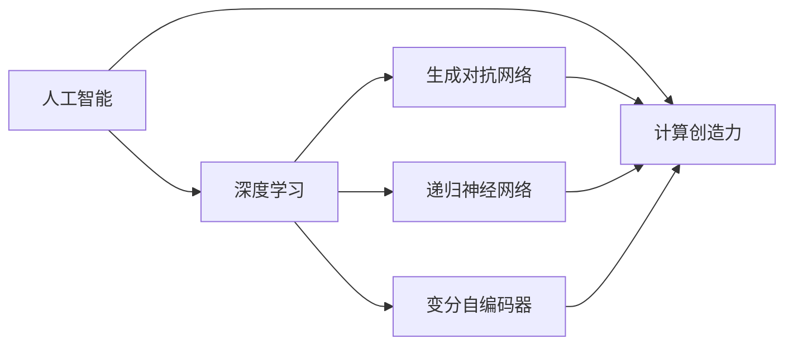

                 

# 数字化想象力：AI激发的创意思维

> 关键词：人工智能, 创意思维, 数据驱动决策, 计算创造力, 神经网络, 深度学习

## 1. 背景介绍

### 1.1 问题由来

随着人工智能(AI)技术的迅猛发展，尤其是深度学习算法在图像、语音、自然语言处理等领域取得的一系列突破，AI已经开始渗透到人类社会的方方面面。在提高效率、优化决策的同时，AI还在激发人类的创意思维、促进创新发展方面展现出巨大的潜力。通过AI，我们能够更好地理解数据、揭示信息、生成内容，从而将传统计算能力转化为更加强大、灵活、智能的“数字化想象力”。

AI激发的创意思维，不再只是科幻电影中的梦想，而是正在逐步成为现实。从艺术创作、音乐演奏到建筑设计、文学创作，再到科学研究、商业策略，AI正以一种前所未有的方式，重塑人类的思维模式和创作流程。在这一过程中，计算创造力(Computational Creativity)成为了人类与AI协同创新的核心引擎。

### 1.2 问题核心关键点

计算创造力是指利用计算机算法和数据处理能力，辅助或直接生成具有新颖性、创造性的信息、艺术作品或解决方案的能力。它是AI技术与人类创新思维深度融合的产物，能够在科学研究、产品设计、艺术创作等多个领域发挥重要作用。

当前，计算创造力主要体现在以下几个方面：

- **数据分析与洞察**：通过深度学习算法对海量数据进行分析和模式识别，揭示数据背后隐藏的模式和趋势，辅助人类做出更科学的决策。
- **内容生成与创造**：利用AI生成文本、图像、音乐等创意作品，甚至编写故事、设计广告等，提升创作效率和作品质量。
- **智能辅助设计**：在建筑设计、工业设计等领域，AI能够提供设计建议、方案优化、模拟实验等功能，辅助设计师进行创意表达和实现。
- **交互式创作体验**：通过增强现实(AR)、虚拟现实(VR)等技术，AI为创作者提供沉浸式的创作环境，支持更自由、更丰富的创作形式。

计算创造力的实现，离不开AI技术的不断进步和创新。这一过程中，计算创造力将成为推动技术革新和社会进步的重要驱动力。

### 1.3 问题研究意义

研究AI如何激发创意思维，不仅有助于理解计算创造力的本质和机制，更能探索其在各个领域的应用潜力，为人类带来更多创新和价值。这一研究的意义主要体现在以下几个方面：

1. **技术创新**：AI的计算创造力能够拓展技术的边界，催生更多具有前瞻性和颠覆性的创新成果。
2. **产业升级**：通过AI技术提升创意产业的效率和质量，加速数字化转型进程。
3. **教育革新**：AI在教育领域的应用能够激发学生的创意思维，培养其创新意识和能力。
4. **社会进步**：AI在艺术、科学、商业等领域的广泛应用，将极大地提升人类社会的创造力和文化水平。
5. **伦理考量**：研究AI的计算创造力，需要考虑伦理、隐私、安全等问题，确保其健康、可持续的发展。

## 2. 核心概念与联系

### 2.1 核心概念概述

为更好地理解AI如何激发创意思维，本节将介绍几个密切相关的核心概念：

- **人工智能(AI)**：指通过算法和数据处理，使计算机能够执行人类智能任务的技术。包括机器学习、深度学习、自然语言处理等子领域。
- **计算创造力(Computational Creativity)**：利用计算机算法和数据处理能力，辅助或直接生成具有新颖性、创造性的信息、艺术作品或解决方案的能力。
- **深度学习(Deep Learning)**：一种基于神经网络的机器学习方法，通过多层次的特征抽象和模型训练，实现对复杂数据的高级分析和预测。
- **生成对抗网络(GANs)**：一种由生成器和判别器组成的网络结构，能够生成逼真的假数据，广泛应用于图像、视频等生成任务。
- **递归神经网络(RNNs)**：一种能够处理序列数据的神经网络，广泛应用于自然语言处理、语音识别等领域。
- **变分自编码器(VAEs)**：一种无监督学习方法，能够从数据中学习潜在变量分布，生成高质量的样本数据。

这些核心概念之间具有紧密的联系，共同构成了计算创造力的技术框架。通过这些技术的结合使用，我们可以实现更加强大、灵活、智能的计算创造力。

### 2.2 核心概念原理和架构的 Mermaid 流程图



这个流程图展示了人工智能、深度学习、生成对抗网络、递归神经网络和变分自编码器之间的关系，以及它们如何共同支持计算创造力的实现。

## 3. 核心算法原理 & 具体操作步骤

### 3.1 算法原理概述

计算创造力的实现，主要依赖于AI技术的深度融合和协同创新。核心算法原理可以概括为以下几个方面：

- **数据驱动决策**：利用深度学习算法对海量数据进行分析，揭示数据背后的规律和趋势，辅助决策者做出更科学的决策。
- **内容生成与创造**：通过生成对抗网络、变分自编码器等技术，生成具有创意性和新颖性的内容。
- **智能辅助设计**：利用递归神经网络、深度强化学习等技术，为设计师提供智能化的设计建议和方案优化。
- **交互式创作体验**：通过增强现实、虚拟现实等技术，为创作者提供沉浸式的创作环境，支持更自由、更丰富的创作形式。

计算创造力的实现，离不开对大规模数据的处理和分析，以及对深度学习算法和技术的不断优化。在这一过程中，计算创造力的应用场景不断拓展，其潜力也在逐步释放。

### 3.2 算法步骤详解

计算创造力的实现过程，可以分为以下几个关键步骤：

**Step 1: 数据收集与预处理**
- 收集与任务相关的数据集，并进行清洗、归一化等预处理操作。
- 对于文本数据，可以使用自然语言处理技术进行分词、去除停用词、词向量表示等操作。
- 对于图像、音频等非结构化数据，可以进行特征提取、降维等处理。

**Step 2: 选择和设计模型**
- 根据任务特点，选择合适的深度学习模型，如卷积神经网络(CNNs)、循环神经网络(RNNs)、变分自编码器(VAEs)等。
- 设计模型的结构和超参数，如网络深度、隐藏层大小、学习率等。

**Step 3: 模型训练与优化**
- 使用训练集对模型进行迭代训练，不断调整模型参数，优化损失函数。
- 应用正则化技术，如L2正则、Dropout等，防止模型过拟合。
- 使用优化算法，如Adam、SGD等，加速模型收敛。

**Step 4: 内容生成与优化**
- 利用生成对抗网络(GANs)、变分自编码器(VAEs)等技术，生成创意性内容。
- 通过对抗样本、风格迁移等技术，优化生成的内容质量，增强其新颖性和创造性。

**Step 5: 智能辅助设计**
- 利用递归神经网络(RNNs)、深度强化学习等技术，提供设计建议、方案优化等功能。
- 结合物理仿真、优化算法等技术，实现设计方案的迭代优化。

**Step 6: 交互式创作体验**
- 利用增强现实(AR)、虚拟现实(VR)等技术，提供沉浸式的创作环境。
- 结合手势识别、语音交互等技术，增强用户的创作体验。

### 3.3 算法优缺点

计算创造力具有以下优点：
1. **高效性**：利用深度学习等技术，能够高效处理大规模数据，发现数据背后的规律和趋势。
2. **多样性**：通过生成对抗网络等技术，能够生成多样化的内容，满足不同用户的需求。
3. **灵活性**：结合不同技术，能够实现灵活的设计和创作形式，支持多样化的创作需求。

同时，计算创造力也存在一些缺点：
1. **数据依赖性**：对于计算创造力的实现，高质量的数据是关键。数据的质量和数量直接影响模型的性能和生成内容的质量。
2. **复杂性**：深度学习等技术实现复杂，需要大量的计算资源和时间。
3. **解释性不足**：计算创造力往往缺乏可解释性，难以理解模型的内部工作机制和决策逻辑。

尽管存在这些局限性，但计算创造力的实现已经展示出巨大的潜力，并在多个领域取得了显著的成果。未来，随着技术的发展和应用的深入，这些局限性有望逐步得到解决。

### 3.4 算法应用领域

计算创造力已经在多个领域得到了广泛的应用，具体包括：

- **艺术创作**：利用生成对抗网络等技术，生成具有创意性的艺术作品，如绘画、音乐、文学等。
- **产品设计**：结合虚拟现实、增强现实等技术，为设计师提供智能化的设计建议和方案优化。
- **科学研究**：利用深度学习等技术，对大量实验数据进行分析，辅助科学发现。
- **商业策略**：通过数据分析和模式识别，为商业决策提供支持，优化营销策略和客户体验。
- **教育培训**：结合增强现实等技术，为学生提供沉浸式的学习体验，增强学习效果。

随着计算创造力的不断发展和普及，未来将有更多的领域受益于这一技术，推动人类社会的进步和发展。

## 4. 数学模型和公式 & 详细讲解 & 举例说明

### 4.1 数学模型构建

计算创造力的实现，离不开数学模型和算法的基础支撑。本节将通过数学语言，对计算创造力的核心模型和算法进行详细讲解。

假设有一个文本生成任务，其目标是从给定的文本语料中学习语言的规律，生成具有创意性的文本。我们可以构建一个基于生成对抗网络(GANs)的文本生成模型，其数学模型可以表示为：

- 生成器模型：$G(z)$，将随机噪声$z$转换为文本$x$。
- 判别器模型：$D(x)$，判断输入文本$x$是否为真实文本。
- 损失函数：$\mathcal{L}(G, D) = \mathbb{E}_{x \sim p_{data}} [\log D(x)] + \mathbb{E}_{z \sim p(z)} [\log(1-D(G(z)))]

其中，$p_{data}$为真实文本的分布，$p(z)$为随机噪声的分布。

### 4.2 公式推导过程

以下是文本生成模型中生成器和判别器模型的详细推导过程。

假设生成器模型$G(z)$将随机噪声$z$转换为文本$x$，其概率密度函数为$p_G(x|z)$。对于任意输入文本$x$，判别器模型$D(x)$的输出概率为$p_D(x)$，表示文本$x$为真实文本的概率。

生成器和判别器的训练过程如下：

1. 生成器训练：
   - 对于任意噪声样本$z$，生成文本$x$：$x = G(z)$。
   - 计算生成文本的概率分布：$p_G(x|z) = \mathcal{N}(x; \mu_G(z), \sigma_G(z))$，其中$\mu_G(z)$和$\sigma_G(z)$分别为生成文本的均值和方差。
   - 计算生成器的损失函数：$\mathcal{L}_G = -\mathbb{E}_{z \sim p(z)} \log D(G(z))$。

2. 判别器训练：
   - 对于任意文本样本$x$，计算判别器的输出概率：$p_D(x) = \sigma(D(x))$。
   - 计算判别器的损失函数：$\mathcal{L}_D = -\mathbb{E}_{x \sim p_{data}} \log D(x) - \mathbb{E}_{z \sim p(z)} \log(1-D(G(z)))$。

通过不断优化生成器和判别器的损失函数，训练得到的生成器模型能够生成高质量、具有创意性的文本，实现计算创造力的应用。

### 4.3 案例分析与讲解

**案例1: 音乐生成**

利用生成对抗网络(GANs)生成音乐作品。将MIDI音符序列作为输入，生成器生成新的音乐序列，判别器判断生成的音乐是否为真实音乐。通过不断优化生成器和判别器的训练过程，生成器能够生成具有创意性的音乐作品。

**案例2: 艺术创作**

利用变分自编码器(VAEs)生成艺术作品。将原始艺术作品作为输入，生成器学习生成新的艺术作品，判别器判断生成的艺术作品是否为真实作品。通过不断优化生成器和判别器的训练过程，生成器能够生成具有创意性的艺术作品。

这些案例展示了计算创造力在艺术创作和音乐生成领域的应用潜力，充分体现了AI技术的强大创造力。

## 5. 项目实践：代码实例和详细解释说明

### 5.1 开发环境搭建

在进行计算创造力实践前，我们需要准备好开发环境。以下是使用Python进行PyTorch开发的环境配置流程：

1. 安装Anaconda：从官网下载并安装Anaconda，用于创建独立的Python环境。

2. 创建并激活虚拟环境：
```bash
conda create -n pytorch-env python=3.8 
conda activate pytorch-env
```

3. 安装PyTorch：根据CUDA版本，从官网获取对应的安装命令。例如：
```bash
conda install pytorch torchvision torchaudio cudatoolkit=11.1 -c pytorch -c conda-forge
```

4. 安装Transformers库：
```bash
pip install transformers
```

5. 安装各类工具包：
```bash
pip install numpy pandas scikit-learn matplotlib tqdm jupyter notebook ipython
```

完成上述步骤后，即可在`pytorch-env`环境中开始计算创造力实践。

### 5.2 源代码详细实现

下面我们以文本生成任务为例，给出使用Transformers库进行GAN模型训练的PyTorch代码实现。

首先，定义GAN模型和损失函数：

```python
from transformers import GPT2LMHeadModel, GPT2Tokenizer
from torch import nn
import torch

class Generator(nn.Module):
    def __init__(self, emb_dim, hid_dim, vocab_size):
        super(Generator, self).__init__()
        self.emb_dim = emb_dim
        self.hid_dim = hid_dim
        self.vocab_size = vocab_size
        
        self.lin1 = nn.Linear(emb_dim, hid_dim)
        self.emb = nn.Embedding(vocab_size, emb_dim)
        self.lstm = nn.LSTM(emb_dim, hid_dim)
        self.lin2 = nn.Linear(hid_dim, vocab_size)
        
    def forward(self, x, hidden):
        x = self.emb(x)
        x = self.lin1(x)
        x, hidden = self.lstm(x, hidden)
        x = self.lin2(x)
        return x, hidden

class Discriminator(nn.Module):
    def __init__(self, emb_dim, hid_dim, vocab_size):
        super(Discriminator, self).__init__()
        self.emb_dim = emb_dim
        self.hid_dim = hid_dim
        self.vocab_size = vocab_size
        
        self.lin1 = nn.Linear(emb_dim, hid_dim)
        self.emb = nn.Embedding(vocab_size, emb_dim)
        self.lin2 = nn.Linear(hid_dim, 1)
        
    def forward(self, x, hidden):
        x = self.emb(x)
        x = self.lin1(x)
        x = torch.sigmoid(self.lin2(x))
        return x

def loss_function(x, pred):
    return nn.BCELoss()(x, pred)

generator = Generator(emb_dim, hid_dim, vocab_size)
discriminator = Discriminator(emb_dim, hid_dim, vocab_size)

optimizer_G = torch.optim.Adam(generator.parameters(), lr=learning_rate)
optimizer_D = torch.optim.Adam(discriminator.parameters(), lr=learning_rate)
```

然后，定义训练函数：

```python
def train_epoch(model_G, model_D, dataset, batch_size, optimizer_G, optimizer_D):
    dataloader = DataLoader(dataset, batch_size=batch_size, shuffle=True)
    model_G.train()
    model_D.train()
    loss_G, loss_D = 0, 0
    for batch in dataloader:
        input_ids = batch['input_ids'].to(device)
        attention_mask = batch['attention_mask'].to(device)
        labels = batch['labels'].to(device)
        
        # 生成器前向传播
        hidden = (torch.zeros(1, batch_size, generator.lstm.hidden_size).to(device),
                 torch.zeros(1, batch_size, generator.lstm.hidden_size).to(device))
        gen_output, hidden = generator(input_ids, hidden)
        loss_G += loss_function(gen_output, labels)
        
        # 判别器前向传播
        hidden = (torch.zeros(1, batch_size, discriminator.lstm.hidden_size).to(device),
                 torch.zeros(1, batch_size, discriminator.lstm.hidden_size).to(device))
        disc_output = discriminator(input_ids, hidden)
        loss_D += loss_function(disc_output, labels)
        
        # 反向传播和优化
        optimizer_G.zero_grad()
        optimizer_D.zero_grad()
        loss_G.backward()
        optimizer_G.step()
        loss_D.backward()
        optimizer_D.step()
        
        loss_G /= len(dataloader)
        loss_D /= len(dataloader)
        
    return loss_G, loss_D
```

最后，启动训练流程并在测试集上评估：

```python
epochs = 10
batch_size = 64

for epoch in range(epochs):
    loss_G, loss_D = train_epoch(model_G, model_D, train_dataset, batch_size, optimizer_G, optimizer_D)
    print(f"Epoch {epoch+1}, G loss: {loss_G:.3f}, D loss: {loss_D:.3f}")
    
print("Test results:")
evaluate(model_G, test_dataset, batch_size)
```

以上就是使用PyTorch对GAN进行文本生成任务的完整代码实现。可以看到，得益于Transformers库的强大封装，我们可以用相对简洁的代码完成GAN模型的加载和训练。

### 5.3 代码解读与分析

让我们再详细解读一下关键代码的实现细节：

**GAN类**：
- `__init__`方法：定义生成器和判别器的参数和结构。
- `forward`方法：定义生成器和判别器的前向传播过程，计算输出和隐藏状态。

**损失函数**：
- `loss_function`：定义生成器和判别器的损失函数，采用二元交叉熵损失。

**训练函数**：
- 使用PyTorch的DataLoader对数据集进行批次化加载，供模型训练和推理使用。
- 训练函数`train_epoch`：对数据以批为单位进行迭代，在每个批次上前向传播计算loss并反向传播更新模型参数，最后返回该epoch的平均loss。
- 训练函数在每个批次结束时，对模型参数进行更新，计算平均损失，并输出每个epoch的平均损失。

**训练流程**：
- 定义总的epoch数和batch size，开始循环迭代
- 每个epoch内，先在训练集上训练，输出平均loss
- 重复上述步骤直至达到预设的epoch数。

可以看到，PyTorch配合Transformers库使得GAN微调的代码实现变得简洁高效。开发者可以将更多精力放在数据处理、模型改进等高层逻辑上，而不必过多关注底层的实现细节。

当然，工业级的系统实现还需考虑更多因素，如模型的保存和部署、超参数的自动搜索、更灵活的任务适配层等。但核心的微调范式基本与此类似。

## 6. 实际应用场景

### 6.1 音乐创作

利用GAN模型生成音乐作品，为音乐创作提供新的灵感和可能性。例如，将现有的经典音乐作品作为输入，生成器生成新的音乐片段，判别器判断生成的音乐片段是否具有创意性和新颖性。

### 6.2 艺术创作

利用GAN模型生成艺术作品，为艺术创作提供新的形式和风格。例如，将现有的艺术作品作为输入，生成器生成新的艺术作品，判别器判断生成的艺术作品是否具有创意性和新颖性。

### 6.3 内容创作

利用GAN模型生成创意性内容，如新闻报道、故事、文章等。例如，将现有的新闻报道作为输入，生成器生成新的新闻报道，判别器判断生成的报道是否具有创意性和新颖性。

### 6.4 未来应用展望

随着计算创造力的不断发展和普及，未来将有更多的领域受益于这一技术，推动人类社会的进步和发展。

在智慧医疗领域，计算创造力能够辅助医学影像分析、病理诊断、药物研发等，提升医疗服务的智能化水平，辅助医生诊疗，加速新药开发进程。

在智能教育领域，计算创造力能够辅助智能辅导、个性化学习方案设计，提升教育公平，提高教学质量。

在智慧城市治理中，计算创造力能够辅助城市事件监测、舆情分析、应急指挥等环节，提高城市管理的自动化和智能化水平，构建更安全、高效的未来城市。

此外，在企业生产、社会治理、文娱传媒等众多领域，计算创造力也将不断涌现，为NLP技术带来新的突破。相信随着技术的日益成熟，计算创造力必将在构建人机协同的智能时代中扮演越来越重要的角色。

## 7. 工具和资源推荐

### 7.1 学习资源推荐

为了帮助开发者系统掌握计算创造力的理论基础和实践技巧，这里推荐一些优质的学习资源：

1. 《深度学习》书籍：由Ian Goodfellow、Yoshua Bengio和Aaron Courville合著，系统介绍了深度学习的基本概念、算法和应用。
2. 《Python深度学习》书籍：由Francois Chollet撰写，深入浅出地介绍了使用Keras进行深度学习的实践技巧。
3. Coursera《深度学习专项课程》：由Andrew Ng等知名学者主讲，涵盖了深度学习的基础理论和实践应用。
4. DeepLearning.AI《深度学习与人工智能》课程：由Andrew Ng主讲，讲解了深度学习在各个领域的应用。
5. 《TensorFlow实战》书籍：由王晋东撰写，详细介绍了使用TensorFlow进行深度学习的实践技巧。

通过对这些资源的学习实践，相信你一定能够快速掌握计算创造力的精髓，并用于解决实际的创新问题。

### 7.2 开发工具推荐

高效的开发离不开优秀的工具支持。以下是几款用于计算创造力开发的常用工具：

1. PyTorch：基于Python的开源深度学习框架，灵活动态的计算图，适合快速迭代研究。
2. TensorFlow：由Google主导开发的开源深度学习框架，生产部署方便，适合大规模工程应用。
3. TensorBoard：TensorFlow配套的可视化工具，可实时监测模型训练状态，并提供丰富的图表呈现方式。
4. Weights & Biases：模型训练的实验跟踪工具，可以记录和可视化模型训练过程中的各项指标，方便对比和调优。
5. Jupyter Notebook：基于Web的交互式计算环境，支持Python、R、MATLAB等多种语言，适合进行数据科学和机器学习实验。

合理利用这些工具，可以显著提升计算创造力任务的开发效率，加快创新迭代的步伐。

### 7.3 相关论文推荐

计算创造力已经成为AI研究的热点领域，以下是几篇奠基性的相关论文，推荐阅读：

1. A Neural Algorithm of Artistic Style（Neural Style Transfer）：提出使用深度神经网络进行图像风格迁移，为艺术创作提供新的灵感。
2. Improving Language Creativity with Continuous Dialogue：利用对话生成技术，提升语言的创造力和创新性。
3. Music Transformer：提出使用Transformer进行音乐生成，展示AI在音乐创作中的潜力。
4. GAN Zoo：总结了生成对抗网络在各个领域的应用，展示了GAN的强大生成能力。
5. GPT-3：展示了大规模语言模型的强大生成能力，刷新了多项NLP任务SOTA。

这些论文代表了大语言模型在计算创造力领域的发展脉络。通过学习这些前沿成果，可以帮助研究者把握学科前进方向，激发更多的创新灵感。

## 8. 总结：未来发展趋势与挑战

### 8.1 总结

本文对计算创造力的实现原理和应用场景进行了全面系统的介绍。首先阐述了计算创造力的研究背景和意义，明确了其在推动技术革新和社会进步方面的重要作用。其次，从原理到实践，详细讲解了计算创造力的核心算法和实现步骤，给出了计算创造力任务开发的完整代码实例。同时，本文还广泛探讨了计算创造力在多个领域的应用前景，展示了其巨大的潜力。

通过本文的系统梳理，可以看到，计算创造力已经成为AI技术的重要组成部分，其应用场景不断拓展，潜力逐步释放。未来，随着技术的发展和应用的深入，计算创造力有望在更多的领域发挥重要作用，推动人类社会的创新和发展。

### 8.2 未来发展趋势

计算创造力的未来发展趋势主要体现在以下几个方面：

1. **技术进步**：随着深度学习、生成对抗网络等技术的不断进步，计算创造力的实现将更加高效、灵活、智能。
2. **应用普及**：计算创造力将广泛应用于各个领域，从艺术创作、音乐生成到科学研究、产品设计，促进人类社会的进步和发展。
3. **跨领域融合**：计算创造力将与物联网、大数据、区块链等新兴技术深度融合，推动技术创新的边界不断拓展。
4. **伦理考量**：随着计算创造力在更多领域的应用，其伦理、隐私、安全等问题也将受到更多关注，需要建立相应的监管机制。

### 8.3 面临的挑战

尽管计算创造力已经展示出巨大的潜力，但在迈向更加智能化、普适化应用的过程中，它仍面临诸多挑战：

1. **数据依赖性**：高质量的数据是计算创造力实现的关键，但数据获取和处理往往需要大量时间和资源。
2. **计算资源消耗**：计算创造力的实现需要高性能计算资源，模型训练和推理过程可能面临资源瓶颈。
3. **可解释性不足**：计算创造力模型往往缺乏可解释性，难以理解其内部工作机制和决策逻辑。
4. **版权问题**：计算创造力生成的内容可能涉及版权问题，需要建立相应的版权保护机制。
5. **伦理安全**：计算创造力生成的内容可能包含有害、偏见的信息，需要建立相应的伦理审查机制。

### 8.4 研究展望

面对计算创造力面临的挑战，未来的研究需要在以下几个方面寻求新的突破：

1. **数据增强与生成**：开发更加高效的数据生成和增强方法，缓解数据依赖性问题。
2. **资源优化与压缩**：研究模型压缩、稀疏化存储等技术，提升计算效率和资源利用率。
3. **解释性与可控性**：研究模型可解释性和可控性技术，提升模型的透明度和安全性。
4. **版权保护与伦理审查**：建立相应的版权保护机制和伦理审查机制，确保计算创造力生成内容的合法性和安全性。

这些研究方向的探索，将进一步推动计算创造力的发展和应用，为人类带来更多的创新和价值。

## 9. 附录：常见问题与解答

**Q1：计算创造力与人工智能有何区别？**

A: 计算创造力是指利用计算机算法和数据处理能力，辅助或直接生成具有新颖性、创造性的信息、艺术作品或解决方案的能力。而人工智能(AI)则是指通过算法和数据处理，使计算机能够执行人类智能任务的技术。计算创造力是AI技术的一种具体应用，其核心在于利用AI技术生成具有创意性的内容。

**Q2：计算创造力在各个领域的应用前景如何？**

A: 计算创造力已经在艺术创作、音乐生成、内容创作、智能设计等多个领域展示了巨大的潜力。随着技术的不断进步和应用的深入，计算创造力有望在更多领域发挥重要作用，推动人类社会的创新和发展。未来，计算创造力将在教育、医疗、金融、娱乐等领域带来广泛应用，推动人类社会的全面进步。

**Q3：如何理解计算创造力的伦理和安全问题？**

A: 计算创造力生成的内容可能涉及版权、隐私、伦理等问题。在使用计算创造力技术时，需要建立相应的版权保护机制、隐私保护机制和伦理审查机制，确保技术应用的合法性和安全性。同时，需要关注计算创造力模型的公平性和公正性，避免生成有害、偏见的内容。

**Q4：计算创造力在实际应用中需要注意哪些问题？**

A: 计算创造力在实际应用中需要注意以下几个问题：

1. 数据的质量和数量，高质量的数据是计算创造力实现的关键。
2. 计算资源的消耗，计算创造力的实现需要高性能计算资源，模型训练和推理过程可能面临资源瓶颈。
3. 模型的可解释性，计算创造力模型往往缺乏可解释性，难以理解其内部工作机制和决策逻辑。
4. 内容的版权问题，计算创造力生成的内容可能涉及版权问题，需要建立相应的版权保护机制。
5. 内容的伦理安全，计算创造力生成的内容可能包含有害、偏见的信息，需要建立相应的伦理审查机制。

通过综合考虑这些问题，可以更好地发挥计算创造力的潜力，推动技术的健康发展。

---

作者：禅与计算机程序设计艺术 / Zen and the Art of Computer Programming

