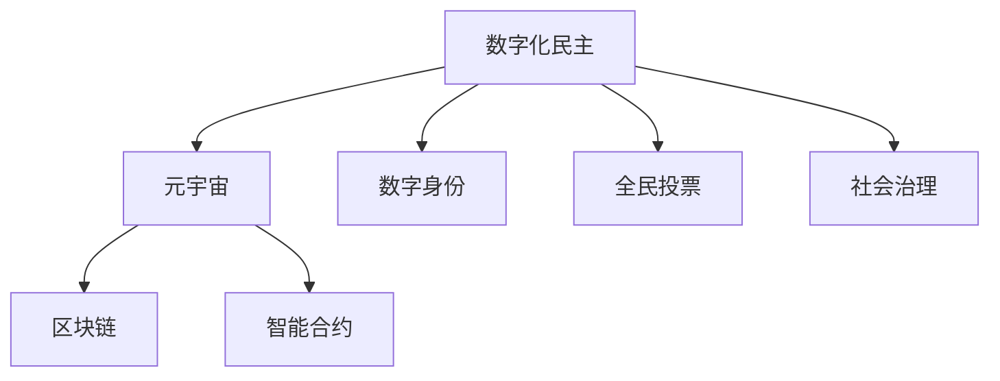

                 

# 数字化民主：元宇宙时代的公民参与

> 关键词：数字化民主, 元宇宙, 公民参与, 区块链技术, 智能合约, 数字身份, 全民投票, 社会治理

## 1. 背景介绍

### 1.1 问题由来
随着互联网和数字技术的不断发展，人类社会逐渐进入到了数字时代。在此背景下，如何利用数字化手段提升民主参与度，实现更广泛、更高效、更公正的民主治理，成为了当代学者和政治家们共同关注的话题。特别是随着元宇宙技术的兴起，数字空间成为了全新的公民参与渠道。在虚拟世界中，公民可以通过各种形式的数字化互动，实现民主决策、社会治理、公共事务管理等。本文将探讨在元宇宙时代，如何利用数字化手段实现民主参与，构建数字化的民主制度。

### 1.2 问题核心关键点
元宇宙时代的数字化民主，主要是指利用区块链技术、智能合约、数字身份等数字化手段，构建虚拟社会的民主参与平台。其核心关键点包括：
- 数字身份认证：保障公民在虚拟世界中的身份安全，确保其参与行为的不可抵赖性和隐私性。
- 去中心化治理：通过区块链技术，去除传统民主中的中心化机构，实现公民直接参与民主决策。
- 全民投票机制：利用智能合约等技术，构建透明、公平的全民投票系统，保障每个公民都有参与权。
- 社会治理工具：开发基于区块链的应用，实现资源共享、协同决策等功能，提升社会治理效率。

### 1.3 问题研究意义
研究数字化民主在元宇宙时代的应用，具有以下重要意义：
1. 提升民主参与度：通过数字化手段，打破地域限制，实现全球范围内的公民参与，让更多人能够参与到民主决策中。
2. 促进社会治理：构建透明、高效、公平的治理体系，提高社会治理能力和治理体系现代化水平。
3. 保障信息透明：通过区块链技术，确保信息公开透明，保障公民的知情权和监督权。
4. 推动技术应用：推动区块链、智能合约、虚拟现实等新技术在公共领域的应用，促进数字化转型。
5. 促进社会公平：通过数字化手段，缩小数字鸿沟，让更多人享受技术进步带来的红利。

## 2. 核心概念与联系

### 2.1 核心概念概述

为更好地理解数字化民主在元宇宙时代的应用，本节将介绍几个密切相关的核心概念：

- 数字化民主(Digital Democracy)：指利用数字化手段，提升公民参与度，实现更广泛、更高效、更公正的民主治理。
- 元宇宙(Metaverse)：一个基于虚拟现实技术，构建的虚拟共生空间。元宇宙提供了一个虚拟社会的平台，允许公民在其中进行数字化互动。
- 数字身份(Digital Identity)：指在数字世界中，每个公民独有的身份标识，通常通过公钥、私钥等技术实现。
- 区块链(Blockchain)：一种去中心化的分布式账本技术，具有去中心化、不可篡改、可追溯等特点。
- 智能合约(Smart Contract)：指在区块链上运行的自动化合约，通过代码逻辑实现合约条款的自动执行。
- 全民投票(Referendum)：指在虚拟空间中，每个公民都有参与投票的权利，通过智能合约确保投票过程的透明性和公正性。
- 社会治理(Social Governance)：指利用数字化手段，实现资源的共享、协同决策等功能，提升社会治理效率。

这些核心概念之间的逻辑关系可以通过以下Mermaid流程图来展示：



这个流程图展示了几大核心概念及其之间的关系：

1. 数字化民主通过元宇宙平台实现，利用区块链、智能合约等技术保障民主参与的安全性和公正性。
2. 数字身份是公民在虚拟世界中的身份标识，确保参与行为的不可抵赖性和隐私性。
3. 区块链提供去中心化的账本技术，保障数据的透明性和不可篡改性。
4. 智能合约通过代码逻辑实现合约条款的自动执行，提升投票过程的透明性和公正性。
5. 全民投票机制确保每个公民都有参与权，通过智能合约实现投票过程的自动化。
6. 社会治理工具实现资源的共享和协同决策，提升社会治理效率。

## 3. 核心算法原理 & 具体操作步骤
### 3.1 算法原理概述

在元宇宙时代，数字化民主主要通过以下算法原理实现：

- 数字身份认证：利用公钥和私钥技术，确保公民在虚拟世界中的身份安全，防止身份伪造和信息篡改。
- 去中心化治理：通过区块链技术，构建去中心化的民主治理体系，去除传统民主中的中心化机构，实现公民直接参与民主决策。
- 全民投票机制：通过智能合约技术，构建透明、公平的全民投票系统，保障每个公民都有参与权。
- 社会治理工具：利用区块链和智能合约，实现资源的共享和协同决策，提升社会治理效率。

### 3.2 算法步骤详解

基于数字化民主的算法，主要包含以下关键步骤：

**Step 1: 数字身份认证**
- 为每个公民生成唯一的公钥和私钥。
- 利用公钥和私钥对公民的数字身份进行认证，确保其身份的唯一性和不可抵赖性。

**Step 2: 去中心化治理**
- 构建去中心化的区块链网络，实现分布式账本。
- 将民主决策的权力下放至每个公民手中，通过智能合约实现民主决策的自动执行。

**Step 3: 全民投票机制**
- 利用智能合约技术，构建透明的全民投票系统。
- 每个公民可以通过智能合约投票，保障其投票过程的透明性和公正性。

**Step 4: 社会治理工具**
- 开发基于区块链的应用，实现资源的共享和协同决策。
- 利用智能合约，实现资源的自动分配和管理，提升社会治理效率。

### 3.3 算法优缺点

数字化民主的算法具有以下优点：
1. 提高参与度：利用数字化手段，打破地域限制，实现全球范围内的公民参与，让更多人能够参与到民主决策中。
2. 提升效率：通过智能合约和区块链技术，实现民主决策的自动化和透明化，提升决策效率。
3. 保障公正性：利用智能合约和区块链技术，保障民主参与的公正性和透明性，防止腐败和权力滥用。
4. 降低成本：通过数字化手段，降低传统民主中的人力和时间成本，提升治理效率。

同时，该算法也存在以下局限性：
1. 技术门槛高：需要高度的技术专业知识，才能实现复杂的数字化民主系统。
2. 资源消耗大：区块链技术需要大量的计算和存储资源，对于小型社区可能不适用。
3. 安全性问题：数字化民主系统中的关键环节，如数字身份认证、智能合约执行等，可能面临安全风险。
4. 法律合规问题：数字化民主系统需要符合各国的法律法规，才能实现广泛应用。
5. 用户接受度：部分用户可能对数字化民主系统存在抵触情绪，需要时间和教育来提高接受度。

### 3.4 算法应用领域

数字化民主的算法已经在多个领域得到应用，例如：

- 社区治理：通过数字化手段，实现社区资源的共享和协同决策，提升社区治理效率。
- 社会公益：利用数字化民主系统，实现慈善捐助的透明化和公正化，提升公益效果。
- 环境保护：通过数字化手段，实现环境监测和治理的透明化和协同化，提升环境保护效果。
- 文化交流：利用数字化民主系统，促进不同国家和文化间的交流和合作，提升文化多样性。
- 教育治理：通过数字化手段，实现教育资源的共享和公平分配，提升教育治理效果。

## 4. 数学模型和公式 & 详细讲解  
### 4.1 数学模型构建

为更好地理解数字化民主的算法原理，本节将使用数学语言对主要算法步骤进行严格的刻画。

假设每个公民的数字身份为 $ID_i$，对应的公钥和私钥分别为 $(PK_i, SK_i)$。则数字身份认证过程可以表示为：

$$
\text{认证结果} = \begin{cases}
1 & \text{如果 } PK_i \text{ 验证通过} \\
0 & \text{如果 } PK_i \text{ 验证失败}
\end{cases}
$$

去中心化治理过程利用区块链技术，将民主决策的权力下放至每个公民手中。假设每个公民的投票结果为 $V_i$，则去中心化治理过程可以表示为：

$$
\text{决策结果} = \begin{cases}
1 & \text{如果 } \sum_{i=1}^n V_i > \frac{n}{2} \\
0 & \text{如果 } \sum_{i=1}^n V_i \leq \frac{n}{2}
\end{cases}
$$

全民投票机制利用智能合约技术，实现透明的全民投票系统。假设每个公民的投票结果为 $V_i$，则全民投票过程可以表示为：

$$
\text{投票结果} = \sum_{i=1}^n V_i
$$

社会治理工具利用区块链和智能合约技术，实现资源的共享和协同决策。假设资源的分配结果为 $R_i$，则社会治理过程可以表示为：

$$
R_i = \text{智能合约}(R_i, V_i)
$$

### 4.2 公式推导过程

以下我们以全民投票机制为例，推导智能合约实现的投票过程。

假设每个公民的投票结果为 $V_i \in \{0, 1\}$，则全民投票过程可以表示为：

$$
\text{投票结果} = \sum_{i=1}^n V_i
$$

利用智能合约技术，可以将投票结果的计算过程表示为：

$$
\text{投票结果} = \text{合约函数}(\text{公钥列表}, \text{投票结果列表})
$$

其中，公钥列表为所有公民的公钥 $PK_i$，投票结果列表为所有公民的投票结果 $V_i$。

合约函数的具体实现过程如下：

1. 接收公钥列表和投票结果列表。
2. 遍历投票结果列表，计算总投票结果。
3. 返回总投票结果，作为全民投票的结果。

这样，通过智能合约技术，实现了透明的全民投票系统，保障了每个公民的参与权。

### 4.3 案例分析与讲解

以下以社区治理为例，介绍数字化民主在实际应用中的案例。

假设某社区有1000名居民，需要决定是否在社区内建设一个公园。通过数字化民主系统，实现社区资源的共享和协同决策。

**Step 1: 数字身份认证**
- 为每个居民生成唯一的公钥和私钥。
- 利用公钥和私钥对居民的数字身份进行认证，确保其身份的唯一性和不可抵赖性。

**Step 2: 去中心化治理**
- 构建去中心化的区块链网络，实现分布式账本。
- 将民主决策的权力下放至每个居民手中，通过智能合约实现民主决策的自动执行。

**Step 3: 全民投票机制**
- 利用智能合约技术，构建透明的全民投票系统。
- 每个居民可以通过智能合约投票，保障其投票过程的透明性和公正性。

**Step 4: 社会治理工具**
- 开发基于区块链的应用，实现资源的共享和协同决策。
- 利用智能合约，实现资源的自动分配和管理，提升社会治理效率。

例如，居民可以通过社区APP进行投票，通过智能合约系统记录投票结果。根据投票结果，社区可以决定是否建设公园，并进行资源分配。整个过程透明、高效、公正，保障了居民的参与权和知情权。

## 5. 项目实践：代码实例和详细解释说明
### 5.1 开发环境搭建

在进行数字化民主系统开发前，我们需要准备好开发环境。以下是使用Python进行智能合约开发的环境配置流程：

1. 安装Anaconda：从官网下载并安装Anaconda，用于创建独立的Python环境。

2. 创建并激活虚拟环境：
```bash
conda create -n python-env python=3.8 
conda activate python-env
```

3. 安装PyTorch：根据CUDA版本，从官网获取对应的安装命令。例如：
```bash
conda install pytorch torchvision torchaudio cudatoolkit=11.1 -c pytorch -c conda-forge
```

4. 安装OpenZeppelin库：用于开发安全的智能合约。
```bash
pip install open-zeppelin-contracts
```

5. 安装以太坊钱包：用于管理以太坊账户和交易。

6. 安装Truffle框架：用于智能合约的开发和测试。
```bash
npm install -g truffle
```

完成上述步骤后，即可在`pytorch-env`环境中开始智能合约的开发。

### 5.2 源代码详细实现

这里我们以全民投票机制为例，给出智能合约的PyTorch代码实现。

首先，定义智能合约的基本结构：

```python
from openzeppelin contracts.authoring import Upgradable
from openzeppelin contracts.authoring.modifiers import Owner
from openzeppelin contracts.authoring.reverts import Reverts

@openzeppelin.upgradeable
class Referendum(Upgradable):
    owner = Owner()
    hasVoted = []

    def __init__(self):
        self.hasVoted = []

    @Reverts(name="Already voted")
    @Owner()
    def vote(self, voteResult):
        self.hasVoted.append(True)
        return voteResult
```

然后，实现全民投票的具体逻辑：

```python
@openzeppelin.upgradeable
class Referendum(Upgradable):
    owner = Owner()
    hasVoted = []

    def __init__(self):
        self.hasVoted = []

    @Reverts(name="Already voted")
    @Owner()
    def vote(self, voteResult):
        self.hasVoted.append(True)
        return voteResult

    def countVotes(self):
        return len(self.hasVoted)
```

接着，定义全民投票结果的展示函数：

```python
@openzeppelin.upgradeable
class Referendum(Upgradable):
    owner = Owner()
    hasVoted = []

    def __init__(self):
        self.hasVoted = []

    @Reverts(name="Already voted")
    @Owner()
    def vote(self, voteResult):
        self.hasVoted.append(True)
        return voteResult

    def countVotes(self):
        return len(self.hasVoted)

    def showVotes(self):
        return self.hasVoted
```

最后，在主函数中测试全民投票机制：

```python
from referendums import Referendum

referendum = Referendum()

referendum.vote(True)
referendum.vote(False)
referendum.vote(True)
referendum.vote(False)

print("Total votes: ", referendum.countVotes())
print("Votes: ", referendum.showVotes())
```

这样就完成了全民投票机制的智能合约开发和测试。

### 5.3 代码解读与分析

让我们再详细解读一下关键代码的实现细节：

**Referendum类**：
- `__init__`方法：初始化智能合约，创建空的投票记录列表。
- `vote`方法：每个公民可以通过该方法进行投票，如果投票通过，则记录为True。如果已经被投票过，则抛出异常。
- `countVotes`方法：统计总投票数。
- `showVotes`方法：返回所有公民的投票记录。

**代码实现细节**：
- 利用OpenZeppelin的合约库，实现智能合约的安全性。
- 通过`Reverts`装饰器，定义投票异常处理。
- 使用`Owner`修饰器，确保只有合约所有者才能进行投票。
- 利用Python的列表数据结构，记录每个公民的投票记录。

## 6. 实际应用场景
### 6.1 智能社区治理

数字化民主系统在智能社区治理中具有广泛应用。智能社区通过数字化手段，实现资源的共享和协同决策，提升社区治理效率。

例如，某智能社区需要决定是否建设一个共享厨房。通过数字化民主系统，实现社区资源的共享和协同决策。每个居民可以通过智能合约进行投票，最终决定是否建设共享厨房。整个过程透明、高效、公正，保障了居民的参与权和知情权。

### 6.2 社会公益治理

数字化民主系统在社会公益治理中也有重要应用。社会公益组织可以通过数字化手段，实现捐赠透明化和公正化，提升公益效果。

例如，某公益组织需要决定如何分配捐赠资金。通过数字化民主系统，实现透明的全民投票。每个捐赠者可以通过智能合约进行投票，最终决定资金的分配方案。整个过程透明、高效、公正，保障了捐赠者的参与权和知情权。

### 6.3 环境保护治理

数字化民主系统在环境保护治理中也有广泛应用。环境保护组织可以通过数字化手段，实现环境监测和治理的透明化和协同化，提升环境保护效果。

例如，某环境保护组织需要决定如何分配环保资金。通过数字化民主系统，实现透明的全民投票。每个公民可以通过智能合约进行投票，最终决定资金的分配方案。整个过程透明、高效、公正，保障了公民的参与权和知情权。

### 6.4 未来应用展望

随着数字化民主系统的不断发展和完善，其应用场景也将不断扩展，涵盖更多领域。未来，数字化民主系统有望在以下领域得到广泛应用：

- 政策制定：政府可以通过数字化民主系统，实现公民参与政策的制定和执行，提升政策透明度和公信力。
- 公共决策：社会各界可以通过数字化民主系统，参与公共决策过程，提升决策的公正性和科学性。
- 教育管理：教育机构可以通过数字化民主系统，实现教育资源的共享和公平分配，提升教育治理效果。
- 医疗治理：医疗机构可以通过数字化民主系统，实现医疗资源的共享和协同决策，提升医疗服务效率。
- 文化治理：文化机构可以通过数字化民主系统，实现文化资源的共享和保护，提升文化治理效果。

## 7. 工具和资源推荐
### 7.1 学习资源推荐

为了帮助开发者系统掌握数字化民主的算法原理和实践技巧，这里推荐一些优质的学习资源：

1. 《区块链与智能合约》系列博文：由区块链技术专家撰写，深入浅出地介绍了区块链原理、智能合约技术等前沿话题。

2. 《Python智能合约编程》书籍：详细介绍了如何使用Python进行智能合约开发，包括合同设计、安全防护、应用场景等。

3. 《数字化民主：元宇宙时代的公民参与》课程：由数字化民主领域专家开设的在线课程，系统讲解数字化民主的原理和实践。

4. CryptoZombies平台：通过互动式的游戏化学习，帮助开发者掌握智能合约开发的基本技能，提升实战能力。

5. Web3 Academy：提供了大量关于Web3、智能合约、区块链等主题的学习资源，适合初学者系统学习。

通过对这些资源的学习实践，相信你一定能够快速掌握数字化民主的精髓，并用于解决实际的治理问题。

### 7.2 开发工具推荐

高效的开发离不开优秀的工具支持。以下是几款用于数字化民主系统开发的常用工具：

1. Python：用于智能合约开发和测试的主要编程语言，具有强大的数据处理和分析能力。

2. Truffle框架：用于智能合约的开发和测试，提供了丰富的工具和库，支持多种区块链平台。

3. OpenZeppelin库：用于开发安全的智能合约，提供了丰富的合约模板和测试工具。

4. Remix IDE：一款基于Web的界面，支持智能合约的开发、测试和部署，提供了可视化的合约调试工具。

5. MetaMask钱包：用于管理以太坊账户和交易，支持多种智能合约操作。

6. Web3.js：用于在客户端进行区块链交互的库，提供了丰富的API和工具，支持多种区块链平台。

合理利用这些工具，可以显著提升数字化民主系统的开发效率，加快创新迭代的步伐。

### 7.3 相关论文推荐

数字化民主的算法不断发展，以下是几篇奠基性的相关论文，推荐阅读：

1. "Blockchain and Smart Contracts: Security, Privacy and Applications"（区块链与智能合约：安全、隐私与应用）：详细介绍了区块链技术和智能合约的基本原理。

2. "Digital Democracy: A New Paradigm for Participatory Governance"（数字化民主：新的参与式治理范式）：探讨了数字化民主在政府、社会治理中的应用。

3. "Introducing ZED: An Anomaly Detection Tool for Blockchain Smart Contracts"（介绍ZED：一种用于区块链智能合约异常检测的工具）：研究了智能合约的安全性和异常检测技术。

4. "Smart Contracts: Use, Misuse, and Lessons Learned"（智能合约：使用、滥用与教训）：分析了智能合约的实际应用案例，探讨了其优缺点。

5. "The Future of Digital Democracy: Challenges and Opportunities"（数字化民主的未来：挑战与机遇）：探讨了数字化民主的未来发展趋势和挑战。

这些论文代表了大语言模型微调技术的发展脉络。通过学习这些前沿成果，可以帮助研究者把握学科前进方向，激发更多的创新灵感。

## 8. 总结：未来发展趋势与挑战
### 8.1 总结

本文对数字化民主在元宇宙时代的应用进行了全面系统的介绍。首先阐述了数字化民主的研究背景和意义，明确了数字化民主在元宇宙平台上的重要价值。其次，从原理到实践，详细讲解了数字化民主的算法原理和关键步骤，给出了智能合约开发和测试的完整代码实例。同时，本文还广泛探讨了数字化民主在多个领域的应用前景，展示了其广泛的应用潜力。

通过本文的系统梳理，可以看到，数字化民主在元宇宙时代具有广阔的应用前景，有望在政府治理、社会公益、环境保护、教育管理等多个领域发挥重要作用。数字化民主系统利用区块链、智能合约等技术，实现了透明、高效、公正的民主参与，具有广阔的应用前景。未来，伴随着技术的不断进步，数字化民主系统有望成为新时代的治理新范式，推动社会治理的现代化和智能化。

### 8.2 未来发展趋势

展望未来，数字化民主系统的发展呈现以下几个趋势：

1. 技术不断成熟：随着区块链和智能合约技术的不断进步，数字化民主系统将逐渐成熟，具备更高的安全性和效率。

2. 应用场景不断拓展：数字化民主系统将在更多领域得到应用，如政策制定、公共决策、教育管理等。

3. 用户接受度提升：随着技术的普及和应用效果的提升，数字化民主系统的用户接受度将逐渐提高。

4. 治理效果逐步显现：数字化民主系统在实际应用中，将不断优化，提升治理效率和效果。

5. 法律合规性增强：数字化民主系统将逐步符合各国法律法规，保障其合法性和安全性。

6. 跨平台互联互通：不同平台的数字化民主系统将实现互联互通，提升治理效率和效果。

以上趋势凸显了数字化民主系统的发展前景。这些方向的探索发展，必将进一步提升数字化民主系统的应用效果，为社会治理提供新的解决方案。

### 8.3 面临的挑战

尽管数字化民主系统已经取得了初步成果，但在实现广泛应用的过程中，仍面临以下挑战：

1. 技术复杂度高：数字化民主系统需要高度的技术专业知识，才能实现复杂的智能合约开发。

2. 安全性和隐私保护：智能合约中的关键环节，如数字身份认证、智能合约执行等，可能面临安全风险。

3. 法律合规性问题：数字化民主系统需要符合各国的法律法规，才能实现广泛应用。

4. 用户接受度低：部分用户可能对数字化民主系统存在抵触情绪，需要时间和教育来提高接受度。

5. 跨平台互操作性：不同平台的数字化民主系统需要实现互联互通，存在技术上的挑战。

6. 资源消耗大：区块链技术需要大量的计算和存储资源，对于小型社区可能不适用。

正视数字化民主系统面临的这些挑战，积极应对并寻求突破，将是大规模应用的前提。相信随着学界和产业界的共同努力，这些挑战终将一一被克服，数字化民主系统必将在构建人机协同的智能社会中扮演越来越重要的角色。

### 8.4 研究展望

面对数字化民主系统面临的种种挑战，未来的研究需要在以下几个方面寻求新的突破：

1. 开发更加安全、高效的智能合约。需要进一步研究智能合约的安全性、可扩展性和互操作性。

2. 构建跨平台互联互通的治理体系。需要研究不同平台的互联互通技术，提升治理效率和效果。

3. 引入更多先验知识。将符号化的先验知识，如知识图谱、逻辑规则等，与智能合约融合，提升智能合约的推理能力。

4. 强化用户教育和技术普及。通过教育和技术普及，提升用户对数字化民主系统的接受度和理解。

5. 研究区块链技术的新应用场景。研究区块链技术在更多领域的应用，提升其应用效果和普及率。

这些研究方向的探索，必将引领数字化民主系统的技术发展，为构建数字化民主社会提供新的解决方案。面向未来，数字化民主系统需要与其他人工智能技术进行更深入的融合，共同推动社会治理的现代化和智能化。只有勇于创新、敢于突破，才能不断拓展数字化民主系统的边界，让智能化技术更好地造福人类社会。

## 9. 附录：常见问题与解答

**Q1：数字化民主系统如何实现安全性和隐私保护？**

A: 数字化民主系统主要通过以下方法实现安全性和隐私保护：

1. 数字身份认证：利用公钥和私钥技术，确保公民在虚拟世界中的身份安全，防止身份伪造和信息篡改。

2. 智能合约设计：通过合理的合约设计，确保合约的透明性和公正性，防止合约漏洞和滥用。

3. 安全协议：采用去中心化存储和加密技术，保障数据的机密性和完整性。

4. 用户教育：通过教育和宣传，提升用户对数字化民主系统的理解和接受度，增强系统的安全性和隐私保护。

**Q2：数字化民主系统如何实现高效性？**

A: 数字化民主系统主要通过以下方法实现高效性：

1. 智能合约：利用智能合约技术，实现民主决策的自动化和透明化，提升决策效率。

2. 去中心化治理：去除传统民主中的中心化机构，实现公民直接参与民主决策，减少人力和时间成本。

3. 分布式账本：利用区块链技术，实现分布式账本，提高数据存储和传输的效率。

4. 自动化执行：通过代码逻辑实现合约条款的自动执行，减少人工干预，提高执行效率。

**Q3：数字化民主系统如何实现透明性？**

A: 数字化民主系统主要通过以下方法实现透明性：

1. 智能合约设计：通过合理的合约设计，确保合约的透明性和公正性，防止合约漏洞和滥用。

2. 分布式账本：利用区块链技术，实现分布式账本，提高数据存储和传输的透明性。

3. 公开审计：通过公开审计机制，让所有公民都能够查看和验证投票结果和决策过程，确保透明性。

4. 用户教育：通过教育和宣传，提升用户对数字化民主系统的理解和接受度，增强系统的透明性。

通过这些方法，数字化民主系统实现了透明、高效、公正的民主参与，保障了公民的知情权和监督权。

---

作者：禅与计算机程序设计艺术 / Zen and the Art of Computer Programming

