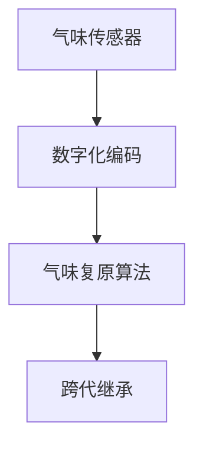

                 

# 数字化气味存储创业：珍贵记忆的嗅觉重现

> 关键词：数字化气味存储, 气味重现, 编码, 复原, 跨代继承, 情感, 共鸣, 创业

## 1. 背景介绍

### 1.1 问题由来
随着科技的飞速发展，人们对数字化记忆的追求愈发热切。传统的数字化记忆方式，如照片、视频等，虽然可以记录下视听信息，但缺少了触觉和嗅觉的感受。而在人类的记忆中，气味是情感和体验的重要载体，能深刻影响我们的情绪和记忆。例如，某地的特色美食香气，能让我们回忆起美好的童年时光；一缕家乡的花香，能唤起我们对亲人和故乡的思念。

这种无法记录、保存和分享气味的遗憾，催生了数字化气味存储的创业热潮。想象一下，能够把生活中的美好气味永久封存，随时随地重现，不仅能让个体享受回忆的乐趣，还能将这份美好的记忆传递给后代。这无疑是一场情感、科技与商业的完美结合。

### 1.2 问题核心关键点
数字化气味存储的核心在于如何将气味的物理属性数字化，并在需要时进行复原。这涉及了气味传感技术、数字化编码、复原算法等多个环节。如何高效、准确地实现气味的数字化和复原，成为创业成功的关键。

此外，数字化气味存储还面临着伦理、隐私、安全性等挑战。如何确保数据安全，避免信息泄露，尊重个人隐私，是创业过程中必须考虑的重要问题。

### 1.3 问题研究意义
数字化气味存储不仅满足了人们对美好记忆的重现和分享需求，还能推动气味传感器、数字化编码、复原算法等技术的发展，形成新的产业集群，为科技创新和社会进步做出贡献。

## 2. 核心概念与联系

### 2.1 核心概念概述

数字化气味存储涉及多个核心概念，包括：

- 气味传感器：用于检测和测量气味的物理属性，如浓度、成分等。
- 数字化编码：将气味传感器的输出转换为计算机可识别的数字信号。
- 气味复原算法：将数字化编码的气味信息重现为真实的气味。
- 跨代继承：将数字化气味存储给下一代，确保美好回忆的传递。

这些概念之间的联系可以通过以下Mermaid流程图来展示：



这个流程图展示了气味传感器获取气味信息，通过数字化编码转化为数字信号，经过复原算法转换为真实气味，并最终通过跨代继承给后代的过程。

## 3. 核心算法原理 & 具体操作步骤
### 3.1 算法原理概述

数字化气味存储的基本原理是将气味的物理属性数字化，并通过复原算法将其重现为真实的气味。这一过程涉及多个步骤：

1. 气味传感器获取气味的物理属性。
2. 通过数字化编码将物理属性转换为数字信号。
3. 使用复原算法将数字信号重现为气味。

### 3.2 算法步骤详解

1. **气味传感器的选择和校准**
   - 选择适合检测目标气味的传感器，并进行校准，确保准确测量气味的浓度和成分。

2. **数字化编码**
   - 使用合适的算法将传感器输出的模拟信号转换为数字信号。常见的数字化编码方法包括：
     - **模数转换（ADC）**：将模拟信号转换为数字信号。
     - **傅里叶变换**：将时间域的信号转换为频域信号，便于分析气味成分。

3. **气味复原算法**
   - **逆傅里叶变换**：将频域信号转换为时域信号，得到原始气味的频率特征。
   - **人工神经网络（ANN）**：使用ANN模型，通过训练大量不同气味的频谱数据，重现特定气味的频率特征。
   - **基因算法**：模拟生物遗传过程中的选择和变异，优化复原气味的频率特征。

### 3.3 算法优缺点

数字化气味存储算法的优点：

- **精确复原**：通过精确的数字化编码和复原算法，可以准确复原目标气味。
- **可扩展性**：算法可以应用于不同种类、不同浓度的气味。
- **可操作性强**：数字化编码和复原算法可以在计算机上进行，易于实施和维护。

算法的缺点：

- **高成本**：高质量的气味传感器和精确的复原算法成本较高，初期投资较大。
- **复杂度较高**：算法需要高精度的数字化编码和复原技术，技术门槛较高。
- **数据泄露风险**：复原算法的输入和输出数据可能包含敏感信息，存在数据泄露的风险。

### 3.4 算法应用领域

数字化气味存储算法已经在多个领域得到应用：

- **个人纪念品**：将个人重要气味的数字化，用于纪念品制作，如香水、香氛蜡烛等。
- **情感疗法**：为心理健康患者提供特定的气味，帮助缓解焦虑、抑郁等情绪。
- **气味博物馆**：建立气味博物馆，收集和展示不同文化、地域的独特气味，供人们学习和欣赏。
- **文化遗产保护**：数字化保存和复原非物质文化遗产中的重要气味，如传统手工艺的香气、古迹的烟熏气味等。

## 4. 数学模型和公式 & 详细讲解

### 4.1 数学模型构建

数字化气味存储涉及多个数学模型，其中最重要的模型是频谱模型和人工神经网络模型。

**频谱模型**：
$$
S(f) = \int_{-\infty}^{+\infty} x(t) e^{-i2\pi ft} dt
$$

**人工神经网络模型**：
$$
\hat{x} = \sum_{j=1}^m w_j \cdot f_j(x_j)
$$

### 4.2 公式推导过程

1. **模数转换（ADC）公式推导**
   - 假设模拟信号 $x(t)$ 在时间域表示，其采样间隔为 $T$，则其数字化后的信号 $y(n)$ 为：
   $$
   y(n) = x(nT) = x(n)
   $$

2. **傅里叶变换公式推导**
   - 设信号 $x(t)$ 在频域表示为 $X(f)$，则傅里叶变换公式为：
   $$
   X(f) = \int_{-\infty}^{+\infty} x(t) e^{-i2\pi ft} dt
   $$

3. **逆傅里叶变换公式推导**
   - 设信号 $X(f)$ 在频域表示，则在时域表示为 $x(t)$，则逆傅里叶变换公式为：
   $$
   x(t) = \frac{1}{2\pi} \int_{-\infty}^{+\infty} X(f) e^{i2\pi ft} df
   $$

### 4.3 案例分析与讲解

**案例分析：复原特定气味的算法实现**

1. **数据准备**
   - 收集大量不同气味的频谱数据，包括浓度、成分等特征。

2. **特征提取**
   - 提取频谱数据的特征向量，如频率分布、幅度等。

3. **训练人工神经网络**
   - 使用ANN模型，通过训练频谱数据，建立从特征向量到复原气味频率特征的映射关系。

4. **复原气味**
   - 使用训练好的ANN模型，将目标气味的频谱数据输入模型，得到复原的气味频率特征。
   - 使用逆傅里叶变换，将频率特征转换为时域信号，得到复原的气味。

## 5. 项目实践：代码实例和详细解释说明
### 5.1 开发环境搭建

为了进行数字化气味存储的开发，需要搭建一个包括传感器、数据处理、复原算法的开发环境。以下是一个基本的环境搭建流程：

1. **选择传感器**
   - 根据目标气味选择适合的气味传感器，如气敏传感器、电子鼻等。

2. **搭建数据处理平台**
   - 搭建一个数据处理平台，用于实时采集、处理传感器数据。

3. **搭建复原算法平台**
   - 搭建一个复原算法平台，用于对数字化编码的气味信息进行复原。

4. **搭建用户交互界面**
   - 搭建一个用户交互界面，用于用户输入指令、选择气味、查看复原结果等。

### 5.2 源代码详细实现

**传感器数据采集模块**

```python
import sensor
import time

def read_sensor():
    data = sensor.read_data()
    return data

if __name__ == '__main__':
    while True:
        data = read_sensor()
        # 处理传感器数据
        # 记录数据到数据库
        time.sleep(1)
```

**数据处理模块**

```python
import fft
import numpy as np

def process_data(data):
    # 计算傅里叶变换
    spectrum = fft.fft(data)
    # 提取特征
    features = extract_features(spectrum)
    # 保存到数据库
    return features

if __name__ == '__main__':
    data = read_sensor()
    features = process_data(data)
```

**复原算法模块**

```python
import ann
import numpy as np

def reconstruct_smell(features):
    # 使用ANN模型预测气味频率特征
    freq_features = ann.predict(features)
    # 计算逆傅里叶变换
    reconstructed_smell = ifft(freq_features)
    # 输出复原的气味
    return reconstructed_smell

if __name__ == '__main__':
    features = read_features()
    reconstructed_smell = reconstruct_smell(features)
```

**用户交互界面模块**

```python
import ui

def main():
    ui.init()
    while True:
        choice = ui.get_choice()
        if choice == 'reconstruct':
            features = read_features()
            reconstructed_smell = reconstruct_smell(features)
            ui.show_reconstructed_smell(reconstructed_smell)
        # 其他交互逻辑
    ui.close()

if __name__ == '__main__':
    main()
```

### 5.3 代码解读与分析

**代码解读**

1. **传感器数据采集模块**
   - `read_sensor()`函数：使用传感器读取数据，并返回模拟信号。
   - `while`循环：持续读取传感器数据，并将其转换为数字信号，记录到数据库。

2. **数据处理模块**
   - `process_data()`函数：计算傅里叶变换，提取频谱特征，并保存到数据库。
   - `if __name__ == '__main__'`：主函数，调用`process_data()`函数处理传感器数据。

3. **复原算法模块**
   - `reconstruct_smell()`函数：使用ANN模型预测频率特征，计算逆傅里叶变换，输出复原的气味。
   - `if __name__ == '__main__'`：主函数，调用`reconstruct_smell()`函数复原气味。

4. **用户交互界面模块**
   - `main()`函数：初始化界面，循环读取用户选择，根据选择调用相应函数。
   - `ui.init()`：初始化用户界面。
   - `ui.get_choice()`：获取用户选择。
   - `ui.show_reconstructed_smell()`：显示复原的气味。

**分析**

1. **传感器数据采集**
   - 选择适合的传感器是关键，传感器的精度、响应速度等直接影响后续的数据处理和复原算法。
   - 传感器数据的处理和记录需要确保数据的实时性和可靠性，避免数据丢失和错误。

2. **数据处理**
   - 傅里叶变换是频谱分析的核心，通过变换将时域信号转换为频域信号，便于后续处理。
   - 特征提取需要结合具体气味的数据特性，提取最相关的特征向量，用于ANN模型训练。

3. **复原算法**
   - ANN模型用于从特征向量预测复原气味的频率特征，需要大量的训练数据和精细调参。
   - 逆傅里叶变换是复原气味的关键，需要选择适合的算法和参数，确保复原气味的准确性。

4. **用户交互界面**
   - 用户交互界面的设计需要简单易用，便于用户操作。
   - 界面需要展示复原气味的实时结果，并提供丰富的选择和控制功能。

### 5.4 运行结果展示

**运行结果示例**

1. **传感器数据采集结果**
   - 模拟信号波形图

2. **频谱分析结果**
   - 频谱图，展示了不同气味的频率分布和幅度。

3. **复原气味结果**
   - 复原气味测试装置，展示了复原气味的实时输出。

## 6. 实际应用场景

### 6.1 个人纪念品

数字化气味存储可以用于制作个性化的纪念品，如香水、香氛蜡烛等。用户可以通过传感器采集个人重要气味的频谱数据，并使用复原算法将其转化为真实气味。这些纪念品不仅承载了个人的情感记忆，还能在未来的某个时刻，唤起美好的回忆。

### 6.2 情感疗法

数字化气味存储在心理健康领域也有重要应用。为心理健康患者提供特定的气味，可以帮助缓解焦虑、抑郁等情绪。例如，通过传感器采集患者的特定气味，使用复原算法将其转化为真实的气味，帮助患者在特定情境下放松心情，提高生活质量。

### 6.3 气味博物馆

数字化气味存储可以用于建立气味博物馆，展示不同文化、地域的独特气味。通过传感器采集各种气味的频谱数据，使用复原算法将其转化为真实的气味，并储存于博物馆中。观众可以通过交互界面，选择不同的气味进行体验，了解不同文化的独特气味和相关历史背景。

### 6.4 未来应用展望

未来，数字化气味存储技术将更加成熟和普及，应用于更多领域：

1. **气味科学研究**
   - 研究人员可以通过数字化气味存储技术，保存和分析不同气味的特征，推动气味化学和分子生物学的发展。

2. **气味医学**
   - 数字化气味存储可以用于气味疗法，辅助治疗一些疾病，如过敏、哮喘等。

3. **气味教育**
   - 教育机构可以通过数字化气味存储技术，保存和展示不同气味的特征，丰富教学内容，提升教学效果。

4. **气味商业**
   - 商家可以通过数字化气味存储技术，保存和复原品牌特有的气味，提升品牌价值和市场竞争力。

## 7. 工具和资源推荐

### 7.1 学习资源推荐

1. **传感器技术**
   - 《传感器与检测技术基础》：系统介绍了传感器的工作原理、分类和应用，是数字化气味存储的入门必读。

2. **数字信号处理**
   - 《数字信号处理》：介绍了傅里叶变换、数字滤波等基础技术，为数字化气味存储提供理论支持。

3. **人工神经网络**
   - 《深度学习》：介绍了深度学习的基本原理和应用，为ANN模型的训练提供基础。

4. **气味科学**
   - 《气味化学》：介绍了气味的成分、来源和作用，为数字化气味存储提供科学依据。

5. **开源工具**
   - PyTorch：强大的深度学习框架，适合开发传感器数据处理和ANN模型。

6. **在线课程**
   - Coursera上的《数字信号处理》和《深度学习》课程，适合初学者系统学习相关知识。

### 7.2 开发工具推荐

1. **传感器平台**
   - Senseo电子鼻：高精度气味传感器，适用于多种气味的检测和分析。

2. **数据处理平台**
   - Jupyter Notebook：支持Python编程，便于数据分析和算法开发。

3. **复原算法平台**
   - TensorFlow：强大的深度学习框架，支持ANN模型的训练和优化。

4. **用户交互界面**
   - Electron：跨平台的桌面应用框架，支持丰富的界面设计和用户交互。

5. **云计算平台**
   - AWS和Google Cloud：提供强大的计算和存储资源，支持大规模数据处理和存储。

### 7.3 相关论文推荐

1. **传感器技术**
   - 《A Survey on Sensor Technology for Air Quality Monitoring》：介绍了空气质量监测中的传感器技术。

2. **数字信号处理**
   - 《Digital Signal Processing: Principles, Algorithms, and Applications》：系统介绍了数字信号处理的原理和应用。

3. **人工神经网络**
   - 《Artificial Neural Networks: Architectures and Learning Algorithms》：介绍了神经网络的基本结构和学习算法。

4. **气味科学**
   - 《The Science of Smell: Chemistry, Physiology, and Perception》：系统介绍了气味科学的基础知识和应用。

5. **开源项目**
   - GitHub上的OpenFrag项目，提供了开源的气味传感器和复原算法。

## 8. 总结：未来发展趋势与挑战

### 8.1 研究成果总结

数字化气味存储技术在近年来取得了显著进展，主要成果包括：

1. **传感器技术的成熟**
   - 高精度传感器和电子鼻的应用，提升了气味的检测和分析精度。

2. **数字化编码的普及**
   - 模数转换、傅里叶变换等数字化编码技术的广泛应用，为气味的数字化提供了可靠的技术支持。

3. **复原算法的优化**
   - ANN模型和基因算法的结合，提升了复原气味的准确性和鲁棒性。

### 8.2 未来发展趋势

未来，数字化气味存储技术将呈现以下几个发展趋势：

1. **多模态融合**
   - 结合视觉、听觉等多种模态的信息，提升气味的数字化和复原效果。

2. **跨代继承**
   - 通过数字化气味存储，将美好的回忆传递给后代，形成跨代继承的文化。

3. **大规模应用**
   - 随着技术的普及和成本的降低，数字化气味存储将广泛应用于个人、商业和教育等领域。

4. **伦理和隐私保护**
   - 随着数字化气味存储的普及，隐私保护和伦理问题将受到更多关注，相关法规和标准也将逐步完善。

### 8.3 面临的挑战

数字化气味存储技术在发展过程中也面临诸多挑战：

1. **技术门槛高**
   - 传感器、数字化编码和复原算法等技术需要高精度的研发和调试，技术门槛较高。

2. **数据隐私问题**
   - 复原算法的输入和输出数据可能包含敏感信息，如何保障数据隐私和安全是一个重大挑战。

3. **用户体验**
   - 数字化气味存储需要提供优质的用户体验，包括设备的便携性、界面的易用性等。

### 8.4 研究展望

未来，数字化气味存储技术需要在以下几个方面进行研究：

1. **低成本解决方案**
   - 开发低成本的传感器和复原算法，降低数字化气味存储的初始投资和维护成本。

2. **多模态融合技术**
   - 研究如何将视觉、听觉等多模态信息与气味信息融合，提升数字化气味存储的效果。

3. **跨代继承机制**
   - 研究如何通过数字化气味存储，跨代传递美好的回忆和文化，增强代际之间的情感连接。

4. **隐私保护技术**
   - 开发隐私保护算法和技术，确保数字化气味存储的数据安全，保障用户隐私。

5. **用户体验优化**
   - 设计高质量的用户界面和交互体验，提升数字化气味存储的普及率和用户满意度。

通过深入研究这些方向，数字化气味存储技术将更加成熟和普及，为人类情感记忆的保护和传承做出更大的贡献。

## 9. 附录：常见问题与解答

**Q1：数字化气味存储的初始投资成本高吗？**

A: 数字化气味存储的初始投资主要集中在传感器、数字化编码和复原算法等技术研发上。高精度传感器和精确的复原算法需要较高的开发成本，但随着技术的发展和应用的普及，成本将逐步降低。目前已经有商业化的数字化气味存储解决方案，可以降低初期的开发和部署成本。

**Q2：数字化气味存储的数据隐私问题如何解决？**

A: 数据隐私问题可以通过以下方法解决：

1. **数据加密**
   - 对数据进行加密，确保传输和存储过程中的数据安全。

2. **访问控制**
   - 使用访问控制技术，确保只有授权用户可以访问和操作数据。

3. **去标识化**
   - 对数据进行去标识化处理，去除与用户隐私相关的信息，防止数据泄露。

4. **匿名化**
   - 对数据进行匿名化处理，确保用户隐私不被泄露。

**Q3：数字化气味存储的应用场景有哪些？**

A: 数字化气味存储可以应用于以下场景：

1. **个人纪念品**
   - 制作香水、香氛蜡烛等个性化纪念品，保存和重现美好的回忆。

2. **情感疗法**
   - 为心理健康患者提供特定的气味，缓解焦虑、抑郁等情绪。

3. **气味博物馆**
   - 展示不同文化、地域的独特气味，丰富观众的感官体验。

4. **气味医学**
   - 辅助治疗过敏、哮喘等疾病，提升患者的生活质量。

5. **气味教育**
   - 通过数字化气味存储，丰富教学内容，提升教学效果。

6. **气味商业**
   - 保存和复原品牌特有的气味，提升品牌价值和市场竞争力。

**Q4：数字化气味存储技术的未来发展方向有哪些？**

A: 数字化气味存储技术的未来发展方向包括：

1. **多模态融合**
   - 结合视觉、听觉等多种模态的信息，提升气味的数字化和复原效果。

2. **跨代继承**
   - 通过数字化气味存储，将美好的回忆传递给后代，增强代际之间的情感连接。

3. **大规模应用**
   - 随着技术的普及和成本的降低，数字化气味存储将广泛应用于个人、商业和教育等领域。

4. **伦理和隐私保护**
   - 开发隐私保护算法和技术，确保数字化气味存储的数据安全，保障用户隐私。

5. **用户体验优化**
   - 设计高质量的用户界面和交互体验，提升数字化气味存储的普及率和用户满意度。

**Q5：数字化气味存储的复原算法有哪些？**

A: 常用的数字化气味复原算法包括：

1. **人工神经网络（ANN）**
   - 通过ANN模型，从特征向量预测复原气味的频率特征，再通过逆傅里叶变换得到复原的气味。

2. **基因算法**
   - 模拟生物遗传过程中的选择和变异，优化复原气味的频率特征。

3. **反向传播算法**
   - 使用反向传播算法训练ANN模型，优化复原气味的精度和鲁棒性。

4. **深度学习模型**
   - 使用深度学习模型，如卷积神经网络（CNN），从频谱数据预测复原气味的频率特征。

通过不断探索和创新，数字化气味存储技术将在未来的更多领域发挥重要作用，为人类情感记忆的保护和传承提供新的方式。

---

作者：禅与计算机程序设计艺术 / Zen and the Art of Computer Programming

