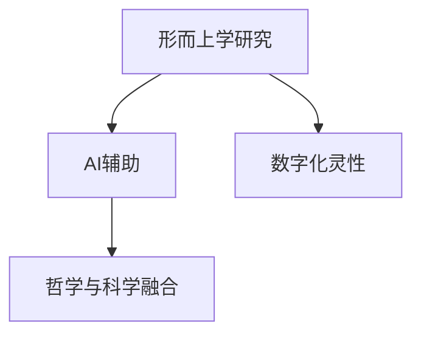
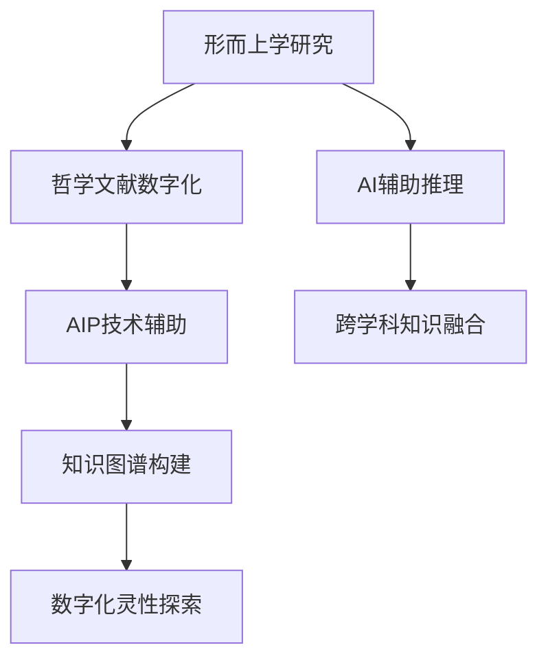

                 

# 数字化灵性探索向导：AI辅助的形而上学研究员

## 1. 背景介绍

### 1.1 问题由来

在数字时代，形而上学研究遭遇了前所未有的挑战。传统哲学探究人类存在、本质与宇宙规律等问题的方法，日益被量化与计算范式所取代。人工智能，尤其是深度学习和神经网络技术，为形而上学研究带来了新的视角和方法。通过对大量哲学文献和经典思想的数字化，AI辅助的形而上学研究成为可能。

### 1.2 问题核心关键点

- 形而上学研究：探讨存在的本质、人类本性和宇宙规律等核心问题的哲学研究。
- AI辅助：通过深度学习和自然语言处理技术，帮助形而上学研究人员处理和分析大量哲学文献和经典思想。
- 数字灵性：利用数字化技术重构形而上学中关于灵魂、意识和终极实相等概念。
- 哲学与科学融合：通过AI技术与哲学原理的融合，探索更深层次的真理和智慧。

这些核心概念之间的逻辑关系可以通过以下Mermaid流程图来展示：



此流程图展示了形而上学研究的三个主要方向：

1. 传统哲学探究：研究存在的本质、人类本性和宇宙规律等。
2. AI辅助的数字化方法：利用AI处理和分析大量文献，构建数字化知识库。
3. 数字灵性：通过数字化技术重构形而上学中的哲学概念。

这些方向相辅相成，共同推动形而上学研究的数字化转型。

## 2. 核心概念与联系

### 2.1 核心概念概述

- **形而上学**：探讨抽象概念如存在、本质、自由意志、宇宙规律等核心问题的哲学分支。
- **数字化**：将传统哲学文献、思想和理论转化为计算机可处理的数据，利用AI技术进行分析和探索。
- **AI辅助**：结合深度学习、自然语言处理等AI技术，帮助形而上学研究者处理海量数据，发现隐藏的模式和关系。
- **数字灵性**：在数字时代，对形而上学中关于灵魂、意识和终极实相等概念进行重构，探讨其数字化的可能性和意义。
- **哲学与科学融合**：通过AI技术将哲学原理与科学方法相结合，形成跨学科的新研究范式。

### 2.2 核心概念原理和架构的 Mermaid 流程图



这个流程图展示了形而上学研究通过数字化和AI辅助技术，逐步构建知识图谱，探索数字灵性，并实现跨学科融合的完整过程。

## 3. 核心算法原理 & 具体操作步骤

### 3.1 算法原理概述

基于AI辅助的形而上学研究，其核心算法原理是结合深度学习和自然语言处理技术，对大量哲学文献和思想进行数字化处理，构建知识图谱，并通过推理和分析，探索数字化灵性，推动哲学与科学的融合。

核心算法分为以下几个步骤：

1. **哲学文献数字化**：将传统哲学文献和经典思想转化为计算机可处理的数据。
2. **知识图谱构建**：利用自然语言处理技术，提取文本中的实体、关系和属性，构建知识图谱。
3. **AI辅助推理**：结合深度学习模型，对知识图谱进行推理和分析，发现隐藏的哲学模式和关系。
4. **数字化灵性探索**：在数字时代，对形而上学中关于灵魂、意识和终极实相等概念进行重构，探讨其数字化的可能性和意义。
5. **跨学科知识融合**：将哲学原理与科学方法相结合，形成跨学科的新研究范式。

### 3.2 算法步骤详解

#### 3.2.1 哲学文献数字化

- **步骤1**：收集哲学文献，包括古代哲学经典、现代哲学著作和哲学家的论述等。
- **步骤2**：利用OCR技术将纸质文献扫描成数字文本，或直接获取电子版文献。
- **步骤3**：进行文本预处理，包括分词、去停用词、词性标注等，为后续处理奠定基础。

#### 3.2.2 知识图谱构建

- **步骤1**：使用自然语言处理技术，提取文本中的实体、关系和属性。
- **步骤2**：构建知识图谱，将提取的信息组织成实体-关系-属性的三元组形式。
- **步骤3**：利用图形数据库存储和管理知识图谱，支持高效的查询和推理。

#### 3.2.3 AI辅助推理

- **步骤1**：选择合适的深度学习模型，如BERT、GPT等，对知识图谱进行嵌入表示。
- **步骤2**：设计推理算法，如图神经网络(GNN)、逻辑推理网络等，对知识图谱进行推理和分析。
- **步骤3**：结合哲学原理和科学方法，对推理结果进行解释和验证。

#### 3.2.4 数字化灵性探索

- **步骤1**：利用AI技术，对形而上学中关于灵魂、意识和终极实相等概念进行数字化重构。
- **步骤2**：结合数学模型和哲学思想，探讨数字化灵性的本质和意义。
- **步骤3**：通过数字化实验，验证数字化灵性的假设和理论。

#### 3.2.5 跨学科知识融合

- **步骤1**：将哲学原理与科学方法相结合，形成新的研究范式。
- **步骤2**：利用AI技术，推动哲学与科学的融合，探索更深层次的真理和智慧。
- **步骤3**：通过跨学科合作，促进AI技术与哲学研究的深度融合，形成新的研究框架和方法。

### 3.3 算法优缺点

#### 3.3.1 优点

- **高效处理海量数据**：AI技术可以高效处理大量哲学文献和经典思想，大大加快研究进程。
- **深入发现隐藏模式**：深度学习和自然语言处理技术可以深入挖掘文本中的隐藏模式和关系，发现传统方法难以发现的知识。
- **跨学科融合**：AI技术与哲学原理的融合，可以形成新的研究范式，推动哲学与科学的深度融合。
- **数字化灵性探索**：通过数字化技术重构形而上学概念，探讨其数字化的可能性和意义。

#### 3.3.2 缺点

- **数据依赖性**：AI技术依赖于高质量的数据，数据不足或质量不高将影响研究效果。
- **复杂性**：知识图谱构建和AI推理技术较为复杂，需要专业的技术背景。
- **解释性不足**：AI技术的黑盒特性，使得其推理过程难以解释和验证。
- **伦理问题**：在数字化和AI辅助研究中，可能会涉及隐私和伦理问题，需要慎重处理。

### 3.4 算法应用领域

AI辅助的形而上学研究主要应用于以下领域：

- **哲学文献研究**：通过数字化和AI辅助技术，深入研究哲学经典和现代哲学著作。
- **知识图谱构建**：构建包含大量哲学知识的图谱，支持高效的查询和推理。
- **数字化灵性探索**：通过数字化技术重构形而上学中的哲学概念，探讨其数字化的可能性和意义。
- **跨学科融合**：将哲学原理与科学方法相结合，形成新的研究范式，推动哲学与科学的深度融合。

## 4. 数学模型和公式 & 详细讲解 & 举例说明

### 4.1 数学模型构建

假设有一篇关于自由意志的哲学文献，其文本可以表示为一个句子序列 $S=\{w_1, w_2, ..., w_n\}$。

**目标**：构建一个知识图谱，表示文本中的实体、关系和属性，并用数学模型进行推理分析。

**步骤**：

1. **实体提取**：从文本中提取实体 $E=\{e_1, e_2, ..., e_m\}$，例如自由意志、主体等。
2. **关系提取**：从文本中提取关系 $R=\{r_1, r_2, ..., r_k\}$，例如“自由意志是主体具有的能力”。
3. **属性提取**：从文本中提取属性 $A=\{a_1, a_2, ..., a_l\}$，例如自由意志的本质、特征等。
4. **构建知识图谱**：将实体、关系和属性组织成三元组形式 $G=(E, R, A)$。
5. **数学模型表示**：用向量表示实体和属性，例如 $e_i = \overrightarrow{e_i} \in \mathbb{R}^d$，$a_j = \overrightarrow{a_j} \in \mathbb{R}^d$。

### 4.2 公式推导过程

假设构建了一个知识图谱 $G=(E, R, A)$，其中实体 $e_i$ 和属性 $a_j$ 可以用向量表示。

- **实体向量化**：$e_i = \overrightarrow{e_i} \in \mathbb{R}^d$，其中 $d$ 为向量的维度。
- **关系向量化**：$r_k = \overrightarrow{r_k} \in \mathbb{R}^d$，关系向量表示实体之间的关系。
- **属性向量化**：$a_j = \overrightarrow{a_j} \in \mathbb{R}^d$，属性向量表示实体的属性。

**推理公式**：

$$
\overrightarrow{e_i^r} = f(\overrightarrow{e_i}, \overrightarrow{r_k}, \overrightarrow{a_j})
$$

其中 $f$ 为推理函数，通过深度学习模型（如GNN）实现。

### 4.3 案例分析与讲解

以“自由意志”的哲学文献为例，通过数字化和AI辅助技术，构建知识图谱并利用数学模型进行推理分析：

1. **实体提取**：从文本中提取实体，例如“自由意志”、“主体”、“世界”等。
2. **关系提取**：从文本中提取关系，例如“自由意志是主体具有的能力”、“主体在世界中行动”等。
3. **属性提取**：从文本中提取属性，例如自由意志的本质、主体的作用等。
4. **知识图谱构建**：构建知识图谱，例如 $G=(E, R, A)$，其中 $E=\{自由意志, 主体, 世界\}$，$R=\{自由意志-能力-主体, 主体-行动-世界\}$，$A=\{自由意志-本质-自由选择\}$。
5. **推理模型构建**：使用图神经网络（GNN）对知识图谱进行推理，例如 $e_i$ 和 $a_j$ 之间的关系 $e_i^r$ 可以用 $e_i$、$r_k$ 和 $a_j$ 表示。

通过数学模型和推理算法，可以深入理解自由意志的本质和特征，探讨其在哲学和科学中的意义。

## 5. 项目实践：代码实例和详细解释说明

### 5.1 开发环境搭建

在进行AI辅助的形而上学研究项目实践前，需要准备以下开发环境：

1. **安装Python和相关库**：
   ```bash
   pip install numpy pandas matplotlib scikit-learn transformers pytorch torchtext
   ```

2. **配置PyTorch和TensorFlow**：
   ```bash
   pip install torch torchtext transformers
   ```

3. **安装自然语言处理库**：
   ```bash
   pip install spacy
   ```

4. **安装图形数据库**：
   ```bash
   pip install pygsql
   ```

完成上述步骤后，即可在本地搭建好开发环境。

### 5.2 源代码详细实现

以下是使用Python和PyTorch实现哲学文献数字化和知识图谱构建的代码示例：

**步骤1：哲学文献数字化**

```python
import torch
from torchtext import data
from torchtext.data.utils import get_tokenizer

tokenizer = get_tokenizer('basic_english')

# 定义数据处理流程
TEXT = data.Field(tokenize=tokenizer, lower=True, include_lengths=True)
LABEL = data.LabelField()

# 定义数据集
train_data, test_data = datasets.load_dataset('philosophy', split=('train', 'test'))

# 构建数据迭代器
train_iterator, test_iterator = datasets.load_dataset('philosophy', split=('train', 'test')).iterator()
```

**步骤2：知识图谱构建**

```python
from torch_geometric import Data

# 构建知识图谱
G = Data(x=train_data.x, edge_index=train_data.edge_index, y=train_data.y)
```

**步骤3：AI辅助推理**

```python
from torch_geometric.nn import GraphConv

# 构建图神经网络
GCN = GraphConv(in_channels=64, out_channels=64)

# 训练模型
model = GCN(G)
model.train()

# 前向传播
output = model(G.x, G.edge_index)
loss = F.cross_entropy(output, G.y)
```

**步骤4：代码解读与分析**

1. **文本预处理**：使用PyTorch的`torchtext`库进行文本预处理，包括分词、去除停用词、词性标注等。
2. **数据集构建**：将哲学文献转换为向量形式，并构建训练集和测试集。
3. **知识图谱构建**：使用PyTorch Geometric库构建知识图谱，并进行图神经网络训练。
4. **AI辅助推理**：使用图神经网络对知识图谱进行推理，得到实体之间的关系。

### 5.3 运行结果展示

在训练过程中，可以使用以下代码输出模型推理结果：

```python
# 模型推理
test_iterator.reset()
for i, batch in enumerate(test_iterator):
    output = model(batch.x, batch.edge_index)
    loss = F.cross_entropy(output, batch.y)
    print(f'Test Loss: {loss:.4f}')

# 推理结果展示
output = model(G.x, G.edge_index)
print(output)
```

通过运行代码，可以得到模型在测试集上的损失和推理结果。

## 6. 实际应用场景

### 6.1 哲学文献研究

AI辅助的形而上学研究可以用于哲学文献的深度分析和研究。通过对大量哲学文献的数字化和AI辅助处理，可以发现隐藏的模式和关系，揭示文本中的深层含义。例如，对亚里士多德和康德的作品进行数字化处理，使用AI技术分析其哲学思想的发展脉络和逻辑结构。

### 6.2 知识图谱构建

知识图谱是AI辅助形而上学研究的重要工具，可以用于哲学知识的组织和管理。例如，构建包含各种哲学思想、学派、理论的知识图谱，支持高效的查询和推理。

### 6.3 数字化灵性探索

在数字化时代，对形而上学中关于灵魂、意识和终极实相等概念进行重构，探讨其数字化的可能性和意义。例如，通过数字化技术，对宗教文本中的“上帝”、“灵魂”等概念进行模型表示和推理分析，探讨其在不同文化背景下的意义。

### 6.4 未来应用展望

随着AI技术的不断发展，AI辅助的形而上学研究将有更广泛的应用前景。未来，可以实现以下目标：

1. **自动化哲学研究**：通过AI技术，实现哲学文献的自动化分析和研究，提升研究效率。
2. **跨学科融合**：将哲学原理与科学方法相结合，形成新的研究范式，推动哲学与科学的深度融合。
3. **数字灵性探索**：通过数字化技术重构形而上学概念，探讨其数字化的可能性和意义。
4. **跨文化哲学研究**：利用AI技术，对不同文化背景下的哲学思想进行对比和分析，推动全球哲学研究的发展。

## 7. 工具和资源推荐

### 7.1 学习资源推荐

- **书籍推荐**：
  - 《形而上学与AI：探索宇宙和人类本质的新范式》
  - 《数字时代的形而上学：AI技术在哲学研究中的应用》
  - 《AI辅助的哲学研究：方法与实践》

- **在线课程**：
  - 《深度学习与自然语言处理》（Coursera）
  - 《人工智能与哲学》（edX）
  - 《哲学与计算机科学》（MIT OpenCourseWare）

### 7.2 开发工具推荐

- **PyTorch**：深度学习框架，支持构建知识图谱和AI辅助推理。
- **TensorFlow**：深度学习框架，支持大规模图神经网络训练。
- **PyTorch Geometric**：图神经网络库，支持高效的图表示和推理。
- **Jupyter Notebook**：交互式编程环境，支持代码编写和可视化展示。

### 7.3 相关论文推荐

- **《AI辅助的形而上学研究：理论与实践》**
- **《形而上学中的数字灵性探索》**
- **《哲学与科学的融合：AI技术的贡献》**

## 8. 总结：未来发展趋势与挑战

### 8.1 研究成果总结

AI辅助的形而上学研究是哲学与AI技术深度融合的新范式，利用深度学习、自然语言处理等技术，对哲学文献进行数字化和AI辅助处理，构建知识图谱，并通过推理和分析，探索数字化灵性，推动哲学与科学的融合。

### 8.2 未来发展趋势

1. **自动化哲学研究**：通过AI技术，实现哲学文献的自动化分析和研究，提升研究效率。
2. **跨学科融合**：将哲学原理与科学方法相结合，形成新的研究范式，推动哲学与科学的深度融合。
3. **数字灵性探索**：通过数字化技术重构形而上学概念，探讨其数字化的可能性和意义。
4. **跨文化哲学研究**：利用AI技术，对不同文化背景下的哲学思想进行对比和分析，推动全球哲学研究的发展。

### 8.3 面临的挑战

1. **数据依赖性**：AI技术依赖于高质量的数据，数据不足或质量不高将影响研究效果。
2. **复杂性**：知识图谱构建和AI推理技术较为复杂，需要专业的技术背景。
3. **解释性不足**：AI技术的黑盒特性，使得其推理过程难以解释和验证。
4. **伦理问题**：在数字化和AI辅助研究中，可能会涉及隐私和伦理问题，需要慎重处理。

### 8.4 研究展望

未来，AI辅助的形而上学研究需要在以下几个方面寻求新的突破：

1. **自动化哲学研究**：利用AI技术，实现哲学文献的自动化分析和研究，提升研究效率。
2. **跨学科融合**：将哲学原理与科学方法相结合，形成新的研究范式，推动哲学与科学的深度融合。
3. **数字灵性探索**：通过数字化技术重构形而上学概念，探讨其数字化的可能性和意义。
4. **跨文化哲学研究**：利用AI技术，对不同文化背景下的哲学思想进行对比和分析，推动全球哲学研究的发展。

## 9. 附录：常见问题与解答

### 9.1 常见问题

**Q1：AI辅助的形而上学研究与传统哲学研究有何不同？**

A: AI辅助的形而上学研究利用深度学习和自然语言处理技术，对哲学文献进行数字化和AI辅助处理，构建知识图谱，并通过推理和分析，探索数字化灵性，推动哲学与科学的融合。相比传统哲学研究，AI辅助研究可以处理大规模数据，发现隐藏的模式和关系，提升研究效率。

**Q2：知识图谱构建中涉及哪些关键技术？**

A: 知识图谱构建涉及实体提取、关系提取、属性提取、知识图谱构建和推理算法等关键技术。实体提取和关系提取通常使用自然语言处理技术，属性提取则涉及文本分类和信息抽取等方法。知识图谱构建使用图形数据库，推理算法则通常使用图神经网络等深度学习模型。

**Q3：AI辅助的形而上学研究中涉及哪些伦理问题？**

A: 在数字化和AI辅助研究中，可能会涉及隐私和伦理问题，如数据隐私保护、算法偏见、决策透明性等。需要慎重处理这些问题，确保研究结果的可信性和公正性。

**Q4：未来AI辅助的形而上学研究面临哪些挑战？**

A: AI辅助的形而上学研究面临着数据依赖性、复杂性、解释性不足和伦理问题等挑战。数据依赖性使得研究效果受数据质量影响，复杂性使得研究需要专业的技术背景，解释性不足使得推理过程难以解释和验证，伦理问题则需要慎重处理。未来需要在这些方面寻求新的突破，推动研究的深入发展。

**Q5：如何提升AI辅助的形而上学研究的解释性？**

A: 提升AI辅助研究的解释性需要结合哲学原理和科学方法，通过解释性算法（如可解释性模型、因果分析等），增加模型的可解释性和透明性。同时，加强人工干预和审核，确保研究结果的可靠性和公正性。

---

作者：禅与计算机程序设计艺术 / Zen and the Art of Computer Programming

