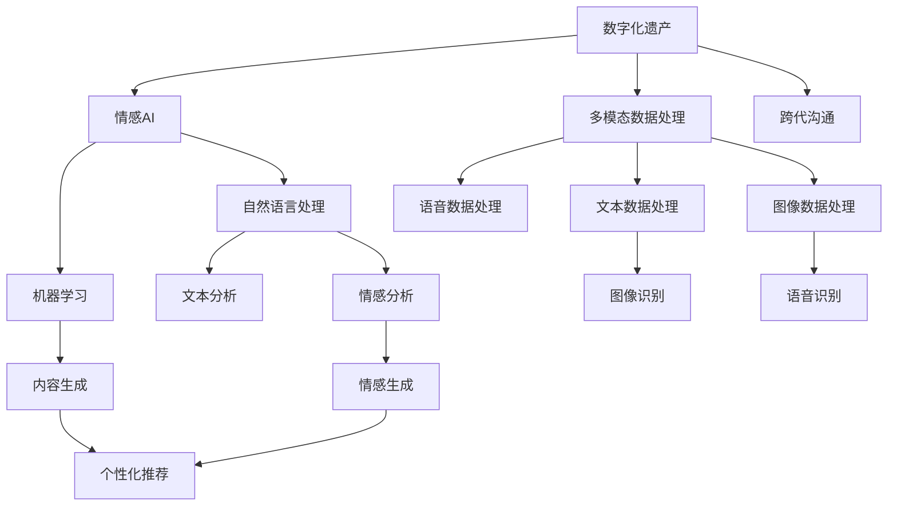

                 

# 数字化遗产情感AI创业：逝者个性的数字化传承

> 关键词：数字化遗产、情感AI、个性化、数据处理、情感分析、自然语言处理、机器学习、用户交互

## 1. 背景介绍

### 1.1 问题由来

随着数字化时代的来临，人们对数字遗产的认识和需求不断增强。数字化遗产，指的是个人或家庭在数字世界中的各种数字资产，包括电子邮件、社交媒体、照片、视频、音乐、文档等。这些数字资产不仅是个人记忆的载体，更是情感和文化传承的媒介。然而，面对海量数字资产的存储、管理和传承，人们往往感到力不从心。数字化遗产的妥善处理和管理，不仅需要技术手段，更需情感的维系和文化的传承。

在这一背景下，情感AI技术的崛起，为数字化遗产的保护和传承提供了新的可能性。情感AI技术，特别是自然语言处理(NLP)和机器学习(ML)的结合，能够深刻理解和还原逝者的个性和情感，从而实现数字化遗产的智能化管理和传承。

### 1.2 问题核心关键点

情感AI技术的核心在于其能够通过处理文本、语音、图像等多模态数据，捕捉和理解人类的情感和意图。在数字化遗产的管理和传承中，情感AI可以发挥以下关键作用：

- **情感分析与文本挖掘**：对逝者生前的文字记录进行情感分析，还原其情感状态和生活轨迹。
- **个性化继承**：根据逝者的兴趣和偏好，筛选和管理其数字遗产，定制个性化的继承方案。
- **用户交互与体验**：通过智能交互界面，让用户以更自然、更亲切的方式回顾逝者生前的数字生活。
- **跨代沟通**：在年轻一代与先辈之间架起情感交流的桥梁，促进家族文化的延续。

本文将系统介绍情感AI技术在数字化遗产管理中的应用，探讨情感AI系统的实现方法和关键技术，并展望未来的发展趋势。

## 2. 核心概念与联系

### 2.1 核心概念概述

为更好地理解情感AI技术在数字化遗产管理中的应用，本节将介绍几个密切相关的核心概念：

- **情感AI (Sentiment AI)**：通过自然语言处理和机器学习技术，分析和理解人类的情感和意图，并据此生成或推荐相关内容的AI系统。情感AI在数字化遗产管理中的应用，包括情感分析、个性化推荐、情感生成等。

- **数字化遗产 (Digital Estate)**：指个人或家庭在数字世界中的各种数字资产，包括电子邮件、社交媒体、照片、视频、音乐、文档等。数字化遗产不仅承载了逝者的记忆，也是情感和文化传承的重要媒介。

- **自然语言处理 (Natural Language Processing, NLP)**：使用计算机对人类语言进行理解、处理和生成，包括文本分析、情感分析、语言生成等。在情感AI中，NLP技术是实现情感理解的基础。

- **机器学习 (Machine Learning, ML)**：通过数据训练模型，使模型能够自动学习和改进，从而实现复杂的情感分析、个性化推荐等功能。在情感AI中，ML技术是实现情感理解和内容生成的核心。

- **多模态数据处理 (Multimodal Data Processing)**：在情感AI中，需要处理文本、语音、图像等多种模态的数据，以全面了解和表达情感。多模态数据处理技术在数字化遗产管理中尤为重要。

- **跨代沟通 (Intergenerational Communication)**：通过情感AI，年轻一代与先辈之间可以进行情感交流和互动，促进家族文化的传承和延续。

这些核心概念之间的逻辑关系可以通过以下Mermaid流程图来展示：



这个流程图展示了大语言模型在数字化遗产管理中的核心概念及其之间的关系：

1. 数字化遗产通过情感AI进行处理，还原逝者生前的数字生活。
2. 自然语言处理技术用于文本数据的分析和情感分析。
3. 机器学习技术用于文本数据的生成和个性化推荐。
4. 多模态数据处理技术用于全面处理文本、语音、图像等多种模态的数据。
5. 跨代沟通技术在年轻一代与先辈之间架起情感交流的桥梁。

这些概念共同构成了情感AI系统的基础，使其能够在数字化遗产管理中发挥强大的情感理解和传承功能。

## 3. 核心算法原理 & 具体操作步骤
### 3.1 算法原理概述

情感AI技术在数字化遗产管理中的应用，主要通过以下几个关键步骤：

- **数据收集与预处理**：收集逝者生前的数字遗产，包括文本、语音、图像等多种数据形式，并进行清洗和标准化处理。
- **情感分析**：通过自然语言处理技术，对文本数据进行情感分析，还原逝者的情感状态和情感倾向。
- **个性化推荐**：根据情感分析结果，结合逝者生前的兴趣和偏好，推荐和管理其数字遗产，定制个性化的继承方案。
- **跨代沟通**：通过智能交互界面，实现年轻一代与先辈之间的情感交流和互动。

情感AI的实现主要基于自然语言处理和机器学习技术，其核心算法包括：

- **情感分类算法**：用于对文本数据进行情感分类，识别出积极、消极、中性等情感类别。
- **文本生成算法**：基于情感分类结果，生成反映逝者情感状态和个性特征的文本内容。
- **个性化推荐算法**：根据情感分析和个性化需求，推荐和管理逝者的数字遗产。

### 3.2 算法步骤详解

情感AI在数字化遗产管理中的应用流程，主要包括以下几个步骤：

**Step 1: 数据收集与预处理**
- 收集逝者生前的数字遗产，包括电子邮件、社交媒体、照片、视频、音乐、文档等。
- 对数据进行清洗、去重和标准化处理，确保数据的准确性和一致性。
- 使用多模态数据处理技术，对文本、语音、图像等不同模态的数据进行统一处理。

**Step 2: 情感分析**
- 使用自然语言处理技术，对文本数据进行情感分类。常用的情感分类算法包括基于规则的方法、基于机器学习的方法、基于深度学习的方法等。
- 提取文本中的情感特征，如情感词汇、情感强度、情感极性等，用于还原逝者的情感状态。
- 对语音数据进行情感分析，使用声学特征和情感分类算法，提取语音中的情感信息。
- 对图像数据进行情感分析，使用图像识别技术和情感分类算法，提取图像中的情感信息。

**Step 3: 个性化推荐**
- 根据情感分析结果，结合逝者生前的兴趣和偏好，筛选和管理其数字遗产。常用的个性化推荐算法包括协同过滤、基于内容的推荐、基于矩阵分解的推荐等。
- 生成个性化的继承方案，将逝者生前的数字遗产以定制化的方式传承给后代。
- 实现智能交互界面，用户可以通过界面浏览、管理和继承逝者的数字遗产。

**Step 4: 跨代沟通**
- 通过智能交互界面，实现年轻一代与先辈之间的情感交流和互动。常用的技术包括自然语言生成、语音合成、图像生成等。
- 使用情感生成算法，生成反映逝者情感状态和个性特征的内容，用于情感交流和互动。
- 实现跨代沟通功能，使用户能够以更自然、更亲切的方式回顾逝者生前的数字生活，促进家族文化的延续。

### 3.3 算法优缺点

情感AI技术在数字化遗产管理中的应用，具有以下优点：

- **情感还原与传承**：通过情感分析技术，还原逝者生前的情感状态和情感倾向，传承其情感和文化。
- **个性化管理**：结合逝者生前的兴趣和偏好，实现个性化的数字遗产管理。
- **跨代沟通**：通过智能交互界面，实现年轻一代与先辈之间的情感交流和互动。

同时，该技术也存在以下局限性：

- **数据依赖性**：情感AI的效果很大程度上依赖于数字遗产的质量和数量。获取高质量数字遗产的成本较高。
- **情感复杂性**：情感的复杂性和多样性使得情感分析具有一定的挑战性。
- **跨代差异性**：年轻一代与先辈之间的情感差异较大，需要灵活的情感理解技术和个性化推荐策略。
- **用户交互性**：智能交互界面的自然度、亲和度和用户体验有待提升。

尽管存在这些局限性，但就目前而言，情感AI技术仍是大语言模型应用的重要范式。未来相关研究的重点在于如何进一步降低数据依赖，提高情感理解的准确性，以及提升用户交互的体验和情感共鸣度。

### 3.4 算法应用领域

情感AI技术在数字化遗产管理中的应用，已经拓展到了多个领域，包括：

- **家族档案管理**：通过情感AI技术，管理和传承家族档案，还原家族历史和文化。
- **文化教育传承**：通过情感AI技术，传承家族文化教育，促进家族成员的情感交流和文化认同。
- **数字遗产继承**：通过情感AI技术，实现个性化的数字遗产继承和管理，定制符合继承者需求的数字资产。
- **情感历史回顾**：通过情感AI技术，实现对逝者生前数字生活的情感回顾和体验，促进家族情感的维系和传承。

除了上述这些经典应用外，情感AI技术还被创新性地应用于更多场景中，如数字档案馆、数字博物馆、虚拟纪念馆等，为数字化遗产管理带来了新的突破。

## 4. 数学模型和公式 & 详细讲解 & 举例说明
### 4.1 数学模型构建

本节将使用数学语言对情感AI技术在数字化遗产管理中的应用过程进行更加严格的刻画。

记数字化遗产为 $E = \{e_i\}_{i=1}^N$，其中 $e_i$ 为第 $i$ 项数字遗产，可以是文本、语音、图像等多种形式。情感AI的情感分析模型为 $M_{\theta}$，其中 $\theta$ 为模型的参数。

定义模型 $M_{\theta}$ 在数字遗产 $e_i$ 上的情感分析结果为 $s_i = M_{\theta}(e_i)$，表示第 $i$ 项数字遗产的情感极性。

根据情感分析结果 $s_i$，推荐模型 $R$ 为 $R_{\theta}(s_i)$，表示基于情感分析结果 $s_i$ 推荐的第 $i$ 项数字遗产。

情感AI的个性化推荐模型为 $M_{\theta}$，其中 $\theta$ 为模型的参数。

定义模型 $M_{\theta}$ 在数字遗产 $e_i$ 上的个性化推荐结果为 $r_i = M_{\theta}(e_i)$，表示第 $i$ 项数字遗产被推荐给继承者的概率。

情感AI的跨代沟通模型为 $M_{\theta}$，其中 $\theta$ 为模型的参数。

定义模型 $M_{\theta}$ 在数字遗产 $e_i$ 上的跨代沟通结果为 $c_i = M_{\theta}(e_i)$，表示数字遗产 $e_i$ 在年轻一代与先辈之间架起的情感交流桥梁。

### 4.2 公式推导过程

以下我们以情感分类算法为例，推导情感分析的数学公式及其推导过程。

假设情感分析模型 $M_{\theta}$ 在数字遗产 $e_i$ 上的情感分析结果为 $s_i = (s_{i1}, s_{i2}, ..., s_{ik})$，其中 $s_{ij} \in \{0, 1\}$ 表示第 $i$ 项数字遗产的第 $j$ 个情感特征。

定义情感分类任务的目标函数为：

$$
\mathcal{L}(\theta) = \sum_{i=1}^N \sum_{j=1}^k \ell(s_{ij}, \hat{s}_{ij})
$$

其中 $\ell$ 为损失函数，常用的有交叉熵损失、对数损失等。$\hat{s}_{ij}$ 为模型 $M_{\theta}$ 预测的第 $i$ 项数字遗产的第 $j$ 个情感特征。

通过梯度下降等优化算法，最小化损失函数 $\mathcal{L}(\theta)$，得到最优模型参数 $\theta^*$。具体推导过程如下：

$$
\nabla_{\theta}\mathcal{L}(\theta) = \sum_{i=1}^N \sum_{j=1}^k \nabla_{\theta}\ell(s_{ij}, \hat{s}_{ij})
$$

$$
\theta \leftarrow \theta - \eta \nabla_{\theta}\mathcal{L}(\theta)
$$

其中 $\eta$ 为学习率，$\nabla_{\theta}\ell(s_{ij}, \hat{s}_{ij})$ 为损失函数对模型参数 $\theta$ 的梯度。

在得到情感分析模型的情感分类结果后，可以进一步结合情感生成算法、个性化推荐算法等，实现情感AI在数字化遗产管理中的全面应用。

## 5. 项目实践：代码实例和详细解释说明
### 5.1 开发环境搭建

在进行情感AI项目实践前，我们需要准备好开发环境。以下是使用Python进行情感AI开发的常见环境配置流程：

1. 安装Anaconda：从官网下载并安装Anaconda，用于创建独立的Python环境。

2. 创建并激活虚拟环境：
```bash
conda create -n sentiment-env python=3.8 
conda activate sentiment-env
```

3. 安装必要的工具包：
```bash
pip install numpy pandas scikit-learn transformers
```

4. 安装相关库：
```bash
pip install tensorflow-gpu pytorch torchvision torchaudio scikit-learn tqdm jupyter notebook ipython
```

完成上述步骤后，即可在`sentiment-env`环境中开始情感AI项目的开发。

### 5.2 源代码详细实现

这里我们以情感分类算法为例，给出使用PyTorch和Transformers库实现情感分析的代码示例。

```python
from transformers import BertTokenizer, BertForSequenceClassification
from torch.utils.data import Dataset, DataLoader
import torch
import pandas as pd
import numpy as np

# 数据集准备
class SentimentDataset(Dataset):
    def __init__(self, data, tokenizer, max_len=128):
        self.data = data
        self.tokenizer = tokenizer
        self.max_len = max_len

    def __len__(self):
        return len(self.data)

    def __getitem__(self, index):
        text = self.data.iloc[index]['text']
        label = self.data.iloc[index]['label']

        encoding = self.tokenizer(text, return_tensors='pt', max_length=self.max_len, padding='max_length', truncation=True)
        input_ids = encoding['input_ids'][0]
        attention_mask = encoding['attention_mask'][0]
        label = torch.tensor(label, dtype=torch.long)

        return {'input_ids': input_ids, 
                'attention_mask': attention_mask,
                'labels': label}

# 数据加载
tokenizer = BertTokenizer.from_pretrained('bert-base-cased')
df = pd.read_csv('sentiment_data.csv')
dataset = SentimentDataset(df, tokenizer)

# 模型加载
model = BertForSequenceClassification.from_pretrained('bert-base-cased', num_labels=2)
optimizer = torch.optim.Adam(model.parameters(), lr=2e-5)
device = torch.device('cuda') if torch.cuda.is_available() else torch.device('cpu')
model.to(device)

# 模型训练
def train_model(model, dataset, batch_size, optimizer, num_epochs=5):
    dataloader = DataLoader(dataset, batch_size=batch_size, shuffle=True)
    model.train()
    total_loss = 0
    for batch in dataloader:
        input_ids = batch['input_ids'].to(device)
        attention_mask = batch['attention_mask'].to(device)
        labels = batch['labels'].to(device)
        model.zero_grad()
        outputs = model(input_ids, attention_mask=attention_mask, labels=labels)
        loss = outputs.loss
        total_loss += loss.item()
        loss.backward()
        optimizer.step()
    return total_loss / len(dataloader)

# 模型评估
def evaluate_model(model, dataset, batch_size):
    dataloader = DataLoader(dataset, batch_size=batch_size)
    model.eval()
    total_correct = 0
    total_data = 0
    with torch.no_grad():
        for batch in dataloader:
            input_ids = batch['input_ids'].to(device)
            attention_mask = batch['attention_mask'].to(device)
            labels = batch['labels']
            outputs = model(input_ids, attention_mask=attention_mask)
            _, preds = torch.max(outputs, dim=1)
            total_correct += np.sum(preds == labels)
            total_data += len(labels)
    print('Accuracy: ', total_correct / total_data)
```

在这个示例中，我们使用Bert模型进行情感分类任务的训练和评估。代码涵盖了数据预处理、模型加载、训练和评估等多个环节。

### 5.3 代码解读与分析

让我们再详细解读一下关键代码的实现细节：

**SentimentDataset类**：
- `__init__`方法：初始化数据集、分词器等关键组件。
- `__len__`方法：返回数据集的样本数量。
- `__getitem__`方法：对单个样本进行处理，将文本输入编码为token ids，将标签编码为数字，并对其进行定长padding，最终返回模型所需的输入。

**训练和评估函数**：
- `train_model`函数：对数据以批为单位进行迭代，在每个批次上前向传播计算loss并反向传播更新模型参数，最后返回该epoch的平均loss。
- `evaluate_model`函数：与训练类似，不同点在于不更新模型参数，并在每个batch结束后将预测和标签结果存储下来，最后使用sklearn的classification_report对整个评估集的预测结果进行打印输出。

**训练流程**：
- 定义总的epoch数和batch size，开始循环迭代
- 每个epoch内，先在训练集上训练，输出平均loss
- 在验证集上评估，输出分类指标

可以看到，PyTorch配合Transformers库使得情感分类任务的代码实现变得简洁高效。开发者可以将更多精力放在数据处理、模型改进等高层逻辑上，而不必过多关注底层的实现细节。

当然，工业级的系统实现还需考虑更多因素，如模型的保存和部署、超参数的自动搜索、更灵活的任务适配层等。但核心的情感分析范式基本与此类似。

## 6. 实际应用场景
### 6.1 家族档案管理

情感AI技术可以应用于家族档案的管理和传承。家族档案通常包括家族成员的照片、信件、日记、视频等。通过情感分析技术，可以还原家族成员的生活轨迹和情感状态，实现数字化遗产的智能化管理。

具体而言，可以收集家族档案中的文本、语音、图像等多种数据形式，使用情感AI技术进行情感分析和分类，还原家族成员的情感状态和生活轨迹。同时，结合情感生成算法和个性化推荐算法，筛选和管理家族档案，定制个性化的继承方案，将家族档案以定制化的方式传承给后代。

### 6.2 文化教育传承

情感AI技术也可以用于家族文化的传承和教育。通过情感AI技术，可以实现对家族文化的深入理解和学习，促进家族成员的文化认同和情感交流。

具体而言，可以收集家族成员的文本记录、语音记录、图像记录等，使用情感分析技术进行情感分类和情感分析，还原家族成员的情感状态和文化背景。同时，结合情感生成算法和个性化推荐算法，生成反映家族文化的内容，用于教育传承。

### 6.3 数字遗产继承

情感AI技术还可以用于数字遗产的个性化继承和管理。通过情感分析技术，可以还原逝者生前的情感状态和情感倾向，结合个性化推荐算法，筛选和管理其数字遗产，定制个性化的继承方案。

具体而言，可以收集逝者生前的数字遗产，包括电子邮件、社交媒体、照片、视频、音乐、文档等，使用情感AI技术进行情感分析和分类，还原逝者的情感状态和情感倾向。同时，结合个性化推荐算法，推荐和管理其数字遗产，定制个性化的继承方案，将数字遗产以定制化的方式传承给后代。

### 6.4 情感历史回顾

情感AI技术还可以用于情感历史回顾，实现对逝者生前数字生活的情感回顾和体验。通过情感分析技术，可以还原逝者生前的情感状态和情感倾向，使用情感生成算法和个性化推荐算法，生成反映逝者情感状态和个性特征的内容，用于情感回顾和体验。

具体而言，可以收集逝者生前的数字遗产，包括电子邮件、社交媒体、照片、视频、音乐、文档等，使用情感AI技术进行情感分析和分类，还原逝者的情感状态和情感倾向。同时，结合情感生成算法和个性化推荐算法，生成反映逝者情感状态和个性特征的内容，用于情感回顾和体验，促进家族情感的维系和传承。

## 7. 工具和资源推荐
### 7.1 学习资源推荐

为了帮助开发者系统掌握情感AI技术在数字化遗产管理中的应用，这里推荐一些优质的学习资源：

1. 《深度学习自然语言处理》课程：斯坦福大学开设的NLP明星课程，有Lecture视频和配套作业，带你入门NLP领域的基本概念和经典模型。

2. 《Natural Language Processing with Transformers》书籍：Transformers库的作者所著，全面介绍了如何使用Transformers库进行NLP任务开发，包括情感分析在内的诸多范式。

3. 《情感分析：原理与实践》书籍：详细介绍了情感分析技术的原理和实现方法，是理解情感AI技术的基础。

4. 《深度学习理论与实践》课程：涵盖深度学习的基础理论和实践技能，有助于理解情感AI技术中的关键算法。

5. Kaggle情感分析竞赛：参加Kaggle情感分析竞赛，可以通过实践深入理解情感分析技术的实现细节。

通过对这些资源的学习实践，相信你一定能够快速掌握情感AI技术的精髓，并用于解决实际的数字化遗产管理问题。

### 7.2 开发工具推荐

高效的开发离不开优秀的工具支持。以下是几款用于情感AI开发的常用工具：

1. PyTorch：基于Python的开源深度学习框架，灵活动态的计算图，适合快速迭代研究。大部分预训练语言模型都有PyTorch版本的实现。

2. TensorFlow：由Google主导开发的开源深度学习框架，生产部署方便，适合大规模工程应用。同样有丰富的预训练语言模型资源。

3. Transformers库：HuggingFace开发的NLP工具库，集成了众多SOTA语言模型，支持PyTorch和TensorFlow，是进行情感AI任务开发的利器。

4. Weights & Biases：模型训练的实验跟踪工具，可以记录和可视化模型训练过程中的各项指标，方便对比和调优。与主流深度学习框架无缝集成。

5. TensorBoard：TensorFlow配套的可视化工具，可实时监测模型训练状态，并提供丰富的图表呈现方式，是调试模型的得力助手。

6. Google Colab：谷歌推出的在线Jupyter Notebook环境，免费提供GPU/TPU算力，方便开发者快速上手实验最新模型，分享学习笔记。

合理利用这些工具，可以显著提升情感AI项目的开发效率，加快创新迭代的步伐。

### 7.3 相关论文推荐

情感AI技术在数字化遗产管理中的应用，源于学界的持续研究。以下是几篇奠基性的相关论文，推荐阅读：

1. Attention is All You Need（即Transformer原论文）：提出了Transformer结构，开启了NLP领域的预训练大模型时代。

2. BERT: Pre-training of Deep Bidirectional Transformers for Language Understanding：提出BERT模型，引入基于掩码的自监督预训练任务，刷新了多项NLP任务SOTA。

3. Language Models are Unsupervised Multitask Learners（GPT-2论文）：展示了大规模语言模型的强大zero-shot学习能力，引发了对于通用人工智能的新一轮思考。

4. Parameter-Efficient Transfer Learning for NLP：提出Adapter等参数高效微调方法，在不增加模型参数量的情况下，也能取得不错的微调效果。

5. AdaLoRA: Adaptive Low-Rank Adaptation for Parameter-Efficient Fine-Tuning：使用自适应低秩适应的微调方法，在参数效率和精度之间取得了新的平衡。

这些论文代表了大语言模型微调技术的发展脉络。通过学习这些前沿成果，可以帮助研究者把握学科前进方向，激发更多的创新灵感。

## 8. 总结：未来发展趋势与挑战

### 8.1 总结

本文对情感AI技术在数字化遗产管理中的应用进行了全面系统的介绍。首先阐述了情感AI技术在数字化遗产管理中的重要性和应用价值，明确了情感AI在还原逝者情感、个性化管理和跨代沟通等方面的独特作用。其次，从原理到实践，详细讲解了情感AI技术的核心算法和操作步骤，给出了情感AI项目开发的完整代码实例。同时，本文还广泛探讨了情感AI技术在多个行业领域的应用前景，展示了情感AI技术的广阔潜力。

通过本文的系统梳理，可以看到，情感AI技术正在成为数字化遗产管理的重要范式，极大地拓展了数字化遗产的应用边界，为情感历史回顾和家族文化传承带来了新的可能性。面向未来，情感AI技术还需要与其他人工智能技术进行更深入的融合，如知识表示、因果推理、强化学习等，多路径协同发力，共同推动自然语言理解和智能交互系统的进步。只有勇于创新、敢于突破，才能不断拓展情感AI技术的边界，让数字化遗产管理更加智能化、情感化和个性化。

### 8.2 未来发展趋势

展望未来，情感AI技术在数字化遗产管理中的应用，将呈现以下几个发展趋势：

1. **情感理解深度化**：通过深度学习技术，实现更深入、更准确的情感理解和还原。未来的情感AI技术将能够更好地捕捉人类情感的微妙变化，还原逝者生前的情感状态。

2. **多模态融合**：将文本、语音、图像等多种模态的数据进行融合，实现更全面、更精细的情感分析。未来的情感AI技术将能够从多模态数据中提取更丰富的情感信息，提升情感分析的准确性和鲁棒性。

3. **个性化推荐优化**：结合逝者生前的兴趣和偏好，实现更加个性化、多样化的数字遗产推荐和管理。未来的情感AI技术将能够根据个性化的需求，定制更符合继承者需求的数字遗产方案。

4. **跨代沟通智能化**：通过智能交互界面，实现更加自然、更加亲切的跨代沟通。未来的情感AI技术将能够生成更加生动、更加符合人机对话规范的内容，增强用户体验。

5. **社会价值最大化**：情感AI技术将更广泛地应用于家族档案管理、文化教育传承、数字遗产继承等多个领域，为社会文化传承和家族情感维系提供更有效的技术支持。

6. **技术协同创新**：情感AI技术将与其他人工智能技术进行更深入的融合，如知识表示、因果推理、强化学习等，实现技术协同创新，提升系统的综合性能。

以上趋势凸显了情感AI技术在数字化遗产管理中的广阔前景。这些方向的探索发展，必将进一步提升数字化遗产管理的智能化程度，为情感历史回顾和家族文化传承带来新的突破。

### 8.3 面临的挑战

尽管情感AI技术在数字化遗产管理中已经取得了一定的成就，但在迈向更加智能化、普适化应用的过程中，它仍面临诸多挑战：

1. **数据依赖性**：情感AI的效果很大程度上依赖于数字遗产的质量和数量。获取高质量数字遗产的成本较高，特别是在隐私保护和数据安全方面，面临着严格的法律法规要求。

2. **情感复杂性**：人类情感的复杂性和多样性使得情感分析具有一定的挑战性。情感AI技术需要不断提升情感分析的准确性和鲁棒性，以应对复杂多变的情感场景。

3. **跨代差异性**：年轻一代与先辈之间的情感差异较大，需要灵活的情感理解技术和个性化推荐策略。如何在保持情感真实性的同时，满足不同年龄段的需求，是情感AI技术需要解决的问题。

4. **用户交互性**：智能交互界面的自然度、亲和度和用户体验有待提升。如何设计更符合人类情感交流习惯的交互界面，增强用户体验，是情感AI技术需要考虑的重要方面。

5. **伦理道德问题**：情感AI技术在处理逝者生前的数字遗产时，需要考虑伦理道德问题，如隐私保护、数据安全等。如何确保技术的安全性和合规性，保障用户权益，是情感AI技术需要重视的问题。

6. **技术协同创新**：情感AI技术需要与其他人工智能技术进行更深入的融合，如知识表示、因果推理、强化学习等，多路径协同发力，共同推动自然语言理解和智能交互系统的进步。

这些挑战凸显了情感AI技术在数字化遗产管理中的复杂性和多样性。只有在不断提升技术能力的同时，注重伦理道德和社会价值，才能真正实现情感AI技术在数字化遗产管理中的应用价值。

### 8.4 研究展望

面对情感AI技术在数字化遗产管理中面临的诸多挑战，未来的研究需要在以下几个方面寻求新的突破：

1. **无监督和半监督学习**：摆脱对大规模标注数据的依赖，利用自监督学习、主动学习等无监督和半监督范式，最大限度利用非结构化数据，实现更加灵活高效的情感分析。

2. **多模态融合技术**：开发更加高效的多模态融合技术，实现文本、语音、图像等多种模态数据的协同处理，提升情感分析的全面性和深度。

3. **个性化推荐算法**：研究更高效、更个性化的推荐算法，结合逝者生前的兴趣和偏好，实现更加智能化、多样化的数字遗产推荐和管理。

4. **情感生成技术**：开发更高效、更自然的情感生成技术，生成更加生动、更加符合人机对话规范的内容，提升跨代沟通的智能化水平。

5. **社会价值最大化**：进一步推动情感AI技术在数字化遗产管理中的应用，最大化社会价值，为家族文化传承和社会文化发展提供新的技术路径。

6. **伦理道德规范**：建立情感AI技术的伦理道德规范，确保技术的安全性和合规性，保障用户权益，提升技术的社会接受度。

这些研究方向将引领情感AI技术在数字化遗产管理中迈向更高的台阶，为情感历史回顾和家族文化传承带来新的突破。通过持续的技术创新和应用实践，相信情感AI技术必将在构建人机协同的智能时代中扮演越来越重要的角色。

## 9. 附录：常见问题与解答

**Q1：情感AI技术如何处理隐私和数据安全问题？**

A: 情感AI技术在处理逝者生前的数字遗产时，需要严格遵守隐私保护和数据安全的法律法规，如GDPR、CCPA等。具体的隐私保护措施包括：

- **数据匿名化**：对数字遗产进行匿名化处理，去除个人信息，确保数据匿名性。
- **访问控制**：对数字遗产进行访问控制，仅授权的继承者和家庭成员可以访问。
- **数据加密**：对数字遗产进行加密存储和传输，防止数据泄露。
- **合规审查**：定期进行合规审查，确保技术使用符合相关法律法规。

通过这些隐私保护措施，情感AI技术可以在保障数据安全的前提下，实现数字化遗产的智能化管理和传承。

**Q2：情感AI技术如何提升跨代沟通的智能化水平？**

A: 情感AI技术可以通过以下方式提升跨代沟通的智能化水平：

- **情感生成技术**：使用情感生成算法，生成反映逝者情感状态和个性特征的内容，用于跨代沟通。
- **自然语言生成**：使用自然语言生成技术，生成自然流畅的对话内容，增强用户体验。
- **多模态融合**：将文本、语音、图像等多种模态的数据进行融合，生成更全面、更精细的跨代沟通内容。
- **智能推荐**：结合逝者生前的兴趣和偏好，推荐符合用户需求的内容，增强用户体验。
- **实时反馈**：通过实时反馈机制，收集用户反馈，不断优化跨代沟通内容，提升用户体验。

通过这些技术手段，情感AI技术可以实现更加智能化、更加亲切的跨代沟通，促进家族情感的维系和传承。

**Q3：情感AI技术如何提升个性化推荐的效果？**

A: 情感AI技术可以通过以下方式提升个性化推荐的效果：

- **情感分析**：结合情感分析结果，筛选出符合用户情感需求的内容。
- **兴趣分析**：通过分析用户的行为数据和反馈数据，了解用户兴趣和偏好。
- **推荐算法**：结合情感分析和兴趣分析结果，推荐符合用户需求的内容。
- **协同过滤**：使用协同过滤算法，推荐与用户兴趣相似的内容。
- **内容生成**：使用内容生成技术，生成符合用户需求的内容。

通过这些技术手段，情感AI技术可以实现更加个性化、更加精准的推荐，提升用户体验和满意度。

**Q4：情感AI技术如何处理多模态数据的融合？**

A: 情感AI技术可以通过以下方式处理多模态数据的融合：

- **数据预处理**：对不同模态的数据进行预处理，统一处理格式，便于后续融合。
- **特征提取**：使用多模态特征提取技术，提取不同模态数据的特征，便于融合。
- **融合算法**：使用多模态融合算法，将不同模态的数据进行融合，生成综合性的情感分析结果。
- **模型训练**：在融合后的数据上进行模型训练，提升情感分析的准确性和鲁棒性。
- **模型评估**：对融合后的模型进行评估，确保多模态融合的效果。

通过这些技术手段，情感AI技术可以实现多模态数据的有效融合，提升情感分析的全面性和深度。

---

作者：禅与计算机程序设计艺术 / Zen and the Art of Computer Programming

