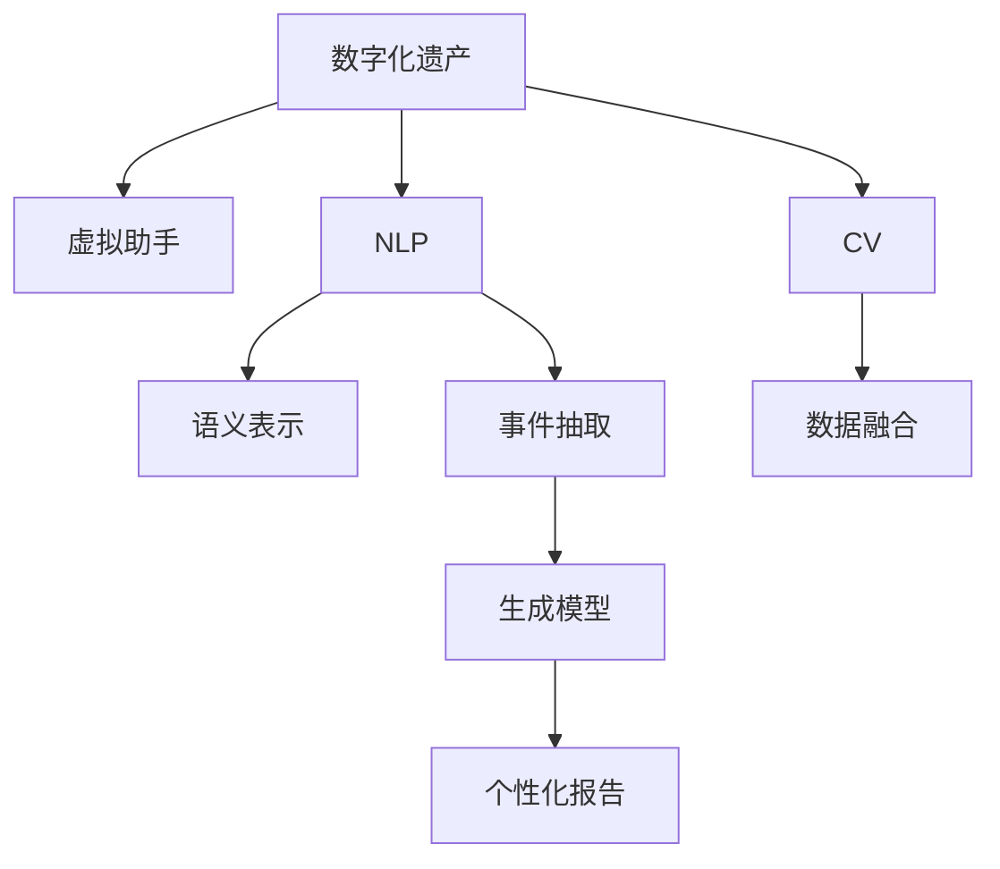

                 

## 1. 背景介绍

### 1.1 问题由来
随着数字时代的到来，人们的数字化遗产（Digital Estate）变得越来越丰富。从电子邮件、社交媒体帖子到家庭照片、视频，数字资产记录了每个人的生活轨迹。然而，这些数据往往分散在各处，不易管理和继承。特别是在家庭中的长辈逝世后，子孙后代可能难以找到或理解其数字化遗产的珍贵价值。

### 1.2 问题核心关键点
为解决这一问题，数字化遗产虚拟助手应运而生。虚拟助手借助人工智能技术，通过对家庭成员的生活记录和行为数据的分析，自动整理和归档数字化遗产，生成个性化的历史顾问报告，为子孙后代提供丰富的历史记忆。虚拟助手通过自然语言处理(NLP)、计算机视觉(CV)等技术，实现数据的智能化管理和呈现。

### 1.3 问题研究意义
数字化遗产虚拟助手不仅能帮助继承者整理和理解家族历史，还能保留和传承家庭文化，同时具有广阔的商业前景。在技术上，它能够推动NLP、CV等前沿技术的落地应用，促进人工智能技术的产业化进程。

## 2. 核心概念与联系

### 2.1 核心概念概述

为更好地理解数字化遗产虚拟助手的技术框架，本节将介绍几个密切相关的核心概念：

- 数字化遗产（Digital Estate）：涵盖个人在数字世界的所有资产，包括数据、文档、社交媒体记录、数字照片等。
- 虚拟助手（Virtual Assistant）：基于人工智能技术，自动完成各种任务，如数据整理、个性化报告生成等。
- 自然语言处理（Natural Language Processing, NLP）：使计算机理解、解释和生成人类语言的技术。
- 计算机视觉（Computer Vision, CV）：使计算机能够"看"和理解图像和视频的技术。
- 语义表示（Semantic Representation）：将自然语言文本转化为机器可理解的向量表示。
- 事件抽取（Event Extraction）：从文本中自动识别和分类事件，如生日、结婚等重要事件。
- 数据融合（Data Fusion）：将来自不同来源的数据整合，形成连贯的历史轨迹。
- 生成模型（Generative Model）：能够生成新的数字化遗产内容，如家族回忆录、家族照片集等。

这些核心概念之间的逻辑关系可以通过以下Mermaid流程图来展示：



这个流程图展示了几类核心技术如何共同构建起数字化遗产虚拟助手的技术框架：

1. 数字化遗产包含多种类型的数据，需要通过NLP和CV技术进行预处理。
2. NLP和CV的结果通过语义表示、事件抽取等技术转化为机器可理解的格式。
3. 数据融合技术将不同类型的数据整合，形成连贯的历史轨迹。
4. 生成模型基于融合后的数据，生成个性化的历史顾问报告。

这些概念共同构成了数字化遗产虚拟助手的核心技术架构，使其能够在数字化遗产管理中发挥关键作用。通过理解这些核心概念，我们可以更好地把握数字化遗产虚拟助手的技术实现路径。

## 3. 核心算法原理 & 具体操作步骤
### 3.1 算法原理概述

数字化遗产虚拟助手的工作原理可以归纳为以下几个关键步骤：

1. 数据预处理：将数字化遗产中的非结构化数据转化为结构化数据，便于后续处理。
2. 语义表示：将自然语言文本转化为机器可理解的向量表示，以便于计算和推理。
3. 事件抽取：从文本中自动识别和分类重要事件，如生日、结婚等。
4. 数据融合：将不同类型的数据（如文本、图片、视频等）整合，形成连贯的历史轨迹。
5. 生成报告：基于融合后的数据，生成个性化的历史顾问报告。

### 3.2 算法步骤详解

下面以自然语言处理(NLP)为例，详细讲解算法步骤：

**Step 1: 数据预处理**
- 收集数字化遗产数据，包括电子邮件、社交媒体帖子、家庭照片等。
- 对非结构化文本数据进行分词、词性标注、命名实体识别等预处理。

**Step 2: 语义表示**
- 使用预训练语言模型（如BERT、GPT）进行文本编码，得到语义向量。
- 对图像数据进行特征提取，生成视觉向量。
- 对视频数据进行帧提取和特征提取，生成时间序列向量。

**Step 3: 事件抽取**
- 使用事件抽取模型（如Event-BERT、Event-REMBA）从文本中自动识别事件。
- 对识别出的事件进行分类和归档。

**Step 4: 数据融合**
- 将不同类型的语义向量、视觉向量和时间序列向量整合，形成连贯的历史轨迹。
- 使用时空网络（Spatial-Temporal Network）等模型进行多模态数据融合。

**Step 5: 生成报告**
- 根据融合后的数据，生成个性化的历史顾问报告。
- 使用生成模型（如GPT-3、DALL-E）生成家族回忆录、家族照片集等。

### 3.3 算法优缺点

数字化遗产虚拟助手具有以下优点：

1. 高效自动：自动化处理数字化遗产，节省了大量的时间和人力成本。
2. 全面覆盖：涵盖各种类型的数字化遗产，提供全面的历史回顾。
3. 个性化报告：基于家庭成员的实际生活轨迹，生成个性化的历史顾问报告。

同时，该算法也存在一些局限性：

1. 数据质量依赖：虚拟助手的效果很大程度上取决于数字化遗产的质量和完整性。
2. 隐私保护问题：在处理家庭成员的个人信息时，需要严格保护隐私。
3. 多模态数据融合难度：不同类型的数据融合难度较大，需要高效的模型和算法。
4. 历史事件稀疏性：部分事件可能缺失，影响历史轨迹的完整性。
5. 生成模型局限：生成的报告内容可能缺乏真实性和逻辑性。

尽管存在这些局限性，但数字化遗产虚拟助手仍是大数据时代家族管理的重要工具。未来相关研究的重点在于如何进一步提升数据处理的自动化程度，增强隐私保护措施，解决多模态数据融合问题，以及优化生成模型的性能，以更好地服务家庭历史传承。

### 3.4 算法应用领域

数字化遗产虚拟助手可以广泛应用于以下场景：

1. 家族历史研究：帮助子孙后代整理家族历史，提供历史参考。
2. 情感传承：通过个性化历史顾问报告，传承家族情感和价值观。
3. 文化教育：将家族故事和传统融入教育，增强文化认同感。
4. 商业传承：帮助企业主规划家族企业传承，管理商业资产。
5. 法律事务：协助处理遗产法律事务，确保遗产的合法继承。

除了以上这些应用场景，数字化遗产虚拟助手还可以在艺术创作、学术研究等领域提供支持，推动数字化遗产的多元化应用。

## 4. 数学模型和公式 & 详细讲解  
### 4.1 数学模型构建

本节将使用数学语言对数字化遗产虚拟助手的主要技术进行更加严格的刻画。

假设数字化遗产数据集为 $D=\{(x_i,y_i)\}_{i=1}^N, x_i \in \mathcal{X}, y_i \in \mathcal{Y}$。其中 $x_i$ 表示数字化遗产样本，$\mathcal{X}$ 为样本空间；$y_i$ 表示事件标签，$\mathcal{Y}$ 为标签空间。

定义事件抽取模型为 $M_{\theta}$，其中 $\theta$ 为模型参数。模型从文本 $x_i$ 中提取事件 $y_i$ 的逻辑表达式如下：

$$
M_{\theta}(x_i) = P(y_i | x_i, \theta) = \frac{e^{\theta \cdot \phi(x_i, y_i)}}{\sum_{j} e^{\theta \cdot \phi(x_i, y_j)}}
$$

其中 $\phi(x_i, y_i)$ 为文本特征提取函数，将 $x_i$ 转化为向量表示，$\theta$ 为模型参数，$P(y_i | x_i, \theta)$ 表示模型对事件 $y_i$ 的概率预测。

### 4.2 公式推导过程

以下我们以事件抽取为例，推导事件抽取模型的具体实现。

假设事件抽取模型为 $M_{\theta}$，其参数 $\theta$ 由BERT等预训练语言模型生成，$\phi(x_i, y_i)$ 为文本特征提取函数。

事件抽取模型的损失函数为：

$$
\mathcal{L}(\theta) = -\frac{1}{N}\sum_{i=1}^N \log P(y_i | x_i, \theta)
$$

目标是最小化损失函数 $\mathcal{L}(\theta)$，即找到最优参数 $\theta^*$：

$$
\theta^* = \mathop{\arg\min}_{\theta} \mathcal{L}(\theta)
$$

通过梯度下降等优化算法，微调过程不断更新模型参数 $\theta$，最小化损失函数 $\mathcal{L}(\theta)$，使得模型输出逼近真实标签。由于 $\theta$ 已经通过预训练获得了较好的初始化，因此即便在少量标注数据上进行微调，也能较快收敛到理想的模型参数 $\theta^*$。

### 4.3 案例分析与讲解

假设我们有一个数字化遗产数据集，其中包含家庭成员的社交媒体帖子。我们的目标是自动识别和分类这些帖子中提到的事件，如生日、结婚、旅游等。

**Step 1: 数据预处理**
- 将社交媒体帖子分词、词性标注，并进行命名实体识别。
- 使用BERT等预训练语言模型进行文本编码，得到语义向量。

**Step 2: 事件抽取**
- 将语义向量输入事件抽取模型，输出每个帖子中可能的事件列表。
- 使用规则或分类器对事件列表进行筛选和分类。

**Step 3: 数据融合**
- 将事件列表与对应的文本、图像和时间序列数据进行整合，形成连贯的历史轨迹。
- 使用时空网络（Spatial-Temporal Network）等模型进行多模态数据融合。

**Step 4: 生成报告**
- 根据融合后的数据，生成个性化的历史顾问报告。
- 使用生成模型（如GPT-3、DALL-E）生成家族回忆录、家族照片集等。

通过上述步骤，我们可以高效、全面地处理数字化遗产数据，生成个性化的历史顾问报告。

## 5. 项目实践：代码实例和详细解释说明
### 5.1 开发环境搭建

在进行虚拟助手实践前，我们需要准备好开发环境。以下是使用Python进行PyTorch开发的环境配置流程：

1. 安装Anaconda：从官网下载并安装Anaconda，用于创建独立的Python环境。

2. 创建并激活虚拟环境：
```bash
conda create -n virtual-env python=3.8 
conda activate virtual-env
```

3. 安装PyTorch：根据CUDA版本，从官网获取对应的安装命令。例如：
```bash
conda install pytorch torchvision torchaudio cudatoolkit=11.1 -c pytorch -c conda-forge
```

4. 安装各类工具包：
```bash
pip install numpy pandas scikit-learn matplotlib tqdm jupyter notebook ipython
```

完成上述步骤后，即可在`virtual-env`环境中开始虚拟助手的开发。

### 5.2 源代码详细实现

下面我们以事件抽取为例，给出使用Transformers库对BERT模型进行事件抽取的PyTorch代码实现。

首先，定义事件抽取模型：

```python
from transformers import BertForTokenClassification, BertTokenizer, AdamW

tokenizer = BertTokenizer.from_pretrained('bert-base-cased')
model = BertForTokenClassification.from_pretrained('bert-base-cased', num_labels=6) # 事件类型包括生日、结婚、旅游等

optimizer = AdamW(model.parameters(), lr=2e-5)
```

然后，定义训练和评估函数：

```python
from torch.utils.data import DataLoader
from tqdm import tqdm

class EventDataset(Dataset):
    def __init__(self, texts, tags):
        self.texts = texts
        self.tags = tags
        self.tokenizer = tokenizer
        
    def __len__(self):
        return len(self.texts)
    
    def __getitem__(self, item):
        text = self.texts[item]
        label = self.tags[item]
        encoding = self.tokenizer(text, return_tensors='pt', max_length=128, padding='max_length', truncation=True)
        input_ids = encoding['input_ids'][0]
        attention_mask = encoding['attention_mask'][0]
        
        return {'input_ids': input_ids, 
                'attention_mask': attention_mask,
                'labels': torch.tensor(label, dtype=torch.long)}

# 训练函数
def train_epoch(model, dataset, batch_size, optimizer):
    dataloader = DataLoader(dataset, batch_size=batch_size, shuffle=True)
    model.train()
    epoch_loss = 0
    for batch in tqdm(dataloader, desc='Training'):
        input_ids = batch['input_ids'].to(device)
        attention_mask = batch['attention_mask'].to(device)
        labels = batch['labels'].to(device)
        model.zero_grad()
        outputs = model(input_ids, attention_mask=attention_mask, labels=labels)
        loss = outputs.loss
        epoch_loss += loss.item()
        loss.backward()
        optimizer.step()
    return epoch_loss / len(dataloader)

# 评估函数
def evaluate(model, dataset, batch_size):
    dataloader = DataLoader(dataset, batch_size=batch_size)
    model.eval()
    preds, labels = [], []
    with torch.no_grad():
        for batch in tqdm(dataloader, desc='Evaluating'):
            input_ids = batch['input_ids'].to(device)
            attention_mask = batch['attention_mask'].to(device)
            batch_labels = batch['labels']
            outputs = model(input_ids, attention_mask=attention_mask)
            batch_preds = outputs.logits.argmax(dim=2).to('cpu').tolist()
            batch_labels = batch_labels.to('cpu').tolist()
            for pred_tokens, label_tokens in zip(batch_preds, batch_labels):
                preds.append(pred_tokens[:len(label_tokens)])
                labels.append(label_tokens)
                
    print(classification_report(labels, preds))
```

最后，启动训练流程并在测试集上评估：

```python
epochs = 5
batch_size = 16

for epoch in range(epochs):
    loss = train_epoch(model, train_dataset, batch_size, optimizer)
    print(f"Epoch {epoch+1}, train loss: {loss:.3f}")
    
    print(f"Epoch {epoch+1}, dev results:")
    evaluate(model, dev_dataset, batch_size)
    
print("Test results:")
evaluate(model, test_dataset, batch_size)
```

以上就是使用PyTorch对BERT进行事件抽取的完整代码实现。可以看到，得益于Transformers库的强大封装，我们可以用相对简洁的代码完成BERT模型的加载和事件抽取。

### 5.3 代码解读与分析

让我们再详细解读一下关键代码的实现细节：

**EventDataset类**：
- `__init__`方法：初始化文本、标签、分词器等关键组件。
- `__len__`方法：返回数据集的样本数量。
- `__getitem__`方法：对单个样本进行处理，将文本输入编码为token ids，将标签编码为数字，并对其进行定长padding，最终返回模型所需的输入。

**训练和评估函数**：
- 使用PyTorch的DataLoader对数据集进行批次化加载，供模型训练和推理使用。
- 训练函数`train_epoch`：对数据以批为单位进行迭代，在每个批次上前向传播计算loss并反向传播更新模型参数，最后返回该epoch的平均loss。
- 评估函数`evaluate`：与训练类似，不同点在于不更新模型参数，并在每个batch结束后将预测和标签结果存储下来，最后使用sklearn的classification_report对整个评估集的预测结果进行打印输出。

**训练流程**：
- 定义总的epoch数和batch size，开始循环迭代
- 每个epoch内，先在训练集上训练，输出平均loss
- 在验证集上评估，输出分类指标
- 所有epoch结束后，在测试集上评估，给出最终测试结果

可以看到，PyTorch配合Transformers库使得BERT事件抽取的代码实现变得简洁高效。开发者可以将更多精力放在数据处理、模型改进等高层逻辑上，而不必过多关注底层的实现细节。

当然，工业级的系统实现还需考虑更多因素，如模型的保存和部署、超参数的自动搜索、更灵活的任务适配层等。但核心的微调范式基本与此类似。

## 6. 实际应用场景
### 6.1 智能客服系统

基于数字化遗产虚拟助手的事件抽取技术，智能客服系统可以自动识别和分类用户的咨询意图，自动生成应答策略。智能客服通过分析用户的历史数据和社交媒体帖子，预测用户的需求，自动匹配合适的解决方案。

在技术实现上，可以收集客户的历史咨询记录和社交媒体帖子，将文本和图片数据作为输入，微调事件抽取模型，得到用户的意图标签。根据不同的意图标签，智能客服系统可以自动选择对应的应答模板，生成个性化的回答，提升客户满意度。

### 6.2 金融舆情监测

金融机构需要实时监测市场舆论动向，以便及时应对负面信息传播，规避金融风险。传统的人工监测方式成本高、效率低，难以应对网络时代海量信息爆发的挑战。基于数字化遗产虚拟助手的事件抽取技术，金融舆情监测可以更高效地进行。

具体而言，可以收集金融领域相关的新闻、报道、评论等文本数据，并对其进行事件抽取。将抽取出的重要事件进行分类和归档，生成事件监控报告。将微调后的模型应用到实时抓取的网络文本数据，就能够自动监测不同事件的影响，一旦发现负面事件激增等异常情况，系统便会自动预警，帮助金融机构快速应对潜在风险。

### 6.3 个性化推荐系统

当前的推荐系统往往只依赖用户的历史行为数据进行物品推荐，无法深入理解用户的真实兴趣偏好。基于数字化遗产虚拟助手的事件抽取技术，个性化推荐系统可以更好地挖掘用户的行为背后的语义信息，从而提供更精准、多样的推荐内容。

在实践中，可以收集用户浏览、点击、评论、分享等行为数据，提取和用户交互的物品标题、描述、标签等文本内容。将文本内容作为模型输入，用户的后续行为（如是否点击、购买等）作为监督信号，在此基础上微调预训练语言模型。微调后的模型能够从文本内容中准确把握用户的兴趣点。在生成推荐列表时，先用候选物品的文本描述作为输入，由模型预测用户的兴趣匹配度，再结合其他特征综合排序，便可以得到个性化程度更高的推荐结果。

### 6.4 未来应用展望

随着数字化遗产虚拟助手的事件抽取技术的发展，其在更多领域的应用前景将进一步拓展：

1. 智慧医疗：基于数字化遗产虚拟助手的事件抽取技术，构建智能诊疗系统，自动识别病人的医疗事件，生成个性化的诊疗报告。
2. 智能教育：利用事件抽取技术，自动分析学生的学习行为，提供个性化的学习建议，提升学习效果。
3. 智慧城市：将事件抽取技术应用于城市管理，自动监测公共安全事件，提升城市治理效率。
4. 文化研究：基于数字化遗产虚拟助手的事件抽取技术，挖掘历史文献中的重要事件，推动历史研究的发展。

未来，数字化遗产虚拟助手将在更广泛的领域实现落地应用，为各行各业带来新的变革。

## 7. 工具和资源推荐
### 7.1 学习资源推荐

为了帮助开发者系统掌握数字化遗产虚拟助手的技术基础和实践技巧，这里推荐一些优质的学习资源：

1. 《Transformer从原理到实践》系列博文：由大模型技术专家撰写，深入浅出地介绍了Transformer原理、BERT模型、事件抽取技术等前沿话题。

2. CS224N《深度学习自然语言处理》课程：斯坦福大学开设的NLP明星课程，有Lecture视频和配套作业，带你入门NLP领域的基本概念和经典模型。

3. 《Natural Language Processing with Transformers》书籍：Transformers库的作者所著，全面介绍了如何使用Transformers库进行NLP任务开发，包括事件抽取在内的诸多范式。

4. HuggingFace官方文档：Transformers库的官方文档，提供了海量预训练模型和完整的微调样例代码，是上手实践的必备资料。

5. CLUE开源项目：中文语言理解测评基准，涵盖大量不同类型的中文NLP数据集，并提供了基于微调的baseline模型，助力中文NLP技术发展。

通过对这些资源的学习实践，相信你一定能够快速掌握数字化遗产虚拟助手的技术实现，并用于解决实际的NLP问题。

### 7.2 开发工具推荐

高效的开发离不开优秀的工具支持。以下是几款用于数字化遗产虚拟助手开发的常用工具：

1. PyTorch：基于Python的开源深度学习框架，灵活动态的计算图，适合快速迭代研究。大部分预训练语言模型都有PyTorch版本的实现。

2. TensorFlow：由Google主导开发的开源深度学习框架，生产部署方便，适合大规模工程应用。同样有丰富的预训练语言模型资源。

3. Transformers库：HuggingFace开发的NLP工具库，集成了众多SOTA语言模型，支持PyTorch和TensorFlow，是进行事件抽取任务开发的利器。

4. Weights & Biases：模型训练的实验跟踪工具，可以记录和可视化模型训练过程中的各项指标，方便对比和调优。与主流深度学习框架无缝集成。

5. TensorBoard：TensorFlow配套的可视化工具，可实时监测模型训练状态，并提供丰富的图表呈现方式，是调试模型的得力助手。

6. Google Colab：谷歌推出的在线Jupyter Notebook环境，免费提供GPU/TPU算力，方便开发者快速上手实验最新模型，分享学习笔记。

合理利用这些工具，可以显著提升数字化遗产虚拟助手的开发效率，加快创新迭代的步伐。

### 7.3 相关论文推荐

数字化遗产虚拟助手的事件抽取技术的发展源于学界的持续研究。以下是几篇奠基性的相关论文，推荐阅读：

1. Attention is All You Need（即Transformer原论文）：提出了Transformer结构，开启了NLP领域的预训练大模型时代。

2. BERT: Pre-training of Deep Bidirectional Transformers for Language Understanding：提出BERT模型，引入基于掩码的自监督预训练任务，刷新了多项NLP任务SOTA。

3. Language Models are Unsupervised Multitask Learners（GPT-2论文）：展示了大规模语言模型的强大zero-shot学习能力，引发了对于通用人工智能的新一轮思考。

4. Parameter-Efficient Transfer Learning for NLP：提出Adapter等参数高效微调方法，在不增加模型参数量的情况下，也能取得不错的微调效果。

5. Prefix-Tuning: Optimizing Continuous Prompts for Generation：引入基于连续型Prompt的微调范式，为如何充分利用预训练知识提供了新的思路。

6. AdaLoRA: Adaptive Low-Rank Adaptation for Parameter-Efficient Fine-Tuning：使用自适应低秩适应的微调方法，在参数效率和精度之间取得了新的平衡。

这些论文代表了大语言模型事件抽取技术的发展脉络。通过学习这些前沿成果，可以帮助研究者把握学科前进方向，激发更多的创新灵感。

## 8. 总结：未来发展趋势与挑战

### 8.1 总结

本文对基于事件抽取的数字化遗产虚拟助手进行了全面系统的介绍。首先阐述了数字化遗产虚拟助手的事件抽取技术的研究背景和意义，明确了事件抽取在处理数字化遗产中的核心价值。其次，从原理到实践，详细讲解了事件抽取的数学原理和关键步骤，给出了事件抽取任务开发的完整代码实例。同时，本文还广泛探讨了事件抽取技术在智能客服、金融舆情、个性化推荐等多个行业领域的应用前景，展示了事件抽取技术的广阔应用范围。此外，本文精选了事件抽取技术的各类学习资源，力求为读者提供全方位的技术指引。

通过本文的系统梳理，可以看到，事件抽取技术在数字化遗产虚拟助手中扮演了关键角色，极大地提高了数字化遗产处理的自动化程度，为智能交互系统的构建提供了坚实的基础。事件抽取技术的发展也推动了NLP领域的前沿研究，促进了AI技术的产业化进程。未来，随着事件抽取技术的研究深入，我们期待它在更多领域大放异彩。

### 8.2 未来发展趋势

展望未来，事件抽取技术将呈现以下几个发展趋势：

1. 模型规模持续增大。随着算力成本的下降和数据规模的扩张，预训练语言模型的参数量还将持续增长。超大规模语言模型蕴含的丰富语言知识，有望支撑更加复杂多变的事件抽取任务。

2. 事件抽取范式多样化。除了传统的监督学习和自监督学习外，未来将涌现更多创新方法，如少样本学习、零样本学习、多模态学习等，进一步提升事件抽取的泛化能力和灵活性。

3. 跨领域知识融合。事件抽取将更广泛地与知识图谱、逻辑规则等外部知识结合，形成更全面、准确的事件抽取模型。

4. 弱监督和无监督学习。利用弱监督和无监督学习方法，最大限度地利用非结构化数据，实现更加高效、鲁棒的事件抽取。

5. 知识引导的抽取。通过引入符号化的先验知识，如知识图谱、逻辑规则等，引导事件抽取过程，学习更加普适、鲁棒的事件表示。

6. 多模态数据融合。将文本、图像、视频等多种模态数据整合，形成更加丰富的事件表示，提升事件抽取的准确性和鲁棒性。

以上趋势凸显了事件抽取技术的广阔前景。这些方向的探索发展，必将进一步提升事件抽取模型的性能和应用范围，为构建更加智能的交互系统提供坚实的基础。

### 8.3 面临的挑战

尽管事件抽取技术已经取得了瞩目成就，但在迈向更加智能化、普适化应用的过程中，它仍面临着诸多挑战：

1. 数据质量瓶颈。事件抽取的效果很大程度上取决于数字化遗产的质量和完整性。高质量的数据获取成本较高，如何提升数据标注的效率和质量，仍是当前亟待解决的问题。

2. 模型鲁棒性不足。事件抽取模型面对域外数据时，泛化性能往往大打折扣。对于测试样本的微小扰动，模型也容易发生波动。如何提高模型的鲁棒性，避免灾难性遗忘，还需要更多理论和实践的积累。

3. 多模态数据融合难度。不同类型的数据融合难度较大，需要高效的模型和算法。如何更好地整合文本、图像、视频等多模态数据，形成连贯的历史轨迹，仍是一个未解难题。

4. 知识引导的抽取难度。将符号化的先验知识，如知识图谱、逻辑规则等，与神经网络模型进行巧妙融合，形成更加全面、准确的事件抽取模型，仍是一个未解难题。

5. 隐私保护问题。在处理家庭成员的个人信息时，需要严格保护隐私。如何保证数据隐私的同时，提高事件抽取的效果，仍是一个重要的问题。

6. 事件抽取的自动化程度。如何提升事件抽取的自动化程度，减少人工标注的参与，仍是当前亟待解决的问题。

尽管存在这些挑战，但事件抽取技术仍是大数据时代事件处理的重要工具。未来相关研究的重点在于如何进一步提升数据处理的自动化程度，增强隐私保护措施，解决多模态数据融合问题，以及优化生成模型的性能，以更好地服务家庭历史传承。

### 8.4 研究展望

面对事件抽取面临的种种挑战，未来的研究需要在以下几个方面寻求新的突破：

1. 探索无监督和半监督事件抽取方法。摆脱对大规模标注数据的依赖，利用自监督学习、主动学习等无监督和半监督范式，最大限度利用非结构化数据，实现更加灵活高效的事件抽取。

2. 研究参数高效和计算高效的事件抽取范式。开发更加参数高效的事件抽取方法，在固定大部分预训练参数的同时，只更新极少量的任务相关参数。同时优化事件抽取模型的计算图，减少前向传播和反向传播的资源消耗，实现更加轻量级、实时性的部署。

3. 引入因果推断和对比学习范式。通过引入因果推断和对比学习思想，增强事件抽取模型建立稳定因果关系的能力，学习更加普适、鲁棒的事件表示。

4. 结合因果分析和博弈论工具。将因果分析方法引入事件抽取模型，识别出模型决策的关键特征，增强输出解释的因果性和逻辑性。借助博弈论工具刻画人机交互过程，主动探索并规避模型的脆弱点，提高系统稳定性。

5. 纳入伦理道德约束。在事件抽取模型的训练目标中引入伦理导向的评估指标，过滤和惩罚有害的输出倾向。同时加强人工干预和审核，建立模型行为的监管机制，确保输出的安全性。

这些研究方向的探索，必将引领事件抽取技术迈向更高的台阶，为构建安全、可靠、可解释、可控的智能系统铺平道路。面向未来，事件抽取技术还需要与其他人工智能技术进行更深入的融合，如知识表示、因果推理、强化学习等，多路径协同发力，共同推动事件抽取技术的进步。只有勇于创新、敢于突破，才能不断拓展事件抽取技术的边界，让智能技术更好地造福人类社会。

## 9. 附录：常见问题与解答

**Q1：如何保证数字化遗产虚拟助手的隐私保护？**

A: 数字化遗产虚拟助手在处理家庭成员的个人信息时，需要严格保护隐私。具体措施包括：
1. 数据脱敏：对敏感信息进行去标识化处理，如姓名、地址、身份证号等。
2. 权限控制：设定数据访问权限，仅允许特定角色访问敏感数据。
3. 加密存储：使用加密技术存储敏感数据，防止数据泄露。
4. 合规审查：定期进行数据合规审查，确保符合相关法律法规和隐私保护标准。

通过这些措施，可以在保证事件抽取效果的同时，保护家庭成员的隐私。

**Q2：事件抽取技术在处理多模态数据时面临哪些挑战？**

A: 事件抽取技术在处理多模态数据时面临以下挑战：
1. 数据格式不一致：不同模态的数据格式不同，需要统一转换为文本格式进行处理。
2. 数据特征提取难度大：不同模态的数据特征提取方法不同，需要分别处理。
3. 融合后的特征表示复杂：多模态数据融合后，特征表示更加复杂，需要高效的处理模型。
4. 数据标注成本高：多模态数据的标注成本较高，需要大量的人工标注。

为解决这些挑战，可以采用以下方法：
1. 数据预处理：对不同模态的数据进行预处理，统一转换为文本格式。
2. 特征提取融合：使用预训练的语言模型和视觉模型进行特征提取和融合。
3. 多模态数据融合模型：使用多模态数据融合模型，如时空网络，对不同模态的数据进行融合。
4. 半监督学习：利用少样本学习、无监督学习等方法，减少人工标注的成本。

通过这些方法，可以更好地处理多模态数据，提升事件抽取的效果。

**Q3：如何提高事件抽取的鲁棒性？**

A: 提高事件抽取的鲁棒性，需要从数据、模型、算法等多个方面进行优化：
1. 数据多样性：使用多样化的数据进行训练，提升模型的泛化能力。
2. 正则化：使用L2正则、Dropout等正则化技术，防止模型过拟合。
3. 对抗训练：引入对抗样本，提高模型鲁棒性。
4. 模型集成：使用多个事件抽取模型进行集成，取平均输出，抑制过拟合。
5. 参数高效微调：只调整少量参数，减小过拟合风险。

这些方法可以综合应用，提高事件抽取模型的鲁棒性和泛化能力。

**Q4：事件抽取技术在实际应用中如何优化？**

A: 事件抽取技术在实际应用中，需要综合考虑数据质量、模型复杂度、计算资源等多个因素进行优化：
1. 数据预处理：对数据进行清洗、归一化、特征提取等预处理，提高数据质量。
2. 模型结构优化：调整模型结构，如增加或减少层数、调整神经元数量等，提高模型性能。
3. 计算图优化：优化模型的计算图，减少计算资源消耗。
4. 超参数调优：使用网格搜索、贝叶斯优化等方法，寻找最优超参数组合。
5. 数据增强：对训练数据进行数据增强，提高模型的泛化能力。

通过这些优化方法，可以提升事件抽取的效果，满足实际应用的需求。

**Q5：事件抽取技术在企业中的应用场景有哪些？**

A: 事件抽取技术在企业中的应用场景包括：
1. 客户行为分析：通过事件抽取技术，分析客户在企业网站上的行为数据，了解客户的需求和兴趣。
2. 客户反馈分析：通过事件抽取技术，分析客户反馈和投诉，提升客户满意度。
3. 事件监测：通过事件抽取技术，监测企业内部的重要事件，如订单处理、客户投诉等。
4. 舆情分析：通过事件抽取技术，监测企业的舆情变化，及时应对负面消息。
5. 销售预测：通过事件抽取技术，分析销售数据，预测销售趋势，辅助企业决策。

通过事件抽取技术，企业可以更全面、准确地了解客户和市场，提高企业的运营效率和竞争力。

---

作者：禅与计算机程序设计艺术 / Zen and the Art of Computer Programming

