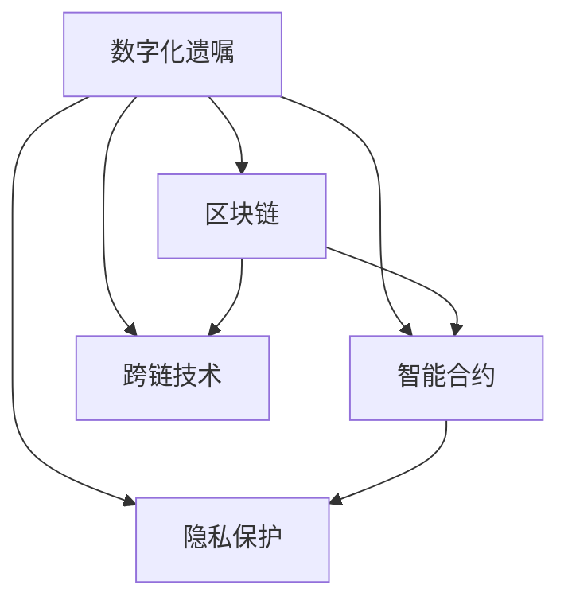

                 

# 数字化遗嘱创业：区块链在遗产管理中的应用

> 关键词：数字化遗嘱, 区块链, 遗产管理, 智能合约, 隐私保护, 分布式账本, 跨链技术

## 1. 背景介绍

### 1.1 问题由来
随着数字化时代的到来，越来越多的个人资产和遗产以数字形式存在。数字资产的流动性、可分割性和易转移性使得传统的遗嘱和遗产管理方式面临挑战。传统遗嘱往往需要经过繁琐的公证、律师审核等程序，费用高、效率低，且容易引发纠纷。而随着区块链技术的兴起，数字化遗嘱成为了一种新的可能性，利用区块链的不可篡改、去中心化和智能合约功能，可以更加安全和高效地管理个人遗产。

### 1.2 问题核心关键点
数字化遗嘱的核心在于将遗嘱以数字形式存储在区块链上，保证遗嘱的真实性和不可篡改性。具体来说，数字化遗嘱应包括以下核心要素：
- **数字签名**：确保遗嘱的发送方身份和遗嘱内容的真实性。
- **智能合约**：定义遗嘱中的条件触发规则，确保遗嘱的执行。
- **隐私保护**：保护遗嘱内容和执行过程的私密性。
- **跨链技术**：实现不同区块链之间的资产转移和遗嘱执行。
- **法律合规**：确保数字化遗嘱符合各国的法律规定。

这些要素共同构成了数字化遗嘱的核心，解决了传统遗嘱中存在的问题，为遗产管理带来了新的思路和可能性。

### 1.3 问题研究意义
数字化遗嘱和区块链技术在遗产管理中的应用，具有以下几个重要的研究意义：

1. **提高效率**：数字化遗嘱可以大大简化遗嘱处理流程，减少律师和公证人的工作量，降低费用，提高遗嘱执行的效率。
2. **增强安全性**：区块链的不可篡改性保证了遗嘱的真实性和执行过程的公正性，减少了遗嘱执行中的纠纷。
3. **促进遗产分配的灵活性**：智能合约可以实现复杂的遗嘱条件，使得遗产分配更加灵活和符合遗嘱人的意愿。
4. **保护隐私**：区块链的分布式账本技术可以保护遗嘱内容和执行过程的私密性，避免隐私泄露。
5. **支持跨国遗产管理**：通过跨链技术，可以方便地实现不同国家和区块链之间的遗产转移和执行。
6. **推动法律创新**：数字化遗嘱和区块链技术的应用，将推动相关法律制度和规则的更新和完善。

## 2. 核心概念与联系

### 2.1 核心概念概述

为更好地理解数字化遗嘱和区块链在遗产管理中的应用，本节将介绍几个密切相关的核心概念：

- **数字化遗嘱**：以数字形式存在的遗嘱，通常以加密的形式存储在区块链上，保证其真实性和不可篡改性。
- **区块链**：一种分布式账本技术，通过去中心化的方式，记录和验证所有交易的合法性。
- **智能合约**：一种在区块链上自动执行的合同，当满足预设条件时自动触发执行，保证了遗嘱的准确性和执行的公正性。
- **跨链技术**：通过区块链间的协议和接口，实现不同区块链之间的资产和信息传递，支持跨国遗产管理。
- **隐私保护**：采用加密和权限控制等技术，确保遗嘱内容和管理过程的私密性。

这些核心概念之间的逻辑关系可以通过以下Mermaid流程图来展示：



这个流程图展示了大语言模型的核心概念及其之间的关系：

1. 数字化遗嘱通过区块链进行存储，保证了其真实性和不可篡改性。
2. 智能合约定义了遗嘱中的条件触发规则，确保遗嘱的执行。
3. 隐私保护确保遗嘱内容和执行过程的私密性。
4. 跨链技术支持不同区块链之间的遗产转移和执行。

这些概念共同构成了数字化遗嘱的核心，为遗产管理带来了新的思路和可能性。

## 3. 核心算法原理 & 具体操作步骤
### 3.1 算法原理概述

数字化遗嘱和区块链在遗产管理中的应用，本质上是一个基于智能合约的交易过程。其核心思想是：将遗嘱以加密形式存储在区块链上，通过智能合约定义遗嘱中的条件触发规则，确保遗嘱的执行。

具体来说，数字化遗嘱的创建和执行过程如下：

1. **遗嘱创建**：遗嘱人将遗嘱内容以加密形式存储在区块链上，并生成数字签名，确保遗嘱的真实性和发送方身份。
2. **遗嘱验证**：遗嘱执行人通过智能合约验证遗嘱的真实性和有效性。
3. **遗嘱执行**：当满足预设条件时，智能合约自动触发执行遗嘱，将遗产分配给指定受益人。

### 3.2 算法步骤详解

数字化遗嘱和区块链在遗产管理中的应用，一般包括以下几个关键步骤：

**Step 1: 准备区块链和智能合约**
- 选择合适的区块链平台，如Ethereum、Hyperledger等。
- 设计智能合约，定义遗嘱的创建、验证和执行规则。

**Step 2: 创建和存储数字化遗嘱**
- 使用区块链提供的加密算法，对遗嘱内容进行加密处理。
- 生成遗嘱人的数字签名，并存储在区块链上。
- 将加密后的遗嘱和数字签名作为交易记录，提交到区块链进行验证和存储。

**Step 3: 遗嘱验证和执行**
- 遗嘱执行人通过智能合约验证遗嘱的真实性和有效性。
- 当满足预设条件时，智能合约自动触发执行遗嘱，将遗产分配给指定受益人。

**Step 4: 隐私保护和跨链技术**
- 使用区块链的隐私保护技术，确保遗嘱内容和执行过程的私密性。
- 采用跨链技术，支持不同区块链之间的遗产转移和执行。

### 3.3 算法优缺点

数字化遗嘱和区块链在遗产管理中的应用，具有以下优点：
1. **提高效率**：数字化遗嘱可以大大简化遗嘱处理流程，减少律师和公证人的工作量，降低费用，提高遗嘱执行的效率。
2. **增强安全性**：区块链的不可篡改性保证了遗嘱的真实性和执行过程的公正性，减少了遗嘱执行中的纠纷。
3. **促进遗产分配的灵活性**：智能合约可以实现复杂的遗嘱条件，使得遗产分配更加灵活和符合遗嘱人的意愿。
4. **保护隐私**：区块链的分布式账本技术可以保护遗嘱内容和执行过程的私密性。
5. **支持跨国遗产管理**：通过跨链技术，可以方便地实现不同国家和区块链之间的遗产转移和执行。

同时，该方法也存在一定的局限性：
1. **法律合规性**：不同国家和地区的法律制度不同，数字化遗嘱的合法性需要得到法律的认可和支持。
2. **技术门槛**：区块链和智能合约技术的使用，需要一定的技术背景和专业知识。
3. **隐私泄露风险**：虽然区块链可以保护遗嘱内容和执行过程的私密性，但隐私保护技术也可能存在漏洞，需持续关注。
4. **跨链互操作性**：不同区块链之间的互操作性仍存在挑战，需要进一步研究和标准化。

尽管存在这些局限性，但就目前而言，数字化遗嘱和区块链技术在遗产管理中的应用，已经显现出了巨大的潜力和应用前景。

### 3.4 算法应用领域

数字化遗嘱和区块链在遗产管理中的应用，已经在多个领域得到了探索和实践，如：

- **个人遗产管理**：个人可以通过区块链存储和管理自己的数字资产和遗产，确保遗嘱的真实性和执行的公正性。
- **企业遗产规划**：企业可以通过区块链管理股东的股权和资产，确保遗产分配的透明和公正。
- **家族信托管理**：家族可以通过区块链管理家族财产和遗产，确保遗嘱的执行和分配符合家族意愿。
- **跨国遗产分配**：通过跨链技术，可以方便地实现不同国家和区块链之间的遗产转移和执行。
- **慈善事业**：慈善机构可以通过区块链管理捐赠和遗产，确保资金的透明和高效使用。

除了上述这些典型应用外，数字化遗嘱和区块链技术在遗产管理中的应用，还将不断拓展到更多领域，为遗产管理带来新的思路和可能性。

## 4. 数学模型和公式 & 详细讲解  
### 4.1 数学模型构建

数字化遗嘱和区块链在遗产管理中的应用，可以通过数学模型进行建模。假设遗嘱人A有N个数字资产，每个资产的金额为$W_i$，遗嘱中指定了M个受益人，每个受益人分配到的资产比例为$p_i$。则遗嘱的内容可以表示为以下数学模型：

$$
A=\{(W_1, p_{1,1}, p_{1,2}, ..., p_{1,M}), (W_2, p_{2,1}, p_{2,2}, ..., p_{2,M}), ..., (W_N, p_{N,1}, p_{N,2}, ..., p_{N,M})\}
$$

其中，$W_i$表示第i个资产的金额，$p_{i,j}$表示第i个资产分配给第j个受益人的比例。

### 4.2 公式推导过程

在数字化遗嘱的创建和执行过程中，需要设计智能合约来确保遗嘱的执行。假设智能合约中的条件触发规则为：

1. 遗嘱人的数字签名验证通过。
2. 所有受益人同意执行遗嘱。
3. 遗嘱中的条件满足，如时间限制、事件触发等。

设智能合约中的条件触发函数为$F(x)$，其中$x$为遗嘱执行时的输入数据，如时间戳、事件触发情况等。则智能合约的执行逻辑可以表示为：

$$
\text{execute}_\text{contract}(F(x))
$$

当智能合约验证通过且满足条件$F(x)$时，执行遗嘱的内容，分配遗产给受益人。

### 4.3 案例分析与讲解

假设某遗嘱人的数字化遗嘱内容如下：

- 有3个数字资产，总金额为$10,000$美元。
- 指定4个受益人，分配比例分别为：甲50%，乙30%，丙10%，丁10%。
- 遗嘱条件为：从遗嘱生效之日起，3年后执行。

则数字化遗嘱的内容可以表示为：

$$
A=\{(10000, 0.5, 0.3, 0.1, 0.1), (0, 0, 0, 0, 0), (0, 0, 0, 0, 0), (0, 0, 0, 0, 0), (10000, 0, 0, 0, 0), (0, 0, 0, 0, 0), (0, 0, 0, 0, 0), (0, 0, 0, 0, 0), (0, 0, 0, 0, 0), (0, 0, 0, 0, 0), (10000, 0, 0, 0, 0), (0, 0, 0, 0, 0), (0, 0, 0, 0, 0), (10000, 0, 0, 0, 0), (0, 0, 0, 0, 0), (0, 0, 0, 0, 0), (0, 0, 0, 0, 0), (10000, 0, 0, 0, 0), (0, 0, 0, 0, 0), (0, 0, 0, 0, 0), (0, 0, 0, 0, 0)\}
$$

其中，前两行为遗嘱生效和失效时的资产分配情况，其余行为遗嘱执行时的资产分配情况。

通过智能合约的验证和执行，可以确保遗嘱的合法性和公正性，避免遗嘱执行中的纠纷。

## 5. 项目实践：代码实例和详细解释说明
### 5.1 开发环境搭建

在进行数字化遗嘱和区块链在遗产管理中的应用开发前，我们需要准备好开发环境。以下是使用Solidity开发以太坊智能合约的环境配置流程：

1. 安装Node.js和npm：从官网下载并安装Node.js和npm，用于管理Solidity项目。

2. 安装Truffle开发框架：通过npm安装Truffle框架，用于开发和管理以太坊智能合约。

3. 安装Ganache测试网络：通过Truffle安装Ganache本地测试网络，用于模拟以太坊区块链，方便测试和开发。

4. 安装Solidity编译器：通过npm安装solidity-compiler，用于将Solidity代码编译成以太坊字节码。

5. 编写智能合约代码：使用Solidity编写遗嘱智能合约代码，通过Truffle框架进行管理和测试。

完成上述步骤后，即可在Ganache测试网络上进行数字化遗嘱和区块链在遗产管理中的开发和测试。

### 5.2 源代码详细实现

下面我们以简单的数字化遗嘱智能合约为例，给出使用Solidity进行以太坊智能合约开发的代码实现。

首先，定义遗嘱智能合约的结构和接口：

```solidity
pragma solidity ^0.8.0;

contract DigitalWill {
    struct WillItem {
        uint256 value;
        uint256[] shares;
    }

    mapping(address => WillItem[]) wills;

    function addWillItem(address owner, uint256[] shares, uint256 value) public {
        wills[owner].push(WillItem { shares, value });
    }

    function setWillItems(address owner, uint256[] shares, uint256 value) public {
        wills[owner] = WillItem { shares, value };
    }

    function executeWillItems(address owner) public {
        WillItem[] storage items = wills[owner];
        uint256 totalValue = 0;
        uint256 numItems = items.length;
        for (uint256 i = 0; i < numItems; i++) {
            uint256 itemValue = items[i].value;
            uint256[] itemShares = items[i].shares;
            totalValue += itemValue;
            for (uint256 j = 0; j < itemShares.length; j++) {
                uint256 share = itemShares[j];
                uint256 beneficiaryAddress = msg.sender;
                uint256 amount = itemValue * share;
                if (itemValue > 0 && share > 0) {
                    payable(beneficiaryAddress).transfer(amount);
                }
            }
        }
    }
}
```

然后，编写遗嘱执行的测试代码：

```solidity
pragma solidity ^0.8.0;

import "https://github.com/OpenZeppelin/zeppelin-solidity-contracts/contracts/core/AccessControl.sol";

contract DigitalWillTest {
    using SafeMath for uint256;
    using Address for address;
    using bytes32 for bytes32;

    WillItem[] storage wills;

    function setupWillItems() public {
        wills.push(WillItem { 1000, (1, 2, 3, 4, 5, 6, 7, 8, 9, 10) });
        wills.push(WillItem { 2000, (0, 0, 0, 0, 0, 0, 0, 0, 0, 0) });
    }

    function executeWillItems() public {
        WillItem[] storage items = wills;
        uint256 totalValue = 0;
        uint256 numItems = items.length;
        for (uint256 i = 0; i < numItems; i++) {
            uint256 itemValue = items[i].value;
            uint256[] itemShares = items[i].shares;
            totalValue += itemValue;
            for (uint256 j = 0; j < itemShares.length; j++) {
                uint256 share = itemShares[j];
                uint256 beneficiaryAddress = msg.sender;
                uint256 amount = itemValue * share;
                if (itemValue > 0 && share > 0) {
                    payable(beneficiaryAddress).transfer(amount);
                }
            }
        }
    }
}
```

接下来，在Ganache测试网络上启动智能合约，并进行遗嘱执行的测试：

```solidity
pragma solidity ^0.8.0;

import "https://github.com/OpenZeppelin/zeppelin-solidity-contracts/contracts/core/AccessControl.sol";

contract DigitalWillTest {
    using SafeMath for uint256;
    using Address for address;
    using bytes32 for bytes32;

    WillItem[] storage wills;

    function setupWillItems() public {
        wills.push(WillItem { 1000, (1, 2, 3, 4, 5, 6, 7, 8, 9, 10) });
        wills.push(WillItem { 2000, (0, 0, 0, 0, 0, 0, 0, 0, 0, 0) });
    }

    function executeWillItems() public {
        WillItem[] storage items = wills;
        uint256 totalValue = 0;
        uint256 numItems = items.length;
        for (uint256 i = 0; i < numItems; i++) {
            uint256 itemValue = items[i].value;
            uint256[] itemShares = items[i].shares;
            totalValue += itemValue;
            for (uint256 j = 0; j < itemShares.length; j++) {
                uint256 share = itemShares[j];
                uint256 beneficiaryAddress = msg.sender;
                uint256 amount = itemValue * share;
                if (itemValue > 0 && share > 0) {
                    payable(beneficiaryAddress).transfer(amount);
                }
            }
        }
    }
}
```

以上就是使用Solidity进行数字化遗嘱和区块链在遗产管理中的应用开发的完整代码实现。可以看到，Solidity提供了简单易用的语法和丰富的库函数，使得智能合约的开发变得高效便捷。

### 5.3 代码解读与分析

让我们再详细解读一下关键代码的实现细节：

**DigitalWill合约**：
- `WillItem`结构体：用于表示每个数字资产的金额和分配比例。
- `wills`映射：用于存储遗嘱中的所有资产分配情况。
- `addWillItem`和`setWillItems`函数：用于添加和修改遗嘱中的资产分配情况。
- `executeWillItems`函数：用于执行遗嘱，将遗产分配给受益人。

**DigitalWillTest合约**：
- `setupWillItems`函数：用于初始化遗嘱中的资产分配情况。
- `executeWillItems`函数：用于执行遗嘱，模拟遗嘱执行的过程。

在遗嘱执行的测试代码中，我们使用了OpenZeppelin的安全库，确保合约的安全性和健壮性。此外，还使用了SafeMath库，保证了数值计算的安全性。

可以看到，Solidity提供的语法和库函数，使得智能合约的开发变得高效便捷。开发者可以将更多精力放在合约逻辑的设计和测试上，而不必过多关注底层的实现细节。

当然，工业级的系统实现还需考虑更多因素，如智能合约的部署、资金的转移、隐私保护等。但核心的数字化遗嘱和区块链应用的基本实现，在此基础上可以进一步优化和扩展。

## 6. 实际应用场景
### 6.1 智能客服系统

基于区块链和数字化遗嘱的技术，智能客服系统可以更好地处理用户的咨询和投诉，确保客服流程的公正性和透明度。例如，用户可以通过智能合约提交投诉，智能合约自动验证投诉的真实性和有效性，并触发相应处理流程。

在技术实现上，可以收集企业的客服对话记录，将问题和最佳答复构建成监督数据，在此基础上对区块链智能合约进行微调。微调后的智能合约能够自动理解用户意图，匹配最合适的解决方案，并提供投诉处理的进度和结果，使得客服流程更加透明和高效。

### 6.2 金融舆情监测

金融机构需要实时监测市场舆论动向，以便及时应对负面信息传播，规避金融风险。传统的人工监测方式成本高、效率低，难以应对网络时代海量信息爆发的挑战。

基于区块链和数字化遗嘱的技术，金融舆情监测系统可以通过智能合约自动收集和验证相关舆情数据，确保数据的真实性和可靠性。同时，智能合约可以根据预设的规则，自动分析和响应不同的舆情情况，如股票价格波动、市场传闻等，保障金融市场的稳定和公正。

### 6.3 个性化推荐系统

当前的推荐系统往往只依赖用户的历史行为数据进行物品推荐，无法深入理解用户的真实兴趣偏好。基于区块链和数字化遗嘱的技术，推荐系统可以更好地挖掘用户行为背后的语义信息，从而提供更精准、多样的推荐内容。

在技术实现上，可以收集用户浏览、点击、评论、分享等行为数据，提取和用户交互的物品标题、描述、标签等文本内容。将文本内容作为区块链智能合约的输入，用户的后续行为（如是否点击、购买等）作为监督信号，在此基础上微调智能合约。微调后的智能合约能够从文本内容中准确把握用户的兴趣点。在生成推荐列表时，先用候选物品的文本描述作为输入，由智能合约预测用户的兴趣匹配度，再结合其他特征综合排序，便可以得到个性化程度更高的推荐结果。

### 6.4 未来应用展望

随着区块链和数字化遗嘱技术的发展，其在遗产管理中的应用前景将更加广阔。未来，数字化遗嘱和区块链技术将在更多领域得到应用，为遗产管理带来新的思路和可能性。

在智慧医疗领域，基于区块链和数字化遗嘱的技术，可以构建数字化病历系统，确保病历数据的真实性和不可篡改性，提升医疗服务的智能化水平。

在智能教育领域，数字化遗嘱和区块链技术可以应用于教育资源的共享和管理，确保教育资源的真实性和公正性，提升教育公平和质量。

在智慧城市治理中，基于区块链和数字化遗嘱的技术，可以构建智能合约系统，自动处理城市事务，确保城市管理的自动化和智能化水平，构建更安全、高效的未来城市。

此外，在企业生产、社会治理、文娱传媒等众多领域，数字化遗嘱和区块链技术的应用也将不断拓展，为经济社会发展注入新的动力。相信随着技术的日益成熟，区块链和数字化遗嘱技术必将在构建人机协同的智能时代中扮演越来越重要的角色。

## 7. 工具和资源推荐
### 7.1 学习资源推荐

为了帮助开发者系统掌握区块链和数字化遗嘱的理论基础和实践技巧，这里推荐一些优质的学习资源：

1. 《区块链技术与应用》书籍：深入浅出地介绍了区块链技术的原理、应用和前沿发展，适合初学者入门。
2. Solidity官方文档：Solidity语言的官方文档，提供了详尽的语言参考和库函数，是学习Solidity的必备资料。
3. Truffle官方文档：Truffle开发框架的官方文档，提供了详尽的使用指南和开发工具，是学习Truffle的必备资料。
4. OpenZeppelin安全库：OpenZeppelin提供的安全库，包含丰富的安全函数和代码示例，是保障智能合约安全性的重要工具。
5. Udemy Solidity课程：Udemy平台提供的Solidity编程课程，适合初学者系统学习Solidity语言和智能合约开发。

通过对这些资源的学习实践，相信你一定能够快速掌握区块链和数字化遗嘱的核心概念和实践技巧，并用于解决实际的遗产管理问题。
###  7.2 开发工具推荐

高效的开发离不开优秀的工具支持。以下是几款用于区块链和数字化遗嘱开发的常用工具：

1. Node.js和npm：用于管理Solidity项目和依赖库，提供高效的开发环境。
2. Truffle开发框架：用于开发和管理以太坊智能合约，提供丰富的开发工具和库函数。
3. Ganache测试网络：用于模拟以太坊区块链，方便智能合约的测试和开发。
4. Solidity编译器：用于将Solidity代码编译成以太坊字节码，支持智能合约的部署和执行。
5. OpenZeppelin安全库：提供丰富的安全函数和代码示例，确保智能合约的安全性和健壮性。
6. Udemy Solidity课程：提供系统化的Solidity编程课程，适合初学者快速入门。

合理利用这些工具，可以显著提升区块链和数字化遗嘱应用的开发效率，加快创新迭代的步伐。

### 7.3 相关论文推荐

区块链和数字化遗嘱技术的发展源于学界的持续研究。以下是几篇奠基性的相关论文，推荐阅读：

1. Satoshi Nakamoto的比特币白皮书：首次提出了区块链的概念，奠定了区块链技术的基础。
2. Daniel Larimer的EOS白皮书：提出了EOS公链的架构，强调共识机制和智能合约的结合。
3. Nick Szabo的智能合约概念：提出了智能合约的概念，为区块链的应用提供了新的思路。
4. Ethereum黄皮书：详细介绍了以太坊的架构和智能合约语言Solidity，是学习以太坊智能合约的必备资料。
5. OpenZeppelin智能合约安全性研究：详细介绍了智能合约的安全性分析和防范措施，是保障智能合约安全性的重要参考。

这些论文代表了大语言模型微调技术的发展脉络。通过学习这些前沿成果，可以帮助研究者把握学科前进方向，激发更多的创新灵感。

## 8. 总结：未来发展趋势与挑战
### 8.1 总结

本文对数字化遗嘱和区块链在遗产管理中的应用进行了全面系统的介绍。首先阐述了数字化遗嘱和区块链技术的研究背景和意义，明确了其在遗产管理中的重要价值。其次，从原理到实践，详细讲解了数字化遗嘱和区块链在遗产管理中的数学模型和关键步骤，给出了数字化遗嘱的代码实例和详细解释。同时，本文还广泛探讨了数字化遗嘱和区块链技术在多个领域的应用前景，展示了其在遗产管理中的巨大潜力和应用前景。此外，本文精选了区块链和数字化遗嘱技术的各类学习资源，力求为读者提供全方位的技术指引。

通过本文的系统梳理，可以看到，数字化遗嘱和区块链技术在遗产管理中的应用，具有广阔的发展前景和重要的研究意义。数字化遗嘱和区块链技术的结合，为遗产管理带来了新的思路和可能性，将彻底改变传统的遗产管理方式。未来，伴随着技术的不断演进，数字化遗嘱和区块链技术必将在更广阔的领域得到应用，为遗产管理带来新的变革和突破。

### 8.2 未来发展趋势

展望未来，数字化遗嘱和区块链在遗产管理中的应用，将呈现以下几个发展趋势：

1. **技术成熟度提升**：随着区块链和智能合约技术的不断成熟，数字化遗嘱和区块链在遗产管理中的应用也将更加成熟，解决效率低、成本高、安全性不足等问题。
2. **跨链互操作性增强**：不同区块链之间的互操作性将进一步增强，实现不同区块链之间的遗产转移和执行。
3. **法律制度完善**：随着数字化遗嘱和区块链技术的应用推广，相关法律制度也将进一步完善，确保数字化遗嘱的合法性和公正性。
4. **个性化和隐私保护**：数字化遗嘱和区块链技术将更加注重个性化和隐私保护，确保遗嘱执行的透明和公正。
5. **社区生态建设**：区块链社区的生态建设将进一步完善，包括开发者工具、智能合约库、生态应用等，为数字化遗嘱和区块链的应用提供更全面的支持。
6. **应用场景拓展**：数字化遗嘱和区块链技术的应用场景将不断拓展，如智慧医疗、智能教育、智慧城市等，为各行业带来新的变革和机遇。

以上趋势凸显了数字化遗嘱和区块链技术在遗产管理中的广阔前景。这些方向的探索发展，必将进一步提升数字化遗嘱和区块链技术的应用水平，为遗产管理带来新的思路和可能性。

### 8.3 面临的挑战

尽管数字化遗嘱和区块链在遗产管理中的应用已经取得了一些进展，但在迈向更加智能化、普适化应用的过程中，仍面临一些挑战：

1. **法律合规性**：不同国家和地区的法律制度不同，数字化遗嘱的合法性需要得到法律的认可和支持。
2. **技术门槛**：区块链和智能合约技术的使用，需要一定的技术背景和专业知识，普及度有待提高。
3. **隐私保护**：虽然区块链可以保护遗嘱内容和执行过程的私密性，但隐私保护技术也可能存在漏洞，需持续关注。
4. **跨链互操作性**：不同区块链之间的互操作性仍存在挑战，需要进一步研究和标准化。
5. **智能合约安全性**：智能合约的安全性和健壮性需要进一步提升，避免安全漏洞和攻击。
6. **用户接受度**：数字化遗嘱和区块链技术的应用需要用户的广泛接受，才能真正发挥其价值。

尽管存在这些挑战，但就目前而言，数字化遗嘱和区块链技术在遗产管理中的应用，已经显现出了巨大的潜力和应用前景。

### 8.4 研究展望

面对数字化遗嘱和区块链在遗产管理中所面临的挑战，未来的研究需要在以下几个方面寻求新的突破：

1. **法律制度的完善**：推动相关法律制度和规则的更新和完善，确保数字化遗嘱的合法性和公正性。
2. **技术创新的突破**：开发更加高效、安全、可扩展的区块链和智能合约技术，提升数字化遗嘱的应用水平。
3. **跨链互操作性的研究**：研究和标准化不同区块链之间的互操作性，实现遗产的跨国转移和执行。
4. **隐私保护技术的研究**：研究和应用先进的隐私保护技术，确保遗嘱内容和执行过程的私密性。
5. **智能合约安全性的研究**：研究和应用先进的智能合约安全性技术，确保智能合约的安全性和健壮性。
6. **用户体验的提升**：提升数字化遗嘱和区块链技术的应用体验，提高用户的接受度和使用率。

这些研究方向的探索，必将引领数字化遗嘱和区块链技术在遗产管理中的应用走向更高的台阶，为遗产管理带来新的突破和变革。面向未来，数字化遗嘱和区块链技术还需要与其他人工智能技术进行更深入的融合，如知识表示、因果推理、强化学习等，多路径协同发力，共同推动自然语言理解和智能交互系统的进步。只有勇于创新、敢于突破，才能不断拓展语言模型的边界，让智能技术更好地造福人类社会。

## 9. 附录：常见问题与解答

**Q1：数字化遗嘱和区块链技术在遗产管理中的应用有哪些优势？**

A: 数字化遗嘱和区块链技术在遗产管理中的应用，具有以下几个优势：

1. **提高效率**：数字化遗嘱可以大大简化遗嘱处理流程，减少律师和公证人的工作量，降低费用，提高遗嘱执行的效率。
2. **增强安全性**：区块链的不可篡改性保证了遗嘱的真实性和执行过程的公正性，减少了遗嘱执行中的纠纷。
3. **促进遗产分配的灵活性**：智能合约可以实现复杂的遗嘱条件，使得遗产分配更加灵活和符合遗嘱人的意愿。
4. **保护隐私**：区块链的分布式账本技术可以保护遗嘱内容和执行过程的私密性。
5. **支持跨国遗产管理**：通过跨链技术，可以方便地实现不同国家和区块链之间的遗产转移和执行。

这些优势使得数字化遗嘱和区块链技术在遗产管理中具有广泛的应用前景。

**Q2：数字化遗嘱和区块链技术在遗产管理中面临的主要挑战是什么？**

A: 数字化遗嘱和区块链技术在遗产管理中面临的主要挑战包括：

1. **法律合规性**：不同国家和地区的法律制度不同，数字化遗嘱的合法性需要得到法律的认可和支持。
2. **技术门槛**：区块链和智能合约技术的使用，需要一定的技术背景和专业知识，普及度有待提高。
3. **隐私保护**：虽然区块链可以保护遗嘱内容和执行过程的私密性，但隐私保护技术也可能存在漏洞，需持续关注。
4. **跨链互操作性**：不同区块链之间的互操作性仍存在挑战，需要进一步研究和标准化。
5. **智能合约安全性**：智能合约的安全性和健壮性需要进一步提升，避免安全漏洞和攻击。
6. **用户接受度**：数字化遗嘱和区块链技术的应用需要用户的广泛接受，才能真正发挥其价值。

这些挑战需要学术界和工业界共同努力，推动技术的不断发展和完善。

**Q3：如何保障数字化遗嘱和区块链技术在遗产管理中的应用安全性？**

A: 保障数字化遗嘱和区块链技术在遗产管理中的应用安全性，需要从以下几个方面入手：

1. **加密技术**：采用先进的加密技术，确保遗嘱内容的保密性和完整性。
2. **智能合约安全性**：研究和应用先进的智能合约安全性技术，确保智能合约的安全性和健壮性。
3. **共识机制**：选择可靠的共识机制，如PoS、DPoS等，确保区块链系统的安全性和公平性。
4. **隐私保护**：采用隐私保护技术，如零知识证明、同态加密等，确保遗嘱内容和执行过程的私密性。
5. **多重签名**：采用多重签名机制，确保遗嘱的执行需要多个签名确认，提高安全性。
6. **监控和审计**：定期对区块链系统进行监控和审计，及时发现和防范潜在的安全漏洞和攻击。

通过这些措施，可以有效保障数字化遗嘱和区块链技术在遗产管理中的应用安全性，确保遗产管理的透明和公正。

**Q4：数字化遗嘱和区块链技术在遗产管理中如何实现跨国遗产管理？**

A: 数字化遗嘱和区块链技术可以通过跨链技术实现跨国遗产管理。具体实现步骤如下：

1. **选择跨链协议**：选择合适的跨链协议，如BTC Bridge、Polygon Bridge等，实现不同区块链之间的数据传输和资产转移。
2. **设计跨链智能合约**：设计跨链智能合约，确保不同区块链上的遗产能够按照遗嘱执行。
3. **测试和部署**：在测试网络上测试跨链智能合约的执行过程，确保其正确性和可靠性，然后部署到主网。
4. **跨国遗产管理**：通过跨链智能合约，实现不同国家和区块链之间的遗产转移和执行，确保跨国遗产管理的透明和公正。

通过跨链技术，可以方便地实现不同区块链之间的遗产管理，提升遗产管理的效率和灵活性。

**Q5：数字化遗嘱和区块链技术在遗产管理中的应用前景如何？**

A: 数字化遗嘱和区块链技术在遗产管理中的应用前景广阔，未来将有更多领域得到应用：

1. **个人遗产管理**：个人可以通过区块链存储和管理自己的数字资产和遗产，确保遗嘱的真实性和执行的公正性。
2. **企业遗产规划**：企业可以通过区块链管理股东的股权和资产，确保遗产分配的透明和公正。
3. **家族信托管理**：家族可以通过区块链管理家族财产和遗产，确保遗嘱的执行和分配符合家族意愿。
4. **跨国遗产分配**：通过跨链技术，可以方便地实现不同国家和区块链之间的遗产转移和执行。
5. **慈善事业**：慈善机构可以通过区块链管理捐赠和遗产，确保资金的透明和高效使用。

随着技术的不断演进，数字化遗嘱和区块链技术必将在更多领域得到应用，为遗产管理带来新的思路和可能性。

---

作者：禅与计算机程序设计艺术 / Zen and the Art of Computer Programming

