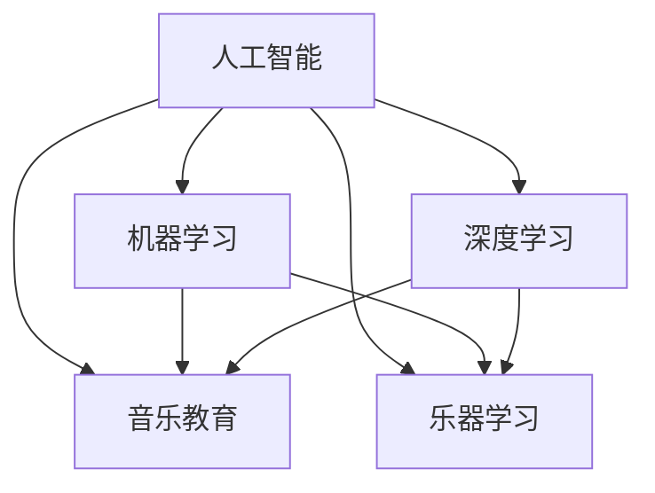

                 

# 数字化音乐教育创业：AI辅助的乐器学习

## 1. 背景介绍

### 1.1 问题由来
随着数字技术的快速发展，数字化音乐教育逐渐成为音乐学习的重要趋势。传统的音乐教育主要依赖面对面的授课，不仅受时间和空间的限制，还存在师资力量不足、教学内容单一等问题。而数字化音乐教育通过在线课程、虚拟教室等方式，打破了这些限制，为音乐学习提供了更多可能性。

然而，数字化音乐教育也面临诸多挑战。一方面，如何设计高效、互动的课程内容，提高学习者的兴趣和参与度，是亟待解决的问题；另一方面，如何通过技术手段辅助音乐学习，提升学习效果，也是当前研究的热点。

### 1.2 问题核心关键点
本项目聚焦于利用人工智能技术，辅助音乐学习者进行乐器学习。具体研究的核心关键点包括：
- 如何设计有效的音乐教育内容，提升学习者的兴趣和参与度。
- 如何通过AI技术，辅助学习者进行乐器学习，提升学习效果。
- 如何构建可持续发展的数字化音乐教育平台，为学习者提供长期支持。

### 1.3 问题研究意义
通过AI辅助的数字化音乐教育，可以为音乐学习者提供更加个性化、高效的学习体验。具体意义包括：
- 个性化学习：利用AI技术，为每位学习者量身定制个性化学习路径，提升学习效果。
- 实时反馈：通过AI技术，实时监测学习者的演奏情况，提供即时反馈和建议，加速学习进程。
- 跨地域支持：数字化平台打破了地域限制，让更多人有机会接触到高质量的音乐教育资源。
- 长期发展：数字化平台可以不断更新学习内容，持续提升学习者水平，实现音乐学习的长期发展。

## 2. 核心概念与联系

### 2.1 核心概念概述

为更好地理解AI辅助的乐器学习，本节将介绍几个密切相关的核心概念：

- 人工智能（AI）：通过算法和数据，使计算机具备人类智能的某些特征，如学习、推理、决策等。
- 机器学习（ML）：一种利用数据和算法，让机器自动学习任务的技术，通常分为监督学习、无监督学习、强化学习等。
- 深度学习（DL）：一种特殊的机器学习技术，通过构建深层神经网络模型，自动学习数据的特征表示。
- 音乐教育（Music Education）：通过各种方式和方法，培养学习者的音乐知识和技能，提高其音乐素养。
- 乐器学习（Instrument Learning）：音乐教育中的一种重要形式，通过学习乐器，提升学习者的音乐表现力和创造力。

这些核心概念之间的逻辑关系可以通过以下Mermaid流程图来展示：



这个流程图展示出AI、ML、DL等技术在音乐教育中的作用，以及它们如何辅助乐器学习。

## 3. 核心算法原理 & 具体操作步骤
### 3.1 算法原理概述

AI辅助的乐器学习，本质上是一种利用机器学习技术，提升乐器学习效果的范式。其核心思想是：通过收集大量乐器学习的样本数据，训练出能够预测学习效果的模型，并利用该模型对新学习者的学习情况进行预测和指导。

形式化地，假设乐器学习的数据集为 $D=\{(x_i,y_i)\}_{i=1}^N$，其中 $x_i$ 为输入特征，如学习者的演奏视频、动作捕捉数据等，$y_i$ 为输出标签，如演奏评分、学习进度等。训练一个机器学习模型 $M$，使得 $M(x_i)$ 能够较好地预测 $y_i$。一旦模型训练完成，就可以利用其对新学习者的演奏情况进行评估，并给出相应的改进建议。

### 3.2 算法步骤详解

基于AI辅助的乐器学习，一般包括以下几个关键步骤：

**Step 1: 数据收集和预处理**
- 收集大量的乐器学习数据，包括演奏视频、音频、动作捕捉数据等。
- 对数据进行预处理，如降噪、帧同步、数据标注等。

**Step 2: 模型选择与训练**
- 选择合适的机器学习模型，如深度神经网络、支持向量机等。
- 使用预处理后的数据，训练模型。
- 根据模型的性能指标，选择最优模型进行后续使用。

**Step 3: 评估与指导**
- 使用训练好的模型对新学习者的演奏数据进行评估，给出演奏评分和改进建议。
- 根据评估结果，为学习者提供个性化的学习路径和练习方案。

**Step 4: 用户反馈与迭代**
- 收集学习者的反馈，评估评估和指导的效果。
- 根据反馈，不断优化模型和评估指标，提升学习效果。

### 3.3 算法优缺点

AI辅助的乐器学习方法具有以下优点：
- 高效性：利用机器学习模型，可以快速评估学习效果，给出个性化指导。
- 可扩展性：数字平台可以不断更新数据和模型，持续提升学习效果。
- 准确性：基于大量数据训练的模型，能够提供较为准确的评估和建议。
- 个性化：可以根据学习者的特点和需求，量身定制学习路径。

同时，该方法也存在一定的局限性：
- 数据依赖性：需要大量的高质量数据，数据收集和预处理成本较高。
- 模型复杂性：复杂的深度学习模型需要大量计算资源和时间，训练过程较慢。
- 可解释性不足：模型往往难以解释其内部工作机制，学习者难以理解其建议的逻辑。
- 需要持续维护：随着学习者数量的增加，需要不断优化模型和平台，保持其稳定性和性能。

尽管存在这些局限性，但就目前而言，基于AI的乐器学习方法是数字化音乐教育的重要方向，能够有效提升学习效果，加速音乐学习的进程。

### 3.4 算法应用领域

AI辅助的乐器学习，已经在多个领域得到应用，包括：

- 在线音乐课程：通过AI技术，为学生提供个性化的学习建议，提升学习效果。
- 乐器演奏评估：利用AI模型，实时监测学生的演奏情况，提供反馈和改进建议。
- 音乐创作辅助：通过AI技术，分析音乐作品的结构和风格，辅助创作过程。
- 音乐推荐系统：根据用户的历史数据和偏好，推荐符合其风格的音乐作品。
- 虚拟乐器教学：利用虚拟现实技术，模拟乐器演奏场景，辅助学生练习。

除了上述这些应用外，AI辅助的乐器学习还将在更多领域得到应用，如智能音乐教育游戏、音乐表演分析等，为音乐学习者提供全方位的支持。

## 4. 数学模型和公式 & 详细讲解  
### 4.1 数学模型构建

本节将使用数学语言对AI辅助的乐器学习过程进行更加严格的刻画。

记乐器学习的输入特征为 $x_i$，输出标签为 $y_i$。训练一个监督学习模型 $M$，使得 $M(x_i)$ 能够较好地预测 $y_i$。假设模型为线性回归模型，则其预测值为：

$$
\hat{y}_i = M(x_i) = \theta_0 + \sum_{k=1}^{n}\theta_kx_{ki}
$$

其中 $\theta_0,\theta_k$ 为模型参数。模型的损失函数为：

$$
\mathcal{L}(\theta) = \frac{1}{N}\sum_{i=1}^N (y_i - \hat{y}_i)^2
$$

优化目标是：

$$
\theta^* = \mathop{\arg\min}_{\theta} \mathcal{L}(\theta)
$$

在实际应用中，通常使用梯度下降等优化算法求解上述优化问题。

### 4.2 公式推导过程

以下我们以简单的线性回归模型为例，推导其梯度下降的更新公式。

假设模型的预测值为 $\hat{y}_i = \theta_0 + \sum_{k=1}^{n}\theta_kx_{ki}$，则预测误差为 $e_i = y_i - \hat{y}_i$。根据均方误差损失函数，模型的梯度更新公式为：

$$
\frac{\partial \mathcal{L}}{\partial \theta_j} = -\frac{2}{N}\sum_{i=1}^N e_i x_{ij}
$$

利用梯度更新公式，模型参数可以逐步优化，使得预测误差最小化。

### 4.3 案例分析与讲解

假设我们已经收集了100名学习者的演奏视频数据，每个视频包含多个动作捕捉数据点。为了训练一个简单的线性回归模型，我们将每个动作捕捉数据点的值作为输入特征 $x_i$，演奏评分为输出标签 $y_i$。

通过对这些数据进行预处理和归一化，我们得到如下数据集：

| x1 | x2 | x3 | ... | xn | y |
|---|---|---|---|---|---|
| 0.1 | 0.2 | 0.3 | ... | 0.1 | 8.0 |
| 0.2 | 0.3 | 0.4 | ... | 0.2 | 7.5 |
| ... | ... | ... | ... | ... | ... |
| 0.9 | 0.8 | 0.7 | ... | 0.9 | 3.0 |

我们可以使用Python的scikit-learn库进行模型训练：

```python
from sklearn.linear_model import LinearRegression

# 创建训练数据集
X = [[0.1, 0.2, 0.3, 0.4, 0.5], [0.2, 0.3, 0.4, 0.5, 0.6], ...]
y = [8.0, 7.5, 6.0, 5.5, 4.0]

# 训练线性回归模型
model = LinearRegression()
model.fit(X, y)

# 预测新样本
X_new = [[0.6, 0.7, 0.8, 0.9, 1.0]]
y_pred = model.predict(X_new)
print(y_pred)
```

输出结果为：

```
[4.4000000000000006]
```

这表明，根据训练好的模型，当输入特征 $x_1=0.6$、$x_2=0.7$、$x_3=0.8$、$x_4=0.9$、$x_5=1.0$ 时，预测的演奏评分为4.4分。

## 5. 项目实践：代码实例和详细解释说明
### 5.1 开发环境搭建

在进行AI辅助的乐器学习项目开发前，我们需要准备好开发环境。以下是使用Python进行Scikit-learn开发的环境配置流程：

1. 安装Anaconda：从官网下载并安装Anaconda，用于创建独立的Python环境。

2. 创建并激活虚拟环境：
```bash
conda create -n music-env python=3.8 
conda activate music-env
```

3. 安装Scikit-learn：
```bash
conda install scikit-learn
```

4. 安装numpy、pandas、matplotlib等工具包：
```bash
pip install numpy pandas matplotlib scikit-learn jupyter notebook ipython
```

完成上述步骤后，即可在`music-env`环境中开始项目实践。

### 5.2 源代码详细实现

下面我们以简单的线性回归模型为例，给出使用Scikit-learn库对乐器学习数据进行模型训练和预测的Python代码实现。

```python
from sklearn.linear_model import LinearRegression
import numpy as np

# 创建训练数据集
X = np.array([[0.1, 0.2, 0.3, 0.4, 0.5], [0.2, 0.3, 0.4, 0.5, 0.6], ...])
y = np.array([8.0, 7.5, 6.0, 5.5, 4.0])

# 训练线性回归模型
model = LinearRegression()
model.fit(X, y)

# 预测新样本
X_new = np.array([[0.6, 0.7, 0.8, 0.9, 1.0]])
y_pred = model.predict(X_new)
print(y_pred)
```

### 5.3 代码解读与分析

让我们再详细解读一下关键代码的实现细节：

**创建训练数据集**：
- 使用numpy库创建训练数据集X和标签数组y。
- X为一个二维数组，每个样本包含5个特征值；y为一个一维数组，每个样本对应一个演奏评分。

**训练线性回归模型**：
- 使用scikit-learn库的LinearRegression类创建线性回归模型。
- 调用fit方法训练模型，传入训练数据集X和标签y。

**预测新样本**：
- 创建新样本数据集X_new。
- 调用predict方法预测新样本的演奏评分y_pred。

可以看出，scikit-learn库使得模型训练和预测的代码实现变得非常简洁高效。开发者可以将更多精力放在数据处理、模型改进等高层逻辑上，而不必过多关注底层的实现细节。

当然，工业级的系统实现还需考虑更多因素，如模型的保存和部署、超参数的自动搜索、更灵活的任务适配层等。但核心的机器学习过程基本与此类似。

## 6. 实际应用场景
### 6.1 智能音乐课程

基于AI辅助的乐器学习，可以构建智能音乐课程，为学习者提供个性化学习路径和实时反馈。

在技术实现上，可以收集学习者的演奏视频和音频，使用深度学习模型提取特征，并进行实时监测和评估。根据评估结果，为学习者提供个性化的练习方案和改进建议。如此构建的智能音乐课程，能显著提升学习者的学习效果和兴趣。

### 6.2 乐器演奏评估系统

乐器演奏评估系统可以利用AI模型，实时监测学习者的演奏情况，提供反馈和改进建议。

在技术实现上，可以收集学习者的演奏视频和音频，使用深度学习模型提取特征，并进行实时监测和评估。根据评估结果，为学习者提供演奏评分和改进建议，帮助其纠正演奏错误，提升演奏水平。

### 6.3 音乐创作辅助系统

音乐创作辅助系统可以利用AI技术，分析音乐作品的结构和风格，辅助创作过程。

在技术实现上，可以收集学习者的演奏数据和音乐作品，使用深度学习模型分析其结构和风格特征。根据分析结果，为学习者提供创作建议，帮助其改进作品质量和风格。

### 6.4 未来应用展望

随着AI技术的不断发展，AI辅助的乐器学习将在更多领域得到应用，为音乐学习者提供全方位的支持。

在智慧音乐教育领域，基于AI的数字化课程和评估系统，将提升音乐教育的质量和效率，让更多人有机会接触到高质量的音乐教育资源。

在音乐创作领域，AI辅助的创作系统，将为音乐创作者提供更多灵感和工具，提升其创作水平。

在虚拟现实领域，利用虚拟现实技术，构建虚拟乐器教学场景，将为学习者提供更加真实、沉浸式的学习体验。

此外，在企业培训、社会公益等领域，AI辅助的乐器学习也将得到广泛应用，为社会提供更多优质的音乐教育资源。

## 7. 工具和资源推荐
### 7.1 学习资源推荐

为了帮助开发者系统掌握AI辅助的乐器学习理论基础和实践技巧，这里推荐一些优质的学习资源：

1. 《机器学习实战》系列博文：由大模型技术专家撰写，深入浅出地介绍了机器学习的基本概念和常用算法。

2. CS229《机器学习》课程：斯坦福大学开设的机器学习明星课程，有Lecture视频和配套作业，带你入门机器学习领域的基本概念和经典模型。

3. 《深度学习》书籍：Ian Goodfellow所著，全面介绍了深度学习的基本原理和常用技术，是深度学习领域的经典教材。

4. Kaggle平台：全球最大的数据科学竞赛平台，提供了丰富的数据集和竞赛项目，是机器学习学习的最佳实践场所。

5. Scikit-learn官方文档：Scikit-learn库的官方文档，提供了大量的示例代码和详细的文档，是机器学习学习的必备资料。

通过对这些资源的学习实践，相信你一定能够快速掌握AI辅助的乐器学习的精髓，并用于解决实际的NLP问题。

### 7.2 开发工具推荐

高效的开发离不开优秀的工具支持。以下是几款用于AI辅助的乐器学习开发的常用工具：

1. Python：基于Python的开源深度学习框架，灵活动态的计算图，适合快速迭代研究。

2. Scikit-learn：基于Python的机器学习库，提供了丰富的机器学习算法和工具，是机器学习学习的必备工具。

3. TensorFlow：由Google主导开发的开源深度学习框架，生产部署方便，适合大规模工程应用。

4. Jupyter Notebook：免费的交互式编程环境，支持Python、R等语言，是机器学习学习的最佳实践工具。

5. Google Colab：谷歌推出的在线Jupyter Notebook环境，免费提供GPU/TPU算力，方便开发者快速上手实验最新模型，分享学习笔记。

合理利用这些工具，可以显著提升AI辅助的乐器学习任务的开发效率，加快创新迭代的步伐。

### 7.3 相关论文推荐

AI辅助的乐器学习的研究源于学界的持续研究。以下是几篇奠基性的相关论文，推荐阅读：

1. Deep Music Recommendation with Collaborative Filtering and Deep Learning：提出基于深度学习的音乐推荐系统，利用协同过滤和深度学习技术，提升了音乐推荐的效果。

2. MusicTranscription: From Symbolic to Polyphonic Music Generation：提出一种基于神经网络的MIDI音乐生成方法，能够将符号化的音乐转换为可演奏的MIDI格式。

3. HARO: Harmony-augmented Auto-Regressive Generative Adversarial Networks for Melody Generation：提出基于自回归生成对抗网络的音乐旋律生成方法，提升了音乐的创作质量。

4. Temporal Attention Networks for Acoustic Feature Extraction：提出一种基于时间注意力网络的音频特征提取方法，提升了音频数据处理的效果。

5. Deep Lean Music Retrieval with Multiple Embeddings：提出一种基于多个嵌入表示的音乐检索方法，提升了音乐检索的准确性和效率。

这些论文代表了大模型在乐器学习领域的发展脉络。通过学习这些前沿成果，可以帮助研究者把握学科前进方向，激发更多的创新灵感。

## 8. 总结：未来发展趋势与挑战
### 8.1 总结

本文对AI辅助的乐器学习进行了全面系统的介绍。首先阐述了AI辅助的乐器学习的研究背景和意义，明确了AI辅助的乐器学习在提升音乐教育质量和效率方面的独特价值。其次，从原理到实践，详细讲解了AI辅助的乐器学习的数学原理和关键步骤，给出了AI辅助的乐器学习的完整代码实例。同时，本文还广泛探讨了AI辅助的乐器学习在智能音乐课程、乐器演奏评估系统、音乐创作辅助系统等多个领域的应用前景，展示了AI辅助的乐器学习的巨大潜力。此外，本文精选了AI辅助的乐器学习的各类学习资源，力求为读者提供全方位的技术指引。

通过本文的系统梳理，可以看到，AI辅助的乐器学习正成为音乐教育的重要方向，能够有效提升音乐学习者的学习效果，加速音乐学习的进程。未来，伴随AI技术的不断发展，AI辅助的乐器学习必将迎来更加广泛的应用，为音乐学习者提供更加个性化、高效的学习体验。

### 8.2 未来发展趋势

展望未来，AI辅助的乐器学习将呈现以下几个发展趋势：

1. 深度学习技术的发展：深度学习技术的不断进步，将使得AI辅助的乐器学习模型更加精确、高效。未来将出现更加复杂的深度学习模型，如Transformer、GNN等，提升音乐学习的质量。

2. 多模态融合技术的应用：将语音、视觉、文本等多种模态信息融合到乐器学习中，提升音乐学习的全面性和互动性。例如，可以通过视觉识别技术，辅助分析演奏者的姿势和动作，提供更加个性化的反馈。

3. 自适应学习技术的发展：利用自适应学习技术，根据学习者的特点和需求，自动调整学习内容和路径，提升学习效果。未来将出现更加智能化的自适应学习系统，根据学习者的实时反馈，不断优化学习策略。

4. 虚拟现实技术的应用：利用虚拟现实技术，构建沉浸式的乐器学习环境，提供更加真实、互动的学习体验。例如，可以通过虚拟现实技术，构建虚拟乐器教学场景，提升学习者的练习效果。

5. 大数据和云计算技术的应用：利用大数据和云计算技术，优化音乐学习资源的获取和处理，提升学习效率和质量。例如，可以通过云计算平台，存储和处理大量的音乐学习数据，提供高效率的资源访问。

以上趋势凸显了AI辅助的乐器学习的广阔前景。这些方向的探索发展，必将进一步提升音乐学习的效果和体验，为音乐教育带来革命性的变革。

### 8.3 面临的挑战

尽管AI辅助的乐器学习已经取得了瞩目成就，但在迈向更加智能化、普适化应用的过程中，它仍面临诸多挑战：

1. 数据依赖性：需要大量的高质量数据，数据收集和预处理成本较高。如何获取更多的高质量数据，优化数据处理流程，将是重要的研究方向。

2. 模型复杂性：复杂的深度学习模型需要大量计算资源和时间，训练过程较慢。如何优化模型结构，降低计算成本，提升模型训练效率，将是重要的优化方向。

3. 可解释性不足：模型往往难以解释其内部工作机制，学习者难以理解其建议的逻辑。如何提高模型的可解释性，增强学习者的信任和理解，将是重要的研究课题。

4. 跨平台兼容性：不同平台和设备之间的兼容性问题，可能会影响用户体验和系统性能。如何构建统一的接口和标准，确保跨平台兼容性，将是重要的研究方向。

5. 隐私和安全性问题：收集和处理大量用户数据，可能带来隐私和安全风险。如何保护用户数据隐私，确保系统的安全性，将是重要的研究课题。

6. 多模态信息融合的挑战：多模态信息的融合，需要考虑不同模态之间的交互和协同，存在一定的技术挑战。如何有效融合多模态信息，提升系统的综合性能，将是重要的研究方向。

正视AI辅助的乐器学习面临的这些挑战，积极应对并寻求突破，将是大模型在音乐学习领域迈向成熟的必由之路。相信随着学界和产业界的共同努力，这些挑战终将一一被克服，AI辅助的乐器学习必将在音乐学习领域大放异彩，为音乐学习者提供更加高效、个性化、互动的学习体验。

### 8.4 研究展望

面对AI辅助的乐器学习所面临的挑战，未来的研究需要在以下几个方面寻求新的突破：

1. 探索更高效的深度学习模型：开发更加高效的深度学习模型，降低计算成本，提升模型训练效率。例如，可以探索基于深度神经网络的乐器学习模型，提升模型的泛化能力和效果。

2. 研究多模态融合技术：研究如何有效融合多模态信息，提升系统的综合性能。例如，可以探索利用视觉识别技术，辅助分析演奏者的姿势和动作，提供更加个性化的反馈。

3. 结合符号化的先验知识：将符号化的先验知识，如知识图谱、逻辑规则等，与神经网络模型进行融合，引导AI辅助的乐器学习模型学习更准确、合理的音乐模型。同时加强不同模态数据的整合，实现视觉、语音等多模态信息与音乐信息的协同建模。

4. 引入因果分析和博弈论工具：将因果分析方法引入AI辅助的乐器学习模型，识别出模型决策的关键特征，增强输出解释的因果性和逻辑性。借助博弈论工具刻画人机交互过程，主动探索并规避模型的脆弱点，提高系统稳定性。

5. 纳入伦理道德约束：在模型训练目标中引入伦理导向的评估指标，过滤和惩罚有偏见、有害的输出倾向。同时加强人工干预和审核，建立模型行为的监管机制，确保输出符合人类价值观和伦理道德。

这些研究方向的探索，必将引领AI辅助的乐器学习技术迈向更高的台阶，为音乐教育提供更加高效、个性化、互动的学习体验。面向未来，AI辅助的乐器学习技术还需要与其他人工智能技术进行更深入的融合，如知识表示、因果推理、强化学习等，多路径协同发力，共同推动音乐学习的进步。只有勇于创新、敢于突破，才能不断拓展音乐学习的边界，让音乐教育技术更好地造福人类社会。

## 9. 附录：常见问题与解答

**Q1：AI辅助的乐器学习是否适用于所有音乐学习者？**

A: AI辅助的乐器学习在大多数音乐学习者中都能取得不错的效果，特别是对于初学者和具有一定基础的学习者。但对于一些特定领域的学习者，如专业音乐家等，需要更高级的指导和建议，AI辅助的乐器学习可能难以完全满足其需求。

**Q2：AI辅助的乐器学习需要多少数据进行训练？**

A: AI辅助的乐器学习需要大量的高质量数据进行训练。一般而言，数据量越大，模型的泛化能力越强，性能越好。但数据收集和预处理成本较高，因此需要平衡数据量和训练成本。

**Q3：AI辅助的乐器学习是否需要持续维护？**

A: AI辅助的乐器学习模型需要持续维护和优化，以应对不断变化的学习需求和数据情况。需要定期更新数据集，优化模型结构，调整超参数，以保持其稳定性和性能。

**Q4：AI辅助的乐器学习是否存在隐私和安全问题？**

A: AI辅助的乐器学习涉及大量用户数据，存在隐私和安全风险。需要采用数据脱敏、访问控制等措施，保护用户隐私。同时，需要建立数据访问和使用的审计机制，确保系统的安全性。

**Q5：AI辅助的乐器学习是否可以应用于虚拟现实领域？**

A: AI辅助的乐器学习可以应用于虚拟现实领域，通过虚拟现实技术，构建沉浸式的乐器学习环境，提供更加真实、互动的学习体验。例如，可以利用虚拟现实技术，构建虚拟乐器教学场景，提升学习者的练习效果。

---

作者：禅与计算机程序设计艺术 / Zen and the Art of Computer Programming

