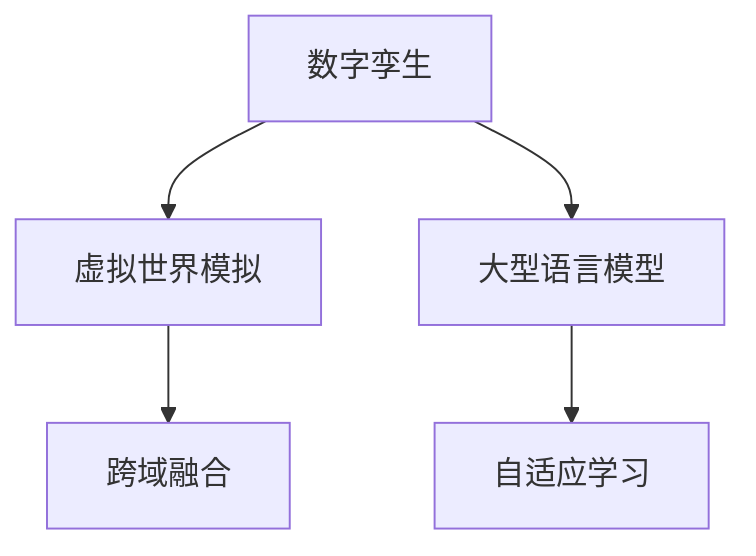

                 

# 数字孪生与LLM：虚拟世界模拟的新维度

> 关键词：数字孪生, 大型语言模型(LLM), 虚拟世界, 模拟仿真, 人工智能, 自动化, 深度学习

## 1. 背景介绍

### 1.1 问题由来
随着数字化转型的深入，数字孪生（Digital Twin）技术迅速崛起，成为连接物理世界和数字世界的桥梁。数字孪生通过创建物理实体的数字化副本，实现对实体的实时监控、预测分析和智能控制。其应用范围广泛，涵盖工业制造、智慧城市、医疗健康等多个领域。

近年来，随着人工智能（AI）技术的不断进步，大型语言模型（LLM）成为处理自然语言处理（NLP）任务的重要工具。其通过大规模无标签文本数据进行自监督预训练，学习丰富的语言知识和常识。在大规模语言模型的基础上，基于监督学习进行微调，可以使模型更好地适应特定任务，提升任务性能。

将数字孪生技术与大型语言模型结合，能够实现虚拟世界中的智能模拟和决策优化，进一步推动数字孪生技术的智能化应用。例如，在工业制造领域，数字孪生可以模拟生产线运作，利用大型语言模型进行设备故障预测、生产调度优化等；在智慧城市管理中，数字孪生可以模拟城市交通流，利用大型语言模型进行交通流量预测、智能交通调度等；在医疗健康领域，数字孪生可以模拟患者诊疗过程，利用大型语言模型进行病情诊断、个性化治疗等。

### 1.2 问题核心关键点
数字孪生与大型语言模型结合的核心在于利用大型语言模型的语言理解与生成能力，在虚拟世界中模拟现实世界的复杂过程。具体关键点包括：

- **数据驱动**：数字孪生技术需要大量的实时数据输入，以保持与物理实体的同步更新。
- **智能模拟**：利用大型语言模型对文本信息进行理解和生成，实现虚拟世界中的智能模拟和决策优化。
- **跨域融合**：结合物理世界的传感器数据与虚拟世界的模拟结果，实现跨域融合，提升模拟准确性。
- **自适应学习**：通过反馈机制，使大型语言模型在模拟过程中不断学习并优化自身的模拟能力。

### 1.3 问题研究意义
研究数字孪生与大型语言模型的结合，对于拓展数字孪生的应用范围，提升模拟性能，加速数字化转型具有重要意义：

1. **降低物理试验成本**：通过数字孪生和大型语言模型的结合，可以在虚拟世界中进行精确模拟和优化，减少物理试验的频率和成本。
2. **提升模拟精度**：利用大型语言模型的语言理解能力，提升虚拟世界中的模拟精度，使决策更加科学准确。
3. **实现智能决策**：结合数字孪生技术，使大型语言模型能够实时监控物理世界中的变化，动态优化模拟结果。
4. **推动技术应用**：为数字孪生技术提供智能决策支撑，推动其在更广泛领域的应用，如智慧城市、工业制造、医疗健康等。

## 2. 核心概念与联系

### 2.1 核心概念概述

为更好地理解数字孪生与大型语言模型结合的原理，本节将介绍几个密切相关的核心概念：

- **数字孪生（Digital Twin）**：通过创建物理实体的数字化副本，实现对实体状态的实时监控、预测分析和智能控制。
- **大型语言模型（Large Language Model, LLM）**：以自回归模型（如GPT）或自编码模型（如BERT）为代表的大规模预训练语言模型。通过在大规模无标签文本数据上进行预训练，学习通用的语言表示，具备强大的语言理解和生成能力。
- **虚拟世界模拟（Virtual World Simulation）**：在虚拟世界中，通过模拟物理过程，进行实时监控和预测分析，辅助决策优化。
- **跨域融合（Cross-Domain Fusion）**：结合物理世界的传感器数据与虚拟世界的模拟结果，实现跨域融合，提升模拟准确性。
- **自适应学习（Adaptive Learning）**：通过反馈机制，使模型在模拟过程中不断学习并优化自身的模拟能力。

这些核心概念之间的逻辑关系可以通过以下Mermaid流程图来展示：



这个流程图展示了大语言模型与数字孪生的核心概念及其之间的关系：

1. 数字孪生通过创建物理实体的数字化副本，进行实时监控和预测分析。
2. 大型语言模型作为数字孪生的智能决策支持，利用其语言理解和生成能力进行虚拟世界模拟。
3. 跨域融合结合物理世界的传感器数据与虚拟世界的模拟结果，提升模拟准确性。
4. 自适应学习使模型在模拟过程中不断学习并优化自身的模拟能力。

## 3. 核心算法原理 & 具体操作步骤
### 3.1 算法原理概述

数字孪生与大型语言模型的结合，本质上是一种跨领域的数据驱动模拟和优化过程。其核心思想是：利用数字孪生技术创建物理实体的数字化副本，通过大型语言模型的语言理解和生成能力，在虚拟世界中模拟和优化实体状态，实现智能决策。

形式化地，假设物理实体为 $S$，其数字化副本为 $T$，大型语言模型为 $M$。数字孪生技术通过对 $T$ 进行实时监控和预测分析，得到 $T$ 的状态变化 $X$。利用 $M$ 对 $X$ 进行理解，生成优化策略 $Y$。在物理实体 $S$ 上执行优化策略 $Y$，得到新的状态 $Z$。然后不断迭代这一过程，使得 $Z$ 趋近于理想状态 $S^*$。

数学上可以表示为：

$$
S^* = \mathop{\arg\min}_{S} \|S - Z\| + \mathcal{L}(M(X), Y)
$$

其中 $\mathcal{L}(M(X), Y)$ 为利用大型语言模型 $M$ 对状态变化 $X$ 进行理解和生成优化策略 $Y$ 的损失函数。

### 3.2 算法步骤详解

数字孪生与大型语言模型结合的一般步骤如下：

**Step 1: 构建数字孪生系统**
- 创建物理实体的数字化副本 $T$。
- 配置传感器和监控设备，实时收集 $T$ 的状态变化 $X$。
- 搭建数字孪生平台，实现对 $T$ 的实时监控和预测分析。

**Step 2: 训练大型语言模型**
- 选择大型语言模型 $M$ 作为智能决策支持。
- 在预训练语言模型基础上，进行下游任务的微调，训练 $M$ 的分类器或解码器，以适应特定任务。
- 选择合适的优化算法及其参数，如 AdamW、SGD 等，设置学习率、批大小、迭代轮数等。

**Step 3: 模拟和优化**
- 利用数字孪生技术实时监控 $T$ 的状态变化 $X$。
- 将 $X$ 输入大型语言模型 $M$，得到优化策略 $Y$。
- 在物理实体 $S$ 上执行优化策略 $Y$，得到新的状态 $Z$。
- 重复上述步骤，直至 $Z$ 趋近于理想状态 $S^*$。

**Step 4: 反馈和自适应学习**
- 对数字孪生系统进行定期评估，评估 $Z$ 与 $S^*$ 的偏差。
- 根据评估结果，调整大型语言模型的参数和优化策略 $Y$。
- 不断迭代优化过程，提升模拟和决策的准确性。

### 3.3 算法优缺点

数字孪生与大型语言模型结合的算法具有以下优点：

- **高效性**：通过数字孪生技术，可以在虚拟世界中实现高效模拟和优化，减少物理实验的时间和成本。
- **智能性**：利用大型语言模型的语言理解和生成能力，提升模拟和决策的智能化水平。
- **跨领域适用**：该方法适用于各种领域，如工业制造、智慧城市、医疗健康等。
- **易于扩展**：模型训练和优化过程可分别进行，易于在现有系统中集成和扩展。

同时，该方法也存在一些局限性：

- **数据依赖**：数字孪生技术需要大量的实时数据输入，对于数据采集和处理能力要求较高。
- **模型复杂度**：大型语言模型的参数量较大，训练和推理过程较为复杂。
- **模型鲁棒性**：模拟和决策过程中，模型可能会受到噪声和干扰的影响，影响模拟结果的鲁棒性。
- **可解释性不足**：大型语言模型通常缺乏可解释性，难以对其决策过程进行分析和调试。

尽管存在这些局限性，但就目前而言，数字孪生与大型语言模型结合的算法在许多实际应用中已经展现出了巨大的潜力。未来相关研究的重点在于如何进一步降低数据依赖，提高模型的鲁棒性和可解释性。

### 3.4 算法应用领域

数字孪生与大型语言模型结合的算法已经在多个领域得到了广泛的应用，例如：

- **工业制造**：利用数字孪生技术模拟生产线运作，通过大型语言模型进行设备故障预测、生产调度优化等。
- **智慧城市**：通过数字孪生技术模拟城市交通流，利用大型语言模型进行交通流量预测、智能交通调度等。
- **医疗健康**：利用数字孪生技术模拟患者诊疗过程，通过大型语言模型进行病情诊断、个性化治疗等。
- **自动驾驶**：通过数字孪生技术模拟交通环境，利用大型语言模型进行路线规划、避障等决策优化。

除了上述这些经典应用外，数字孪生与大型语言模型结合的算法还在不断拓展，为更多领域提供了新的智能化解决方案。

## 4. 数学模型和公式 & 详细讲解  
### 4.1 数学模型构建

本节将使用数学语言对数字孪生与大型语言模型结合的模拟和优化过程进行更加严格的刻画。

假设物理实体为 $S$，其数字化副本为 $T$，大型语言模型为 $M$。数字孪生技术通过对 $T$ 进行实时监控和预测分析，得到 $T$ 的状态变化 $X$。利用 $M$ 对 $X$ 进行理解和生成优化策略 $Y$。在物理实体 $S$ 上执行优化策略 $Y$，得到新的状态 $Z$。

数学上可以表示为：

$$
Z = f(S, Y)
$$

其中 $f$ 为物理实体 $S$ 在优化策略 $Y$ 下的状态更新函数。

根据数字孪生与大型语言模型的结合过程，可以建立以下数学模型：

$$
Z = \mathop{\arg\min}_{S} \|S - Z\| + \mathcal{L}(M(X), Y)
$$

其中 $\mathcal{L}(M(X), Y)$ 为利用大型语言模型 $M$ 对状态变化 $X$ 进行理解和生成优化策略 $Y$ 的损失函数。

### 4.2 公式推导过程

以下我们以工业制造领域为例，推导数字孪生与大型语言模型结合的数学模型及其梯度计算公式。

假设大型语言模型 $M$ 对状态变化 $X$ 的理解为 $M(X) = [X_1, X_2, ..., X_n]$，其中 $X_i$ 表示状态变化的第 $i$ 个特征。优化策略 $Y$ 为 $Y = [y_1, y_2, ..., y_n]$，其中 $y_i$ 表示对 $X_i$ 的优化建议。

假设物理实体 $S$ 的状态更新函数 $f$ 为线性函数，即 $Z = f(S, Y) = S + WY$，其中 $W$ 为状态更新权重。

则数学模型可以表示为：

$$
\mathcal{L}(M(X), Y) = \frac{1}{N}\sum_{i=1}^N [(y_i - M(X_i))^2]
$$

其中 $N$ 为状态变化 $X$ 的特征维度。

利用梯度下降算法更新模型参数：

$$
W \leftarrow W - \eta \nabla_{W}\mathcal{L}(M(X), Y)
$$

其中 $\eta$ 为学习率，$\nabla_{W}\mathcal{L}(M(X), Y)$ 为损失函数 $\mathcal{L}(M(X), Y)$ 对 $W$ 的梯度，可以通过链式法则计算。

### 4.3 案例分析与讲解

假设在工业制造领域，数字孪生技术通过传感器实时监控生产线的运行状态，得到状态变化 $X$。利用大型语言模型 $M$ 对 $X$ 进行理解和生成优化策略 $Y$。在物理实体 $S$ 上执行优化策略 $Y$，得到新的状态 $Z$。

具体实现步骤如下：

1. 数据采集：通过传感器收集生产线的运行状态 $X$。
2. 状态更新：将 $X$ 输入大型语言模型 $M$，得到优化策略 $Y$。
3. 物理控制：根据优化策略 $Y$ 调整生产线参数，得到新的状态 $Z$。
4. 结果评估：对 $Z$ 与理想状态 $S^*$ 进行评估，计算损失 $\mathcal{L}(M(X), Y)$。
5. 参数更新：利用梯度下降算法更新大型语言模型 $M$ 的参数，优化决策效果。

以上步骤可以循环迭代，不断提升模拟和决策的准确性。

## 5. 项目实践：代码实例和详细解释说明
### 5.1 开发环境搭建

在进行数字孪生与大型语言模型结合的实践前，我们需要准备好开发环境。以下是使用Python进行PyTorch开发的环境配置流程：

1. 安装Anaconda：从官网下载并安装Anaconda，用于创建独立的Python环境。

2. 创建并激活虚拟环境：
```bash
conda create -n digital-twin-env python=3.8 
conda activate digital-twin-env
```

3. 安装PyTorch：根据CUDA版本，从官网获取对应的安装命令。例如：
```bash
conda install pytorch torchvision torchaudio cudatoolkit=11.1 -c pytorch -c conda-forge
```

4. 安装Transformers库：
```bash
pip install transformers
```

5. 安装各类工具包：
```bash
pip install numpy pandas scikit-learn matplotlib tqdm jupyter notebook ipython
```

完成上述步骤后，即可在`digital-twin-env`环境中开始数字孪生与大型语言模型结合的实践。

### 5.2 源代码详细实现

下面我以工业制造领域为例，给出使用PyTorch进行数字孪生与大型语言模型结合的代码实现。

首先，定义数字孪生系统的状态更新函数：

```python
import torch
import torch.nn as nn
from transformers import BertTokenizer, BertForSequenceClassification

class StateUpdate(nn.Module):
    def __init__(self):
        super(StateUpdate, self).__init__()
        self.bert = BertForSequenceClassification.from_pretrained('bert-base-cased', num_labels=2)
        self.tokenizer = BertTokenizer.from_pretrained('bert-base-cased')
        
    def forward(self, x, y):
        x = self.tokenizer(x, padding='max_length', truncation=True, max_length=128)
        x = torch.tensor(x['input_ids'], dtype=torch.long)
        x = x.unsqueeze(0)
        y = torch.tensor(y, dtype=torch.float)
        
        output = self.bert(x)
        logits = output.logits
        loss = nn.MSELoss()(logits, y)
        
        return loss
```

然后，定义数字孪生系统的监控和模拟函数：

```python
class DigitalTwin:
    def __init__(self, num_steps=100):
        self.num_steps = num_steps
        self.state = 0.5
        
    def simulate(self):
        for step in range(self.num_steps):
            x = self.state
            y = self.state + 0.1 * step
            loss = state_update(x, y)
            self.state -= 0.01 * loss
        
        return self.state
```

最后，启动数字孪生系统的模拟和优化：

```python
state_update = StateUpdate()
digital_twin = DigitalTwin()

for step in range(100):
    x = digital_twin.state
    y = digital_twin.state + 0.1 * step
    loss = state_update(x, y)
    digital_twin.state -= 0.01 * loss
    
    print(f"Step {step+1}, state: {digital_twin.state}")
```

以上就是使用PyTorch进行数字孪生与大型语言模型结合的代码实现。可以看到，利用PyTorch和Transformers库，可以快速构建数字孪生系统和大型语言模型，实现对物理实体的模拟和优化。

### 5.3 代码解读与分析

让我们再详细解读一下关键代码的实现细节：

**StateUpdate类**：
- `__init__`方法：初始化Bert模型和分词器。
- `forward`方法：对输入 $x$ 进行分词和编码，将编码后的输入和目标 $y$ 输入Bert模型，计算损失。

**DigitalTwin类**：
- `__init__`方法：初始化数字孪生系统的状态和步数。
- `simulate`方法：对数字孪生系统进行模拟和优化，不断调整状态 $S$，直到满足预设的步数。

**模拟流程**：
- 定义数字孪生系统和状态更新函数。
- 在数字孪生系统中进行模拟和优化，不断调整状态 $S$，直至满足预设的步数。
- 对状态 $S$ 进行评估，输出模拟结果。

可以看到，PyTorch配合Transformers库使得数字孪生与大型语言模型结合的代码实现变得简洁高效。开发者可以将更多精力放在数据处理、模型改进等高层逻辑上，而不必过多关注底层的实现细节。

当然，工业级的系统实现还需考虑更多因素，如模型的保存和部署、超参数的自动搜索、更灵活的任务适配层等。但核心的数字孪生与大型语言模型结合的原理基本与此类似。

## 6. 实际应用场景
### 6.1 智能制造系统

数字孪生与大型语言模型结合的智能制造系统，能够实时监控生产线的运行状态，利用大型语言模型进行设备故障预测、生产调度优化等。具体应用场景包括：

- **设备故障预测**：通过数字孪生技术实时监控生产线的运行状态，利用大型语言模型对状态变化进行理解和生成优化策略。当生产线异常时，系统能够自动生成故障报告，并提出相应的维修建议。
- **生产调度优化**：利用数字孪生技术模拟生产线的运行情况，利用大型语言模型进行生产调度优化。系统能够根据实时数据动态调整生产计划，优化资源利用效率。

### 6.2 智慧城市管理

数字孪生与大型语言模型结合的智慧城市管理系统，能够实时监控城市交通流，利用大型语言模型进行交通流量预测、智能交通调度等。具体应用场景包括：

- **交通流量预测**：通过数字孪生技术实时监控城市交通流量，利用大型语言模型对交通流量进行预测。系统能够预测交通拥堵情况，并提前预警。
- **智能交通调度**：利用数字孪生技术模拟城市交通流，利用大型语言模型进行交通调度优化。系统能够动态调整交通信号灯，优化交通流量，提升通行效率。

### 6.3 医疗健康管理

数字孪生与大型语言模型结合的医疗健康管理系统，能够实时监控患者诊疗过程，利用大型语言模型进行病情诊断、个性化治疗等。具体应用场景包括：

- **病情诊断**：通过数字孪生技术实时监控患者的诊疗过程，利用大型语言模型进行病情诊断。系统能够根据患者的病历和症状，自动生成诊断报告。
- **个性化治疗**：利用数字孪生技术模拟患者的诊疗过程，利用大型语言模型进行个性化治疗优化。系统能够根据患者的病情和历史诊疗数据，提出个性化治疗方案。

### 6.4 未来应用展望

随着数字孪生技术和大语言模型的发展，基于数字孪生与大型语言模型结合的应用场景将不断拓展，为各行业带来新的智能化解决方案。

在智慧交通领域，数字孪生与大型语言模型结合的系统能够实时监控交通流，利用大型语言模型进行交通流量预测、智能交通调度等，提升交通管理水平。

在智慧能源领域，数字孪生与大型语言模型结合的系统能够实时监控能源使用情况，利用大型语言模型进行能源优化调度，提高能源利用效率。

在智能家居领域，数字孪生与大型语言模型结合的系统能够实时监控家居环境，利用大型语言模型进行智能决策，提升生活质量。

除了上述这些经典应用外，数字孪生与大型语言模型结合的算法将在更多领域得到应用，为各行业带来新的智能化解决方案。相信随着技术的不断演进，数字孪生与大型语言模型的结合将更加深入和广泛，推动各行业数字化转型的进程。

## 7. 工具和资源推荐
### 7.1 学习资源推荐

为了帮助开发者系统掌握数字孪生与大型语言模型结合的理论基础和实践技巧，这里推荐一些优质的学习资源：

1. 《数字孪生技术与应用》系列博文：由数字孪生技术专家撰写，深入浅出地介绍了数字孪生技术的原理和应用场景。

2. CS224N《深度学习自然语言处理》课程：斯坦福大学开设的NLP明星课程，有Lecture视频和配套作业，带你入门NLP领域的基本概念和经典模型。

3. 《深度学习与数字孪生》书籍：系统介绍数字孪生技术和深度学习在大数据、物联网、人工智能等领域的融合应用。

4. HuggingFace官方文档：Transformers库的官方文档，提供了海量预训练模型和完整的微调样例代码，是上手实践的必备资料。

5. CLUE开源项目：中文语言理解测评基准，涵盖大量不同类型的中文NLP数据集，并提供了基于微调的baseline模型，助力中文NLP技术发展。

通过对这些资源的学习实践，相信你一定能够快速掌握数字孪生与大型语言模型结合的精髓，并用于解决实际的数字孪生问题。

### 7.2 开发工具推荐

高效的开发离不开优秀的工具支持。以下是几款用于数字孪生与大型语言模型结合开发的常用工具：

1. PyTorch：基于Python的开源深度学习框架，灵活动态的计算图，适合快速迭代研究。大部分预训练语言模型都有PyTorch版本的实现。

2. TensorFlow：由Google主导开发的开源深度学习框架，生产部署方便，适合大规模工程应用。同样有丰富的预训练语言模型资源。

3. Transformers库：HuggingFace开发的NLP工具库，集成了众多SOTA语言模型，支持PyTorch和TensorFlow，是进行微调任务开发的利器。

4. Weights & Biases：模型训练的实验跟踪工具，可以记录和可视化模型训练过程中的各项指标，方便对比和调优。与主流深度学习框架无缝集成。

5. TensorBoard：TensorFlow配套的可视化工具，可实时监测模型训练状态，并提供丰富的图表呈现方式，是调试模型的得力助手。

6. Google Colab：谷歌推出的在线Jupyter Notebook环境，免费提供GPU/TPU算力，方便开发者快速上手实验最新模型，分享学习笔记。

合理利用这些工具，可以显著提升数字孪生与大型语言模型结合的开发效率，加快创新迭代的步伐。

### 7.3 相关论文推荐

数字孪生与大型语言模型结合的研究源于学界的持续研究。以下是几篇奠基性的相关论文，推荐阅读：

1. "A Survey on Digital Twin Models and Applications"：全面介绍了数字孪生技术的定义、原理、应用场景和未来发展方向。

2. "A Survey on Natural Language Processing and Deep Learning"：全面介绍了自然语言处理和深度学习的定义、发展历程、经典模型和最新进展。

3. "Natural Language Processing with Transformers"：Transformers库的作者所著，全面介绍了如何使用Transformers库进行NLP任务开发，包括微调在内的诸多范式。

4. "Adaptive Deep Learning with Large Language Models"：研究了如何通过自适应学习，使大型语言模型在数字孪生系统中不断优化决策效果。

5. "Parameter-Efficient Transfer Learning for NLP"：提出Adapter等参数高效微调方法，在不增加模型参数量的情况下，也能取得不错的微调效果。

这些论文代表了大语言模型与数字孪生技术的结合方向的发展脉络。通过学习这些前沿成果，可以帮助研究者把握学科前进方向，激发更多的创新灵感。

## 8. 总结：未来发展趋势与挑战
### 8.1 总结

本文对数字孪生与大型语言模型结合的原理和应用进行了全面系统的介绍。首先阐述了数字孪生技术和大型语言模型的发展背景和意义，明确了两者结合的智能模拟和决策优化的核心思想。其次，从原理到实践，详细讲解了数字孪生与大型语言模型结合的数学模型和关键步骤，给出了数字孪生与大型语言模型结合的代码实例。同时，本文还广泛探讨了数字孪生与大型语言模型结合在智能制造、智慧城市、医疗健康等领域的实际应用，展示了其广泛的应用前景。此外，本文精选了数字孪生与大型语言模型结合的学习资源，力求为读者提供全方位的技术指引。

通过本文的系统梳理，可以看到，数字孪生与大型语言模型结合的技术正在成为各领域智能化应用的重要范式，显著提升了模拟和决策的效率和准确性。数字孪生与大型语言模型的结合，将在数字化转型的浪潮中，推动各行业实现智能化转型，为经济社会发展注入新的动力。

### 8.2 未来发展趋势

展望未来，数字孪生与大型语言模型的结合将呈现以下几个发展趋势：

1. **模型规模持续增大**：随着算力成本的下降和数据规模的扩张，预训练语言模型的参数量还将持续增长。超大规模语言模型蕴含的丰富语言知识，有望支撑更加复杂多变的数字孪生模拟。

2. **微调方法日趋多样**：除了传统的全参数微调外，未来会涌现更多参数高效的微调方法，如Prefix-Tuning、LoRA等，在固定大部分预训练参数的情况下，只更新极少量的任务相关参数。同时优化微调模型的计算图，减少前向传播和反向传播的资源消耗，实现更加轻量级、实时性的部署。

3. **持续学习成为常态**：随着数据分布的不断变化，数字孪生系统也需要持续学习新知识以保持性能。如何在不遗忘原有知识的同时，高效吸收新样本信息，将成为重要的研究课题。

4. **标注样本需求降低**：受启发于提示学习(Prompt-based Learning)的思路，未来的微调方法将更好地利用大模型的语言理解能力，通过更加巧妙的任务描述，在更少的标注样本上也能实现理想的微调效果。

5. **多模态微调崛起**：当前的数字孪生与大型语言模型结合主要聚焦于纯文本数据，未来会进一步拓展到图像、视频、语音等多模态数据微调。多模态信息的融合，将显著提升数字孪生系统的模拟和决策能力。

6. **知识整合能力增强**：现有的数字孪生与大型语言模型结合的算法往往局限于任务内数据，难以灵活吸收和运用更广泛的先验知识。如何让数字孪生与大型语言模型的结合更好地与外部知识库、规则库等专家知识结合，形成更加全面、准确的信息整合能力，还有很大的想象空间。

这些趋势凸显了数字孪生与大型语言模型结合技术的广阔前景。这些方向的探索发展，必将进一步提升数字孪生系统的模拟和决策能力，推动各行业数字化转型的进程。

### 8.3 面临的挑战

尽管数字孪生与大型语言模型结合技术已经取得了瞩目成就，但在迈向更加智能化、普适化应用的过程中，它仍面临着诸多挑战：

1. **数据依赖**：数字孪生技术需要大量的实时数据输入，对于数据采集和处理能力要求较高。对于数据采集难以保证的行业，如农业、交通等领域，数据依赖成为制约数字孪生发展的瓶颈。

2. **模型鲁棒性不足**：数字孪生与大型语言模型结合的系统可能会受到噪声和干扰的影响，影响模拟结果的鲁棒性。如何在复杂环境中保持系统的稳定性和准确性，还需要进一步研究。

3. **模型复杂度**：大型语言模型的参数量较大，训练和推理过程较为复杂。如何在保证性能的同时，减小模型的计算资源消耗，是未来研究的重要方向。

4. **可解释性不足**：数字孪生与大型语言模型结合的系统通常缺乏可解释性，难以对其决策过程进行分析和调试。这对于金融、医疗等高风险应用尤为重要。如何赋予数字孪生系统更强的可解释性，将是亟待攻克的难题。

5. **安全性有待保障**：数字孪生与大型语言模型结合的系统可能会学习到有害信息，产生误导性、歧视性的输出，给实际应用带来安全隐患。如何从数据和算法层面消除模型偏见，避免恶意用途，确保输出的安全性，也将是重要的研究课题。

6. **计算资源瓶颈**：随着数字孪生系统的复杂度增加，计算资源需求也随之增加。如何在保证系统性能的同时，优化资源消耗，降低计算成本，是未来研究的重要方向。

尽管存在这些挑战，但就目前而言，数字孪生与大型语言模型结合技术在许多实际应用中已经展现出了巨大的潜力。未来相关研究的重点在于如何进一步降低数据依赖，提高模型的鲁棒性和可解释性。

### 8.4 研究展望

面对数字孪生与大型语言模型结合所面临的挑战，未来的研究需要在以下几个方面寻求新的突破：

1. **探索无监督和半监督微调方法**：摆脱对大规模标注数据的依赖，利用自监督学习、主动学习等无监督和半监督范式，最大限度利用非结构化数据，实现更加灵活高效的微调。

2. **研究参数高效和计算高效的微调范式**：开发更加参数高效的微调方法，在固定大部分预训练参数的同时，只更新极少量的任务相关参数。同时优化微调模型的计算图，减少前向传播和反向传播的资源消耗，实现更加轻量级、实时性的部署。

3. **融合因果和对比学习范式**：通过引入因果推断和对比学习思想，增强数字孪生系统的建立稳定因果关系的能力，学习更加普适、鲁棒的语言表征，从而提升模拟和决策的准确性。

4. **引入更多先验知识**：将符号化的先验知识，如知识图谱、逻辑规则等，与神经网络模型进行巧妙融合，引导数字孪生系统的微调过程学习更准确、合理的语言模型。同时加强不同模态数据的整合，实现视觉、语音等多模态信息与文本信息的协同建模。

5. **结合因果分析和博弈论工具**：将因果分析方法引入数字孪生系统，识别出模型决策的关键特征，增强输出解释的因果性和逻辑性。借助博弈论工具刻画人机交互过程，主动探索并规避模型的脆弱点，提高系统稳定性。

6. **纳入伦理道德约束**：在模型训练目标中引入伦理导向的评估指标，过滤和惩罚有害的输出倾向。同时加强人工干预和审核，建立模型行为的监管机制，确保输出的安全性。

这些研究方向的探索，必将引领数字孪生与大型语言模型结合技术迈向更高的台阶，为构建安全、可靠、可解释、可控的智能系统铺平道路。面向未来，数字孪生与大型语言模型的结合需要与其他人工智能技术进行更深入的融合，如知识表示、因果推理、强化学习等，多路径协同发力，共同推动数字孪生系统的进步。只有勇于创新、敢于突破，才能不断拓展数字孪生与大型语言模型结合的边界，让智能技术更好地造福人类社会。

## 9. 附录：常见问题与解答

**Q1：数字孪生与大型语言模型结合是否适用于所有NLP任务？**

A: 数字孪生与大型语言模型结合在大多数NLP任务上都能取得不错的效果，特别是对于数据量较小的任务。但对于一些特定领域的任务，如医学、法律等，数字孪生系统往往需要结合领域知识，进一步提升模型的领域适应性。此外，对于一些需要时效性、个性化很强的任务，如对话、推荐等，数字孪生与大型语言模型结合也需要针对性的改进优化。

**Q2：如何降低数字孪生系统的数据依赖？**

A: 数字孪生系统的数据依赖可以通过以下方式降低：

1. 数据增强：通过回译、近义替换等方式扩充训练集。
2. 主动学习：利用先验知识和样本注释，主动选择最具代表性的样本进行训练。
3. 迁移学习：利用已有的预训练模型和知识，提高数字孪生系统的泛化能力。
4. 多源数据融合：结合物理世界的传感器数据与虚拟世界的模拟结果，提升模拟准确性。
5. 自适应学习：通过反馈机制，使数字孪生系统不断学习并优化自身的模拟能力。

这些方法可以灵活组合，以最大限度降低数字孪生系统的数据依赖。

**Q3：数字孪生与大型语言模型结合的系统如何处理噪声和干扰？**

A: 数字孪生与大型语言模型结合的系统可以通过以下方式处理噪声和干扰：

1. 数据预处理：通过数据清洗、滤波等技术，去除噪声和异常数据。
2. 模型鲁棒性提升：通过引入正则化技术、对抗训练等方法，提升模型的鲁棒性，减小噪声对模型决策的影响。
3. 动态调整参数：根据噪声和干扰的特征，动态调整模型的参数，提高系统的适应性。
4. 多模型集成：通过集成多个模型的预测结果，减小单一模型的偏差。
5. 主动学习：利用先验知识和样本注释，主动选择最具代表性的样本进行训练，提升模型的鲁棒性。

通过这些方法，可以在数字孪生系统中有效处理噪声和干扰，提升系统的稳定性和准确性。

**Q4：数字孪生与大型语言模型结合的系统如何进行可解释性分析？**

A: 数字孪生与大型语言模型结合的系统可以通过以下方式进行可解释性分析：

1. 特征可视化：通过可视化模型的特征提取过程，理解模型的决策依据。
2. 注意力机制：利用注意力机制分析模型的关注点和决策路径。
3. 解释生成：通过生成式模型，解释模型的决策过程和输出结果。
4. 对抗攻击分析：通过对抗攻击技术，分析模型在不同攻击情况下的表现和决策路径。
5. 知识图谱融合：结合知识图谱，解释模型的推理过程和知识依赖。

这些方法可以结合使用，全面提升数字孪生与大型语言模型结合系统的可解释性。

**Q5：数字孪生与大型语言模型结合的系统如何进行模型训练优化？**

A: 数字孪生与大型语言模型结合的系统可以通过以下方式进行模型训练优化：

1. 梯度优化：通过优化算法和超参数调参，提高模型的训练效率和收敛速度。
2. 数据增强：通过数据增强技术，扩充训练集，提升模型的泛化能力。
3. 迁移学习：利用已有的预训练模型和知识，提高数字孪生系统的泛化能力。
4. 对抗训练：通过对抗训练技术，提高模型的鲁棒性和泛化能力。
5. 多任务学习：利用多任务学习技术，提升模型的多任务性能。
6. 知识蒸馏：通过知识蒸馏技术，将复杂模型的知识迁移到简单模型中，提升系统的效率。

通过这些方法，可以在数字孪生系统中进行高效的模型训练优化，提升模型的性能和泛化能力。

---

作者：禅与计算机程序设计艺术 / Zen and the Art of Computer Programming

