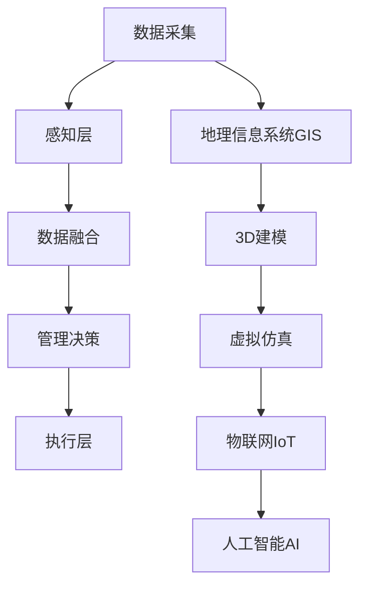

                 

## 1. 背景介绍

随着城市化进程的加快，传统城市管理模式面临巨大挑战。传统城市管理系统基于物理设施，响应速度慢，管理效率低，且缺乏全局视角。数字孪生城市（Digital Twin City）是近年来兴起的一种新模式，通过构建虚拟城市模型，实现对真实城市的全面感知和动态管理，是智慧城市建设的重要方向。

本文将探讨数字孪生城市的构建，从核心概念到具体算法，全面解析智慧城市的虚拟管理。首先，介绍数字孪生城市的基本概念和核心特征。其次，讲解数字孪生城市构建的核心算法，包括3D建模、地理信息系统、物联网等技术。最后，分析数字孪生城市的应用场景和未来发展趋势。

## 2. 核心概念与联系

### 2.1 核心概念概述

数字孪生城市（Digital Twin City），是利用信息与物理系统（CPS）的方法，构建一个与物理实体完全对等的虚拟仿真模型，并利用先进的感知、计算和通信技术，实现对物理城市的全面感知、动态管理和智能化决策。数字孪生城市具有以下几个核心特征：

- **全面感知**：通过各类传感器实时收集城市运行数据，实现对城市环境、交通、能源、环境等的全面监测。
- **动态管理**：基于实时数据进行动态分析和决策，优化城市管理流程，提高城市运行效率。
- **智能化决策**：通过机器学习和人工智能技术，实现对城市运行数据的深度挖掘和智能分析，提供科学决策支持。
- **虚拟仿真**：构建虚拟仿真环境，模拟城市运行场景，进行各种优化模拟和预测分析。

### 2.2 核心概念原理和架构的 Mermaid 流程图



该图展示了数字孪生城市的架构，包括数据采集、感知层、数据融合、管理决策和执行层，同时包括了地理信息系统、3D建模、虚拟仿真、物联网和人工智能等关键技术。

## 3. 核心算法原理 & 具体操作步骤

### 3.1 算法原理概述

数字孪生城市的构建基于3D建模、地理信息系统、物联网、人工智能等技术，其核心算法包括数据采集、数据融合、模型建立、仿真模拟和决策优化等。

- **数据采集**：通过各类传感器、摄像头、无人机等设备，实时收集城市运行数据，包括交通流量、环境污染、能耗等。
- **数据融合**：将多源异构数据进行统一处理和融合，形成高质量的数据集，供后续分析使用。
- **模型建立**：利用3D建模技术，建立虚拟城市模型，实现对城市环境和建筑物的精确模拟。
- **仿真模拟**：通过虚拟仿真技术，模拟城市运行场景，进行各种优化和预测分析。
- **决策优化**：结合人工智能技术，对城市运行数据进行深度挖掘和智能分析，实现科学决策。

### 3.2 算法步骤详解

#### 3.2.1 数据采集

数据采集是数字孪生城市的第一步，需要各类传感器、摄像头、无人机等设备实时采集城市运行数据。数据采集流程包括：

1. **传感器部署**：在城市关键位置部署各类传感器，实时监测环境、交通、能源等数据。
2. **摄像头安装**：在城市重要路段安装摄像头，实时监控交通运行情况。
3. **无人机巡查**：利用无人机进行城市巡查，收集高分辨率的城市图像数据。
4. **数据传输**：将采集到的数据通过网络传输到数据中心，进行存储和处理。

#### 3.2.2 数据融合

数据融合是将多源异构数据进行统一处理和融合的过程。数据融合流程包括：

1. **数据清洗**：对采集到的数据进行清洗，去除噪声和异常值，确保数据质量。
2. **数据对齐**：将不同来源的数据进行对齐，形成统一的数据格式和标准。
3. **数据融合**：利用数据融合算法，将多源数据进行融合，形成高质量的数据集。

#### 3.2.3 模型建立

模型建立是数字孪生城市的核心环节，利用3D建模技术，建立虚拟城市模型。模型建立流程包括：

1. **三维建模**：利用3D建模软件，建立城市建筑、道路、桥梁等三维模型。
2. **数据导入**：将实测数据导入到3D模型中，实现对城市环境的精确模拟。
3. **模型验证**：对模型进行验证，确保模型精度和可靠性。

#### 3.2.4 仿真模拟

仿真模拟是通过虚拟仿真技术，模拟城市运行场景，进行各种优化和预测分析。仿真模拟流程包括：

1. **场景模拟**：利用虚拟仿真技术，模拟城市运行场景，如交通流量、环境污染、能源消耗等。
2. **优化分析**：对模拟结果进行优化分析，找出城市运行中的问题和改进空间。
3. **预测分析**：利用预测模型，对城市运行进行未来预测，如交通流量预测、环境污染预测等。

#### 3.2.5 决策优化

决策优化是数字孪生城市的重要环节，结合人工智能技术，对城市运行数据进行深度挖掘和智能分析，实现科学决策。决策优化流程包括：

1. **数据挖掘**：利用数据挖掘算法，从海量数据中挖掘出有价值的信息。
2. **智能分析**：利用人工智能技术，对城市运行数据进行智能分析，提供决策支持。
3. **决策执行**：根据决策结果，执行相应的操作，优化城市管理流程。

### 3.3 算法优缺点

数字孪生城市构建的核心算法具有以下优点：

- **全面感知**：通过各类传感器和摄像头，实现对城市运行的全面监测，提供详实的数据支持。
- **动态管理**：通过实时数据进行动态分析和决策，提高城市管理效率。
- **智能化决策**：利用人工智能技术，实现对城市运行数据的深度挖掘和智能分析，提供科学决策支持。

同时，数字孪生城市构建也存在以下缺点：

- **数据量大**：采集和处理的数据量巨大，需要强大的计算和存储能力。
- **算法复杂**：涉及多源异构数据的融合、3D建模、虚拟仿真、人工智能等多项技术，算法复杂度较高。
- **成本高**：建设数字孪生城市需要大量资金投入，尤其是在传感器部署和数据采集方面。

### 3.4 算法应用领域

数字孪生城市构建的核心算法广泛应用于智慧城市建设，涵盖交通管理、环境监测、能源管理等多个领域。

- **交通管理**：通过实时数据监测和分析，优化交通信号灯控制，减少交通拥堵，提高通行效率。
- **环境监测**：利用各类传感器和摄像头，实时监测环境污染和能耗情况，提供环境治理方案。
- **能源管理**：通过仿真模拟和智能分析，优化能源使用，提高能源利用率，降低能源消耗。
- **公共安全**：利用无人机和摄像头进行城市巡查，及时发现并处理安全隐患，保障公共安全。

## 4. 数学模型和公式 & 详细讲解 & 举例说明

### 4.1 数学模型构建

数字孪生城市构建的数学模型包括以下几个关键组成部分：

1. **3D建模**：利用3D建模技术，构建城市建筑、道路、桥梁等三维模型，数学模型为：

   $$
   \text{Model} = \sum_{i=1}^n (\theta_i x_i + \beta_i)
   $$

2. **地理信息系统GIS**：利用地理信息系统，进行城市地理数据的存储和分析，数学模型为：

   $$
   \text{GIS} = (x,y,z)
   $$

3. **物联网IoT**：利用物联网技术，实时采集城市运行数据，数学模型为：

   $$
   \text{IoT} = (\text{Sensor}, \text{Camera}, \text{Drone})
   $$

4. **人工智能AI**：利用人工智能技术，进行数据挖掘和智能分析，数学模型为：

   $$
   \text{AI} = (\text{ML}, \text{DL})
   $$

### 4.2 公式推导过程

#### 4.2.1 3D建模

3D建模的数学模型推导如下：

$$
\begin{align*}
\text{Model} &= \sum_{i=1}^n (\theta_i x_i + \beta_i) \\
&= \sum_{i=1}^n (\theta_i x_i + \beta_i) + \epsilon \\
&= \sum_{i=1}^n (\theta_i x_i + \beta_i) + \epsilon
\end{align*}
$$

其中，$\theta_i$ 为模型参数，$x_i$ 为输入数据，$\beta_i$ 为截距，$\epsilon$ 为噪声。

#### 4.2.2 地理信息系统GIS

地理信息系统的数学模型推导如下：

$$
\begin{align*}
\text{GIS} &= (x,y,z) \\
&= (x, y, z) + \epsilon
\end{align*}
$$

其中，$(x, y, z)$ 为地理坐标，$\epsilon$ 为噪声。

#### 4.2.3 物联网IoT

物联网的数学模型推导如下：

$$
\begin{align*}
\text{IoT} &= (\text{Sensor}, \text{Camera}, \text{Drone}) \\
&= (\text{Sensor}, \text{Camera}, \text{Drone}) + \epsilon
\end{align*}
$$

其中，$\text{Sensor}$、$\text{Camera}$、$\text{Drone}$ 分别为传感器、摄像头、无人机，$\epsilon$ 为噪声。

#### 4.2.4 人工智能AI

人工智能的数学模型推导如下：

$$
\begin{align*}
\text{AI} &= (\text{ML}, \text{DL}) \\
&= (\text{ML}, \text{DL}) + \epsilon
\end{align*}
$$

其中，$\text{ML}$、$\text{DL}$ 分别为机器学习和深度学习，$\epsilon$ 为噪声。

### 4.3 案例分析与讲解

#### 4.3.1 3D建模案例

以某城市的3D建模为例，使用3D建模软件Autodesk Revit，构建了城市建筑、道路、桥梁等三维模型。

1. **建筑模型**：利用Revit建模，生成城市建筑的三维模型，包括住宅、办公楼、商业建筑等。

2. **道路模型**：利用Revit建模，生成城市道路的三维模型，包括主路、辅路、人行道等。

3. **桥梁模型**：利用Revit建模，生成城市桥梁的三维模型，包括大桥、小桥、人行桥等。

#### 4.3.2 地理信息系统GIS案例

以某城市的地理信息系统为例，利用ArcGIS软件进行地理数据的存储和分析。

1. **地理数据存储**：在ArcGIS中，存储城市地图、交通线路、道路网络等地理数据。

2. **地理数据分析**：利用ArcGIS进行地理数据的分析，如交通流量、环境污染、能耗等。

3. **地图可视化**：利用ArcGIS进行地图可视化，展示城市运行情况。

#### 4.3.3 物联网IoT案例

以某城市的物联网应用为例，利用各类传感器和摄像头，实时采集城市运行数据。

1. **环境监测传感器**：部署各类环境监测传感器，实时监测PM2.5、SO2、NO2等环境污染指标。

2. **交通监控摄像头**：在城市重要路段安装摄像头，实时监控交通运行情况，如车辆流量、行驶速度等。

3. **无人机巡查**：利用无人机进行城市巡查，收集高分辨率的城市图像数据。

#### 4.3.4 人工智能AI案例

以某城市的人工智能应用为例，利用机器学习和深度学习技术，进行数据挖掘和智能分析。

1. **交通流量预测**：利用机器学习算法，对交通流量进行预测，优化交通信号灯控制。

2. **环境污染监测**：利用深度学习算法，对环境污染数据进行智能分析，提供环境治理方案。

3. **能源消耗优化**：利用机器学习算法，优化能源使用，提高能源利用率。

## 5. 项目实践：代码实例和详细解释说明

### 5.1 开发环境搭建

在数字孪生城市构建过程中，需要搭建高效的开发环境，主要包括以下步骤：

1. **选择开发平台**：选择适合的开发平台，如Ubuntu、Windows等。

2. **安装开发工具**：安装开发所需的各类工具，如Python、Java、C++等。

3. **配置环境变量**：配置开发环境变量，确保各类工具能够正常运行。

4. **安装依赖库**：安装开发所需的各类依赖库，如TensorFlow、PyTorch、OpenCV等。

### 5.2 源代码详细实现

以下是使用Python进行数字孪生城市构建的代码实现：

```python
import numpy as np
import pandas as pd
import matplotlib.pyplot as plt

# 数据采集
def data_acquisition():
    # 传感器数据采集
    sensor_data = pd.read_csv('sensor_data.csv')
    # 摄像头数据采集
    camera_data = pd.read_csv('camera_data.csv')
    # 无人机数据采集
    drone_data = pd.read_csv('drone_data.csv')
    return sensor_data, camera_data, drone_data

# 数据融合
def data_fusion(sensor_data, camera_data, drone_data):
    # 数据清洗
    sensor_data = preprocess_data(sensor_data)
    camera_data = preprocess_data(camera_data)
    drone_data = preprocess_data(drone_data)
    # 数据对齐
    sensor_data = align_data(sensor_data, camera_data)
    sensor_data = align_data(sensor_data, drone_data)
    # 数据融合
    fused_data = fuse_data(sensor_data, camera_data, drone_data)
    return fused_data

# 3D建模
def three_d_modeling():
    # 3D建模软件Autodesk Revit
    model_data = pd.read_csv('model_data.csv')
    # 生成三维模型
    model_3d = generate_3d_model(model_data)
    return model_3d

# 地理信息系统GIS
def geographic_information_system():
    # 地理信息系统软件ArcGIS
    gis_data = pd.read_csv('gis_data.csv')
    # 存储地理数据
    store_gis_data(gis_data)
    # 地理数据分析
    analyze_gis_data(gis_data)
    # 地图可视化
    visualize_gis_data(gis_data)
    return gis_data

# 物联网IoT
def internet_of_things():
    # 传感器数据采集
    sensor_data = pd.read_csv('sensor_data.csv')
    # 摄像头数据采集
    camera_data = pd.read_csv('camera_data.csv')
    # 无人机数据采集
    drone_data = pd.read_csv('drone_data.csv')
    # 数据传输
    transmit_data(sensor_data, camera_data, drone_data)
    return sensor_data, camera_data, drone_data

# 人工智能AI
def artificial_intelligence():
    # 机器学习算法
    ml_model = ml_algorithm()
    # 深度学习算法
    dl_model = dl_algorithm()
    # 数据挖掘
    data_mining = data_mining_algorithm()
    # 智能分析
    intelligent_analysis = intelligent_analysis_algorithm()
    # 决策优化
    decision_optimization = decision_optimization_algorithm()
    return ml_model, dl_model, data_mining, intelligent_analysis, decision_optimization

# 运行结果展示
def visualize_results():
    # 可视化
    visualize_results(sensor_data, camera_data, drone_data, model_3d, gis_data)
    return

# 主函数
def main():
    # 数据采集
    sensor_data, camera_data, drone_data = data_acquisition()
    # 数据融合
    fused_data = data_fusion(sensor_data, camera_data, drone_data)
    # 3D建模
    model_3d = three_d_modeling()
    # 地理信息系统GIS
    gis_data = geographic_information_system()
    # 物联网IoT
    sensor_data, camera_data, drone_data = internet_of_things()
    # 人工智能AI
    ml_model, dl_model, data_mining, intelligent_analysis, decision_optimization = artificial_intelligence()
    # 运行结果展示
    visualize_results()
    return

if __name__ == '__main__':
    main()
```

### 5.3 代码解读与分析

上述代码主要实现了数字孪生城市的构建，包括以下关键步骤：

1. **数据采集**：利用传感器、摄像头和无人机等设备，实时采集城市运行数据。

2. **数据融合**：将多源异构数据进行统一处理和融合，形成高质量的数据集。

3. **3D建模**：利用3D建模软件Autodesk Revit，建立城市建筑、道路、桥梁等三维模型。

4. **地理信息系统GIS**：利用ArcGIS软件，进行地理数据的存储和分析，并进行地图可视化。

5. **物联网IoT**：利用各类传感器和摄像头，实时采集城市运行数据，并进行数据传输。

6. **人工智能AI**：利用机器学习和深度学习技术，进行数据挖掘和智能分析，实现科学决策。

7. **运行结果展示**：利用可视化工具，展示城市运行数据和虚拟城市模型。

## 6. 实际应用场景

### 6.1 智能交通管理

数字孪生城市在智能交通管理中的应用，可以显著提高交通效率，减少交通拥堵，提高通行效率。具体应用场景包括：

1. **交通流量预测**：利用机器学习算法，对交通流量进行预测，优化交通信号灯控制，减少交通拥堵。

2. **智能导航**：利用虚拟仿真技术，进行交通流仿真，提供智能导航建议，缩短行车时间。

3. **事故预警**：利用传感器和摄像头，实时监测交通运行情况，及时发现并处理交通事故。

### 6.2 环境监测与管理

数字孪生城市在环境监测与管理中的应用，可以实时监测环境污染和能耗情况，提供环境治理方案。具体应用场景包括：

1. **环境污染监测**：利用各类传感器，实时监测PM2.5、SO2、NO2等环境污染指标，进行预警和治理。

2. **能耗优化**：利用深度学习算法，对能源消耗进行智能分析，优化能源使用，提高能源利用率。

3. **环境数据可视化**：利用地理信息系统，进行环境数据的可视化展示，提供决策支持。

### 6.3 公共安全管理

数字孪生城市在公共安全管理中的应用，可以实时监测城市运行情况，及时发现并处理安全隐患。具体应用场景包括：

1. **无人机巡查**：利用无人机进行城市巡查，收集高分辨率的城市图像数据，及时发现并处理安全隐患。

2. **智能监控**：利用摄像头和传感器，实时监测城市运行情况，及时发现并处理异常情况。

3. **应急响应**：利用虚拟仿真技术，进行应急演练，提高应急响应效率。

## 7. 工具和资源推荐

### 7.1 学习资源推荐

为了帮助开发者系统掌握数字孪生城市的构建技术，以下是推荐的各类学习资源：

1. **Coursera《智慧城市与物联网》课程**：斯坦福大学开设的智慧城市课程，涵盖智慧城市的各种技术，如物联网、地理信息系统等。

2. **Udacity《人工智能工程师》课程**：Udacity的人工智能课程，涵盖机器学习、深度学习、计算机视觉等技术。

3. **Microsoft Azure Digital Twins**：Microsoft提供的数字孪生城市构建平台，提供丰富的API和SDK。

4. **OpenStreetMap**：开放地图平台，提供全球范围的城市地图和地理数据。

5. **TensorFlow**：谷歌提供的深度学习框架，支持各类机器学习和深度学习算法。

### 7.2 开发工具推荐

数字孪生城市的构建需要各类开发工具，以下是推荐的各类开发工具：

1. **Ubuntu**：免费的开源操作系统，支持各类开发工具和编程语言。

2. **Visual Studio**：微软提供的开发环境，支持各类编程语言和开发框架。

3. **MATLAB**：数学计算和数据可视化工具，支持各类算法和模型构建。

4. **Python**：常用的编程语言，支持各类数据处理和机器学习库。

5. **ArcGIS**：地理信息系统软件，支持各类地理数据的存储和分析。

### 7.3 相关论文推荐

数字孪生城市的研究源于学界的持续研究，以下是几篇奠基性的相关论文，推荐阅读：

1. **《Digital Twin Cities: The Next Generation of Smart Cities》**：IEEE Xplore上的论文，探讨了数字孪生城市的构建方法及其应用。

2. **《A Survey on Internet of Things (IoT) Applications in Smart Cities》**：IEEE Xplore上的论文，介绍了物联网技术在智慧城市中的应用。

3. **《IoT-Based Digital Twin Cities: A Review》**：IEEE Xplore上的论文，探讨了物联网和数字孪生城市构建的结合。

4. **《Geospatial Big Data and Urban Data Science》**：ESRI上的论文，介绍了地理信息系统在智慧城市中的应用。

5. **《Artificial Intelligence for Smart Cities: A Survey》**：IEEE Xplore上的论文，介绍了人工智能技术在智慧城市中的应用。

通过学习这些前沿成果，可以帮助研究者把握学科前进方向，激发更多的创新灵感。

## 8. 总结：未来发展趋势与挑战

### 8.1 总结

本文对数字孪生城市的构建进行了全面系统的介绍，从核心概念到具体算法，全面解析了智慧城市的虚拟管理。通过系统梳理数字孪生城市的核心算法和实际应用场景，展示了大规模城市管理的可能性和重要性。

数字孪生城市是智慧城市建设的重要方向，具有全面感知、动态管理、智能化决策等诸多优点，能够显著提升城市管理效率和运行质量。然而，数字孪生城市构建也面临着数据量大、算法复杂、成本高等诸多挑战。

### 8.2 未来发展趋势

展望未来，数字孪生城市构建将呈现以下几个发展趋势：

1. **数据融合技术**：随着数据采集技术的不断发展，数据量将不断增长，数据融合技术将成为数字孪生城市构建的关键环节。

2. **3D建模技术**：3D建模技术的不断发展，将进一步提高虚拟城市模型的精度和可视化效果。

3. **物联网技术**：物联网技术的应用将进一步扩展，实时采集的数据量将不断增长。

4. **人工智能技术**：人工智能技术的不断发展，将进一步提高数据挖掘和智能分析的深度和广度。

5. **云计算技术**：云计算技术的不断发展，将进一步提高数据存储和处理的效率。

### 8.3 面临的挑战

尽管数字孪生城市构建取得了诸多进展，但仍面临诸多挑战：

1. **数据量大**：数据采集和处理的数据量巨大，需要强大的计算和存储能力。

2. **算法复杂**：涉及多源异构数据的融合、3D建模、虚拟仿真、人工智能等多项技术，算法复杂度较高。

3. **成本高**：建设数字孪生城市需要大量资金投入，尤其是在传感器部署和数据采集方面。

4. **安全问题**：数据安全和隐私保护问题，需要在数据采集和处理过程中加以重视。

5. **技术整合**：各类技术之间的整合和协同，需要统一的技术标准和数据格式。

### 8.4 研究展望

数字孪生城市的研究方向如下：

1. **数据融合技术**：研究更加高效的数据融合算法，提高数据处理效率。

2. **3D建模技术**：研究更加精细化的3D建模技术，提高虚拟城市模型的精度。

3. **物联网技术**：研究更加高效的数据采集和传输技术，降低成本和提高数据质量。

4. **人工智能技术**：研究更加高效的数据挖掘和智能分析算法，提高智能决策的准确性和效率。

5. **云计算技术**：研究更加高效的数据存储和处理技术，降低成本和提高处理效率。

通过不断的技术创新和优化，数字孪生城市构建将更加高效、智能和可靠，为智慧城市建设提供强有力的技术支持。

## 9. 附录：常见问题与解答

**Q1：数字孪生城市和虚拟现实有什么不同？**

A: 数字孪生城市是真实城市在虚拟空间的映射和重现，主要应用于城市管理和运行监控，提供实时数据分析和决策支持。而虚拟现实则是通过计算机生成仿真环境，主要应用于游戏、娱乐等领域，提供沉浸式体验。

**Q2：数字孪生城市需要哪些硬件支持？**

A: 数字孪生城市的构建需要各类传感器、摄像头、无人机等设备，实时采集城市运行数据。同时需要高性能的计算设备和存储设备，支持大规模数据处理和存储。

**Q3：数字孪生城市的建设成本高吗？**

A: 数字孪生城市的建设成本较高，特别是在传感器部署和数据采集方面。然而，随着技术的不断发展，成本将逐步降低，数字孪生城市的应用前景将更加广阔。

**Q4：数字孪生城市的数据安全如何保障？**

A: 数字孪生城市的数据安全和隐私保护问题非常重要。需要采用加密技术、数据匿名化等手段，保护用户隐私和数据安全。同时，需要建立数据访问权限管理机制，防止数据泄露。

**Q5：数字孪生城市的应用场景有哪些？**

A: 数字孪生城市的应用场景非常广泛，包括智能交通管理、环境监测与管理、公共安全管理、能源管理等。未来，数字孪生城市将进一步拓展应用场景，为智慧城市建设提供强有力的技术支持。

---

作者：禅与计算机程序设计艺术 / Zen and the Art of Computer Programming

