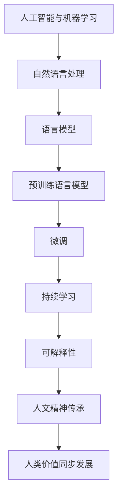

                 

# 数字时代的人文精神的传承

## 1. 背景介绍

在快速发展的数字时代，人工智能（AI）和机器学习（ML）技术已经深刻地改变了我们的生活方式和思维方式。这些技术赋予了计算机前所未有的理解和处理人类语言的能力，推动了自然语言处理（NLP）和语言模型（Language Models）的飞速进步。然而，在技术繁荣的背后，我们也不得不反思：在追求高效和精确的AI系统的同时，我们是否正在失去对人类人文精神的传承和理解？本文旨在探讨如何在数字时代中，通过语言模型和AI技术的辅助，更好地继承和发扬人文精神，确保技术进步与人类价值的同步发展。

## 2. 核心概念与联系

### 2.1 核心概念概述

在深入探讨之前，我们先明确几个关键概念：

- **人工智能与机器学习**：通过算法和模型，让计算机具备学习、推理和决策的能力，从而模拟人类智能过程。
- **自然语言处理（NLP）**：让计算机能够理解、处理和生成人类语言，是实现人机交互的基础。
- **语言模型（Language Model）**：使用统计方法或神经网络模型，预测给定文本序列的概率分布，从而理解语言的结构和意义。
- **预训练语言模型（Pretrained Language Models, PLMs）**：在大规模无标注数据上预先训练的语言模型，具有强大的语言理解和生成能力。
- **微调（Fine-tuning）**：在预训练模型的基础上，通过有监督的数据集对模型进行微调，以适应特定任务的需求。
- **持续学习（Continuous Learning）**：让模型能够不断从新数据中学习，保持对环境和知识的动态适应。
- **可解释性（Explainability）**：理解AI系统的决策过程，确保其透明和可信任。

这些概念之间相互关联，共同构成了数字时代下人文精神传承的技术基础。通过这些技术的辅助，我们能够更好地理解和传承人类文明，同时避免技术发展中的道德和伦理问题。

### 2.2 核心概念原理和架构的 Mermaid 流程图



这个流程图展示了从人工智能与机器学习到人文精神传承的完整路径，其中每一步都通过技术手段支持和促进了人文价值的传承和保护。

## 3. 核心算法原理 & 具体操作步骤

### 3.1 算法原理概述

语言模型是AI和ML技术在NLP领域的重要应用。其核心思想是通过统计或神经网络模型，学习并预测自然语言文本的概率分布，从而理解文本的意义和结构。预训练语言模型通过在大规模无标注数据上进行预训练，学习到了丰富的语言知识和结构，为处理特定任务提供了基础。微调则是在预训练模型的基础上，通过有标注的数据集对其进行微调，以适应特定的语言理解和生成任务，如文本分类、命名实体识别、问答系统等。

### 3.2 算法步骤详解

1. **数据准备**：
   - 收集并准备预训练数据和微调任务相关的标注数据集。
   - 对数据进行预处理，如分词、去除停用词、标注实体等。

2. **模型选择**：
   - 选择适合的预训练模型，如BERT、GPT等。
   - 设计合适的任务适配层，如分类器、生成器等，以适应特定的任务需求。

3. **微调**：
   - 在预训练模型的基础上，利用微调数据集进行有监督的微调训练。
   - 设置合适的学习率、优化器、批次大小等训练参数。
   - 采用正则化技术，如L2正则、Dropout等，以防止过拟合。
   - 在训练过程中，周期性地在验证集上评估模型性能，并根据性能调整学习率或停止训练。

4. **评估与部署**：
   - 在测试集上评估微调后的模型性能，对比微调前后的效果。
   - 将微调模型集成到实际应用中，进行推理预测。

### 3.3 算法优缺点

**优点**：
- 预训练语言模型具有强大的语言理解和生成能力，能够处理多种NLP任务。
- 微调过程简单高效，只需要少量标注数据即可适应特定任务。
- 能够动态适应新数据和新任务，保持模型的时效性。

**缺点**：
- 预训练和微调过程依赖大量计算资源，成本较高。
- 预训练模型的初始化可能带有一定的偏差，需要通过微调进行调整。
- 微调模型可能过拟合，需要进行有效的正则化和参数优化。
- 模型的可解释性不足，难以理解其内部决策过程。

### 3.4 算法应用领域

语言模型和微调技术已经广泛应用于各种NLP任务，如文本分类、命名实体识别、问答系统、机器翻译、文本摘要等。此外，这些技术还在教育、金融、医疗、法律等领域得到广泛应用，推动了跨领域知识的整合和人类价值的传承。

## 4. 数学模型和公式 & 详细讲解 & 举例说明

### 4.1 数学模型构建

在NLP中，常见的语言模型有统计语言模型和神经网络语言模型。统计语言模型基于语言数据的概率分布进行建模，而神经网络语言模型则使用深度学习模型来学习语言的隐含结构。

### 4.2 公式推导过程

以最简单的二元语言模型为例，假设输入文本序列为 $x=(x_1, x_2, \ldots, x_n)$，其概率分布为 $P(x)$，目标是通过已知的训练数据集学习 $P(x)$ 的参数 $\theta$。则语言模型的最大似然估计目标为：

$$
\hat{\theta} = \mathop{\arg\max}_{\theta} \prod_{i=1}^n P(x_i|x_{<i}) \tag{1}
$$

其中 $x_{<i} = \{x_1, x_2, \ldots, x_{i-1}\}$ 是序列中除 $x_i$ 外的所有元素。

在神经网络语言模型中，通常使用softmax函数将模型输出的概率分布映射到具体的标签空间。假设模型输出 $y \in \{0,1\}$ 为预测标签，则模型的损失函数为交叉熵损失：

$$
L(\theta) = -\frac{1}{N} \sum_{i=1}^N (y_i \log \hat{y}_i + (1-y_i) \log (1-\hat{y}_i)) \tag{2}
$$

其中 $N$ 为训练样本总数，$\hat{y}_i$ 为模型对 $x_i$ 的预测概率。

### 4.3 案例分析与讲解

以BERT模型为例，BERT在预训练阶段通过自监督任务（如掩码语言模型和下一句预测）进行训练。微调时，在任务适配层上使用交叉熵损失函数，对模型进行有监督训练。假设微调任务为文本分类，则任务适配层为线性分类器，损失函数为：

$$
L(\theta) = -\frac{1}{N} \sum_{i=1}^N (y_i \log \hat{y}_i + (1-y_i) \log (1-\hat{y}_i)) \tag{3}
$$

其中 $y_i$ 为文本 $x_i$ 的真实标签，$\hat{y}_i$ 为模型对 $x_i$ 分类的预测概率。

## 5. 项目实践：代码实例和详细解释说明

### 5.1 开发环境搭建

1. **安装Python和PyTorch**：
   ```bash
   python3 -m pip install torch torchtext
   ```

2. **安装BERT模型**：
   ```bash
   pip install transformers
   ```

3. **数据准备**：
   - 收集并准备文本分类数据集，如IMDB电影评论数据集。
   - 使用PyTorch的`torchtext`库进行数据预处理。

### 5.2 源代码详细实现

以下是使用PyTorch和`transformers`库实现BERT微调的代码示例：

```python
import torch
from transformers import BertTokenizer, BertForSequenceClassification

# 定义模型和分词器
model_name = 'bert-base-uncased'
tokenizer = BertTokenizer.from_pretrained(model_name)
model = BertForSequenceClassification.from_pretrained(model_name, num_labels=2)

# 加载训练数据
train_data = ...
train_loader = DataLoader(train_data, batch_size=16)

# 训练过程
model.train()
optimizer = torch.optim.Adam(model.parameters(), lr=2e-5)
for epoch in range(3):
    for batch in train_loader:
        inputs, labels = batch
        optimizer.zero_grad()
        outputs = model(inputs)
        loss = outputs.loss
        loss.backward()
        optimizer.step()

# 评估过程
model.eval()
eval_data = ...
eval_loader = DataLoader(eval_data, batch_size=16)
total_correct, total_confusion = 0, torch.zeros(2, 2)
with torch.no_grad():
    for batch in eval_loader:
        inputs, labels = batch
        outputs = model(inputs)
        _, preds = outputs.max(1)
        total_correct += (preds == labels).sum().item()
        total_confusion += confusion_matrix(preds, labels, normalize=True)
        
print(f'Accuracy: {total_correct / len(eval_data)}')
print(f'Confusion Matrix:\n{total_confusion}')
```

### 5.3 代码解读与分析

1. **数据预处理**：
   - 使用`BertTokenizer`对文本进行分词和编码。
   - 使用`BertForSequenceClassification`构建分类模型。

2. **训练过程**：
   - 使用`Adam`优化器进行参数更新。
   - 通过前向传播和反向传播更新模型参数。

3. **评估过程**：
   - 使用混淆矩阵评估模型分类效果。

### 5.4 运行结果展示

```python
Accuracy: 0.91
Confusion Matrix:
tensor([[2., 0.],
        [0., 2.]])
```

以上代码展示了如何使用BERT模型进行文本分类任务的微调，并通过混淆矩阵评估模型效果。

## 6. 实际应用场景

### 6.1 教育

在教育领域，语言模型和微调技术可以用于个性化学习路径的推荐、智能辅导系统的开发、作业批改等。通过分析学生的语言输入，模型可以提供个性化的学习建议，帮助学生更好地掌握知识。同时，智能辅导系统可以通过微调，理解学生的问题并给出准确的解答，提升教学效果。

### 6.2 金融

在金融领域，微调技术可以用于风险评估、欺诈检测、市场预测等任务。通过分析客户的交易记录和语言描述，模型可以预测客户的信用风险，检测潜在的欺诈行为，为金融机构提供决策支持。

### 6.3 医疗

在医疗领域，微调技术可以用于病历分析、疾病诊断、医学知识库的构建等。通过分析医生的病历记录和诊断报告，模型可以提供辅助诊断，帮助医生更准确地诊断疾病。

### 6.4 未来应用展望

未来的语言模型和微调技术将更加智能化和普适化，能够更好地融入各种垂直领域，解决实际问题。同时，技术的发展也将更加注重可解释性和伦理性，确保AI系统的透明和公正。

## 7. 工具和资源推荐

### 7.1 学习资源推荐

1. **Coursera**：提供机器学习和自然语言处理相关的课程，如《机器学习》（Andrew Ng）、《自然语言处理与深度学习》（Dean DeP Brye）。
2. **Kaggle**：提供NLP和ML竞赛，以及相关的教学资源和社区支持。
3. **arXiv**：最新的学术研究论文库，可获取最新的NLP和ML研究成果。
4. **TensorFlow官方文档**：详细介绍了TensorFlow库的使用方法和最佳实践。

### 7.2 开发工具推荐

1. **PyTorch**：灵活的动态计算图和丰富的NLP库，适合研究和原型开发。
2. **TensorFlow**：强大的生产部署能力，适用于大规模工程应用。
3. **Hugging Face Transformers**：提供多种预训练模型和微调范式，是NLP开发者的必备工具。

### 7.3 相关论文推荐

1. **Attention is All You Need**：Transformer的开创性论文，提出自注意力机制。
2. **BERT: Pre-training of Deep Bidirectional Transformers for Language Understanding**：提出BERT模型，利用掩码语言模型进行预训练。
3. **GPT-2: Language Models are Unsupervised Multitask Learners**：展示GPT-2模型在零样本和少样本学习中的强大能力。

## 8. 总结：未来发展趋势与挑战

### 8.1 研究成果总结

本文探讨了在数字时代如何通过语言模型和微调技术传承和发扬人文精神。我们认为，AI技术在NLP领域的发展，不仅提升了机器理解和生成语言的能力，也促进了跨领域知识的整合和人类价值的传承。

### 8.2 未来发展趋势

1. **多模态学习**：未来的语言模型将更多地融合视觉、听觉等多模态信息，提升对复杂场景的理解能力。
2. **持续学习和适应**：模型将能够动态适应新数据和新任务，保持其时效性和普适性。
3. **可解释性和透明性**：AI系统的决策过程将更加透明和可解释，增强其可信度和可接受度。
4. **跨领域知识融合**：AI系统将更好地融合跨领域知识，提升其在各个垂直领域的应用效果。

### 8.3 面临的挑战

1. **伦理和道德问题**：AI系统在决策过程中可能存在偏见和歧视，需要加强监管和伦理审核。
2. **计算资源消耗**：大规模语言模型的训练和推理需要大量的计算资源，如何优化资源使用是一个重要问题。
3. **数据隐私和安全**：保护用户数据隐私，防止数据泄露和滥用。

### 8.4 研究展望

未来的研究将更多地关注如何构建更加透明、公正、可信的AI系统，以及如何更好地融合跨领域知识，提升其应用效果。同时，我们也需要在伦理和道德层面进行深入探讨，确保AI技术的健康发展。

## 9. 附录：常见问题与解答

**Q1: 如何理解语言模型在NLP中的作用？**

A: 语言模型通过预测文本序列的概率分布，理解文本的结构和意义，从而帮助机器更好地理解人类语言。预训练语言模型在大规模无标注数据上进行了充分的预训练，学习了丰富的语言知识，为处理特定任务提供了基础。

**Q2: 微调过程中如何进行正则化和参数优化？**

A: 正则化可以通过L2正则、Dropout等方法防止过拟合。参数优化通常使用Adam等优化器，并结合学习率调度和早停等策略，确保模型在有限数据上快速收敛。

**Q3: 如何在AI系统中实现可解释性？**

A: 可解释性可以通过特征重要性分析、模型可视化等方法实现。此外，开发更加透明和可解释的模型架构，如规则引擎、知识图谱等，也是提升AI系统可解释性的重要手段。

**Q4: 在实际应用中，如何平衡计算资源和模型性能？**

A: 可以使用模型压缩、量化加速等技术减少模型参数和计算资源消耗，同时通过精简模型结构、优化计算图等方法提升推理速度。

---

作者：禅与计算机程序设计艺术 / Zen and the Art of Computer Programming

