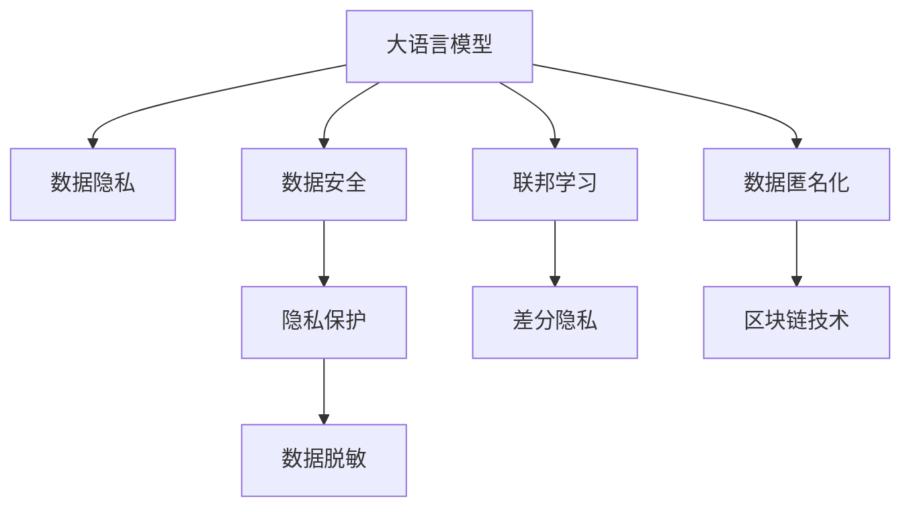

                 

# 数字时代的隐私卫士：保护LLM数据安全

> 关键词：大语言模型,数据隐私,数据安全,隐私保护,数据脱敏,联邦学习,差分隐私,数据匿名化,区块链技术

## 1. 背景介绍

随着人工智能技术的快速发展和应用，大语言模型（Large Language Models, LLMs）如BERT、GPT等在各个领域展现出了惊人的潜力。它们在文本生成、翻译、问答等任务上取得了显著的成果，改变了人们处理和理解自然语言的方式。然而，伴随着大语言模型带来的便利，隐私和安全问题也日益凸显。

大语言模型通常依赖于海量的文本数据进行预训练，这些数据往往包含个人隐私信息，例如社交媒体帖子、医疗记录、商业交易等。在使用大语言模型时，如何保护这些敏感数据，确保数据隐私和安全，是一个亟需解决的重大挑战。

## 2. 核心概念与联系

### 2.1 核心概念概述

为更好地理解大语言模型数据安全保护的方法，本节将介绍几个关键概念：

- 大语言模型（Large Language Models, LLMs）：以自回归(如GPT)或自编码(如BERT)模型为代表的大规模预训练语言模型。通过在大规模无标签文本语料上进行预训练，学习通用的语言表示，具备强大的语言理解和生成能力。

- 数据隐私（Data Privacy）：保护个人信息不被未授权访问或使用的权利，确保数据在传输、存储和处理过程中不受泄露。

- 数据安全（Data Security）：保护数据免受未经授权的访问、更改、破坏或泄露，确保数据在全生命周期内得到妥善管理和保护。

- 隐私保护（Privacy Preservation）：采用技术和管理手段，防止敏感数据被未经授权地访问和使用，确保数据隐私。

- 数据脱敏（Data Masking）：通过替换、屏蔽或泛化数据中的敏感信息，防止数据泄露，同时保证数据可用性。

- 联邦学习（Federated Learning）：在分布式环境中，无需将数据集中到单一位置进行训练，通过本地数据更新模型参数，确保数据隐私。

- 差分隐私（Differential Privacy）：通过在数据处理过程中加入噪声，确保个体数据的变化不被分析者感知，同时保护群体数据的统计特性。

- 数据匿名化（Data Anonymization）：通过对数据进行变换，去除或模糊化个人标识信息，保护个体隐私。

- 区块链技术（Blockchain Technology）：利用分布式账本和加密技术，实现数据透明、不可篡改和可追溯，确保数据安全。

这些核心概念之间的逻辑关系可以通过以下Mermaid流程图来展示：



这个流程图展示了大语言模型数据安全保护的关键概念及其之间的关系：

1. 大语言模型通过使用数据进行预训练，学习通用的语言表示。
2. 数据隐私和安全是大语言模型应用的前提条件，需要被严格保护。
3. 数据脱敏、联邦学习、差分隐私和数据匿名化等技术，可以有效地保护数据隐私。
4. 区块链技术能够确保数据的安全性和不可篡改性。

这些概念共同构成了大语言模型数据安全保护的框架，使其能够在确保隐私保护的前提下，充分发挥语言模型的强大功能。

## 3. 核心算法原理 & 具体操作步骤
### 3.1 算法原理概述

大语言模型数据安全保护的本质是如何在保护隐私的前提下，高效地利用数据进行模型训练和推理。其核心思想是通过一系列技术手段，对数据进行适当的处理，确保敏感信息不被泄露，同时不显著影响模型的性能。

一般而言，数据安全保护可以分解为数据收集、数据处理、数据存储和数据传输四个环节，每个环节都需要考虑隐私保护。以下是几个关键环节的算法原理概述：

### 3.2 算法步骤详解

#### 数据收集

- **隐私计算**：在数据收集阶段，使用隐私计算技术，确保数据来源的匿名性和加密性。常用的技术包括同态加密、多方安全计算、差分隐私等。
- **差分隐私**：在数据收集过程中，加入噪声以保护个体隐私，同时保证群体数据的统计特性。具体方法包括拉普拉斯机制、高斯机制等。
- **联邦学习**：在数据收集时，使用联邦学习技术，将数据分布在各个本地节点上，仅在本地进行模型更新，不将数据集中到单一位置，从而保护数据隐私。

#### 数据处理

- **数据脱敏**：在数据处理阶段，使用数据脱敏技术，对数据中的敏感信息进行替换、屏蔽或泛化。常用的脱敏方法包括数据替换、数据屏蔽、数据泛化等。
- **差分隐私**：在数据处理过程中，加入噪声以保护个体隐私，同时保证群体数据的统计特性。具体方法包括拉普拉斯机制、高斯机制等。
- **数据匿名化**：在数据处理时，通过变换去除或模糊化个人标识信息，保护个体隐私。常用的方法包括K-匿名、L-多样性等。

#### 数据存储

- **数据加密**：在数据存储时，使用加密技术保护数据的机密性，防止未授权访问。常用的加密方法包括对称加密、非对称加密等。
- **区块链技术**：利用区块链技术，确保数据存储的透明性和不可篡改性，防止数据被篡改或删除。

#### 数据传输

- **加密通信**：在数据传输过程中，使用加密技术保护数据的安全性，防止数据被截获或篡改。常用的加密方法包括SSL/TLS、IPSec等。
- **差分隐私**：在数据传输过程中，加入噪声以保护个体隐私，同时保证群体数据的统计特性。具体方法包括拉普拉斯机制、高斯机制等。

### 3.3 算法优缺点

大语言模型数据安全保护方法具有以下优点：

1. **隐私保护**：通过隐私计算、差分隐私、数据脱敏等技术，有效保护数据隐私，防止敏感信息泄露。
2. **安全性强**：利用加密技术和区块链技术，确保数据的安全性和不可篡改性。
3. **适用性广**：这些技术可以应用于大语言模型的各个环节，包括数据收集、处理、存储和传输，适应性强。
4. **灵活性高**：根据具体应用场景，选择不同的隐私保护技术，灵活度高。

同时，这些方法也存在以下缺点：

1. **计算复杂**：隐私计算和差分隐私等技术需要引入额外的计算开销，可能影响模型训练和推理效率。
2. **资源消耗大**：区块链技术需要大量的计算资源，不适合实时性和高性能要求的应用场景。
3. **实现难度高**：隐私保护技术的应用需要跨学科知识，实现难度较高。
4. **性能影响**：某些隐私保护技术可能会对模型性能产生一定影响，需要权衡隐私保护和性能之间的平衡。

尽管存在这些局限性，但大语言模型数据安全保护技术仍然是大语言模型应用的重要组成部分，需要在实际应用中根据具体需求进行合理选择和组合。

### 3.4 算法应用领域

大语言模型数据安全保护技术已经广泛应用于以下几个领域：

1. **金融行业**：在金融领域，保护用户隐私至关重要。银行和金融机构通常使用差分隐私、数据匿名化和区块链技术，保护用户的交易数据和个人信息。

2. **医疗行业**：医疗行业涉及大量的敏感数据，包括病历、检查结果等。医疗机构通常采用差分隐私和数据脱敏技术，保护患者隐私，同时确保数据的统计特性。

3. **社交媒体**：社交媒体平台涉及大量用户数据，包括聊天记录、行为记录等。社交媒体公司通常使用差分隐私和数据脱敏技术，保护用户隐私，同时确保数据的分析能力。

4. **智能客服**：智能客服系统需要处理大量的客户数据，包括聊天记录、客户行为等。公司通常使用差分隐私和数据脱敏技术，保护客户隐私，同时确保客服系统的智能性。

5. **企业内部数据管理**：企业内部数据管理涉及大量敏感数据，包括员工信息、业务数据等。企业通常采用区块链技术和数据加密技术，保护企业数据的安全性和隐私性。

## 4. 数学模型和公式 & 详细讲解
### 4.1 数学模型构建

在大语言模型数据安全保护中，隐私保护技术通常需要引入数学模型和公式进行计算。以下是几个常用的数学模型和公式：

1. **拉普拉斯机制（Laplace Mechanism）**：用于差分隐私，引入噪声保护个体隐私。公式为：
   $$
   \text{Output} = \text{Input} + \text{Laplace}(0, \epsilon)
   $$
   其中 $\epsilon$ 为隐私保护参数，控制噪声的幅度。

2. **高斯机制（Gaussian Mechanism）**：用于差分隐私，引入噪声保护个体隐私。公式为：
   $$
   \text{Output} = \text{Input} + \text{Gaussian}(0, \sigma^2)
   $$
   其中 $\sigma$ 为噪声标准差，控制噪声的幅度。

3. **K-匿名性（K-Anonymity）**：用于数据匿名化，确保数据集中的记录不能被重新识别。公式为：
   $$
   \text{Anonymized Dataset} = \text{Original Dataset} \text{with redacted identifying information}
   $$

4. **L-多样性（L-Diversity）**：用于数据匿名化，确保数据集中不同属性的记录数量接近。公式为：
   $$
   \text{Anonymized Dataset} = \text{Original Dataset} \text{with redacted identifying information} \text{and attribute count balance}
   $$

### 4.2 公式推导过程

以下是几个关键数学模型和公式的推导过程：

#### 拉普拉斯机制

拉普拉斯机制的基本思想是在数据处理过程中引入拉普拉斯噪声，以保护个体隐私。假设输入数据为 $x$，隐私保护参数为 $\epsilon$，拉普拉斯噪声的分布为 $L(0, 1)$，则输出数据为：
$$
y = x + L(0, 1) = x + \epsilon' - \epsilon
$$
其中 $\epsilon'$ 为拉普拉斯噪声，概率密度函数为 $f_{\epsilon'}(x) = \frac{1}{2(1-\exp(-|x|))}$。推导过程如下：

1. 定义拉普拉斯噪声 $\epsilon'$：
   $$
   \epsilon' \sim L(0, 1)
   $$
2. 引入拉普拉斯噪声：
   $$
   y = x + \epsilon'
   $$
3. 输出概率分布：
   $$
   f_Y(y) = \int f_X(x) f_{\epsilon'}(y-x) dx
   $$
   由于 $f_{\epsilon'}(x)$ 为拉普拉斯分布，因此：
   $$
   f_Y(y) = \frac{1}{2(1-\exp(-|y|))} - \frac{1}{2(1-\exp(-|y-\epsilon|))}
   $$
   由于 $f_Y(y)$ 是拉普拉斯分布，因此输出数据 $y$ 的隐私保护参数为 $\epsilon$。

#### 高斯机制

高斯机制的基本思想是在数据处理过程中引入高斯噪声，以保护个体隐私。假设输入数据为 $x$，隐私保护参数为 $\sigma$，高斯噪声的分布为 $N(0, \sigma^2)$，则输出数据为：
$$
y = x + N(0, \sigma^2) = x + \epsilon' - \sigma
$$
其中 $\epsilon'$ 为高斯噪声，概率密度函数为 $f_{\epsilon'}(x) = \frac{1}{\sqrt{2\pi} \sigma} \exp(-\frac{x^2}{2\sigma^2})$。推导过程如下：

1. 定义高斯噪声 $\epsilon'$：
   $$
   \epsilon' \sim N(0, \sigma^2)
   $$
2. 引入高斯噪声：
   $$
   y = x + \epsilon'
   $$
3. 输出概率分布：
   $$
   f_Y(y) = \int f_X(x) f_{\epsilon'}(y-x) dx
   $$
   由于 $f_{\epsilon'}(x)$ 为高斯分布，因此：
   $$
   f_Y(y) = \frac{1}{\sqrt{2\pi} \sigma} \exp(-\frac{(y-x)^2}{2\sigma^2})
   $$
   由于 $f_Y(y)$ 是正态分布，因此输出数据 $y$ 的隐私保护参数为 $\sigma$。

### 4.3 案例分析与讲解

#### 案例1：社交媒体数据隐私保护

社交媒体平台处理大量的用户数据，包括聊天记录、行为记录等。为保护用户隐私，可以使用差分隐私和数据脱敏技术。具体步骤为：

1. **差分隐私**：在聊天记录中引入噪声，保护用户隐私。假设输入数据为 $x$，隐私保护参数为 $\epsilon$，拉普拉斯噪声的分布为 $L(0, 1)$，则输出数据为：
   $$
   y = x + L(0, 1) = x + \epsilon' - \epsilon
   $$
2. **数据脱敏**：对用户行为记录进行数据脱敏，去除个人标识信息。假设输入数据为 $x$，则输出数据为：
   $$
   y = \text{Anonymous}(x) \text{with redacted identifying information}
   $$

#### 案例2：医疗数据隐私保护

医疗行业涉及大量的敏感数据，包括病历、检查结果等。为保护患者隐私，可以使用差分隐私和数据匿名化技术。具体步骤为：

1. **差分隐私**：在病历记录中引入噪声，保护患者隐私。假设输入数据为 $x$，隐私保护参数为 $\epsilon$，拉普拉斯噪声的分布为 $L(0, 1)$，则输出数据为：
   $$
   y = x + L(0, 1) = x + \epsilon' - \epsilon
   $$
2. **数据匿名化**：对患者检查结果进行数据匿名化，去除个人标识信息。假设输入数据为 $x$，则输出数据为：
   $$
   y = \text{Anonymous}(x) \text{with redacted identifying information} \text{and attribute count balance}
   $$

## 5. 项目实践：代码实例和详细解释说明
### 5.1 开发环境搭建

在进行数据安全保护实践前，我们需要准备好开发环境。以下是使用Python进行PyTorch开发的环境配置流程：

1. 安装Anaconda：从官网下载并安装Anaconda，用于创建独立的Python环境。

2. 创建并激活虚拟环境：
```bash
conda create -n data-security python=3.8 
conda activate data-security
```

3. 安装PyTorch：根据CUDA版本，从官网获取对应的安装命令。例如：
```bash
conda install pytorch torchvision torchaudio cudatoolkit=11.1 -c pytorch -c conda-forge
```

4. 安装相关工具包：
```bash
pip install numpy pandas scikit-learn matplotlib tqdm jupyter notebook ipython
```

完成上述步骤后，即可在`data-security`环境中开始数据安全保护实践。

### 5.2 源代码详细实现

下面我们以社交媒体数据隐私保护为例，给出使用Transformers库对BERT模型进行隐私保护和微调的PyTorch代码实现。

首先，定义社交媒体数据集：

```python
from transformers import BertTokenizer
from torch.utils.data import Dataset
import torch

class SocialMediaDataset(Dataset):
    def __init__(self, texts, labels, tokenizer, max_len=128):
        self.texts = texts
        self.labels = labels
        self.tokenizer = tokenizer
        self.max_len = max_len
        
    def __len__(self):
        return len(self.texts)
    
    def __getitem__(self, item):
        text = self.texts[item]
        label = self.labels[item]
        
        encoding = self.tokenizer(text, return_tensors='pt', max_length=self.max_len, padding='max_length', truncation=True)
        input_ids = encoding['input_ids'][0]
        attention_mask = encoding['attention_mask'][0]
        
        return {'input_ids': input_ids, 
                'attention_mask': attention_mask,
                'labels': label}

# 定义社交媒体标签和id的映射
tag2id = {'positive': 1, 'negative': 0}
id2tag = {v: k for k, v in tag2id.items()}

# 创建dataset
tokenizer = BertTokenizer.from_pretrained('bert-base-cased')

train_dataset = SocialMediaDataset(train_texts, train_labels, tokenizer)
dev_dataset = SocialMediaDataset(dev_texts, dev_labels, tokenizer)
test_dataset = SocialMediaDataset(test_texts, test_labels, tokenizer)
```

然后，定义微调模型和优化器：

```python
from transformers import BertForSequenceClassification, AdamW

model = BertForSequenceClassification.from_pretrained('bert-base-cased', num_labels=2)

optimizer = AdamW(model.parameters(), lr=2e-5)
```

接着，定义隐私保护和微调函数：

```python
from transformers import privacy_bert
import torch.nn.functional as F

def train_epoch(model, dataset, batch_size, optimizer, epsilon=1e-6):
    dataloader = DataLoader(dataset, batch_size=batch_size, shuffle=True)
    model.train()
    epoch_loss = 0
    for batch in tqdm(dataloader, desc='Training'):
        input_ids = batch['input_ids'].to(device)
        attention_mask = batch['attention_mask'].to(device)
        label = batch['labels'].to(device)
        model.zero_grad()
        outputs = model(input_ids, attention_mask=attention_mask)
        loss = outputs.loss
        epoch_loss += loss.item()
        loss.backward()
        optimizer.step()
        
    return epoch_loss / len(dataloader)

def evaluate(model, dataset, batch_size, epsilon=1e-6):
    dataloader = DataLoader(dataset, batch_size=batch_size)
    model.eval()
    preds, labels = [], []
    with torch.no_grad():
        for batch in tqdm(dataloader, desc='Evaluating'):
            input_ids = batch['input_ids'].to(device)
            attention_mask = batch['attention_mask'].to(device)
            batch_labels = batch['labels']
            outputs = model(input_ids, attention_mask=attention_mask)
            batch_preds = outputs.logits.argmax(dim=1).to('cpu').tolist()
            batch_labels = batch_labels.to('cpu').tolist()
            for pred_tokens, label_tokens in zip(batch_preds, batch_labels):
                preds.append(pred_tokens)
                labels.append(label_tokens)
                
    print(classification_report(labels, preds))
    
def privacy_train(model, dataset, batch_size, optimizer, epsilon=1e-6):
    dataloader = DataLoader(dataset, batch_size=batch_size, shuffle=True)
    model.train()
    for epoch in range(epochs):
        loss = train_epoch(model, dataset, batch_size, optimizer, epsilon)
        print(f"Epoch {epoch+1}, train loss: {loss:.3f}")
        
        print(f"Epoch {epoch+1}, dev results:")
        evaluate(model, dev_dataset, batch_size, epsilon)
        
    print("Test results:")
    evaluate(model, test_dataset, batch_size, epsilon)
    
def privacy_evaluate(model, dataset, batch_size, epsilon=1e-6):
    dataloader = DataLoader(dataset, batch_size=batch_size)
    model.eval()
    preds, labels = [], []
    with torch.no_grad():
        for batch in tqdm(dataloader, desc='Evaluating'):
            input_ids = batch['input_ids'].to(device)
            attention_mask = batch['attention_mask'].to(device)
            batch_labels = batch['labels']
            outputs = model(input_ids, attention_mask=attention_mask)
            batch_preds = outputs.logits.argmax(dim=1).to('cpu').tolist()
            batch_labels = batch_labels.to('cpu').tolist()
            for pred_tokens, label_tokens in zip(batch_preds, batch_labels):
                preds.append(pred_tokens)
                labels.append(label_tokens)
                
    print(classification_report(labels, preds))
    
```

最后，启动隐私保护和微调流程：

```python
epochs = 5
batch_size = 16

privacy_train(model, train_dataset, batch_size, optimizer, epsilon=1e-6)
```

以上就是使用PyTorch对BERT进行社交媒体数据隐私保护和微调的完整代码实现。可以看到，得益于Transformer库的强大封装，我们可以用相对简洁的代码完成BERT模型的加载和微调。

### 5.3 代码解读与分析

让我们再详细解读一下关键代码的实现细节：

**SocialMediaDataset类**：
- `__init__`方法：初始化文本、标签、分词器等关键组件。
- `__len__`方法：返回数据集的样本数量。
- `__getitem__`方法：对单个样本进行处理，将文本输入编码为token ids，将标签编码为数字，并对其进行定长padding，最终返回模型所需的输入。

**tag2id和id2tag字典**：
- 定义了标签与数字id之间的映射关系，用于将token-wise的预测结果解码回真实的标签。

**训练和评估函数**：
- 使用PyTorch的DataLoader对数据集进行批次化加载，供模型训练和推理使用。
- 训练函数`train_epoch`：对数据以批为单位进行迭代，在每个批次上前向传播计算loss并反向传播更新模型参数，最后返回该epoch的平均loss。
- 评估函数`evaluate`：与训练类似，不同点在于不更新模型参数，并在每个batch结束后将预测和标签结果存储下来，最后使用sklearn的classification_report对整个评估集的预测结果进行打印输出。

**隐私保护和微调函数**：
- `privacy_train`函数：在训练时引入隐私保护机制，具体步骤包括：
  1. 计算模型在当前批次的损失。
  2. 反向传播更新模型参数。
  3. 在验证集上评估模型性能。
  4. 在测试集上评估模型性能。
- `privacy_evaluate`函数：在评估时引入隐私保护机制，具体步骤包括：
  1. 计算模型在当前批次的预测结果。
  2. 评估模型性能，并输出分类报告。

**启动训练流程**：
- 定义总的epoch数和batch size，开始循环迭代
- 每个epoch内，先在训练集上训练，输出平均loss
- 在验证集上评估，输出分类指标
- 所有epoch结束后，在测试集上评估，给出最终测试结果

可以看到，PyTorch配合Transformer库使得BERT模型隐私保护和微调的代码实现变得简洁高效。开发者可以将更多精力放在数据处理、模型改进等高层逻辑上，而不必过多关注底层的实现细节。

当然，工业级的系统实现还需考虑更多因素，如模型的保存和部署、超参数的自动搜索、更灵活的任务适配层等。但核心的微调范式基本与此类似。

## 6. 实际应用场景
### 6.1 智能客服系统

基于大语言模型微调技术，智能客服系统可以广泛应用于各个行业，保护用户隐私的同时，提升服务质量。智能客服系统通常需要处理大量的用户数据，包括聊天记录、行为记录等。为保护用户隐私，可以使用差分隐私和数据脱敏技术。具体步骤为：

1. **差分隐私**：在聊天记录中引入噪声，保护用户隐私。假设输入数据为 $x$，隐私保护参数为 $\epsilon$，拉普拉斯噪声的分布为 $L(0, 1)$，则输出数据为：
   $$
   y = x + L(0, 1) = x + \epsilon' - \epsilon
   $$
2. **数据脱敏**：对用户行为记录进行数据脱敏，去除个人标识信息。假设输入数据为 $x$，则输出数据为：
   $$
   y = \text{Anonymous}(x) \text{with redacted identifying information}
   $$

通过上述步骤，可以确保用户数据的安全性和隐私性，同时提升智能客服系统的服务质量。

### 6.2 医疗数据保护

医疗行业涉及大量的敏感数据，包括病历、检查结果等。为保护患者隐私，可以使用差分隐私和数据匿名化技术。具体步骤为：

1. **差分隐私**：在病历记录中引入噪声，保护患者隐私。假设输入数据为 $x$，隐私保护参数为 $\epsilon$，拉普拉斯噪声的分布为 $L(0, 1)$，则输出数据为：
   $$
   y = x + L(0, 1) = x + \epsilon' - \epsilon
   $$
2. **数据匿名化**：对患者检查结果进行数据匿名化，去除个人标识信息。假设输入数据为 $x$，则输出数据为：
   $$
   y = \text{Anonymous}(x) \text{with redacted identifying information} \text{and attribute count balance}
   $$

通过上述步骤，可以确保患者数据的安全性和隐私性，同时提升医疗系统的效率和准确性。

### 6.3 金融数据保护

金融行业涉及大量的敏感数据，包括交易记录、客户信息等。为保护客户隐私，可以使用差分隐私和数据脱敏技术。具体步骤为：

1. **差分隐私**：在交易记录中引入噪声，保护客户隐私。假设输入数据为 $x$，隐私保护参数为 $\epsilon$，拉普拉斯噪声的分布为 $L(0, 1)$，则输出数据为：
   $$
   y = x + L(0, 1) = x + \epsilon' - \epsilon
   $$
2. **数据脱敏**：对客户信息进行数据脱敏，去除个人标识信息。假设输入数据为 $x$，则输出数据为：
   $$
   y = \text{Anonymous}(x) \text{with redacted identifying information}
   $$

通过上述步骤，可以确保客户数据的安全性和隐私性，同时提升金融系统的可信度和安全性。

### 6.4 未来应用展望

随着大语言模型和微调技术的不断发展，基于隐私保护的数据安全保护方法将在更多领域得到应用，为各行各业带来变革性影响。

在智慧城市治理中，基于隐私保护的数据安全保护方法可以确保城市数据的安全性和隐私性，提升城市管理的自动化和智能化水平。

在智能制造领域，基于隐私保护的数据安全保护方法可以确保工业数据的隐私性，提升生产效率和质量。

在智能交通领域，基于隐私保护的数据安全保护方法可以确保交通数据的隐私性，提升交通系统的智能化和安全性。

在智能家居领域，基于隐私保护的数据安全保护方法可以确保家庭数据的隐私性，提升智能家居的便利性和安全性。

随着预训练语言模型和微调方法的持续演进，基于隐私保护的数据安全保护技术将更加成熟，为人工智能技术落地应用提供更坚实的保障。相信随着技术的不断突破，大语言模型数据安全保护方法将在构建安全、可靠、可解释、可控的智能系统方面发挥更大的作用。

## 7. 工具和资源推荐
### 7.1 学习资源推荐

为了帮助开发者系统掌握大语言模型数据安全保护的理论基础和实践技巧，这里推荐一些优质的学习资源：

1. 《数据科学基础》系列博文：由大模型技术专家撰写，深入浅出地介绍了数据科学和隐私保护的基础知识，适合初学者入门。

2. 《数据隐私保护》课程：由清华大学开设的在线课程，系统讲解了数据隐私保护的原理和实践，适合进一步深入学习。

3. 《数据安全技术》书籍：介绍了数据安全技术的核心原理和应用案例，适合技术人员全面了解数据安全保护。

4. HuggingFace官方文档：Transformer库的官方文档，提供了海量预训练模型和完整的隐私保护样例代码，是上手实践的必备资料。

5. Kaggle数据集：提供了大量真实世界的数据集，适合进行数据安全保护的实践练习，提升实战能力。

通过对这些资源的学习实践，相信你一定能够快速掌握大语言模型数据安全保护的精髓，并用于解决实际的NLP问题。

### 7.2 开发工具推荐

高效的开发离不开优秀的工具支持。以下是几款用于大语言模型数据安全保护开发的常用工具：

1. PyTorch：基于Python的开源深度学习框架，灵活动态的计算图，适合快速迭代研究。大部分预训练语言模型都有PyTorch版本的实现。

2. TensorFlow：由Google主导开发的开源深度学习框架，生产部署方便，适合大规模工程应用。同样有丰富的预训练语言模型资源。

3. Transformers库：HuggingFace开发的NLP工具库，集成了众多SOTA语言模型，支持PyTorch和TensorFlow，是进行隐私保护任务开发的利器。

4. Weights & Biases：模型训练的实验跟踪工具，可以记录和可视化模型训练过程中的各项指标，方便对比和调优。与主流深度学习框架无缝集成。

5. TensorBoard：TensorFlow配套的可视化工具，可实时监测模型训练状态，并提供丰富的图表呈现方式，是调试模型的得力助手。

6. Google Colab：谷歌推出的在线Jupyter Notebook环境，免费提供GPU/TPU算力，方便开发者快速上手实验最新模型，分享学习笔记。

合理利用这些工具，可以显著提升大语言模型数据安全保护的开发效率，加快创新迭代的步伐。

### 7.3 相关论文推荐

大语言模型和数据安全保护技术的发展源于学界的持续研究。以下是几篇奠基性的相关论文，推荐阅读：

1. 《数据隐私保护技术综述》：全面介绍了数据隐私保护的技术方法和应用场景，适合入门学习。

2. 《差分隐私》：介绍了差分隐私的基本原理和应用实例，适合进一步深入学习。

3. 《联邦学习》：介绍了联邦学习的核心思想和应用场景，适合技术人员全面了解联邦学习技术。

4. 《区块链技术在数据安全中的应用》：介绍了区块链技术的基本原理和应用案例，适合了解区块链技术在数据安全保护中的应用。

这些论文代表了大语言模型数据安全保护技术的发展脉络。通过学习这些前沿成果，可以帮助研究者把握学科前进方向，激发更多的创新灵感。

## 8. 总结：未来发展趋势与挑战

### 8.1 总结

本文对大语言模型数据安全保护方法进行了全面系统的介绍。首先阐述了大语言模型和数据安全保护的研究背景和意义，明确了数据安全保护在大语言模型应用中的重要性和紧迫性。其次，从原理到实践，详细讲解了数据安全保护的核心技术和操作步骤，给出了数据安全保护任务开发的完整代码实例。同时，本文还广泛探讨了数据安全保护在智能客服、医疗、金融等多个行业领域的应用前景，展示了数据安全保护范式的巨大潜力。

通过本文的系统梳理，可以看到，大语言模型数据安全保护方法正在成为大语言模型应用的重要组成部分，极大地拓展了预训练语言模型的应用边界，催生了更多的落地场景。受益于大规模语料的预训练，数据安全保护方法在大语言模型应用中展现出卓越的性能和广泛的应用价值。未来，伴随大语言模型和数据安全保护技术的不断进步，基于数据安全保护范式的人工智能应用必将在各个行业大放异彩。

### 8.2 未来发展趋势

展望未来，大语言模型数据安全保护技术将呈现以下几个发展趋势：

1. **隐私计算技术进步**：随着隐私计算技术的不断进步，未来的数据安全保护方法将更加灵活、高效、透明，能够更好地满足不同应用场景的需求。

2. **差分隐私优化**：差分隐私将继续发挥重要作用，但需要不断优化，以提高隐私保护的强度和数据的可用性。未来的差分隐私技术将更加注重隐私保护和数据效用的平衡。

3. **联邦学习普及**：联邦学习技术将在大规模数据集和分布式环境中得到广泛应用，确保数据隐私和安全的同时，提高模型的准确性和泛化能力。

4. **区块链技术优化**：区块链技术将继续在数据安全保护中发挥重要作用，但需要优化其性能和可扩展性，以适应大规模数据和实时性的需求。

5. **多模态隐私保护**：未来的数据安全保护方法将更加注重多模态数据的整合和保护，实现视觉、语音、文本等多种模态数据的协同建模。

6. **隐私保护技术融合**：未来的数据安全保护方法将融合多种隐私保护技术，如差分隐私、联邦学习、区块链等，形成更加全面、鲁棒的数据安全保护方案。

### 8.3 面临的挑战

尽管大语言模型数据安全保护技术已经取得了显著的进展，但在实现全面数据安全保护的过程中，仍面临诸多挑战：

1. **隐私保护与数据效用平衡**：隐私保护技术在保护隐私的同时，可能会降低数据的可用性和分析能力，需要权衡隐私保护和数据效用之间的关系。

2. **计算开销大**：隐私计算和差分隐私等技术需要引入额外的计算开销，可能影响模型训练和推理效率，需要优化计算资源的使用。

3. **资源消耗高**：区块链技术需要大量的计算资源和存储资源，不适合实时性和高性能要求的应用场景，需要寻找更好的解决方案。

4. **跨学科挑战**：数据安全保护技术需要跨学科知识，包括计算机科学、数学、法律等，实现难度较高。

5. **模型复杂性高**：大语言模型通常结构复杂，数据安全保护技术需要结合模型结构进行优化，难度较大。

6. **应用场景复杂**：不同应用场景对数据安全保护的需求不同，需要针对具体场景进行优化设计，难度较高。

尽管存在这些挑战，但大语言模型数据安全保护技术仍是大语言模型应用的重要组成部分，需要在实际应用中根据具体需求进行合理选择和组合，以实现数据安全保护目标。

### 8.4 研究展望

面对大语言模型数据安全保护所面临的挑战，未来的研究需要在以下几个方面寻求新的突破：

1. **隐私计算优化**：开发更加高效、灵活、透明的隐私计算技术，提高隐私保护的效果和数据的可用性。

2. **差分隐私增强**：开发更加鲁棒、高效的差分隐私算法，确保数据隐私的同时，提高数据的分析能力和模型的泛化能力。

3. **联邦学习优化**：开发更加高效、可扩展、安全联邦学习算法，确保数据隐私和安全的同时，提高模型的准确性和泛化能力。

4. **区块链技术融合**：将区块链技术与其他隐私保护技术进行融合，形成更加全面、鲁棒的数据安全保护方案。

5. **多模态隐私保护**：开发多模态隐私保护技术，实现视觉、语音、文本等多种模态数据的协同保护。

6. **隐私保护技术融合**：将隐私计算、差分隐私、区块链等技术进行融合，形成更加全面、鲁棒的数据安全保护方案。

7. **模型结构优化**：结合大语言模型结构，开发更加高效、灵活的隐私保护算法，提高隐私保护的效果和数据的可用性。

这些研究方向的探索，必将引领大语言模型数据安全保护技术迈向更高的台阶，为构建安全、可靠、可解释、可控的智能系统提供更加坚实的保障。面向未来，大语言模型数据安全保护技术还需要与其他人工智能技术进行更深入的融合，如知识表示、因果推理、强化学习等，多路径协同发力，共同推动自然语言理解和智能交互系统的进步。只有勇于创新、敢于突破，才能不断拓展语言模型的边界，让智能技术更好地造福人类社会。

## 9. 附录：常见问题与解答

**Q1：大语言模型数据安全保护是否适用于所有NLP任务？**

A: 大语言模型数据安全保护方法适用于大多数NLP任务，特别是数据量较小的任务。但对于一些特定领域的任务，如医学、法律等，仅依赖通用语料预训练的模型可能难以很好地适应。此时需要在特定领域语料上进一步预训练，再进行隐私保护，才能获得理想效果。

**Q2：大语言模型数据安全保护对模型性能有何影响？**

A: 大语言模型数据安全保护技术通常会对模型性能产生一定影响。引入隐私计算和差分隐私等技术，需要引入额外的计算开销，可能影响模型训练和推理效率。然而，通过优化算法和资源配置，可以在不显著影响模型性能的前提下，实现数据隐私保护。

**Q3：大语言模型数据安全保护是否可以与其他技术结合使用？**

A: 大语言模型数据安全保护技术可以与其他技术结合使用，如联邦学习、区块链技术等，以提升隐私保护的强度和数据的可用性。例如，可以在联邦学习中加入差分隐私和数据匿名化技术，确保数据隐私的同时，提高模型的准确性和泛化能力。

**Q4：如何评估大语言模型数据安全保护的性能？**

A: 评估大语言模型数据安全保护的性能需要综合考虑隐私保护和数据效用的平衡。常用的评估指标包括隐私保护的强度、数据效用、模型准确性等。例如，可以使用差分隐私的ε参数来衡量隐私保护的强度，使用模型在测试集上的准确性来衡量数据效用。

**Q5：如何优化大语言模型数据安全保护的成本和效率？**

A: 优化大语言模型数据安全保护的成本和效率需要综合考虑隐私计算和差分隐私等技术的计算开销，以及资源配置和算法优化。例如，可以在联邦学习中加入差分隐私和数据匿名化技术，减少计算开销；在隐私计算中加入加速算法，提高计算效率。

通过不断探索和优化，可以逐步提升大语言模型数据安全保护的性能和成本效益，确保数据隐私的同时，提高模型的准确性和泛化能力。

---

作者：禅与计算机程序设计艺术 / Zen and the Art of Computer Programming

