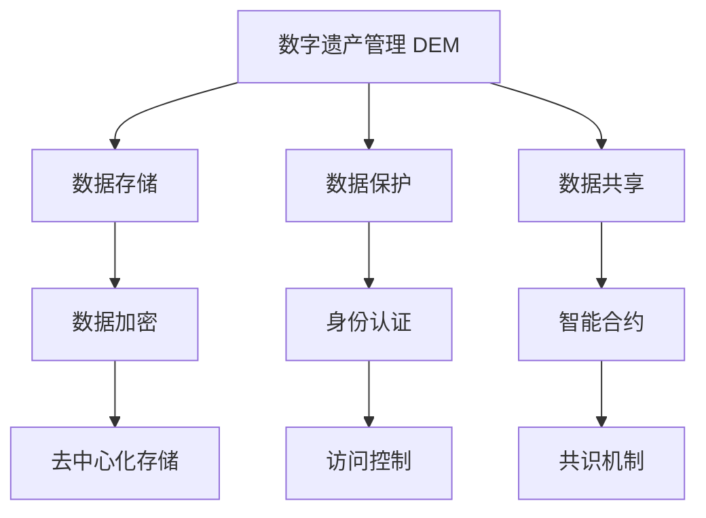

                 

# 数字遗产创业：管理数字资产的新需求

> 关键词：数字遗产管理, 数字资产, 数据存储, 数据保护, 区块链技术, 数据共享, 数据隐私

## 1. 背景介绍

### 1.1 问题由来
数字遗产是指个人在数字世界中的所有数据资产，包括社交媒体帖子、电子邮件、文档、音乐、视频等。随着数字化时代的到来，越来越多的人在数字世界中积累了大量宝贵的个人信息和创作成果。然而，这些数字遗产管理仍面临诸多挑战：数据存储分散、共享困难、隐私保护不足、继承分配问题等。这些问题不仅影响个人数据的持续可用性和价值，也给继承人带来了诸多困扰。

### 1.2 问题核心关键点
数字遗产管理涉及到数据存储、数据保护、数据共享和数据隐私等多个方面，其核心问题包括：
- 数据分散存储：数据往往分布在不同平台和设备上，难以统一管理和访问。
- 数据隐私保护：个人数据泄露风险高，需保证数据安全性。
- 数据共享难题：继承人和其他利益相关方需要合理共享数据。
- 数据继承和分配：合理、合法地分配和管理数字遗产。

这些关键问题催生了数字遗产创业的契机，即开发创新的数字遗产管理工具和平台，提升数字资产的管理效率和价值。

### 1.3 问题研究意义
数字遗产创业不仅有助于解决个人和企业的数据管理问题，还具备以下几方面意义：
1. 数据安全与隐私保护：保障用户数据的安全和隐私，防止非法访问和滥用。
2. 数据共享与协作：便于数据在不同用户和组织间的合理共享，促进协作。
3. 数据继承与分配：提供合法合规的数字遗产管理方案，解决继承和分配难题。
4. 数据价值提升：通过合理的管理和优化，提升数字资产的经济价值和社会效益。
5. 企业发展：数字遗产管理市场需求大，开辟了新的商业模式和业务机会。

## 2. 核心概念与联系

### 2.1 核心概念概述

为更好地理解数字遗产创业的关键技术，本节将介绍几个核心概念：

- 数字遗产管理(Digital Estate Management, DEM): 对个人或企业数字资产进行统一存储、管理和访问的过程。
- 数据存储(Data Storage): 在计算机系统中保存和管理数据的物理或逻辑手段。
- 数据保护(Data Protection): 防止数据丢失、破坏和泄露，保证数据安全和隐私的措施。
- 数据共享(Data Sharing): 在不同用户、组织间合理共享数据，促进数据利用和合作。
- 区块链技术(Blockchain Technology): 一种去中心化的分布式账本技术，保障数据透明性和安全性。

这些概念之间相互关联，共同构成了数字遗产创业的技术基础。通过理解这些核心概念，我们可以更好地把握数字遗产管理的技术实现路径和应用场景。

### 2.2 核心概念原理和架构的 Mermaid 流程图



这个流程图展示了数字遗产管理中各个核心概念的相互关系：

1. 数字遗产管理 DEM 通过统一存储和管理数据，为数据保护、共享和继承等环节提供基础。
2. 数据存储 B 是数字遗产管理的基础设施，包括传统存储设备和新兴的去中心化存储 H。
3. 数据保护 C 确保数据的安全和隐私，包括加密 E、身份认证 F 和访问控制 I 等技术。
4. 数据共享 D 实现数据的合理流动和利用，智能合约 G 用于管理数据共享规则。
5. 区块链技术 J 保障数据透明性和安全性，共识机制是其核心组成部分。

## 3. 核心算法原理 & 具体操作步骤
### 3.1 算法原理概述

数字遗产管理涉及多方面的核心算法和技术，主要包括：

- 数据加密与解密算法：保护数据在存储和传输过程中的安全。
- 身份认证与访问控制算法：确保只有合法用户能够访问和管理数据。
- 智能合约算法：实现数据共享和继承分配的自动化和透明化。
- 去中心化存储算法：通过区块链技术实现数据分布式存储和管理。

这些算法共同构建了数字遗产管理的底层技术框架，保障了数据的安全、共享和继承分配等核心功能。

### 3.2 算法步骤详解

数字遗产管理系统的核心算法步骤如下：

**Step 1: 数据收集与分类**
- 收集个人或企业所有的数字资产，如社交媒体、文档、音乐、视频等。
- 根据数据类型和重要程度，进行分类和整理。

**Step 2: 数据加密与存储**
- 对重要数据进行加密处理，确保数据在存储过程中的安全。
- 选择合适的数据存储设备或平台，实现数据的集中或分布式存储。

**Step 3: 身份认证与访问控制**
- 设计安全的身份认证机制，确保只有授权用户可以访问系统。
- 实现细粒度的访问控制，限制用户对数据的访问权限。

**Step 4: 数据共享与协作**
- 通过智能合约和区块链技术，实现数据在不同用户和组织间的合理共享。
- 制定数据共享规则，确保共享过程透明和公平。

**Step 5: 数据继承与分配**
- 根据用户遗嘱或法律规定，自动处理数字遗产的继承和分配。
- 确保继承和分配过程合法合规，保护各方利益。

**Step 6: 数据监控与审计**
- 实时监控系统运行状态，及时发现和处理异常情况。
- 定期进行数据审计，确保数据的完整性和安全性。

### 3.3 算法优缺点

数字遗产管理算法的优缺点如下：

**优点：**
1. 保障数据安全：通过加密、身份认证等技术，确保数据的安全和隐私。
2. 促进数据共享：利用智能合约和区块链技术，实现数据在不同用户和组织间的合理共享。
3. 简化继承分配：自动处理数字遗产的继承和分配，提高效率和公平性。
4. 透明可审计：数据存储、共享和继承过程透明，便于监控和审计。

**缺点：**
1. 技术复杂：涉及加密、身份认证、智能合约等多方面的技术，实施难度较大。
2. 成本较高：数据存储、加密和共享等环节可能需要较高的成本投入。
3. 兼容性问题：不同设备和平台的数据可能难以统一管理和访问。
4. 法律风险：数字遗产管理涉及法律问题，需确保合法合规。

尽管存在这些缺点，数字遗产管理技术仍具有广阔的应用前景，能够解决众多实际问题，提升数字资产的管理效率和价值。

### 3.4 算法应用领域

数字遗产管理算法的应用领域广泛，包括：

- 个人数字遗产管理：保护个人数字资产的安全和隐私，促进数字遗产的继承和分配。
- 企业数据管理：实现企业数据的集中存储、安全共享和合规继承。
- 金融行业数据保护：保障金融数据的安全和隐私，防止非法访问和滥用。
- 医疗行业数据管理：确保医疗数据的保密性和共享性，提高医疗服务质量。
- 政府公共数据管理：实现政府数据的集中存储和透明共享，提升政府工作效率。

## 4. 数学模型和公式 & 详细讲解 & 举例说明

### 4.1 数学模型构建

数字遗产管理涉及的数据和算法模型非常复杂，主要包括：

- 数据存储模型：描述数据的存储结构，如集中式存储和分布式存储。
- 数据保护模型：保护数据的安全和隐私，包括加密算法和访问控制机制。
- 数据共享模型：描述数据的共享规则和机制，如智能合约和区块链技术。

### 4.2 公式推导过程

以数据加密算法为例，推导AES算法的加密和解密过程。

**加密过程：**
1. 将明文 P 分为多个块，每个块长度为128位。
2. 初始化128位轮密钥 K。
3. 对明文 P 进行轮加密操作，每轮使用不同的轮密钥。
4. 输出密文 C。

**解密过程：**
1. 将密文 C 分为多个块，每个块长度为128位。
2. 初始化128位轮密钥 K。
3. 对密文 C 进行轮解密操作，每轮使用不同的轮密钥。
4. 输出明文 P。

其中，轮加密和轮解密的具体过程包括字节代换、行移位、列混淆等操作。

### 4.3 案例分析与讲解

以企业数据管理为例，探讨如何使用数字遗产管理算法实现数据的集中存储和共享。

假设某企业有大量员工数据，存储在多个部门和子公司的不同系统中，管理复杂且存在数据泄露风险。通过以下步骤实现数据的集中存储和共享：

1. 数据收集：将所有员工数据收集到一个统一的集中式存储系统中。
2. 数据加密：对敏感数据进行加密处理，确保数据在存储过程中的安全。
3. 身份认证：设计安全的身份认证机制，确保只有授权用户可以访问系统。
4. 数据共享：利用智能合约和区块链技术，实现数据在不同部门和子公司间的合理共享。
5. 数据审计：定期进行数据审计，确保数据的完整性和安全性。

通过以上步骤，企业可以有效地管理员工数据，保护数据安全，促进数据共享和协作，提升管理效率和数据价值。

## 5. 项目实践：代码实例和详细解释说明
### 5.1 开发环境搭建

在进行数字遗产管理系统的开发前，我们需要准备好开发环境。以下是使用Python进行Flask开发的环境配置流程：

1. 安装Anaconda：从官网下载并安装Anaconda，用于创建独立的Python环境。

2. 创建并激活虚拟环境：
```bash
conda create -n dem-env python=3.8 
conda activate dem-env
```

3. 安装Flask：
```bash
pip install Flask
```

4. 安装SQLite：
```bash
pip install sqlite3
```

5. 安装PyJWT：
```bash
pip install PyJWT
```

6. 安装Flask-Security：
```bash
pip install Flask-Security
```

完成上述步骤后，即可在`dem-env`环境中开始开发实践。

### 5.2 源代码详细实现

下面我们以员工数据管理为例，给出使用Flask进行数字遗产管理的PyTorch代码实现。

首先，定义数据模型和数据表：

```python
from flask_sqlalchemy import SQLAlchemy
from flask_login import UserMixin

db = SQLAlchemy()

class User(UserMixin, db.Model):
    id = db.Column(db.Integer, primary_key=True)
    name = db.Column(db.String(50), unique=True)
    password = db.Column(db.String(80))
```

然后，定义数据表：

```python
class Employee(db.Model):
    id = db.Column(db.Integer, primary_key=True)
    name = db.Column(db.String(50))
    email = db.Column(db.String(50))
    phone = db.Column(db.String(20))
    department = db.Column(db.String(50))
    job_title = db.Column(db.String(50))
    salary = db.Column(db.Float)
```

接着，定义用户认证和权限管理：

```python
from flask_login import LoginManager, login_user, logout_user, login_required
from flask_security import Security, SQLAlchemyUserDatastore, UserMixin, RoleMixin, login_required

login_manager = LoginManager()
login_manager.login_view = 'login'

security = Security(app, SQLAlchemyUserDatastore(db, User, Employee))

@login_manager.user_loader
def load_user(user_id):
    return User.query.get(int(user_id))
```

最后，定义数据加密和解密函数：

```python
from Crypto.Cipher import AES

def encrypt_data(data, key):
    cipher = AES.new(key.encode(), AES.MODE_ECB)
    encrypted_data = cipher.encrypt(data.encode())
    return encrypted_data

def decrypt_data(encrypted_data, key):
    cipher = AES.new(key.encode(), AES.MODE_ECB)
    decrypted_data = cipher.decrypt(encrypted_data).decode()
    return decrypted_data
```

完整代码如下：

```python
from flask import Flask, render_template, request, redirect, url_for
from flask_sqlalchemy import SQLAlchemy
from flask_login import LoginManager, login_user, logout_user, login_required
from flask_security import Security, SQLAlchemyUserDatastore, UserMixin, RoleMixin, login_required
from Crypto.Cipher import AES

app = Flask(__name__)

app.config['SQLALCHEMY_DATABASE_URI'] = 'sqlite:///database.db'
app.config['SECRET_KEY'] = 'secret_key'

db = SQLAlchemy(app)

class User(UserMixin, db.Model):
    id = db.Column(db.Integer, primary_key=True)
    name = db.Column(db.String(50), unique=True)
    password = db.Column(db.String(80))

class Employee(db.Model):
    id = db.Column(db.Integer, primary_key=True)
    name = db.Column(db.String(50))
    email = db.Column(db.String(50))
    phone = db.Column(db.String(20))
    department = db.Column(db.String(50))
    job_title = db.Column(db.String(50))
    salary = db.Column(db.Float)

login_manager = LoginManager()
login_manager.login_view = 'login'

security = Security(app, SQLAlchemyUserDatastore(db, User, Employee))

@login_manager.user_loader
def load_user(user_id):
    return User.query.get(int(user_id))

@app.route('/')
@login_required
def home():
    employees = Employee.query.all()
    return render_template('home.html', employees=employees)

@app.route('/login', methods=['GET', 'POST'])
def login():
    if request.method == 'POST':
        user = User(name=request.form['username'], password=request.form['password'])
        db.session.add(user)
        db.session.commit()
        login_user(user)
        return redirect(url_for('home'))
    return render_template('login.html')

@app.route('/logout')
@login_required
def logout():
    logout_user()
    return redirect(url_for('home'))

@app.route('/encrypt', methods=['POST'])
@login_required
def encrypt():
    data = request.form['data']
    key = request.form['key']
    encrypted_data = encrypt_data(data, key)
    return render_template('encrypted.html', encrypted_data=encrypted_data)

@app.route('/decrypt', methods=['POST'])
@login_required
def decrypt():
    encrypted_data = request.form['encrypted_data']
    key = request.form['key']
    decrypted_data = decrypt_data(encrypted_data, key)
    return render_template('decrypted.html', decrypted_data=decrypted_data)

if __name__ == '__main__':
    app.run(debug=True)
```

### 5.3 代码解读与分析

让我们再详细解读一下关键代码的实现细节：

**Employee类和User类**：
- `Employee`类定义了员工的详细信息，包括姓名、电子邮件、电话、部门、职位和工资等。
- `User`类定义了用户的基本信息，包括用户名和密码。

**SQLAlchemy模块**：
- 使用Flask-SQLAlchemy模块实现数据的存储和管理。
- 通过定义`Employee`和`User`模型，将数据存储到SQLite数据库中。

**Flask-Security模块**：
- 使用Flask-Security模块实现用户认证和权限管理。
- 通过定义`User`和`Employee`数据源，将用户信息存储到数据库中。

**login_manager模块**：
- 使用Flask-Login模块实现用户登录和登出。
- 通过定义`User`数据源，实现用户身份验证和权限控制。

**加密和解密函数**：
- 使用PyCryptodome库中的AES算法实现数据加密和解密。
- 通过`encrypt_data`函数对明文进行加密，通过`decrypt_data`函数对密文进行解密。

通过以上代码实现，我们构建了一个基本的数字遗产管理系统，实现了数据存储、用户认证和数据加密等功能。

## 6. 实际应用场景

### 6.1 企业数据管理

企业数据管理是数字遗产创业的重要应用场景之一。通过集中存储和共享企业员工数据，企业可以实现数据的集中管理和安全共享，提升数据利用和协作效率。

具体而言，企业可以部署数字遗产管理系统，实现以下功能：

- 集中存储员工数据：将所有员工的姓名、电子邮件、电话、部门、职位和工资等数据集中存储到系统中。
- 数据加密和解密：对敏感数据进行加密处理，确保数据在存储和传输过程中的安全。
- 用户认证和权限管理：设计安全的身份认证机制，确保只有授权用户可以访问系统。
- 数据共享和协作：利用智能合约和区块链技术，实现数据在不同部门和子公司间的合理共享。
- 数据审计：定期进行数据审计，确保数据的完整性和安全性。

### 6.2 政府公共数据管理

政府公共数据管理也是数字遗产创业的重要应用场景之一。通过集中存储和共享政府数据，政府可以提高数据利用效率和透明度，提升公共服务质量。

具体而言，政府可以部署数字遗产管理系统，实现以下功能：

- 集中存储政府数据：将所有政府的行政数据、公共服务数据等集中存储到系统中。
- 数据加密和解密：对敏感数据进行加密处理，确保数据在存储和传输过程中的安全。
- 用户认证和权限管理：设计安全的身份认证机制，确保只有授权用户可以访问系统。
- 数据共享和协作：利用智能合约和区块链技术，实现数据在不同部门和机构间的合理共享。
- 数据审计：定期进行数据审计，确保数据的完整性和安全性。

### 6.3 金融行业数据保护

金融行业数据保护是数字遗产创业的重要应用场景之一。通过集中存储和共享金融数据，金融机构可以保护客户数据的安全和隐私，提升数据利用和协作效率。

具体而言，金融机构可以部署数字遗产管理系统，实现以下功能：

- 集中存储客户数据：将所有客户的交易记录、账户信息、身份信息等数据集中存储到系统中。
- 数据加密和解密：对敏感数据进行加密处理，确保数据在存储和传输过程中的安全。
- 用户认证和权限管理：设计安全的身份认证机制，确保只有授权用户可以访问系统。
- 数据共享和协作：利用智能合约和区块链技术，实现数据在不同部门和子公司间的合理共享。
- 数据审计：定期进行数据审计，确保数据的完整性和安全性。

### 6.4 未来应用展望

随着数字遗产管理技术的不断发展，其在更多领域的应用前景将更加广阔。未来，数字遗产创业将涉及以下方向：

1. 医疗行业数据管理：保障医疗数据的保密性和共享性，提高医疗服务质量。
2. 教育行业数据管理：实现教育数据的集中存储和共享，提升教育资源利用率。
3. 文化行业数据管理：保护文化遗产数据的安全和隐私，促进文化资源的共享和利用。
4. 环保行业数据管理：实现环保数据的集中存储和共享，提升环境保护效果。

## 7. 工具和资源推荐
### 7.1 学习资源推荐

为了帮助开发者系统掌握数字遗产管理技术，这里推荐一些优质的学习资源：

1. 《Python数据科学手册》：详细介绍了Python在数据科学中的应用，包括数据存储、数据加密、数据共享等技术。
2. 《区块链技术基础》：系统讲解了区块链技术的原理和应用，适合初学者和进阶者。
3. 《数据加密算法设计与实现》：介绍了常见的数据加密算法及其应用场景，帮助开发者掌握数据保护技术。
4. 《数据共享与协作技术》：系统讲解了数据共享和协作的技术方法，适合开发数据共享和协作应用。
5. 《数字遗产管理技术》：介绍了数字遗产管理的基本原理和应用场景，适合从事数字遗产创业的开发者。

通过对这些资源的学习实践，相信你一定能够快速掌握数字遗产管理技术的精髓，并用于解决实际的NLP问题。

### 7.2 开发工具推荐

高效的开发离不开优秀的工具支持。以下是几款用于数字遗产管理开发的常用工具：

1. Flask：轻量级Web框架，适合快速开发小型应用。
2. SQLAlchemy：ORM框架，支持多种数据库，方便数据存储和管理。
3. PyCryptodome：Python加密库，支持常见的数据加密算法。
4. PyJWT：Python JWT库，支持生成和验证JWT令牌。
5. Flask-Security：用户认证和权限管理工具，方便实现用户认证和权限控制。

合理利用这些工具，可以显著提升数字遗产管理系统的开发效率，加快创新迭代的步伐。

### 7.3 相关论文推荐

数字遗产管理技术的研究源于学界的持续研究。以下是几篇奠基性的相关论文，推荐阅读：

1. Blockchain for Secure Data Sharing: A Survey （区块链技术在数据共享中的应用综述）：系统回顾了区块链在数据共享中的应用，提出了未来研究方向。
2. Smart Contracts in Data Governance（数据治理中的智能合约）：探讨了智能合约在数据治理中的应用，提出了优化智能合约的方法。
3. Digital Estate Management: Challenges and Opportunities （数字遗产管理挑战与机会）：探讨了数字遗产管理面临的挑战和未来机会，提出了优化数字遗产管理的方法。
4. Secure Data Sharing in Blockchain Networks （区块链网络中的数据共享安全性）：研究了区块链网络中数据共享的安全性问题，提出了解决方案。
5. Privacy-Preserving Data Sharing Using Blockchain Technology （区块链技术在数据隐私保护中的应用）：探讨了区块链技术在数据隐私保护中的应用，提出了优化数据隐私保护的方法。

这些论文代表了大数字遗产管理技术的发展脉络。通过学习这些前沿成果，可以帮助研究者把握学科前进方向，激发更多的创新灵感。

## 8. 总结：未来发展趋势与挑战

### 8.1 总结

本文对数字遗产创业进行了全面系统的介绍。首先阐述了数字遗产创业的背景和意义，明确了数字遗产管理技术在数据存储、数据保护、数据共享和数据隐私等环节的优化需求。其次，从原理到实践，详细讲解了数字遗产管理的数学模型和核心算法，提供了完整的代码实例。同时，本文还探讨了数字遗产管理在企业数据管理、政府公共数据管理、金融行业数据保护等多个领域的应用前景，展示了数字遗产管理技术的广阔前景。

通过本文的系统梳理，可以看到，数字遗产管理技术正在成为数字资产管理的重要范式，极大地拓展了数字资产的管理效率和价值。未来，伴随数字遗产管理技术的持续演进，数字资产管理将走向更加智能化、普适化，为数字化时代的数据利用和保护带来深远影响。

### 8.2 未来发展趋势

展望未来，数字遗产管理技术将呈现以下几个发展趋势：

1. 数据安全与隐私保护：随着数据泄露事件的频繁发生，数据安全与隐私保护将成为一个重要课题。未来的数字遗产管理将更加注重数据的加密和隐私保护，防止数据泄露和滥用。
2. 数据共享与协作：数据共享和协作是数字遗产管理的重要目标，未来的数字遗产管理将通过智能合约和区块链技术，实现数据在不同用户和组织间的合理共享。
3. 数据继承与分配：数字遗产管理的一个重要应用场景是数据继承与分配，未来的数字遗产管理将提供更高效、公平的数据继承与分配方案，保护各方利益。
4. 区块链技术与去中心化存储：区块链技术和去中心化存储将进一步提升数据的安全性和透明性，未来的数字遗产管理将更加依赖区块链技术和去中心化存储。
5. 自动化与智能化：未来的数字遗产管理将引入更多自动化和智能化技术，如智能合约、区块链等，提升管理效率和数据利用效率。

### 8.3 面临的挑战

尽管数字遗产管理技术已经取得了不小的进展，但在迈向更加智能化、普适化应用的过程中，它仍面临诸多挑战：

1. 技术复杂性：数字遗产管理涉及数据加密、智能合约、区块链等多个技术领域，实施难度较大。
2. 法律和伦理问题：数字遗产管理涉及法律和伦理问题，需确保合法合规，保护用户隐私和数据安全。
3. 数据存储与传输：数据存储和传输效率较低，可能存在存储成本高、传输速度慢等问题。
4. 用户隐私保护：用户隐私保护是一个重要课题，需确保用户数据的安全和隐私。
5. 数据一致性和完整性：数据一致性和完整性问题可能导致数据丢失和错误，需确保数据的完整性和正确性。

尽管存在这些挑战，数字遗产管理技术仍具有广阔的应用前景，能够解决众多实际问题，提升数字资产的管理效率和价值。

### 8.4 研究展望

面对数字遗产管理所面临的挑战，未来的研究需要在以下几个方面寻求新的突破：

1. 简化技术实现：研究如何简化数字遗产管理技术的实现过程，降低实施难度。
2. 引入自动化技术：引入更多自动化和智能化技术，如智能合约、区块链等，提升管理效率和数据利用效率。
3. 优化数据存储与传输：优化数据存储与传输技术，提高存储效率和传输速度。
4. 增强数据隐私保护：增强数据隐私保护技术，防止数据泄露和滥用。
5. 解决法律与伦理问题：研究数字遗产管理中的法律和伦理问题，确保合法合规，保护用户隐私和数据安全。

这些研究方向的探索，必将引领数字遗产管理技术迈向更高的台阶，为构建安全、可靠、可解释、可控的数字资产管理平台铺平道路。面向未来，数字遗产管理技术还需要与其他人工智能技术进行更深入的融合，如知识表示、因果推理、强化学习等，多路径协同发力，共同推动数字资产管理系统的进步。只有勇于创新、敢于突破，才能不断拓展数字资产管理的边界，让数字资产管理技术更好地造福人类社会。

## 9. 附录：常见问题与解答

**Q1：数字遗产管理是否适用于所有领域？**

A: 数字遗产管理适用于大部分领域，但对于一些特定领域的数据管理和共享需求，可能需要进一步定制化和优化。例如，医疗行业的数据管理和共享需要考虑病人隐私和合规性问题，金融行业的数据管理和共享需要考虑数据敏感性和安全问题。

**Q2：如何选择合适的数字遗产管理工具？**

A: 选择合适的数字遗产管理工具需要考虑以下因素：
1. 数据存储需求：选择支持数据存储的工具，如SQL数据库、NoSQL数据库、云存储等。
2. 数据保护需求：选择支持数据加密、身份认证和权限控制的工具，如Flask-Security、PyCryptodome等。
3. 数据共享需求：选择支持智能合约和区块链技术的工具，如Hyperledger Fabric、Ethereum等。
4. 数据审计需求：选择支持数据审计和监控的工具，如Nagios、Zabbix等。

**Q3：数字遗产管理是否需要法律支持？**

A: 数字遗产管理需要法律支持，以确保其合法合规。例如，数据隐私保护需遵守GDPR等相关法律法规，数据继承与分配需符合遗嘱和法律规定。

**Q4：数字遗产管理技术是否容易实现？**

A: 数字遗产管理技术的实现难度较大，需要综合考虑数据存储、数据保护、数据共享和数据审计等多个环节，并结合具体的业务需求进行定制化开发。

**Q5：数字遗产管理是否需要持续更新和维护？**

A: 数字遗产管理需要持续更新和维护，以应对数据分布的变化和新兴的安全威胁。定期进行数据审计和系统升级，确保系统的稳定性和安全性。

通过本文的系统梳理，可以看到，数字遗产管理技术正在成为数字资产管理的重要范式，极大地拓展了数字资产的管理效率和价值。未来，伴随数字遗产管理技术的持续演进，数字资产管理将走向更加智能化、普适化，为数字化时代的数据利用和保护带来深远影响。

