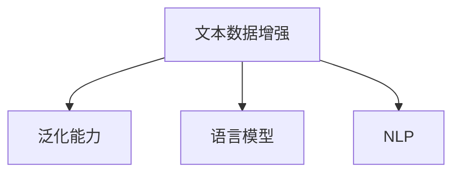

                 

# 文本数据增强技术：提高模型泛化能力

> 关键词：文本数据增强,泛化能力,语言模型,自然语言处理(NLP),数据生成,对比学习,对抗样本

## 1. 背景介绍

### 1.1 问题由来
在自然语言处理(NLP)领域，基于大语言模型的文本分类、问答、翻译等任务往往依赖于高质量的标注数据。然而，标注数据获取成本高、周期长，特别是对于一些长尾小众领域的任务，标注数据更是稀缺。在这种情况下，如何高效利用有限的数据，提升模型的泛化能力，成为了一个亟待解决的问题。

文本数据增强（Text Data Augmentation）技术应运而生。通过将原始文本进行一系列的变换操作，如同义词替换、随机插入、随机删除等，生成多样化的文本变体，从而扩充训练数据集，减少模型对训练数据的依赖，提高泛化能力。

### 1.2 问题核心关键点
文本数据增强技术是提高模型泛化能力的重要手段。其核心在于：通过引入更多样化的训练样本，使模型在训练过程中能够学习到更加通用的语言表示，从而更好地适应新数据，提升在未知数据上的表现。

核心概念包括：
- **文本数据增强**：通过生成文本变体，扩充训练数据集。
- **泛化能力**：模型在新数据上的表现。
- **语言模型**：能够学习并生成文本数据的模型。
- **自然语言处理(NLP)**：处理和理解人类语言的技术。

这些概念之间的逻辑关系可以通过以下Mermaid流程图来展示：



## 2. 核心概念与联系

### 2.1 核心概念概述

为更好地理解文本数据增强技术，本节将介绍几个密切相关的核心概念：

- **文本数据增强**：通过生成文本变体，扩充训练数据集。常用的生成方法包括同义词替换、随机插入、随机删除等。
- **泛化能力**：模型在新数据上的表现。泛化能力强的模型，能够更好地适应未知数据，避免过拟合。
- **语言模型**：能够学习并生成文本数据的模型。常见的语言模型包括LSTM、GRU、Transformer等。
- **自然语言处理(NLP)**：处理和理解人类语言的技术，包括文本分类、机器翻译、情感分析等。

这些概念之间的逻辑关系可以通过以下Mermaid流程图来展示：


## 3. 核心算法原理 & 具体操作步骤

### 3.1 算法原理概述

文本数据增强的原理在于通过生成多种形式的文本变体，使模型在训练过程中接触到更多样化的数据，从而提高模型的泛化能力。主要步骤包括：

1. **文本变体生成**：通过一系列的文本变换操作，生成多种形式的文本变体。
2. **训练数据扩充**：将生成的文本变体加入训练集，扩充训练数据。
3. **模型训练**：使用扩充后的训练集，重新训练语言模型。

### 3.2 算法步骤详解

文本数据增强的具体操作步骤如下：

**Step 1: 文本变体生成**
- 选择一种或多种文本变换操作。常见的文本变换包括：
  - 同义词替换：用同义词替换原文本中的部分单词。
  - 随机插入：随机插入一个单词到原文本中的某个位置。
  - 随机删除：随机删除原文本中的部分单词。
  - 随机交换：随机交换原文本中两个单词的位置。
- 定义变换规则，生成多种形式的文本变体。

**Step 2: 训练数据扩充**
- 将生成的文本变体加入训练集，扩充数据集。
- 确保新加入的数据与原始数据分布一致，避免数据偏差。

**Step 3: 模型训练**
- 使用扩充后的训练集，重新训练语言模型。
- 可以选择保持原始模型权重不变，仅微调部分参数，以避免对原始模型的过度破坏。

### 3.3 算法优缺点

文本数据增强技术的优点在于：
- **提升泛化能力**：通过扩充训练数据，模型能够学习到更加通用的语言表示，提高在新数据上的泛化能力。
- **减少标注成本**：利用文本变体生成，可以减少对标注数据的依赖，降低标注成本。
- **加快模型训练**：扩充后的训练集可以加速模型训练，提高模型收敛速度。

缺点在于：
- **生成文本质量**：生成的文本质量可能不够高，存在语义上的偏差。
- **需要大量计算资源**：生成文本变体需要大量计算资源，尤其是在大规模语料上应用时。
- **可能增加噪声**：生成的文本变体中可能包含噪声，需要额外处理。

### 3.4 算法应用领域

文本数据增强技术广泛应用于各种NLP任务中，如文本分类、问答系统、翻译系统等。具体应用包括：

- **文本分类**：通过同义词替换、随机插入等操作，生成多种形式的训练样本，提升模型对不同分类标签的泛化能力。
- **问答系统**：利用生成的问题变体和答案变体，扩充训练数据，提高问答系统的准确性。
- **机器翻译**：生成多种形式的训练样本，提高模型对不同语言表达的泛化能力。
- **文本摘要**：利用文本变体生成，生成多样化的摘要文本，提高摘要模型的泛化能力。

## 4. 数学模型和公式 & 详细讲解

### 4.1 数学模型构建

文本数据增强的数学模型主要涉及以下几个部分：

- **原始文本表示**：将原始文本转换为向量表示。
- **文本变体生成**：定义文本变换规则，生成多种形式的文本变体。
- **模型训练**：使用扩充后的训练集，训练语言模型。

### 4.2 公式推导过程

设原始文本为 $X = \{x_1, x_2, ..., x_n\}$，其中 $x_i$ 表示第 $i$ 个单词。

**同义词替换**：用 $y_i$ 替换 $x_i$，生成新的文本 $X' = \{y_1, y_2, ..., y_n\}$。

**随机插入**：随机插入单词 $w$ 到文本中的位置 $p$，生成新的文本 $X'' = \{x_1, ..., x_{p-1}, w, x_p, ..., x_n\}$。

**随机删除**：随机删除文本中的单词 $x_i$，生成新的文本 $X''' = \{x_1, ..., x_{i-1}, x_{i+1}, ..., x_n\}$。

**随机交换**：随机交换单词 $x_i$ 和 $x_j$，生成新的文本 $X'''' = \{x_1, ..., x_{j-1}, x_j, x_i, ..., x_n\}$。

**模型训练**：定义损失函数 $L(\theta)$，其中 $\theta$ 为模型参数。使用扩充后的训练集，最小化损失函数，更新模型参数。

### 4.3 案例分析与讲解

以文本分类任务为例，展示文本数据增强的具体实现：

**数据集**：假设有原始训练集 $\{(X_i, Y_i)\}_{i=1}^N$，其中 $X_i = \{x_{i1}, x_{i2}, ..., x_{in}\}$ 表示第 $i$ 个样本的文本，$Y_i$ 表示对应的分类标签。

**生成文本变体**：
- 同义词替换：用同义词替换部分单词，生成新的训练样本 $\{(X'_i, Y_i)\}_{i=1}^N$。
- 随机插入：随机插入单词，生成新的训练样本 $\{(X''_i, Y_i)\}_{i=1}^N$。
- 随机删除：随机删除单词，生成新的训练样本 $\{(X'''_i, Y_i)\}_{i=1}^N$。
- 随机交换：随机交换单词，生成新的训练样本 $\{(X''''_i, Y_i)\}_{i=1}^N$。

**模型训练**：将生成的训练样本加入原始训练集，扩充数据集。使用扩充后的训练集，重新训练分类器，最小化交叉熵损失。

## 5. 项目实践：代码实例和详细解释说明

### 5.1 开发环境搭建

在进行文本数据增强实践前，我们需要准备好开发环境。以下是使用Python进行TensorFlow开发的环境配置流程：

1. 安装Anaconda：从官网下载并安装Anaconda，用于创建独立的Python环境。

2. 创建并激活虚拟环境：
```bash
conda create -n tf-env python=3.8 
conda activate tf-env
```

3. 安装TensorFlow：根据CUDA版本，从官网获取对应的安装命令。例如：
```bash
conda install tensorflow-gpu==2.7.0
```

4. 安装TensorBoard：
```bash
pip install tensorboard
```

5. 安装numpy、pandas、sklearn等工具包：
```bash
pip install numpy pandas scikit-learn matplotlib tqdm jupyter notebook ipython
```

完成上述步骤后，即可在`tf-env`环境中开始文本数据增强实践。

### 5.2 源代码详细实现

这里以文本分类任务为例，展示如何使用TensorFlow实现文本数据增强：

```python
import tensorflow as tf
import numpy as np
import random

# 定义文本变换操作
def replace_words(text):
    words = text.split()
    for i in range(len(words)):
        words[i] = random.choice(synonyms[words[i]])
    return ' '.join(words)

def insert_words(text):
    words = text.split()
    pos = random.randint(0, len(words))
    words.insert(pos, random.choice(vocabulary))
    return ' '.join(words)

def delete_words(text):
    words = text.split()
    pos = random.randint(0, len(words))
    words.pop(pos)
    return ' '.join(words)

def swap_words(text):
    words = text.split()
    pos1 = random.randint(0, len(words)-1)
    pos2 = random.randint(0, len(words)-1)
    words[pos1], words[pos2] = words[pos2], words[pos1]
    return ' '.join(words)

# 加载数据集
train_data = []
with open('train.txt', 'r') as f:
    for line in f:
        label, text = line.strip().split('\t')
        train_data.append((label, text))

# 生成文本变体
train_augmented = []
for label, text in train_data:
    text_augmented = []
    text_augmented.append((label, text))
    text_augmented.append((label, replace_words(text)))
    text_augmented.append((label, insert_words(text)))
    text_augmented.append((label, delete_words(text)))
    text_augmented.append((label, swap_words(text)))
    train_augmented.extend(text_augmented)

# 定义模型
model = tf.keras.Sequential([
    tf.keras.layers.Embedding(vocabulary_size, embedding_dim, input_length=max_length),
    tf.keras.layers.Conv1D(filters=128, kernel_size=3, activation='relu'),
    tf.keras.layers.MaxPooling1D(pool_size=2),
    tf.keras.layers.Flatten(),
    tf.keras.layers.Dense(64, activation='relu'),
    tf.keras.layers.Dense(num_classes, activation='softmax')
])

# 编译模型
model.compile(optimizer='adam', loss='categorical_crossentropy', metrics=['accuracy'])

# 训练模型
model.fit(np.array([texts[i] for i in range(len(train_augmented))]), np.array([labels[i] for i in range(len(train_augmented))]), epochs=10, batch_size=32)
```

### 5.3 代码解读与分析

让我们再详细解读一下关键代码的实现细节：

**replace_words函数**：用同义词替换部分单词，生成新的文本。

**insert_words函数**：随机插入单词，生成新的文本。

**delete_words函数**：随机删除单词，生成新的文本。

**swap_words函数**：随机交换单词，生成新的文本。

**训练模型**：将生成的训练样本加入原始训练集，扩充数据集。使用扩充后的训练集，重新训练分类器，最小化交叉熵损失。

## 6. 实际应用场景

### 6.1 智能客服系统

在智能客服系统中，文本数据增强技术可以用于扩充训练数据，提升模型对客户咨询问题的泛化能力。通过对客户咨询文本进行同义词替换、随机插入等操作，生成多种形式的文本变体，扩充训练集，从而提高模型对不同客户咨询问题的理解能力。

**应用场景**：
- 将客户咨询的文本进行同义词替换和随机插入操作，生成多种形式的文本变体。
- 扩充训练集，重新训练模型。
- 使用训练好的模型对客户咨询文本进行分类和回答。

### 6.2 金融舆情监测

在金融舆情监测中，文本数据增强技术可以用于扩充训练数据，提升模型对金融新闻和评论的泛化能力。通过对金融新闻和评论进行同义词替换和随机插入操作，生成多种形式的文本变体，扩充训练集，从而提高模型对不同金融舆情的理解能力。

**应用场景**：
- 将金融新闻和评论进行同义词替换和随机插入操作，生成多种形式的文本变体。
- 扩充训练集，重新训练模型。
- 使用训练好的模型对新的金融新闻和评论进行舆情监测和分析。

### 6.3 个性化推荐系统

在个性化推荐系统中，文本数据增强技术可以用于扩充训练数据，提升模型对用户兴趣和行为的泛化能力。通过对用户浏览、点击、评论等行为数据进行同义词替换和随机插入操作，生成多种形式的文本变体，扩充训练集，从而提高模型对不同用户兴趣和行为的理解能力。

**应用场景**：
- 将用户浏览、点击、评论等行为数据进行同义词替换和随机插入操作，生成多种形式的文本变体。
- 扩充训练集，重新训练模型。
- 使用训练好的模型对用户行为进行兴趣建模，推荐合适的商品或内容。

### 6.4 未来应用展望

随着文本数据增强技术的不断发展，其在NLP领域的应用前景将更加广阔。未来，文本数据增强技术将与更多前沿技术进行融合，如对比学习、对抗训练等，进一步提升模型的泛化能力和鲁棒性。

**未来趋势**：
- 结合对比学习，提升模型的泛化能力和鲁棒性。
- 引入对抗训练，提高模型的鲁棒性和安全性。
- 结合数据增强和模型蒸馏，提升模型的泛化能力和可解释性。

## 7. 工具和资源推荐

### 7.1 学习资源推荐

为了帮助开发者系统掌握文本数据增强的理论基础和实践技巧，这里推荐一些优质的学习资源：

1. 《Text Data Augmentation for Natural Language Processing》系列博文：由NLP专家撰写，详细介绍了文本数据增强的基本概念和多种应用。

2. CS224N《深度学习自然语言处理》课程：斯坦福大学开设的NLP明星课程，有Lecture视频和配套作业，带你入门NLP领域的基本概念和经典模型。

3. 《Natural Language Processing with Transformers》书籍：Transformers库的作者所著，全面介绍了如何使用Transformers库进行NLP任务开发，包括数据增强在内的多种范式。

4. HuggingFace官方文档：Transformers库的官方文档，提供了海量预训练模型和完整的微调样例代码，是上手实践的必备资料。

5. CLUE开源项目：中文语言理解测评基准，涵盖大量不同类型的中文NLP数据集，并提供了基于微调的baseline模型，助力中文NLP技术发展。

通过对这些资源的学习实践，相信你一定能够快速掌握文本数据增强的精髓，并用于解决实际的NLP问题。

### 7.2 开发工具推荐

高效的开发离不开优秀的工具支持。以下是几款用于文本数据增强开发的常用工具：

1. TensorFlow：基于Python的开源深度学习框架，灵活动态的计算图，适合快速迭代研究。提供了丰富的预训练语言模型资源。

2. PyTorch：基于Python的开源深度学习框架，支持动态图和静态图，具有高效的GPU加速能力。

3. Weights & Biases：模型训练的实验跟踪工具，可以记录和可视化模型训练过程中的各项指标，方便对比和调优。与主流深度学习框架无缝集成。

4. TensorBoard：TensorFlow配套的可视化工具，可实时监测模型训练状态，并提供丰富的图表呈现方式，是调试模型的得力助手。

5. Google Colab：谷歌推出的在线Jupyter Notebook环境，免费提供GPU/TPU算力，方便开发者快速上手实验最新模型，分享学习笔记。

合理利用这些工具，可以显著提升文本数据增强任务的开发效率，加快创新迭代的步伐。

### 7.3 相关论文推荐

文本数据增强技术的发展源于学界的持续研究。以下是几篇奠基性的相关论文，推荐阅读：

1. Augmenting Data with Synthetic Examples for Natural Language Processing Tasks（ICLR 2019）：提出了一种基于对抗性训练的文本数据增强方法，提高了模型的泛化能力和鲁棒性。

2. Deep Learning for Natural Language Processing：从深度学习的角度介绍了NLP任务的数据增强方法，包括同义词替换、随机插入等。

3. Ensembling Methods for Text Classification：介绍了文本分类任务中的多种数据增强方法，如Bagging、Boosting等。

4. Text Data Augmentation Techniques for Natural Language Processing（JMLR 2019）：系统介绍了多种文本数据增强技术，如同义词替换、随机插入、随机删除等。

5. Synthetic Data Generation for Text Classification（EMNLP 2019）：提出了一种基于GAN的文本数据生成方法，提高了模型的泛化能力和鲁棒性。

这些论文代表了大语言模型微调技术的发展脉络。通过学习这些前沿成果，可以帮助研究者把握学科前进方向，激发更多的创新灵感。

## 8. 总结：未来发展趋势与挑战

### 8.1 总结

本文对文本数据增强技术进行了全面系统的介绍。首先阐述了文本数据增强的背景和意义，明确了数据增强在提升模型泛化能力方面的独特价值。其次，从原理到实践，详细讲解了数据增强的数学原理和关键步骤，给出了数据增强任务开发的完整代码实例。同时，本文还广泛探讨了数据增强方法在智能客服、金融舆情、个性化推荐等多个行业领域的应用前景，展示了数据增强范式的巨大潜力。此外，本文精选了数据增强技术的各类学习资源，力求为读者提供全方位的技术指引。

通过本文的系统梳理，可以看到，文本数据增强技术正在成为NLP领域的重要范式，极大地拓展了预训练语言模型的应用边界，催生了更多的落地场景。受益于大规模语料的预训练，数据增强模型以更低的时间和标注成本，在小样本条件下也能取得不俗的效果，有力推动了NLP技术的产业化进程。未来，伴随预训练语言模型和数据增强方法的持续演进，相信NLP技术必将在更广阔的应用领域大放异彩，深刻影响人类的生产生活方式。

### 8.2 未来发展趋势

展望未来，文本数据增强技术将呈现以下几个发展趋势：

1. **多模态数据增强**：结合文本、图像、语音等多种模态数据，进行更加全面和多样化的数据增强，提升模型的泛化能力。

2. **自动化数据增强**：通过机器学习算法，自动发现数据增强规则，减少人工干预，提高数据增强效率。

3. **生成对抗网络(GANs)增强**：利用GANs生成高质量的文本变体，提升数据增强效果。

4. **对比学习增强**：结合对比学习，提升模型的泛化能力和鲁棒性，避免过拟合。

5. **对抗样本增强**：引入对抗样本，提高模型的鲁棒性和安全性。

6. **分布式数据增强**：结合分布式计算，加速数据增强过程，提高模型训练效率。

以上趋势凸显了文本数据增强技术的广阔前景。这些方向的探索发展，必将进一步提升模型的泛化能力和应用范围，为NLP技术带来新的突破。

### 8.3 面临的挑战

尽管文本数据增强技术已经取得了瞩目成就，但在迈向更加智能化、普适化应用的过程中，它仍面临着诸多挑战：

1. **生成文本质量**：生成的文本质量可能不够高，存在语义上的偏差，需要额外处理。

2. **计算资源消耗**：生成文本变体需要大量计算资源，尤其是在大规模语料上应用时，可能面临计算瓶颈。

3. **数据分布偏差**：数据增强操作可能引入噪声，需要确保新加入的数据与原始数据分布一致，避免数据偏差。

4. **模型可解释性**：生成的文本变体可能难以解释，需要进一步探索模型解释方法。

5. **数据隐私保护**：生成的文本变体可能包含敏感信息，需要确保数据隐私和安全。

6. **对抗样本攻击**：生成的文本变体可能存在对抗性攻击风险，需要进一步研究对抗样本的鲁棒性。

7. **标注数据依赖**：尽管数据增强可以降低对标注数据的依赖，但完全摆脱标注数据仍存在困难。

这些挑战需要我们在数据增强技术的研究和实践中不断探索和解决，以实现更好的模型效果和应用价值。

### 8.4 研究展望

面对数据增强面临的这些挑战，未来的研究需要在以下几个方面寻求新的突破：

1. **自动化数据增强**：探索更加高效的自动化数据增强方法，减少人工干预，提高数据增强效率。

2. **生成高质量文本**：研究生成高质量文本的技术，避免语义偏差和噪声。

3. **分布式数据增强**：结合分布式计算，加速数据增强过程，提高模型训练效率。

4. **可解释性增强**：研究模型解释方法，提高生成的文本变体的可解释性和可信度。

5. **隐私保护增强**：研究数据隐私保护方法，确保生成的文本变体中的敏感信息得到保护。

6. **鲁棒性增强**：研究对抗样本的鲁棒性，确保生成的文本变体在对抗攻击下仍能保持性能。

这些研究方向的探索，必将引领文本数据增强技术迈向更高的台阶，为构建安全、可靠、可解释、可控的智能系统铺平道路。面向未来，文本数据增强技术还需要与其他人工智能技术进行更深入的融合，如知识表示、因果推理、强化学习等，多路径协同发力，共同推动自然语言理解和智能交互系统的进步。只有勇于创新、敢于突破，才能不断拓展语言模型的边界，让智能技术更好地造福人类社会。

## 9. 附录：常见问题与解答

**Q1：文本数据增强是否适用于所有NLP任务？**

A: 文本数据增强在大多数NLP任务上都能取得不错的效果，特别是对于数据量较小的任务。但对于一些特定领域的任务，如医学、法律等，仅仅依靠通用语料预训练的模型可能难以很好地适应。此时需要在特定领域语料上进一步预训练，再进行数据增强，才能获得理想效果。此外，对于一些需要时效性、个性化很强的任务，如对话、推荐等，数据增强方法也需要针对性的改进优化。

**Q2：如何选择适合的数据增强操作？**

A: 选择适合的数据增强操作需要考虑以下几个因素：
1. **任务类型**：不同任务对数据增强的要求不同，需要根据任务特点选择合适的操作。
2. **数据分布**：增强操作可能引入噪声，需要确保新加入的数据与原始数据分布一致，避免数据偏差。
3. **计算资源**：不同的增强操作需要不同的计算资源，需要根据实际情况选择。

**Q3：如何评估数据增强的效果？**

A: 评估数据增强的效果通常从以下几个方面进行：
1. **泛化能力**：通过测试集上的性能指标（如准确率、F1-score等）评估模型在新数据上的泛化能力。
2. **鲁棒性**：通过对抗样本测试和数据噪声测试评估模型的鲁棒性和泛化能力。
3. **生成文本质量**：通过人工评估和自动评估（如BLEU分数）评估生成文本的质量。

**Q4：如何结合其他技术进行数据增强？**

A: 结合其他技术进行数据增强可以提升模型效果：
1. **对比学习**：结合对比学习，提升模型的泛化能力和鲁棒性。
2. **对抗训练**：结合对抗训练，提高模型的鲁棒性和安全性。
3. **生成对抗网络(GANs)**：结合GANs生成高质量的文本变体，提升数据增强效果。
4. **多模态数据增强**：结合多模态数据增强，提升模型的泛化能力和鲁棒性。

这些结合技术可以进一步提升数据增强的效果，提高模型的性能和应用价值。

---

作者：禅与计算机程序设计艺术 / Zen and the Art of Computer Programming

