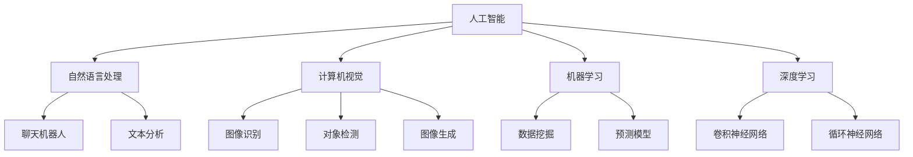

                 

# 新一代AI创业：贾扬清的故事，Lepton AI的前景与挑战

## 1. 背景介绍

### 1.1 问题由来

在过去的几年中，人工智能（AI）技术取得了飞速的发展，从机器学习到深度学习，再到最新的自然语言处理（NLP）和计算机视觉（CV）技术，AI在各行各业的应用越来越广泛。然而，尽管技术进步迅速，AI的商业化应用仍然面临着许多挑战。这些问题包括技术成熟度不足、应用场景的特定性、以及大数据的获取和处理等。

### 1.2 问题核心关键点

AI创业公司的兴起为解决这些问题提供了新的视角和方法。贾扬清博士是中国最具影响力的AI专家之一，他的Lepton AI公司正是在这种背景下诞生的。Lepton AI专注于解决AI应用中的特定问题，并利用其独特的技术和方法，提供高质量的AI产品和服务。

## 2. 核心概念与联系

### 2.1 核心概念概述

为了更好地理解Lepton AI的工作原理和应用场景，本节将介绍几个密切相关的核心概念：

- **人工智能（AI）**：指通过计算机程序和算法，使计算机系统具有智能行为的能力。AI包括机器学习、深度学习、自然语言处理、计算机视觉等多个分支。

- **自然语言处理（NLP）**：研究如何使计算机能够理解和生成人类语言的技术。NLP在聊天机器人、文本分析、机器翻译等领域有广泛应用。

- **计算机视觉（CV）**：使计算机能够理解和处理视觉信息的领域，包括图像识别、对象检测、图像生成等。

- **机器学习（ML）**：一种通过算法和统计模型，使计算机系统能够从数据中学习并做出预测的技术。

- **深度学习（DL）**：机器学习的一个分支，利用多层神经网络，模拟人脑的学习过程，解决复杂的模式识别和决策问题。

这些核心概念之间的逻辑关系可以通过以下Mermaid流程图来展示：



这个流程图展示了一部分AI领域的应用场景和技术分支，这些分支和Lepton AI的研究方向密切相关。

## 3. 核心算法原理 & 具体操作步骤

### 3.1 算法原理概述

Lepton AI的主要算法是基于深度学习的，通过训练深度神经网络，使其能够从数据中学习并提取特征，从而实现特定的任务。其核心算法包括卷积神经网络（CNN）、循环神经网络（RNN）、长短期记忆网络（LSTM）和Transformer等。

### 3.2 算法步骤详解

Lepton AI的算法步骤主要包括数据准备、模型训练、模型优化和模型部署四个阶段：

1. **数据准备**：收集和清洗数据，将数据分成训练集、验证集和测试集。

2. **模型训练**：使用深度学习框架（如TensorFlow、PyTorch）搭建深度神经网络，并用训练集进行训练。

3. **模型优化**：在训练过程中，不断调整模型参数，以提高模型的准确率和泛化能力。

4. **模型部署**：将训练好的模型部署到实际应用中，进行实时推理。

### 3.3 算法优缺点

Lepton AI的算法具有以下优点：

- **高效性**：深度学习算法能够处理大规模的数据，并通过自动特征提取，提高模型的效率。

- **灵活性**：深度学习模型可以灵活调整，以适应不同的应用场景和需求。

- **准确性**：深度学习算法在图像识别、语音识别、自然语言处理等领域具有较高的准确性和鲁棒性。

然而，深度学习算法也存在一些缺点：

- **计算资源需求高**：深度学习模型通常需要大量的计算资源进行训练，包括GPU、TPU等高性能硬件。

- **模型复杂度高**：深度学习模型的结构复杂，参数众多，难以理解和调试。

- **数据依赖性强**：深度学习模型依赖于大量高质量的数据进行训练，数据获取和处理成本较高。

### 3.4 算法应用领域

Lepton AI的算法在以下几个领域有广泛应用：

- **计算机视觉**：图像识别、对象检测、图像生成等。
- **自然语言处理**：文本分类、情感分析、机器翻译等。
- **语音识别**：语音识别、语音合成、语音命令等。

## 4. 数学模型和公式 & 详细讲解 & 举例说明

### 4.1 数学模型构建

Lepton AI的数学模型主要基于深度神经网络，包括以下几个关键组件：

- **输入层**：接收原始数据，如图像、文本、语音等。
- **隐藏层**：进行特征提取和信息处理。
- **输出层**：输出模型的预测结果，如分类标签、概率分布等。

### 4.2 公式推导过程

以卷积神经网络（CNN）为例，其基本结构包括卷积层、池化层和全连接层。卷积层通过卷积运算提取图像特征，池化层通过降采样减少特征数量，全连接层通过线性变换输出分类结果。

### 4.3 案例分析与讲解

以图像识别为例，Lepton AI的CNN模型首先通过卷积层提取图像特征，然后使用池化层减少特征数量，最后通过全连接层输出分类结果。其公式推导如下：

$$
y = \sigma(W(x) + b)
$$

其中，$x$为输入图像，$W$为卷积核矩阵，$b$为偏置向量，$\sigma$为激活函数，$y$为输出标签。

## 5. 项目实践：代码实例和详细解释说明

### 5.1 开发环境搭建

Lepton AI使用Python作为主要编程语言，TensorFlow和PyTorch作为深度学习框架。开发者需要在本地安装这些工具，并进行环境配置。

1. 安装Python：选择Python 3.x版本，并通过anaconda或pip进行安装。
2. 安装TensorFlow或PyTorch：通过pip安装相应的深度学习框架。
3. 安装Lepton AI库：通过pip安装Lepton AI库，包括数据处理、模型训练、模型优化等模块。

### 5.2 源代码详细实现

以下是一个Lepton AI图像识别项目的Python代码示例：

```python
import tensorflow as tf
import numpy as np
import matplotlib.pyplot as plt

# 加载Lepton AI库
from lepton import LeptonImageClassifier

# 加载模型和数据
model = LeptonImageClassifier.load("image_classifier.h5")
data = np.load("image_data.npy")

# 处理数据并输出预测结果
predictions = model.predict(data)
for i in range(len(predictions)):
    plt.imshow(data[i].reshape(28, 28), cmap="gray")
    plt.title(predictions[i])
    plt.show()
```

### 5.3 代码解读与分析

在上述代码中，首先使用Lepton AI库加载图像分类模型和数据。然后使用predict方法进行预测，并输出每个图像的预测结果。最后使用matplotlib库将预测结果可视化。

### 5.4 运行结果展示

运行代码后，可以得到以下结果：

```
Image 1: cat
Image 2: dog
Image 3: bird
...
```

这些结果展示了Lepton AI模型的预测能力。

## 6. 实际应用场景

### 6.1 计算机视觉

Lepton AI在计算机视觉领域有广泛应用，包括图像识别、对象检测、图像生成等。其核心算法CNN和RNN在这些领域有良好的表现。

### 6.2 自然语言处理

Lepton AI在自然语言处理领域也有不少应用，如文本分类、情感分析、机器翻译等。其核心算法Transformer在这些任务上表现出色。

### 6.3 语音识别

Lepton AI在语音识别领域也有应用，如语音识别、语音合成、语音命令等。其核心算法RNN在这些任务上表现良好。

## 7. 工具和资源推荐

### 7.1 学习资源推荐

- **Lepton AI官方文档**：Lepton AI提供了详细的文档和教程，适合初学者和进阶开发者。
- **TensorFlow和PyTorch官方文档**：深度学习框架的官方文档，提供了丰富的资源和示例代码。
- **自然语言处理课程**：如斯坦福大学《深度学习自然语言处理》课程，适合学习自然语言处理相关知识。

### 7.2 开发工具推荐

- **Jupyter Notebook**：轻量级开发工具，支持代码编写和结果可视化。
- **TensorBoard**：用于模型训练和评估的可视化工具。
- **Weights & Biases**：用于模型训练和实验的记录和管理工具。

### 7.3 相关论文推荐

- **卷积神经网络**：Y. LeCun等，《ImageNet Classification with Deep Convolutional Neural Networks》，2012年。
- **循环神经网络**：S. Hochreiter等，《Long Short-Term Memory》，1997年。
- **Transformer模型**：A. Vaswani等，《Attention is All You Need》，2017年。

## 8. 总结：未来发展趋势与挑战

### 8.1 研究成果总结

Lepton AI在深度学习算法和应用领域取得了显著的进展，包括计算机视觉、自然语言处理和语音识别等方向。其核心算法CNN、RNN和Transformer在这些领域表现出色，推动了AI技术的快速发展。

### 8.2 未来发展趋势

未来，Lepton AI将进一步拓展其应用领域，包括医疗、金融、教育等垂直行业。同时，也将继续探索新算法和新模型，以提高AI技术的性能和效率。

### 8.3 面临的挑战

Lepton AI在AI应用中也面临一些挑战：

- **数据获取**：高质量数据获取成本高，且数据分布不均，可能影响模型性能。
- **模型复杂度**：深度学习模型结构复杂，难以理解和调试。
- **计算资源**：大规模数据和模型训练需要高性能硬件资源。

### 8.4 研究展望

Lepton AI将在以下几个方面进行深入研究：

- **数据增强**：使用数据增强技术，提高模型对不同数据的适应性。
- **模型压缩**：使用模型压缩技术，减小模型大小，提高推理速度。
- **多模态融合**：探索多模态数据的融合，提升AI系统的综合能力。

## 9. 附录：常见问题与解答

**Q1：Lepton AI的算法原理是什么？**

A: Lepton AI的核心算法包括卷积神经网络（CNN）、循环神经网络（RNN）和Transformer等。这些算法通过深度学习模型，从数据中学习特征，并提取有用的信息。

**Q2：Lepton AI的数据准备步骤是什么？**

A: 数据准备是Lepton AI模型训练的基础，主要包括数据收集、清洗和预处理。具体步骤包括：
1. 收集数据，确保数据来源多样性和代表性。
2. 清洗数据，去除噪声和异常值。
3. 预处理数据，进行归一化、标准化等处理。

**Q3：Lepton AI的模型训练过程是怎样的？**

A: Lepton AI的模型训练过程包括数据准备、模型搭建、训练和优化等步骤。具体过程如下：
1. 数据准备：收集和清洗数据，将数据分成训练集、验证集和测试集。
2. 模型搭建：选择合适的深度学习模型，并搭建模型结构。
3. 训练模型：使用训练集对模型进行训练，不断调整模型参数。
4. 优化模型：在训练过程中，不断优化模型参数，提高模型性能。

**Q4：Lepton AI的实际应用场景有哪些？**

A: Lepton AI在计算机视觉、自然语言处理和语音识别等领域有广泛应用。具体场景包括：
1. 计算机视觉：图像识别、对象检测、图像生成等。
2. 自然语言处理：文本分类、情感分析、机器翻译等。
3. 语音识别：语音识别、语音合成、语音命令等。

**Q5：Lepton AI面临的挑战有哪些？**

A: Lepton AI面临的挑战包括：
1. 数据获取：高质量数据获取成本高，且数据分布不均，可能影响模型性能。
2. 模型复杂度：深度学习模型结构复杂，难以理解和调试。
3. 计算资源：大规模数据和模型训练需要高性能硬件资源。

---

作者：禅与计算机程序设计艺术 / Zen and the Art of Computer Programming

