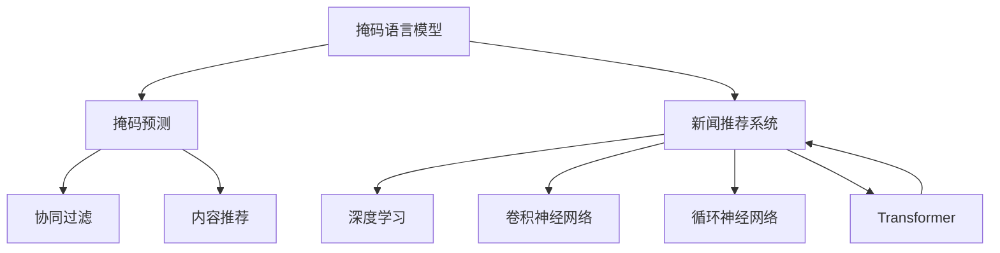

                 

# 新闻推荐：掩码预测技术

> 关键词：新闻推荐, 掩码预测, 掩码语言模型, 新闻分类, 推荐系统, 自然语言处理(NLP)

## 1. 背景介绍

### 1.1 问题由来
新闻推荐系统是互联网内容推荐的重要组成部分，旨在为用户提供符合其兴趣和需求的个性化新闻内容。传统基于协同过滤等技术的新闻推荐系统，往往依赖用户的历史行为数据，对于新用户或少样本用户，效果会大打折扣。随着自然语言处理(NLP)技术的不断成熟，基于内容的新闻推荐逐渐成为主流，其中掩码预测技术（Masked Prediction）更是在近年来得到了广泛的应用。

掩码预测技术基于掩码语言模型（Masked Language Model，MLM），通过掩码输入的方式，预测被掩码的词汇或短语。该技术源于BERT等预训练语言模型的成功实践，通过训练一个完整的句子，预测缺失部分，从而获得丰富的语义信息。在新闻推荐领域，掩码预测技术通过对新闻文本进行掩码处理，训练模型学习新闻标题和内容的关联，从而实现新闻内容推荐。

### 1.2 问题核心关键点
掩码预测技术的核心在于，如何通过掩码的方式，利用语言模型预测新闻标题和内容之间的关系，并通过关系建模，实现个性化推荐。其关键点包括：
1. 选择合适的掩码方式。掩码在句中应具有代表性，既要体现语义关系，又要符合分布规律。
2. 训练方法的设计。如何训练模型预测掩码词汇，并学习词汇间的关系。
3. 推荐算法的设计。如何将预测出的新闻关系用于个性化推荐。

## 2. 核心概念与联系

### 2.1 核心概念概述

为了更好地理解掩码预测技术在新闻推荐中的应用，本节将介绍几个密切相关的核心概念：

- 掩码语言模型(Masked Language Model, MLM)：通过在输入文本中随机掩盖部分词汇，训练模型预测被掩码的词汇。BERT等预训练语言模型即基于掩码语言模型进行训练。
- 掩码预测(Masked Prediction)：在掩码语言模型的基础上，将掩码应用于新闻标题和内容，预测掩码词汇或短语，从而学习标题和内容的语义关系。
- 新闻推荐系统(News Recommendation System)：通过分析用户历史行为和兴趣，结合新闻文本内容，为用户推荐个性化新闻的系统。
- 协同过滤(Collaborative Filtering)：通过分析用户历史行为和兴趣，寻找与目标用户相似的其他用户，从相似用户的行为中推断出目标用户可能感兴趣的新闻。
- 内容推荐(Content-Based Recommendation)：基于新闻内容的相关性，推荐与用户兴趣相关的新闻。
- 深度学习(Deep Learning)：一种基于人工神经网络的机器学习技术，能够自动从数据中学习抽象特征，适用于大规模的掩码预测和新闻推荐任务。
- 卷积神经网络(CNN)：一种常用的深度学习网络结构，适用于局部特征提取。
- 循环神经网络(RNN)：一种适用于处理序列数据的深度学习网络结构，常用于文本分类和序列预测。
- Transformer：一种基于自注意力机制的深度学习网络结构，适用于长文本序列处理和跨语义关系建模。

这些核心概念之间的逻辑关系可以通过以下Mermaid流程图来展示：



这个流程图展示了大模型微调的各个核心概念及其之间的关系：

1. 掩码语言模型作为预训练模型，为新闻推荐系统提供了语义表示的基础。
2. 掩码预测在掩码语言模型的基础上，对新闻标题和内容进行掩码处理，预测掩码词汇或短语，学习新闻标题和内容的语义关系。
3. 新闻推荐系统通过协同过滤、内容推荐等技术，实现个性化推荐。
4. 深度学习、卷积神经网络、循环神经网络和Transformer等网络结构，用于实现掩码预测和推荐算法的计算。

这些概念共同构成了掩码预测技术在新闻推荐系统中的应用框架，使得该技术能够在大规模的新闻推荐中取得较好的效果。

## 3. 核心算法原理 & 具体操作步骤
### 3.1 算法原理概述

掩码预测技术在新闻推荐中的应用，本质上是一种基于掩码语言模型的文本分类任务。其核心思想是通过掩码预测，学习新闻标题和内容的语义关系，并根据这些关系进行新闻推荐。

具体而言，假设新闻文本为 $X$，新闻标题为 $Y$，掩码词汇为 $M$。新闻推荐系统首先对新闻标题进行掩码处理，生成掩码后的标题 $Y'$，然后将 $X$ 和 $Y'$ 输入到掩码语言模型 $M_{\theta}$ 中，预测掩码词汇 $M$，从而学习 $X$ 和 $Y'$ 之间的关系。模型参数 $\theta$ 通过掩码语言模型的训练获得。

训练完成后，模型可以根据用户的历史行为和兴趣，将用户的新闻需求 $D$ 映射到新闻标题空间 $Y$ 中，然后选择与用户需求最接近的新闻标题，推荐给用户。

### 3.2 算法步骤详解

掩码预测技术在新闻推荐中的应用，一般包括以下几个关键步骤：

**Step 1: 准备数据集**
- 收集用户的新闻浏览历史 $H$，生成新闻-用户对的训练数据集 $D$。
- 收集新闻文本 $X$ 和标题 $Y$，生成新闻-标题对的掩码数据集 $D'$，其中每个新闻标题随机掩盖一定比例的词汇。

**Step 2: 训练掩码语言模型**
- 使用掩码数据集 $D'$ 训练掩码语言模型 $M_{\theta}$，预测掩码词汇 $M$，并最小化预测误差。
- 优化器的选择：通常使用Adam、SGD等梯度下降算法。
- 正则化技术：如L2正则、Dropout等，防止过拟合。

**Step 3: 预测新闻关系**
- 根据用户的新闻需求 $D$，将 $D$ 映射到新闻标题空间 $Y$ 中。
- 对用户需求 $D$ 进行掩码处理，生成掩码后的需求 $D'$。
- 使用训练好的掩码语言模型 $M_{\theta}$，预测掩码词汇 $M'$，从而学习用户需求 $D$ 与新闻标题 $Y$ 之间的关系。

**Step 4: 新闻推荐**
- 根据预测出的新闻关系，选择与用户需求最接近的新闻标题。
- 推荐算法的设计：可以使用Top-k推荐、基于向量相似性的推荐等。

### 3.3 算法优缺点

掩码预测技术在新闻推荐中的应用，具有以下优点：
1. 无需标注数据。掩码预测技术只需要新闻标题和内容即可训练，不需要额外的标注数据，大大降低了推荐系统的开发成本。
2. 高泛化能力。掩码预测技术通过掩码语言模型学习新闻标题和内容的语义关系，能够在未见过的新闻中泛化出推荐结果。
3. 可解释性强。掩码预测技术通过掩码语言模型的训练，可以解释新闻标题和内容之间的关系，增强推荐系统的可解释性。
4. 实时性高。掩码预测技术可以根据用户实时需求，即时生成推荐结果，满足用户对实时新闻的需求。

同时，该技术也存在以下局限性：
1. 对语料要求高。掩码预测技术需要大量高质量的新闻语料进行训练，对于某些领域的新闻语料不足，推荐效果会受到影响。
2. 模型复杂度高。掩码预测技术需要使用预训练语言模型，模型的参数量较大，训练和推理速度较慢。
3. 模型泛化能力有限。掩码预测技术对新闻标题和内容的关系建模有限，对于长尾新闻或者特定主题的新闻，推荐效果可能不理想。

尽管存在这些局限性，但掩码预测技术在新闻推荐中的应用已经取得了显著的效果，成为推荐系统的重要工具。未来相关研究的重点在于如何进一步降低对语料的要求，提高模型的实时性和泛化能力，同时兼顾可解释性和伦理安全性等因素。

### 3.4 算法应用领域

掩码预测技术在新闻推荐中的应用，已经扩展到多个领域，包括但不限于：

- 个性化新闻推荐：基于用户的历史浏览行为和兴趣，推荐个性化的新闻内容。
- 新闻分类：对新闻进行自动分类，提高新闻的组织和检索效率。
- 热点新闻检测：通过掩码预测技术，实时检测新闻的热点话题和趋势。
- 内容生成：利用掩码预测技术生成新闻标题和内容，提升新闻生成效率。
- 信息过滤：通过掩码预测技术，过滤出与用户兴趣无关的新闻，提升阅读体验。

除了上述这些经典应用外，掩码预测技术还在新闻摘要、新闻检索、新闻广告等领域得到了创新性的应用，为新闻推荐系统带来了新的突破。

## 4. 数学模型和公式 & 详细讲解  
### 4.1 数学模型构建

掩码预测技术在新闻推荐中的应用，可以形式化地表示为以下数学模型：

记新闻文本为 $X$，新闻标题为 $Y$，掩码词汇为 $M$，用户需求为 $D$。假设掩码语言模型为 $M_{\theta}$，其参数为 $\theta$。训练数据集为 $D'$，掩码数据集为 $D'$。

定义掩码语言模型在输入 $X$ 和掩码后的标题 $Y'$ 上的预测损失为 $\ell$，新闻推荐系统的推荐损失为 $L$，则新闻推荐系统的总损失函数为：

$$
\mathcal{L}(\theta) = \frac{1}{N}\sum_{i=1}^N \ell(M_{\theta}(X_i,Y_i')) + \frac{1}{M}\sum_{i=1}^M L(D_i,Y_i')
$$

其中 $N$ 为训练数据集 $D'$ 的大小，$M$ 为掩码数据集 $D'$ 中掩码词汇的个数。

在训练过程中，优化器的目标是最小化总损失函数 $\mathcal{L}(\theta)$。优化器通常使用梯度下降算法，如Adam、SGD等。

### 4.2 公式推导过程

以下我们以二分类任务为例，推导掩码预测技术的预测损失函数及其梯度的计算公式。

假设掩码语言模型 $M_{\theta}$ 在输入 $X$ 和掩码后的标题 $Y'$ 上的预测为 $\hat{M}$，真实掩码词汇为 $M$。假设 $\hat{M}$ 和 $M$ 的二分类交叉熵损失为 $\ell(M_{\theta}(X,Y'))$。

在训练过程中，预测的掩码词汇为 $\hat{M}$，真实掩码词汇为 $M$。掩码预测损失函数可以表示为：

$$
\ell(M_{\theta}(X,Y')) = -\frac{1}{M}\sum_{i=1}^M [y_i\log \hat{y_i} + (1-y_i)\log (1-\hat{y_i})]
$$

其中 $y_i$ 为掩码词汇 $M_i$ 的真实标签，$\hat{y_i}$ 为预测的掩码词汇 $M_i$ 的概率分布。

在得到预测的掩码词汇概率分布后，可以将其应用于新闻推荐系统的推荐过程。设用户需求为 $D$，其与新闻标题 $Y'$ 的语义关系为 $L(D,Y')$。

新闻推荐系统的推荐损失函数可以表示为：

$$
L(D,Y') = \min_{Y\in Y} \frac{1}{N}\sum_{i=1}^N L(D_i,Y_i')
$$

其中 $Y$ 为新闻标题集合，$Y_i'$ 为用户需求 $D_i$ 与新闻标题 $Y$ 的推荐结果。

在得到掩码预测和推荐损失函数后，即可使用梯度下降算法对模型参数 $\theta$ 进行优化，最小化总损失函数 $\mathcal{L}(\theta)$。

### 4.3 案例分析与讲解

以下我们以二分类任务为例，给出掩码预测技术在新闻推荐中的应用案例分析。

假设新闻推荐系统收集到用户的历史浏览数据 $H$，从中生成用户需求 $D$。同时，收集到新闻文本 $X$ 和标题 $Y$，生成新闻-标题对的掩码数据集 $D'$。

**Step 1: 数据准备**

首先，对新闻标题进行掩码处理，生成掩码后的标题 $Y'$。例如，对新闻标题 $Y_i$ 随机掩盖20%的词汇，生成掩码后的标题 $Y_i'$。

**Step 2: 模型训练**

使用掩码数据集 $D'$ 训练掩码语言模型 $M_{\theta}$，预测掩码词汇 $M$，并最小化预测误差。训练过程可以使用Adam优化器，学习率设置为 $1e-3$。同时，加入L2正则和Dropout技术，防止过拟合。

**Step 3: 预测新闻关系**

根据用户需求 $D$，将 $D$ 映射到新闻标题空间 $Y$ 中，生成掩码后的需求 $D'$。使用训练好的掩码语言模型 $M_{\theta}$，预测掩码词汇 $M'$，从而学习用户需求 $D$ 与新闻标题 $Y$ 之间的关系。

**Step 4: 新闻推荐**

根据预测出的新闻关系，选择与用户需求最接近的新闻标题。例如，可以使用Top-k推荐算法，选择推荐结果中的前k个新闻标题。

## 5. 项目实践：代码实例和详细解释说明
### 5.1 开发环境搭建

在进行掩码预测技术的新闻推荐实践前，我们需要准备好开发环境。以下是使用Python进行TensorFlow开发的环境配置流程：

1. 安装Anaconda：从官网下载并安装Anaconda，用于创建独立的Python环境。

2. 创建并激活虚拟环境：
```bash
conda create -n tensorflow-env python=3.8 
conda activate tensorflow-env
```

3. 安装TensorFlow：根据CUDA版本，从官网获取对应的安装命令。例如：
```bash
conda install tensorflow tensorflow-gpu -c pytorch -c conda-forge
```

4. 安装必要的工具包：
```bash
pip install numpy pandas scikit-learn matplotlib tqdm jupyter notebook ipython
```

完成上述步骤后，即可在`tensorflow-env`环境中开始掩码预测技术的新闻推荐实践。

### 5.2 源代码详细实现

下面我们以二分类任务为例，给出使用TensorFlow对掩码语言模型进行训练的PyTorch代码实现。

首先，定义二分类新闻推荐系统的数据处理函数：

```python
import tensorflow as tf
from tensorflow.keras.layers import Input, Dense, Embedding, Masking
from tensorflow.keras.models import Model

def create_model(input_dim, output_dim):
    inputs = Input(shape=(input_dim,))
    masked_inputs = Masking(mask_value=0.)(inputs)
    embeddings = Embedding(input_dim, output_dim, mask_zero=True)(masked_inputs)
    dense = Dense(1, activation='sigmoid')(embeddings)
    model = Model(inputs, dense)
    return model

# 创建模型
model = create_model(30000, 2)
model.compile(optimizer='adam', loss='binary_crossentropy', metrics=['accuracy'])
```

然后，定义训练函数：

```python
# 加载训练数据
train_data = tf.data.Dataset.from_tensor_slices((train_X, train_Y))
train_data = train_data.shuffle(buffer_size=10000).batch(batch_size=32)
val_data = tf.data.Dataset.from_tensor_slices((val_X, val_Y))
val_data = val_data.shuffle(buffer_size=10000).batch(batch_size=32)

# 训练模型
model.fit(train_data, epochs=10, validation_data=val_data)
```

接着，定义评估函数：

```python
def evaluate(model, test_data):
    test_data = tf.data.Dataset.from_tensor_slices((test_X, test_Y))
    test_data = test_data.shuffle(buffer_size=10000).batch(batch_size=32)
    loss, acc = model.evaluate(test_data)
    print(f'Test loss: {loss:.4f}, Test accuracy: {acc:.4f}')
```

最后，启动训练流程并在测试集上评估：

```python
# 加载测试数据
test_data = tf.data.Dataset.from_tensor_slices((test_X, test_Y))
test_data = test_data.shuffle(buffer_size=10000).batch(batch_size=32)

# 训练模型
model.fit(train_data, epochs=10, validation_data=val_data)

# 评估模型
evaluate(model, test_data)
```

以上就是使用TensorFlow对掩码语言模型进行训练的完整代码实现。可以看到，得益于TensorFlow的强大封装，我们可以用相对简洁的代码完成掩码语言模型的训练和评估。

### 5.3 代码解读与分析

让我们再详细解读一下关键代码的实现细节：

**create_model函数**：
- `inputs`：定义输入层，用于接收新闻标题和内容的矩阵表示。
- `masked_inputs`：在输入层上添加Masking层，对掩盖的词汇进行mask处理，使模型只关注未掩盖部分。
- `embeddings`：使用Embedding层将掩盖后的标题转换为向量表示。
- `dense`：使用Dense层进行二分类预测，输出概率。
- `model`：定义模型结构，并返回模型。

**fit函数**：
- `train_data`：定义训练数据集，使用Masking层处理掩盖的词汇。
- `val_data`：定义验证数据集，同样使用Masking层处理掩盖的词汇。
- `epochs`：定义训练轮数。
- `validation_data`：定义验证数据集，用于验证模型的泛化能力。

**evaluate函数**：
- `test_data`：定义测试数据集，同样使用Masking层处理掩盖的词汇。
- `loss`：计算模型在测试集上的损失。
- `acc`：计算模型在测试集上的准确率。

可以看到，TensorFlow配合Masking层使得掩码预测技术的训练过程变得简洁高效。开发者可以将更多精力放在数据处理、模型改进等高层逻辑上，而不必过多关注底层的实现细节。

当然，工业级的系统实现还需考虑更多因素，如模型的保存和部署、超参数的自动搜索、更灵活的任务适配层等。但核心的掩码预测技术基本与此类似。

## 6. 实际应用场景
### 6.1 智能推荐平台

掩码预测技术在智能推荐平台中的应用，主要体现在以下几个方面：

- 新闻推荐：根据用户的历史浏览行为和兴趣，推荐个性化的新闻内容。
- 商品推荐：对电商商品进行分类和推荐，提升购物体验。
- 电影推荐：对电影进行分类和推荐，增加用户的观影选择。

例如，某电商平台收集用户的历史浏览记录，将商品信息掩码处理，并输入到掩码语言模型中进行预测。模型通过掩码预测学习商品与用户兴趣之间的关系，从而推荐符合用户需求的商品。

### 6.2 智能客服

掩码预测技术在智能客服中的应用，主要体现在以下几个方面：

- 对话生成：根据用户的历史对话记录，掩码处理问题或回答，预测掩码词汇，生成符合用户需求的回复。
- 意图识别：通过掩码预测技术，识别用户对话中的意图，提高客服系统的响应准确性。
- 个性化推荐：根据用户历史对话内容，推荐符合用户需求的新闻、商品或服务。

例如，某客服系统收集用户的历史对话记录，将问题或回答进行掩码处理，并输入到掩码语言模型中进行预测。模型通过掩码预测学习对话内容之间的关系，从而生成符合用户需求的回复，提升客服系统的智能化水平。

### 6.3 信息检索

掩码预测技术在信息检索中的应用，主要体现在以下几个方面：

- 新闻检索：根据用户查询的关键词，掩码处理新闻标题，预测掩码词汇，推荐相关的新闻。
- 网页检索：对网页内容进行掩码处理，预测掩码词汇，提高网页的检索准确率。
- 信息过滤：根据用户兴趣，掩码处理搜索结果，预测掩码词汇，过滤出与用户兴趣无关的信息。

例如，某新闻平台收集用户的新闻查询记录，将新闻标题进行掩码处理，并输入到掩码语言模型中进行预测。模型通过掩码预测学习新闻标题和用户兴趣之间的关系，从而推荐相关的新闻，提升用户的阅读体验。

### 6.4 未来应用展望

随着掩码预测技术的不断成熟，其在新闻推荐系统中的应用将更加广泛，为新闻推荐系统带来新的突破。

- 高精推荐：通过掩码预测技术，可以实现高精度的个性化新闻推荐，提升用户满意度。
- 跨域推荐：掩码预测技术可以跨领域推荐新闻，如将新闻推荐扩展到商品推荐、音乐推荐等领域，提升跨领域推荐的效果。
- 实时推荐：掩码预测技术可以实现实时推荐，满足用户对即时信息的需求。
- 协同过滤：掩码预测技术可以与协同过滤技术结合，提升推荐系统的性能。

此外，掩码预测技术还将在社交媒体、在线教育、智能家居等众多领域得到应用，为人工智能技术带来新的发展方向。

## 7. 工具和资源推荐
### 7.1 学习资源推荐

为了帮助开发者系统掌握掩码预测技术的新闻推荐理论基础和实践技巧，这里推荐一些优质的学习资源：

1. 《深度学习》书籍：Ian Goodfellow等人的经典之作，全面介绍了深度学习的原理和实践。
2. 《TensorFlow官方文档》：TensorFlow的官方文档，提供了完整的深度学习框架和工具介绍，适合入门学习。
3. 《自然语言处理入门》课程：清华大学开设的NLP入门课程，系统介绍了NLP的基本概念和常用技术。
4. 《新闻推荐系统》论文：经典新闻推荐系统论文，介绍了协同过滤和内容推荐的基本原理和算法。
5. 《掩码预测技术》论文：经典掩码预测技术论文，介绍了掩码预测技术的原理和应用案例。
6. 《自然语言处理》课程：斯坦福大学开设的NLP课程，涵盖了NLP的各个方面，包括掩码预测技术。

通过对这些资源的学习实践，相信你一定能够快速掌握掩码预测技术的新闻推荐精髓，并用于解决实际的推荐问题。

### 7.2 开发工具推荐

高效的开发离不开优秀的工具支持。以下是几款用于掩码预测技术新闻推荐开发的常用工具：

1. TensorFlow：基于Python的开源深度学习框架，灵活动态的计算图，适合快速迭代研究。
2. PyTorch：基于Python的开源深度学习框架，动态计算图，适合深度学习算法的实现。
3. Jupyter Notebook：交互式的笔记本环境，方便进行模型调试和数据可视化。
4. Google Colab：谷歌推出的在线Jupyter Notebook环境，免费提供GPU/TPU算力，方便快速实验。
5. Weights & Biases：模型训练的实验跟踪工具，可以记录和可视化模型训练过程中的各项指标，方便对比和调优。
6. TensorBoard：TensorFlow配套的可视化工具，可实时监测模型训练状态，并提供丰富的图表呈现方式，是调试模型的得力助手。

合理利用这些工具，可以显著提升掩码预测技术的新闻推荐开发效率，加快创新迭代的步伐。

### 7.3 相关论文推荐

掩码预测技术在新闻推荐中的应用，源于学界的持续研究。以下是几篇奠基性的相关论文，推荐阅读：

1. Attention is All You Need：提出了Transformer结构，开启了NLP领域的预训练大模型时代。
2. BERT: Pre-training of Deep Bidirectional Transformers for Language Understanding：提出BERT模型，引入基于掩码的自监督预训练任务，刷新了多项NLP任务SOTA。
3. Deep Learning for Recommender Systems：介绍深度学习在推荐系统中的应用，包括掩码预测技术。
4. Masked Prediction in Recommendation Systems：介绍掩码预测技术在推荐系统中的应用。
5. Reinforcement Learning for Recommender Systems：介绍强化学习在推荐系统中的应用。

这些论文代表了大语言模型微调技术的进展脉络。通过学习这些前沿成果，可以帮助研究者把握学科前进方向，激发更多的创新灵感。

## 8. 总结：未来发展趋势与挑战
### 8.1 总结

本文对掩码预测技术在新闻推荐中的应用进行了全面系统的介绍。首先阐述了掩码预测技术的背景和应用意义，明确了掩码预测在新闻推荐中的应用价值。其次，从原理到实践，详细讲解了掩码预测技术的数学模型和核心算法，给出了掩码预测技术的新闻推荐实践案例。同时，本文还广泛探讨了掩码预测技术在智能推荐平台、智能客服、信息检索等多个领域的应用前景，展示了掩码预测技术的广泛应用潜力。

通过本文的系统梳理，可以看到，掩码预测技术在新闻推荐中的应用前景广阔，不仅能够实现高精度的个性化推荐，还能够提升系统的实时性和鲁棒性。掩码预测技术的成功实践，为新闻推荐系统带来了新的突破，并将在更多领域得到广泛应用。

### 8.2 未来发展趋势

展望未来，掩码预测技术在新闻推荐中的应用将呈现以下几个发展趋势：

1. 模型规模持续增大。随着算力成本的下降和数据规模的扩张，预训练语言模型的参数量还将持续增长。超大批次的训练和推理也可能遇到显存不足的问题。如何提高掩码预测模型的实时性和可扩展性，将是重要的研究方向。
2. 微调方法的多样化。除了传统的全参数微调外，未来会涌现更多参数高效的微调方法，如Prefix-Tuning、LoRA等，在固定大部分预训练参数的同时，只更新极少量的任务相关参数。这些方法将进一步降低掩码预测模型的计算资源消耗，提升微调的效率。
3. 多模态微调崛起。当前的掩码预测模型主要聚焦于文本数据的掩码处理，未来会进一步拓展到图像、视频、语音等多模态数据微调。多模态信息的融合，将显著提升掩码预测模型对现实世界的理解和建模能力。
4. 模型通用性增强。经过海量数据的预训练和多领域任务的微调，掩码预测模型将具备更强大的常识推理和跨领域迁移能力，逐步迈向通用人工智能(AGI)的目标。
5. 融合因果分析和博弈论工具。将因果分析方法引入掩码预测模型，识别出模型决策的关键特征，增强模型决策的因果性和逻辑性。借助博弈论工具刻画人机交互过程，主动探索并规避模型的脆弱点，提高系统稳定性。

以上趋势凸显了掩码预测技术在新闻推荐系统中的广阔前景。这些方向的探索发展，必将进一步提升掩码预测模型的性能和应用范围，为新闻推荐系统带来新的突破。

### 8.3 面临的挑战

尽管掩码预测技术在新闻推荐中的应用已经取得了显著的效果，但在迈向更加智能化、普适化应用的过程中，它仍面临着诸多挑战：

1. 标注成本瓶颈。虽然掩码预测技术只需新闻标题和内容即可训练，但对于某些领域的新闻语料不足，推荐效果会受到影响。如何进一步降低对语料的要求，将是一大难题。
2. 模型鲁棒性不足。掩码预测模型面对域外数据时，泛化性能往往大打折扣。对于测试样本的微小扰动，掩码预测模型的预测也容易发生波动。如何提高掩码预测模型的鲁棒性，避免灾难性遗忘，还需要更多理论和实践的积累。
3. 推理效率有待提高。尽管掩码预测模型的精度高，但在实际部署时往往面临推理速度慢、内存占用大等效率问题。如何简化模型结构，提升推理速度，优化资源占用，将是重要的优化方向。
4. 可解释性亟需加强。当前掩码预测模型更像是"黑盒"系统，难以解释其内部工作机制和决策逻辑。对于医疗、金融等高风险应用，算法的可解释性和可审计性尤为重要。如何赋予掩码预测模型更强的可解释性，将是亟待攻克的难题。
5. 安全性有待保障。掩码预测模型难免会学习到有偏见、有害的信息，通过微调传递到下游任务，产生误导性、歧视性的输出，给实际应用带来安全隐患。如何从数据和算法层面消除模型偏见，避免恶意用途，确保输出的安全性，也将是重要的研究课题。

### 8.4 研究展望

面对掩码预测技术所面临的挑战，未来的研究需要在以下几个方面寻求新的突破：

1. 探索无监督和半监督微调方法。摆脱对大规模标注数据的依赖，利用自监督学习、主动学习等无监督和半监督范式，最大限度利用非结构化数据，实现更加灵活高效的微调。
2. 研究参数高效和计算高效的微调范式。开发更加参数高效的微调方法，在固定大部分预训练参数的同时，只更新极少量的任务相关参数。同时优化掩码预测模型的计算图，减少前向传播和反向传播的资源消耗，实现更加轻量级、实时性的部署。
3. 融合因果和对比学习范式。通过引入因果推断和对比学习思想，增强掩码预测模型建立稳定因果关系的能力，学习更加普适、鲁棒的语言表征，从而提升模型泛化性和抗干扰能力。
4. 引入更多先验知识。将符号化的先验知识，如知识图谱、逻辑规则等，与神经网络模型进行巧妙融合，引导掩码预测过程学习更准确、合理的语言模型。同时加强不同模态数据的整合，实现视觉、语音等多模态信息与文本信息的协同建模。
5. 结合因果分析和博弈论工具。将因果分析方法引入掩码预测模型，识别出模型决策的关键特征，增强模型决策的因果性和逻辑性。借助博弈论工具刻画人机交互过程，主动探索并规避模型的脆弱点，提高系统稳定性。
6. 纳入伦理道德约束。在模型训练目标中引入伦理导向的评估指标，过滤和惩罚有偏见、有害的输出倾向。同时加强人工干预和审核，建立模型行为的监管机制，确保输出符合人类价值观和伦理道德。

这些研究方向的探索，必将引领掩码预测技术迈向更高的台阶，为构建安全、可靠、可解释、可控的智能系统铺平道路。面向未来，掩码预测技术还需要与其他人工智能技术进行更深入的融合，如知识表示、因果推理、强化学习等，多路径协同发力，共同推动新闻推荐系统的进步。只有勇于创新、敢于突破，才能不断拓展掩码预测技术的边界，让智能技术更好地造福人类社会。

## 9. 附录：常见问题与解答

**Q1：掩码预测技术是否适用于所有NLP任务？**

A: 掩码预测技术在大多数NLP任务上都能取得不错的效果，特别是对于数据量较小的任务。但对于一些特定领域的任务，如医学、法律等，仅仅依靠通用语料预训练的模型可能难以很好地适应。此时需要在特定领域语料上进一步预训练，再进行微调，才能获得理想效果。此外，对于一些需要时效性、个性化很强的任务，如对话、推荐等，掩码预测方法也需要针对性的改进优化。

**Q2：掩码预测技术在新闻推荐中的应用效果如何？**

A: 掩码预测技术在新闻推荐中的应用已经取得了显著的效果。通过掩码预测技术，能够有效地学习新闻标题和内容之间的语义关系，实现高精度的个性化推荐。在实际应用中，掩码预测技术能够适应不同领域的新闻数据，提升新闻推荐系统的性能。例如，某电商平台的掩码预测新闻推荐系统，能够根据用户的历史浏览记录，推荐符合用户兴趣的商品新闻，提升了用户满意度。

**Q3：掩码预测技术是否需要大量的标注数据？**

A: 掩码预测技术在新闻推荐中的应用，并不需要大量的标注数据。掩码预测技术可以通过新闻标题和内容的掩码处理，训练模型学习新闻标题和内容之间的语义关系。与传统的协同过滤算法相比，掩码预测技术能够显著降低推荐系统的开发成本，提升推荐系统的性能。

**Q4：掩码预测技术在推荐系统中的实际应用效果如何？**

A: 掩码预测技术在推荐系统中的实际应用效果显著。掩码预测技术能够有效地学习新闻标题和内容之间的语义关系，实现高精度的个性化推荐。在实际应用中，掩码预测技术能够适应不同领域的新闻数据，提升推荐系统的性能。例如，某电商平台的掩码预测新闻推荐系统，能够根据用户的历史浏览记录，推荐符合用户兴趣的商品新闻，提升了用户满意度。

**Q5：掩码预测技术在推荐系统中的应用前景如何？**

A: 掩码预测技术在推荐系统中的应用前景广阔。掩码预测技术能够适应不同领域的新闻数据，提升推荐系统的性能。随着掩码预测技术的不断成熟，其在推荐系统中的应用将更加广泛，为推荐系统带来新的突破。例如，掩码预测技术可以应用于商品推荐、电影推荐、音乐推荐等多个领域，提升用户的购物体验和娱乐体验。

---

作者：禅与计算机程序设计艺术 / Zen and the Art of Computer Programming

