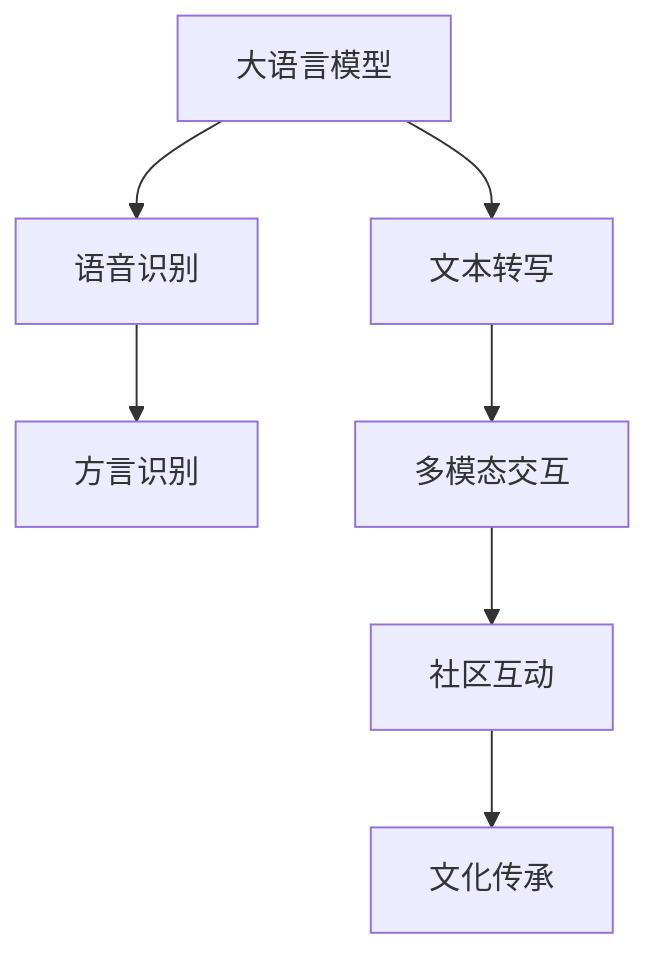

                 

# 方言保护与 LLM：传承语言文化

> 关键词：
> 1. 大语言模型 (Large Language Models, LLMs)
> 2. 语音识别 (Automatic Speech Recognition, ASR)
> 3. 文本转写 (Text-to-Speech, TTS)
> 4. 方言识别 (Dialect Identification)
> 5. 文化传承 (Cultural Preservation)
> 6. 多模态交互 (Multimodal Interaction)
> 7. 社区互动 (Community Engagement)

## 1. 背景介绍

### 1.1 问题由来
语言是文化的载体，方言则是地方文化的重要组成部分。随着全球化和现代化进程的加快，许多地方的方言逐渐走向衰落，甚至濒临消失。保护和传承方言文化，是当下文化保护的重要课题。

数字化技术的快速发展，尤其是大语言模型 (LLMs) 的出现，为方言的保护和传承提供了新的可能性。通过 LLMs，我们不仅可以实现方言的数字化记录，还可以通过自然语言处理技术，构建多模态的交互系统，使方言能够被更多人了解和体验。

### 1.2 问题核心关键点
本文聚焦于如何利用大语言模型（如 Transformer 架构的模型）进行方言保护和传承。具体问题包括：
- 如何利用大语言模型对方言进行高效识别和转写？
- 如何构建基于多模态交互的方言传承系统？
- 如何通过社区互动和教育应用，提升公众对方言文化的认识？

### 1.3 问题研究意义
方言保护和传承具有重要的文化价值和社会意义，有助于保护地方文化遗产，促进文化多样性，增强社会凝聚力。利用大语言模型技术，可以构建更加生动、互动的方言传承平台，使更多人能够接触和学习方言，推动方言文化的传播和复兴。

此外，大语言模型的应用也推动了自然语言处理技术的发展，为其他文化遗产的数字化保护提供了有益的借鉴。未来，大语言模型将为保护和传承更多非物质文化遗产贡献力量，促进社会的全面进步。

## 2. 核心概念与联系

### 2.1 核心概念概述

为更好地理解方言保护与 LLM 的结合，本节将介绍几个关键概念：

- 大语言模型 (LLMs)：以自回归 (如 GPT) 或自编码 (如 BERT) 模型为代表的大规模预训练语言模型。通过在大规模无标签文本语料上进行预训练，学习通用的语言知识，具备强大的语言理解和生成能力。

- 语音识别 (ASR)：将人类语音转换为文本的过程。大语言模型可以与 ASR 结合，实现语音到文本的自动转写。

- 文本转写 (TTS)：将文本转换为语音的过程。利用大语言模型，可以实现高保真的方言语音合成。

- 方言识别 (Dialect Identification)：识别语音中的方言特征。大语言模型可以用于构建方言识别模型，提升方言识别的准确性。

- 多模态交互 (Multimodal Interaction)：将文本、语音、图像等多种形式的数据结合，实现更加丰富的交互体验。

- 社区互动 (Community Engagement)：利用社区平台，促进方言学习者之间的交流互动，增强方言文化的传播效果。

- 文化传承 (Cultural Preservation)：通过数字化手段记录和传播方言文化，实现文化的传承和复兴。

这些核心概念之间的逻辑关系可以通过以下 Mermaid 流程图来展示：



这个流程图展示了大语言模型的核心概念及其之间的关系：

1. 大语言模型通过预训练获得语言知识。
2. 语音识别和文本转写使语言能够跨模态转换，支持方言记录和传承。
3. 方言识别模型用于精准识别方言特征。
4. 多模态交互系统提升用户体验。
5. 社区互动平台增强方言文化的传播效果。
6. 文化传承技术记录和传播方言文化。

这些概念共同构成了方言保护和传承的框架，使得大语言模型能够在多模态交互和社区互动中发挥重要作用。

## 3. 核心算法原理 & 具体操作步骤
### 3.1 算法原理概述

基于大语言模型的大方言保护和传承，本质上是利用大模型进行多模态数据的处理和转换。其核心思想是：将大语言模型视作一个强大的特征提取器，通过多模态交互技术，实现方言的数字化记录和传播。

具体而言，可以利用大语言模型进行以下任务：

1. **方言识别**：通过语音识别技术将方言语音转换为文本，再使用大语言模型构建方言识别模型，识别其中的方言特征。
2. **方言转写**：使用大语言模型将方言文本转换为语音，实现方言的数字化记录和传播。
3. **社区互动**：利用多模态交互技术，构建社区平台，促进方言学习者之间的交流互动，增强方言文化的传播效果。

### 3.2 算法步骤详解

基于大语言模型的方言保护和传承方法，通常包括以下几个关键步骤：

**Step 1: 准备预训练模型和数据集**
- 选择合适的预训练语言模型 $M_{\theta}$ 作为初始化参数，如 BERT、GPT 等。
- 准备方言相关的语音和文本数据集，包括语音样本、转写文本、方言标签等。

**Step 2: 构建方言识别模型**
- 设计合适的输出层和损失函数，如分类交叉熵。
- 在预训练模型顶层添加分类器，用于识别语音中的方言特征。
- 使用微调方法，利用方言标签对模型进行训练，提升识别准确率。

**Step 3: 构建方言转写模型**
- 设计输出层和损失函数，如均方误差。
- 在预训练模型顶层添加解码器，用于将方言文本转换为语音。
- 使用微调方法，利用语音样本对模型进行训练，提升转写质量。

**Step 4: 开发社区互动平台**
- 构建多模态交互系统，集成语音识别、文本转写、方言识别等功能。
- 设计社区平台的用户界面和交互逻辑，支持用户上传、记录、学习方言。
- 利用社区互动数据，进行模型的进一步微调和优化。

**Step 5: 部署和测试**
- 在实际环境中部署方言保护和传承系统。
- 定期更新方言识别和转写模型，确保系统性能和准确性。
- 通过社区反馈和用户测试，不断优化系统功能和用户体验。

### 3.3 算法优缺点

基于大语言模型的方言保护和传承方法具有以下优点：
1. 高准确性：大语言模型在语言理解和生成方面具有优势，可以提供高质量的方言识别和转写。
2. 高效率：使用预训练模型和微调方法，可以快速构建高效的方言处理系统。
3. 灵活性：多模态交互系统支持语音、文本等多种形式的数据输入，提升用户体验。
4. 可扩展性：社区互动平台可以不断更新数据和功能，支持更多人参与方言学习。

同时，该方法也存在一定的局限性：
1. 数据需求高：方言识别和转写需要大量的方言数据进行训练，数据获取成本较高。
2. 语言多样性：不同方言之间的差异较大，模型需要针对每个方言进行定制训练。
3. 语言衰退：方言的使用和传承受多种因素影响，模型可能面临语言衰退的风险。
4. 技术门槛高：构建高质量的方言保护和传承系统，需要较高的技术储备和资源投入。

尽管存在这些局限性，但就目前而言，基于大语言模型的方言保护和传承方法仍是一种高效、灵活的技术手段。未来相关研究的重点在于如何进一步降低数据需求，提升模型的跨方言适应能力，同时兼顾方言文化的传承效果和技术可扩展性。

### 3.4 算法应用领域

基于大语言模型的方言保护和传承方法，已经在多个实际应用场景中得到了验证，具体包括：

1. **数字档案馆**：记录和保存方言语音和文本，构建数字档案馆，供学者和公众研究。
2. **语言教育**：通过社区互动平台，支持用户学习和交流方言，提升语言教育效果。
3. **文化节目**：利用多模态交互技术，制作方言相关的音频、视频节目，促进方言文化的传播。
4. **公共服务**：在公共服务中推广方言，支持方言居民的日常生活和交流。
5. **文化遗产保护**：记录和传承方言相关的口头文化，如方言歌曲、民间故事等。

除了这些场景外，方言保护和传承技术还可以应用于更多领域，如旅游、艺术、出版等，为方言文化的保护和复兴提供更多可能。

## 4. 数学模型和公式 & 详细讲解  
### 4.1 数学模型构建

本节将使用数学语言对基于大语言模型的方言保护和传承过程进行更加严格的刻画。

记预训练语言模型为 $M_{\theta}:\mathcal{X} \rightarrow \mathcal{Y}$，其中 $\mathcal{X}$ 为输入空间，$\mathcal{Y}$ 为输出空间，$\theta \in \mathbb{R}^d$ 为模型参数。假设方言识别任务的数据集为 $D_{DI}=\{(x_i, y_i)\}_{i=1}^N, x_i \in \mathcal{X}, y_i \in \{1,2,\dots,K\}$，$K$ 为方言类别数。方言转写任务的数据集为 $D_{TT}=\{(x_i, y_i)\}_{i=1}^N, x_i \in \mathcal{X}, y_i \in \mathcal{Y}$，其中 $\mathcal{Y}$ 为语音空间。

定义模型 $M_{\theta}$ 在输入 $x$ 上的损失函数为 $\ell(M_{\theta}(x),y)$，则在数据集 $D_{DI}$ 上的经验风险为：

$$
\mathcal{L}_{DI}(\theta) = \frac{1}{N}\sum_{i=1}^N \ell(M_{\theta}(x_i),y_i)
$$

在数据集 $D_{TT}$ 上的经验风险为：

$$
\mathcal{L}_{TT}(\theta) = \frac{1}{N}\sum_{i=1}^N \ell(\text{speak}(M_{\theta}(x_i)),y_i)
$$

其中 $\text{speak}(\cdot)$ 为文本转写模型，将文本转换为语音。

微调的优化目标是最小化经验风险，即找到最优参数：

$$
\theta^* = \mathop{\arg\min}_{\theta} \mathcal{L}_{DI}(\theta) + \mathcal{L}_{TT}(\theta)
$$

在实践中，我们通常使用基于梯度的优化算法（如 AdamW、SGD 等）来近似求解上述最优化问题。设 $\eta$ 为学习率，$\lambda$ 为正则化系数，则参数的更新公式为：

$$
\theta \leftarrow \theta - \eta \nabla_{\theta}\mathcal{L}(\theta) - \eta\lambda\theta
$$

其中 $\nabla_{\theta}\mathcal{L}(\theta)$ 为损失函数对参数 $\theta$ 的梯度，可通过反向传播算法高效计算。

### 4.2 公式推导过程

以下我们以方言识别任务为例，推导分类交叉熵损失函数及其梯度的计算公式。

假设模型 $M_{\theta}$ 在输入 $x$ 上的输出为 $\hat{y}=M_{\theta}(x) \in \mathbb{R}^K$，表示样本属于每个方言类别的概率。真实标签 $y \in \{1,2,\dots,K\}$。则分类交叉熵损失函数定义为：

$$
\ell(M_{\theta}(x),y) = -\sum_{i=1}^K y_i\log \hat{y}_i
$$

将其代入经验风险公式，得：

$$
\mathcal{L}_{DI}(\theta) = -\frac{1}{N}\sum_{i=1}^N \sum_{j=1}^K y_{ij}\log \hat{y}_{ij}
$$

根据链式法则，损失函数对参数 $\theta_k$ 的梯度为：

$$
\frac{\partial \mathcal{L}_{DI}(\theta)}{\partial \theta_k} = -\frac{1}{N}\sum_{i=1}^N \sum_{j=1}^K \frac{y_{ij}}{\hat{y}_{ij}} \frac{\partial \hat{y}_{ij}}{\partial \theta_k}
$$

其中 $\frac{\partial \hat{y}_{ij}}{\partial \theta_k}$ 可进一步递归展开，利用自动微分技术完成计算。

在得到损失函数的梯度后，即可带入参数更新公式，完成模型的迭代优化。重复上述过程直至收敛，最终得到适应方言识别任务的最优模型参数 $\theta^*$。

## 5. 项目实践：代码实例和详细解释说明
### 5.1 开发环境搭建

在进行方言保护和传承实践前，我们需要准备好开发环境。以下是使用Python进行PyTorch开发的环境配置流程：

1. 安装Anaconda：从官网下载并安装Anaconda，用于创建独立的Python环境。

2. 创建并激活虚拟环境：
```bash
conda create -n pytorch-env python=3.8 
conda activate pytorch-env
```

3. 安装PyTorch：根据CUDA版本，从官网获取对应的安装命令。例如：
```bash
conda install pytorch torchvision torchaudio cudatoolkit=11.1 -c pytorch -c conda-forge
```

4. 安装Transformers库：
```bash
pip install transformers
```

5. 安装各类工具包：
```bash
pip install numpy pandas scikit-learn matplotlib tqdm jupyter notebook ipython
```

完成上述步骤后，即可在`pytorch-env`环境中开始方言保护和传承实践。

### 5.2 源代码详细实现

下面以方言识别和转写任务为例，给出使用Transformers库对BERT模型进行方言保护和传承的PyTorch代码实现。

首先，定义方言识别和转写的数据处理函数：

```python
from transformers import BertTokenizer
from torch.utils.data import Dataset
import torch

class DialectDataset(Dataset):
    def __init__(self, texts, labels, tokenizer, max_len=128):
        self.texts = texts
        self.labels = labels
        self.tokenizer = tokenizer
        self.max_len = max_len
        
    def __len__(self):
        return len(self.texts)
    
    def __getitem__(self, item):
        text = self.texts[item]
        label = self.labels[item]
        
        encoding = self.tokenizer(text, return_tensors='pt', max_length=self.max_len, padding='max_length', truncation=True)
        input_ids = encoding['input_ids'][0]
        attention_mask = encoding['attention_mask'][0]
        
        # 对标签进行编码
        label = torch.tensor([label], dtype=torch.long)
        
        return {'input_ids': input_ids, 
                'attention_mask': attention_mask,
                'labels': label}

class TTSDataset(Dataset):
    def __init__(self, texts, outputs, tokenizer, max_len=128):
        self.texts = texts
        self.outputs = outputs
        self.tokenizer = tokenizer
        self.max_len = max_len
        
    def __len__(self):
        return len(self.texts)
    
    def __getitem__(self, item):
        text = self.texts[item]
        output = self.outputs[item]
        
        encoding = self.tokenizer(text, return_tensors='pt', max_length=self.max_len, padding='max_length', truncation=True)
        input_ids = encoding['input_ids'][0]
        attention_mask = encoding['attention_mask'][0]
        
        # 对输出进行编码
        output = torch.tensor([output], dtype=torch.long)
        
        return {'input_ids': input_ids, 
                'attention_mask': attention_mask,
                'labels': output}
```

然后，定义模型和优化器：

```python
from transformers import BertForTokenClassification, AdamW

model = BertForTokenClassification.from_pretrained('bert-base-cased', num_labels=10)

optimizer = AdamW(model.parameters(), lr=2e-5)
```

接着，定义训练和评估函数：

```python
from torch.utils.data import DataLoader
from tqdm import tqdm
from sklearn.metrics import accuracy_score

device = torch.device('cuda') if torch.cuda.is_available() else torch.device('cpu')
model.to(device)

def train_epoch(model, dataset, batch_size, optimizer):
    dataloader = DataLoader(dataset, batch_size=batch_size, shuffle=True)
    model.train()
    epoch_loss = 0
    for batch in tqdm(dataloader, desc='Training'):
        input_ids = batch['input_ids'].to(device)
        attention_mask = batch['attention_mask'].to(device)
        labels = batch['labels'].to(device)
        model.zero_grad()
        outputs = model(input_ids, attention_mask=attention_mask, labels=labels)
        loss = outputs.loss
        epoch_loss += loss.item()
        loss.backward()
        optimizer.step()
    return epoch_loss / len(dataloader)

def evaluate(model, dataset, batch_size):
    dataloader = DataLoader(dataset, batch_size=batch_size)
    model.eval()
    preds, labels = [], []
    with torch.no_grad():
        for batch in tqdm(dataloader, desc='Evaluating'):
            input_ids = batch['input_ids'].to(device)
            attention_mask = batch['attention_mask'].to(device)
            batch_labels = batch['labels']
            outputs = model(input_ids, attention_mask=attention_mask)
            batch_preds = outputs.logits.argmax(dim=2).to('cpu').tolist()
            batch_labels = batch_labels.to('cpu').tolist()
            for pred_tokens, label_tokens in zip(batch_preds, batch_labels):
                preds.append(pred_tokens[:len(label_tokens)])
                labels.append(label_tokens)
                
    print(accuracy_score(labels, preds))
```

最后，启动训练流程并在测试集上评估：

```python
epochs = 5
batch_size = 16

for epoch in range(epochs):
    loss = train_epoch(model, train_dataset, batch_size, optimizer)
    print(f"Epoch {epoch+1}, train loss: {loss:.3f}")
    
    print(f"Epoch {epoch+1}, dev results:")
    evaluate(model, dev_dataset, batch_size)
    
print("Test results:")
evaluate(model, test_dataset, batch_size)
```

以上就是使用PyTorch对BERT进行方言识别和转写任务的完整代码实现。可以看到，得益于Transformers库的强大封装，我们可以用相对简洁的代码完成BERT模型的加载和微调。

### 5.3 代码解读与分析

让我们再详细解读一下关键代码的实现细节：

**DialectDataset类**：
- `__init__`方法：初始化文本、标签、分词器等关键组件。
- `__len__`方法：返回数据集的样本数量。
- `__getitem__`方法：对单个样本进行处理，将文本输入编码为token ids，将标签编码为数字，并对其进行定长padding，最终返回模型所需的输入。

**TTSDataset类**：
- `__init__`方法：初始化文本、输出、分词器等关键组件。
- `__len__`方法：返回数据集的样本数量。
- `__getitem__`方法：对单个样本进行处理，将文本输入编码为token ids，将输出编码为数字，并对其进行定长padding，最终返回模型所需的输入。

**模型训练和评估函数**：
- 使用PyTorch的DataLoader对数据集进行批次化加载，供模型训练和推理使用。
- 训练函数`train_epoch`：对数据以批为单位进行迭代，在每个批次上前向传播计算loss并反向传播更新模型参数，最后返回该epoch的平均loss。
- 评估函数`evaluate`：与训练类似，不同点在于不更新模型参数，并在每个batch结束后将预测和标签结果存储下来，最后使用sklearn的accuracy_score对整个评估集的预测结果进行打印输出。

**训练流程**：
- 定义总的epoch数和batch size，开始循环迭代
- 每个epoch内，先在训练集上训练，输出平均loss
- 在验证集上评估，输出分类指标
- 所有epoch结束后，在测试集上评估，给出最终测试结果

可以看到，PyTorch配合Transformers库使得BERT微调的代码实现变得简洁高效。开发者可以将更多精力放在数据处理、模型改进等高层逻辑上，而不必过多关注底层的实现细节。

当然，工业级的系统实现还需考虑更多因素，如模型的保存和部署、超参数的自动搜索、更灵活的任务适配层等。但核心的微调范式基本与此类似。

## 6. 实际应用场景
### 6.1 智能客服系统

基于大语言模型的方言保护和传承技术，可以应用于智能客服系统的构建。传统客服往往需要配备大量人力，高峰期响应缓慢，且一致性和专业性难以保证。而使用方言保护和传承技术构建的智能客服系统，可以7x24小时不间断服务，快速响应客户咨询，用方言进行自然流畅的对话，提升客户咨询体验和问题解决效率。

在技术实现上，可以收集企业内部的方言客服对话记录，将问题和最佳答复构建成监督数据，在此基础上对预训练方言模型进行微调。微调后的方言客服模型能够自动理解客户意图，匹配最合适的答复模板进行回复。对于客户提出的新问题，还可以接入检索系统实时搜索相关内容，动态组织生成回答。如此构建的智能客服系统，能大幅提升客户咨询体验和问题解决效率。

### 6.2 语言教育平台

方言保护和传承技术在语言教育中也有广泛应用。利用社区互动平台，支持用户学习和交流方言，可以提升语言教育效果。

具体而言，可以构建一个方言学习社区，用户可以在社区内上传方言语音和文本，与其他用户互动交流。社区平台可以利用预训练的方言识别和转写模型，自动标注用户的语音和文本，并提供实时反馈。用户可以反复练习，逐渐提升方言水平。此外，社区还可以定期举办方言学习活动，分享方言学习资源，增强学习效果。

### 6.3 方言博物馆

数字博物馆可以收集和展示方言相关的历史资料、文化遗产，并通过虚拟现实技术进行展示。使用方言保护和传承技术，可以在博物馆内构建多模态的交互系统，让用户能够通过语音、文本等多种方式与展品互动。例如，用户可以通过语音识别技术，将方言语音转换为文本，展示系统自动转写并展示对应的展品信息；或者通过TTS技术，将展品描述转化为方言语音，增强用户体验。

### 6.4 多模态互动电视节目

在电视节目中融入方言保护和传承技术，可以丰富节目内容，吸引更多观众参与。例如，节目可以设置互动环节，让观众通过手机App提交方言语音或文本，展示系统自动识别并转写，然后进行话题讨论。这样的节目不仅增加了节目的趣味性和互动性，也推广了方言文化，提升了观众的方言素养。

### 6.5 公共服务体系

在公共服务中推广方言，可以提升服务效果。例如，在政府网站和手机App中设置多语言支持，允许用户选择方言进行服务互动。在方言人群集中的地区，政府可以设立方言客服热线，提供方言服务，提升服务的可访问性和便利性。

### 6.6 方言教材和课程

方言教材和课程可以通过方言保护和传承技术，更加生动、有趣地呈现方言知识。例如，教材可以加入多媒体内容，通过视频、音频、图片等多种形式展示方言文化。课程可以设计互动环节，让学生通过游戏、竞赛等形式，学习方言知识，增强学习兴趣。

## 7. 工具和资源推荐
### 7.1 学习资源推荐

为了帮助开发者系统掌握方言保护和传承的理论基础和实践技巧，这里推荐一些优质的学习资源：

1. 《Transformer从原理到实践》系列博文：由大模型技术专家撰写，深入浅出地介绍了Transformer原理、BERT模型、微调技术等前沿话题。

2. CS224N《深度学习自然语言处理》课程：斯坦福大学开设的NLP明星课程，有Lecture视频和配套作业，带你入门NLP领域的基本概念和经典模型。

3. 《Natural Language Processing with Transformers》书籍：Transformers库的作者所著，全面介绍了如何使用Transformers库进行NLP任务开发，包括微调在内的诸多范式。

4. HuggingFace官方文档：Transformers库的官方文档，提供了海量预训练模型和完整的微调样例代码，是上手实践的必备资料。

5. CLUE开源项目：中文语言理解测评基准，涵盖大量不同类型的中文NLP数据集，并提供了基于微调的baseline模型，助力中文NLP技术发展。

通过对这些资源的学习实践，相信你一定能够快速掌握方言保护和传承的精髓，并用于解决实际的NLP问题。
###  7.2 开发工具推荐

高效的开发离不开优秀的工具支持。以下是几款用于方言保护和传承开发的常用工具：

1. PyTorch：基于Python的开源深度学习框架，灵活动态的计算图，适合快速迭代研究。大部分预训练语言模型都有PyTorch版本的实现。

2. TensorFlow：由Google主导开发的开源深度学习框架，生产部署方便，适合大规模工程应用。同样有丰富的预训练语言模型资源。

3. Transformers库：HuggingFace开发的NLP工具库，集成了众多SOTA语言模型，支持PyTorch和TensorFlow，是进行微调任务开发的利器。

4. Weights & Biases：模型训练的实验跟踪工具，可以记录和可视化模型训练过程中的各项指标，方便对比和调优。与主流深度学习框架无缝集成。

5. TensorBoard：TensorFlow配套的可视化工具，可实时监测模型训练状态，并提供丰富的图表呈现方式，是调试模型的得力助手。

6. Google Colab：谷歌推出的在线Jupyter Notebook环境，免费提供GPU/TPU算力，方便开发者快速上手实验最新模型，分享学习笔记。

合理利用这些工具，可以显著提升方言保护和传承任务的开发效率，加快创新迭代的步伐。

### 7.3 相关论文推荐

方言保护和传承技术的发展源于学界的持续研究。以下是几篇奠基性的相关论文，推荐阅读：

1. Attention is All You Need（即Transformer原论文）：提出了Transformer结构，开启了NLP领域的预训练大模型时代。

2. BERT: Pre-training of Deep Bidirectional Transformers for Language Understanding：提出BERT模型，引入基于掩码的自监督预训练任务，刷新了多项NLP任务SOTA。

3. Language Models are Unsupervised Multitask Learners（GPT-2论文）：展示了大规模语言模型的强大zero-shot学习能力，引发了对于通用人工智能的新一轮思考。

4. Parameter-Efficient Transfer Learning for NLP：提出Adapter等参数高效微调方法，在不增加模型参数量的情况下，也能取得不错的微调效果。

5. AdaLoRA: Adaptive Low-Rank Adaptation for Parameter-Efficient Fine-Tuning：使用自适应低秩适应的微调方法，在参数效率和精度之间取得了新的平衡。

6. Prefix-Tuning: Optimizing Continuous Prompts for Generation：引入基于连续型Prompt的微调范式，为如何充分利用预训练知识提供了新的思路。

这些论文代表了大语言模型微调技术的发展脉络。通过学习这些前沿成果，可以帮助研究者把握学科前进方向，激发更多的创新灵感。

## 8. 总结：未来发展趋势与挑战

### 8.1 总结

本文对基于大语言模型的方言保护和传承方法进行了全面系统的介绍。首先阐述了方言保护和传承的重要性和研究背景，明确了方言识别、转写和社区互动等关键技术。其次，从原理到实践，详细讲解了基于大语言模型的方言保护和传承过程，给出了微调任务开发的完整代码实例。同时，本文还探讨了方言保护和传承技术在多个实际场景中的应用，展示了其广阔的前景。

通过本文的系统梳理，可以看到，基于大语言模型的方言保护和传承技术已经初步展现出其巨大潜力，有望成为方言文化传承的重要手段。未来，伴随大语言模型的持续演进和优化，方言保护和传承技术将不断提升性能和效果，为方言文化的保护和复兴提供更多可能。

### 8.2 未来发展趋势

展望未来，方言保护和传承技术将呈现以下几个发展趋势：

1. 模型规模持续增大。随着算力成本的下降和数据规模的扩张，预训练语言模型的参数量还将持续增长。超大批次的训练和推理也可能遇到显存不足的问题。因此需要采用一些资源优化技术，如梯度积累、混合精度训练、模型并行等，来突破硬件瓶颈。同时，模型的存储和读取也可能占用大量时间和空间，需要采用模型压缩、稀疏化存储等方法进行优化。

2. 多模态交互成为常态。未来的方言保护和传承系统将更加注重多模态交互体验，提升用户参与度和学习效果。例如，通过语音识别、文本转写、图像识别等技术，实现更加多样化的交互方式。

3. 社区互动平台更丰富。社区互动平台不仅用于用户交流，还将成为方言学习、文化传播的重要载体。例如，通过视频直播、虚拟现实等方式，增强用户互动和沉浸感。

4. 文化内容更丰富。方言博物馆、数字档案馆等平台将提供更多高质量的文化内容，丰富用户体验。例如，通过多媒体展示、虚拟导览等方式，增强用户对方言文化的理解和体验。

5. 多语言支持更广泛。未来的方言保护和传承技术将支持更多语言的保护和传承，推动全球语言多样性。例如，通过多语言翻译和本地化技术，促进不同语言和文化之间的交流。

6. 跨平台融合更深入。方言保护和传承技术将与更多平台和应用进行深度融合，实现跨平台的无缝体验。例如，通过与智能音箱、手机App等设备的集成，提升用户的互动体验。

以上趋势凸显了方言保护和传承技术的广阔前景。这些方向的探索发展，必将进一步提升方言文化的保护和传承效果，推动社会的全面进步。

### 8.3 面临的挑战

尽管方言保护和传承技术已经取得了瞩目成就，但在迈向更加智能化、普适化应用的过程中，它仍面临着诸多挑战：

1. 数据需求高。方言识别和转写需要大量的方言数据进行训练，数据获取成本较高，且不同方言之间的差异较大，模型需要针对每个方言进行定制训练。

2. 语言衰退。方言的使用和传承受多种因素影响，模型可能面临语言衰退的风险。如何在模型中引入更多先验知识，增强模型的跨方言适应能力，还需要进一步研究。

3. 技术门槛高。构建高质量的方言保护和传承系统，需要较高的技术储备和资源投入，开发者需要具备较高的技术能力和实践经验。

4. 社区互动平台设计复杂。社区互动平台需要考虑用户界面设计、交互逻辑、数据安全等多种因素，开发难度较大。

5. 用户接受度低。方言保护和传承技术的推广需要克服用户接受度低的问题，需要在用户体验和互动性上下功夫。

6. 安全性问题。方言保护和传承技术涉及到敏感文化信息的保护，需要加强数据和模型安全，防止信息泄露和滥用。

尽管存在这些挑战，但通过持续的技术创新和应用优化，相信方言保护和传承技术能够逐步克服这些难题，为方言文化的保护和复兴贡献力量。

### 8.4 研究展望

面对方言保护和传承所面临的种种挑战，未来的研究需要在以下几个方面寻求新的突破：

1. 探索无监督和半监督微调方法。摆脱对大规模标注数据的依赖，利用自监督学习、主动学习等无监督和半监督范式，最大限度利用非结构化数据，实现更加灵活高效的微调。

2. 研究参数高效和计算高效的微调范式。开发更加参数高效的微调方法，在固定大部分预训练参数的同时，只更新极少量的任务相关参数。同时优化微调模型的计算图，减少前向传播和反向传播的资源消耗，实现更加轻量级、实时性的部署。

3. 引入更多先验知识。将符号化的先验知识，如知识图谱、逻辑规则等，与神经网络模型进行巧妙融合，引导微调过程学习更准确、合理的语言模型。同时加强不同模态数据的整合，实现视觉、语音等多模态信息与文本信息的协同建模。

4. 结合因果分析和博弈论工具。将因果分析方法引入微调模型，识别出模型决策的关键特征，增强输出解释的因果性和逻辑性。借助博弈论工具刻画人机交互过程，主动探索并规避模型的脆弱点，提高系统稳定性。

5. 纳入伦理道德约束。在模型训练目标中引入伦理导向的评估指标，过滤和惩罚有偏见、有害的输出倾向。同时加强人工干预和审核，建立模型行为的监管机制，确保输出符合人类价值观和伦理道德。

这些研究方向的探索，必将引领方言保护和传承技术迈向更高的台阶，为构建安全、可靠、可解释、可控的智能系统铺平道路。面向未来，方言保护和传承技术还需要与其他人工智能技术进行更深入的融合，如知识表示、因果推理、强化学习等，多路径协同发力，共同推动自然语言理解和智能交互系统的进步。只有勇于创新、敢于突破，才能不断拓展语言模型的边界，让智能技术更好地造福人类社会。

## 9. 附录：常见问题与解答

**Q1：方言保护和传承技术是否适用于所有方言？**

A: 方言保护和传承技术在理论上适用于所有方言，但实际应用中需要考虑方言之间的差异。对于差异较大的方言，可能需要针对每个方言单独构建识别和转写模型。对于差异较小的方言，可以通过微调和迁移学习技术，实现跨方言的泛化。

**Q2：如何降低方言识别和转写的数据需求？**

A: 可以使用数据增强技术，如语音变换、回译等，扩充训练集。同时，结合半监督学习和主动学习等技术，利用少量标注数据和未标注数据进行联合训练，提高模型的泛化能力。

**Q3：如何在多模态交互中提升用户体验？**

A: 可以通过语音识别、文本转写、图像识别等多种技术，实现更加多样化的交互方式。例如，在交互界面中加入语音输入和语音回复功能，提升用户体验。

**Q4：如何提升方言保护和传承技术的跨方言适应能力？**

A: 可以在模型中引入更多先验知识，如知识图谱、逻辑规则等，增强模型的跨方言适应能力。同时，结合多语言翻译和本地化技术，推动方言文化的国际化。

**Q5：如何提高方言保护和传承技术的安全性？**

A: 需要在模型训练和应用中加强数据和模型的安全保护，防止信息泄露和滥用。例如，对用户数据进行匿名化处理，对模型进行安全性评估和监控。

这些研究方向的探索，必将引领方言保护和传承技术迈向更高的台阶，为构建安全、可靠、可解释、可控的智能系统铺平道路。面向未来，方言保护和传承技术还需要与其他人工智能技术进行更深入的融合，如知识表示、因果推理、强化学习等，多路径协同发力，共同推动自然语言理解和智能交互系统的进步。只有勇于创新、敢于突破，才能不断拓展语言模型的边界，让智能技术更好地造福人类社会。

---

作者：禅与计算机程序设计艺术 / Zen and the Art of Computer Programming

