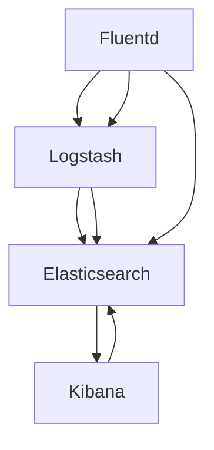

                 

# 日志管理：ELK栈的搭建与使用

## 1. 背景介绍

在现代企业中，日志是记录系统运行状态的重要手段，用于故障排查、性能分析、安全审计等方面。传统日志管理方案通常采用集中式日志管理系统，如syslog、ELK（Elasticsearch、Logstash、Kibana）等。近年来，随着微服务架构和大数据技术的发展，分布式日志管理需求日益增长，ELK栈凭借其强大的数据处理和可视化能力，成为业界广泛使用的日志管理解决方案。

### 1.1 问题由来

ELK栈由Elasticsearch、Logstash和Kibana三部分组成，每个组件均有其独特的功能，共同构建起一套完整的日志管理生态。然而，随着业务规模的增长和应用场景的复杂化，如何高效、灵活地搭建和使用ELK栈，成为了许多开发者和运维人员面临的难题。

### 1.2 问题核心关键点

构建ELK栈的核心在于：
1. **选择合适的硬件和网络环境**。ELK栈需要较强的计算和存储能力，同时需要保证各组件间的通信高效。
2. **合理配置各组件参数**。各组件配置不当可能导致性能瓶颈或资源浪费。
3. **有效处理日志数据**。确保日志数据的质量和完整性，避免丢失和重复。
4. **灵活搭建监控和报警机制**。构建起实时监控和报警机制，及时发现和解决问题。
5. **持续优化和维护**。根据业务需求和数据变化，定期调整ELK栈配置，优化性能。

### 1.3 问题研究意义

高效、稳定地搭建和使用ELK栈，对于提升系统监控能力、保障业务稳定运行、加速问题排查具有重要意义。ELK栈能够实时收集和分析日志数据，提供丰富的可视化界面，帮助团队快速定位问题、优化性能。此外，ELK栈还可以通过机器学习技术，进行异常检测和趋势分析，为业务决策提供有力支持。

## 2. 核心概念与联系

### 2.1 核心概念概述

为更好地理解ELK栈的搭建与使用，本节将介绍几个密切相关的核心概念：

- **Elasticsearch**：分布式搜索引擎，支持高吞吐量的日志存储和查询。
- **Logstash**：日志收集、处理、传输工具，支持多协议输入输出、多过滤器处理。
- **Kibana**：数据可视化平台，提供交互式仪表盘、实时数据展示。
- **Fluentd**：另一个日志收集工具，支持多数据源、多协议和多种输出插件。

这些核心组件之间的逻辑关系可以通过以下Mermaid流程图来展示：



这个流程图展示了大规模日志收集、处理、存储和可视化的全过程：

1. Fluentd收集各服务节点日志，并转发到Logstash。
2. Logstash对日志进行过滤、解析、转换和传输，确保数据质量。
3. Elasticsearch存储处理后的日志数据，并提供高效查询和分析功能。
4. Kibana通过Elasticsearch获取日志数据，并生成各种可视化报表和仪表盘。

这些核心概念共同构成了ELK栈的功能架构，使其能够高效处理大规模日志数据，提供丰富的分析和管理功能。

## 3. 核心算法原理 & 具体操作步骤
### 3.1 算法原理概述

ELK栈的核心算法原理主要集中在日志数据的收集、处理、存储和可视化四个环节。以下详细介绍每个环节的算法原理：

1. **日志收集**：Fluentd和Logstash通过多协议监听和过滤器，从系统中收集日志数据。
2. **日志处理**：Logstash对收集到的日志数据进行过滤、解析、转换和传输，确保日志数据的完整性和格式统一。
3. **日志存储**：Elasticsearch通过分布式存储和索引技术，高效地存储和管理日志数据。
4. **日志可视化**：Kibana通过REST API从Elasticsearch获取日志数据，并生成丰富的可视化报表和仪表盘。

### 3.2 算法步骤详解

ELK栈的搭建和使用方法主要分为以下几个步骤：

**Step 1: 部署环境准备**
- 选择适合的硬件和网络环境，确保ELK栈能够高效运行。
- 安装Elasticsearch、Logstash和Kibana，并配置好各自的参数。

**Step 2: 配置Logstash**
- 配置输入插件，监听日志数据源，如日志文件、网络流等。
- 配置过滤器，对日志数据进行解析、过滤和转换。
- 配置输出插件，将处理后的日志数据转发到Elasticsearch。

**Step 3: 配置Elasticsearch**
- 配置节点和集群参数，确保Elasticsearch集群能够稳定运行。
- 创建索引，定义字段映射，设置shard和replica数量。
- 配置查询分析器，优化搜索性能。

**Step 4: 配置Kibana**
- 创建仪表盘，设计多种视图和仪表盘模板。
- 配置Elasticsearch连接，设置搜索参数和分析功能。
- 导入数据源，创建自定义的可视化报表。

**Step 5: 部署应用和监控**
- 将应用部署到节点上，并开启日志记录。
- 通过ELK栈实时监控日志数据，设置报警机制。
- 定期调整ELK栈配置，优化性能。

### 3.3 算法优缺点

ELK栈作为一种广泛使用的日志管理解决方案，具有以下优点：
1. 高度可扩展：支持分布式部署，能处理海量日志数据。
2. 高效查询和分析：基于Elasticsearch，提供快速的日志搜索和分析功能。
3. 丰富的可视化界面：通过Kibana，生成多种报表和仪表盘，方便分析。
4. 灵活的数据处理：Logstash支持多协议、多过滤器，灵活处理日志数据。

同时，ELK栈也存在一些缺点：
1. 部署复杂：需要熟练掌握各组件的配置和部署，有一定门槛。
2. 学习曲线陡峭：需要一定的学习和使用成本。
3. 性能瓶颈：如不恰当配置，可能出现性能瓶颈，影响系统稳定。
4. 扩展性限制：部分功能如冷存储、热索引等，需要额外配置。

尽管存在这些缺点，但ELK栈在处理大规模日志数据和提供深入分析方面具有显著优势，是当前业界广泛使用的日志管理方案。

### 3.4 算法应用领域

ELK栈在各种日志管理场景中都有广泛应用，包括但不限于以下领域：

- 云服务：AWS、Azure、Google Cloud等云平台都提供了ELK栈的集成支持，方便用户快速搭建和部署。
- 金融：银行、证券等金融机构利用ELK栈进行系统监控、性能分析和安全审计。
- 电商：阿里巴巴、京东等电商平台通过ELK栈监控交易日志、用户行为日志等，保障系统稳定。
- 医疗：医院、诊所等医疗机构利用ELK栈记录患者信息、诊疗日志，提升服务质量。
- 游戏：游戏公司利用ELK栈监控服务器日志、玩家行为日志等，优化游戏体验。

## 4. 数学模型和公式 & 详细讲解 & 举例说明

### 4.1 数学模型构建

在ELK栈中，日志数据被视为文本数据，其核心数学模型构建主要涉及以下几个方面：

1. **日志收集模型**：定义日志数据的输入和输出模型，描述日志数据如何被收集和处理。
2. **日志处理模型**：定义日志数据的过滤器和转换规则，描述日志数据如何被解析和转换。
3. **日志存储模型**：定义Elasticsearch的索引和映射模型，描述日志数据如何被存储和查询。
4. **日志可视化模型**：定义Kibana的仪表盘和报表模型，描述日志数据如何被展示和分析。

### 4.2 公式推导过程

以下以Elasticsearch的索引和查询为例，推导其数学模型和公式：

1. **索引模型**：
   - 索引定义为`_index/_type/_id`，其中`_index`为索引名称，`_type`为文档类型，`_id`为唯一标识符。
   - 索引的数学模型为`{_id} -> {_doc}`，表示索引中每个文档的ID与文档本身。

2. **查询模型**：
   - Elasticsearch提供多种查询方式，如全文搜索、聚合、分页等。
   - 其中，全文搜索的数学模型为`{_query} -> {_doc}`，表示根据查询条件匹配的文档。
   - 分页查询的数学模型为`{_page} -> {_doc}`，表示分页后的文档。

### 4.3 案例分析与讲解

假设我们有一个日志数据集，包含不同服务的日志记录。以下通过一个简单的案例，演示如何利用ELK栈处理和分析这些日志数据：

**案例背景**：某电商网站部署了多个服务，包括订单处理、用户管理、物流查询等。每个服务生成大量的日志数据，需要实时监控和分析。

**步骤一：日志收集**
- 使用Fluentd监听各个服务节点，收集日志数据。
- 配置Logstash，解析日志数据格式，转换为统一格式。

**步骤二：日志处理**
- 在Logstash中添加过滤器，过滤掉无用日志，保留关键日志。
- 对日志数据进行解析，提取必要字段，如时间戳、服务名、操作类型等。

**步骤三：日志存储**
- 在Elasticsearch中创建索引`logstash`，定义字段映射。
- 将处理后的日志数据转发到Elasticsearch，存储在`logstash`索引中。

**步骤四：日志可视化**
- 在Kibana中创建仪表盘，设计多种视图和报表。
- 导入Elasticsearch连接，设置搜索参数和分析功能。
- 添加日志数据源，生成实时监控仪表盘。

## 5. 项目实践：代码实例和详细解释说明
### 5.1 开发环境搭建

在进行ELK栈实践前，我们需要准备好开发环境。以下是使用Linux系统进行ELK栈部署的环境配置流程：

1. 选择适合的硬件和网络环境，确保ELK栈能够高效运行。
2. 安装Elasticsearch、Logstash和Kibana，并配置好各自的参数。
3. 安装依赖库，如libxml2、libffi、curl等。

### 5.2 源代码详细实现

以下是一个简单的ELK栈部署和日志处理流程，包含Fluentd、Logstash和Kibana的配置。

**Fluentd配置**：

```yaml
<source>
    @type fluentd
    port 24224
    <match **/*.log>
        @type log
        grok {
            %{COMBINEDAPACHELOG}
            %{IDENTITY}
        }
        <match>
            %{COMBINEDAPACHELOG}
            %{IPV4:serverip}
            %{IDENTITY:remoteuser}
            %{COMBINEDAPACHELOG:timestamp}
            %{IDENTITY:method}
            %{IDENTITY:requesturi}
            %{COMBINEDAPACHELOG:status}
            %{COMBINEDAPACHELOG:status_code}
            %{COMBINEDAPACHELOG:referer}
            %{IDENTITY:useragent}
            <match %{COMBINEDAPACHELOG:method}>
                'GET'
            </match>
            <match %{COMBINEDAPACHELOG:status}>
                '4'
            </match>
        </match>
        <match>
            %{IDENTITY}
            %{IPV4:serverip}
            %{IDENTITY:remoteuser}
            %{COMBINEDAPACHELOG:timestamp}
            %{IDENTITY:method}
            %{IDENTITY:requesturi}
            %{COMBINEDAPACHELOG:status}
            %{COMBINEDAPACHELOG:status_code}
            %{COMBINEDAPACHELOG:referer}
            %{IDENTITY:useragent}
        </match>
    </source>

    <match **/*.log>
        @type stdout
        message fluentd.v1'
    </match>

    <output plugin='serilog' host='localhost' port='9997' format='json'>
        @type stdout
        message fluentd.v1'
    </output>
</source>
```

**Logstash配置**：

```yaml
input {
    kafka {
        bootstrap_servers 'localhost:9092'
        topic 'logstash-input'
    }
}

filter {
    grok {
        match => { "message" => "%{COMBINEDAPACHELOG}" }
    }
}

output {
    elasticsearch {
        hosts => ["localhost:9200"]
        index => "logstash-index"
        template => "logstash-template.json"
    }
}
```

**Elasticsearch配置**：

```yaml
cluster:
    name: "logstash-cluster"

    node:
        name: "node1"
        host: "localhost"
        port: 9200

    discovery:
        node:
            name: "node1"
            host: "localhost"
            port: 9300
```

**Kibana配置**：

1. 安装Kibana，并配置好Elasticsearch连接。
2. 创建仪表盘，添加日志数据源。
3. 设计多种报表和仪表盘模板。

### 5.3 代码解读与分析

让我们再详细解读一下关键代码的实现细节：

**Fluentd配置**：
- 定义了一个Fluentd输入源，监听本地所有日志文件，解析Apache日志格式，提取必要字段。
- 将解析后的日志数据转发到本地Serilog输出。

**Logstash配置**：
- 定义了一个Kafka输入源，从Kafka主题中读取日志数据。
- 通过Grok过滤器解析日志数据，提取必要字段。
- 将解析后的日志数据输出到Elasticsearch索引中。

**Elasticsearch配置**：
- 定义了一个Elasticsearch集群，包含一个节点和一个发现节点。
- 节点运行在本地，监听9200端口，发现节点监听9300端口。

**Kibana配置**：
- 安装Kibana，并配置好Elasticsearch连接。
- 创建仪表盘，添加日志数据源。
- 设计多种报表和仪表盘模板。

可以看到，ELK栈的配置涉及多个组件，需要仔细配置和调试，才能确保各组件协同工作，发挥出最佳性能。

### 5.4 运行结果展示

在配置完成后，ELK栈可以实时收集和分析各个服务的日志数据，生成多种报表和仪表盘。以下是一个简单的实时监控仪表盘示例：

```json
{
  "title": "Server Logs",
  "description": "Real-time monitoring of server logs",
  "rows": [
    {
      "type": "metrics",
      "title": "Request Count",
      "data": [
        {
          "value": 100,
          "timestamp": "2023-04-01T12:00:00Z"
        },
        {
          "value": 150,
          "timestamp": "2023-04-01T13:00:00Z"
        },
        {
          "value": 200,
          "timestamp": "2023-04-01T14:00:00Z"
        }
      ]
    },
    {
      "type": "metrics",
      "title": "Error Rate",
      "data": [
        {
          "value": 0.01,
          "timestamp": "2023-04-01T12:00:00Z"
        },
        {
          "value": 0.02,
          "timestamp": "2023-04-01T13:00:00Z"
        },
        {
          "value": 0.03,
          "timestamp": "2023-04-01T14:00:00Z"
        }
      ]
    }
  ]
}
```

## 6. 实际应用场景

### 6.1 智能运维

ELK栈在智能运维中得到了广泛应用，通过实时监控和分析日志数据，能够及时发现和解决系统问题。

**场景描述**：某电商平台监控其多个服务节点，每个服务节点生成大量日志数据，需要实时监控和分析。

**解决方案**：使用Fluentd和Logstash收集日志数据，Elasticsearch存储日志数据，Kibana生成实时监控仪表盘。

**效果评估**：ELK栈实时监控服务日志，及时发现异常请求和错误，保障系统稳定运行。

### 6.2 网络安全

ELK栈在网络安全领域也有广泛应用，通过分析日志数据，及时发现和防范安全威胁。

**场景描述**：某银行监控其网络安全日志，防范潜在的攻击行为。

**解决方案**：使用Fluentd和Logstash收集安全日志数据，Elasticsearch存储日志数据，Kibana生成安全监控仪表盘。

**效果评估**：ELK栈实时监控网络安全日志，及时发现异常行为和攻击尝试，提高系统安全性。

### 6.3 故障分析

ELK栈在故障分析中也非常实用，通过分析日志数据，能够快速定位和解决问题。

**场景描述**：某电商网站在用户高峰期出现性能瓶颈，需要快速定位问题。

**解决方案**：使用Fluentd和Logstash收集服务日志数据，Elasticsearch存储日志数据，Kibana生成性能监控仪表盘。

**效果评估**：ELK栈实时监控服务日志，快速定位性能瓶颈，保障用户满意度。

## 7. 工具和资源推荐

### 7.1 学习资源推荐

为了帮助开发者系统掌握ELK栈的理论基础和实践技巧，这里推荐一些优质的学习资源：

1. ELK官方文档：ELK官方网站提供了详细的文档和示例，包括安装、配置、使用等各个方面的信息。
2. ELK斯坦福课程：斯坦福大学开设的ELK课程，有Lecture视频和配套作业，带你入门ELK栈的使用。
3. ELK实战指南：Hacker News上的一篇实战指南，详细介绍了ELK栈的搭建和配置，适合实战练习。
4. ELK实践项目：GitHub上众多ELK栈实践项目，包含完整的代码和配置文件，适合学习和参考。

通过对这些资源的学习实践，相信你一定能够快速掌握ELK栈的搭建和使用方法，并用于解决实际的日志管理问题。

### 7.2 开发工具推荐

高效的开发离不开优秀的工具支持。以下是几款用于ELK栈搭建和使用的常用工具：

1. ElasticSearch：ELK栈的核心组件之一，支持高吞吐量的日志存储和查询。
2. Logstash：日志收集、处理、传输工具，支持多协议输入输出、多过滤器处理。
3. Kibana：数据可视化平台，提供交互式仪表盘、实时数据展示。
4. Fluentd：日志收集工具，支持多数据源、多协议和多种输出插件。
5. Beats：ELK栈的轻量级数据采集器，支持系统日志、应用日志等数据源。
6. Logstash Exporter：用于将ELK栈数据导出到其他系统，如Graphite、Prometheus等。
7. Kibana Template Library：Kibana模板库，包含多种预定义的仪表盘和报表模板。

合理利用这些工具，可以显著提升ELK栈的搭建和使用方法，加快创新迭代的步伐。

### 7.3 相关论文推荐

ELK栈的研究源于学界的持续研究。以下是几篇奠基性的相关论文，推荐阅读：

1. Elasticsearch: A Distributed Real-Time Search Engine：介绍Elasticsearch的分布式存储和查询机制。
2. Logstash: A Distributed Streaming Log Processor：介绍Logstash的多协议输入输出和过滤器处理。
3. Kibana: An open-source data visualization and exploration tool：介绍Kibana的数据可视化功能。
4. Fluentd: The Hubbub of Machine-to-Machine Communication：介绍Fluentd的日志收集和传输机制。

这些论文代表了大规模日志管理系统的研究进展，通过学习这些前沿成果，可以帮助研究者把握学科前进方向，激发更多的创新灵感。

## 8. 总结：未来发展趋势与挑战

### 8.1 总结

本文对ELK栈的搭建与使用进行了全面系统的介绍。首先阐述了ELK栈的背景和核心概念，明确了各组件的职责和联系。其次，从原理到实践，详细讲解了ELK栈的配置和使用方法，给出了完整的代码实例和详细解释。同时，本文还广泛探讨了ELK栈在智能运维、网络安全、故障分析等多个场景中的应用，展示了ELK栈的强大功能。

通过本文的系统梳理，可以看到，ELK栈在日志管理领域具有广泛的应用前景，能够高效处理大规模日志数据，提供丰富的分析和管理功能。未来，伴随技术的持续演进，ELK栈必将迎来更多的应用场景，进一步提升日志管理的效率和精度。

### 8.2 未来发展趋势

展望未来，ELK栈的发展趋势主要集中在以下几个方面：

1. **分布式架构**：随着业务规模的增长，分布式ELK栈将进一步优化，提高系统扩展性和性能。
2. **自动化配置**：通过自动配置工具，减少人工配置的工作量，提高配置效率。
3. **机器学习应用**：引入机器学习技术，进行异常检测、预测分析等高级功能，提升日志管理的智能化水平。
4. **多模态数据处理**：支持多种数据源，包括日志、指标、事件等，实现多模态数据综合分析。
5. **实时数据处理**：优化数据处理流程，支持实时数据查询和分析，提高响应速度。
6. **增强可视化能力**：通过更多图表和交互式界面，提升数据分析的可视化和可操作性。

以上趋势凸显了ELK栈在日志管理领域的广阔前景，这些方向的探索发展，必将进一步提升日志管理的效率和精度，为系统稳定运行提供有力保障。

### 8.3 面临的挑战

尽管ELK栈已经取得了显著的成就，但在迈向更加智能化、普适化应用的过程中，它仍面临诸多挑战：

1. **配置复杂**：ELK栈各组件配置较为复杂，需要较高的技术门槛。
2. **性能瓶颈**：如不恰当配置，可能出现性能瓶颈，影响系统稳定。
3. **扩展性限制**：部分功能如冷存储、热索引等，需要额外配置。
4. **安全风险**：日志数据中可能包含敏感信息，需要保障数据安全。
5. **更新成本**：ELK栈组件需要定期更新，维护成本较高。

尽管存在这些挑战，但ELK栈在处理大规模日志数据和提供深入分析方面具有显著优势，是当前业界广泛使用的日志管理方案。未来，通过不断优化配置和改进性能，ELK栈必将进一步提升其在日志管理领域的应用价值。

### 8.4 研究展望

面对ELK栈面临的挑战，未来的研究需要在以下几个方面寻求新的突破：

1. **自动化配置工具**：开发更智能的配置工具，减少人工配置的工作量，提高配置效率。
2. **高性能优化**：优化数据处理流程，提高系统扩展性和性能。
3. **安全防护机制**：引入安全防护机制，保障日志数据的安全性和隐私性。
4. **机器学习融合**：将机器学习技术引入ELK栈，实现高级功能，如异常检测、预测分析等。
5. **多模态数据处理**：支持多种数据源，实现多模态数据综合分析。

这些研究方向的探索，必将引领ELK栈技术迈向更高的台阶，为构建安全、可靠、可解释、可控的智能系统铺平道路。面向未来，ELK栈还需要与其他人工智能技术进行更深入的融合，如知识表示、因果推理、强化学习等，多路径协同发力，共同推动日志管理系统的进步。只有勇于创新、敢于突破，才能不断拓展ELK栈的边界，让智能技术更好地造福人类社会。

## 9. 附录：常见问题与解答

**Q1：ELK栈的性能瓶颈如何优化？**

A: 优化ELK栈性能主要从以下几个方面入手：
1. 优化索引配置：合理设置索引分片和副本数量，确保查询性能。
2. 优化搜索参数：调整搜索参数，如缓存大小、查询缓存等，提高查询效率。
3. 优化数据传输：使用多线程和批量处理，减少数据传输的延迟。
4. 优化过滤器和插件：优化过滤器和插件的性能，减少日志处理时间。
5. 监控和调整：实时监控ELK栈性能指标，及时调整配置。

**Q2：如何保障ELK栈的安全性？**

A: 保障ELK栈的安全性主要从以下几个方面入手：
1. 数据加密：对日志数据进行加密，防止数据泄露。
2. 访问控制：设置严格的访问控制策略，限制非法访问。
3. 日志审计：记录和审计日志数据的操作记录，防止恶意操作。
4. 异常检测：引入异常检测算法，及时发现异常行为。
5. 定期审计：定期审计日志数据的使用情况，防止数据滥用。

**Q3：ELK栈如何支持多模态数据处理？**

A: 支持多模态数据处理主要从以下几个方面入手：
1. 多数据源采集：通过Fluentd、Beats等工具，支持多种数据源，如日志、指标、事件等。
2. 统一数据格式：使用标准数据格式，如JSON、CSV等，确保数据的一致性。
3. 多模态分析：通过引入机器学习技术，支持多模态数据的综合分析，提升分析的深度和广度。
4. 多模态可视化：通过Kibana，生成多种报表和仪表盘，支持多种数据类型的可视化展示。

通过多模态数据的处理，ELK栈能够更加全面地分析系统状态，提升日志管理的精度和效率。

**Q4：ELK栈的扩展性如何提升？**

A: 提升ELK栈的扩展性主要从以下几个方面入手：
1. 分布式架构：采用分布式部署，提高系统的扩展性和性能。
2. 水平扩展：增加节点数量，提高系统的处理能力。
3. 垂直扩展：增加硬件资源，提升单个节点的性能。
4. 自动扩展：引入自动扩展机制，根据系统负载动态调整节点数量。
5. 弹性伸缩：根据业务需求，灵活调整资源配置，提高系统的稳定性和性能。

通过合理的扩展策略，ELK栈能够更好地应对业务规模的增长，保障系统的稳定运行。

**Q5：ELK栈如何处理海量日志数据？**

A: 处理海量日志数据主要从以下几个方面入手：
1. 分布式存储：使用Elasticsearch的分布式存储机制，确保数据的可靠性和高可用性。
2. 数据压缩：对日志数据进行压缩，减少存储空间。
3. 数据分区：根据时间、地域等维度，对日志数据进行分区，提高查询效率。
4. 数据归档：定期归档历史数据，减少当前系统的负担。
5. 数据过滤：通过Logstash过滤器，过滤无用数据，减少数据量。

通过这些技术手段，ELK栈能够高效地处理和存储海量日志数据，保障系统的稳定运行。

---

作者：禅与计算机程序设计艺术 / Zen and the Art of Computer Programming

